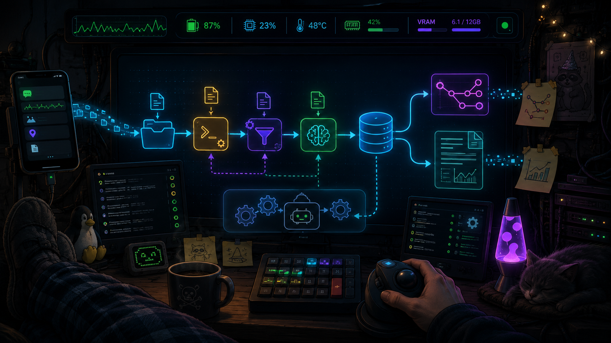
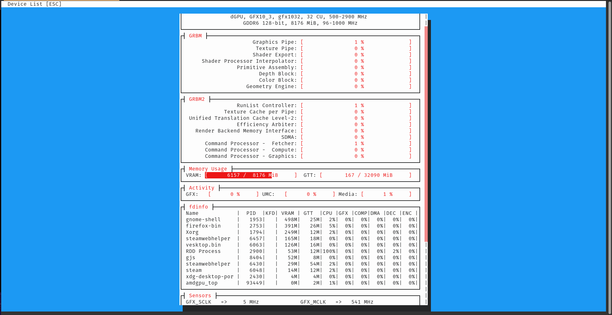

README is out of date, I've added in some functionality where you can use OpenAI/ChatGPT as an option using environment variables. The code in here will function as is, but I need to update this README. Thanks for READing ME.



# Toaster Chess Analysis

PGN ingestion, Stockfish analysis, Ollama commentary, MariaDB-backed prompt telemetry, and GitHub-published Markdown reports for games exported from my crappy [Android chess app](https://play.google.com/store/apps/details?id=uk.co.aifactory.chessfree&hl=en_US).

This repo exists because I wanted my phone chess games to get roasted automatically.

It has now become infrastructure. Obviously. Because apparently exporting a chess game from a phone required a local LLM, Stockfish, MariaDB, systemd, KDE Connect, GitHub, and a GNOME status line that tattles on VRAM.

MariaDB's password in this project is password. This is not best security practice. Do not do as I have done. There shouldn't be any spots where this says /usr/bin/python3, I think I caught all of them and changed them to be /usr/bin/python. This is a reminder to sudo apt install or whatever your package manager of choice is, [python-is-python3](https://packages.debian.org/sid/python-is-python3). If I can move off of 2.7.10, you can too. I believe in you.

## What This Does

- Phone chess app exports a `.pgn`.
- KDE Connect sends the `.pgn` to my desktop.
- A user `systemd` timer checks for new PGNs.
- The poller imports new PGNs into this repo.
- Stockfish analyzes the game.
- Python selects key moments and renders SVG chessboards.
- Ollama writes short rude game stories and move notes.
- MariaDB records Ollama prompts, responses, summaries, move-note memory, and phrase cooldowns.
- Python generates Markdown reports with chessboard diagrams.
- Git commits and pushes the reports.
- I read the pretty GitHub Markdown on my phone.

## Basic Flow

- Phone game happens.
- PGN gets sent to desktop.
- Desktop toaster eats PGN.
- Stockfish says who screwed up.
- Ollama says it in human-ish trash language.
- MariaDB remembers what Ollama said and what it was fed.
- GitHub gets the report.
- I laugh or learn. Possibly both.

## Source Of Truth

Stockfish and the PGN are the truth.

Ollama is commentary. It is allowed to be rude, dumb, vulgar, and occasionally wrong about vibes.

It is **not** allowed to be wrong about who won the damn game.

The important contract:

- PGN result decides winner/loser.
- Side mapping decides whether the user won or lost.
- Stockfish decides move quality.
- Ollama only narrates around those facts.

If Ollama contradicts the PGN result, Ollama is wrong.

## Repo Layout

- `games/raw_pgn/`
  - Raw PGNs copied from the phone.

- `analysis/`
  - Generated Markdown reports.

- `analysis/assets/`
  - SVG chessboard diagrams for final positions and key moments.

- `scripts/rebuild_pretty_analysis.py`
  - Thin manual rebuild entrypoint.
  - Should stay boring.
  - Calls into `lib/analysis.py` and the Ollama narrator.

- `scripts/poll_pgns_push_analysis.py`
  - Workflow script.
  - Imports PGNs, runs analysis, commits/pushes.
  - Belongs in `scripts/`, not `lib/`, because it shells out to git and moves files.

- `lib/analysis.py`
  - Pure chess/reporting layer.
  - PGN parsing.
  - Stockfish analysis.
  - Move classification.
  - Key-moment selection.
  - SVG rendering.
  - Markdown report generation.
  - Does **not** know MariaDB exists.

- `lib/ollama_phrase_memory.py`
  - Ollama + MariaDB boundary.
  - Builds Ollama prompts.
  - Calls Ollama.
  - Logs prompt/response/error records.
  - Stores move-note memory.
  - Stores game summaries.
  - Manages summary phrase cooldowns.
  - Keeps the LLM weirdness contained.

## Manual Rebuild

Run this to rebuild all reports from the raw PGNs:

```bash
python scripts/rebuild_pretty_analysis.py --force
```

Disable Ollama for a deterministic rebuild:

```bash
TOASTER_USE_OLLAMA=0 python scripts/rebuild_pretty_analysis.py --force
```

Enable Ollama debug files:

```bash
TOASTER_DEBUG_OLLAMA=1 python scripts/rebuild_pretty_analysis.py --force
```

Debug files go under:

```text
analysis/debug_ollama_io/
```

## Timer

The desktop poller is handled by a user systemd timer.

Check timer status:

```bash
systemctl --user status toaster-chess-poll.timer
```

Manually kick the poller:

```bash
systemctl --user start toaster-chess-poll.service
```

Check poller logs:

```bash
journalctl --user -u toaster-chess-poll.service -n 120 --no-pager -l
```

Current intended service shape:

```ini
[Unit]
Description=Poll KDE Connect PGNs and rebuild toaster chess analysis

[Service]
Type=oneshot
WorkingDirectory=%h/repos/toaster_chess_analysis
Environment=TOASTER_OLLAMA_MODEL=dolphin-mistral
Environment=TOASTER_MYSQL_PASSWORD=password
ExecStart=/usr/bin/python ~/repos/toaster_chess_analysis/scripts/poll_pgns_push_analysis.py
```

If the service fails, look at the logs first:

```bash
journalctl --user -u toaster-chess-poll.service -n 120 --no-pager -l
```

## MariaDB / Ollama Memory

This project uses MariaDB as local runtime memory for Ollama.

MariaDB is not the source of chess truth. It is used for:

- recording what prompts were sent to Ollama
- recording what Ollama responded with
- storing generated game summaries
- storing generated move notes
- avoiding repeated move-note wording within a game
- cooling down repeated summary phrases across recent games

Default local connection:

```text
host: 127.0.0.1
port: 3306
database: toaster_chess_ollama
user: toaster
password: password
```

Set password through the environment if needed:

```bash
export TOASTER_MYSQL_PASSWORD='password'
```

Connect manually:

```bash
mariadb -u toaster -p toaster_chess_ollama
```

## MariaDB Tables

### `ollama_calls`

Forensic black-box recorder.

Stores every Ollama interaction:

- game id
- call kind
- prompt hash
- response hash
- model name
- full prompt text
- full response text
- error text if Ollama failed
- timestamp

Useful inspection:

```sql
SELECT id, kind, game_id, LEFT(prompt_text, 120), LEFT(response_text, 120)
FROM ollama_calls
ORDER BY id DESC
LIMIT 10;
```

Full latest game summary prompt/response:

```sql
SELECT prompt_text, response_text
FROM ollama_calls
WHERE kind = 'game_summary'
ORDER BY id DESC
LIMIT 1\G
```

### `game_summaries`

Stores final generated game summaries.

This is audit/history, not prompt context.

Full old summaries should **not** be fed back into Ollama. That caused poisoned summaries where Ollama kept repeating hallucinated losing narratives.

### `game_move_notes`

Stores move-note wording by game.

Move-note memory is scoped to a single game, so Ollama can avoid repeating the same joke or sentence shape across that report.

This is safe because the context is narrow:

```text
same game
same label
same actor bucket
recent notes only
```

### `summary_avoid_phrases`

Stores manual phrase bans and automatic phrase cooldowns.

Manual phrases are permanent or semi-permanent hard bans, usually because they are misleading or structurally bad:

```text
won cleanly
congratulations on losing
sealed your fate
bitter taste
```

Automatic phrases are generated from recent summaries. They are not permanent bans. They are cooldowns.

The point is:

```text
Do not ban every word.
Do not feed full old summaries.
Extract repeated 2–6 word phrases from recent summaries.
Tell Ollama to avoid those phrases for now.
Let them fall out naturally when they stop appearing.
```

Good:

```text
Avoid these recently overused phrases:
- drunken sailor
- blindfolded baboon
- bad joke at a funeral
```

Bad:

```text
Here are seven old summaries. Do not repeat them.
```

That second version is how the toaster starts huffing its own exhaust.

## Summary Cooldown Model

The summary anti-repeat system should work like this:

- `game_summaries` stores full generated summaries.
- The cooldown scanner looks at the most recent summaries.
- It extracts repeated phrases, not single words.
- It ignores boring filler/common chess words.
- Repeated phrases are inserted into `summary_avoid_phrases` as `source='auto'`.
- Manual phrases stay prioritized.
- Ollama receives only a short phrase list.
- Ollama never receives full old summaries as memory.

The intended prompt concept:

```text
Avoid these manual bans or recently overused phrases:
- won cleanly
- sealed your fate
- drunken sailor
- blindfolded baboon

These are wording cooldowns only. They are not facts about this game.
Do not infer winner, loser, move quality, or game events from this list.
```

The important distinction:

```text
manual = permanent-ish hard ban
auto = recent repetition cooldown
full summaries = stored for audit only, never injected
```

## Clean MariaDB Reset

If the LLM memory gets poisoned or the schema changes hard, nuke it.

Connect:

```bash
mariadb -u toaster -p toaster_chess_ollama
```

Soft reset:

```sql
TRUNCATE TABLE game_move_notes;
TRUNCATE TABLE game_summaries;
TRUNCATE TABLE ollama_calls;
TRUNCATE TABLE summary_avoid_phrases;
```

Hard reset:

```sql
DROP DATABASE toaster_chess_ollama;
CREATE DATABASE toaster_chess_ollama CHARACTER SET utf8mb4 COLLATE utf8mb4_unicode_ci;
EXIT;
```

Then rerun:

```bash
python scripts/rebuild_pretty_analysis.py --force
```

The code will recreate the tables.

## Ollama / VRAM Behavior

This project uses local Ollama for the rude Toaster Chess commentary.

Ollama runs as a local service, but the model should not sit in VRAM forever. The analysis script loads the model when needed, generates the move notes / game story, then unloads it afterward.

Expected behavior:

1. PGN arrives.
2. Stockfish analyzes the game.
3. Ollama loads the model into GPU VRAM.
4. VRAM availability drops while analysis is running.
5. Analysis finishes.
6. The script unloads the Ollama model.
7. VRAM availability returns after a few seconds.

Verify current Ollama model state:

```bash
ollama ps
```

If a model is stuck in VRAM:

```bash
ollama stop dolphin-mistral
```

The systemd override for my RX 6600 uses:

```ini
[Service]
Environment="HSA_OVERRIDE_GFX_VERSION=10.3.0"
Environment="OLLAMA_KEEP_ALIVE=5m"
```

The Python narrator also asks Ollama to unload after analysis so the model gets evicted from VRAM.

My GNOME status line shows available VRAM, so a drop from ~6.5G available to ~2.0G available means Ollama is active, not that VRAM vanished into the cornfield.

I somewhat apologize in advance for the colors `amdgpu_top` uses.

Before / idle:


During Ollama analysis:




For future me: the status line reports available VRAM, not used VRAM.

## Clean Repo Reset

Stop the timer first so it does not fight the repo while cleanup is happening:

```bash
systemctl --user stop toaster-chess-poll.timer
```

Wipe generated chess data:

```bash
rm -rf games/raw_pgn/*
rm -rf analysis/*.md
rm -rf analysis/assets
rm -rf analysis/llm_cache
rm -rf analysis/debug_ollama_io
```

Recreate the empty index:

```bash
mkdir -p analysis
cat > analysis/index.md <<'INDEXEOF'
# Chess Analysis Index

No games analyzed yet.
INDEXEOF
```

Commit the clean state:

```bash
git add .
git commit -m "Clean reset chess analysis data"
git push
```

Restart the timer:

```bash
systemctl --user start toaster-chess-poll.timer
```

## Design Notes

This repo has two kinds of logic:

### Deterministic chess logic

This is boring and should stay boring.

- PGN parsing
- Stockfish evals
- side mapping
- result detection
- key moment selection
- board SVG generation
- report rendering

This belongs in `lib/analysis.py`.

### LLM weirdness

This is unstable and should stay contained.

- prompts
- profanity style
- fake opening names
- MariaDB memory
- prompt/response logging
- phrase cooldowns
- Ollama request behavior

This belongs in `lib/ollama_phrase_memory.py`.

If something says the wrong player won, do not trust the prose. Check:

```text
Result:
Your side:
Computer side:
Final move recorded:
Raw PGN:
```

Then inspect:

```sql
SELECT prompt_text, response_text
FROM ollama_calls
WHERE kind = 'game_summary'
ORDER BY id DESC
LIMIT 1\G
```

The toaster may be funny, but the PGN is the law.
