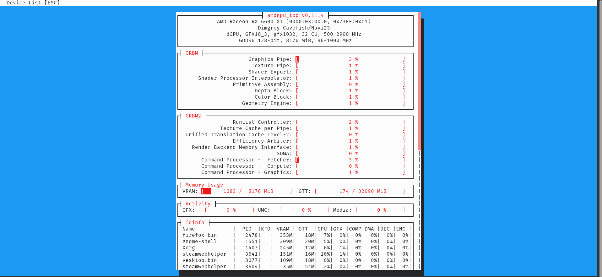

# Toaster Chess Analysis

PGN ingestion and Stockfish analysis for games exported from my crappy [Android chess app](https://play.google.com/store/apps/details?id=uk.co.aifactory.chessfree&hl=en_US).

This repo exists because I wanted my phone chess games to get roasted automatically.

## What This Does

- Phone chess app exports a `.pgn`.
- KDE Connect sends the `.pgn` to my desktop.
- A systemd timer checks `~/Downloads/kde_connect` for new PGNs.
- The script copies new PGNs into this repo.
- Stockfish analyzes the game.
- Ollama reads the Stockfish-backed key moments and writes short caveman notes.
- Python generates Markdown reports with chessboard diagrams.
- Git commits and pushes the reports.
- I read the pretty GitHub Markdown on my phone.

## Basic Flow

- Phone game happens.
- PGN gets sent to desktop.
- Desktop toaster eats PGN.
- Stockfish says who screwed up.
- Ollama says it in human-ish trash goblin language.
- GitHub gets the report.
- I laugh or learn. Possibly both.

## Repo Layout

- `games/raw_pgn/`
  - Raw PGNs copied from the phone.

- `analysis/`
  - Generated Markdown reports.

- `analysis/assets/`
  - SVG chessboard diagrams for final positions and key moments.

- `scripts/`
  - Python scripts that make the toaster work.

## Important Notes

- Stockfish is the judge.
- Ollama is just here to make the notes less boring.
- If Ollama says something stupid, Stockfish still wins.
- Raw PGNs are the source of truth.
- Generated analysis can be deleted and rebuilt.

## Manual Rebuild

Run this to rebuild all reports from the raw PGNs:

```bash
python scripts/rebuild_pretty_analysis.py --force
```

## Disable Ollama For A Run

Run this if Ollama is being slow, dumb, or annoying:

```bash
TOASTER_USE_OLLAMA=0 python scripts/rebuild_pretty_analysis.py --force
```

## Timer

The desktop poller is handled by a user systemd timer.

Check timer status:

```bash
systemctl --user status toaster-chess-poll.timer
```

Manually kick the poller:

```bash
systemctl --user start toaster-chess-poll.service
```

Check poller logs:

```bash
journalctl --user -u toaster-chess-poll.service -n 120 --no-pager -l
```

## Clean Reset

Stop the timer first so it does not fight the repo while cleanup is happening:

```bash
systemctl --user stop toaster-chess-poll.timer
```

Wipe generated chess data:

```bash
rm -rf games/raw_pgn/*
rm -rf analysis/*.md
rm -rf analysis/assets
rm -rf analysis/llm_cache
```

Recreate the empty index:

```bash
mkdir -p analysis
cat > analysis/index.md <<'INDEXEOF'
# Chess Analysis Index

No games analyzed yet.
INDEXEOF
```

Commit the clean state:

```bash
git add .
git commit -m "Clean reset chess analysis data"
git push
```

Restart the timer:

```bash
systemctl --user start toaster-chess-poll.timer
```

## Ollama / VRAM Behavior

This project uses local Ollama for the rude Toaster Chess commentary.

Ollama runs as a local service, but the model should not sit in VRAM forever. The analysis script loads the model when needed, generates the move notes / game story, then unloads it afterward.

Expected behavior:

1. PGN arrives.
2. Stockfish analyzes the game.
3. Ollama loads the model into GPU VRAM.
4. VRAM availability drops while analysis is running.
5. Analysis finishes.
6. The script unloads the Ollama model.
7. VRAM availability returns after a few seconds.

Verify current Ollama model state:

```bash
ollama ps
```

If a model is stuck in VRAM:
```bash
ollama stop dolphin-mistral
```

The systemd override for my RX 6600 uses:
```ini
[Service]
Environment="HSA_OVERRIDE_GFX_VERSION=10.3.0"
Environment="OLLAMA_KEEP_ALIVE=5m"
```

The Python script also calls Ollama with keep_alive: 0 at shutdown so the model gets evicted from VRAM after analysis.

My GNOME status line shows available VRAM, so a drop from ~6.5G available to ~2.0G available means Ollama is active, not that VRAM vanished into the cornfield.

I somewhat apologize in advance for the colors amdpu_top uses.

Before / idle:




During Ollama analysis:


for future me: the status line reports available VRAM, not used VRAM.
