# CPU (5) vs You

**Result:** 0-1  
**Date:** 2026.05.12  
**Source:** `20260512_094354_pgn_2026_05_12_09h43_b267b416a4fe.pgn`  
**Engine:** Stockfish depth 14

---

## Toaster Summary

Biggest toaster scream: **40. Rxd2** by **Black**.

- **Label:** ❌ **Mistake**
- **Eval:** -19.32 → -13.92
- **Stockfish preferred:** `Rxd2`
- **Loss:** 540 cp

Final move recorded by parser: **40. Rxd2** by **Black**.

- 💀 Blunders: **0**
- ❌ Mistakes: **4**
- ⚠️ Inaccuracies: **11**
- ✅ Good / best / tactical moves: **47**

---

## Final Position

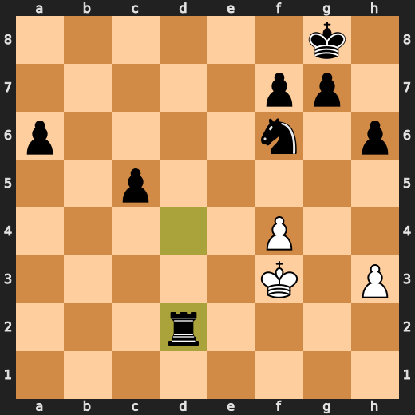

---

## Key Moments

### 💎 Brilliant-ish: 6. Bxf3 by White

White's played move Bxf3 is a forced choice, as Stockfish preferred the same move and it doesn't significantly alter the position's evaluation, which remains slightly in White's favor at +0.32.

- **Eval:** +0.33 → +0.32
- **Preferred:** `Bxf3`
- **Loss:** 1 cp

**Before 6. Bxf3**

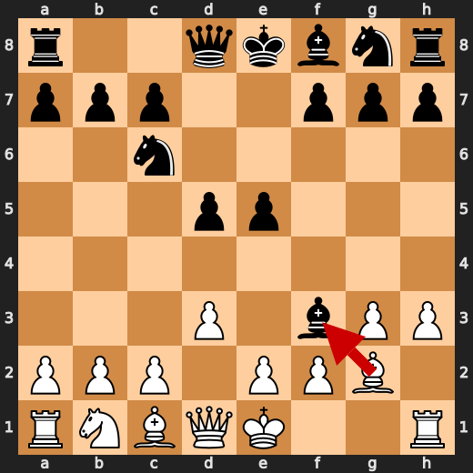

**After 6. Bxf3**

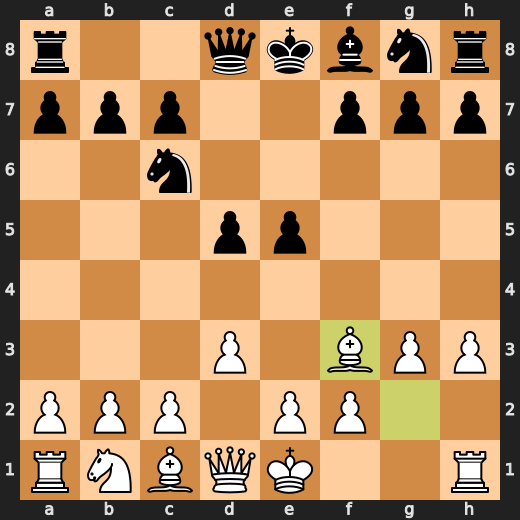

### ⚠️ Inaccuracy: 6. e4 by Black

Black's e4 push is an inaccuracy, as it allows White to develop the dark-squared bishop and gain a strong initiative, whereas Qd7 would have maintained a more balanced position.

- **Eval:** +0.34 → +3.04
- **Preferred:** `Qd7`
- **Loss:** 270 cp

**Before 6. e4**

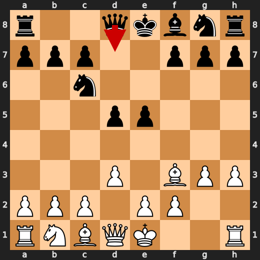

**After 6. e4**

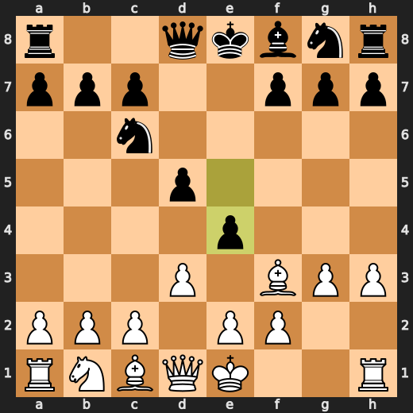

### 💎 Brilliant-ish: 7. dxe4 by White

White's decision to play dxe4 is a slight concession, as it allows Black to potentially counter-attack with ...exd4 and gain some initiative.

- **Eval:** +3.12 → +2.88
- **Preferred:** `dxe4`
- **Loss:** 24 cp

**Before 7. dxe4**

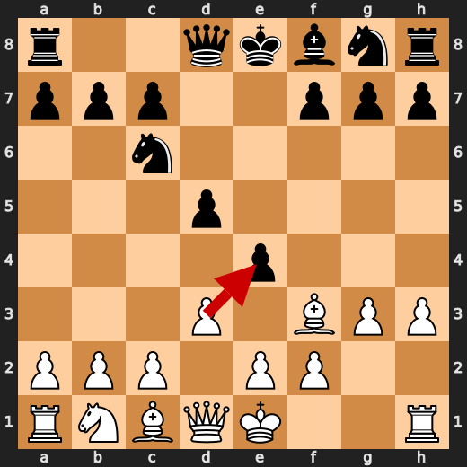

**After 7. dxe4**

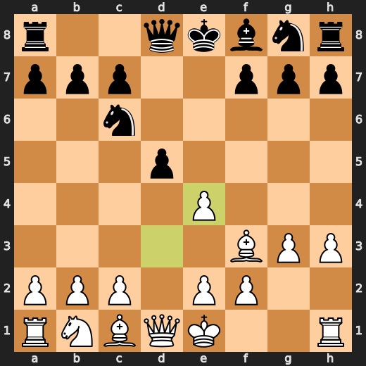

### 💎 Brilliant-ish: 8. Qxd8+ by White

White's queen check on d8 is a clever forcing move that Stockfish also prefers, gaining a slight edge in the position.

- **Eval:** +2.99 → +3.00
- **Preferred:** `Qxd8+`
- **Loss:** 0 cp

**Before 8. Qxd8+**

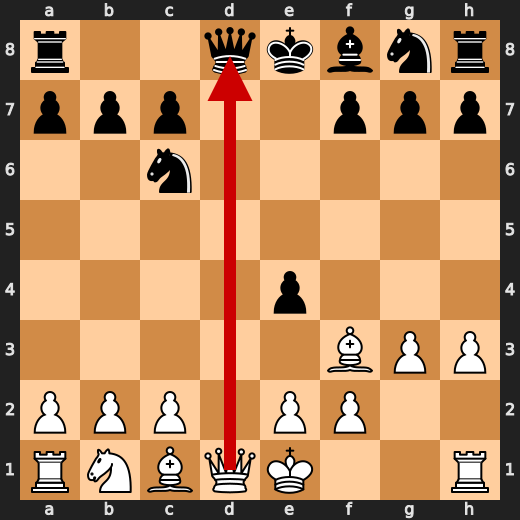

**After 8. Qxd8+**

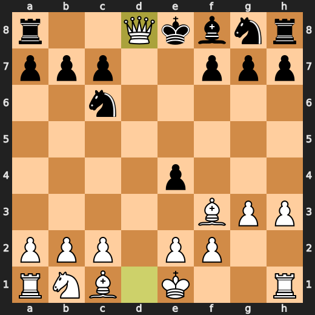

### 💎 Brilliant-ish: 9. Bxe4 by White

White's played move Bxe4 is in line with Stockfish's preference and maintains a slight edge, as the engine's evaluation increases to +3.21 from +3.12.

- **Eval:** +3.12 → +3.21
- **Preferred:** `Bxe4`
- **Loss:** 0 cp

**Before 9. Bxe4**

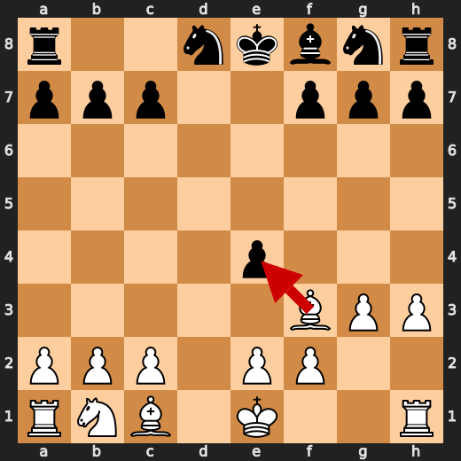

**After 9. Bxe4**

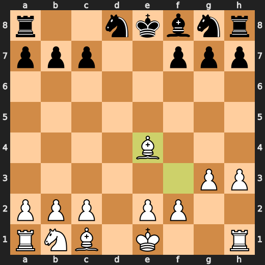

### ❌ Mistake: 14. e4 by White

White's e4 push is a mistake, as Stockfish preferred the more solid Bg2, which would have maintained a +3.03 evaluation advantage over Black.

- **Eval:** +3.03 → -0.12
- **Preferred:** `Bg2`
- **Loss:** 315 cp

**Before 14. e4**

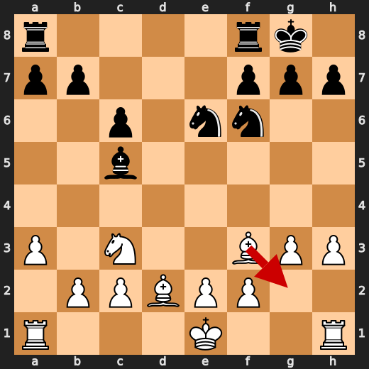

**After 14. e4**

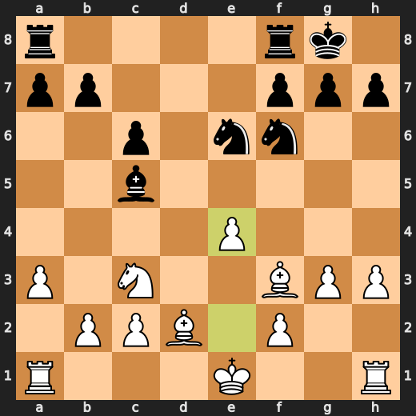

### 💎 Brilliant-ish: 18. Nxc5 by White

White's knight takes on c5, a move that aligns with Stockfish's preference and helps to neutralize Black's bishop pair advantage.

- **Eval:** -0.39 → +0.00
- **Preferred:** `Nxc5`
- **Loss:** 0 cp

### 💎 Brilliant-ish: 19. Nxb7 by White

White's knight on b7 is a forced capture to prevent Black's queen from potentially attacking the rook on c1 and gaining a strong initiative.

- **Eval:** -0.39 → +0.00
- **Preferred:** `Nxb7`
- **Loss:** 0 cp

### ⚠️ Inaccuracy: 19. Reb8 by Black

Black's move Reb8 is an inaccuracy as it allows White to gain a strong initiative, whereas Stockfish preferred the more solid Rab8 to maintain control of the queenside.

- **Eval:** -0.44 → +0.95
- **Preferred:** `Rab8`
- **Loss:** 139 cp

### ⚠️ Inaccuracy: 20. Na5 by White

White's move Na5 is an inaccuracy as it allows Black to develop the knight and gain a strong initiative, whereas Stockfish preferred Nd6 to control the center.

- **Eval:** +0.53 → -1.40
- **Preferred:** `Nd6`
- **Loss:** 193 cp

### ❌ Mistake: 21. Nc4 by White

White's knight on c4 is a mistake, as Stockfish preferred the more solid Bc3, which would have maintained a slightly better position with an eval of -1.47.

- **Eval:** -1.47 → -4.54
- **Preferred:** `Bc3`
- **Loss:** 307 cp

### 💎 Brilliant-ish: 22. Nxa1 by Black

Black's decision to play Nxa1 is a pragmatic choice, as it aligns with Stockfish's preferred move and doesn't incur any significant centipawn loss in the current position.

- **Eval:** -4.72 → -4.97
- **Preferred:** `Nxa1`
- **Loss:** 0 cp

---

## Human Notes

There was also a notable mistake at **14. e4** by **White**.

---

<details>
<summary>Compact move list</summary>

- 📖 **1. g3** (White, Book) — +0.37 → +0.23, preferred `d4`, loss 14 cp
- 📖 **1. d5** (Black, Book) — +0.31 → +0.29, preferred `d5`, loss 0 cp
- 📖 **2. Nf3** (White, Book) — +0.22 → +0.15, preferred `Nf3`, loss 7 cp
- 📖 **2. Nc6** (Black, Book) — +0.13 → +0.50, preferred `g6`, loss 37 cp
- 📖 **3. Bg2** (White, Book) — +0.50 → -0.42, preferred `d4`, loss 92 cp
- 📖 **3. e5** (Black, Book) — -0.25 → -0.04, preferred `e5`, loss 21 cp
- ✅ **4. d3** (White, Best) — -0.08 → -0.07, preferred `d3`, loss 0 cp
- 🔥 **4. Bg4** (Black, Great) — -0.26 → +0.00, preferred `h6`, loss 26 cp
- 🔥 **5. h3** (White, Great) — -0.03 → -0.36, preferred `O-O`, loss 33 cp
- 👍 **5. Bxf3** (Black, Good) — -0.22 → +0.42, preferred `Bf5`, loss 64 cp
- 💎 **6. Bxf3** (White, Brilliant-ish) — +0.33 → +0.32, preferred `Bxf3`, loss 1 cp
- ⚠️ **6. e4** (Black, Inaccuracy) — +0.34 → +3.04, preferred `Qd7`, loss 270 cp
- 💎 **7. dxe4** (White, Brilliant-ish) — +3.12 → +2.88, preferred `dxe4`, loss 24 cp
- ✅ **7. dxe4** (Black, Best) — +3.04 → +2.91, preferred `d4`, loss 0 cp
- 💎 **8. Qxd8+** (White, Brilliant-ish) — +2.99 → +3.00, preferred `Qxd8+`, loss 0 cp
- 🔥 **8. Nxd8** (Black, Great) — +2.88 → +3.10, preferred `Rxd8`, loss 22 cp
- 💎 **9. Bxe4** (White, Brilliant-ish) — +3.12 → +3.21, preferred `Bxe4`, loss 0 cp
- ✅ **9. Nf6** (Black, Best) — +3.02 → +3.11, preferred `Nf6`, loss 9 cp
- ✅ **10. Bf3** (White, Best) — +3.08 → +2.96, preferred `Bf3`, loss 12 cp
- 👍 **10. Bc5** (Black, Good) — +3.02 → +3.71, preferred `c6`, loss 69 cp
- 👍 **11. a3** (White, Good) — +3.55 → +2.57, preferred `Nd2`, loss 98 cp
- 👍 **11. O-O** (Black, Good) — +2.58 → +3.34, preferred `Nc6`, loss 76 cp
- ✅ **12. Nc3** (White, Best) — +3.10 → +3.00, preferred `e3`, loss 10 cp
- ✅ **12. c6** (Black, Best) — +3.00 → +3.01, preferred `c6`, loss 1 cp
- 🔥 **13. Bd2** (White, Great) — +3.17 → +2.87, preferred `Na4`, loss 30 cp
- ✅ **13. Ne6** (Black, Best) — +2.72 → +2.74, preferred `Ne6`, loss 2 cp
- ❌ **14. e4** (White, Mistake) — +3.03 → -0.12, preferred `Bg2`, loss 315 cp
- 🔥 **14. Nd4** (Black, Great) — +0.00 → +0.41, preferred `Rad8`, loss 41 cp
- ✅ **15. Bd1** (White, Best) — +0.51 → +0.57, preferred `Bd1`, loss 0 cp
- ✅ **15. Rfe8** (Black, Best) — +0.42 → +0.31, preferred `Rfe8`, loss 0 cp
- 🔥 **16. f3** (White, Great) — +0.46 → +0.26, preferred `O-O`, loss 20 cp
- 🔥 **16. Nh5** (Black, Great) — +0.15 → +0.56, preferred `Rad8`, loss 41 cp
- 👍 **17. Na4** (White, Good) — +0.19 → -0.50, preferred `g4`, loss 69 cp
- 👍 **17. Nxg3** (Black, Good) — -1.27 → -0.55, preferred `Nxg3`, loss 72 cp
- 💎 **18. Nxc5** (White, Brilliant-ish) — -0.39 → +0.00, preferred `Nxc5`, loss 0 cp
- 👍 **18. Nxh1** (Black, Good) — -0.79 → +0.00, preferred `Nxh1`, loss 79 cp
- 💎 **19. Nxb7** (White, Brilliant-ish) — -0.39 → +0.00, preferred `Nxb7`, loss 0 cp
- ⚠️ **19. Reb8** (Black, Inaccuracy) — -0.44 → +0.95, preferred `Rab8`, loss 139 cp
- ⚠️ **20. Na5** (White, Inaccuracy) — +0.53 → -1.40, preferred `Nd6`, loss 193 cp
- 👍 **20. Rxb2** (Black, Good) — -1.33 → -0.82, preferred `Rxb2`, loss 51 cp
- ❌ **21. Nc4** (White, Mistake) — -1.47 → -4.54, preferred `Bc3`, loss 307 cp
- 👍 **21. Nxc2+** (Black, Good) — -4.53 → -4.02, preferred `Nxc2+`, loss 51 cp
- 👍 **22. Kf1** (White, Good) — -4.16 → -4.77, preferred `Ke2`, loss 61 cp
- 💎 **22. Nxa1** (Black, Brilliant-ish) — -4.72 → -4.97, preferred `Nxa1`, loss 0 cp
- 💎 **23. Nxb2** (White, Brilliant-ish) — -4.60 → -4.63, preferred `Nxb2`, loss 3 cp
- 🔥 **23. Ng3+** (Black, Great) — -4.86 → -4.37, preferred `Ng3+`, loss 49 cp
- ⚠️ **24. Kg2** (White, Inaccuracy) — -4.40 → -5.87, preferred `Kf2`, loss 147 cp
- 🔥 **24. Nh5** (Black, Great) — -6.02 → -5.69, preferred `Rb8`, loss 33 cp
- 🔥 **25. Kf2** (White, Great) — -5.47 → -5.68, preferred `Kf2`, loss 21 cp
- ⚠️ **25. h6** (Black, Inaccuracy) — -5.79 → -3.89, preferred `Rb8`, loss 190 cp
- ⚠️ **26. Be3** (White, Inaccuracy) — -3.96 → -5.19, preferred `Nd3`, loss 123 cp
- ✅ **26. Rd8** (Black, Best) — -4.64 → -4.58, preferred `g5`, loss 6 cp
- 🔥 **27. Ba4** (White, Great) — -4.67 → -5.16, preferred `Ke2`, loss 49 cp
- 🔥 **27. c5** (Black, Great) — -5.45 → -5.15, preferred `c5`, loss 30 cp
- ⚠️ **28. Bc6** (White, Inaccuracy) — -5.66 → -7.49, preferred `Ke2`, loss 183 cp
- ⚠️ **28. Rc8** (Black, Inaccuracy) — -7.69 → -6.05, preferred `Nc2`, loss 164 cp
- 🔥 **29. Bd5** (White, Great) — -6.34 → -6.76, preferred `Bd5`, loss 42 cp
- ✅ **29. Nc2** (Black, Best) — -6.46 → -6.52, preferred `Nc2`, loss 0 cp
- 🔥 **30. Nc4** (White, Great) — -6.23 → -6.47, preferred `Bc1`, loss 24 cp
- ✅ **30. Rc7** (Black, Best) — -6.67 → -6.69, preferred `Rc7`, loss 0 cp
- 👍 **31. Bd2** (White, Good) — -6.65 → -7.23, preferred `Nd6`, loss 58 cp
- ⚠️ **31. a6** (Black, Inaccuracy) — -7.01 → -4.96, preferred `Nf6`, loss 205 cp
- 👍 **32. Nd6** (White, Good) — -5.23 → -6.00, preferred `Ba5`, loss 77 cp
- 💎 **32. Nxa3** (Black, Brilliant-ish) — -6.24 → -6.19, preferred `Nxa3`, loss 5 cp
- 🔥 **33. e5** (White, Great) — -6.15 → -6.46, preferred `Ba5`, loss 31 cp
- 🔥 **33. Nb5** (Black, Great) — -6.84 → -6.40, preferred `Nb5`, loss 44 cp
- ⚠️ **34. f4** (White, Inaccuracy) — -6.86 → -8.17, preferred `Be3`, loss 131 cp
- 💎 **34. Nxd6** (Black, Brilliant-ish) — -8.24 → -8.22, preferred `Nxd6`, loss 2 cp
- 🔥 **35. exd6** (White, Great) — -8.09 → -8.43, preferred `Bf3`, loss 34 cp
- ✅ **35. Rd7** (Black, Best) — -8.52 → -8.38, preferred `Rd7`, loss 14 cp
- ✅ **36. Ke3** (White, Best) — -8.42 → -8.36, preferred `Bc3`, loss 0 cp
- 💎 **36. Rxd6** (Black, Brilliant-ish) — -8.44 → -8.32, preferred `Rxd6`, loss 12 cp
- ⚠️ **37. Ke4** (White, Inaccuracy) — -8.27 → -10.38, preferred `Bc4`, loss 211 cp
- 💎 **37. Nf6+** (Black, Brilliant-ish) — -10.55 → -10.61, preferred `Nf6+`, loss 0 cp
- 🔥 **38. Kd3** (White, Great) — -10.95 → -11.23, preferred `Ke3`, loss 28 cp
- 💎 **38. Rxd5+** (Black, Brilliant-ish) — -11.38 → -11.61, preferred `Rxd5+`, loss 0 cp
- ✅ **39. Ke3** (White, Best) — -11.70 → -11.84, preferred `Ke2`, loss 14 cp
- ✅ **39. Rd4** (Black, Best) — -11.84 → -11.87, preferred `c4`, loss 0 cp
- ❌ **40. Kf3** (White, Mistake) — -11.84 → -16.07, preferred `Ke2`, loss 423 cp
- ❌ **40. Rxd2** (Black, Mistake) — -19.32 → -13.92, preferred `Rxd2`, loss 540 cp

</details>

---

<details>
<summary>Raw engine table</summary>

| Ply | Move | Side | Played | Label | Eval Before | Eval After | Preferred | Loss |
|---:|---:|---|---|---|---:|---:|---|---:|
| 1 | 1 | White | g3 | Book | +0.37 | +0.23 | d4 | 14 |
| 2 | 1 | Black | d5 | Book | +0.31 | +0.29 | d5 | 0 |
| 3 | 2 | White | Nf3 | Book | +0.22 | +0.15 | Nf3 | 7 |
| 4 | 2 | Black | Nc6 | Book | +0.13 | +0.50 | g6 | 37 |
| 5 | 3 | White | Bg2 | Book | +0.50 | -0.42 | d4 | 92 |
| 6 | 3 | Black | e5 | Book | -0.25 | -0.04 | e5 | 21 |
| 7 | 4 | White | d3 | Best | -0.08 | -0.07 | d3 | 0 |
| 8 | 4 | Black | Bg4 | Great | -0.26 | +0.00 | h6 | 26 |
| 9 | 5 | White | h3 | Great | -0.03 | -0.36 | O-O | 33 |
| 10 | 5 | Black | Bxf3 | Good | -0.22 | +0.42 | Bf5 | 64 |
| 11 | 6 | White | Bxf3 | Brilliant-ish | +0.33 | +0.32 | Bxf3 | 1 |
| 12 | 6 | Black | e4 | Inaccuracy | +0.34 | +3.04 | Qd7 | 270 |
| 13 | 7 | White | dxe4 | Brilliant-ish | +3.12 | +2.88 | dxe4 | 24 |
| 14 | 7 | Black | dxe4 | Best | +3.04 | +2.91 | d4 | 0 |
| 15 | 8 | White | Qxd8+ | Brilliant-ish | +2.99 | +3.00 | Qxd8+ | 0 |
| 16 | 8 | Black | Nxd8 | Great | +2.88 | +3.10 | Rxd8 | 22 |
| 17 | 9 | White | Bxe4 | Brilliant-ish | +3.12 | +3.21 | Bxe4 | 0 |
| 18 | 9 | Black | Nf6 | Best | +3.02 | +3.11 | Nf6 | 9 |
| 19 | 10 | White | Bf3 | Best | +3.08 | +2.96 | Bf3 | 12 |
| 20 | 10 | Black | Bc5 | Good | +3.02 | +3.71 | c6 | 69 |
| 21 | 11 | White | a3 | Good | +3.55 | +2.57 | Nd2 | 98 |
| 22 | 11 | Black | O-O | Good | +2.58 | +3.34 | Nc6 | 76 |
| 23 | 12 | White | Nc3 | Best | +3.10 | +3.00 | e3 | 10 |
| 24 | 12 | Black | c6 | Best | +3.00 | +3.01 | c6 | 1 |
| 25 | 13 | White | Bd2 | Great | +3.17 | +2.87 | Na4 | 30 |
| 26 | 13 | Black | Ne6 | Best | +2.72 | +2.74 | Ne6 | 2 |
| 27 | 14 | White | e4 | Mistake | +3.03 | -0.12 | Bg2 | 315 |
| 28 | 14 | Black | Nd4 | Great | +0.00 | +0.41 | Rad8 | 41 |
| 29 | 15 | White | Bd1 | Best | +0.51 | +0.57 | Bd1 | 0 |
| 30 | 15 | Black | Rfe8 | Best | +0.42 | +0.31 | Rfe8 | 0 |
| 31 | 16 | White | f3 | Great | +0.46 | +0.26 | O-O | 20 |
| 32 | 16 | Black | Nh5 | Great | +0.15 | +0.56 | Rad8 | 41 |
| 33 | 17 | White | Na4 | Good | +0.19 | -0.50 | g4 | 69 |
| 34 | 17 | Black | Nxg3 | Good | -1.27 | -0.55 | Nxg3 | 72 |
| 35 | 18 | White | Nxc5 | Brilliant-ish | -0.39 | +0.00 | Nxc5 | 0 |
| 36 | 18 | Black | Nxh1 | Good | -0.79 | +0.00 | Nxh1 | 79 |
| 37 | 19 | White | Nxb7 | Brilliant-ish | -0.39 | +0.00 | Nxb7 | 0 |
| 38 | 19 | Black | Reb8 | Inaccuracy | -0.44 | +0.95 | Rab8 | 139 |
| 39 | 20 | White | Na5 | Inaccuracy | +0.53 | -1.40 | Nd6 | 193 |
| 40 | 20 | Black | Rxb2 | Good | -1.33 | -0.82 | Rxb2 | 51 |
| 41 | 21 | White | Nc4 | Mistake | -1.47 | -4.54 | Bc3 | 307 |
| 42 | 21 | Black | Nxc2+ | Good | -4.53 | -4.02 | Nxc2+ | 51 |
| 43 | 22 | White | Kf1 | Good | -4.16 | -4.77 | Ke2 | 61 |
| 44 | 22 | Black | Nxa1 | Brilliant-ish | -4.72 | -4.97 | Nxa1 | 0 |
| 45 | 23 | White | Nxb2 | Brilliant-ish | -4.60 | -4.63 | Nxb2 | 3 |
| 46 | 23 | Black | Ng3+ | Great | -4.86 | -4.37 | Ng3+ | 49 |
| 47 | 24 | White | Kg2 | Inaccuracy | -4.40 | -5.87 | Kf2 | 147 |
| 48 | 24 | Black | Nh5 | Great | -6.02 | -5.69 | Rb8 | 33 |
| 49 | 25 | White | Kf2 | Great | -5.47 | -5.68 | Kf2 | 21 |
| 50 | 25 | Black | h6 | Inaccuracy | -5.79 | -3.89 | Rb8 | 190 |
| 51 | 26 | White | Be3 | Inaccuracy | -3.96 | -5.19 | Nd3 | 123 |
| 52 | 26 | Black | Rd8 | Best | -4.64 | -4.58 | g5 | 6 |
| 53 | 27 | White | Ba4 | Great | -4.67 | -5.16 | Ke2 | 49 |
| 54 | 27 | Black | c5 | Great | -5.45 | -5.15 | c5 | 30 |
| 55 | 28 | White | Bc6 | Inaccuracy | -5.66 | -7.49 | Ke2 | 183 |
| 56 | 28 | Black | Rc8 | Inaccuracy | -7.69 | -6.05 | Nc2 | 164 |
| 57 | 29 | White | Bd5 | Great | -6.34 | -6.76 | Bd5 | 42 |
| 58 | 29 | Black | Nc2 | Best | -6.46 | -6.52 | Nc2 | 0 |
| 59 | 30 | White | Nc4 | Great | -6.23 | -6.47 | Bc1 | 24 |
| 60 | 30 | Black | Rc7 | Best | -6.67 | -6.69 | Rc7 | 0 |
| 61 | 31 | White | Bd2 | Good | -6.65 | -7.23 | Nd6 | 58 |
| 62 | 31 | Black | a6 | Inaccuracy | -7.01 | -4.96 | Nf6 | 205 |
| 63 | 32 | White | Nd6 | Good | -5.23 | -6.00 | Ba5 | 77 |
| 64 | 32 | Black | Nxa3 | Brilliant-ish | -6.24 | -6.19 | Nxa3 | 5 |
| 65 | 33 | White | e5 | Great | -6.15 | -6.46 | Ba5 | 31 |
| 66 | 33 | Black | Nb5 | Great | -6.84 | -6.40 | Nb5 | 44 |
| 67 | 34 | White | f4 | Inaccuracy | -6.86 | -8.17 | Be3 | 131 |
| 68 | 34 | Black | Nxd6 | Brilliant-ish | -8.24 | -8.22 | Nxd6 | 2 |
| 69 | 35 | White | exd6 | Great | -8.09 | -8.43 | Bf3 | 34 |
| 70 | 35 | Black | Rd7 | Best | -8.52 | -8.38 | Rd7 | 14 |
| 71 | 36 | White | Ke3 | Best | -8.42 | -8.36 | Bc3 | 0 |
| 72 | 36 | Black | Rxd6 | Brilliant-ish | -8.44 | -8.32 | Rxd6 | 12 |
| 73 | 37 | White | Ke4 | Inaccuracy | -8.27 | -10.38 | Bc4 | 211 |
| 74 | 37 | Black | Nf6+ | Brilliant-ish | -10.55 | -10.61 | Nf6+ | 0 |
| 75 | 38 | White | Kd3 | Great | -10.95 | -11.23 | Ke3 | 28 |
| 76 | 38 | Black | Rxd5+ | Brilliant-ish | -11.38 | -11.61 | Rxd5+ | 0 |
| 77 | 39 | White | Ke3 | Best | -11.70 | -11.84 | Ke2 | 14 |
| 78 | 39 | Black | Rd4 | Best | -11.84 | -11.87 | c4 | 0 |
| 79 | 40 | White | Kf3 | Mistake | -11.84 | -16.07 | Ke2 | 423 |
| 80 | 40 | Black | Rxd2 | Mistake | -19.32 | -13.92 | Rxd2 | 540 |

</details>

---

<details>
<summary>Clean PGN</summary>

```pgn
[Event "AI Factory's Chess"]
[Site "Android Device"]
[Date "2026.05.12"]
[Round "1"]
[White "CPU (5)"]
[Black "You"]
[Result "0-1"]
[PlyCount "82"]

1. g3 d5 2. Nf3 Nc6 3. Bg2 e5 4. d3 Bg4 5. h3 Bxf3 6. Bxf3 e4 7. dxe4 dxe4 8.
Qxd8+ Nxd8 9. Bxe4 Nf6 10. Bf3 Bc5 11. a3 O-O 12. Nc3 c6 13. Bd2 Ne6 14. e4 Nd4
15. Bd1 Rfe8 16. f3 Nh5 17. Na4 Nxg3 18. Nxc5 Nxh1 19. Nxb7 Reb8 20. Na5 Rxb2
21. Nc4 Nxc2+ 22. Kf1 Nxa1 23. Nxb2 Ng3+ 24. Kg2 Nh5 25. Kf2 h6 26. Be3 Rd8 27.
Ba4 c5 28. Bc6 Rc8 29. Bd5 Nc2 30. Nc4 Rc7 31. Bd2 a6 32. Nd6 Nxa3 33. e5 Nb5
34. f4 Nxd6 35. exd6 Rd7 36. Ke3 Rxd6 37. Ke4 Nf6+ 38. Kd3 Rxd5+ 39. Ke3 Rd4
40. Kf3 Rxd2 0-1
```

</details>
