# CPU (5) vs You

**Result:** 0-1  
**Date:** 2026.05.12  
**Source:** `20260512_100444_pgn_2026_05_12_09h56_7c2b09b9b021.pgn`  
**Engine:** Stockfish depth 14

---

## Toaster Summary

Biggest toaster scream: **31. Rg1** by **White**.

- **Label:** 💀 **Blunder**
- **Eval:** -8.56 → Black has mate
- **Stockfish preferred:** `Ka3`
- **Loss:** 99144 cp

Final move recorded by parser: **31. Ra1#** by **Black**.

- 💀 Blunders: **1**
- ❌ Mistakes: **4**
- ⚠️ Inaccuracies: **10**
- ✅ Good / best / tactical moves: **34**

---

## Final Position

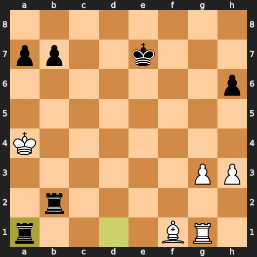

---

## Key Moments

### ⚠️ Inaccuracy: 1. Na3 by White

Small-to-medium eval loss. Playable, but Stockfish wanted cleaner.

- **Eval:** +0.56 → -0.93
- **Preferred:** `e4`
- **Loss:** 149 cp

**Before 1. Na3**

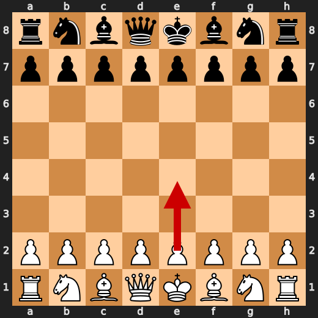

**After 1. Na3**

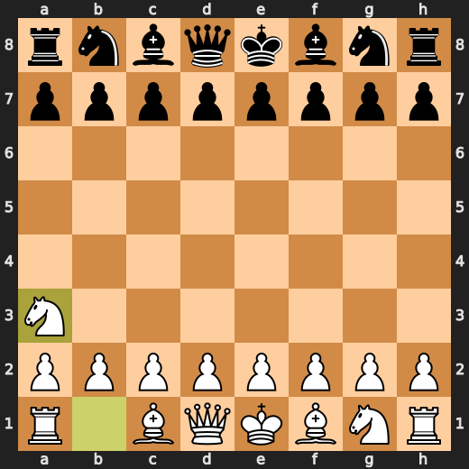

### 💎 Brilliant-ish: 5. Nxc4 by White

Forcing move that Stockfish likes. Not official Chess.com magic, but tactically notable.

- **Eval:** -0.48 → -0.61
- **Preferred:** `Nxc4`
- **Loss:** 13 cp

**Before 5. Nxc4**

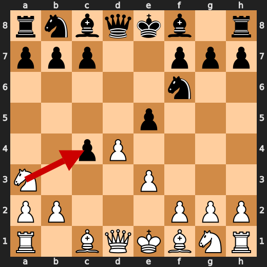

**After 5. Nxc4**

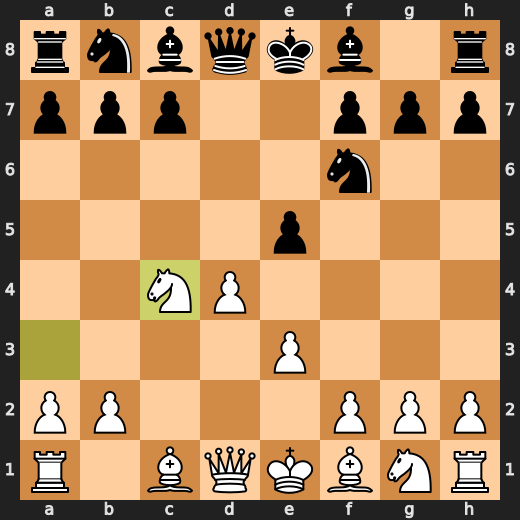

### 💎 Brilliant-ish: 7. Qxd4 by Black

Forcing move that Stockfish likes. Not official Chess.com magic, but tactically notable.

- **Eval:** -1.33 → -1.21
- **Preferred:** `Qxd4`
- **Loss:** 12 cp

**Before 7. Qxd4**

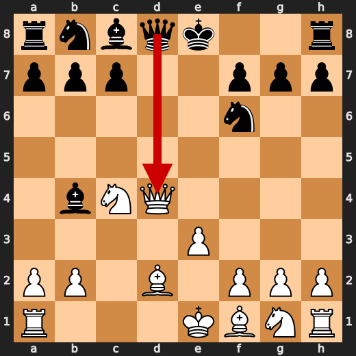

**After 7. Qxd4**

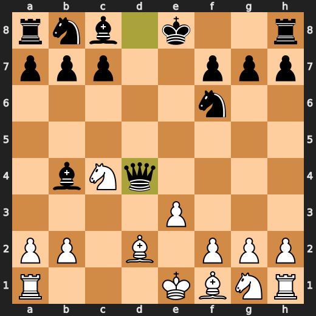

### ⚠️ Inaccuracy: 9. Bf5 by Black

Small-to-medium eval loss. Playable, but Stockfish wanted cleaner.

- **Eval:** -1.86 → -0.58
- **Preferred:** `Bg4`
- **Loss:** 128 cp

**Before 9. Bf5**

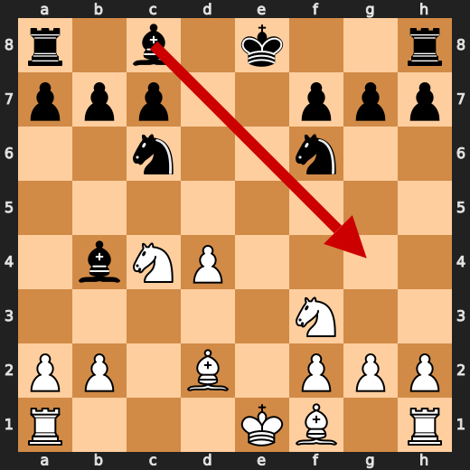

**After 9. Bf5**

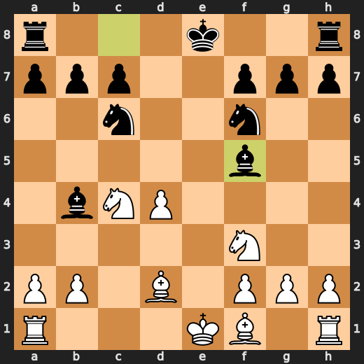

### ⚠️ Inaccuracy: 10. Ne3 by White

Small-to-medium eval loss. Playable, but Stockfish wanted cleaner.

- **Eval:** -0.55 → -2.17
- **Preferred:** `Bxb4`
- **Loss:** 162 cp

**Before 10. Ne3**

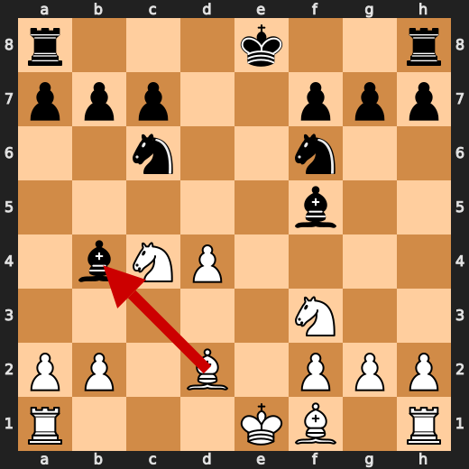

**After 10. Ne3**

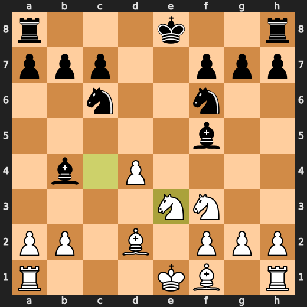

### 💎 Brilliant-ish: 10. Bxd2+ by Black

Forcing move that Stockfish likes. Not official Chess.com magic, but tactically notable.

- **Eval:** -2.19 → -2.42
- **Preferred:** `Bxd2+`
- **Loss:** 0 cp

**Before 10. Bxd2+**

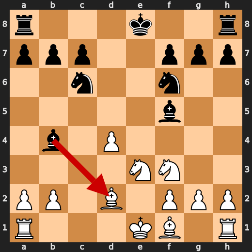

**After 10. Bxd2+**

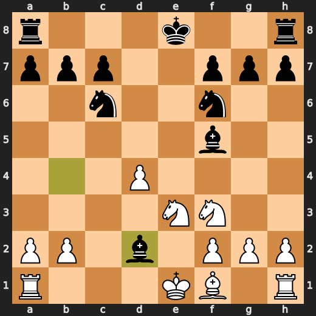

### 💎 Brilliant-ish: 11. Kxd2 by White

Forcing move that Stockfish likes. Not official Chess.com magic, but tactically notable.

- **Eval:** -2.27 → -2.40
- **Preferred:** `Kxd2`
- **Loss:** 13 cp

### ⚠️ Inaccuracy: 12. Ng5 by White

Small-to-medium eval loss. Playable, but Stockfish wanted cleaner.

- **Eval:** -2.04 → -3.48
- **Preferred:** `Kc3`
- **Loss:** 144 cp

### ⚠️ Inaccuracy: 12. Nxd4 by Black

Small-to-medium eval loss. Playable, but Stockfish wanted cleaner.

- **Eval:** -3.49 → -2.16
- **Preferred:** `O-O-O`
- **Loss:** 133 cp

### ⚠️ Inaccuracy: 13. Re1 by White

Small-to-medium eval loss. Playable, but Stockfish wanted cleaner.

- **Eval:** -2.42 → -4.01
- **Preferred:** `Kc3`
- **Loss:** 159 cp

### ❌ Mistake: 14. Nh3 by White

Significant eval loss. Probably missed a tactic, defense, or forcing move.

- **Eval:** -3.14 → -6.27
- **Preferred:** `Nd5`
- **Loss:** 313 cp

### ⚠️ Inaccuracy: 15. Nd5 by Black

Small-to-medium eval loss. Playable, but Stockfish wanted cleaner.

- **Eval:** -5.64 → -4.29
- **Preferred:** `Rd6`
- **Loss:** 135 cp

---

## Human Notes

The first major collapse was **31. Rg1** by **White**. That is probably the main position to review.

There was also a notable mistake at **14. Nh3** by **White**.

The game-ending tactic was **31. Ra1#**.

---

<details>
<summary>Compact move list</summary>

- ⚠️ **1. Na3** (White, Inaccuracy) — +0.56 → -0.93, preferred `e4`, loss 149 cp
- 📖 **1. Nf6** (Black, Book) — -0.88 → -0.30, preferred `e5`, loss 58 cp
- 📖 **2. d4** (White, Book) — -0.36 → -0.54, preferred `Nf3`, loss 18 cp
- 📖 **2. d5** (Black, Book) — -0.53 → -0.50, preferred `e6`, loss 3 cp
- 📖 **3. c4** (White, Book) — -0.44 → -0.67, preferred `Bf4`, loss 23 cp
- 📖 **3. dxc4** (Black, Book) — -0.67 → -0.58, preferred `dxc4`, loss 9 cp
- ✅ **4. e3** (White, Best) — -0.56 → -0.64, preferred `Nxc4`, loss 8 cp
- 🔥 **4. e5** (Black, Great) — -1.06 → -0.73, preferred `e5`, loss 33 cp
- 💎 **5. Nxc4** (White, Brilliant-ish) — -0.48 → -0.61, preferred `Nxc4`, loss 13 cp
- ✅ **5. exd4** (Black, Best) — -0.54 → -0.41, preferred `Nc6`, loss 13 cp
- 👍 **6. Qxd4** (White, Good) — -0.76 → -1.37, preferred `exd4`, loss 61 cp
- 🔥 **6. Bb4+** (Black, Great) — -1.40 → -1.17, preferred `Qxd4`, loss 23 cp
- ✅ **7. Bd2** (White, Best) — -1.14 → -1.14, preferred `Bd2`, loss 0 cp
- 💎 **7. Qxd4** (Black, Brilliant-ish) — -1.33 → -1.21, preferred `Qxd4`, loss 12 cp
- 🔥 **8. exd4** (White, Great) — -1.10 → -1.45, preferred `exd4`, loss 35 cp
- 🔥 **8. Nc6** (Black, Great) — -1.19 → -0.87, preferred `Bxd2+`, loss 32 cp
- 🔥 **9. Nf3** (White, Great) — -0.83 → -1.30, preferred `Bxb4`, loss 47 cp
- ⚠️ **9. Bf5** (Black, Inaccuracy) — -1.86 → -0.58, preferred `Bg4`, loss 128 cp
- ⚠️ **10. Ne3** (White, Inaccuracy) — -0.55 → -2.17, preferred `Bxb4`, loss 162 cp
- 💎 **10. Bxd2+** (Black, Brilliant-ish) — -2.19 → -2.42, preferred `Bxd2+`, loss 0 cp
- 💎 **11. Kxd2** (White, Brilliant-ish) — -2.27 → -2.40, preferred `Kxd2`, loss 13 cp
- 🔥 **11. Be4** (Black, Great) — -2.63 → -2.35, preferred `Be4`, loss 28 cp
- ⚠️ **12. Ng5** (White, Inaccuracy) — -2.04 → -3.48, preferred `Kc3`, loss 144 cp
- ⚠️ **12. Nxd4** (Black, Inaccuracy) — -3.49 → -2.16, preferred `O-O-O`, loss 133 cp
- ⚠️ **13. Re1** (White, Inaccuracy) — -2.42 → -4.01, preferred `Kc3`, loss 159 cp
- 👍 **13. h6** (Black, Good) — -4.13 → -2.99, preferred `O-O-O`, loss 114 cp
- ❌ **14. Nh3** (White, Mistake) — -3.14 → -6.27, preferred `Nd5`, loss 313 cp
- ✅ **14. O-O-O** (Black, Best) — -6.01 → -5.94, preferred `O-O-O`, loss 7 cp
- ✅ **15. Kc1** (White, Best) — -5.86 → -5.76, preferred `Kc1`, loss 0 cp
- ⚠️ **15. Nd5** (Black, Inaccuracy) — -5.64 → -4.29, preferred `Rd6`, loss 135 cp
- 💎 **16. Nxd5** (White, Brilliant-ish) — -4.15 → -4.27, preferred `Nxd5`, loss 12 cp
- 💎 **16. Bxd5** (Black, Brilliant-ish) — -4.00 → -3.92, preferred `Bxd5`, loss 8 cp
- ⚠️ **17. Nf4** (White, Inaccuracy) — -3.93 → -6.44, preferred `b3`, loss 251 cp
- 💎 **17. Bxa2** (Black, Brilliant-ish) — -6.92 → -6.65, preferred `Bxa2`, loss 27 cp
- ⚠️ **18. Re7** (White, Inaccuracy) — -6.38 → -7.84, preferred `b4`, loss 146 cp
- 👍 **18. g5** (Black, Good) — -8.06 → -7.00, preferred `Rd6`, loss 106 cp
- ⚠️ **19. Nh3** (White, Inaccuracy) — -7.38 → -9.30, preferred `Nd3`, loss 192 cp
- 👍 **19. Be6** (Black, Good) — -9.15 → -8.45, preferred `Rd5`, loss 70 cp
- ✅ **20. f4** (White, Best) — -8.29 → -8.38, preferred `f4`, loss 9 cp
- 👍 **20. Nb3+** (Black, Good) — -8.36 → -7.58, preferred `Rd5`, loss 78 cp
- 🔥 **21. Kc2** (White, Great) — -7.82 → -8.00, preferred `Kc2`, loss 18 cp
- ❌ **21. Rd2+** (Black, Mistake) — -8.07 → -4.69, preferred `Nd4+`, loss 338 cp
- 🔥 **22. Kc3** (White, Great) — -4.65 → -5.02, preferred `Kc3`, loss 37 cp
- ❌ **22. gxf4** (Black, Mistake) — -5.43 → -1.90, preferred `g4`, loss 353 cp
- 💎 **23. Nxf4** (White, Brilliant-ish) — -1.54 → -1.48, preferred `Nxf4`, loss 0 cp
- 🔥 **23. Kd8** (Black, Great) — -1.49 → -1.22, preferred `Kd8`, loss 27 cp
- 💎 **24. Rxe6** (White, Brilliant-ish) — -1.36 → -1.40, preferred `Rxe6`, loss 4 cp
- 💎 **24. fxe6** (Black, Brilliant-ish) — -1.52 → -1.62, preferred `fxe6`, loss 0 cp
- 💎 **25. Nxe6+** (White, Brilliant-ish) — -1.49 → -1.43, preferred `Nxe6+`, loss 0 cp
- ✅ **25. Ke7** (Black, Best) — -1.54 → -1.59, preferred `Ke7`, loss 0 cp
- ❌ **26. Nxc7** (White, Mistake) — -1.62 → -6.57, preferred `Nf4`, loss 495 cp
- ✅ **26. Rc8** (Black, Best) — -6.85 → -6.77, preferred `Rc8`, loss 8 cp
- 👍 **27. g3** (White, Good) — -6.70 → -7.67, preferred `Kxb3`, loss 97 cp
- 💎 **27. Rxc7+** (Black, Brilliant-ish) — -7.32 → -7.28, preferred `Rxc7+`, loss 4 cp
- 💎 **28. Kxb3** (White, Brilliant-ish) — -7.30 → -7.40, preferred `Kxb3`, loss 10 cp
- 🔥 **28. Rcc2** (Black, Great) — -7.28 → -7.08, preferred `Rc1`, loss 20 cp
- 👍 **29. h3** (White, Good) — -7.12 → -7.83, preferred `Bc4`, loss 71 cp
- 💎 **29. Rxb2+** (Black, Brilliant-ish) — -7.97 → -7.92, preferred `Rxb2+`, loss 5 cp
- 👍 **30. Ka4** (White, Good) — -7.81 → -8.76, preferred `Ka3`, loss 95 cp
- 🔥 **30. Rd1** (Black, Great) — -8.86 → -8.46, preferred `Rb1`, loss 40 cp
- 💀 **31. Rg1** (White, Blunder) — -8.56 → Black has mate, preferred `Ka3`, loss 99144 cp
- 🏁 **31. Ra1#** (Black, Checkmate) — Black has mate → Black has mate, preferred `Ra1#`, loss 0 cp

</details>

---

<details>
<summary>Raw engine table</summary>

| Ply | Move | Side | Played | Label | Eval Before | Eval After | Preferred | Loss |
|---:|---:|---|---|---|---:|---:|---|---:|
| 1 | 1 | White | Na3 | Inaccuracy | +0.56 | -0.93 | e4 | 149 |
| 2 | 1 | Black | Nf6 | Book | -0.88 | -0.30 | e5 | 58 |
| 3 | 2 | White | d4 | Book | -0.36 | -0.54 | Nf3 | 18 |
| 4 | 2 | Black | d5 | Book | -0.53 | -0.50 | e6 | 3 |
| 5 | 3 | White | c4 | Book | -0.44 | -0.67 | Bf4 | 23 |
| 6 | 3 | Black | dxc4 | Book | -0.67 | -0.58 | dxc4 | 9 |
| 7 | 4 | White | e3 | Best | -0.56 | -0.64 | Nxc4 | 8 |
| 8 | 4 | Black | e5 | Great | -1.06 | -0.73 | e5 | 33 |
| 9 | 5 | White | Nxc4 | Brilliant-ish | -0.48 | -0.61 | Nxc4 | 13 |
| 10 | 5 | Black | exd4 | Best | -0.54 | -0.41 | Nc6 | 13 |
| 11 | 6 | White | Qxd4 | Good | -0.76 | -1.37 | exd4 | 61 |
| 12 | 6 | Black | Bb4+ | Great | -1.40 | -1.17 | Qxd4 | 23 |
| 13 | 7 | White | Bd2 | Best | -1.14 | -1.14 | Bd2 | 0 |
| 14 | 7 | Black | Qxd4 | Brilliant-ish | -1.33 | -1.21 | Qxd4 | 12 |
| 15 | 8 | White | exd4 | Great | -1.10 | -1.45 | exd4 | 35 |
| 16 | 8 | Black | Nc6 | Great | -1.19 | -0.87 | Bxd2+ | 32 |
| 17 | 9 | White | Nf3 | Great | -0.83 | -1.30 | Bxb4 | 47 |
| 18 | 9 | Black | Bf5 | Inaccuracy | -1.86 | -0.58 | Bg4 | 128 |
| 19 | 10 | White | Ne3 | Inaccuracy | -0.55 | -2.17 | Bxb4 | 162 |
| 20 | 10 | Black | Bxd2+ | Brilliant-ish | -2.19 | -2.42 | Bxd2+ | 0 |
| 21 | 11 | White | Kxd2 | Brilliant-ish | -2.27 | -2.40 | Kxd2 | 13 |
| 22 | 11 | Black | Be4 | Great | -2.63 | -2.35 | Be4 | 28 |
| 23 | 12 | White | Ng5 | Inaccuracy | -2.04 | -3.48 | Kc3 | 144 |
| 24 | 12 | Black | Nxd4 | Inaccuracy | -3.49 | -2.16 | O-O-O | 133 |
| 25 | 13 | White | Re1 | Inaccuracy | -2.42 | -4.01 | Kc3 | 159 |
| 26 | 13 | Black | h6 | Good | -4.13 | -2.99 | O-O-O | 114 |
| 27 | 14 | White | Nh3 | Mistake | -3.14 | -6.27 | Nd5 | 313 |
| 28 | 14 | Black | O-O-O | Best | -6.01 | -5.94 | O-O-O | 7 |
| 29 | 15 | White | Kc1 | Best | -5.86 | -5.76 | Kc1 | 0 |
| 30 | 15 | Black | Nd5 | Inaccuracy | -5.64 | -4.29 | Rd6 | 135 |
| 31 | 16 | White | Nxd5 | Brilliant-ish | -4.15 | -4.27 | Nxd5 | 12 |
| 32 | 16 | Black | Bxd5 | Brilliant-ish | -4.00 | -3.92 | Bxd5 | 8 |
| 33 | 17 | White | Nf4 | Inaccuracy | -3.93 | -6.44 | b3 | 251 |
| 34 | 17 | Black | Bxa2 | Brilliant-ish | -6.92 | -6.65 | Bxa2 | 27 |
| 35 | 18 | White | Re7 | Inaccuracy | -6.38 | -7.84 | b4 | 146 |
| 36 | 18 | Black | g5 | Good | -8.06 | -7.00 | Rd6 | 106 |
| 37 | 19 | White | Nh3 | Inaccuracy | -7.38 | -9.30 | Nd3 | 192 |
| 38 | 19 | Black | Be6 | Good | -9.15 | -8.45 | Rd5 | 70 |
| 39 | 20 | White | f4 | Best | -8.29 | -8.38 | f4 | 9 |
| 40 | 20 | Black | Nb3+ | Good | -8.36 | -7.58 | Rd5 | 78 |
| 41 | 21 | White | Kc2 | Great | -7.82 | -8.00 | Kc2 | 18 |
| 42 | 21 | Black | Rd2+ | Mistake | -8.07 | -4.69 | Nd4+ | 338 |
| 43 | 22 | White | Kc3 | Great | -4.65 | -5.02 | Kc3 | 37 |
| 44 | 22 | Black | gxf4 | Mistake | -5.43 | -1.90 | g4 | 353 |
| 45 | 23 | White | Nxf4 | Brilliant-ish | -1.54 | -1.48 | Nxf4 | 0 |
| 46 | 23 | Black | Kd8 | Great | -1.49 | -1.22 | Kd8 | 27 |
| 47 | 24 | White | Rxe6 | Brilliant-ish | -1.36 | -1.40 | Rxe6 | 4 |
| 48 | 24 | Black | fxe6 | Brilliant-ish | -1.52 | -1.62 | fxe6 | 0 |
| 49 | 25 | White | Nxe6+ | Brilliant-ish | -1.49 | -1.43 | Nxe6+ | 0 |
| 50 | 25 | Black | Ke7 | Best | -1.54 | -1.59 | Ke7 | 0 |
| 51 | 26 | White | Nxc7 | Mistake | -1.62 | -6.57 | Nf4 | 495 |
| 52 | 26 | Black | Rc8 | Best | -6.85 | -6.77 | Rc8 | 8 |
| 53 | 27 | White | g3 | Good | -6.70 | -7.67 | Kxb3 | 97 |
| 54 | 27 | Black | Rxc7+ | Brilliant-ish | -7.32 | -7.28 | Rxc7+ | 4 |
| 55 | 28 | White | Kxb3 | Brilliant-ish | -7.30 | -7.40 | Kxb3 | 10 |
| 56 | 28 | Black | Rcc2 | Great | -7.28 | -7.08 | Rc1 | 20 |
| 57 | 29 | White | h3 | Good | -7.12 | -7.83 | Bc4 | 71 |
| 58 | 29 | Black | Rxb2+ | Brilliant-ish | -7.97 | -7.92 | Rxb2+ | 5 |
| 59 | 30 | White | Ka4 | Good | -7.81 | -8.76 | Ka3 | 95 |
| 60 | 30 | Black | Rd1 | Great | -8.86 | -8.46 | Rb1 | 40 |
| 61 | 31 | White | Rg1 | Blunder | -8.56 | Black has mate | Ka3 | 99144 |
| 62 | 31 | Black | Ra1# | Checkmate | Black has mate | Black has mate | Ra1# | 0 |

</details>

---

<details>
<summary>Clean PGN</summary>

```pgn
[Event "AI Factory's Chess"]
[Site "Android Device"]
[Date "2026.05.12"]
[Round "1"]
[White "CPU (5)"]
[Black "You"]
[Result "0-1"]
[PlyCount "62"]

1. Na3 Nf6 2. d4 d5 3. c4 dxc4 4. e3 e5 5. Nxc4 exd4 6. Qxd4 Bb4+ 7. Bd2 Qxd4
8. exd4 Nc6 9. Nf3 Bf5 10. Ne3 Bxd2+ 11. Kxd2 Be4 12. Ng5 Nxd4 13. Re1 h6 14.
Nh3 O-O-O 15. Kc1 Nd5 16. Nxd5 Bxd5 17. Nf4 Bxa2 18. Re7 g5 19. Nh3 Be6 20. f4
Nb3+ 21. Kc2 Rd2+ 22. Kc3 gxf4 23. Nxf4 Kd8 24. Rxe6 fxe6 25. Nxe6+ Ke7 26.
Nxc7 Rc8 27. g3 Rxc7+ 28. Kxb3 Rcc2 29. h3 Rxb2+ 30. Ka4 Rd1 31. Rg1 Ra1# 0-1
```

</details>
