# CPU (5) vs You

**Result:** 0-1  
**Date:** 2026.05.12  
**Source:** `20260512_114023_pgn_2026_05_12_11h40_c6bda84b39b4.pgn`  
**Engine:** Stockfish depth 14

---

## Toaster Summary

Biggest toaster scream: **34. h3** by **White**.

- **Label:** 💀 **Blunder**
- **Eval:** -67.62 → Black has mate
- **Stockfish preferred:** `Nf5`
- **Loss:** 93238 cp

Final move recorded by parser: **34. Rf1+** by **Black**.

- 💀 Blunders: **3**
- ❌ Mistakes: **0**
- ⚠️ Inaccuracies: **6**
- ✅ Good / best / tactical moves: **34**

---

## Final Position

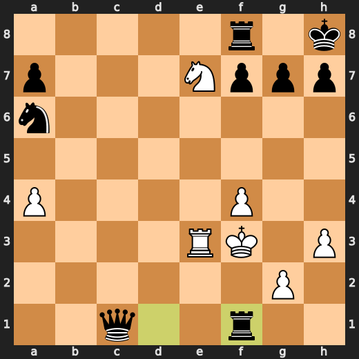

---

## Key Moments

### 💎 Brilliant-ish: 5. Qxb4 by Black

Black's decision to play Qxb4 is a good one, as it aligns with Stockfish's preference and slightly improves the position, although the centipawn loss remains minimal at 2.

- **Eval:** -0.32 → -0.30
- **Preferred:** `Qxb4`
- **Loss:** 2 cp

**Before 5. Qxb4**

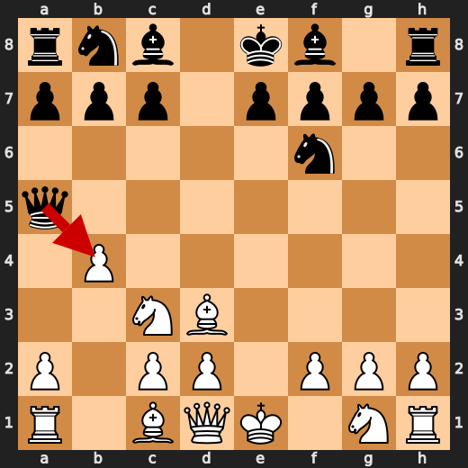

**After 5. Qxb4**

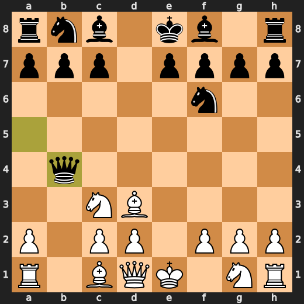

### ⚠️ Inaccuracy: 8. Bd7 by Black

Black's move Bd7 allows White to maintain a strong initiative, whereas Stockfish preferred the more prophylactic c6, which would have prevented some of the subsequent pressure on Black's position.

- **Eval:** -1.84 → -0.44
- **Preferred:** `c6`
- **Loss:** 140 cp

**Before 8. Bd7**

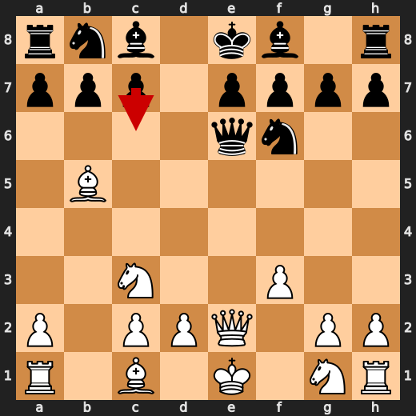

**After 8. Bd7**

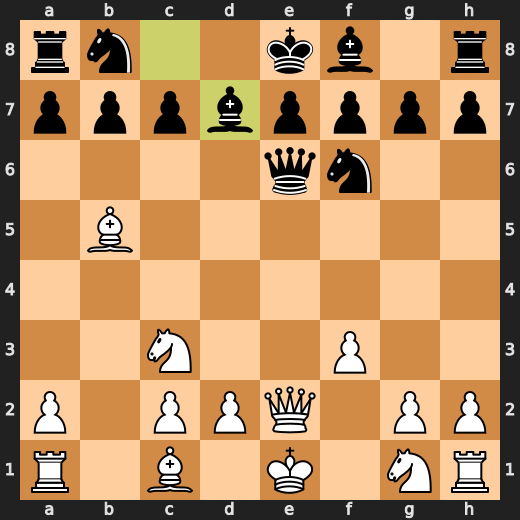

### ⚠️ Inaccuracy: 9. Qe3 by White

White's move Qe3 is an inaccuracy as it allows Black to develop their queenside pieces and gain a significant advantage, whereas Stockfish preferred the more aggressive Qxe6.

- **Eval:** -0.20 → -3.12
- **Preferred:** `Qxe6`
- **Loss:** 292 cp

**Before 9. Qe3**

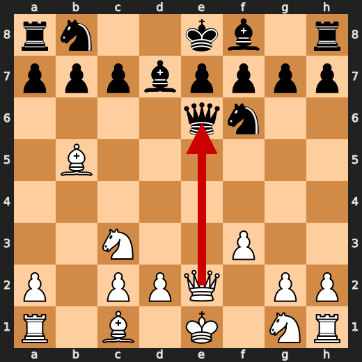

**After 9. Qe3**

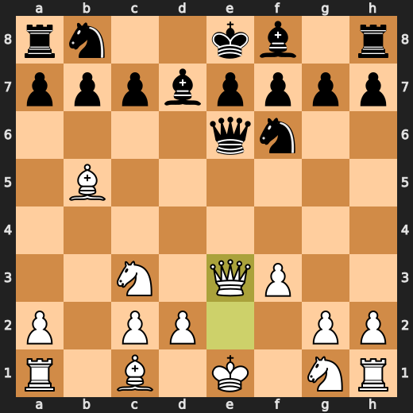

### 💎 Brilliant-ish: 9. Qxe3+ by Black

Black's queen check on e3 is a clever forcing move that Stockfish also prefers, gaining some counterplay and slightly improving the position to -2.78.

- **Eval:** -2.93 → -2.78
- **Preferred:** `Qxe3+`
- **Loss:** 15 cp

**Before 9. Qxe3+**

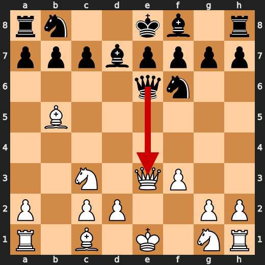

**After 9. Qxe3+**

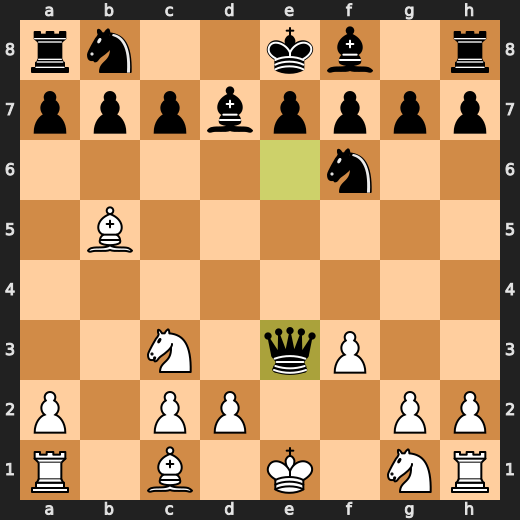

### 💎 Brilliant-ish: 10. dxe3 by White

White's played move dxe3 is a tactical choice that Stockfish prefers, slightly improving the position from -2.89 to -2.67 eval.

- **Eval:** -2.89 → -2.67
- **Preferred:** `dxe3`
- **Loss:** 0 cp

**Before 10. dxe3**

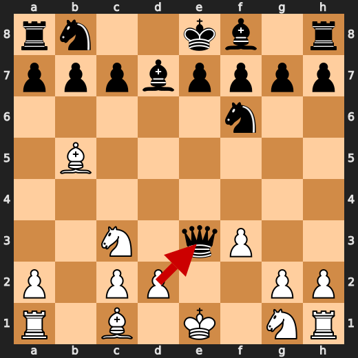

**After 10. dxe3**

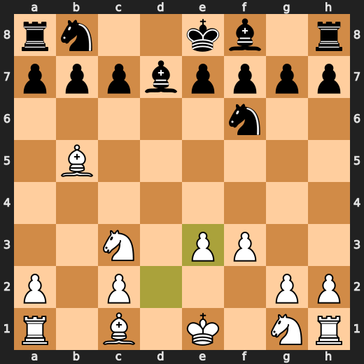

### 💎 Brilliant-ish: 11. Nxb5 by White

White's knight on b5 is a forced capture, as Stockfish preferred this move and it's the only way to challenge Black's control of the queenside.

- **Eval:** -2.62 → -2.75
- **Preferred:** `Nxb5`
- **Loss:** 13 cp

**Before 11. Nxb5**

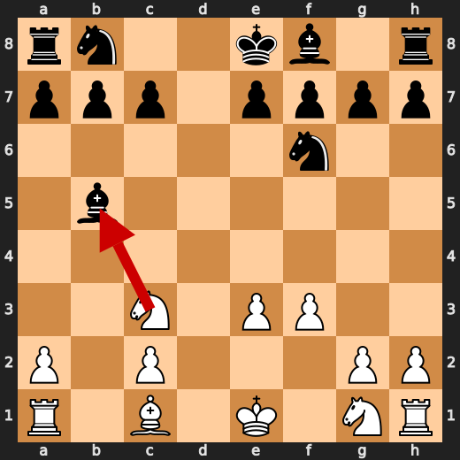

**After 11. Nxb5**

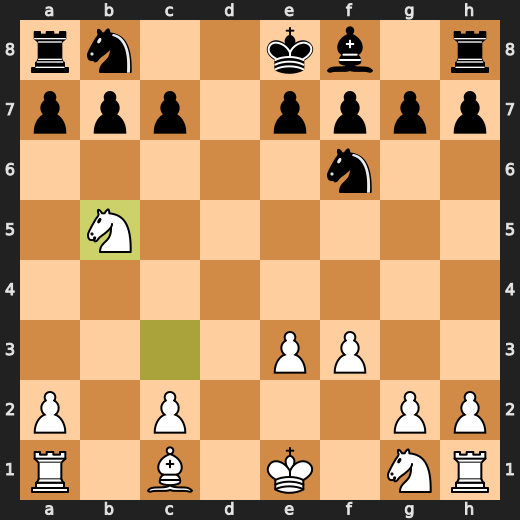

### ⚠️ Inaccuracy: 15. f4 by White

White's f4 move allows Black to develop their queenside pieces more quickly and puts pressure on the kingside, which is a departure from Stockfish's preferred Kf2 that would have maintained a slightly better balance of.

- **Eval:** -1.37 → -3.57
- **Preferred:** `Kf2`
- **Loss:** 220 cp

### ⚠️ Inaccuracy: 15. b5 by Black

Black's b5 move is an inaccuracy as it allows White to potentially develop the queenside pieces more harmoniously than Stockfish's preferred Nb4.

- **Eval:** -4.01 → -2.49
- **Preferred:** `Nb4`
- **Loss:** 152 cp

### 💀 Blunder: 16. a4 by White

White's a4 push is a blunder as it allows Black to gain space and control of the queenside without addressing the weakness on d5, according to Stockfish's evaluation.

- **Eval:** -2.77 → -9.61
- **Preferred:** `Ne5`
- **Loss:** 684 cp

### 💎 Brilliant-ish: 16. bxc4 by Black

Black's decision to play bxc4 is a nod to Stockfish's preference, as it allows for quick development and control of the queenside pawn structure without significant material loss.

- **Eval:** -8.23 → -8.30
- **Preferred:** `bxc4`
- **Loss:** 0 cp

### 💎 Brilliant-ish: 19. Nxc6 by White

White's knight on c6 is a forced move, as Stockfish preferred it and the position doesn't offer an alternative to improve the evaluation of -8.84.

- **Eval:** -8.76 → -8.84
- **Preferred:** `Nxc6`
- **Loss:** 8 cp

### 💎 Brilliant-ish: 20. Bxe3 by White

White's decision to play Bxe3 is a pragmatic choice, as it aligns with Stockfish's preference and slightly improves the position from -8.46 to -8.46.

- **Eval:** -8.61 → -8.46
- **Preferred:** `Bxe3`
- **Loss:** 0 cp

---

## Human Notes

The first major collapse was **16. a4** by **White**. That is probably the main position to review.

---

<details>
<summary>Compact move list</summary>

- 📖 **1. e4** (White, Book) — +0.46 → +0.23, preferred `d4`, loss 23 cp
- 📖 **1. d5** (Black, Book) — +0.37 → +0.88, preferred `e5`, loss 51 cp
- 📖 **2. exd5** (White, Book) — +0.83 → +0.71, preferred `exd5`, loss 12 cp
- 📖 **2. Qxd5** (Black, Book) — +0.94 → +0.99, preferred `Qxd5`, loss 5 cp
- 📖 **3. Nc3** (White, Book) — +1.04 → +0.93, preferred `Nc3`, loss 11 cp
- 📖 **3. Qa5** (Black, Book) — +0.94 → +0.93, preferred `Qd6`, loss 0 cp
- 👍 **4. Bd3** (White, Good) — +0.93 → +0.38, preferred `Nf3`, loss 55 cp
- 🔥 **4. Nf6** (Black, Great) — +0.27 → +0.48, preferred `Nf6`, loss 21 cp
- 👍 **5. b4** (White, Good) — +0.30 → -0.35, preferred `Nf3`, loss 65 cp
- 💎 **5. Qxb4** (Black, Brilliant-ish) — -0.32 → -0.30, preferred `Qxb4`, loss 2 cp
- 👍 **6. Qe2** (White, Good) — -0.22 → -0.82, preferred `Rb1`, loss 60 cp
- 🔥 **6. Qg4** (Black, Great) — -0.89 → -0.57, preferred `g6`, loss 32 cp
- 👍 **7. f3** (White, Good) — -0.35 → -1.30, preferred `Nf3`, loss 95 cp
- 🔥 **7. Qe6** (Black, Great) — -1.76 → -1.38, preferred `Qd4`, loss 38 cp
- 👍 **8. Bb5+** (White, Good) — -1.33 → -2.10, preferred `Ne4`, loss 77 cp
- ⚠️ **8. Bd7** (Black, Inaccuracy) — -1.84 → -0.44, preferred `c6`, loss 140 cp
- ⚠️ **9. Qe3** (White, Inaccuracy) — -0.20 → -3.12, preferred `Qxe6`, loss 292 cp
- 💎 **9. Qxe3+** (Black, Brilliant-ish) — -2.93 → -2.78, preferred `Qxe3+`, loss 15 cp
- 💎 **10. dxe3** (White, Brilliant-ish) — -2.89 → -2.67, preferred `dxe3`, loss 0 cp
- 👍 **10. Bxb5** (Black, Good) — -2.95 → -2.43, preferred `a6`, loss 52 cp
- 💎 **11. Nxb5** (White, Brilliant-ish) — -2.62 → -2.75, preferred `Nxb5`, loss 13 cp
- 🔥 **11. Na6** (Black, Great) — -2.85 → -2.62, preferred `Na6`, loss 23 cp
- ✅ **12. Ne2** (White, Best) — -2.87 → -3.00, preferred `Bb2`, loss 13 cp
- 👍 **12. c6** (Black, Good) — -3.14 → -2.57, preferred `e5`, loss 57 cp
- ✅ **13. Na3** (White, Best) — -2.65 → -2.78, preferred `Na3`, loss 13 cp
- 👍 **13. e5** (Black, Good) — -2.84 → -2.07, preferred `e6`, loss 77 cp
- ✅ **14. Nc4** (White, Best) — -2.55 → -2.59, preferred `Nc4`, loss 4 cp
- 👍 **14. e4** (Black, Good) — -2.34 → -1.45, preferred `Nd7`, loss 89 cp
- ⚠️ **15. f4** (White, Inaccuracy) — -1.37 → -3.57, preferred `Kf2`, loss 220 cp
- ⚠️ **15. b5** (Black, Inaccuracy) — -4.01 → -2.49, preferred `Nb4`, loss 152 cp
- 💀 **16. a4** (White, Blunder) — -2.77 → -9.61, preferred `Ne5`, loss 684 cp
- 💎 **16. bxc4** (Black, Brilliant-ish) — -8.23 → -8.30, preferred `bxc4`, loss 0 cp
- ✅ **17. O-O** (White, Best) — -8.42 → -8.53, preferred `O-O`, loss 11 cp
- 🔥 **17. Bc5** (Black, Great) — -8.61 → -8.22, preferred `c3`, loss 39 cp
- 👍 **18. Nd4** (White, Good) — -8.67 → -9.38, preferred `f5`, loss 71 cp
- 🔥 **18. Nd5** (Black, Great) — -9.15 → -8.81, preferred `Bxd4`, loss 34 cp
- 💎 **19. Nxc6** (White, Brilliant-ish) — -8.76 → -8.84, preferred `Nxc6`, loss 8 cp
- 👍 **19. Nxe3** (Black, Good) — -8.75 → -8.12, preferred `Rc8`, loss 63 cp
- 💎 **20. Bxe3** (White, Brilliant-ish) — -8.61 → -8.46, preferred `Bxe3`, loss 0 cp
- 💎 **20. Bxe3+** (Black, Brilliant-ish) — -8.37 → -8.46, preferred `Bxe3+`, loss 0 cp
- ✅ **21. Kh1** (White, Best) — -8.23 → -8.23, preferred `Kh1`, loss 0 cp
- ✅ **21. Bd2** (Black, Best) — -8.61 → -8.61, preferred `Bd2`, loss 0 cp
- 🔥 **22. c3** (White, Great) — -8.61 → -9.07, preferred `f5`, loss 46 cp
- ✅ **22. e3** (Black, Best) — -9.15 → -9.15, preferred `O-O`, loss 0 cp
- 👍 **23. Rfb1** (White, Good) — -8.84 → -9.71, preferred `Rae1`, loss 87 cp
- 💎 **23. Bxc3** (Black, Brilliant-ish) — -9.79 → -9.87, preferred `Bxc3`, loss 0 cp
- ✅ **24. Ra2** (White, Best) — -10.14 → -10.19, preferred `Kg1`, loss 5 cp
- ✅ **24. O-O** (Black, Best) — -10.15 → -10.02, preferred `Bd2`, loss 13 cp
- ✅ **25. Ne7+** (White, Best) — -9.71 → -9.76, preferred `Kg1`, loss 5 cp
- 👍 **25. Kh8** (Black, Good) — -10.44 → -9.86, preferred `Kh8`, loss 58 cp
- 👍 **26. Re2** (White, Good) — -10.12 → -10.69, preferred `Rc2`, loss 57 cp
- 🔥 **26. Bd2** (Black, Great) — -10.76 → -10.43, preferred `Bd2`, loss 33 cp
- 👍 **27. Kg1** (White, Good) — -10.84 → -11.64, preferred `Nd5`, loss 80 cp
- ✅ **27. c3** (Black, Best) — -11.61 → -11.64, preferred `c3`, loss 0 cp
- 👍 **28. Rbe1** (White, Good) — -11.83 → -13.01, preferred `Nf5`, loss 118 cp
- 🔥 **28. c2** (Black, Great) — -13.09 → -12.61, preferred `Bxe1`, loss 48 cp
- 👍 **29. Kf1** (White, Good) — -12.00 → -13.19, preferred `Nd5`, loss 119 cp
- 👍 **29. Bxe1** (Black, Good) — -13.25 → -12.30, preferred `Nb4`, loss 95 cp
- ⚠️ **30. Rxe1** (White, Inaccuracy) — -12.33 → -15.15, preferred `Rxc2`, loss 282 cp
- ✅ **30. Rad8** (Black, Best) — -15.45 → -16.92, preferred `Rab8`, loss 0 cp
- ⚠️ **31. Ke2** (White, Inaccuracy) — -17.74 → -19.03, preferred `Ke2`, loss 129 cp
- 💎 **31. Rd2+** (Black, Brilliant-ish) — -15.15 → -20.00, preferred `Rd2+`, loss 0 cp
- 👍 **32. Kf3** (White, Good) — -19.49 → -20.23, preferred `Kf3`, loss 74 cp
- ✅ **32. Rd1** (Black, Best) — -20.00 → -20.53, preferred `Rd1`, loss 0 cp
- 💀 **33. Rxe3** (White, Blunder) — -13.65 → -20.86, preferred `Rxd1`, loss 721 cp
- ✅ **33. c1=Q** (Black, Best) — -62.38 → -74.45, preferred `c1=Q`, loss 0 cp
- 💀 **34. h3** (White, Blunder) — -67.62 → Black has mate, preferred `Nf5`, loss 93238 cp
- 💎 **34. Rf1+** (Black, Brilliant-ish) — Black has mate → Black has mate, preferred `Rf1+`, loss 0 cp

</details>

---

<details>
<summary>Raw engine table</summary>

| Ply | Move | Side | Played | Label | Eval Before | Eval After | Preferred | Loss |
|---:|---:|---|---|---|---:|---:|---|---:|
| 1 | 1 | White | e4 | Book | +0.46 | +0.23 | d4 | 23 |
| 2 | 1 | Black | d5 | Book | +0.37 | +0.88 | e5 | 51 |
| 3 | 2 | White | exd5 | Book | +0.83 | +0.71 | exd5 | 12 |
| 4 | 2 | Black | Qxd5 | Book | +0.94 | +0.99 | Qxd5 | 5 |
| 5 | 3 | White | Nc3 | Book | +1.04 | +0.93 | Nc3 | 11 |
| 6 | 3 | Black | Qa5 | Book | +0.94 | +0.93 | Qd6 | 0 |
| 7 | 4 | White | Bd3 | Good | +0.93 | +0.38 | Nf3 | 55 |
| 8 | 4 | Black | Nf6 | Great | +0.27 | +0.48 | Nf6 | 21 |
| 9 | 5 | White | b4 | Good | +0.30 | -0.35 | Nf3 | 65 |
| 10 | 5 | Black | Qxb4 | Brilliant-ish | -0.32 | -0.30 | Qxb4 | 2 |
| 11 | 6 | White | Qe2 | Good | -0.22 | -0.82 | Rb1 | 60 |
| 12 | 6 | Black | Qg4 | Great | -0.89 | -0.57 | g6 | 32 |
| 13 | 7 | White | f3 | Good | -0.35 | -1.30 | Nf3 | 95 |
| 14 | 7 | Black | Qe6 | Great | -1.76 | -1.38 | Qd4 | 38 |
| 15 | 8 | White | Bb5+ | Good | -1.33 | -2.10 | Ne4 | 77 |
| 16 | 8 | Black | Bd7 | Inaccuracy | -1.84 | -0.44 | c6 | 140 |
| 17 | 9 | White | Qe3 | Inaccuracy | -0.20 | -3.12 | Qxe6 | 292 |
| 18 | 9 | Black | Qxe3+ | Brilliant-ish | -2.93 | -2.78 | Qxe3+ | 15 |
| 19 | 10 | White | dxe3 | Brilliant-ish | -2.89 | -2.67 | dxe3 | 0 |
| 20 | 10 | Black | Bxb5 | Good | -2.95 | -2.43 | a6 | 52 |
| 21 | 11 | White | Nxb5 | Brilliant-ish | -2.62 | -2.75 | Nxb5 | 13 |
| 22 | 11 | Black | Na6 | Great | -2.85 | -2.62 | Na6 | 23 |
| 23 | 12 | White | Ne2 | Best | -2.87 | -3.00 | Bb2 | 13 |
| 24 | 12 | Black | c6 | Good | -3.14 | -2.57 | e5 | 57 |
| 25 | 13 | White | Na3 | Best | -2.65 | -2.78 | Na3 | 13 |
| 26 | 13 | Black | e5 | Good | -2.84 | -2.07 | e6 | 77 |
| 27 | 14 | White | Nc4 | Best | -2.55 | -2.59 | Nc4 | 4 |
| 28 | 14 | Black | e4 | Good | -2.34 | -1.45 | Nd7 | 89 |
| 29 | 15 | White | f4 | Inaccuracy | -1.37 | -3.57 | Kf2 | 220 |
| 30 | 15 | Black | b5 | Inaccuracy | -4.01 | -2.49 | Nb4 | 152 |
| 31 | 16 | White | a4 | Blunder | -2.77 | -9.61 | Ne5 | 684 |
| 32 | 16 | Black | bxc4 | Brilliant-ish | -8.23 | -8.30 | bxc4 | 0 |
| 33 | 17 | White | O-O | Best | -8.42 | -8.53 | O-O | 11 |
| 34 | 17 | Black | Bc5 | Great | -8.61 | -8.22 | c3 | 39 |
| 35 | 18 | White | Nd4 | Good | -8.67 | -9.38 | f5 | 71 |
| 36 | 18 | Black | Nd5 | Great | -9.15 | -8.81 | Bxd4 | 34 |
| 37 | 19 | White | Nxc6 | Brilliant-ish | -8.76 | -8.84 | Nxc6 | 8 |
| 38 | 19 | Black | Nxe3 | Good | -8.75 | -8.12 | Rc8 | 63 |
| 39 | 20 | White | Bxe3 | Brilliant-ish | -8.61 | -8.46 | Bxe3 | 0 |
| 40 | 20 | Black | Bxe3+ | Brilliant-ish | -8.37 | -8.46 | Bxe3+ | 0 |
| 41 | 21 | White | Kh1 | Best | -8.23 | -8.23 | Kh1 | 0 |
| 42 | 21 | Black | Bd2 | Best | -8.61 | -8.61 | Bd2 | 0 |
| 43 | 22 | White | c3 | Great | -8.61 | -9.07 | f5 | 46 |
| 44 | 22 | Black | e3 | Best | -9.15 | -9.15 | O-O | 0 |
| 45 | 23 | White | Rfb1 | Good | -8.84 | -9.71 | Rae1 | 87 |
| 46 | 23 | Black | Bxc3 | Brilliant-ish | -9.79 | -9.87 | Bxc3 | 0 |
| 47 | 24 | White | Ra2 | Best | -10.14 | -10.19 | Kg1 | 5 |
| 48 | 24 | Black | O-O | Best | -10.15 | -10.02 | Bd2 | 13 |
| 49 | 25 | White | Ne7+ | Best | -9.71 | -9.76 | Kg1 | 5 |
| 50 | 25 | Black | Kh8 | Good | -10.44 | -9.86 | Kh8 | 58 |
| 51 | 26 | White | Re2 | Good | -10.12 | -10.69 | Rc2 | 57 |
| 52 | 26 | Black | Bd2 | Great | -10.76 | -10.43 | Bd2 | 33 |
| 53 | 27 | White | Kg1 | Good | -10.84 | -11.64 | Nd5 | 80 |
| 54 | 27 | Black | c3 | Best | -11.61 | -11.64 | c3 | 0 |
| 55 | 28 | White | Rbe1 | Good | -11.83 | -13.01 | Nf5 | 118 |
| 56 | 28 | Black | c2 | Great | -13.09 | -12.61 | Bxe1 | 48 |
| 57 | 29 | White | Kf1 | Good | -12.00 | -13.19 | Nd5 | 119 |
| 58 | 29 | Black | Bxe1 | Good | -13.25 | -12.30 | Nb4 | 95 |
| 59 | 30 | White | Rxe1 | Inaccuracy | -12.33 | -15.15 | Rxc2 | 282 |
| 60 | 30 | Black | Rad8 | Best | -15.45 | -16.92 | Rab8 | 0 |
| 61 | 31 | White | Ke2 | Inaccuracy | -17.74 | -19.03 | Ke2 | 129 |
| 62 | 31 | Black | Rd2+ | Brilliant-ish | -15.15 | -20.00 | Rd2+ | 0 |
| 63 | 32 | White | Kf3 | Good | -19.49 | -20.23 | Kf3 | 74 |
| 64 | 32 | Black | Rd1 | Best | -20.00 | -20.53 | Rd1 | 0 |
| 65 | 33 | White | Rxe3 | Blunder | -13.65 | -20.86 | Rxd1 | 721 |
| 66 | 33 | Black | c1=Q | Best | -62.38 | -74.45 | c1=Q | 0 |
| 67 | 34 | White | h3 | Blunder | -67.62 | Black has mate | Nf5 | 93238 |
| 68 | 34 | Black | Rf1+ | Brilliant-ish | Black has mate | Black has mate | Rf1+ | 0 |

</details>

---

<details>
<summary>Clean PGN</summary>

```pgn
[Event "AI Factory's Chess"]
[Site "Android Device"]
[Date "2026.05.12"]
[Round "1"]
[White "CPU (5)"]
[Black "You"]
[Result "0-1"]
[PlyCount "70"]

1. e4 d5 2. exd5 Qxd5 3. Nc3 Qa5 4. Bd3 Nf6 5. b4 Qxb4 6. Qe2 Qg4 7. f3 Qe6 8.
Bb5+ Bd7 9. Qe3 Qxe3+ 10. dxe3 Bxb5 11. Nxb5 Na6 12. Ne2 c6 13. Na3 e5 14. Nc4
e4 15. f4 b5 16. a4 bxc4 17. O-O Bc5 18. Nd4 Nd5 19. Nxc6 Nxe3 20. Bxe3 Bxe3+
21. Kh1 Bd2 22. c3 e3 23. Rfb1 Bxc3 24. Ra2 O-O 25. Ne7+ Kh8 26. Re2 Bd2 27.
Kg1 c3 28. Rbe1 c2 29. Kf1 Bxe1 30. Rxe1 Rad8 31. Ke2 Rd2+ 32. Kf3 Rd1 33. Rxe3
c1=Q 34. h3 Rf1+ 0-1
```

</details>
