# CPU (5) vs You

**Result:** 0-1  
**Date:** 2026.05.12  
**Source:** `20260512_121853_pgn_2026_05_12_12h17_81b1ab519806.pgn`  
**Engine:** Stockfish depth 14

---

## Toaster Summary

Biggest toaster scream: **34. f3** by **White**.

- **Label:** 💀 **Blunder**
- **Eval:** -57.81 → Black has mate
- **Stockfish preferred:** `f5`
- **Loss:** 94219 cp

Final move recorded by parser: **40. Rh1#** by **Black**.

- 💀 Blunders: **4**
- ❌ Mistakes: **3**
- ⚠️ Inaccuracies: **7**
- ✅ Good / best / tactical moves: **47**

---

## Final Position


---

## Key Moments

### 💎 Brilliant-ish: 5. Bxf5 by White

White's played move Bxf5 is a forced choice, as Stockfish preferred the same move and it's the most practical option to challenge Black's bishop on f5.

- **Eval:** +1.22 → +1.16
- **Preferred:** `Bxf5`
- **Loss:** 6 cp

**Before 5. Bxf5**

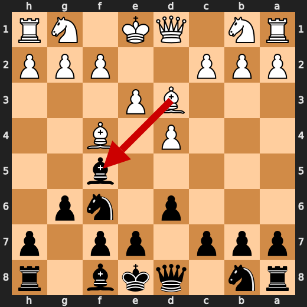

**After 5. Bxf5**

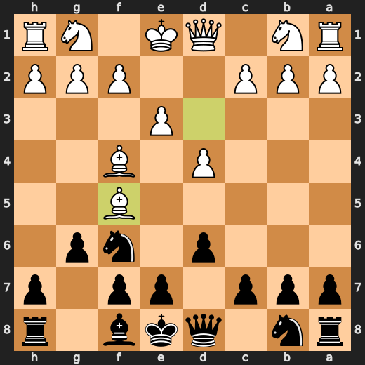

### 💎 Brilliant-ish: 5. gxf5 by Black

Black's played move gxf5 is a forced choice, as Stockfish preferred the same move and it slightly improves Black's position by +0.07 centipawns.

- **Eval:** +1.22 → +1.29
- **Preferred:** `gxf5`
- **Loss:** 7 cp

**Before 5. gxf5**

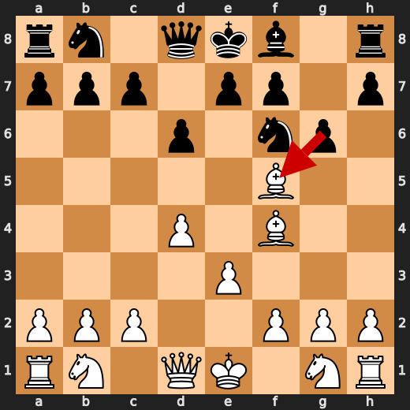

**After 5. gxf5**

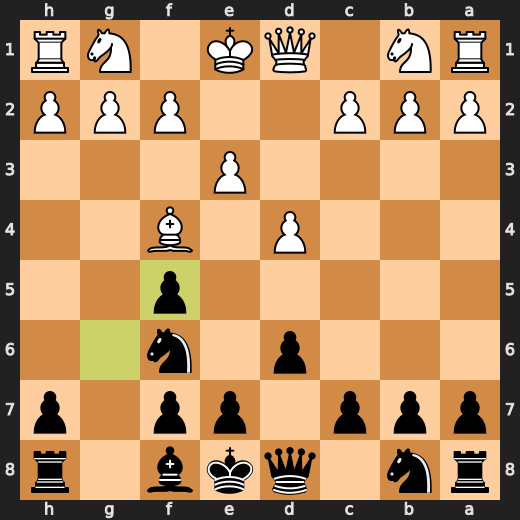

### 💎 Brilliant-ish: 7. Qb5+ by White

White's queen check on b5 is a clever forcing move that Stockfish prefers, aiming to put pressure on Black's position and potentially create counterplay.

- **Eval:** +1.52 → +1.51
- **Preferred:** `Qb5+`
- **Loss:** 1 cp

**Before 7. Qb5+**

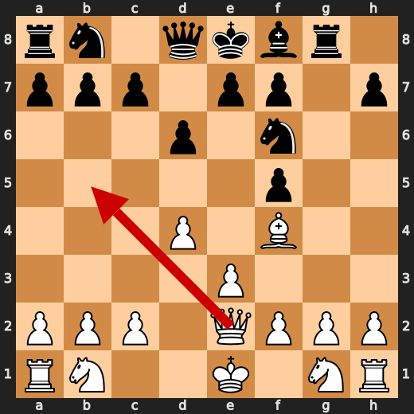

**After 7. Qb5+**

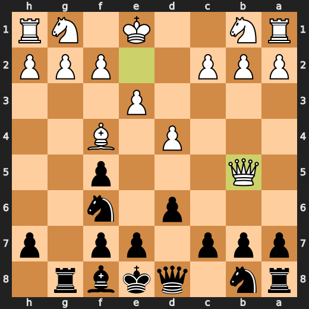

### ⚠️ Inaccuracy: 8. g3 by White

White's g3 move allows Black to equalize the position, as Stockfish had preferred Qxf5 to maintain a significant advantage of +1.82.

- **Eval:** +1.82 → +0.08
- **Preferred:** `Qxf5`
- **Loss:** 174 cp

**Before 8. g3**


**After 8. g3**


### ❌ Mistake: 8. a6 by Black

Black's played move a6 allows White to develop the queenside pieces and gain space, whereas Stockfish preferred e5 to challenge the center and improve Black's pawn structure.

- **Eval:** -3.89 → +0.84
- **Preferred:** `e5`
- **Loss:** 473 cp

**Before 8. a6**


**After 8. a6**


### 💎 Brilliant-ish: 9. Qxf5 by White

White's queen takes the f5 pawn, a move Stockfish also preferred, slightly weakening the kingside but gaining initiative and control of the open file.

- **Eval:** +0.40 → +0.26
- **Preferred:** `Qxf5`
- **Loss:** 14 cp

**Before 9. Qxf5**

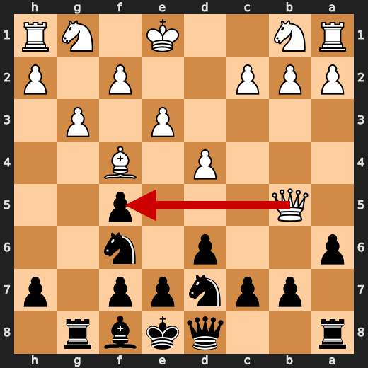

**After 9. Qxf5**

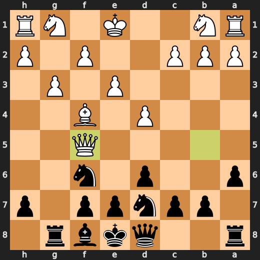

### ❌ Mistake: 11. Qa4 by White

White's queen moves to a4, but Stockfish would have preferred Qc3, which might have prevented the significant centipawn loss of 326.

- **Eval:** +0.63 → -2.63
- **Preferred:** `Qc3`
- **Loss:** 326 cp

**Before 11. Qa4**

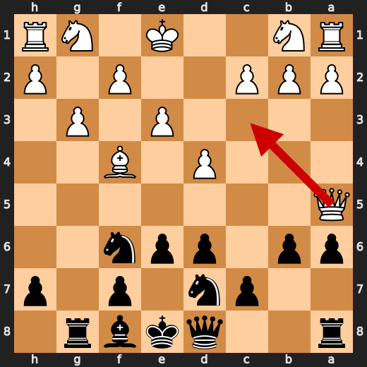

**After 11. Qa4**

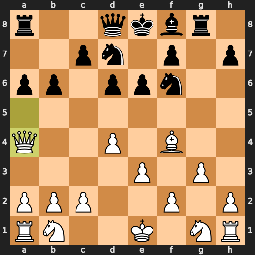

### 💎 Brilliant-ish: 14. dxe5 by Black

Black's decision to play dxe5 is a nod to Stockfish's preference, which doesn't significantly alter the evaluation, but does slightly worsen Black's position by 0 centipawns.

- **Eval:** -3.76 → -3.91
- **Preferred:** `dxe5`
- **Loss:** 0 cp

**Before 14. dxe5**

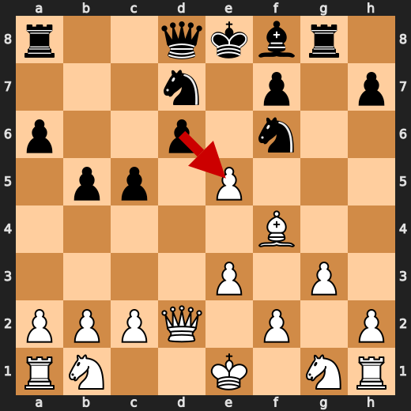

**After 14. dxe5**

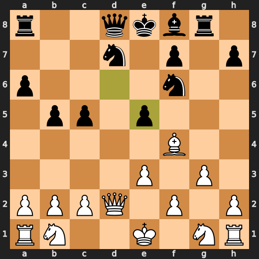

### 💎 Brilliant-ish: 15. exf4 by Black

Black's decision to exchange on f4 is a pragmatic choice, as it aligns with Stockfish's preferred move and slightly improves the position from -4.78 to -4.74 centipawns.

- **Eval:** -4.78 → -4.74
- **Preferred:** `exf4`
- **Loss:** 4 cp

**Before 15. exf4**

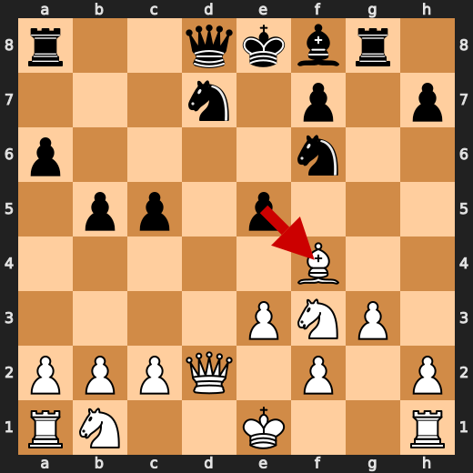

**After 15. exf4**

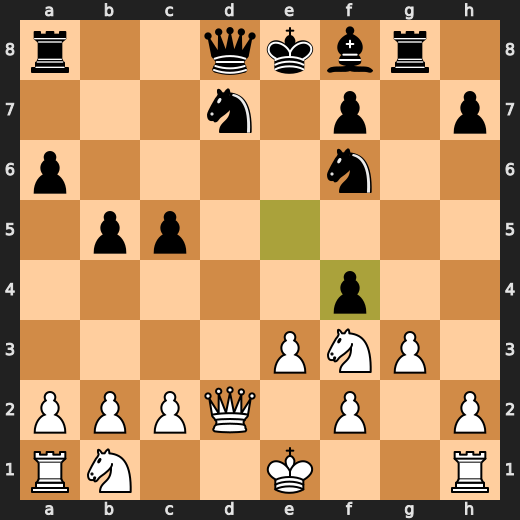

### ⚠️ Inaccuracy: 17. Rg1 by White

White's move Rg1 allows Black to maintain a strong pawn center and gain counterplay on the queenside, whereas Stockfish preferred Qxd8+ to quickly seize control of the d-file.

- **Eval:** -4.35 → -6.90
- **Preferred:** `Qxd8+`
- **Loss:** 255 cp

**Before 17. Rg1**

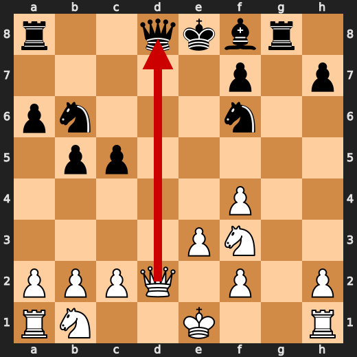

**After 17. Rg1**

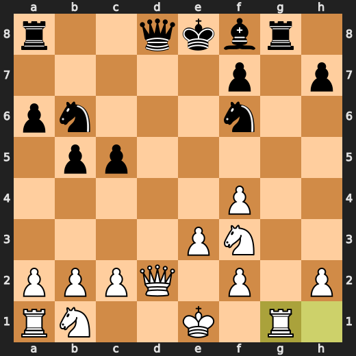

### 💎 Brilliant-ish: 17. Rxg1+ by Black

Black's decision to play Rxg1+ is a clever choice, as it aligns with Stockfish's preferred move and puts pressure on White's king without significant material loss.

- **Eval:** -6.92 → -7.07
- **Preferred:** `Rxg1+`
- **Loss:** 0 cp

**Before 17. Rxg1+**

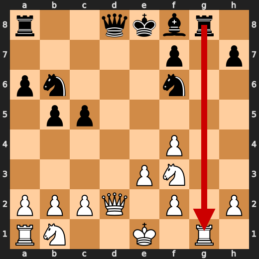

**After 17. Rxg1+**

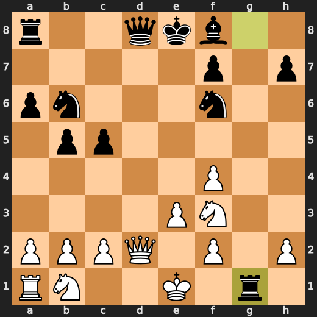

### ⚠️ Inaccuracy: 18. Qxd2+ by Black

Black's decision to play Qxd2+ instead of the engine's recommended Bg7 allows White to maintain a strong initiative and gain some counterplay on the queenside.

- **Eval:** -6.93 → -5.25
- **Preferred:** `Bg7`
- **Loss:** 168 cp

**Before 18. Qxd2+**

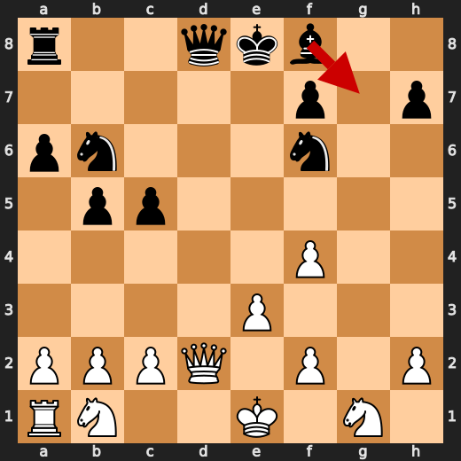

**After 18. Qxd2+**

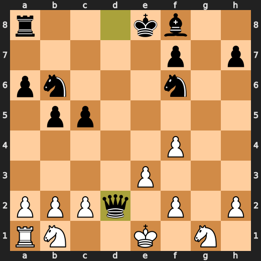

---

## Human Notes

The first major collapse was **34. f3** by **White**. That is probably the main position to review.

There was also a notable mistake at **8. a6** by **Black**.

The game-ending tactic was **40. Rh1#**.

---

<details>
<summary>Compact move list</summary>

- 📖 **1. d4** (White, Book) — +0.46 → +0.39, preferred `d4`, loss 7 cp
- 📖 **1. Nf6** (Black, Book) — +0.44 → +0.57, preferred `Nf6`, loss 13 cp
- 📖 **2. Bf4** (White, Book) — +0.47 → +0.03, preferred `c4`, loss 44 cp
- 📖 **2. d6** (Black, Book) — +0.02 → +0.36, preferred `d5`, loss 34 cp
- 📖 **3. e3** (White, Book) — +0.31 → +0.03, preferred `Nf3`, loss 28 cp
- 📖 **3. Bf5** (Black, Book) — +0.13 → +0.57, preferred `g6`, loss 44 cp
- 🔥 **4. Bd3** (White, Great) — +0.51 → +0.30, preferred `Nf3`, loss 21 cp
- 👍 **4. g6** (Black, Good) — +0.48 → +1.20, preferred `Bxd3`, loss 72 cp
- 💎 **5. Bxf5** (White, Brilliant-ish) — +1.22 → +1.16, preferred `Bxf5`, loss 6 cp
- 💎 **5. gxf5** (Black, Brilliant-ish) — +1.22 → +1.29, preferred `gxf5`, loss 7 cp
- 🔥 **6. Qe2** (White, Great) — +1.20 → +0.78, preferred `Ne2`, loss 42 cp
- 🔥 **6. Rg8** (Black, Great) — +0.82 → +1.26, preferred `Nc6`, loss 44 cp
- 💎 **7. Qb5+** (White, Brilliant-ish) — +1.52 → +1.51, preferred `Qb5+`, loss 1 cp
- 🔥 **7. Nbd7** (Black, Great) — +1.37 → +1.74, preferred `Nc6`, loss 37 cp
- ⚠️ **8. g3** (White, Inaccuracy) — +1.82 → +0.08, preferred `Qxf5`, loss 174 cp
- ❌ **8. a6** (Black, Mistake) — -3.89 → +0.84, preferred `e5`, loss 473 cp
- 💎 **9. Qxf5** (White, Brilliant-ish) — +0.40 → +0.26, preferred `Qxf5`, loss 14 cp
- 🔥 **9. e6** (Black, Great) — +0.00 → +0.25, preferred `e6`, loss 25 cp
- ✅ **10. Qa5** (White, Best) — +0.40 → +0.68, preferred `Qa5`, loss 0 cp
- 🔥 **10. b6** (Black, Great) — +0.18 → +0.59, preferred `b6`, loss 41 cp
- ❌ **11. Qa4** (White, Mistake) — +0.63 → -2.63, preferred `Qc3`, loss 326 cp
- 👍 **11. e5** (Black, Good) — -2.77 → -2.18, preferred `b5`, loss 59 cp
- 👍 **12. dxe5** (White, Good) — -2.39 → -3.25, preferred `Bxe5`, loss 86 cp
- 👍 **12. b5** (Black, Good) — -3.23 → -2.59, preferred `b5`, loss 64 cp
- 🔥 **13. Qd4** (White, Great) — -2.82 → -3.07, preferred `Qd4`, loss 25 cp
- ✅ **13. c5** (Black, Best) — -2.83 → -3.31, preferred `c5`, loss 0 cp
- 👍 **14. Qd2** (White, Good) — -3.15 → -4.02, preferred `Qd2`, loss 87 cp
- 💎 **14. dxe5** (Black, Brilliant-ish) — -3.76 → -3.91, preferred `dxe5`, loss 0 cp
- 👍 **15. Nf3** (White, Good) — -4.00 → -4.58, preferred `Ne2`, loss 58 cp
- 💎 **15. exf4** (Black, Brilliant-ish) — -4.78 → -4.74, preferred `exf4`, loss 4 cp
- 👍 **16. gxf4** (White, Good) — -4.16 → -4.94, preferred `a4`, loss 78 cp
- 👍 **16. Nb6** (Black, Good) — -5.09 → -4.49, preferred `Qb6`, loss 60 cp
- ⚠️ **17. Rg1** (White, Inaccuracy) — -4.35 → -6.90, preferred `Qxd8+`, loss 255 cp
- 💎 **17. Rxg1+** (Black, Brilliant-ish) — -6.92 → -7.07, preferred `Rxg1+`, loss 0 cp
- 🔥 **18. Nxg1** (White, Great) — -6.78 → -7.10, preferred `Nxg1`, loss 32 cp
- ⚠️ **18. Qxd2+** (Black, Inaccuracy) — -6.93 → -5.25, preferred `Bg7`, loss 168 cp
- 💎 **19. Nxd2** (White, Brilliant-ish) — -5.55 → -5.53, preferred `Nxd2`, loss 0 cp
- ✅ **19. Na4** (Black, Best) — -5.71 → -5.59, preferred `Na4`, loss 12 cp
- ✅ **20. b3** (White, Best) — -5.58 → -5.61, preferred `Rb1`, loss 3 cp
- ✅ **20. Nc3** (Black, Best) — -5.58 → -5.57, preferred `Nc3`, loss 1 cp
- 🔥 **21. a3** (White, Great) — -5.67 → -6.00, preferred `a4`, loss 33 cp
- ⚠️ **21. a5** (Black, Inaccuracy) — -6.37 → -5.15, preferred `Nfd5`, loss 122 cp
- ⚠️ **22. h3** (White, Inaccuracy) — -5.05 → -6.59, preferred `Ne2`, loss 154 cp
- 🔥 **22. a4** (Black, Great) — -6.47 → -6.20, preferred `a4`, loss 27 cp
- 💎 **23. bxa4** (White, Brilliant-ish) — -6.67 → -6.47, preferred `bxa4`, loss 0 cp
- 🔥 **23. Rxa4** (Black, Great) — -6.85 → -6.54, preferred `Rxa4`, loss 31 cp
- ✅ **24. Ne2** (White, Best) — -6.77 → -6.85, preferred `Ne2`, loss 8 cp
- 👍 **24. Nxe2** (Black, Good) — -7.00 → -6.39, preferred `Nfd5`, loss 61 cp
- 💎 **25. Kxe2** (White, Brilliant-ish) — -6.39 → -6.57, preferred `Kxe2`, loss 18 cp
- 👍 **25. c4** (Black, Good) — -6.69 → -5.88, preferred `Nd5`, loss 81 cp
- ⚠️ **26. Rd1** (White, Inaccuracy) — -5.56 → -6.76, preferred `Rg1`, loss 120 cp
- ✅ **26. Rxa3** (Black, Best) — -6.61 → -6.64, preferred `Ra5`, loss 0 cp
- ✅ **27. Rg1** (White, Best) — -6.62 → -6.71, preferred `Rg1`, loss 9 cp
- 👍 **27. Ra2** (Black, Good) — -6.71 → -6.06, preferred `Nd5`, loss 65 cp
- ✅ **28. Rg5** (White, Best) — -6.19 → -5.74, preferred `Rg5`, loss 0 cp
- 💎 **28. Rxc2** (Black, Brilliant-ish) — -6.15 → -5.90, preferred `Rxc2`, loss 25 cp
- 👍 **29. Re5+** (White, Good) — -5.95 → -6.92, preferred `Rxb5`, loss 97 cp
- 👍 **29. Be7** (Black, Good) — -7.34 → -6.46, preferred `Kd7`, loss 88 cp
- ✅ **30. Kd1** (White, Best) — -6.20 → -6.20, preferred `Kd1`, loss 0 cp
- ✅ **30. Rb2** (Black, Best) — -6.38 → -6.55, preferred `Rb2`, loss 0 cp
- ⚠️ **31. Kc1** (White, Inaccuracy) — -6.85 → -9.12, preferred `Rxb5`, loss 227 cp
- ✅ **31. c3** (Black, Best) — -8.92 → -9.00, preferred `c3`, loss 0 cp
- 🔥 **32. Nb1** (White, Great) — -8.93 → -9.38, preferred `Nf3`, loss 45 cp
- ✅ **32. b4** (Black, Best) — -8.72 → -8.87, preferred `b4`, loss 0 cp
- ❌ **33. Rxe7+** (White, Mistake) — -9.05 → -13.00, preferred `f3`, loss 395 cp
- 💎 **33. Kxe7** (Black, Brilliant-ish) — -14.07 → -57.81, preferred `Kxe7`, loss 0 cp
- 💀 **34. f3** (White, Blunder) — -57.81 → Black has mate, preferred `f5`, loss 94219 cp
- 💀 **34. Nd5** (Black, Blunder) — Black has mate → -59.82, preferred `Nd7`, loss 94018 cp
- 💀 **35. h4** (White, Blunder) — -12.21 → -59.82, preferred `h4`, loss 4761 cp
- 💀 **35. Nxe3** (Black, Blunder) — -60.55 → -12.23, preferred `Rh2`, loss 4832 cp
- 🔥 **36. Nxc3** (White, Great) — -60.64 → -60.95, preferred `Nxc3`, loss 31 cp
- 💎 **36. bxc3** (Black, Brilliant-ish) — -61.59 → Black has mate, preferred `bxc3`, loss 0 cp
- ✅ **37. h5** (White, Best) — Black has mate → Black has mate, preferred `f5`, loss 0 cp
- ✅ **37. Rh2** (Black, Best) — Black has mate → Black has mate, preferred `Rf2`, loss 0 cp
- ✅ **38. Kb1** (White, Best) — Black has mate → Black has mate, preferred `Kb1`, loss 0 cp
- ✅ **38. Nd5** (Black, Best) — Black has mate → Black has mate, preferred `Rh1+`, loss 0 cp
- ✅ **39. f5** (White, Best) — Black has mate → Black has mate, preferred `f5`, loss 0 cp
- ✅ **39. Nb4** (Black, Best) — Black has mate → Black has mate, preferred `Nb4`, loss 0 cp
- ✅ **40. f4** (White, Best) — Black has mate → Black has mate, preferred `f6+`, loss 0 cp
- 🏁 **40. Rh1#** (Black, Checkmate) — Black has mate → Black has mate, preferred `Rh1#`, loss 0 cp

</details>

---

<details>
<summary>Raw engine table</summary>

| Ply | Move | Side | Played | Label | Eval Before | Eval After | Preferred | Loss |
|---:|---:|---|---|---|---:|---:|---|---:|
| 1 | 1 | White | d4 | Book | +0.46 | +0.39 | d4 | 7 |
| 2 | 1 | Black | Nf6 | Book | +0.44 | +0.57 | Nf6 | 13 |
| 3 | 2 | White | Bf4 | Book | +0.47 | +0.03 | c4 | 44 |
| 4 | 2 | Black | d6 | Book | +0.02 | +0.36 | d5 | 34 |
| 5 | 3 | White | e3 | Book | +0.31 | +0.03 | Nf3 | 28 |
| 6 | 3 | Black | Bf5 | Book | +0.13 | +0.57 | g6 | 44 |
| 7 | 4 | White | Bd3 | Great | +0.51 | +0.30 | Nf3 | 21 |
| 8 | 4 | Black | g6 | Good | +0.48 | +1.20 | Bxd3 | 72 |
| 9 | 5 | White | Bxf5 | Brilliant-ish | +1.22 | +1.16 | Bxf5 | 6 |
| 10 | 5 | Black | gxf5 | Brilliant-ish | +1.22 | +1.29 | gxf5 | 7 |
| 11 | 6 | White | Qe2 | Great | +1.20 | +0.78 | Ne2 | 42 |
| 12 | 6 | Black | Rg8 | Great | +0.82 | +1.26 | Nc6 | 44 |
| 13 | 7 | White | Qb5+ | Brilliant-ish | +1.52 | +1.51 | Qb5+ | 1 |
| 14 | 7 | Black | Nbd7 | Great | +1.37 | +1.74 | Nc6 | 37 |
| 15 | 8 | White | g3 | Inaccuracy | +1.82 | +0.08 | Qxf5 | 174 |
| 16 | 8 | Black | a6 | Mistake | -3.89 | +0.84 | e5 | 473 |
| 17 | 9 | White | Qxf5 | Brilliant-ish | +0.40 | +0.26 | Qxf5 | 14 |
| 18 | 9 | Black | e6 | Great | +0.00 | +0.25 | e6 | 25 |
| 19 | 10 | White | Qa5 | Best | +0.40 | +0.68 | Qa5 | 0 |
| 20 | 10 | Black | b6 | Great | +0.18 | +0.59 | b6 | 41 |
| 21 | 11 | White | Qa4 | Mistake | +0.63 | -2.63 | Qc3 | 326 |
| 22 | 11 | Black | e5 | Good | -2.77 | -2.18 | b5 | 59 |
| 23 | 12 | White | dxe5 | Good | -2.39 | -3.25 | Bxe5 | 86 |
| 24 | 12 | Black | b5 | Good | -3.23 | -2.59 | b5 | 64 |
| 25 | 13 | White | Qd4 | Great | -2.82 | -3.07 | Qd4 | 25 |
| 26 | 13 | Black | c5 | Best | -2.83 | -3.31 | c5 | 0 |
| 27 | 14 | White | Qd2 | Good | -3.15 | -4.02 | Qd2 | 87 |
| 28 | 14 | Black | dxe5 | Brilliant-ish | -3.76 | -3.91 | dxe5 | 0 |
| 29 | 15 | White | Nf3 | Good | -4.00 | -4.58 | Ne2 | 58 |
| 30 | 15 | Black | exf4 | Brilliant-ish | -4.78 | -4.74 | exf4 | 4 |
| 31 | 16 | White | gxf4 | Good | -4.16 | -4.94 | a4 | 78 |
| 32 | 16 | Black | Nb6 | Good | -5.09 | -4.49 | Qb6 | 60 |
| 33 | 17 | White | Rg1 | Inaccuracy | -4.35 | -6.90 | Qxd8+ | 255 |
| 34 | 17 | Black | Rxg1+ | Brilliant-ish | -6.92 | -7.07 | Rxg1+ | 0 |
| 35 | 18 | White | Nxg1 | Great | -6.78 | -7.10 | Nxg1 | 32 |
| 36 | 18 | Black | Qxd2+ | Inaccuracy | -6.93 | -5.25 | Bg7 | 168 |
| 37 | 19 | White | Nxd2 | Brilliant-ish | -5.55 | -5.53 | Nxd2 | 0 |
| 38 | 19 | Black | Na4 | Best | -5.71 | -5.59 | Na4 | 12 |
| 39 | 20 | White | b3 | Best | -5.58 | -5.61 | Rb1 | 3 |
| 40 | 20 | Black | Nc3 | Best | -5.58 | -5.57 | Nc3 | 1 |
| 41 | 21 | White | a3 | Great | -5.67 | -6.00 | a4 | 33 |
| 42 | 21 | Black | a5 | Inaccuracy | -6.37 | -5.15 | Nfd5 | 122 |
| 43 | 22 | White | h3 | Inaccuracy | -5.05 | -6.59 | Ne2 | 154 |
| 44 | 22 | Black | a4 | Great | -6.47 | -6.20 | a4 | 27 |
| 45 | 23 | White | bxa4 | Brilliant-ish | -6.67 | -6.47 | bxa4 | 0 |
| 46 | 23 | Black | Rxa4 | Great | -6.85 | -6.54 | Rxa4 | 31 |
| 47 | 24 | White | Ne2 | Best | -6.77 | -6.85 | Ne2 | 8 |
| 48 | 24 | Black | Nxe2 | Good | -7.00 | -6.39 | Nfd5 | 61 |
| 49 | 25 | White | Kxe2 | Brilliant-ish | -6.39 | -6.57 | Kxe2 | 18 |
| 50 | 25 | Black | c4 | Good | -6.69 | -5.88 | Nd5 | 81 |
| 51 | 26 | White | Rd1 | Inaccuracy | -5.56 | -6.76 | Rg1 | 120 |
| 52 | 26 | Black | Rxa3 | Best | -6.61 | -6.64 | Ra5 | 0 |
| 53 | 27 | White | Rg1 | Best | -6.62 | -6.71 | Rg1 | 9 |
| 54 | 27 | Black | Ra2 | Good | -6.71 | -6.06 | Nd5 | 65 |
| 55 | 28 | White | Rg5 | Best | -6.19 | -5.74 | Rg5 | 0 |
| 56 | 28 | Black | Rxc2 | Brilliant-ish | -6.15 | -5.90 | Rxc2 | 25 |
| 57 | 29 | White | Re5+ | Good | -5.95 | -6.92 | Rxb5 | 97 |
| 58 | 29 | Black | Be7 | Good | -7.34 | -6.46 | Kd7 | 88 |
| 59 | 30 | White | Kd1 | Best | -6.20 | -6.20 | Kd1 | 0 |
| 60 | 30 | Black | Rb2 | Best | -6.38 | -6.55 | Rb2 | 0 |
| 61 | 31 | White | Kc1 | Inaccuracy | -6.85 | -9.12 | Rxb5 | 227 |
| 62 | 31 | Black | c3 | Best | -8.92 | -9.00 | c3 | 0 |
| 63 | 32 | White | Nb1 | Great | -8.93 | -9.38 | Nf3 | 45 |
| 64 | 32 | Black | b4 | Best | -8.72 | -8.87 | b4 | 0 |
| 65 | 33 | White | Rxe7+ | Mistake | -9.05 | -13.00 | f3 | 395 |
| 66 | 33 | Black | Kxe7 | Brilliant-ish | -14.07 | -57.81 | Kxe7 | 0 |
| 67 | 34 | White | f3 | Blunder | -57.81 | Black has mate | f5 | 94219 |
| 68 | 34 | Black | Nd5 | Blunder | Black has mate | -59.82 | Nd7 | 94018 |
| 69 | 35 | White | h4 | Blunder | -12.21 | -59.82 | h4 | 4761 |
| 70 | 35 | Black | Nxe3 | Blunder | -60.55 | -12.23 | Rh2 | 4832 |
| 71 | 36 | White | Nxc3 | Great | -60.64 | -60.95 | Nxc3 | 31 |
| 72 | 36 | Black | bxc3 | Brilliant-ish | -61.59 | Black has mate | bxc3 | 0 |
| 73 | 37 | White | h5 | Best | Black has mate | Black has mate | f5 | 0 |
| 74 | 37 | Black | Rh2 | Best | Black has mate | Black has mate | Rf2 | 0 |
| 75 | 38 | White | Kb1 | Best | Black has mate | Black has mate | Kb1 | 0 |
| 76 | 38 | Black | Nd5 | Best | Black has mate | Black has mate | Rh1+ | 0 |
| 77 | 39 | White | f5 | Best | Black has mate | Black has mate | f5 | 0 |
| 78 | 39 | Black | Nb4 | Best | Black has mate | Black has mate | Nb4 | 0 |
| 79 | 40 | White | f4 | Best | Black has mate | Black has mate | f6+ | 0 |
| 80 | 40 | Black | Rh1# | Checkmate | Black has mate | Black has mate | Rh1# | 0 |

</details>

---

<details>
<summary>Clean PGN</summary>

```pgn
[Event "AI Factory's Chess"]
[Site "Android Device"]
[Date "2026.05.12"]
[Round "1"]
[White "CPU (5)"]
[Black "You"]
[Result "0-1"]
[PlyCount "80"]

1. d4 Nf6 2. Bf4 d6 3. e3 Bf5 4. Bd3 g6 5. Bxf5 gxf5 6. Qe2 Rg8 7. Qb5+ Nbd7 8.
g3 a6 9. Qxf5 e6 10. Qa5 b6 11. Qa4 e5 12. dxe5 b5 13. Qd4 c5 14. Qd2 dxe5 15.
Nf3 exf4 16. gxf4 Nb6 17. Rg1 Rxg1+ 18. Nxg1 Qxd2+ 19. Nxd2 Na4 20. b3 Nc3 21.
a3 a5 22. h3 a4 23. bxa4 Rxa4 24. Ne2 Nxe2 25. Kxe2 c4 26. Rd1 Rxa3 27. Rg1 Ra2
28. Rg5 Rxc2 29. Re5+ Be7 30. Kd1 Rb2 31. Kc1 c3 32. Nb1 b4 33. Rxe7+ Kxe7 34.
f3 Nd5 35. h4 Nxe3 36. Nxc3 bxc3 37. h5 Rh2 38. Kb1 Nd5 39. f5 Nb4 40. f4 Rh1#
0-1
```

</details>
