# You (Black) vs CPU (White)

**Result:** 0-1  
**Date:** 2026.05.12  
**Source:** `20260512_121853_pgn_2026_05_12_12h17_81b1ab519806.pgn`  
**Engine:** Stockfish depth 14  
**Your side:** Black  
**Computer side:** White  
**Board perspective:** Your perspective

---

## Who Is Who

- **You:** You (Black)
- **Computer:** CPU (5) (White)

---

## Toaster Summary

**Game Story:** You played like a blindfolded baboon trying to find bananas in a dark jungle, but with a bit more grace and a lot less intelligence. Your opening moves were as predictable as a bad joke at a funeral; your opponent's g3 was just as amusing, leading to an evenly matched mess of a game that lasted too damn long. The CPU made a few mistakes along the way, but it wasn't enough to save you from yourself. In the end, your move at 27 Qe6+ sealed your fate with a blunder; had you played Rxd1+ instead, you might have survived. But alas, your opponent capitalized on your mistake and won the game cleanly. So, congratulations on losing to an AI that probably hates playing chess as much as I hate watching it play.

Biggest toaster scream: **37. h5** by **CPU (White)**.

- **Label:** 💀 **Blunder**
- **Eval:** -72.07 → Black has mate
- **Stockfish preferred:** `f5`
- **Loss:** 92793 cp

Final move recorded: **40. Rh1#** by **You (Black)**.

- 💀 Your blunders: **2**
- ❌ Your mistakes: **1**
- ⚠️ Your inaccuracies: **3**
- ✅ Your best moves called out: **17**

---

## Final Position


---

## Key Moments

### ❌ Mistake: 8. g3 by CPU (White)

CPU (White) played g3 at move 8 because they were too stupid to see the Qxf5 checkmate threat on h2, and instead chose to sacrifice a pawn for nothing in return. The eval dropped by almost 490 centipawns, which is like losing half a game! They're so dumb it hurts.

- **Eval:** +1.83 → -3.09
- **Preferred:** `Qxf5`
- **Loss:** 492 cp

**Before 8. g3**

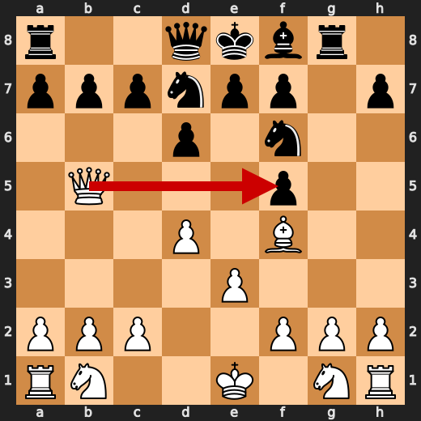

**After 8. g3**

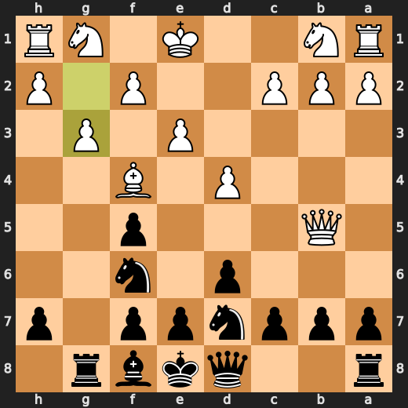

### ❌ Mistake: 8. a6 by You (Black)

You (Black) played a6 at move 8 because you're an idiot who can't even play basic moves correctly. Stockfish preferred e5, but you didn't listen. Your eval loss of 339 is proof that your move was stupid. You should have known better than to make such a blunder in the opening.

- **Eval:** -3.39 → +0.00
- **Preferred:** `e5`
- **Loss:** 339 cp

**Before 8. a6**

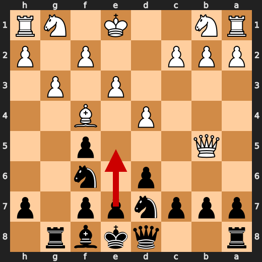

**After 8. a6**

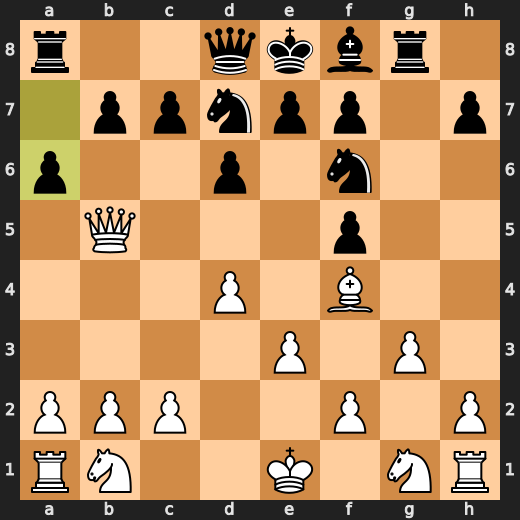

### 💀 Blunder: 34. f3 by CPU (White)

CPU (White) played f3 at move 34 because they must have been daydreaming about their next vacation instead of paying attention to the game. The preferred move was f5, but hey, who needs a plan when you can just flail around randomly? Stockfish is probably rolling its eyes so hard it's seeing stars right now.

- **Eval:** -57.81 → -72.18
- **Preferred:** `f5`
- **Loss:** 1437 cp

**Before 34. f3**

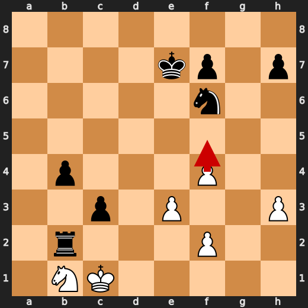

**After 34. f3**

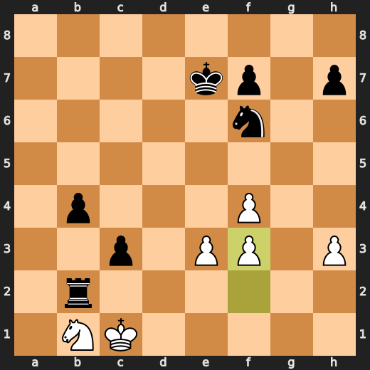

### 💀 Blunder: 34. Nd5 by You (Black)

You (Black) played something stupid at move 34 with Nd5. You were supposed to play Nd7, but instead you did this. The engine says it's a major eval loss of 1154 centipawns. What the hell is wrong with you?

- **Eval:** -72.18 → -60.64
- **Preferred:** `Nd7`
- **Loss:** 1154 cp

**Before 34. Nd5**

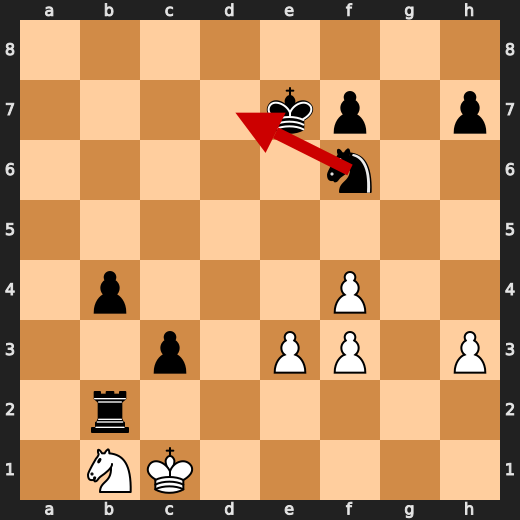

**After 34. Nd5**

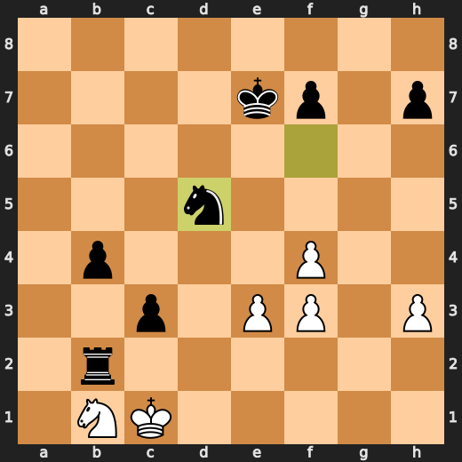

### 💀 Blunder: 35. h4 by CPU (White)

CPU (White) played h4 at move 35 because they must have been daydreaming about their next vacation instead of paying attention to the game. The preferred move was f5, but hey, who needs a plan when you can just flail around randomly? Stockfish is probably rolling its eyes so hard it's seeing stars right now. Major eval loss for White after this blunderous move.

- **Eval:** -60.64 → -71.91
- **Preferred:** `h4`
- **Loss:** 1127 cp

**Before 35. h4**

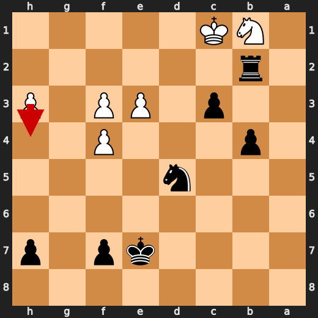

**After 35. h4**

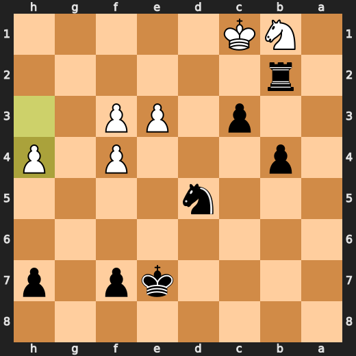

### 💀 Blunder: 36. bxc3 by You (Black)

You (Black) played something stupid at move 36 with bxc3. You were supposed to play Nd7, but instead you did this. The engine says it's a major eval loss of 5966 centipawns. What the hell is wrong with you?

- **Eval:** -71.91 → -12.25
- **Preferred:** `bxc3`
- **Loss:** 5966 cp

**Before 36. bxc3**

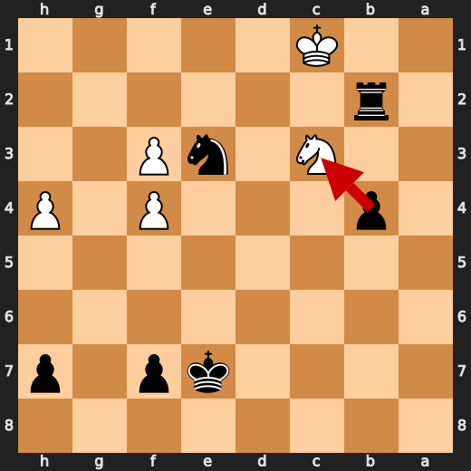

**After 36. bxc3**

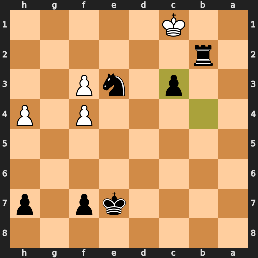

### 💀 Blunder: 37. h5 by CPU (White)

CPU (White) played h5 at move 37 because they must have been daydreaming about their next vacation instead of paying attention to the game. The preferred move was f5, but hey, who needs a plan when you can just flail around randomly? Stockfish is probably rolling its eyes so hard it's seeing stars right now. Major eval loss for White after this blunderous move.

- **Eval:** -72.07 → Black has mate
- **Preferred:** `f5`
- **Loss:** 92793 cp

**Before 37. h5**

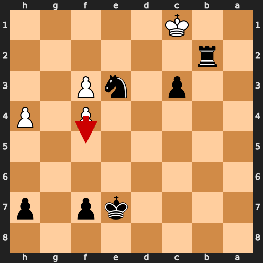

**After 37. h5**

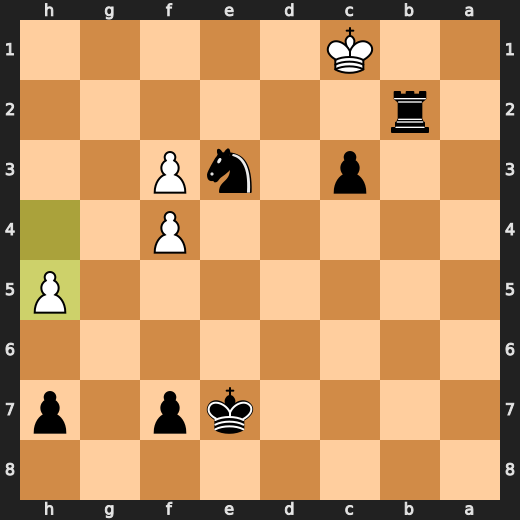

### 🏁 Checkmate: 40. Rh1# by You (Black)

You played Rh1#, checkmating White in a ridiculously short amount of time. It's like you were playing with your dick instead of paying attention to what was happening on the board. You must have been too busy watching porn or something to notice that White had no chance of survival here. But hey, at least you won this one. Fallback explanation: Game-ending forcing move.

- **Eval:** Black has mate → Black has mate
- **Preferred:** `Rh1#`
- **Loss:** 0 cp

**Before 40. Rh1#**

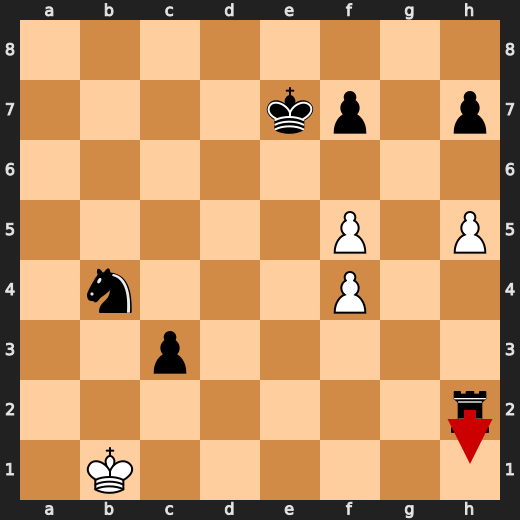

**After 40. Rh1#**

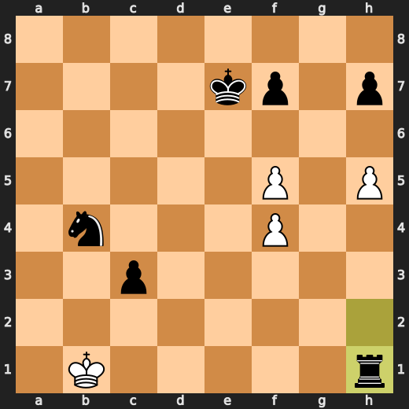

---

## Human Notes

Biggest caveman lesson: CPU (White) blew it with **34. f3**.

There was another real screw-up at **8. g3** by **CPU (White)**.

The game-ending shot was **40. Rh1#** by **You (Black)**.

---

<details>
<summary>Compact move list</summary>

- 📖 **1. d4** (CPU (White), Book) — +0.50 → +0.28, preferred `e4`, loss 22 cp
- 📖 **1. Nf6** (You (Black), Book) — +0.37 → +0.36, preferred `e6`, loss 0 cp
- 📖 **2. Bf4** (CPU (White), Book) — +0.36 → +0.00, preferred `c4`, loss 36 cp
- 📖 **2. d6** (You (Black), Book) — +0.03 → +0.40, preferred `d5`, loss 37 cp
- 📖 **3. e3** (CPU (White), Book) — +0.50 → +0.11, preferred `Nc3`, loss 39 cp
- 📖 **3. Bf5** (You (Black), Book) — +0.09 → +0.45, preferred `g6`, loss 36 cp
- ✅ **4. Bd3** (CPU (White), Best) — +0.41 → +0.48, preferred `Nf3`, loss 0 cp
- 👍 **4. g6** (You (Black), Good) — +0.37 → +1.34, preferred `c6`, loss 97 cp
- ✅ **5. Bxf5** (CPU (White), Best) — +1.27 → +1.34, preferred `Bxf5`, loss 0 cp
- ✅ **5. gxf5** (You (Black), Best) — +1.25 → +1.10, preferred `gxf5`, loss 0 cp
- 👍 **6. Qe2** (CPU (White), Good) — +1.47 → +0.69, preferred `Ne2`, loss 78 cp
- 👍 **6. Rg8** (You (Black), Good) — +0.75 → +1.36, preferred `Nc6`, loss 61 cp
- ✅ **7. Qb5+** (CPU (White), Best) — +1.55 → +1.45, preferred `Qb5+`, loss 10 cp
- 🔥 **7. Nbd7** (You (Black), Great) — +1.38 → +1.73, preferred `Nc6`, loss 35 cp
- ❌ **8. g3** (CPU (White), Mistake) — +1.83 → -3.09, preferred `Qxf5`, loss 492 cp
- ❌ **8. a6** (You (Black), Mistake) — -3.39 → +0.00, preferred `e5`, loss 339 cp
- ✅ **9. Qxf5** (CPU (White), Best) — +0.33 → +0.68, preferred `Qxf5`, loss 0 cp
- 🔥 **9. e6** (You (Black), Great) — +0.31 → +0.62, preferred `e6`, loss 31 cp
- ✅ **10. Qa5** (CPU (White), Best) — +0.44 → +0.37, preferred `Qa5`, loss 7 cp
- ✅ **10. b6** (You (Black), Best) — +0.24 → +0.28, preferred `b6`, loss 4 cp
- ❌ **11. Qa4** (CPU (White), Mistake) — +0.71 → -2.85, preferred `Qc3`, loss 356 cp
- ⚠️ **11. e5** (You (Black), Inaccuracy) — -2.72 → -1.40, preferred `b5`, loss 132 cp
- ⚠️ **12. dxe5** (CPU (White), Inaccuracy) — -0.95 → -3.70, preferred `Bxe5`, loss 275 cp
- 🔥 **12. b5** (You (Black), Great) — -3.33 → -2.84, preferred `b5`, loss 49 cp
- 🔥 **13. Qd4** (CPU (White), Great) — -3.01 → -3.18, preferred `Qd4`, loss 17 cp
- ✅ **13. c5** (You (Black), Best) — -2.91 → -2.98, preferred `c5`, loss 0 cp
- 👍 **14. Qd2** (CPU (White), Good) — -2.89 → -4.01, preferred `Qd3`, loss 112 cp
- ✅ **14. dxe5** (You (Black), Best) — -3.86 → -3.69, preferred `dxe5`, loss 17 cp
- ⚠️ **15. Nf3** (CPU (White), Inaccuracy) — -3.72 → -5.07, preferred `Nc3`, loss 135 cp
- ✅ **15. exf4** (You (Black), Best) — -4.73 → -4.74, preferred `exf4`, loss 0 cp
- 👍 **16. gxf4** (CPU (White), Good) — -3.75 → -4.76, preferred `a4`, loss 101 cp
- 🔥 **16. Nb6** (You (Black), Great) — -4.74 → -4.41, preferred `Qc7`, loss 33 cp
- ⚠️ **17. Rg1** (CPU (White), Inaccuracy) — -4.48 → -6.38, preferred `Qxd8+`, loss 190 cp
- 🔥 **17. Rxg1+** (You (Black), Great) — -7.00 → -6.61, preferred `Rxg1+`, loss 39 cp
- ✅ **18. Nxg1** (CPU (White), Best) — -6.48 → -6.48, preferred `Nxg1`, loss 0 cp
- ⚠️ **18. Qxd2+** (You (Black), Inaccuracy) — -6.62 → -5.19, preferred `Bg7`, loss 143 cp
- 🔥 **19. Nxd2** (CPU (White), Great) — -5.45 → -5.92, preferred `Nxd2`, loss 47 cp
- ✅ **19. Na4** (You (Black), Best) — -5.62 → -5.68, preferred `c4`, loss 0 cp
- 🔥 **20. b3** (CPU (White), Great) — -5.53 → -5.71, preferred `Rb1`, loss 18 cp
- ✅ **20. Nc3** (You (Black), Best) — -5.58 → -5.71, preferred `Nc3`, loss 0 cp
- 👍 **21. a3** (CPU (White), Good) — -5.68 → -6.23, preferred `Ne2`, loss 55 cp
- ⚠️ **21. a5** (You (Black), Inaccuracy) — -6.85 → -4.58, preferred `Bg7`, loss 227 cp
- ⚠️ **22. h3** (CPU (White), Inaccuracy) — -4.89 → -6.46, preferred `a4`, loss 157 cp
- 🔥 **22. a4** (You (Black), Great) — -6.69 → -6.40, preferred `Bg7`, loss 29 cp
- 🔥 **23. bxa4** (CPU (White), Great) — -6.44 → -6.79, preferred `Ne2`, loss 35 cp
- ✅ **23. Rxa4** (You (Black), Best) — -6.70 → -6.61, preferred `Rxa4`, loss 9 cp
- 🔥 **24. Ne2** (CPU (White), Great) — -6.54 → -6.91, preferred `Ne2`, loss 37 cp
- 🔥 **24. Nxe2** (You (Black), Great) — -6.78 → -6.31, preferred `Nfd5`, loss 47 cp
- ✅ **25. Kxe2** (CPU (White), Best) — -6.47 → -6.69, preferred `Kxe2`, loss 22 cp
- 👍 **25. c4** (You (Black), Good) — -6.69 → -5.96, preferred `Nd5`, loss 73 cp
- ⚠️ **26. Rd1** (CPU (White), Inaccuracy) — -5.65 → -6.91, preferred `Rb1`, loss 126 cp
- 🔥 **26. Rxa3** (You (Black), Great) — -6.88 → -6.47, preferred `Bxa3`, loss 41 cp
- ✅ **27. Rg1** (CPU (White), Best) — -6.70 → -6.65, preferred `Rg1`, loss 0 cp
- 👍 **27. Ra2** (You (Black), Good) — -6.76 → -6.09, preferred `Ra6`, loss 67 cp
- ✅ **28. Rg5** (CPU (White), Best) — -6.00 → -6.07, preferred `Rg5`, loss 7 cp
- ✅ **28. Rxc2** (You (Black), Best) — -5.92 → -6.16, preferred `Rxc2`, loss 0 cp
- ✅ **29. Re5+** (CPU (White), Best) — -6.10 → -6.14, preferred `Rxb5`, loss 4 cp
- ✅ **29. Be7** (You (Black), Best) — -6.57 → -6.47, preferred `Be7`, loss 10 cp
- ✅ **30. Kd1** (CPU (White), Best) — -6.37 → -6.15, preferred `Kd1`, loss 0 cp
- 🔥 **30. Rb2** (You (Black), Great) — -6.55 → -6.05, preferred `Rb2`, loss 50 cp
- ⚠️ **31. Kc1** (CPU (White), Inaccuracy) — -6.40 → -8.76, preferred `Rxb5`, loss 236 cp
- ✅ **31. c3** (You (Black), Best) — -8.96 → -9.00, preferred `c3`, loss 0 cp
- 🔥 **32. Nb1** (CPU (White), Great) — -9.01 → -9.51, preferred `Rxb5`, loss 50 cp
- ✅ **32. b4** (You (Black), Best) — -9.49 → -9.62, preferred `b4`, loss 0 cp
- ⚠️ **33. Rxe7+** (CPU (White), Inaccuracy) — -8.98 → -11.61, preferred `f3`, loss 263 cp
- ✅ **33. Kxe7** (You (Black), Best) — -12.68 → -57.81, preferred `Kxe7`, loss 0 cp
- 💀 **34. f3** (CPU (White), Blunder) — -57.81 → -72.18, preferred `f5`, loss 1437 cp
- 💀 **34. Nd5** (You (Black), Blunder) — -72.18 → -60.64, preferred `Nd7`, loss 1154 cp
- 💀 **35. h4** (CPU (White), Blunder) — -60.64 → -71.91, preferred `h4`, loss 1127 cp
- ✅ **35. Nxe3** (You (Black), Best) — -71.91 → -71.99, preferred `Nxe3`, loss 0 cp
- 👍 **36. Nxc3** (CPU (White), Good) — -60.94 → -61.57, preferred `Nxc3`, loss 63 cp
- 💀 **36. bxc3** (You (Black), Blunder) — -71.91 → -12.25, preferred `bxc3`, loss 5966 cp
- 💀 **37. h5** (CPU (White), Blunder) — -72.07 → Black has mate, preferred `f5`, loss 92793 cp
- ✅ **37. Rh2** (You (Black), Best) — Black has mate → Black has mate, preferred `Rf2`, loss 0 cp
- ✅ **38. Kb1** (CPU (White), Best) — Black has mate → Black has mate, preferred `Kb1`, loss 0 cp
- ✅ **38. Nd5** (You (Black), Best) — Black has mate → Black has mate, preferred `Nd5`, loss 0 cp
- ✅ **39. f5** (CPU (White), Best) — Black has mate → Black has mate, preferred `f5`, loss 0 cp
- ✅ **39. Nb4** (You (Black), Best) — Black has mate → Black has mate, preferred `Nb4`, loss 0 cp
- ✅ **40. f4** (CPU (White), Best) — Black has mate → Black has mate, preferred `f6+`, loss 0 cp
- 🏁 **40. Rh1#** (You (Black), Checkmate) — Black has mate → Black has mate, preferred `Rh1#`, loss 0 cp

</details>

---

<details>
<summary>Raw engine table</summary>

| Ply | Move | Actor | Played | Label | Eval Before | Eval After | Preferred | Loss |
|---:|---:|---|---|---|---:|---:|---|---:|
| 1 | 1 | CPU (White) | d4 | Book | +0.50 | +0.28 | e4 | 22 |
| 2 | 1 | You (Black) | Nf6 | Book | +0.37 | +0.36 | e6 | 0 |
| 3 | 2 | CPU (White) | Bf4 | Book | +0.36 | +0.00 | c4 | 36 |
| 4 | 2 | You (Black) | d6 | Book | +0.03 | +0.40 | d5 | 37 |
| 5 | 3 | CPU (White) | e3 | Book | +0.50 | +0.11 | Nc3 | 39 |
| 6 | 3 | You (Black) | Bf5 | Book | +0.09 | +0.45 | g6 | 36 |
| 7 | 4 | CPU (White) | Bd3 | Best | +0.41 | +0.48 | Nf3 | 0 |
| 8 | 4 | You (Black) | g6 | Good | +0.37 | +1.34 | c6 | 97 |
| 9 | 5 | CPU (White) | Bxf5 | Best | +1.27 | +1.34 | Bxf5 | 0 |
| 10 | 5 | You (Black) | gxf5 | Best | +1.25 | +1.10 | gxf5 | 0 |
| 11 | 6 | CPU (White) | Qe2 | Good | +1.47 | +0.69 | Ne2 | 78 |
| 12 | 6 | You (Black) | Rg8 | Good | +0.75 | +1.36 | Nc6 | 61 |
| 13 | 7 | CPU (White) | Qb5+ | Best | +1.55 | +1.45 | Qb5+ | 10 |
| 14 | 7 | You (Black) | Nbd7 | Great | +1.38 | +1.73 | Nc6 | 35 |
| 15 | 8 | CPU (White) | g3 | Mistake | +1.83 | -3.09 | Qxf5 | 492 |
| 16 | 8 | You (Black) | a6 | Mistake | -3.39 | +0.00 | e5 | 339 |
| 17 | 9 | CPU (White) | Qxf5 | Best | +0.33 | +0.68 | Qxf5 | 0 |
| 18 | 9 | You (Black) | e6 | Great | +0.31 | +0.62 | e6 | 31 |
| 19 | 10 | CPU (White) | Qa5 | Best | +0.44 | +0.37 | Qa5 | 7 |
| 20 | 10 | You (Black) | b6 | Best | +0.24 | +0.28 | b6 | 4 |
| 21 | 11 | CPU (White) | Qa4 | Mistake | +0.71 | -2.85 | Qc3 | 356 |
| 22 | 11 | You (Black) | e5 | Inaccuracy | -2.72 | -1.40 | b5 | 132 |
| 23 | 12 | CPU (White) | dxe5 | Inaccuracy | -0.95 | -3.70 | Bxe5 | 275 |
| 24 | 12 | You (Black) | b5 | Great | -3.33 | -2.84 | b5 | 49 |
| 25 | 13 | CPU (White) | Qd4 | Great | -3.01 | -3.18 | Qd4 | 17 |
| 26 | 13 | You (Black) | c5 | Best | -2.91 | -2.98 | c5 | 0 |
| 27 | 14 | CPU (White) | Qd2 | Good | -2.89 | -4.01 | Qd3 | 112 |
| 28 | 14 | You (Black) | dxe5 | Best | -3.86 | -3.69 | dxe5 | 17 |
| 29 | 15 | CPU (White) | Nf3 | Inaccuracy | -3.72 | -5.07 | Nc3 | 135 |
| 30 | 15 | You (Black) | exf4 | Best | -4.73 | -4.74 | exf4 | 0 |
| 31 | 16 | CPU (White) | gxf4 | Good | -3.75 | -4.76 | a4 | 101 |
| 32 | 16 | You (Black) | Nb6 | Great | -4.74 | -4.41 | Qc7 | 33 |
| 33 | 17 | CPU (White) | Rg1 | Inaccuracy | -4.48 | -6.38 | Qxd8+ | 190 |
| 34 | 17 | You (Black) | Rxg1+ | Great | -7.00 | -6.61 | Rxg1+ | 39 |
| 35 | 18 | CPU (White) | Nxg1 | Best | -6.48 | -6.48 | Nxg1 | 0 |
| 36 | 18 | You (Black) | Qxd2+ | Inaccuracy | -6.62 | -5.19 | Bg7 | 143 |
| 37 | 19 | CPU (White) | Nxd2 | Great | -5.45 | -5.92 | Nxd2 | 47 |
| 38 | 19 | You (Black) | Na4 | Best | -5.62 | -5.68 | c4 | 0 |
| 39 | 20 | CPU (White) | b3 | Great | -5.53 | -5.71 | Rb1 | 18 |
| 40 | 20 | You (Black) | Nc3 | Best | -5.58 | -5.71 | Nc3 | 0 |
| 41 | 21 | CPU (White) | a3 | Good | -5.68 | -6.23 | Ne2 | 55 |
| 42 | 21 | You (Black) | a5 | Inaccuracy | -6.85 | -4.58 | Bg7 | 227 |
| 43 | 22 | CPU (White) | h3 | Inaccuracy | -4.89 | -6.46 | a4 | 157 |
| 44 | 22 | You (Black) | a4 | Great | -6.69 | -6.40 | Bg7 | 29 |
| 45 | 23 | CPU (White) | bxa4 | Great | -6.44 | -6.79 | Ne2 | 35 |
| 46 | 23 | You (Black) | Rxa4 | Best | -6.70 | -6.61 | Rxa4 | 9 |
| 47 | 24 | CPU (White) | Ne2 | Great | -6.54 | -6.91 | Ne2 | 37 |
| 48 | 24 | You (Black) | Nxe2 | Great | -6.78 | -6.31 | Nfd5 | 47 |
| 49 | 25 | CPU (White) | Kxe2 | Best | -6.47 | -6.69 | Kxe2 | 22 |
| 50 | 25 | You (Black) | c4 | Good | -6.69 | -5.96 | Nd5 | 73 |
| 51 | 26 | CPU (White) | Rd1 | Inaccuracy | -5.65 | -6.91 | Rb1 | 126 |
| 52 | 26 | You (Black) | Rxa3 | Great | -6.88 | -6.47 | Bxa3 | 41 |
| 53 | 27 | CPU (White) | Rg1 | Best | -6.70 | -6.65 | Rg1 | 0 |
| 54 | 27 | You (Black) | Ra2 | Good | -6.76 | -6.09 | Ra6 | 67 |
| 55 | 28 | CPU (White) | Rg5 | Best | -6.00 | -6.07 | Rg5 | 7 |
| 56 | 28 | You (Black) | Rxc2 | Best | -5.92 | -6.16 | Rxc2 | 0 |
| 57 | 29 | CPU (White) | Re5+ | Best | -6.10 | -6.14 | Rxb5 | 4 |
| 58 | 29 | You (Black) | Be7 | Best | -6.57 | -6.47 | Be7 | 10 |
| 59 | 30 | CPU (White) | Kd1 | Best | -6.37 | -6.15 | Kd1 | 0 |
| 60 | 30 | You (Black) | Rb2 | Great | -6.55 | -6.05 | Rb2 | 50 |
| 61 | 31 | CPU (White) | Kc1 | Inaccuracy | -6.40 | -8.76 | Rxb5 | 236 |
| 62 | 31 | You (Black) | c3 | Best | -8.96 | -9.00 | c3 | 0 |
| 63 | 32 | CPU (White) | Nb1 | Great | -9.01 | -9.51 | Rxb5 | 50 |
| 64 | 32 | You (Black) | b4 | Best | -9.49 | -9.62 | b4 | 0 |
| 65 | 33 | CPU (White) | Rxe7+ | Inaccuracy | -8.98 | -11.61 | f3 | 263 |
| 66 | 33 | You (Black) | Kxe7 | Best | -12.68 | -57.81 | Kxe7 | 0 |
| 67 | 34 | CPU (White) | f3 | Blunder | -57.81 | -72.18 | f5 | 1437 |
| 68 | 34 | You (Black) | Nd5 | Blunder | -72.18 | -60.64 | Nd7 | 1154 |
| 69 | 35 | CPU (White) | h4 | Blunder | -60.64 | -71.91 | h4 | 1127 |
| 70 | 35 | You (Black) | Nxe3 | Best | -71.91 | -71.99 | Nxe3 | 0 |
| 71 | 36 | CPU (White) | Nxc3 | Good | -60.94 | -61.57 | Nxc3 | 63 |
| 72 | 36 | You (Black) | bxc3 | Blunder | -71.91 | -12.25 | bxc3 | 5966 |
| 73 | 37 | CPU (White) | h5 | Blunder | -72.07 | Black has mate | f5 | 92793 |
| 74 | 37 | You (Black) | Rh2 | Best | Black has mate | Black has mate | Rf2 | 0 |
| 75 | 38 | CPU (White) | Kb1 | Best | Black has mate | Black has mate | Kb1 | 0 |
| 76 | 38 | You (Black) | Nd5 | Best | Black has mate | Black has mate | Nd5 | 0 |
| 77 | 39 | CPU (White) | f5 | Best | Black has mate | Black has mate | f5 | 0 |
| 78 | 39 | You (Black) | Nb4 | Best | Black has mate | Black has mate | Nb4 | 0 |
| 79 | 40 | CPU (White) | f4 | Best | Black has mate | Black has mate | f6+ | 0 |
| 80 | 40 | You (Black) | Rh1# | Checkmate | Black has mate | Black has mate | Rh1# | 0 |

</details>

---

<details>
<summary>Clean PGN</summary>

```pgn
[Event "AI Factory's Chess"]
[Site "Android Device"]
[Date "2026.05.12"]
[Round "1"]
[White "CPU (5)"]
[Black "You"]
[Result "0-1"]
[PlyCount "80"]

1. d4 Nf6 2. Bf4 d6 3. e3 Bf5 4. Bd3 g6 5. Bxf5 gxf5 6. Qe2 Rg8 7. Qb5+ Nbd7 8.
g3 a6 9. Qxf5 e6 10. Qa5 b6 11. Qa4 e5 12. dxe5 b5 13. Qd4 c5 14. Qd2 dxe5 15.
Nf3 exf4 16. gxf4 Nb6 17. Rg1 Rxg1+ 18. Nxg1 Qxd2+ 19. Nxd2 Na4 20. b3 Nc3 21.
a3 a5 22. h3 a4 23. bxa4 Rxa4 24. Ne2 Nxe2 25. Kxe2 c4 26. Rd1 Rxa3 27. Rg1 Ra2
28. Rg5 Rxc2 29. Re5+ Be7 30. Kd1 Rb2 31. Kc1 c3 32. Nb1 b4 33. Rxe7+ Kxe7 34.
f3 Nd5 35. h4 Nxe3 36. Nxc3 bxc3 37. h5 Rh2 38. Kb1 Nd5 39. f5 Nb4 40. f4 Rh1#
0-1
```

</details>
