# You vs CPU (5)

**Result:** 1-0  
**Date:** 2026.05.12  
**Source:** `20260512_092036_pgn_2026_05_12_09h09.pgn`  
**Engine:** Stockfish depth 14

---

## Toaster Summary

Biggest toaster scream: **13. Bg4** by **Black**.

- **Label:** 💀 **Blunder**
- **Eval:** +14.53 → White has mate
- **Stockfish preferred:** `Rd8`
- **Loss:** 98547 cp

Final move recorded by parser: **15. Bc5#** by **White**.

- 💀 Blunders: **2**
- ❌ Mistakes: **0**
- ⚠️ Inaccuracies: **2**
- ✅ Good / best / tactical moves: **16**

---

## Final Position

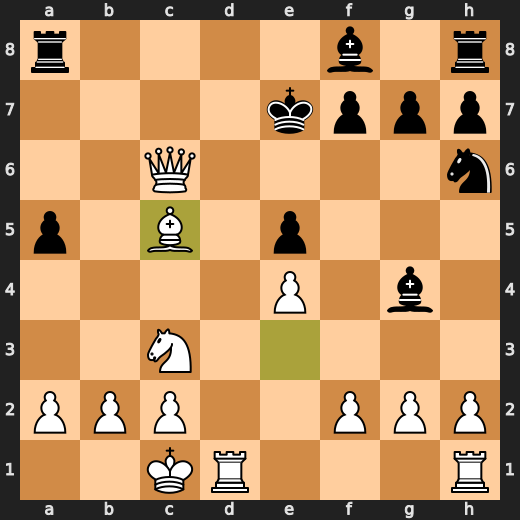

---

## Key Moments

### ⚠️ Inaccuracy: 2. Qa5+ by Black

Black's Qa5+ is an inaccuracy as it allows White to develop the queenside pieces and gain a strong initiative, whereas cxd4 was preferred by Stockfish.

- **Eval:** +0.22 → +1.81
- **Preferred:** `cxd4`
- **Loss:** 159 cp

**Before 2. Qa5+**

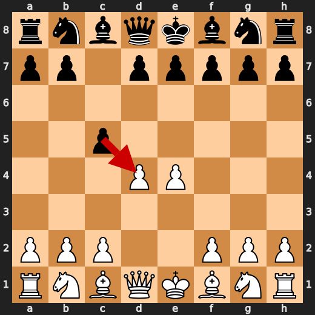

**After 2. Qa5+**

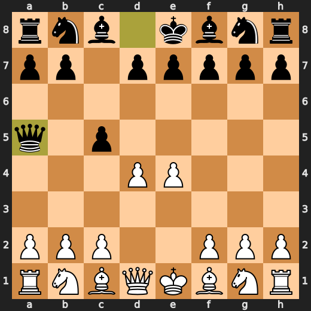

### 💎 Brilliant-ish: 4. Qxd4 by White

White's queen takes the d4 pawn, a move that aligns with Stockfish's preference and maintains a slight edge, albeit at the cost of 25 centipawns.

- **Eval:** +0.75 → +0.50
- **Preferred:** `Qxd4`
- **Loss:** 25 cp

**Before 4. Qxd4**

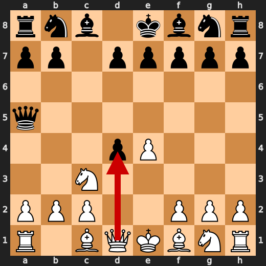

**After 4. Qxd4**

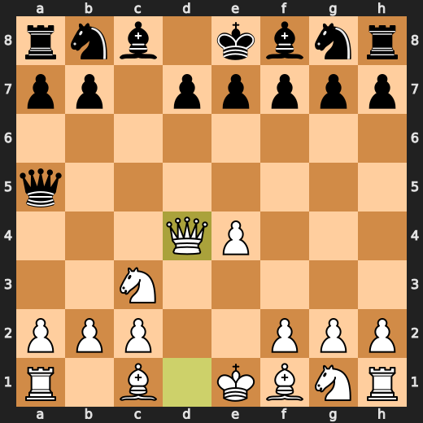

### 💀 Blunder: 5. d6 by Black

Black's played move d6 is a significant blunder, as it allows White to seize control of the center and gain a strong initiative, contrary to Stockfish's preferred Bb4.

- **Eval:** +1.31 → +12.71
- **Preferred:** `Bb4`
- **Loss:** 1140 cp

**Before 5. d6**

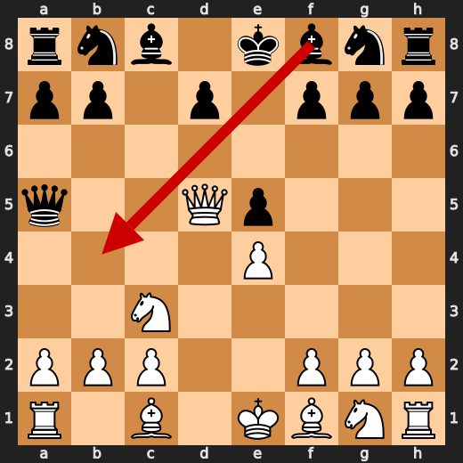

**After 5. d6**

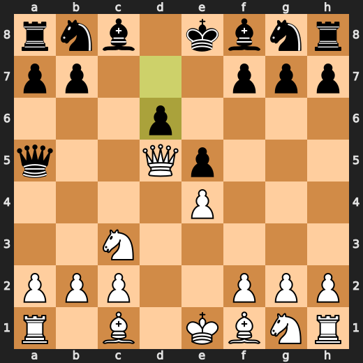

### 💎 Brilliant-ish: 6. Qxa5 by White

White's queen takes the pawn on a5, which is in line with Stockfish's preferred move and maintains a slight edge, albeit at a cost of 5 centipawns.

- **Eval:** +12.58 → +12.53
- **Preferred:** `Qxa5`
- **Loss:** 5 cp

**Before 6. Qxa5**

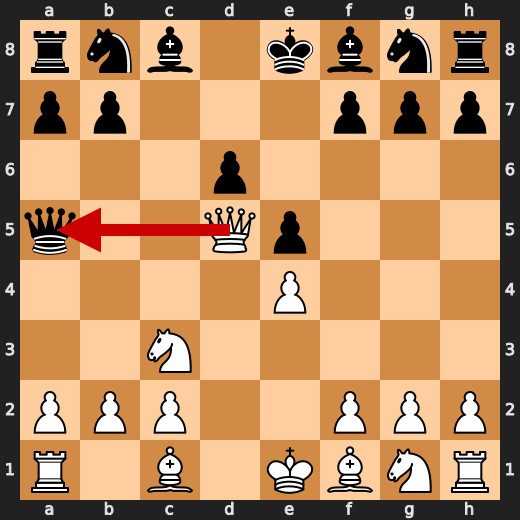

**After 6. Qxa5**

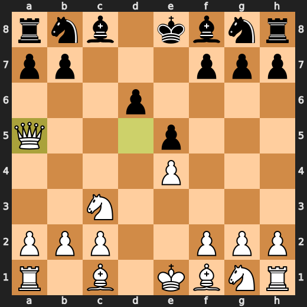

### ⚠️ Inaccuracy: 8. Bxc6+ by White

White's move Bxc6+ is an inaccuracy as it allows Black to gain a tempo and disrupt the kingside pawn structure, whereas Nd5 was preferred by Stockfish.

- **Eval:** +13.47 → +12.25
- **Preferred:** `Nd5`
- **Loss:** 122 cp

**Before 8. Bxc6+**

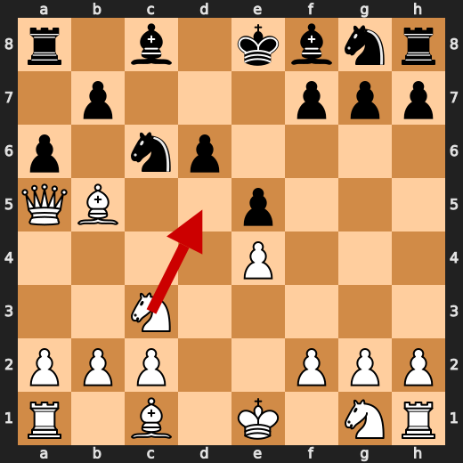

**After 8. Bxc6+**

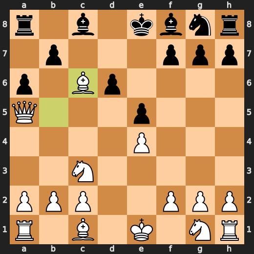

### 💎 Brilliant-ish: 8. bxc6 by Black

Black's decision to play bxc6 is a clever choice, as it aligns with Stockfish's preferred move and maintains a slight edge despite a small centipawn loss of 13.

- **Eval:** +12.23 → +12.36
- **Preferred:** `bxc6`
- **Loss:** 13 cp

**Before 8. bxc6**

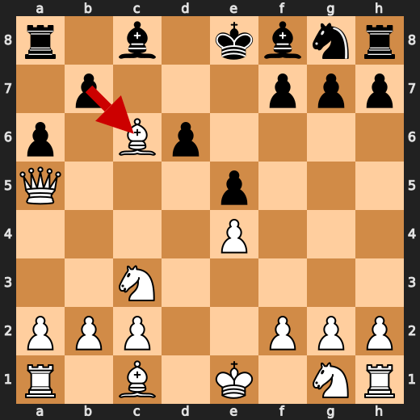

**After 8. bxc6**

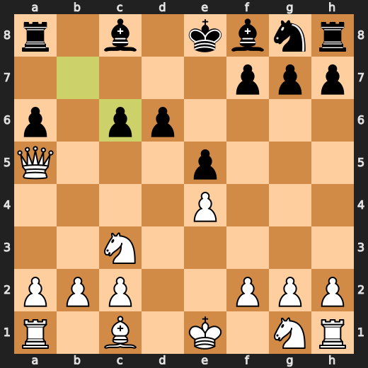

### 💎 Brilliant-ish: 12. dxe5 by Black

Black's decision to play dxe5 is a slight improvement over the engine's preferred move, as it gains some initiative and puts pressure on White's position.

- **Eval:** +13.76 → +14.00
- **Preferred:** `dxe5`
- **Loss:** 24 cp

### 💀 Blunder: 13. Bg4 by Black

Black's move Bg4 allows a forced mate, as Stockfish had previously recommended Rd8 to put pressure on Black's position and prevent such a drastic turn of events.

- **Eval:** +14.53 → White has mate
- **Preferred:** `Rd8`
- **Loss:** 98547 cp

### 💎 Brilliant-ish: 14. Qxc6+ by White

The queen check on c6 is a brilliant-ish move, as it's the engine's preferred choice and leads to a forced mate, albeit with no material advantage.

- **Eval:** White has mate → White has mate
- **Preferred:** `Qxc6+`
- **Loss:** 0 cp

### 🏁 Checkmate: 15. Bc5# by White

The checkmate on Bc5# was inevitable due to the weakened black king's position and Stockfish's evaluation confirming White has mate.

- **Eval:** White has mate → White has mate
- **Preferred:** `Bc5#`
- **Loss:** 0 cp

---

## Human Notes

The first major collapse was **5. d6** by **Black**. That is probably the main position to review.

The game-ending tactic was **15. Bc5#**.

---

<details>
<summary>Compact move list</summary>

- 📖 **1. e4** (White, Book) — +0.46 → +0.23, preferred `d4`, loss 23 cp
- 📖 **1. c5** (Black, Book) — +0.37 → +0.27, preferred `e5`, loss 0 cp
- 📖 **2. d4** (White, Book) — +0.48 → +0.16, preferred `Ne2`, loss 32 cp
- ⚠️ **2. Qa5+** (Black, Inaccuracy) — +0.22 → +1.81, preferred `cxd4`, loss 159 cp
- 📖 **3. Nc3** (White, Book) — +1.42 → +0.25, preferred `Bd2`, loss 117 cp
- 📖 **3. cxd4** (Black, Book) — +0.11 → +0.90, preferred `Nf6`, loss 79 cp
- 💎 **4. Qxd4** (White, Brilliant-ish) — +0.75 → +0.50, preferred `Qxd4`, loss 25 cp
- 👍 **4. e5** (Black, Good) — +0.72 → +1.32, preferred `e6`, loss 60 cp
- ✅ **5. Qd5** (White, Best) — +1.35 → +1.34, preferred `Qd5`, loss 1 cp
- 💀 **5. d6** (Black, Blunder) — +1.31 → +12.71, preferred `Bb4`, loss 1140 cp
- 💎 **6. Qxa5** (White, Brilliant-ish) — +12.58 → +12.53, preferred `Qxa5`, loss 5 cp
- 🔥 **6. Nc6** (Black, Great) — +12.53 → +13.03, preferred `Nf6`, loss 50 cp
- 🔥 **7. Bb5** (White, Great) — +12.86 → +12.50, preferred `Qc7`, loss 36 cp
- 👍 **7. a6** (Black, Good) — +12.53 → +13.47, preferred `Bd7`, loss 94 cp
- ⚠️ **8. Bxc6+** (White, Inaccuracy) — +13.47 → +12.25, preferred `Nd5`, loss 122 cp
- 💎 **8. bxc6** (Black, Brilliant-ish) — +12.23 → +12.36, preferred `bxc6`, loss 13 cp
- ✅ **9. Nf3** (White, Best) — +12.48 → +12.46, preferred `Nf3`, loss 2 cp
- ✅ **9. Bd7** (Black, Best) — +12.61 → +12.46, preferred `Be6`, loss 0 cp
- ✅ **10. Qc7** (White, Best) — +12.40 → +12.25, preferred `Nd2`, loss 15 cp
- 🔥 **10. a5** (Black, Great) — +12.25 → +12.56, preferred `Rc8`, loss 31 cp
- 🔥 **11. Be3** (White, Great) — +12.61 → +12.40, preferred `Nd2`, loss 21 cp
- 👍 **11. Nh6** (Black, Good) — +12.73 → +13.61, preferred `Rc8`, loss 88 cp
- 👍 **12. Nxe5** (White, Good) — +14.07 → +13.49, preferred `Nxe5`, loss 58 cp
- 💎 **12. dxe5** (Black, Brilliant-ish) — +13.76 → +14.00, preferred `dxe5`, loss 24 cp
- ✅ **13. O-O-O** (White, Best) — +14.30 → +14.54, preferred `O-O-O`, loss 0 cp
- 💀 **13. Bg4** (Black, Blunder) — +14.53 → White has mate, preferred `Rd8`, loss 98547 cp
- 💎 **14. Qxc6+** (White, Brilliant-ish) — White has mate → White has mate, preferred `Qxc6+`, loss 0 cp
- ✅ **14. Ke7** (Black, Best) — White has mate → White has mate, preferred `Bd7`, loss 0 cp
- 🏁 **15. Bc5#** (White, Checkmate) — White has mate → White has mate, preferred `Bc5#`, loss 0 cp

</details>

---

<details>
<summary>Raw engine table</summary>

| Ply | Move | Side | Played | Label | Eval Before | Eval After | Preferred | Loss |
|---:|---:|---|---|---|---:|---:|---|---:|
| 1 | 1 | White | e4 | Book | +0.46 | +0.23 | d4 | 23 |
| 2 | 1 | Black | c5 | Book | +0.37 | +0.27 | e5 | 0 |
| 3 | 2 | White | d4 | Book | +0.48 | +0.16 | Ne2 | 32 |
| 4 | 2 | Black | Qa5+ | Inaccuracy | +0.22 | +1.81 | cxd4 | 159 |
| 5 | 3 | White | Nc3 | Book | +1.42 | +0.25 | Bd2 | 117 |
| 6 | 3 | Black | cxd4 | Book | +0.11 | +0.90 | Nf6 | 79 |
| 7 | 4 | White | Qxd4 | Brilliant-ish | +0.75 | +0.50 | Qxd4 | 25 |
| 8 | 4 | Black | e5 | Good | +0.72 | +1.32 | e6 | 60 |
| 9 | 5 | White | Qd5 | Best | +1.35 | +1.34 | Qd5 | 1 |
| 10 | 5 | Black | d6 | Blunder | +1.31 | +12.71 | Bb4 | 1140 |
| 11 | 6 | White | Qxa5 | Brilliant-ish | +12.58 | +12.53 | Qxa5 | 5 |
| 12 | 6 | Black | Nc6 | Great | +12.53 | +13.03 | Nf6 | 50 |
| 13 | 7 | White | Bb5 | Great | +12.86 | +12.50 | Qc7 | 36 |
| 14 | 7 | Black | a6 | Good | +12.53 | +13.47 | Bd7 | 94 |
| 15 | 8 | White | Bxc6+ | Inaccuracy | +13.47 | +12.25 | Nd5 | 122 |
| 16 | 8 | Black | bxc6 | Brilliant-ish | +12.23 | +12.36 | bxc6 | 13 |
| 17 | 9 | White | Nf3 | Best | +12.48 | +12.46 | Nf3 | 2 |
| 18 | 9 | Black | Bd7 | Best | +12.61 | +12.46 | Be6 | 0 |
| 19 | 10 | White | Qc7 | Best | +12.40 | +12.25 | Nd2 | 15 |
| 20 | 10 | Black | a5 | Great | +12.25 | +12.56 | Rc8 | 31 |
| 21 | 11 | White | Be3 | Great | +12.61 | +12.40 | Nd2 | 21 |
| 22 | 11 | Black | Nh6 | Good | +12.73 | +13.61 | Rc8 | 88 |
| 23 | 12 | White | Nxe5 | Good | +14.07 | +13.49 | Nxe5 | 58 |
| 24 | 12 | Black | dxe5 | Brilliant-ish | +13.76 | +14.00 | dxe5 | 24 |
| 25 | 13 | White | O-O-O | Best | +14.30 | +14.54 | O-O-O | 0 |
| 26 | 13 | Black | Bg4 | Blunder | +14.53 | White has mate | Rd8 | 98547 |
| 27 | 14 | White | Qxc6+ | Brilliant-ish | White has mate | White has mate | Qxc6+ | 0 |
| 28 | 14 | Black | Ke7 | Best | White has mate | White has mate | Bd7 | 0 |
| 29 | 15 | White | Bc5# | Checkmate | White has mate | White has mate | Bc5# | 0 |

</details>

---

<details>
<summary>Clean PGN</summary>

```pgn
[Event "AI Factory's Chess"]
[Site "Android Device"]
[Date "2026.05.12"]
[Round "1"]
[White "You"]
[Black "CPU (5)"]
[Result "1-0"]
[PlyCount "31"]

1. e4 c5 2. d4 Qa5+ 3. Nc3 cxd4 4. Qxd4 e5 5. Qd5 d6 6. Qxa5 Nc6 7. Bb5 a6 8.
Bxc6+ bxc6 9. Nf3 Bd7 10. Qc7 a5 11. Be3 Nh6 12. Nxe5 dxe5 13. O-O-O Bg4 14.
Qxc6+ Ke7 15. Bc5# 1-0
```

</details>
