# You vs CPU (5)

**Result:** 1-0  
**Date:** 2026.05.12  
**Source:** `20260512_102907_pgn_2026_05_12_10h12_7e8de4224a4b.pgn`  
**Engine:** Stockfish depth 14

---

## Toaster Summary

Biggest toaster scream: **36. Qe7** by **Black**.

- **Label:** 💀 **Blunder**
- **Eval:** +8.54 → +63.33
- **Stockfish preferred:** `Qe7`
- **Loss:** 5479 cp

Final move recorded by parser: **39. Qxc6** by **White**.

- 💀 Blunders: **5**
- ❌ Mistakes: **4**
- ⚠️ Inaccuracies: **4**
- ✅ Good / best / tactical moves: **41**

---

## Final Position

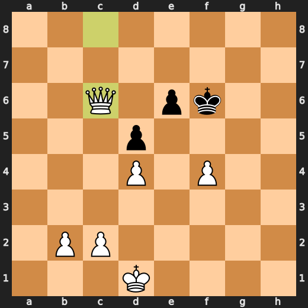

---

## Key Moments

### 💎 Brilliant-ish: 5. Bxc3 by White

Forcing move that Stockfish likes. Not official Chess.com magic, but tactically notable.

- **Eval:** +0.52 → +0.47
- **Preferred:** `Bxc3`
- **Loss:** 5 cp

**Before 5. Bxc3**

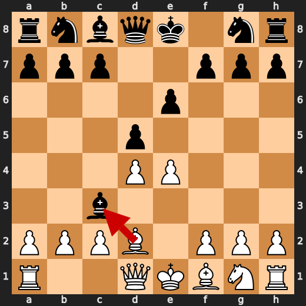

**After 5. Bxc3**

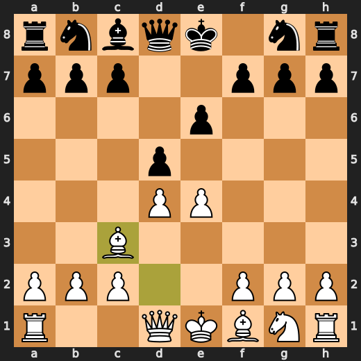

### 💎 Brilliant-ish: 6. Qxe4+ by Black

Forcing move that Stockfish likes. Not official Chess.com magic, but tactically notable.

- **Eval:** +0.43 → +0.32
- **Preferred:** `Qxe4+`
- **Loss:** 0 cp

**Before 6. Qxe4+**

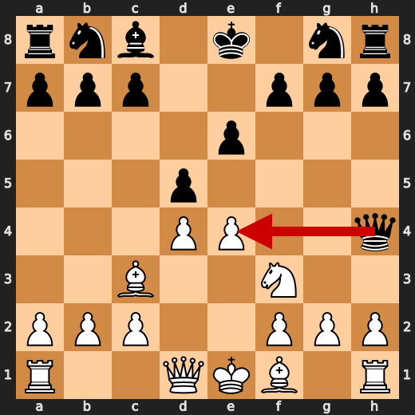

**After 6. Qxe4+**

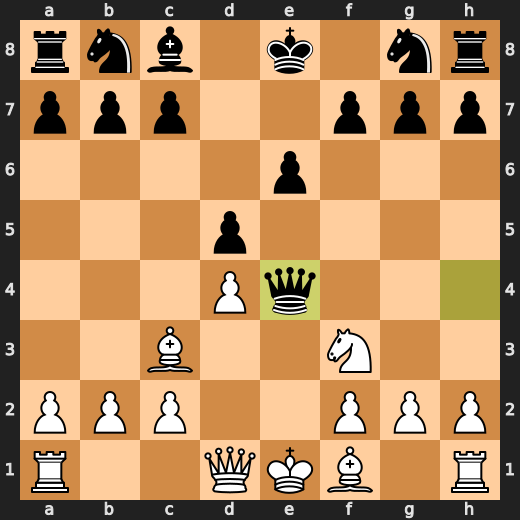

### 💎 Brilliant-ish: 12. Nxc6 by Black

Forcing move that Stockfish likes. Not official Chess.com magic, but tactically notable.

- **Eval:** -1.59 → -1.58
- **Preferred:** `Nxc6`
- **Loss:** 1 cp

**Before 12. Nxc6**

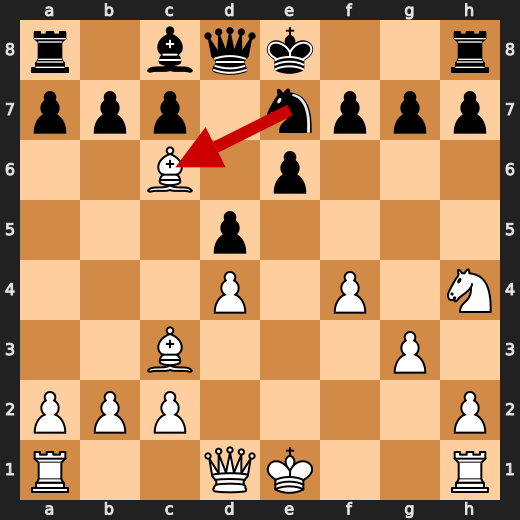

**After 12. Nxc6**

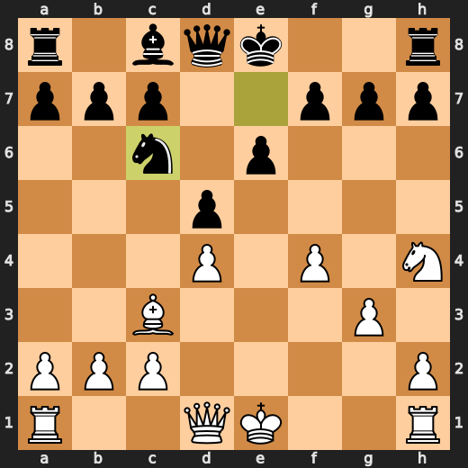

### ⚠️ Inaccuracy: 15. a3 by White

Small-to-medium eval loss. Playable, but Stockfish wanted cleaner.

- **Eval:** -0.54 → -1.81
- **Preferred:** `Rhe1`
- **Loss:** 127 cp

**Before 15. a3**

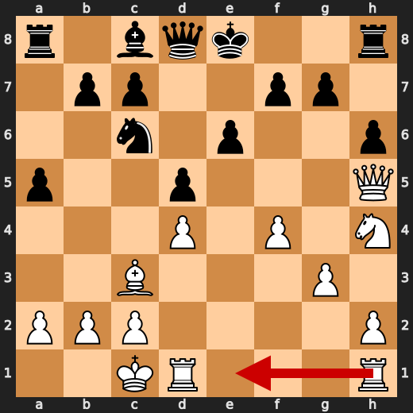

**After 15. a3**

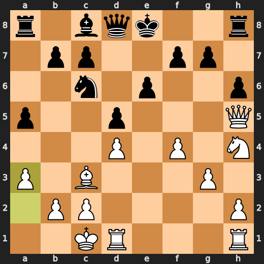

### 💎 Brilliant-ish: 17. axb4 by White

Forcing move that Stockfish likes. Not official Chess.com magic, but tactically notable.

- **Eval:** -2.38 → -2.47
- **Preferred:** `axb4`
- **Loss:** 9 cp

**Before 17. axb4**

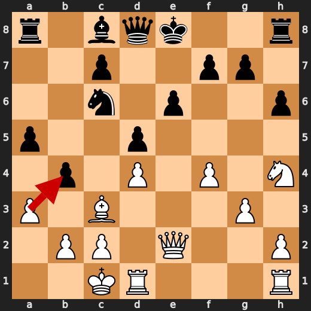

**After 17. axb4**

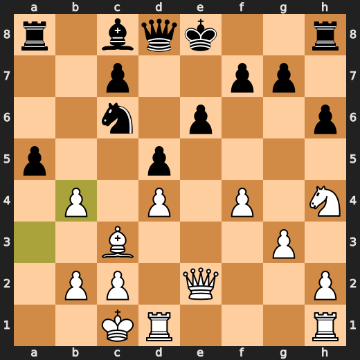

### 💎 Brilliant-ish: 18. Bxb4 by White

Forcing move that Stockfish likes. Not official Chess.com magic, but tactically notable.

- **Eval:** -1.15 → -0.84
- **Preferred:** `Bxb4`
- **Loss:** 0 cp

**Before 18. Bxb4**

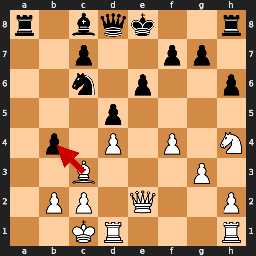

**After 18. Bxb4**

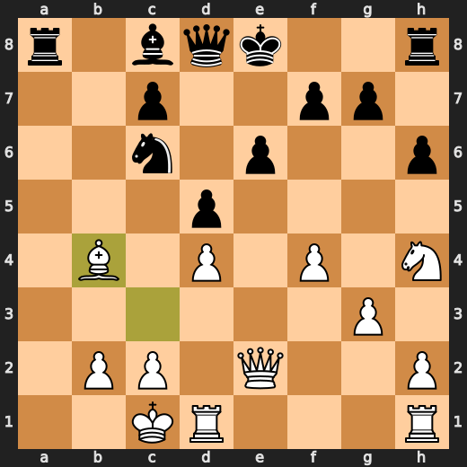

### ⚠️ Inaccuracy: 19. Rxd1+ by Black

Small-to-medium eval loss. Playable, but Stockfish wanted cleaner.

- **Eval:** -0.20 → +1.00
- **Preferred:** `Ba6`
- **Loss:** 120 cp

### 💎 Brilliant-ish: 20. Kxd1 by White

Forcing move that Stockfish likes. Not official Chess.com magic, but tactically notable.

- **Eval:** +0.34 → +0.42
- **Preferred:** `Kxd1`
- **Loss:** 0 cp

### 💀 Blunder: 21. Nf5 by White

Major eval loss. Stockfish thinks this seriously changed the game.

- **Eval:** +0.78 → -5.44
- **Preferred:** `Ng2`
- **Loss:** 622 cp

### 💎 Brilliant-ish: 21. Nxb4 by Black

Forcing move that Stockfish likes. Not official Chess.com magic, but tactically notable.

- **Eval:** -5.53 → -5.35
- **Preferred:** `Nxb4`
- **Loss:** 18 cp

### 💎 Brilliant-ish: 22. Qb5+ by White

Forcing move that Stockfish likes. Not official Chess.com magic, but tactically notable.

- **Eval:** -5.74 → -5.71
- **Preferred:** `Qb5+`
- **Loss:** 0 cp

### ❌ Mistake: 22. c6 by Black

Significant eval loss. Probably missed a tactic, defense, or forcing move.

- **Eval:** -5.69 → -0.30
- **Preferred:** `Qd7`
- **Loss:** 539 cp

---

## Human Notes

The first major collapse was **21. Nf5** by **White**. That is probably the main position to review.

There was also a notable mistake at **22. c6** by **Black**.

---

<details>
<summary>Compact move list</summary>

- 📖 **1. e4** (White, Book) — +0.46 → +0.23, preferred `d4`, loss 23 cp
- 📖 **1. e6** (Black, Book) — +0.37 → +0.53, preferred `e5`, loss 16 cp
- 📖 **2. d4** (White, Book) — +0.40 → +0.42, preferred `d4`, loss 0 cp
- 📖 **2. d5** (Black, Book) — +0.39 → +0.40, preferred `d5`, loss 1 cp
- 📖 **3. Nc3** (White, Book) — +0.46 → +0.37, preferred `e5`, loss 9 cp
- 📖 **3. Bb4** (Black, Book) — +0.35 → +0.82, preferred `Nf6`, loss 47 cp
- 👍 **4. Bd2** (White, Good) — +0.78 → +0.00, preferred `e5`, loss 78 cp
- 🔥 **4. Bxc3** (Black, Great) — +0.03 → +0.36, preferred `dxe4`, loss 33 cp
- 💎 **5. Bxc3** (White, Brilliant-ish) — +0.52 → +0.47, preferred `Bxc3`, loss 5 cp
- 👍 **5. Qh4** (Black, Good) — +0.38 → +1.35, preferred `dxe4`, loss 97 cp
- 👍 **6. Nf3** (White, Good) — +1.34 → +0.50, preferred `e5`, loss 84 cp
- 💎 **6. Qxe4+** (Black, Brilliant-ish) — +0.43 → +0.32, preferred `Qxe4+`, loss 0 cp
- ✅ **7. Be2** (White, Best) — +0.34 → +0.35, preferred `Be2`, loss 0 cp
- 🔥 **7. Qg6** (Black, Great) — +0.38 → +0.72, preferred `Nf6`, loss 34 cp
- 👍 **8. Nh4** (White, Good) — +1.05 → -0.07, preferred `Bd2`, loss 112 cp
- ✅ **8. Qg5** (Black, Best) — -0.06 → -0.16, preferred `Qf6`, loss 0 cp
- 👍 **9. g3** (White, Good) — -0.12 → -0.63, preferred `Bb5+`, loss 51 cp
- 👍 **9. Nc6** (Black, Good) — -0.74 → +0.09, preferred `Qe7`, loss 83 cp
- 👍 **10. f4** (White, Good) — +0.03 → -0.89, preferred `b4`, loss 92 cp
- 👍 **10. Qd8** (Black, Good) — -1.12 → -0.40, preferred `Qe7`, loss 72 cp
- 👍 **11. Bb5** (White, Good) — -0.36 → -1.10, preferred `Bd3`, loss 74 cp
- 🔥 **11. Ne7** (Black, Great) — -1.09 → -0.77, preferred `Nf6`, loss 32 cp
- 👍 **12. Bxc6+** (White, Good) — -0.55 → -1.49, preferred `Qe2`, loss 94 cp
- 💎 **12. Nxc6** (Black, Brilliant-ish) — -1.59 → -1.58, preferred `Nxc6`, loss 1 cp
- ✅ **13. Qh5** (White, Best) — -1.56 → -1.62, preferred `Qe2`, loss 6 cp
- 👍 **13. a5** (Black, Good) — -1.82 → -1.20, preferred `O-O`, loss 62 cp
- ✅ **14. O-O-O** (White, Best) — -1.25 → -1.38, preferred `O-O-O`, loss 13 cp
- 🔥 **14. h6** (Black, Great) — -1.37 → -0.89, preferred `b5`, loss 48 cp
- ⚠️ **15. a3** (White, Inaccuracy) — -0.54 → -1.81, preferred `Rhe1`, loss 127 cp
- 👍 **15. b5** (Black, Good) — -2.09 → -1.57, preferred `b5`, loss 52 cp
- 👍 **16. Qe2** (White, Good) — -1.52 → -2.13, preferred `b3`, loss 61 cp
- 🔥 **16. b4** (Black, Great) — -2.80 → -2.32, preferred `b4`, loss 48 cp
- 💎 **17. axb4** (White, Brilliant-ish) — -2.38 → -2.47, preferred `axb4`, loss 9 cp
- ✅ **17. axb4** (Black, Best) — -1.27 → -1.12, preferred `O-O`, loss 15 cp
- 💎 **18. Bxb4** (White, Brilliant-ish) — -1.15 → -0.84, preferred `Bxb4`, loss 0 cp
- 👍 **18. Ra1+** (Black, Good) — -1.01 → -0.08, preferred `Ba6`, loss 93 cp
- 🔥 **19. Kd2** (White, Great) — -0.47 → -0.97, preferred `Kd2`, loss 50 cp
- ⚠️ **19. Rxd1+** (Black, Inaccuracy) — -0.20 → +1.00, preferred `Ba6`, loss 120 cp
- 💎 **20. Kxd1** (White, Brilliant-ish) — +0.34 → +0.42, preferred `Kxd1`, loss 0 cp
- 🔥 **20. g5** (Black, Great) — +0.40 → +0.75, preferred `g5`, loss 35 cp
- 💀 **21. Nf5** (White, Blunder) — +0.78 → -5.44, preferred `Ng2`, loss 622 cp
- 💎 **21. Nxb4** (Black, Brilliant-ish) — -5.53 → -5.35, preferred `Nxb4`, loss 18 cp
- 💎 **22. Qb5+** (White, Brilliant-ish) — -5.74 → -5.71, preferred `Qb5+`, loss 0 cp
- ❌ **22. c6** (Black, Mistake) — -5.69 → -0.30, preferred `Qd7`, loss 539 cp
- 💀 **23. Ng7+** (White, Blunder) — +0.00 → -6.57, preferred `Qxb4`, loss 657 cp
- ✅ **23. Kf8** (Black, Best) — -6.75 → -6.78, preferred `Kf8`, loss 0 cp
- 👍 **24. Nxe6+** (White, Good) — -6.73 → -7.61, preferred `Qxb4+`, loss 88 cp
- ⚠️ **24. fxe6** (Black, Inaccuracy) — -7.61 → -4.87, preferred `Bxe6`, loss 274 cp
- 💎 **25. Qxb4+** (White, Brilliant-ish) — -4.61 → -4.56, preferred `Qxb4+`, loss 0 cp
- ✅ **25. Kg7** (Black, Best) — -4.66 → -4.92, preferred `Kg7`, loss 0 cp
- 🔥 **26. Qb8** (White, Great) — -4.76 → -5.02, preferred `b3`, loss 26 cp
- ❌ **26. Kf6** (Black, Mistake) — -4.92 → -1.57, preferred `Rf8`, loss 335 cp
- ⚠️ **27. h4** (White, Inaccuracy) — -2.34 → -3.59, preferred `Qe5+`, loss 125 cp
- ❌ **27. Ke7** (Black, Mistake) — -3.64 → +0.00, preferred `gxh4`, loss 364 cp
- ✅ **28. Qe5** (White, Best) — +0.00 → +0.00, preferred `Qe5`, loss 0 cp
- ✅ **28. gxh4** (Black, Best) — +0.00 → +0.00, preferred `g4`, loss 0 cp
- 💎 **29. Qg7+** (White, Brilliant-ish) — +0.00 → +0.00, preferred `Qg7+`, loss 0 cp
- ✅ **29. Kd6** (Black, Best) — +0.00 → +0.00, preferred `Kd6`, loss 0 cp
- 💎 **30. Qe5+** (White, Brilliant-ish) — +0.00 → +0.00, preferred `Qe5+`, loss 0 cp
- ✅ **30. Kd7** (Black, Best) — +0.00 → +0.00, preferred `Kd7`, loss 0 cp
- 💎 **31. Qg7+** (White, Brilliant-ish) — +0.00 → +0.00, preferred `Qg7+`, loss 0 cp
- 💀 **31. Qe7** (Black, Blunder) — +0.00 → +6.61, preferred `Kd6`, loss 661 cp
- 💎 **32. Qxh8** (White, Brilliant-ish) — +7.14 → +7.22, preferred `Qxh8`, loss 0 cp
- 🔥 **32. hxg3** (Black, Great) — +6.66 → +7.15, preferred `Qb4`, loss 49 cp
- 💎 **33. Rxh6** (White, Brilliant-ish) — +7.15 → +7.23, preferred `Rxh6`, loss 0 cp
- 👍 **33. g2** (Black, Good) — +7.46 → +8.25, preferred `Kc7`, loss 79 cp
- ✅ **34. Rg6** (White, Best) — +8.42 → +8.46, preferred `Rg6`, loss 0 cp
- 👍 **34. g1=Q+** (Black, Good) — +7.95 → +8.70, preferred `c5`, loss 75 cp
- 💎 **35. Rxg1** (White, Brilliant-ish) — +8.60 → +8.64, preferred `Rxg1`, loss 0 cp
- ❌ **35. Qd6** (Black, Mistake) — +8.35 → +11.53, preferred `Kc7`, loss 318 cp
- 💀 **36. Rg7+** (White, Blunder) — +63.00 → +20.94, preferred `Rg7+`, loss 4206 cp
- 💀 **36. Qe7** (Black, Blunder) — +8.54 → +63.33, preferred `Qe7`, loss 5479 cp
- 💎 **37. Rxe7+** (White, Brilliant-ish) — +63.43 → +63.43, preferred `Rxe7+`, loss 0 cp
- 💎 **37. Kxe7** (Black, Brilliant-ish) — +63.43 → +63.43, preferred `Kxe7`, loss 0 cp
- 💎 **38. Qxc8** (White, Brilliant-ish) — +63.75 → +63.97, preferred `Qxc8`, loss 0 cp
- 🔥 **38. Kf6** (Black, Great) — +63.75 → +64.12, preferred `Kf6`, loss 37 cp
- 💎 **39. Qxc6** (White, Brilliant-ish) — +64.27 → +64.79, preferred `Qxc6`, loss 0 cp

</details>

---

<details>
<summary>Raw engine table</summary>

| Ply | Move | Side | Played | Label | Eval Before | Eval After | Preferred | Loss |
|---:|---:|---|---|---|---:|---:|---|---:|
| 1 | 1 | White | e4 | Book | +0.46 | +0.23 | d4 | 23 |
| 2 | 1 | Black | e6 | Book | +0.37 | +0.53 | e5 | 16 |
| 3 | 2 | White | d4 | Book | +0.40 | +0.42 | d4 | 0 |
| 4 | 2 | Black | d5 | Book | +0.39 | +0.40 | d5 | 1 |
| 5 | 3 | White | Nc3 | Book | +0.46 | +0.37 | e5 | 9 |
| 6 | 3 | Black | Bb4 | Book | +0.35 | +0.82 | Nf6 | 47 |
| 7 | 4 | White | Bd2 | Good | +0.78 | +0.00 | e5 | 78 |
| 8 | 4 | Black | Bxc3 | Great | +0.03 | +0.36 | dxe4 | 33 |
| 9 | 5 | White | Bxc3 | Brilliant-ish | +0.52 | +0.47 | Bxc3 | 5 |
| 10 | 5 | Black | Qh4 | Good | +0.38 | +1.35 | dxe4 | 97 |
| 11 | 6 | White | Nf3 | Good | +1.34 | +0.50 | e5 | 84 |
| 12 | 6 | Black | Qxe4+ | Brilliant-ish | +0.43 | +0.32 | Qxe4+ | 0 |
| 13 | 7 | White | Be2 | Best | +0.34 | +0.35 | Be2 | 0 |
| 14 | 7 | Black | Qg6 | Great | +0.38 | +0.72 | Nf6 | 34 |
| 15 | 8 | White | Nh4 | Good | +1.05 | -0.07 | Bd2 | 112 |
| 16 | 8 | Black | Qg5 | Best | -0.06 | -0.16 | Qf6 | 0 |
| 17 | 9 | White | g3 | Good | -0.12 | -0.63 | Bb5+ | 51 |
| 18 | 9 | Black | Nc6 | Good | -0.74 | +0.09 | Qe7 | 83 |
| 19 | 10 | White | f4 | Good | +0.03 | -0.89 | b4 | 92 |
| 20 | 10 | Black | Qd8 | Good | -1.12 | -0.40 | Qe7 | 72 |
| 21 | 11 | White | Bb5 | Good | -0.36 | -1.10 | Bd3 | 74 |
| 22 | 11 | Black | Ne7 | Great | -1.09 | -0.77 | Nf6 | 32 |
| 23 | 12 | White | Bxc6+ | Good | -0.55 | -1.49 | Qe2 | 94 |
| 24 | 12 | Black | Nxc6 | Brilliant-ish | -1.59 | -1.58 | Nxc6 | 1 |
| 25 | 13 | White | Qh5 | Best | -1.56 | -1.62 | Qe2 | 6 |
| 26 | 13 | Black | a5 | Good | -1.82 | -1.20 | O-O | 62 |
| 27 | 14 | White | O-O-O | Best | -1.25 | -1.38 | O-O-O | 13 |
| 28 | 14 | Black | h6 | Great | -1.37 | -0.89 | b5 | 48 |
| 29 | 15 | White | a3 | Inaccuracy | -0.54 | -1.81 | Rhe1 | 127 |
| 30 | 15 | Black | b5 | Good | -2.09 | -1.57 | b5 | 52 |
| 31 | 16 | White | Qe2 | Good | -1.52 | -2.13 | b3 | 61 |
| 32 | 16 | Black | b4 | Great | -2.80 | -2.32 | b4 | 48 |
| 33 | 17 | White | axb4 | Brilliant-ish | -2.38 | -2.47 | axb4 | 9 |
| 34 | 17 | Black | axb4 | Best | -1.27 | -1.12 | O-O | 15 |
| 35 | 18 | White | Bxb4 | Brilliant-ish | -1.15 | -0.84 | Bxb4 | 0 |
| 36 | 18 | Black | Ra1+ | Good | -1.01 | -0.08 | Ba6 | 93 |
| 37 | 19 | White | Kd2 | Great | -0.47 | -0.97 | Kd2 | 50 |
| 38 | 19 | Black | Rxd1+ | Inaccuracy | -0.20 | +1.00 | Ba6 | 120 |
| 39 | 20 | White | Kxd1 | Brilliant-ish | +0.34 | +0.42 | Kxd1 | 0 |
| 40 | 20 | Black | g5 | Great | +0.40 | +0.75 | g5 | 35 |
| 41 | 21 | White | Nf5 | Blunder | +0.78 | -5.44 | Ng2 | 622 |
| 42 | 21 | Black | Nxb4 | Brilliant-ish | -5.53 | -5.35 | Nxb4 | 18 |
| 43 | 22 | White | Qb5+ | Brilliant-ish | -5.74 | -5.71 | Qb5+ | 0 |
| 44 | 22 | Black | c6 | Mistake | -5.69 | -0.30 | Qd7 | 539 |
| 45 | 23 | White | Ng7+ | Blunder | +0.00 | -6.57 | Qxb4 | 657 |
| 46 | 23 | Black | Kf8 | Best | -6.75 | -6.78 | Kf8 | 0 |
| 47 | 24 | White | Nxe6+ | Good | -6.73 | -7.61 | Qxb4+ | 88 |
| 48 | 24 | Black | fxe6 | Inaccuracy | -7.61 | -4.87 | Bxe6 | 274 |
| 49 | 25 | White | Qxb4+ | Brilliant-ish | -4.61 | -4.56 | Qxb4+ | 0 |
| 50 | 25 | Black | Kg7 | Best | -4.66 | -4.92 | Kg7 | 0 |
| 51 | 26 | White | Qb8 | Great | -4.76 | -5.02 | b3 | 26 |
| 52 | 26 | Black | Kf6 | Mistake | -4.92 | -1.57 | Rf8 | 335 |
| 53 | 27 | White | h4 | Inaccuracy | -2.34 | -3.59 | Qe5+ | 125 |
| 54 | 27 | Black | Ke7 | Mistake | -3.64 | +0.00 | gxh4 | 364 |
| 55 | 28 | White | Qe5 | Best | +0.00 | +0.00 | Qe5 | 0 |
| 56 | 28 | Black | gxh4 | Best | +0.00 | +0.00 | g4 | 0 |
| 57 | 29 | White | Qg7+ | Brilliant-ish | +0.00 | +0.00 | Qg7+ | 0 |
| 58 | 29 | Black | Kd6 | Best | +0.00 | +0.00 | Kd6 | 0 |
| 59 | 30 | White | Qe5+ | Brilliant-ish | +0.00 | +0.00 | Qe5+ | 0 |
| 60 | 30 | Black | Kd7 | Best | +0.00 | +0.00 | Kd7 | 0 |
| 61 | 31 | White | Qg7+ | Brilliant-ish | +0.00 | +0.00 | Qg7+ | 0 |
| 62 | 31 | Black | Qe7 | Blunder | +0.00 | +6.61 | Kd6 | 661 |
| 63 | 32 | White | Qxh8 | Brilliant-ish | +7.14 | +7.22 | Qxh8 | 0 |
| 64 | 32 | Black | hxg3 | Great | +6.66 | +7.15 | Qb4 | 49 |
| 65 | 33 | White | Rxh6 | Brilliant-ish | +7.15 | +7.23 | Rxh6 | 0 |
| 66 | 33 | Black | g2 | Good | +7.46 | +8.25 | Kc7 | 79 |
| 67 | 34 | White | Rg6 | Best | +8.42 | +8.46 | Rg6 | 0 |
| 68 | 34 | Black | g1=Q+ | Good | +7.95 | +8.70 | c5 | 75 |
| 69 | 35 | White | Rxg1 | Brilliant-ish | +8.60 | +8.64 | Rxg1 | 0 |
| 70 | 35 | Black | Qd6 | Mistake | +8.35 | +11.53 | Kc7 | 318 |
| 71 | 36 | White | Rg7+ | Blunder | +63.00 | +20.94 | Rg7+ | 4206 |
| 72 | 36 | Black | Qe7 | Blunder | +8.54 | +63.33 | Qe7 | 5479 |
| 73 | 37 | White | Rxe7+ | Brilliant-ish | +63.43 | +63.43 | Rxe7+ | 0 |
| 74 | 37 | Black | Kxe7 | Brilliant-ish | +63.43 | +63.43 | Kxe7 | 0 |
| 75 | 38 | White | Qxc8 | Brilliant-ish | +63.75 | +63.97 | Qxc8 | 0 |
| 76 | 38 | Black | Kf6 | Great | +63.75 | +64.12 | Kf6 | 37 |
| 77 | 39 | White | Qxc6 | Brilliant-ish | +64.27 | +64.79 | Qxc6 | 0 |

</details>

---

<details>
<summary>Clean PGN</summary>

```pgn
[Event "AI Factory's Chess"]
[Site "Android Device"]
[Date "2026.05.12"]
[Round "1"]
[White "You"]
[Black "CPU (5)"]
[Result "1-0"]
[PlyCount "79"]

1. e4 e6 2. d4 d5 3. Nc3 Bb4 4. Bd2 Bxc3 5. Bxc3 Qh4 6. Nf3 Qxe4+ 7. Be2 Qg6 8.
Nh4 Qg5 9. g3 Nc6 10. f4 Qd8 11. Bb5 Ne7 12. Bxc6+ Nxc6 13. Qh5 a5 14. O-O-O h6
15. a3 b5 16. Qe2 b4 17. axb4 axb4 18. Bxb4 Ra1+ 19. Kd2 Rxd1+ 20. Kxd1 g5 21.
Nf5 Nxb4 22. Qb5+ c6 23. Ng7+ Kf8 24. Nxe6+ fxe6 25. Qxb4+ Kg7 26. Qb8 Kf6 27.
h4 Ke7 28. Qe5 gxh4 29. Qg7+ Kd6 30. Qe5+ Kd7 31. Qg7+ Qe7 32. Qxh8 hxg3 33.
Rxh6 g2 34. Rg6 g1=Q+ 35. Rxg1 Qd6 36. Rg7+ Qe7 37. Rxe7+ Kxe7 38. Qxc8 Kf6 39.
Qxc6 1-0
```

</details>
