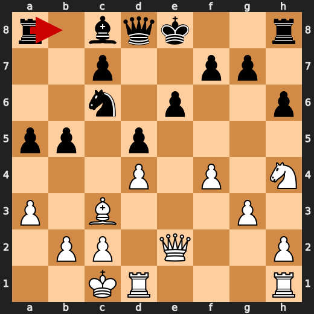
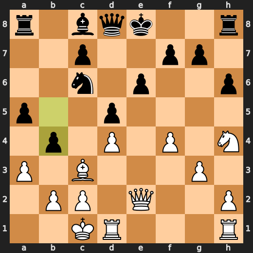

# You vs CPU (5)

**Result:** 1-0  
**Date:** 2026.05.12  
**Source:** `20260512_102907_pgn_2026_05_12_10h12_7e8de4224a4b.pgn`  
**Engine:** Stockfish depth 14

---

## Toaster Summary

Biggest toaster scream: **23. Ng7+** by **White**.

- **Label:** 💀 **Blunder**
- **Eval:** -0.23 → -7.12
- **Stockfish preferred:** `Qxb4`
- **Loss:** 689 cp

Final move recorded by parser: **39. Qxc6** by **White**.

- 💀 Blunders: **2**
- ❌ Mistakes: **4**
- ⚠️ Inaccuracies: **5**
- ✅ Good / best / tactical moves: **40**

---

## Final Position


---

## Key Moments

### 💎 Brilliant-ish: 5. Bxc3 by White

Here is a short chess note:

* White's Bxc3 is indeed a forcing move that Stockfish prefers (+0.54 eval after).
* The centipawn loss of 14 is relatively small considering the engine's verdict.
* This move highlights the importance of understanding pawn structure and controlling key squares in the center.
* A good move for players looking to challenge Black's central control, but be aware of potential counterplay on the queenside.

- **Eval:** +0.68 → +0.54
- **Preferred:** `Bxc3`
- **Loss:** 14 cp

**Before 5. Bxc3**


**After 5. Bxc3**


### 💎 Brilliant-ish: 6. Qxe4+ by Black

Here's a short and to-the-point review:

* Black's Qxe4+ is a clever forcing move, as Stockfish prefers it over other options.
* The eval increases by 0.09 centipawns, indicating a slight improvement in position.
* This move is particularly useful on a phone game where time is limited, as it quickly puts pressure on White's king.
* Note that the engine's preferred move is only slightly better than the fallback option, making this a nuanced tactical decision.

- **Eval:** +0.41 → +0.50
- **Preferred:** `Qxe4+`
- **Loss:** 9 cp

**Before 6. Qxe4+**


**After 6. Qxe4+**


### 💎 Brilliant-ish: 12. Nxc6 by Black

Here's a short and concise note:

* Black's Nxc6 is indeed a forcing move that Stockfish prefers.
* The centipawn loss is minimal (0), making it a relatively safe choice.
* This move aims to challenge White's control of the c-file and prepare for potential counterplay on the queenside.

- **Eval:** -1.57 → -1.69
- **Preferred:** `Nxc6`
- **Loss:** 0 cp

**Before 12. Nxc6**


**After 12. Nxc6**


### ⚠️ Inaccuracy: 15. a3 by White

Here is a short chess note for a casual player:

* Played a3, which Stockfish deemed an inaccuracy. 
* The move led to a centipawn loss of 149 and a worsening evaluation from -0.53 to -2.02.
* A better option would have been Rhe1, as suggested by the engine.
* This is a small-to-medium eval loss, but still worth considering for improvement.

- **Eval:** -0.53 → -2.02
- **Preferred:** `Rhe1`
- **Loss:** 149 cp

**Before 15. a3**


**After 15. a3**


### ⚠️ Inaccuracy: 16. b4 by Black

Here is a short chess note:

* Black's b4 allows White to maintain control of the queenside and puts pressure on the pawn structure.
* Rb8 would have been a more precise move, supporting the d5-pawn and preparing to develop the rest of the pieces.
* The eval loss of 124 centipawns is significant, making this move a notable inaccuracy.
* Consider playing Rb8 instead to maintain a stronger position.

- **Eval:** -2.30 → -1.06
- **Preferred:** `Rb8`
- **Loss:** 124 cp

**Before 16. b4**



**After 16. b4**



### 💎 Brilliant-ish: 17. axb4 by White

Here's a short chess note:

* White's played axb4, which Stockfish prefers over other options.
* The move costs 15 centipawns, a relatively small price for the potential benefits.
* The pawn structure is slightly weakened, but Black's position remains complex and dynamic.
* This move could be a good choice in similar situations where rapid development is key.

- **Eval:** -0.95 → -1.10
- **Preferred:** `axb4`
- **Loss:** 15 cp

**Before 17. axb4**


**After 17. axb4**


### 💎 Brilliant-ish: 17. axb4 by Black

Forcing move that Stockfish likes. Not official Chess.com magic, but tactically notable.

- **Eval:** -1.13 → -1.13
- **Preferred:** `axb4`
- **Loss:** 0 cp

### 💎 Brilliant-ish: 18. Bxb4 by White

Forcing move that Stockfish likes. Not official Chess.com magic, but tactically notable.

- **Eval:** -1.00 → -1.21
- **Preferred:** `Bxb4`
- **Loss:** 21 cp

### ⚠️ Inaccuracy: 19. Rxd1+ by Black

Small-to-medium eval loss. Playable, but Stockfish wanted cleaner.

- **Eval:** -0.66 → +0.62
- **Preferred:** `Ba6`
- **Loss:** 128 cp

### ❌ Mistake: 21. Nf5 by White

Significant eval loss. Probably missed a tactic, defense, or forcing move.

- **Eval:** +0.46 → -5.49
- **Preferred:** `Ng2`
- **Loss:** 595 cp

### 💎 Brilliant-ish: 21. Nxb4 by Black

Forcing move that Stockfish likes. Not official Chess.com magic, but tactically notable.

- **Eval:** -5.45 → -5.54
- **Preferred:** `Nxb4`
- **Loss:** 0 cp

### 💎 Brilliant-ish: 22. Qb5+ by White

Forcing move that Stockfish likes. Not official Chess.com magic, but tactically notable.

- **Eval:** -5.46 → -5.56
- **Preferred:** `Qb5+`
- **Loss:** 10 cp

---

## Human Notes

The first major collapse was **23. Ng7+** by **White**. That is probably the main position to review.

There was also a notable mistake at **21. Nf5** by **White**.

---

<details>
<summary>Compact move list</summary>

- 📖 **1. e4** (White, Book) — +0.38 → +0.20, preferred `e4`, loss 18 cp
- 📖 **1. e6** (Black, Book) — +0.30 → +0.48, preferred `c5`, loss 18 cp
- 📖 **2. d4** (White, Book) — +0.73 → +0.53, preferred `d4`, loss 20 cp
- 📖 **2. d5** (Black, Book) — +0.48 → +0.50, preferred `d5`, loss 2 cp
- 📖 **3. Nc3** (White, Book) — +0.44 → +0.43, preferred `Nd2`, loss 1 cp
- 📖 **3. Bb4** (Black, Book) — +0.47 → +0.72, preferred `Bb4`, loss 25 cp
- 👍 **4. Bd2** (White, Good) — +0.65 → +0.01, preferred `e5`, loss 64 cp
- 🔥 **4. Bxc3** (Black, Great) — +0.18 → +0.68, preferred `dxe4`, loss 50 cp
- 💎 **5. Bxc3** (White, Brilliant-ish) — +0.68 → +0.54, preferred `Bxc3`, loss 14 cp
- 👍 **5. Qh4** (Black, Good) — +0.50 → +1.22, preferred `dxe4`, loss 72 cp
- 👍 **6. Nf3** (White, Good) — +1.37 → +0.39, preferred `exd5`, loss 98 cp
- 💎 **6. Qxe4+** (Black, Brilliant-ish) — +0.41 → +0.50, preferred `Qxe4+`, loss 9 cp
- ✅ **7. Be2** (White, Best) — +0.46 → +0.47, preferred `Be2`, loss 0 cp
- 👍 **7. Qg6** (Black, Good) — +0.36 → +1.04, preferred `Nf6`, loss 68 cp
- 👍 **8. Nh4** (White, Good) — +0.99 → +0.01, preferred `Bd3`, loss 98 cp
- ✅ **8. Qg5** (Black, Best) — -0.03 → +0.07, preferred `Qf6`, loss 10 cp
- 👍 **9. g3** (White, Good) — +0.12 → -0.61, preferred `Nf3`, loss 73 cp
- 👍 **9. Nc6** (Black, Good) — -0.67 → -0.06, preferred `Qd8`, loss 61 cp
- 👍 **10. f4** (White, Good) — +0.05 → -0.65, preferred `b4`, loss 70 cp
- 👍 **10. Qd8** (Black, Good) — -0.83 → -0.30, preferred `Qe7`, loss 53 cp
- 👍 **11. Bb5** (White, Good) — -0.40 → -1.13, preferred `Bd3`, loss 73 cp
- 👍 **11. Ne7** (Black, Good) — -1.12 → -0.49, preferred `Nf6`, loss 63 cp
- 👍 **12. Bxc6+** (White, Good) — -0.38 → -1.47, preferred `Qe2`, loss 109 cp
- 💎 **12. Nxc6** (Black, Brilliant-ish) — -1.57 → -1.69, preferred `Nxc6`, loss 0 cp
- ✅ **13. Qh5** (White, Best) — -1.53 → -1.57, preferred `Qe2`, loss 4 cp
- 🔥 **13. a5** (Black, Great) — -1.42 → -1.15, preferred `O-O`, loss 27 cp
- ✅ **14. O-O-O** (White, Best) — -1.45 → -1.32, preferred `O-O-O`, loss 0 cp
- 👍 **14. h6** (Black, Good) — -1.51 → -0.77, preferred `O-O`, loss 74 cp
- ⚠️ **15. a3** (White, Inaccuracy) — -0.53 → -2.02, preferred `Rhe1`, loss 149 cp
- ✅ **15. b5** (Black, Best) — -1.79 → -1.70, preferred `b5`, loss 9 cp
- 👍 **16. Qe2** (White, Good) — -0.91 → -1.49, preferred `Bd2`, loss 58 cp
- ⚠️ **16. b4** (Black, Inaccuracy) — -2.30 → -1.06, preferred `Rb8`, loss 124 cp
- 💎 **17. axb4** (White, Brilliant-ish) — -0.95 → -1.10, preferred `axb4`, loss 15 cp
- 💎 **17. axb4** (Black, Brilliant-ish) — -1.13 → -1.13, preferred `axb4`, loss 0 cp
- 💎 **18. Bxb4** (White, Brilliant-ish) — -1.00 → -1.21, preferred `Bxb4`, loss 21 cp
- 👍 **18. Ra1+** (Black, Good) — -0.96 → -0.04, preferred `g5`, loss 92 cp
- 🔥 **19. Kd2** (White, Great) — -0.57 → -0.78, preferred `Kd2`, loss 21 cp
- ⚠️ **19. Rxd1+** (Black, Inaccuracy) — -0.66 → +0.62, preferred `Ba6`, loss 128 cp
- 🔥 **20. Kxd1** (White, Great) — +0.65 → +0.30, preferred `Rxd1`, loss 35 cp
- ✅ **20. g5** (Black, Best) — +0.13 → +0.26, preferred `g5`, loss 13 cp
- ❌ **21. Nf5** (White, Mistake) — +0.46 → -5.49, preferred `Ng2`, loss 595 cp
- 💎 **21. Nxb4** (Black, Brilliant-ish) — -5.45 → -5.54, preferred `Nxb4`, loss 0 cp
- 💎 **22. Qb5+** (White, Brilliant-ish) — -5.46 → -5.56, preferred `Qb5+`, loss 10 cp
- ❌ **22. c6** (Black, Mistake) — -5.65 → +0.00, preferred `Qd7`, loss 565 cp
- 💀 **23. Ng7+** (White, Blunder) — -0.23 → -7.12, preferred `Qxb4`, loss 689 cp
- 🔥 **23. Kf8** (Black, Great) — -7.15 → -6.89, preferred `Kf8`, loss 26 cp
- 🔥 **24. Nxe6+** (White, Great) — -7.12 → -7.53, preferred `Qxb4+`, loss 41 cp
- ⚠️ **24. fxe6** (Black, Inaccuracy) — -7.53 → -4.76, preferred `Bxe6`, loss 277 cp
- 💎 **25. Qxb4+** (White, Brilliant-ish) — -4.73 → -4.69, preferred `Qxb4+`, loss 0 cp
- 🔥 **25. Kg7** (Black, Great) — -4.92 → -4.76, preferred `Kg7`, loss 16 cp
- ✅ **26. Qb8** (White, Best) — -4.88 → -4.83, preferred `Re1`, loss 0 cp
- ⚠️ **26. Kf6** (Black, Inaccuracy) — -4.84 → -2.10, preferred `Rf8`, loss 274 cp
- 👍 **27. h4** (White, Good) — -2.37 → -3.46, preferred `Qe5+`, loss 109 cp
- ❌ **27. Ke7** (Black, Mistake) — -3.54 → +0.00, preferred `gxh4`, loss 354 cp
- ✅ **28. Qe5** (White, Best) — +0.00 → +0.00, preferred `Qe5`, loss 0 cp
- 💎 **28. gxh4** (Black, Brilliant-ish) — +0.00 → +0.00, preferred `gxh4`, loss 0 cp
- 💎 **29. Qg7+** (White, Brilliant-ish) — +0.00 → +0.00, preferred `Qg7+`, loss 0 cp
- ✅ **29. Kd6** (Black, Best) — +0.00 → +0.00, preferred `Kd6`, loss 0 cp
- 💎 **30. Qe5+** (White, Brilliant-ish) — +0.00 → +0.00, preferred `Qe5+`, loss 0 cp
- ✅ **30. Kd7** (Black, Best) — +0.00 → +0.00, preferred `Ke7`, loss 0 cp
- 💎 **31. Qg7+** (White, Brilliant-ish) — +0.00 → +0.00, preferred `Qg7+`, loss 0 cp
- 💀 **31. Qe7** (Black, Blunder) — +0.00 → +6.62, preferred `Kd6`, loss 662 cp
- 💎 **32. Qxh8** (White, Brilliant-ish) — +6.51 → +7.00, preferred `Qxh8`, loss 0 cp
- 🔥 **32. hxg3** (Black, Great) — +6.98 → +7.37, preferred `hxg3`, loss 39 cp
- 💎 **33. Rxh6** (White, Brilliant-ish) — +7.21 → +7.53, preferred `Rxh6`, loss 0 cp
- 👍 **33. g2** (Black, Good) — +7.53 → +8.14, preferred `Kc7`, loss 61 cp
- 🔥 **34. Rg6** (White, Great) — +7.72 → +7.48, preferred `Rg6`, loss 24 cp
- 👍 **34. g1=Q+** (Black, Good) — +7.39 → +8.38, preferred `Kc7`, loss 99 cp
- 💎 **35. Rxg1** (White, Brilliant-ish) — +8.46 → +8.50, preferred `Rxg1`, loss 0 cp
- ❌ **35. Qd6** (Black, Mistake) — +8.42 → +12.07, preferred `Kc7`, loss 365 cp
- 💎 **36. Rg7+** (White, Brilliant-ish) — +62.92 → +62.62, preferred `Rg7+`, loss 30 cp
- ✅ **36. Qe7** (Black, Best) — +62.93 → +62.97, preferred `Qe7`, loss 4 cp
- 👍 **37. Rxe7+** (White, Good) — +62.97 → +62.25, preferred `Rxe7+`, loss 72 cp
- 👍 **37. Kxe7** (Black, Good) — +62.52 → +63.18, preferred `Kxe7`, loss 66 cp
- 💎 **38. Qxc8** (White, Brilliant-ish) — +63.24 → +63.24, preferred `Qxc8`, loss 0 cp
- 🔥 **38. Kf6** (Black, Great) — +63.65 → +64.09, preferred `Kf6`, loss 44 cp
- 💎 **39. Qxc6** (White, Brilliant-ish) — +64.09 → +74.13, preferred `Qxc6`, loss 0 cp

</details>

---

<details>
<summary>Raw engine table</summary>

| Ply | Move | Side | Played | Label | Eval Before | Eval After | Preferred | Loss |
|---:|---:|---|---|---|---:|---:|---|---:|
| 1 | 1 | White | e4 | Book | +0.38 | +0.20 | e4 | 18 |
| 2 | 1 | Black | e6 | Book | +0.30 | +0.48 | c5 | 18 |
| 3 | 2 | White | d4 | Book | +0.73 | +0.53 | d4 | 20 |
| 4 | 2 | Black | d5 | Book | +0.48 | +0.50 | d5 | 2 |
| 5 | 3 | White | Nc3 | Book | +0.44 | +0.43 | Nd2 | 1 |
| 6 | 3 | Black | Bb4 | Book | +0.47 | +0.72 | Bb4 | 25 |
| 7 | 4 | White | Bd2 | Good | +0.65 | +0.01 | e5 | 64 |
| 8 | 4 | Black | Bxc3 | Great | +0.18 | +0.68 | dxe4 | 50 |
| 9 | 5 | White | Bxc3 | Brilliant-ish | +0.68 | +0.54 | Bxc3 | 14 |
| 10 | 5 | Black | Qh4 | Good | +0.50 | +1.22 | dxe4 | 72 |
| 11 | 6 | White | Nf3 | Good | +1.37 | +0.39 | exd5 | 98 |
| 12 | 6 | Black | Qxe4+ | Brilliant-ish | +0.41 | +0.50 | Qxe4+ | 9 |
| 13 | 7 | White | Be2 | Best | +0.46 | +0.47 | Be2 | 0 |
| 14 | 7 | Black | Qg6 | Good | +0.36 | +1.04 | Nf6 | 68 |
| 15 | 8 | White | Nh4 | Good | +0.99 | +0.01 | Bd3 | 98 |
| 16 | 8 | Black | Qg5 | Best | -0.03 | +0.07 | Qf6 | 10 |
| 17 | 9 | White | g3 | Good | +0.12 | -0.61 | Nf3 | 73 |
| 18 | 9 | Black | Nc6 | Good | -0.67 | -0.06 | Qd8 | 61 |
| 19 | 10 | White | f4 | Good | +0.05 | -0.65 | b4 | 70 |
| 20 | 10 | Black | Qd8 | Good | -0.83 | -0.30 | Qe7 | 53 |
| 21 | 11 | White | Bb5 | Good | -0.40 | -1.13 | Bd3 | 73 |
| 22 | 11 | Black | Ne7 | Good | -1.12 | -0.49 | Nf6 | 63 |
| 23 | 12 | White | Bxc6+ | Good | -0.38 | -1.47 | Qe2 | 109 |
| 24 | 12 | Black | Nxc6 | Brilliant-ish | -1.57 | -1.69 | Nxc6 | 0 |
| 25 | 13 | White | Qh5 | Best | -1.53 | -1.57 | Qe2 | 4 |
| 26 | 13 | Black | a5 | Great | -1.42 | -1.15 | O-O | 27 |
| 27 | 14 | White | O-O-O | Best | -1.45 | -1.32 | O-O-O | 0 |
| 28 | 14 | Black | h6 | Good | -1.51 | -0.77 | O-O | 74 |
| 29 | 15 | White | a3 | Inaccuracy | -0.53 | -2.02 | Rhe1 | 149 |
| 30 | 15 | Black | b5 | Best | -1.79 | -1.70 | b5 | 9 |
| 31 | 16 | White | Qe2 | Good | -0.91 | -1.49 | Bd2 | 58 |
| 32 | 16 | Black | b4 | Inaccuracy | -2.30 | -1.06 | Rb8 | 124 |
| 33 | 17 | White | axb4 | Brilliant-ish | -0.95 | -1.10 | axb4 | 15 |
| 34 | 17 | Black | axb4 | Brilliant-ish | -1.13 | -1.13 | axb4 | 0 |
| 35 | 18 | White | Bxb4 | Brilliant-ish | -1.00 | -1.21 | Bxb4 | 21 |
| 36 | 18 | Black | Ra1+ | Good | -0.96 | -0.04 | g5 | 92 |
| 37 | 19 | White | Kd2 | Great | -0.57 | -0.78 | Kd2 | 21 |
| 38 | 19 | Black | Rxd1+ | Inaccuracy | -0.66 | +0.62 | Ba6 | 128 |
| 39 | 20 | White | Kxd1 | Great | +0.65 | +0.30 | Rxd1 | 35 |
| 40 | 20 | Black | g5 | Best | +0.13 | +0.26 | g5 | 13 |
| 41 | 21 | White | Nf5 | Mistake | +0.46 | -5.49 | Ng2 | 595 |
| 42 | 21 | Black | Nxb4 | Brilliant-ish | -5.45 | -5.54 | Nxb4 | 0 |
| 43 | 22 | White | Qb5+ | Brilliant-ish | -5.46 | -5.56 | Qb5+ | 10 |
| 44 | 22 | Black | c6 | Mistake | -5.65 | +0.00 | Qd7 | 565 |
| 45 | 23 | White | Ng7+ | Blunder | -0.23 | -7.12 | Qxb4 | 689 |
| 46 | 23 | Black | Kf8 | Great | -7.15 | -6.89 | Kf8 | 26 |
| 47 | 24 | White | Nxe6+ | Great | -7.12 | -7.53 | Qxb4+ | 41 |
| 48 | 24 | Black | fxe6 | Inaccuracy | -7.53 | -4.76 | Bxe6 | 277 |
| 49 | 25 | White | Qxb4+ | Brilliant-ish | -4.73 | -4.69 | Qxb4+ | 0 |
| 50 | 25 | Black | Kg7 | Great | -4.92 | -4.76 | Kg7 | 16 |
| 51 | 26 | White | Qb8 | Best | -4.88 | -4.83 | Re1 | 0 |
| 52 | 26 | Black | Kf6 | Inaccuracy | -4.84 | -2.10 | Rf8 | 274 |
| 53 | 27 | White | h4 | Good | -2.37 | -3.46 | Qe5+ | 109 |
| 54 | 27 | Black | Ke7 | Mistake | -3.54 | +0.00 | gxh4 | 354 |
| 55 | 28 | White | Qe5 | Best | +0.00 | +0.00 | Qe5 | 0 |
| 56 | 28 | Black | gxh4 | Brilliant-ish | +0.00 | +0.00 | gxh4 | 0 |
| 57 | 29 | White | Qg7+ | Brilliant-ish | +0.00 | +0.00 | Qg7+ | 0 |
| 58 | 29 | Black | Kd6 | Best | +0.00 | +0.00 | Kd6 | 0 |
| 59 | 30 | White | Qe5+ | Brilliant-ish | +0.00 | +0.00 | Qe5+ | 0 |
| 60 | 30 | Black | Kd7 | Best | +0.00 | +0.00 | Ke7 | 0 |
| 61 | 31 | White | Qg7+ | Brilliant-ish | +0.00 | +0.00 | Qg7+ | 0 |
| 62 | 31 | Black | Qe7 | Blunder | +0.00 | +6.62 | Kd6 | 662 |
| 63 | 32 | White | Qxh8 | Brilliant-ish | +6.51 | +7.00 | Qxh8 | 0 |
| 64 | 32 | Black | hxg3 | Great | +6.98 | +7.37 | hxg3 | 39 |
| 65 | 33 | White | Rxh6 | Brilliant-ish | +7.21 | +7.53 | Rxh6 | 0 |
| 66 | 33 | Black | g2 | Good | +7.53 | +8.14 | Kc7 | 61 |
| 67 | 34 | White | Rg6 | Great | +7.72 | +7.48 | Rg6 | 24 |
| 68 | 34 | Black | g1=Q+ | Good | +7.39 | +8.38 | Kc7 | 99 |
| 69 | 35 | White | Rxg1 | Brilliant-ish | +8.46 | +8.50 | Rxg1 | 0 |
| 70 | 35 | Black | Qd6 | Mistake | +8.42 | +12.07 | Kc7 | 365 |
| 71 | 36 | White | Rg7+ | Brilliant-ish | +62.92 | +62.62 | Rg7+ | 30 |
| 72 | 36 | Black | Qe7 | Best | +62.93 | +62.97 | Qe7 | 4 |
| 73 | 37 | White | Rxe7+ | Good | +62.97 | +62.25 | Rxe7+ | 72 |
| 74 | 37 | Black | Kxe7 | Good | +62.52 | +63.18 | Kxe7 | 66 |
| 75 | 38 | White | Qxc8 | Brilliant-ish | +63.24 | +63.24 | Qxc8 | 0 |
| 76 | 38 | Black | Kf6 | Great | +63.65 | +64.09 | Kf6 | 44 |
| 77 | 39 | White | Qxc6 | Brilliant-ish | +64.09 | +74.13 | Qxc6 | 0 |

</details>

---

<details>
<summary>Clean PGN</summary>

```pgn
[Event "AI Factory's Chess"]
[Site "Android Device"]
[Date "2026.05.12"]
[Round "1"]
[White "You"]
[Black "CPU (5)"]
[Result "1-0"]
[PlyCount "79"]

1. e4 e6 2. d4 d5 3. Nc3 Bb4 4. Bd2 Bxc3 5. Bxc3 Qh4 6. Nf3 Qxe4+ 7. Be2 Qg6 8.
Nh4 Qg5 9. g3 Nc6 10. f4 Qd8 11. Bb5 Ne7 12. Bxc6+ Nxc6 13. Qh5 a5 14. O-O-O h6
15. a3 b5 16. Qe2 b4 17. axb4 axb4 18. Bxb4 Ra1+ 19. Kd2 Rxd1+ 20. Kxd1 g5 21.
Nf5 Nxb4 22. Qb5+ c6 23. Ng7+ Kf8 24. Nxe6+ fxe6 25. Qxb4+ Kg7 26. Qb8 Kf6 27.
h4 Ke7 28. Qe5 gxh4 29. Qg7+ Kd6 30. Qe5+ Kd7 31. Qg7+ Qe7 32. Qxh8 hxg3 33.
Rxh6 g2 34. Rg6 g1=Q+ 35. Rxg1 Qd6 36. Rg7+ Qe7 37. Rxe7+ Kxe7 38. Qxc8 Kf6 39.
Qxc6 1-0
```

</details>
