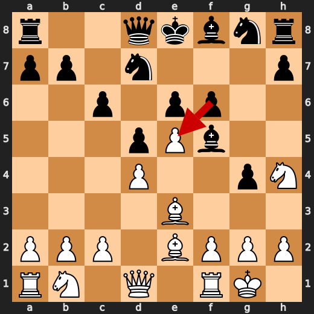
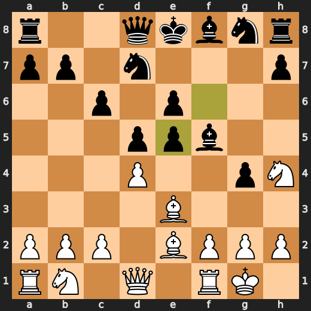
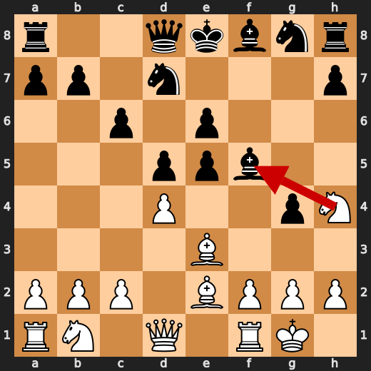
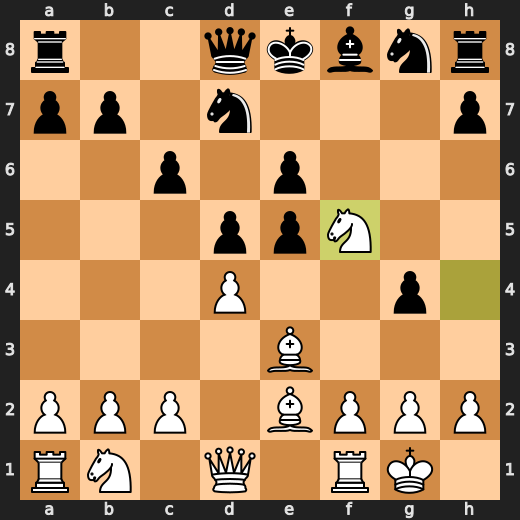
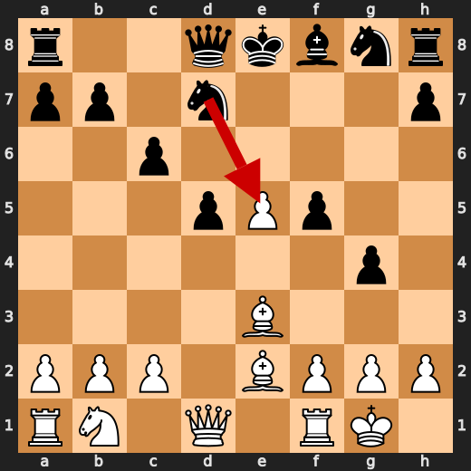
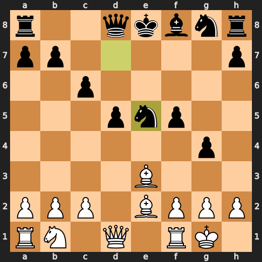
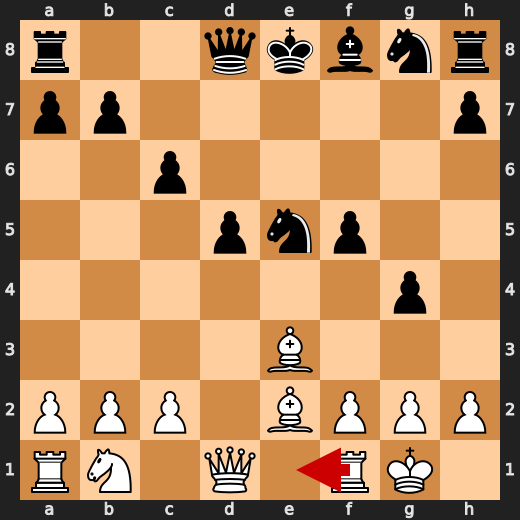
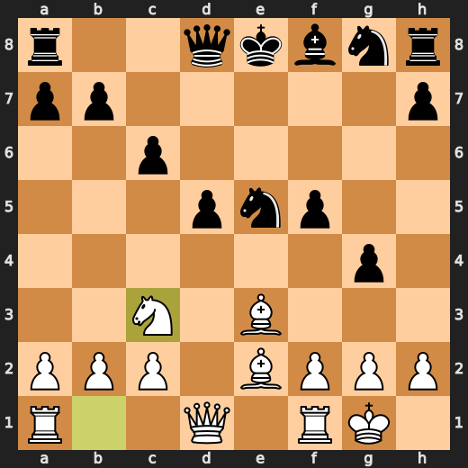
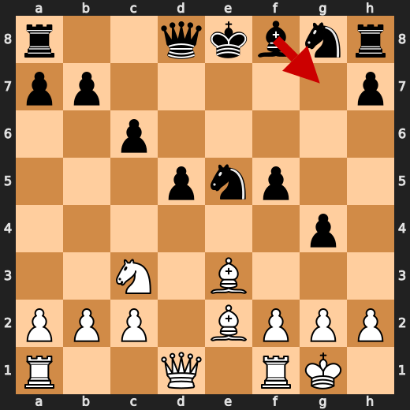
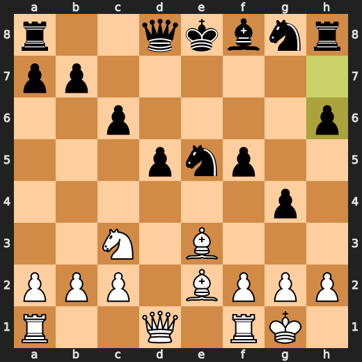

# You vs CPU (5)

**Result:** 1-0  
**Date:** 2026.05.12  
**Source:** `20260512_120223_pgn_2026_05_12_12h01_501ced3b871f.pgn`  
**Engine:** Stockfish depth 14

---

## Toaster Summary

Biggest toaster scream: **27. Qe6+** by **White**.

- **Label:** 💀 **Blunder**
- **Eval:** White has mate → +11.76
- **Stockfish preferred:** `Rxd1+`
- **Loss:** 98824 cp

Final move recorded by parser: **27. Qe6+** by **White**.

- 💀 Blunders: **2**
- ❌ Mistakes: **2**
- ⚠️ Inaccuracies: **8**
- ✅ Good / best / tactical moves: **27**

---

## Final Position


---

## Key Moments

### 💎 Brilliant-ish: 9. fxe5 by Black

Black's decision to play fxe5 is a pragmatic choice, as it aligns with Stockfish's preferred move and doesn't incur any significant material loss, despite slightly weakening the pawn structure.

- **Eval:** +0.68 → +0.26
- **Preferred:** `fxe5`
- **Loss:** 0 cp

**Before 9. fxe5**



**After 9. fxe5**



### 💎 Brilliant-ish: 10. Nxf5 by White

White's knight takes on f5, a move Stockfish prefers and which slightly improves the position, although it does cost White a pawn centipiece.

- **Eval:** +0.55 → +0.54
- **Preferred:** `Nxf5`
- **Loss:** 1 cp

**Before 10. Nxf5**



**After 10. Nxf5**



### 💎 Brilliant-ish: 10. exf5 by Black

Black's decision to exchange on f5 is a tactical choice that aligns with Stockfish's preference and slightly improves the position, despite a small centipawn loss of 28.

- **Eval:** +0.37 → +0.65
- **Preferred:** `exf5`
- **Loss:** 28 cp

**Before 10. exf5**


**After 10. exf5**


### 💎 Brilliant-ish: 11. Nxe5 by Black

Black's decision to play Nxe5 is a pragmatic choice, as it aligns with Stockfish's preferred move and maintains a relatively stable position despite a slight centipawn loss.

- **Eval:** +0.22 → +0.14
- **Preferred:** `Nxe5`
- **Loss:** 0 cp

**Before 11. Nxe5**



**After 11. Nxe5**



### ⚠️ Inaccuracy: 12. Nc3 by White

White's move Nc3 is an inaccuracy as it allows Black to develop quickly and gain a strong initiative, whereas Stockfish preferred the more prophylactic Re1.

- **Eval:** +0.29 → -1.31
- **Preferred:** `Re1`
- **Loss:** 160 cp

**Before 12. Nc3**



**After 12. Nc3**



### ⚠️ Inaccuracy: 12. h6 by Black

Black's h6 move allows White to develop the dark-squared bishop and gain a strong initiative, whereas Stockfish preferred Bg7 to maintain a more balanced position.

- **Eval:** -1.44 → +1.39
- **Preferred:** `Bg7`
- **Loss:** 283 cp

**Before 12. h6**



**After 12. h6**



### ⚠️ Inaccuracy: 13. Qd4 by White

White's Qd4 allows Black to equalize the game, whereas Stockfish's preferred move f4 would have maintained a slight advantage, according to its +1.72 evaluation before the move.

- **Eval:** +1.72 → -1.05
- **Preferred:** `f4`
- **Loss:** 277 cp

### ⚠️ Inaccuracy: 15. Ng6 by Black

Black's move Ng6 allows White to gain a significant advantage, as Stockfish had recommended the more solid Ne7, which would have maintained a slight edge.

- **Eval:** -0.87 → +0.46
- **Preferred:** `Ne7`
- **Loss:** 133 cp

### ⚠️ Inaccuracy: 16. d4 by Black

Black's d4 move allows White to launch a pawn storm on the queenside, which Stockfish preferred to counter with bxa5 to maintain more control over the position.

- **Eval:** +0.46 → +1.99
- **Preferred:** `bxa5`
- **Loss:** 153 cp

### ⚠️ Inaccuracy: 17. bxa5 by Black

Black's decision to play bxa5 instead of Stockfish's recommended c5 allows White to maintain a strong pawn center and gain a significant advantage in the position.

- **Eval:** +1.89 → +4.08
- **Preferred:** `c5`
- **Loss:** 219 cp

### ⚠️ Inaccuracy: 18. Qb6 by Black

Black's Qb6 is an inaccuracy as it allows White to develop the dark-squared bishop and gain a stronger initiative, whereas Stockfish preferred Kf8 to maintain control of the kingside.

- **Eval:** +3.73 → +6.71
- **Preferred:** `Kf8`
- **Loss:** 298 cp

### ⚠️ Inaccuracy: 20. Bxd4 by White

White's played move Bxd4 is an inaccuracy as it allows Black to equalize the position, whereas Stockfish preferred Nc5 to maintain a stronger initiative.

- **Eval:** +7.38 → +5.50
- **Preferred:** `Nc5`
- **Loss:** 188 cp

---

## Human Notes

The first major collapse was **25. Rxd1** by **Black**. That is probably the main position to review.

There was also a notable mistake at **20. Nf6** by **Black**.

---

<details>
<summary>Compact move list</summary>

- 📖 **1. e4** (White, Book) — +0.46 → +0.23, preferred `d4`, loss 23 cp
- 📖 **1. c6** (Black, Book) — +0.37 → +0.44, preferred `e5`, loss 7 cp
- 📖 **2. d4** (White, Book) — +0.48 → +0.57, preferred `Nc3`, loss 0 cp
- 📖 **2. d5** (Black, Book) — +0.59 → +0.51, preferred `d5`, loss 0 cp
- 📖 **3. e5** (White, Book) — +0.31 → +0.23, preferred `Nd2`, loss 8 cp
- 📖 **3. Bf5** (Black, Book) — +0.40 → +0.34, preferred `Bf5`, loss 0 cp
- ✅ **4. Be2** (White, Best) — +0.50 → +0.54, preferred `Nf3`, loss 0 cp
- 👍 **4. f6** (Black, Good) — +0.23 → +0.77, preferred `e6`, loss 54 cp
- ✅ **5. Nf3** (White, Best) — +0.74 → +0.86, preferred `Nf3`, loss 0 cp
- ✅ **5. Nd7** (Black, Best) — +0.94 → +0.84, preferred `Nd7`, loss 0 cp
- ✅ **6. O-O** (White, Best) — +1.12 → +1.03, preferred `Nh4`, loss 9 cp
- ✅ **6. e6** (Black, Best) — +1.03 → +0.94, preferred `e6`, loss 0 cp
- 🔥 **7. Bf4** (White, Great) — +0.95 → +0.50, preferred `Nbd2`, loss 45 cp
- 🔥 **7. g5** (Black, Great) — +0.34 → +0.75, preferred `Ne7`, loss 41 cp
- ✅ **8. Be3** (White, Best) — +0.66 → +0.79, preferred `Bd2`, loss 0 cp
- ✅ **8. g4** (Black, Best) — +0.54 → +0.67, preferred `h6`, loss 13 cp
- ✅ **9. Nh4** (White, Best) — +0.77 → +0.68, preferred `Nh4`, loss 9 cp
- 💎 **9. fxe5** (Black, Brilliant-ish) — +0.68 → +0.26, preferred `fxe5`, loss 0 cp
- 💎 **10. Nxf5** (White, Brilliant-ish) — +0.55 → +0.54, preferred `Nxf5`, loss 1 cp
- 💎 **10. exf5** (Black, Brilliant-ish) — +0.37 → +0.65, preferred `exf5`, loss 28 cp
- 👍 **11. dxe5** (White, Good) — +0.84 → +0.05, preferred `c4`, loss 79 cp
- 💎 **11. Nxe5** (Black, Brilliant-ish) — +0.22 → +0.14, preferred `Nxe5`, loss 0 cp
- ⚠️ **12. Nc3** (White, Inaccuracy) — +0.29 → -1.31, preferred `Re1`, loss 160 cp
- ⚠️ **12. h6** (Black, Inaccuracy) — -1.44 → +1.39, preferred `Bg7`, loss 283 cp
- ⚠️ **13. Qd4** (White, Inaccuracy) — +1.72 → -1.05, preferred `f4`, loss 277 cp
- 🔥 **13. Bg7** (Black, Great) — -1.28 → -0.89, preferred `Bg7`, loss 39 cp
- 🔥 **14. Qb4** (White, Great) — -0.83 → -1.18, preferred `Qb4`, loss 35 cp
- 👍 **14. b6** (Black, Good) — -0.96 → -0.21, preferred `Ne7`, loss 75 cp
- 👍 **15. a4** (White, Good) — -0.08 → -0.89, preferred `f3`, loss 81 cp
- ⚠️ **15. Ng6** (Black, Inaccuracy) — -0.87 → +0.46, preferred `Ne7`, loss 133 cp
- ✅ **16. a5** (White, Best) — +0.48 → +0.44, preferred `a5`, loss 4 cp
- ⚠️ **16. d4** (Black, Inaccuracy) — +0.46 → +1.99, preferred `bxa5`, loss 153 cp
- 🔥 **17. Rad1** (White, Great) — +2.31 → +2.11, preferred `Rad1`, loss 20 cp
- ⚠️ **17. bxa5** (Black, Inaccuracy) — +1.89 → +4.08, preferred `c5`, loss 219 cp
- ✅ **18. Qc4** (White, Best) — +3.25 → +3.94, preferred `Qc4`, loss 0 cp
- ⚠️ **18. Qb6** (Black, Inaccuracy) — +3.73 → +6.71, preferred `Kf8`, loss 298 cp
- 🔥 **19. Na4** (White, Great) — +6.79 → +6.43, preferred `Na4`, loss 36 cp
- 🔥 **19. Qc7** (Black, Great) — +6.68 → +7.10, preferred `Qc7`, loss 42 cp
- ⚠️ **20. Bxd4** (White, Inaccuracy) — +7.38 → +5.50, preferred `Nc5`, loss 188 cp
- ❌ **20. Nf6** (Black, Mistake) — +5.73 → +11.11, preferred `Bxd4`, loss 538 cp
- 👍 **21. Qe6+** (White, Good) — +11.80 → +10.81, preferred `Qe6+`, loss 99 cp
- 👍 **21. Ne7** (Black, Good) — +11.00 → +11.71, preferred `Qe7`, loss 71 cp
- ❌ **22. Bxf6** (White, Mistake) — +11.76 → +6.65, preferred `Bxf6`, loss 511 cp
- 💎 **22. Bxf6** (Black, Brilliant-ish) — +11.73 → +11.92, preferred `Bxf6`, loss 19 cp
- 💎 **23. Qxf6** (White, Brilliant-ish) — +12.15 → +12.00, preferred `Qxf6`, loss 15 cp
- 👍 **23. Rh7** (Black, Good) — +12.15 → +13.22, preferred `Rf8`, loss 107 cp
- ✅ **24. Nc5** (White, Best) — +13.53 → +13.38, preferred `Nc5`, loss 15 cp
- 👍 **24. Rd8** (Black, Good) — +12.43 → +13.46, preferred `Qb6`, loss 103 cp
- ✅ **25. Ne6** (White, Best) — +14.00 → +14.16, preferred `Ne6`, loss 0 cp
- 💀 **25. Rxd1** (Black, Blunder) — +14.07 → White has mate, preferred `Nd5`, loss 98593 cp
- ✅ **26. Nxc7+** (White, Best) — White has mate → White has mate, preferred `Rxd1`, loss 0 cp
- ✅ **26. Kd7** (Black, Best) — White has mate → White has mate, preferred `Kd7`, loss 0 cp
- 💀 **27. Qe6+** (White, Blunder) — White has mate → +11.76, preferred `Rxd1+`, loss 98824 cp

</details>

---

<details>
<summary>Raw engine table</summary>

| Ply | Move | Side | Played | Label | Eval Before | Eval After | Preferred | Loss |
|---:|---:|---|---|---|---:|---:|---|---:|
| 1 | 1 | White | e4 | Book | +0.46 | +0.23 | d4 | 23 |
| 2 | 1 | Black | c6 | Book | +0.37 | +0.44 | e5 | 7 |
| 3 | 2 | White | d4 | Book | +0.48 | +0.57 | Nc3 | 0 |
| 4 | 2 | Black | d5 | Book | +0.59 | +0.51 | d5 | 0 |
| 5 | 3 | White | e5 | Book | +0.31 | +0.23 | Nd2 | 8 |
| 6 | 3 | Black | Bf5 | Book | +0.40 | +0.34 | Bf5 | 0 |
| 7 | 4 | White | Be2 | Best | +0.50 | +0.54 | Nf3 | 0 |
| 8 | 4 | Black | f6 | Good | +0.23 | +0.77 | e6 | 54 |
| 9 | 5 | White | Nf3 | Best | +0.74 | +0.86 | Nf3 | 0 |
| 10 | 5 | Black | Nd7 | Best | +0.94 | +0.84 | Nd7 | 0 |
| 11 | 6 | White | O-O | Best | +1.12 | +1.03 | Nh4 | 9 |
| 12 | 6 | Black | e6 | Best | +1.03 | +0.94 | e6 | 0 |
| 13 | 7 | White | Bf4 | Great | +0.95 | +0.50 | Nbd2 | 45 |
| 14 | 7 | Black | g5 | Great | +0.34 | +0.75 | Ne7 | 41 |
| 15 | 8 | White | Be3 | Best | +0.66 | +0.79 | Bd2 | 0 |
| 16 | 8 | Black | g4 | Best | +0.54 | +0.67 | h6 | 13 |
| 17 | 9 | White | Nh4 | Best | +0.77 | +0.68 | Nh4 | 9 |
| 18 | 9 | Black | fxe5 | Brilliant-ish | +0.68 | +0.26 | fxe5 | 0 |
| 19 | 10 | White | Nxf5 | Brilliant-ish | +0.55 | +0.54 | Nxf5 | 1 |
| 20 | 10 | Black | exf5 | Brilliant-ish | +0.37 | +0.65 | exf5 | 28 |
| 21 | 11 | White | dxe5 | Good | +0.84 | +0.05 | c4 | 79 |
| 22 | 11 | Black | Nxe5 | Brilliant-ish | +0.22 | +0.14 | Nxe5 | 0 |
| 23 | 12 | White | Nc3 | Inaccuracy | +0.29 | -1.31 | Re1 | 160 |
| 24 | 12 | Black | h6 | Inaccuracy | -1.44 | +1.39 | Bg7 | 283 |
| 25 | 13 | White | Qd4 | Inaccuracy | +1.72 | -1.05 | f4 | 277 |
| 26 | 13 | Black | Bg7 | Great | -1.28 | -0.89 | Bg7 | 39 |
| 27 | 14 | White | Qb4 | Great | -0.83 | -1.18 | Qb4 | 35 |
| 28 | 14 | Black | b6 | Good | -0.96 | -0.21 | Ne7 | 75 |
| 29 | 15 | White | a4 | Good | -0.08 | -0.89 | f3 | 81 |
| 30 | 15 | Black | Ng6 | Inaccuracy | -0.87 | +0.46 | Ne7 | 133 |
| 31 | 16 | White | a5 | Best | +0.48 | +0.44 | a5 | 4 |
| 32 | 16 | Black | d4 | Inaccuracy | +0.46 | +1.99 | bxa5 | 153 |
| 33 | 17 | White | Rad1 | Great | +2.31 | +2.11 | Rad1 | 20 |
| 34 | 17 | Black | bxa5 | Inaccuracy | +1.89 | +4.08 | c5 | 219 |
| 35 | 18 | White | Qc4 | Best | +3.25 | +3.94 | Qc4 | 0 |
| 36 | 18 | Black | Qb6 | Inaccuracy | +3.73 | +6.71 | Kf8 | 298 |
| 37 | 19 | White | Na4 | Great | +6.79 | +6.43 | Na4 | 36 |
| 38 | 19 | Black | Qc7 | Great | +6.68 | +7.10 | Qc7 | 42 |
| 39 | 20 | White | Bxd4 | Inaccuracy | +7.38 | +5.50 | Nc5 | 188 |
| 40 | 20 | Black | Nf6 | Mistake | +5.73 | +11.11 | Bxd4 | 538 |
| 41 | 21 | White | Qe6+ | Good | +11.80 | +10.81 | Qe6+ | 99 |
| 42 | 21 | Black | Ne7 | Good | +11.00 | +11.71 | Qe7 | 71 |
| 43 | 22 | White | Bxf6 | Mistake | +11.76 | +6.65 | Bxf6 | 511 |
| 44 | 22 | Black | Bxf6 | Brilliant-ish | +11.73 | +11.92 | Bxf6 | 19 |
| 45 | 23 | White | Qxf6 | Brilliant-ish | +12.15 | +12.00 | Qxf6 | 15 |
| 46 | 23 | Black | Rh7 | Good | +12.15 | +13.22 | Rf8 | 107 |
| 47 | 24 | White | Nc5 | Best | +13.53 | +13.38 | Nc5 | 15 |
| 48 | 24 | Black | Rd8 | Good | +12.43 | +13.46 | Qb6 | 103 |
| 49 | 25 | White | Ne6 | Best | +14.00 | +14.16 | Ne6 | 0 |
| 50 | 25 | Black | Rxd1 | Blunder | +14.07 | White has mate | Nd5 | 98593 |
| 51 | 26 | White | Nxc7+ | Best | White has mate | White has mate | Rxd1 | 0 |
| 52 | 26 | Black | Kd7 | Best | White has mate | White has mate | Kd7 | 0 |
| 53 | 27 | White | Qe6+ | Blunder | White has mate | +11.76 | Rxd1+ | 98824 |

</details>

---

<details>
<summary>Clean PGN</summary>

```pgn
[Event "AI Factory's Chess"]
[Site "Android Device"]
[Date "2026.05.12"]
[Round "1"]
[White "You"]
[Black "CPU (5)"]
[Result "1-0"]
[PlyCount "55"]

1. e4 c6 2. d4 d5 3. e5 Bf5 4. Be2 f6 5. Nf3 Nd7 6. O-O e6 7. Bf4 g5 8. Be3 g4
9. Nh4 fxe5 10. Nxf5 exf5 11. dxe5 Nxe5 12. Nc3 h6 13. Qd4 Bg7 14. Qb4 b6 15.
a4 Ng6 16. a5 d4 17. Rad1 bxa5 18. Qc4 Qb6 19. Na4 Qc7 20. Bxd4 Nf6 21. Qe6+
Ne7 22. Bxf6 Bxf6 23. Qxf6 Rh7 24. Nc5 Rd8 25. Ne6 Rxd1 26. Nxc7+ Kd7 27. Qe6+
1-0
```

</details>
