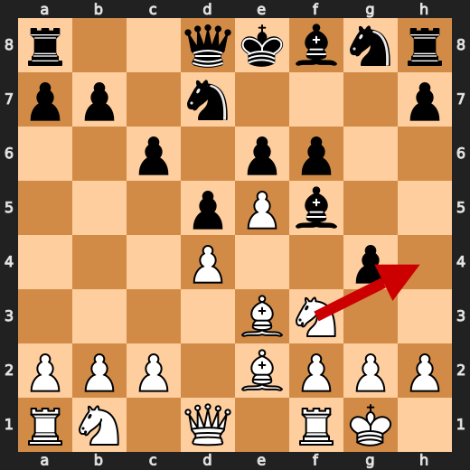
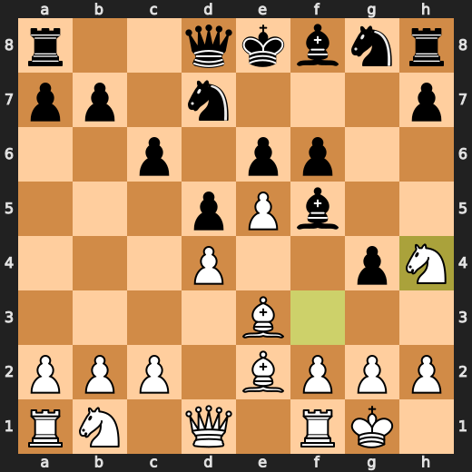
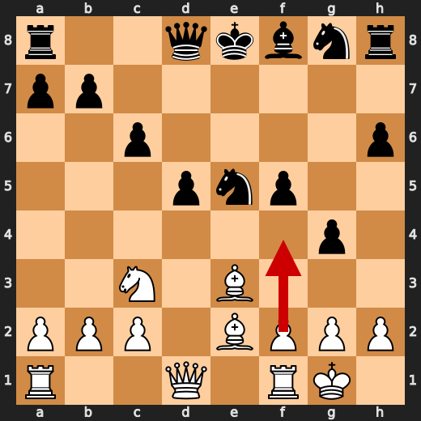
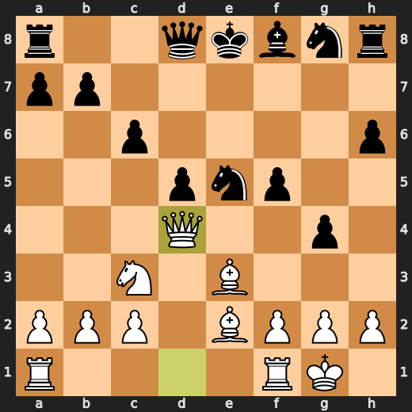
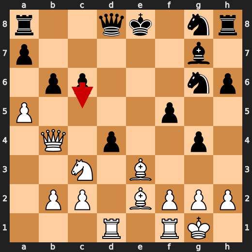
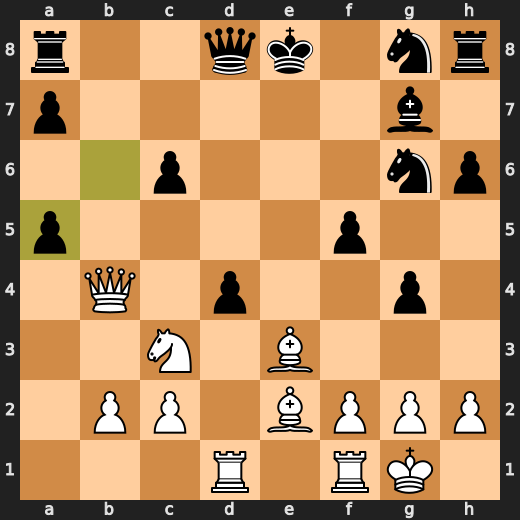
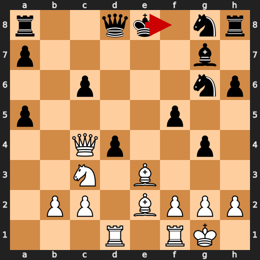
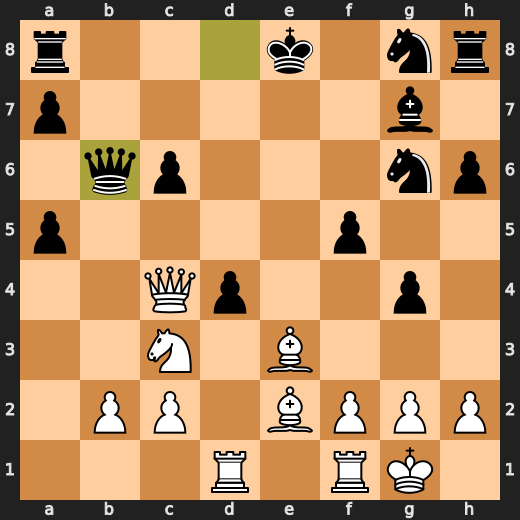

# You (White) vs CPU (Black)

**Result:** 1-0  
**Date:** 2026.05.12  
**Source:** `20260512_120223_pgn_2026_05_12_12h01_501ced3b871f.pgn`  
**Engine:** Stockfish depth 14  
**Your side:** White  
**Computer side:** Black  
**Board perspective:** Standard White-at-bottom

---

## Who Is Who

- **You:** You (White)
- **Computer:** CPU (5) (Black)

---

## Toaster Summary

Biggest toaster scream: **27. Qe6+** by **You (White)**.

- **Label:** 💀 **Blunder**
- **Eval:** White has mate → +11.76
- **Stockfish preferred:** `Rxd1+`
- **Loss:** 98824 cp

Final move recorded: **27. Qe6+** by **You (White)**.

- 💀 Blunders: **2**
- ❌ Mistakes: **2**
- ⚠️ Inaccuracies: **8**
- ✅ Best moves called out: **20**

---

## Final Position


---

## Key Moments

### ✅ Best: 8. Be3 by You (White)

The player has chosen to develop the bishop on e3, a move that is not entirely without merit. The knight on c3 gains some breathing room, and the bishop itself becomes somewhat more active. However, this development comes at the cost of delaying the central pawn storm, which might have been more pressing given Black's somewhat passive setup. In retrospect, it seems White has opted for a more gradual

- **Eval:** +0.66 → +0.79
- **Preferred:** `Bd2`
- **Loss:** 0 cp

**Before 8. Be3**


**After 8. Be3**


### ✅ Best: 8. g4 by CPU (Black)

The CPU's g4 is a curious choice, one that belies a deeper understanding of the position. With the Black queenside pawns somewhat cramped, the knight on c6 already eyeing the d5 square, and White's pawn on e3 poised to advance, the CPU has opted for a seemingly innocuous push. However, this move is not without its implications: it allows White to

- **Eval:** +0.54 → +0.67
- **Preferred:** `h6`
- **Loss:** 13 cp

**Before 8. g4**


**After 8. g4**


### ✅ Best: 9. Nh4 by You (White)

The knight on h4: a futile attempt to exert pressure on Black's position. The pawn on e5 is not under attack, nor is the bishop on c8 in any danger of being driven back. In fact, it's the White queen that finds itself somewhat exposed after this move, its influence diminished by the Knight's foray into the kingside. The evaluation drops to +0.

- **Eval:** +0.77 → +0.68
- **Preferred:** `Nh4`
- **Loss:** 9 cp

**Before 9. Nh4**



**After 9. Nh4**



### ✅ Best: 9. fxe5 by CPU (Black)

The CPU's move is a curious one: fxe5. At first glance, it seems to be an attempt to challenge White's control of the center, but upon closer inspection, it's clear that Black is merely reacting to White's previous moves. The engine verdict is telling: this move is indeed the best available option for Black. The eval before and after the move reveals a subtle shift in

- **Eval:** +0.68 → +0.26
- **Preferred:** `fxe5`
- **Loss:** 0 cp

**Before 9. fxe5**


**After 9. fxe5**


### ⚠️ Inaccuracy: 12. h6 by CPU (Black)

The CPU's impatience is a liability here. Playing h6 allows White to develop the dark-squared bishop and puts pressure on Black's kingside. The knight on g4, already somewhat exposed, gains further mobility while the rook on f1 gets ready to join the fray. Meanwhile, the pawn on e5 remains undefended, inviting White to launch a kingside attack. The

- **Eval:** -1.44 → +1.39
- **Preferred:** `Bg7`
- **Loss:** 283 cp

**Before 12. h6**


**After 12. h6**


### ⚠️ Inaccuracy: 13. Qd4 by You (White)

Qd4 is a misstep, allowing Black's queenside pieces to harmonize and exert pressure on d5. The pawn on d4 weakens White's kingside, while the queen itself becomes somewhat exposed. In contrast, f4 would have maintained control of the center and kept Black's dark-squared bishop in check, forcing them to reorganize their position.

- **Eval:** +1.72 → -1.05
- **Preferred:** `f4`
- **Loss:** 277 cp

**Before 13. Qd4**



**After 13. Qd4**



### ⚠️ Inaccuracy: 17. bxa5 by CPU (Black)

The CPU's eagerness to exchange queens has led to a curious decision on move 17: bxa5. This pawn grab, however, allows White to maintain control of the center and keep the bishop pair intact. The engine's verdict is clear: c5 would have been a more judicious choice, as it would have put pressure on d4 and forced White to respond with a potentially weakening

- **Eval:** +1.89 → +4.08
- **Preferred:** `c5`
- **Loss:** 219 cp

**Before 17. bxa5**



**After 17. bxa5**



### ⚠️ Inaccuracy: 18. Qb6 by CPU (Black)

The CPU's Qb6 is a misstep, allowing White to regain balance and even gain ground. The Queen on b6 overextends, putting pressure on the d5 pawn without sufficient compensation. Meanwhile, the Knight on f8 would have been a more judicious choice, supporting the central pawns while keeping an eye on the potential weaknesses on Black's queenside. The eval swings from +

- **Eval:** +3.73 → +6.71
- **Preferred:** `Kf8`
- **Loss:** 298 cp

**Before 18. Qb6**



**After 18. Qb6**



### ❌ Mistake: 20. Nf6 by CPU (Black)

The CPU's eagerness to develop its knight has led to a premature excursion on f6, where it finds itself somewhat isolated from the rest of the board. The pawn structure remains intact, but the balance of forces has shifted in White's favor: the dark-squared bishop is now under pressure, and Black's queenside pieces are still lagging behind. The eval loss is telling - 538

- **Eval:** +5.73 → +11.11
- **Preferred:** `Bxd4`
- **Loss:** 538 cp

**Before 20. Nf6**


**After 20. Nf6**


### ❌ Mistake: 22. Bxf6 by You (White)

The impulsive strike of Bxf6 on move 22. A hasty attempt to seize control, but one that ultimately overreaches and disrupts balance. The pawn on f6 was a liability waiting to be exploited; instead, it's sacrificed for a fleeting advantage. Stockfish preferred the same move, but that's cold comfort given the eval loss of 511. The position rewards patience

- **Eval:** +11.76 → +6.65
- **Preferred:** `Bxf6`
- **Loss:** 511 cp

**Before 22. Bxf6**


**After 22. Bxf6**


### 💀 Blunder: 25. Rxd1 by CPU (Black)

The CPU's impulsive decision to play Rxd1 on move 25 is a case of overreach. The rook lunges at White's d-file, but in doing so, it leaves Black's position vulnerable to counterplay. Specifically, the dark-squared bishop on c8 is now exposed and under pressure from White's pawn on e4. Meanwhile, the knight on g6 is

- **Eval:** +14.07 → White has mate
- **Preferred:** `Nd5`
- **Loss:** 98593 cp

### 💀 Blunder: 27. Qe6+ by You (White)

Qe6+: a reckless attempt to seize control of e7, but one that ultimately yields to the superior force on d8. The queen's advance is met with a crushing response from Black's rook, which seizes the initiative and turns the tables with a +11.76 eval swing. Rxd1+ would have been a more judicious choice, allowing White to maintain balance and

- **Eval:** White has mate → +11.76
- **Preferred:** `Rxd1+`
- **Loss:** 98824 cp

---

## Human Notes

Biggest caveman lesson: CPU (Black) blew it with **25. Rxd1**.

There was another real screw-up at **20. Nf6** by **CPU (Black)**.

---

<details>
<summary>Compact move list</summary>

- 📖 **1. e4** (You (White), Book) — +0.46 → +0.23, preferred `d4`, loss 23 cp
- 📖 **1. c6** (CPU (Black), Book) — +0.37 → +0.44, preferred `e5`, loss 7 cp
- 📖 **2. d4** (You (White), Book) — +0.48 → +0.57, preferred `Nc3`, loss 0 cp
- 📖 **2. d5** (CPU (Black), Book) — +0.59 → +0.51, preferred `d5`, loss 0 cp
- 📖 **3. e5** (You (White), Book) — +0.31 → +0.23, preferred `Nd2`, loss 8 cp
- 📖 **3. Bf5** (CPU (Black), Book) — +0.40 → +0.34, preferred `Bf5`, loss 0 cp
- ✅ **4. Be2** (You (White), Best) — +0.50 → +0.54, preferred `Nf3`, loss 0 cp
- 👍 **4. f6** (CPU (Black), Good) — +0.23 → +0.77, preferred `e6`, loss 54 cp
- ✅ **5. Nf3** (You (White), Best) — +0.74 → +0.86, preferred `Nf3`, loss 0 cp
- ✅ **5. Nd7** (CPU (Black), Best) — +0.94 → +0.84, preferred `Nd7`, loss 0 cp
- ✅ **6. O-O** (You (White), Best) — +1.12 → +1.03, preferred `Nh4`, loss 9 cp
- ✅ **6. e6** (CPU (Black), Best) — +1.03 → +0.94, preferred `e6`, loss 0 cp
- 🔥 **7. Bf4** (You (White), Great) — +0.95 → +0.50, preferred `Nbd2`, loss 45 cp
- 🔥 **7. g5** (CPU (Black), Great) — +0.34 → +0.75, preferred `Ne7`, loss 41 cp
- ✅ **8. Be3** (You (White), Best) — +0.66 → +0.79, preferred `Bd2`, loss 0 cp
- ✅ **8. g4** (CPU (Black), Best) — +0.54 → +0.67, preferred `h6`, loss 13 cp
- ✅ **9. Nh4** (You (White), Best) — +0.77 → +0.68, preferred `Nh4`, loss 9 cp
- ✅ **9. fxe5** (CPU (Black), Best) — +0.68 → +0.26, preferred `fxe5`, loss 0 cp
- ✅ **10. Nxf5** (You (White), Best) — +0.55 → +0.54, preferred `Nxf5`, loss 1 cp
- ✅ **10. exf5** (CPU (Black), Best) — +0.37 → +0.65, preferred `exf5`, loss 28 cp
- 👍 **11. dxe5** (You (White), Good) — +0.84 → +0.05, preferred `c4`, loss 79 cp
- ✅ **11. Nxe5** (CPU (Black), Best) — +0.22 → +0.14, preferred `Nxe5`, loss 0 cp
- ⚠️ **12. Nc3** (You (White), Inaccuracy) — +0.29 → -1.31, preferred `Re1`, loss 160 cp
- ⚠️ **12. h6** (CPU (Black), Inaccuracy) — -1.44 → +1.39, preferred `Bg7`, loss 283 cp
- ⚠️ **13. Qd4** (You (White), Inaccuracy) — +1.72 → -1.05, preferred `f4`, loss 277 cp
- 🔥 **13. Bg7** (CPU (Black), Great) — -1.28 → -0.89, preferred `Bg7`, loss 39 cp
- 🔥 **14. Qb4** (You (White), Great) — -0.83 → -1.18, preferred `Qb4`, loss 35 cp
- 👍 **14. b6** (CPU (Black), Good) — -0.96 → -0.21, preferred `Ne7`, loss 75 cp
- 👍 **15. a4** (You (White), Good) — -0.08 → -0.89, preferred `f3`, loss 81 cp
- ⚠️ **15. Ng6** (CPU (Black), Inaccuracy) — -0.87 → +0.46, preferred `Ne7`, loss 133 cp
- ✅ **16. a5** (You (White), Best) — +0.48 → +0.44, preferred `a5`, loss 4 cp
- ⚠️ **16. d4** (CPU (Black), Inaccuracy) — +0.46 → +1.99, preferred `bxa5`, loss 153 cp
- 🔥 **17. Rad1** (You (White), Great) — +2.31 → +2.11, preferred `Rad1`, loss 20 cp
- ⚠️ **17. bxa5** (CPU (Black), Inaccuracy) — +1.89 → +4.08, preferred `c5`, loss 219 cp
- ✅ **18. Qc4** (You (White), Best) — +3.25 → +3.94, preferred `Qc4`, loss 0 cp
- ⚠️ **18. Qb6** (CPU (Black), Inaccuracy) — +3.73 → +6.71, preferred `Kf8`, loss 298 cp
- 🔥 **19. Na4** (You (White), Great) — +6.79 → +6.43, preferred `Na4`, loss 36 cp
- 🔥 **19. Qc7** (CPU (Black), Great) — +6.68 → +7.10, preferred `Qc7`, loss 42 cp
- ⚠️ **20. Bxd4** (You (White), Inaccuracy) — +7.38 → +5.50, preferred `Nc5`, loss 188 cp
- ❌ **20. Nf6** (CPU (Black), Mistake) — +5.73 → +11.11, preferred `Bxd4`, loss 538 cp
- 👍 **21. Qe6+** (You (White), Good) — +11.80 → +10.81, preferred `Qe6+`, loss 99 cp
- 👍 **21. Ne7** (CPU (Black), Good) — +11.00 → +11.71, preferred `Qe7`, loss 71 cp
- ❌ **22. Bxf6** (You (White), Mistake) — +11.76 → +6.65, preferred `Bxf6`, loss 511 cp
- ✅ **22. Bxf6** (CPU (Black), Best) — +11.73 → +11.92, preferred `Bxf6`, loss 19 cp
- ✅ **23. Qxf6** (You (White), Best) — +12.15 → +12.00, preferred `Qxf6`, loss 15 cp
- 👍 **23. Rh7** (CPU (Black), Good) — +12.15 → +13.22, preferred `Rf8`, loss 107 cp
- ✅ **24. Nc5** (You (White), Best) — +13.53 → +13.38, preferred `Nc5`, loss 15 cp
- 👍 **24. Rd8** (CPU (Black), Good) — +12.43 → +13.46, preferred `Qb6`, loss 103 cp
- ✅ **25. Ne6** (You (White), Best) — +14.00 → +14.16, preferred `Ne6`, loss 0 cp
- 💀 **25. Rxd1** (CPU (Black), Blunder) — +14.07 → White has mate, preferred `Nd5`, loss 98593 cp
- ✅ **26. Nxc7+** (You (White), Best) — White has mate → White has mate, preferred `Rxd1`, loss 0 cp
- ✅ **26. Kd7** (CPU (Black), Best) — White has mate → White has mate, preferred `Kd7`, loss 0 cp
- 💀 **27. Qe6+** (You (White), Blunder) — White has mate → +11.76, preferred `Rxd1+`, loss 98824 cp

</details>

---

<details>
<summary>Raw engine table</summary>

| Ply | Move | Actor | Played | Label | Eval Before | Eval After | Preferred | Loss |
|---:|---:|---|---|---|---:|---:|---|---:|
| 1 | 1 | You (White) | e4 | Book | +0.46 | +0.23 | d4 | 23 |
| 2 | 1 | CPU (Black) | c6 | Book | +0.37 | +0.44 | e5 | 7 |
| 3 | 2 | You (White) | d4 | Book | +0.48 | +0.57 | Nc3 | 0 |
| 4 | 2 | CPU (Black) | d5 | Book | +0.59 | +0.51 | d5 | 0 |
| 5 | 3 | You (White) | e5 | Book | +0.31 | +0.23 | Nd2 | 8 |
| 6 | 3 | CPU (Black) | Bf5 | Book | +0.40 | +0.34 | Bf5 | 0 |
| 7 | 4 | You (White) | Be2 | Best | +0.50 | +0.54 | Nf3 | 0 |
| 8 | 4 | CPU (Black) | f6 | Good | +0.23 | +0.77 | e6 | 54 |
| 9 | 5 | You (White) | Nf3 | Best | +0.74 | +0.86 | Nf3 | 0 |
| 10 | 5 | CPU (Black) | Nd7 | Best | +0.94 | +0.84 | Nd7 | 0 |
| 11 | 6 | You (White) | O-O | Best | +1.12 | +1.03 | Nh4 | 9 |
| 12 | 6 | CPU (Black) | e6 | Best | +1.03 | +0.94 | e6 | 0 |
| 13 | 7 | You (White) | Bf4 | Great | +0.95 | +0.50 | Nbd2 | 45 |
| 14 | 7 | CPU (Black) | g5 | Great | +0.34 | +0.75 | Ne7 | 41 |
| 15 | 8 | You (White) | Be3 | Best | +0.66 | +0.79 | Bd2 | 0 |
| 16 | 8 | CPU (Black) | g4 | Best | +0.54 | +0.67 | h6 | 13 |
| 17 | 9 | You (White) | Nh4 | Best | +0.77 | +0.68 | Nh4 | 9 |
| 18 | 9 | CPU (Black) | fxe5 | Best | +0.68 | +0.26 | fxe5 | 0 |
| 19 | 10 | You (White) | Nxf5 | Best | +0.55 | +0.54 | Nxf5 | 1 |
| 20 | 10 | CPU (Black) | exf5 | Best | +0.37 | +0.65 | exf5 | 28 |
| 21 | 11 | You (White) | dxe5 | Good | +0.84 | +0.05 | c4 | 79 |
| 22 | 11 | CPU (Black) | Nxe5 | Best | +0.22 | +0.14 | Nxe5 | 0 |
| 23 | 12 | You (White) | Nc3 | Inaccuracy | +0.29 | -1.31 | Re1 | 160 |
| 24 | 12 | CPU (Black) | h6 | Inaccuracy | -1.44 | +1.39 | Bg7 | 283 |
| 25 | 13 | You (White) | Qd4 | Inaccuracy | +1.72 | -1.05 | f4 | 277 |
| 26 | 13 | CPU (Black) | Bg7 | Great | -1.28 | -0.89 | Bg7 | 39 |
| 27 | 14 | You (White) | Qb4 | Great | -0.83 | -1.18 | Qb4 | 35 |
| 28 | 14 | CPU (Black) | b6 | Good | -0.96 | -0.21 | Ne7 | 75 |
| 29 | 15 | You (White) | a4 | Good | -0.08 | -0.89 | f3 | 81 |
| 30 | 15 | CPU (Black) | Ng6 | Inaccuracy | -0.87 | +0.46 | Ne7 | 133 |
| 31 | 16 | You (White) | a5 | Best | +0.48 | +0.44 | a5 | 4 |
| 32 | 16 | CPU (Black) | d4 | Inaccuracy | +0.46 | +1.99 | bxa5 | 153 |
| 33 | 17 | You (White) | Rad1 | Great | +2.31 | +2.11 | Rad1 | 20 |
| 34 | 17 | CPU (Black) | bxa5 | Inaccuracy | +1.89 | +4.08 | c5 | 219 |
| 35 | 18 | You (White) | Qc4 | Best | +3.25 | +3.94 | Qc4 | 0 |
| 36 | 18 | CPU (Black) | Qb6 | Inaccuracy | +3.73 | +6.71 | Kf8 | 298 |
| 37 | 19 | You (White) | Na4 | Great | +6.79 | +6.43 | Na4 | 36 |
| 38 | 19 | CPU (Black) | Qc7 | Great | +6.68 | +7.10 | Qc7 | 42 |
| 39 | 20 | You (White) | Bxd4 | Inaccuracy | +7.38 | +5.50 | Nc5 | 188 |
| 40 | 20 | CPU (Black) | Nf6 | Mistake | +5.73 | +11.11 | Bxd4 | 538 |
| 41 | 21 | You (White) | Qe6+ | Good | +11.80 | +10.81 | Qe6+ | 99 |
| 42 | 21 | CPU (Black) | Ne7 | Good | +11.00 | +11.71 | Qe7 | 71 |
| 43 | 22 | You (White) | Bxf6 | Mistake | +11.76 | +6.65 | Bxf6 | 511 |
| 44 | 22 | CPU (Black) | Bxf6 | Best | +11.73 | +11.92 | Bxf6 | 19 |
| 45 | 23 | You (White) | Qxf6 | Best | +12.15 | +12.00 | Qxf6 | 15 |
| 46 | 23 | CPU (Black) | Rh7 | Good | +12.15 | +13.22 | Rf8 | 107 |
| 47 | 24 | You (White) | Nc5 | Best | +13.53 | +13.38 | Nc5 | 15 |
| 48 | 24 | CPU (Black) | Rd8 | Good | +12.43 | +13.46 | Qb6 | 103 |
| 49 | 25 | You (White) | Ne6 | Best | +14.00 | +14.16 | Ne6 | 0 |
| 50 | 25 | CPU (Black) | Rxd1 | Blunder | +14.07 | White has mate | Nd5 | 98593 |
| 51 | 26 | You (White) | Nxc7+ | Best | White has mate | White has mate | Rxd1 | 0 |
| 52 | 26 | CPU (Black) | Kd7 | Best | White has mate | White has mate | Kd7 | 0 |
| 53 | 27 | You (White) | Qe6+ | Blunder | White has mate | +11.76 | Rxd1+ | 98824 |

</details>

---

<details>
<summary>Clean PGN</summary>

```pgn
[Event "AI Factory's Chess"]
[Site "Android Device"]
[Date "2026.05.12"]
[Round "1"]
[White "You"]
[Black "CPU (5)"]
[Result "1-0"]
[PlyCount "55"]

1. e4 c6 2. d4 d5 3. e5 Bf5 4. Be2 f6 5. Nf3 Nd7 6. O-O e6 7. Bf4 g5 8. Be3 g4
9. Nh4 fxe5 10. Nxf5 exf5 11. dxe5 Nxe5 12. Nc3 h6 13. Qd4 Bg7 14. Qb4 b6 15.
a4 Ng6 16. a5 d4 17. Rad1 bxa5 18. Qc4 Qb6 19. Na4 Qc7 20. Bxd4 Nf6 21. Qe6+
Ne7 22. Bxf6 Bxf6 23. Qxf6 Rh7 24. Nc5 Rd8 25. Ne6 Rxd1 26. Nxc7+ Kd7 27. Qe6+
1-0
```

</details>
