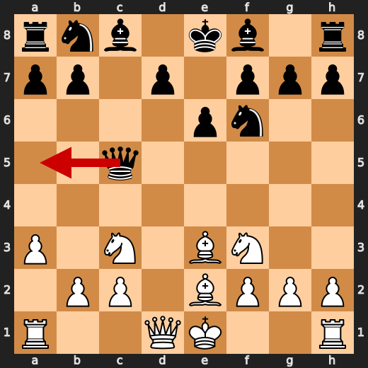
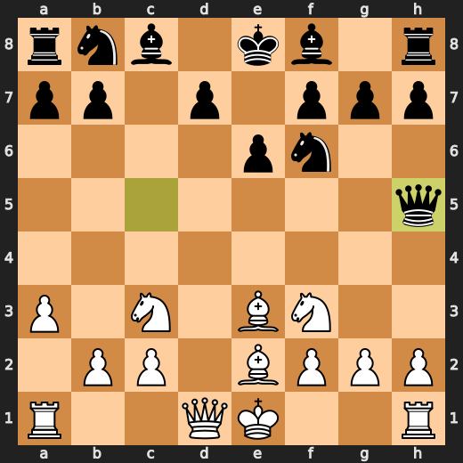
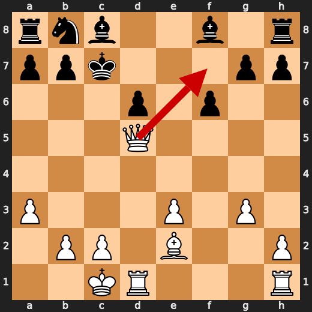
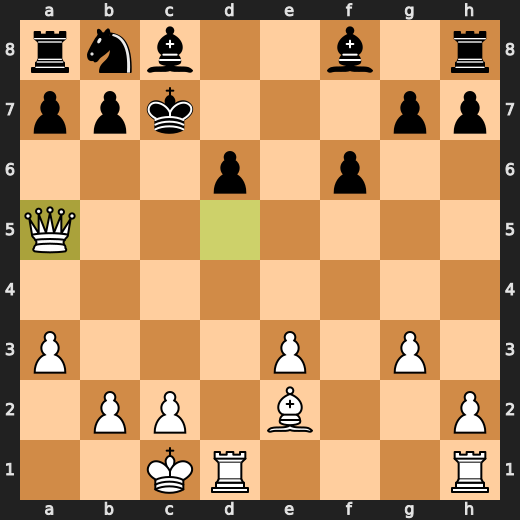
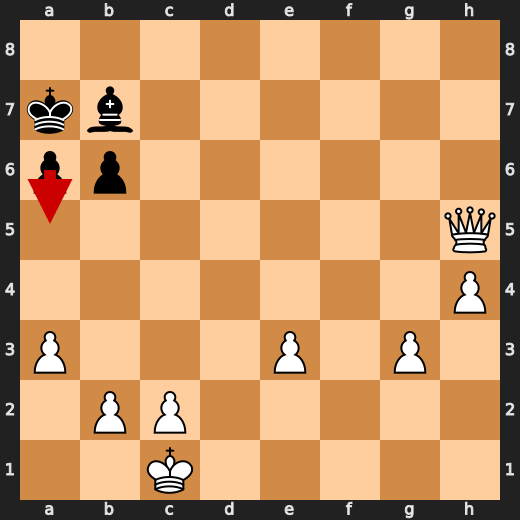
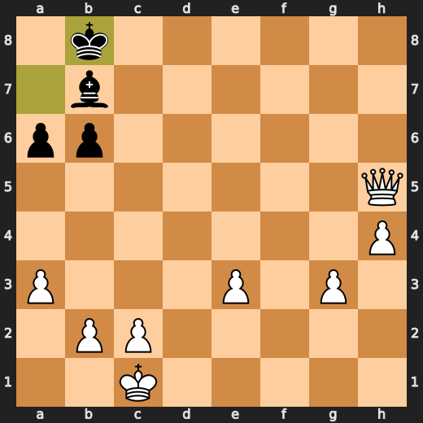
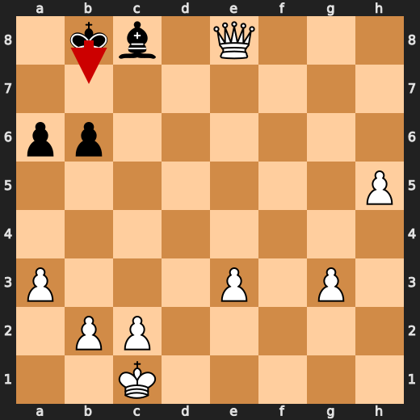
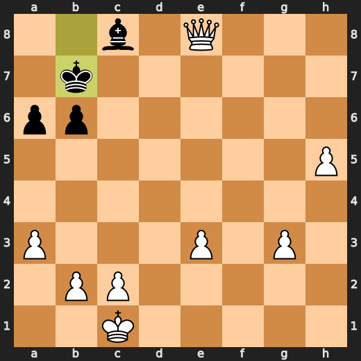

# You (White) vs CPU (Black)

**Result:** 1-0  
**Date:** 2026.05.12  
**Source:** `20260512_134218_pgn_2026_05_12_13h30_b814392bc2c9.pgn`  
**Engine:** Stockfish depth 14  
**Your side:** White  
**Computer side:** Black  
**Board perspective:** Standard White-at-bottom

---

## Who Is Who

- **You:** You (White)
- **Computer:** CPU (5) (Black)

---

## Toaster Summary

Biggest toaster scream: **45. Kb7** by **CPU (Black)**.

- **Label:** 💀 **Blunder**
- **Eval:** +28.64 → +62.28
- **Stockfish preferred:** `Kb7`
- **Loss:** 3364 cp

Final move recorded: **46. h6** by **You (White)**.

- 💀 Blunders: **2**
- ❌ Mistakes: **2**
- ⚠️ Inaccuracies: **7**
- ✅ Best moves called out: **43**

---

## Final Position


---

## Key Moments

### ✅ Best: 7. Qxc5 by CPU (Black)

The CPU's Qxc5 is a forced response to White's misplaced pawn on e4, which has overextended its influence on d5. The queen's capture balances the board, but doesn't address the underlying weakness.

- **Eval:** +1.15 → +1.23
- **Preferred:** `Qxc5`
- **Loss:** 8 cp

**Before 7. Qxc5**


**After 7. Qxc5**


### ❌ Mistake: 8. Qh5 by CPU (Black)

The CPU's impulsive Qh5 allows White to develop the queenside pieces and exert pressure on Black's position, particularly the f7 square. The knight on g6 is now exposed, while White's queenside pawns gain momentum. This move overextends Black's forces, creating a fragile balance that will soon topple.

- **Eval:** +0.07 → +3.97
- **Preferred:** `Qa5`
- **Loss:** 390 cp

**Before 8. Qh5**



**After 8. Qh5**



### ✅ Best: 9. Ng5 by You (White)

The knight on g5 is a curious choice. It attacks the bishop, but Black's response will be to retreat it, gaining time and balance in the position. The engine prefers this move, and I must concur: patience is often rewarded in chess, and letting the position unfold as it may is sometimes the best course of action.

- **Eval:** +4.20 → +4.21
- **Preferred:** `Ng5`
- **Loss:** 0 cp

**Before 9. Ng5**


**After 9. Ng5**


### ❌ Mistake: 9. Qh4 by CPU (Black)

The CPU's impulsive Qh4 overextends Black's queenside presence, allowing White to exploit the weakened kingside. The position cries out for patience and balance; instead, Black overreaches. Qg6 would have maintained a more harmonious distribution of forces.

- **Eval:** +4.10 → +8.51
- **Preferred:** `Qg6`
- **Loss:** 441 cp

**Before 9. Qh4**


**After 9. Qh4**


### ✅ Best: 10. g3 by You (White)

The pawn on g3 is a feeble attempt to control the kingside without overextending. Black's response will likely be ...h5, but for now, White gains some breathing room. The position remains fluid, awaiting the next misstep.

- **Eval:** +8.41 → +8.84
- **Preferred:** `g3`
- **Loss:** 0 cp

### ✅ Best: 11. Nxe6 by You (White)

The knight on e6 is a pawn's best friend, but not in this case. The queen's bishop on c4 overreaches, and its influence is better spent elsewhere. Nxf7 would have been more judicious, allowing Black to struggle with their own pieces.

- **Eval:** +8.61 → +8.46
- **Preferred:** `Nxf7`
- **Loss:** 15 cp

### ⚠️ Inaccuracy: 16. d6 by CPU (Black)

The Black pawn on d6 overextends, creating a weakness on the queenside and allowing White to potentially exploit it later. The knight on c6 would have maintained balance and prevented this imbalance.

- **Eval:** +7.68 → +9.24
- **Preferred:** `Nc6`
- **Loss:** 156 cp

### ⚠️ Inaccuracy: 17. Qa5+ by You (White)

Qa5+: a futile attempt to seize initiative. Black's king is safely tucked away on g8; White's queen merely overreaches, exposing herself to counterplay. Qf7+ would have forced Black to respond, maintaining balance in the position. Instead, this move allows Black to regain equilibrium and even gain some ground.

- **Eval:** +9.13 → +7.15
- **Preferred:** `Qf7+`
- **Loss:** 198 cp

**Before 17. Qa5+**



**After 17. Qa5+**



### ⚠️ Inaccuracy: 22. Bd8 by CPU (Black)

The CPU's Bd8 is a forced overreach, allowing White to develop the dark-squared bishop and exert pressure on the kingside. The more practical choice would have been Rd8, which maintains balance in the position.

- **Eval:** +6.84 → +8.45
- **Preferred:** `Rd8`
- **Loss:** 161 cp

### ⚠️ Inaccuracy: 39. Ka8 by CPU (Black)

The CPU's impatience is palpable on move 39: Ka8. The pawn on a7 was already under pressure from White's Qc3, and pushing the king pawn instead of supporting it with b5 allows White to further exploit this weakness. A more measured approach would have been beneficial.

- **Eval:** +9.13 → +10.69
- **Preferred:** `b5`
- **Loss:** 156 cp

### 💀 Blunder: 43. Kb8 by CPU (Black)

The CPU's impatience is its downfall. Playing Kb8 allows White to launch a swift counterattack on the queenside, while also exposing Black's king to potential threats. The engine prefers a5, which would have maintained balance and forced White to adapt. Instead, Black overreaches with Kb8, inviting disaster.

- **Eval:** +10.53 → +23.70
- **Preferred:** `a5`
- **Loss:** 1317 cp

**Before 43. Kb8**



**After 43. Kb8**



### 💀 Blunder: 45. Kb7 by CPU (Black)

The Black King's overreach on b7 allows White to exploit the weakened kingside. The pawn on c6 is now under threat, while the rest of Black's position remains stagnant. A more patient approach would have maintained balance.

- **Eval:** +28.64 → +62.28
- **Preferred:** `Kb7`
- **Loss:** 3364 cp

**Before 45. Kb7**



**After 45. Kb7**



---

## Human Notes

Biggest caveman lesson: CPU (Black) blew it with **43. Kb8**.

There was another real screw-up at **8. Qh5** by **CPU (Black)**.

---

<details>
<summary>Compact move list</summary>

- 📖 **1. e4** (You (White), Book) — +0.46 → +0.23, preferred `d4`, loss 23 cp
- 📖 **1. c5** (CPU (Black), Book) — +0.37 → +0.27, preferred `e5`, loss 0 cp
- 📖 **2. d4** (You (White), Book) — +0.48 → +0.16, preferred `Ne2`, loss 32 cp
- 📖 **2. e6** (CPU (Black), Book) — +0.22 → +0.87, preferred `cxd4`, loss 65 cp
- 📖 **3. dxc5** (You (White), Book) — +1.12 → +0.13, preferred `d5`, loss 99 cp
- ⚠️ **3. Qh4** (CPU (Black), Inaccuracy) — +0.00 → +1.31, preferred `Bxc5`, loss 131 cp
- 👍 **4. Nf3** (You (White), Good) — +1.32 → +0.78, preferred `Qe2`, loss 54 cp
- ✅ **4. Qxe4+** (CPU (Black), Best) — +0.62 → +0.82, preferred `Qxe4+`, loss 20 cp
- 🔥 **5. Be2** (You (White), Great) — +1.12 → +0.87, preferred `Be3`, loss 25 cp
- ⚠️ **5. Nf6** (CPU (Black), Inaccuracy) — +0.66 → +1.89, preferred `Qb4+`, loss 123 cp
- ✅ **6. Nc3** (You (White), Best) — +1.26 → +1.23, preferred `Nc3`, loss 3 cp
- ✅ **6. Qb4** (CPU (Black), Best) — +1.14 → +1.23, preferred `Qb4`, loss 9 cp
- 👍 **7. a3** (You (White), Good) — +1.70 → +0.74, preferred `O-O`, loss 96 cp
- ✅ **7. Qxc5** (CPU (Black), Best) — +1.15 → +1.23, preferred `Qxc5`, loss 8 cp
- 👍 **8. Be3** (You (White), Good) — +1.13 → +0.04, preferred `Nb5`, loss 109 cp
- ❌ **8. Qh5** (CPU (Black), Mistake) — +0.07 → +3.97, preferred `Qa5`, loss 390 cp
- ✅ **9. Ng5** (You (White), Best) — +4.20 → +4.21, preferred `Ng5`, loss 0 cp
- ❌ **9. Qh4** (CPU (Black), Mistake) — +4.10 → +8.51, preferred `Qg6`, loss 441 cp
- ✅ **10. g3** (You (White), Best) — +8.41 → +8.84, preferred `g3`, loss 0 cp
- 🔥 **10. Qh6** (CPU (Black), Great) — +8.38 → +8.75, preferred `Qh6`, loss 37 cp
- ✅ **11. Nxe6** (You (White), Best) — +8.61 → +8.46, preferred `Nxf7`, loss 15 cp
- 👍 **11. Qxe3** (CPU (Black), Good) — +8.69 → +9.61, preferred `dxe6`, loss 92 cp
- ✅ **12. Nc7+** (You (White), Best) — +8.83 → +8.90, preferred `Nc7+`, loss 0 cp
- ✅ **12. Kd8** (CPU (Black), Best) — +9.06 → +9.06, preferred `Kd8`, loss 0 cp
- ✅ **13. fxe3** (You (White), Best) — +9.06 → +9.06, preferred `fxe3`, loss 0 cp
- ✅ **13. Kxc7** (CPU (Black), Best) — +9.06 → +9.06, preferred `Kxc7`, loss 0 cp
- 👍 **14. Nd5+** (You (White), Good) — +9.06 → +8.12, preferred `O-O`, loss 94 cp
- ✅ **14. Nxd5** (CPU (Black), Best) — +8.23 → +8.36, preferred `Nxd5`, loss 13 cp
- ✅ **15. Qxd5** (You (White), Best) — +8.41 → +8.20, preferred `Qxd5`, loss 21 cp
- 👍 **15. f6** (CPU (Black), Good) — +7.69 → +8.36, preferred `f6`, loss 67 cp
- ✅ **16. O-O-O** (You (White), Best) — +7.76 → +7.67, preferred `O-O`, loss 9 cp
- ⚠️ **16. d6** (CPU (Black), Inaccuracy) — +7.68 → +9.24, preferred `Nc6`, loss 156 cp
- ⚠️ **17. Qa5+** (You (White), Inaccuracy) — +9.13 → +7.15, preferred `Qf7+`, loss 198 cp
- ✅ **17. b6** (CPU (Black), Best) — +7.77 → +7.59, preferred `b6`, loss 0 cp
- 🔥 **18. Qc3+** (You (White), Great) — +7.53 → +7.30, preferred `Qd5`, loss 23 cp
- ✅ **18. Nc6** (CPU (Black), Best) — +7.14 → +7.14, preferred `Nc6`, loss 0 cp
- 👍 **19. Bb5** (You (White), Good) — +7.36 → +6.55, preferred `g4`, loss 81 cp
- ✅ **19. Bd7** (CPU (Black), Best) — +7.23 → +6.60, preferred `Bb7`, loss 0 cp
- 🔥 **20. h4** (You (White), Great) — +6.92 → +6.46, preferred `Rhf1`, loss 46 cp
- 👍 **20. Be7** (CPU (Black), Good) — +6.53 → +7.14, preferred `Rc8`, loss 61 cp
- ✅ **21. Qc4** (You (White), Best) — +6.76 → +6.61, preferred `Qc4`, loss 15 cp
- 👍 **21. Be8** (CPU (Black), Good) — +6.67 → +7.23, preferred `Rhe8`, loss 56 cp
- 👍 **22. Qe4** (You (White), Good) — +7.43 → +6.92, preferred `h5`, loss 51 cp
- ⚠️ **22. Bd8** (CPU (Black), Inaccuracy) — +6.84 → +8.45, preferred `Rd8`, loss 161 cp
- 🔥 **23. Qe6** (You (White), Great) — +8.38 → +8.00, preferred `Qg4`, loss 38 cp
- ✅ **23. a6** (CPU (Black), Best) — +7.87 → +7.84, preferred `a6`, loss 0 cp
- 👍 **24. Bxc6** (You (White), Good) — +8.07 → +7.07, preferred `Bf1`, loss 100 cp
- ✅ **24. Bxc6** (CPU (Black), Best) — +7.15 → +7.16, preferred `Bxc6`, loss 1 cp
- ✅ **25. Qf7+** (You (White), Best) — +7.07 → +6.84, preferred `Qf7+`, loss 23 cp
- ✅ **25. Kb8** (CPU (Black), Best) — +6.76 → +6.89, preferred `Kb8`, loss 13 cp
- ✅ **26. Qxg7** (You (White), Best) — +6.93 → +6.84, preferred `Qxg7`, loss 9 cp
- 🔥 **26. Re8** (CPU (Black), Great) — +6.76 → +6.92, preferred `Re8`, loss 16 cp
- 🔥 **27. Rhe1** (You (White), Great) — +7.03 → +6.62, preferred `Qxh7`, loss 41 cp
- ✅ **27. Ra7** (CPU (Black), Best) — +6.56 → +6.63, preferred `Ra7`, loss 7 cp
- 🔥 **28. Qg4** (You (White), Great) — +6.63 → +6.39, preferred `Qh6`, loss 24 cp
- ✅ **28. Rd7** (CPU (Black), Best) — +6.23 → +6.23, preferred `Rd7`, loss 0 cp
- 👍 **29. Qc4** (You (White), Good) — +6.45 → +5.86, preferred `Rf1`, loss 59 cp
- 👍 **29. Bf3** (CPU (Black), Good) — +5.87 → +6.92, preferred `Kb7`, loss 105 cp
- ✅ **30. Qa4** (You (White), Best) — +7.19 → +7.07, preferred `Qxa6`, loss 12 cp
- 🔥 **30. Rde7** (CPU (Black), Great) — +7.07 → +7.30, preferred `Ree7`, loss 23 cp
- ✅ **31. Rxd6** (You (White), Best) — +7.23 → +7.23, preferred `Rxd6`, loss 0 cp
- 👍 **31. Ka7** (CPU (Black), Good) — +6.80 → +7.84, preferred `Bc7`, loss 104 cp
- ✅ **32. Rd7+** (You (White), Best) — +7.84 → +8.07, preferred `Rd7+`, loss 0 cp
- 🔥 **32. Bb7** (CPU (Black), Great) — +8.14 → +8.60, preferred `Bc7`, loss 46 cp
- ✅ **33. Qc6** (You (White), Best) — +8.72 → +8.81, preferred `Qc6`, loss 0 cp
- ✅ **33. Rxd7** (CPU (Black), Best) — +8.82 → +8.87, preferred `Rxd7`, loss 5 cp
- ✅ **34. Qxd7** (You (White), Best) — +8.88 → +9.01, preferred `Qxd7`, loss 0 cp
- ✅ **34. Rh8** (CPU (Black), Best) — +8.84 → +8.85, preferred `Rh8`, loss 1 cp
- 🔥 **35. Qg7** (You (White), Great) — +8.84 → +8.59, preferred `Rd1`, loss 25 cp
- 🔥 **35. Re8** (CPU (Black), Great) — +8.78 → +8.99, preferred `Re8`, loss 21 cp
- 🔥 **36. Rd1** (You (White), Great) — +9.10 → +8.78, preferred `Qd7`, loss 32 cp
- 🔥 **36. h5** (CPU (Black), Great) — +9.14 → +9.38, preferred `h5`, loss 24 cp
- ✅ **37. Rd7** (You (White), Best) — +9.52 → +9.46, preferred `Rd7`, loss 6 cp
- ✅ **37. Re7** (CPU (Black), Best) — +8.95 → +8.98, preferred `Re7`, loss 3 cp
- 👍 **38. Rxe7** (You (White), Good) — +9.15 → +8.38, preferred `Qxe7`, loss 77 cp
- ✅ **38. Bxe7** (CPU (Black), Best) — +8.44 → +8.68, preferred `Bxe7`, loss 24 cp
- ✅ **39. Qxe7** (You (White), Best) — +8.93 → +9.02, preferred `Qxe7`, loss 0 cp
- ⚠️ **39. Ka8** (CPU (Black), Inaccuracy) — +9.13 → +10.69, preferred `b5`, loss 156 cp
- ✅ **40. Qd8+** (You (White), Best) — +11.87 → +12.64, preferred `Qxf6`, loss 0 cp
- 🔥 **40. Ka7** (CPU (Black), Great) — +12.71 → +13.12, preferred `Ka7`, loss 41 cp
- ✅ **41. Qxf6** (You (White), Best) — +13.41 → +18.61, preferred `Qxf6`, loss 0 cp
- ⚠️ **41. Bh1** (CPU (Black), Inaccuracy) — +19.43 → +20.81, preferred `Bd5`, loss 138 cp
- 👍 **42. Qf7+** (You (White), Good) — +20.86 → +19.71, preferred `Qf7+`, loss 115 cp
- 👍 **42. Bb7** (CPU (Black), Good) — +21.58 → +22.10, preferred `Ka8`, loss 52 cp
- ✅ **43. Qxh5** (You (White), Best) — +22.10 → +23.02, preferred `Qxh5`, loss 0 cp
- 💀 **43. Kb8** (CPU (Black), Blunder) — +10.53 → +23.70, preferred `a5`, loss 1317 cp
- ✅ **44. Qe8+** (You (White), Best) — +24.08 → +24.13, preferred `Qe5+`, loss 0 cp
- ✅ **44. Bc8** (CPU (Black), Best) — +28.57 → +28.61, preferred `Kc7`, loss 4 cp
- ✅ **45. h5** (You (White), Best) — +28.62 → +28.64, preferred `h5`, loss 0 cp
- 💀 **45. Kb7** (CPU (Black), Blunder) — +28.64 → +62.28, preferred `Kb7`, loss 3364 cp
- ✅ **46. h6** (You (White), Best) — +63.99 → +64.43, preferred `Qe4+`, loss 0 cp

</details>

---

<details>
<summary>Raw engine table</summary>

| Ply | Move | Actor | Played | Label | Eval Before | Eval After | Preferred | Loss |
|---:|---:|---|---|---|---:|---:|---|---:|
| 1 | 1 | You (White) | e4 | Book | +0.46 | +0.23 | d4 | 23 |
| 2 | 1 | CPU (Black) | c5 | Book | +0.37 | +0.27 | e5 | 0 |
| 3 | 2 | You (White) | d4 | Book | +0.48 | +0.16 | Ne2 | 32 |
| 4 | 2 | CPU (Black) | e6 | Book | +0.22 | +0.87 | cxd4 | 65 |
| 5 | 3 | You (White) | dxc5 | Book | +1.12 | +0.13 | d5 | 99 |
| 6 | 3 | CPU (Black) | Qh4 | Inaccuracy | +0.00 | +1.31 | Bxc5 | 131 |
| 7 | 4 | You (White) | Nf3 | Good | +1.32 | +0.78 | Qe2 | 54 |
| 8 | 4 | CPU (Black) | Qxe4+ | Best | +0.62 | +0.82 | Qxe4+ | 20 |
| 9 | 5 | You (White) | Be2 | Great | +1.12 | +0.87 | Be3 | 25 |
| 10 | 5 | CPU (Black) | Nf6 | Inaccuracy | +0.66 | +1.89 | Qb4+ | 123 |
| 11 | 6 | You (White) | Nc3 | Best | +1.26 | +1.23 | Nc3 | 3 |
| 12 | 6 | CPU (Black) | Qb4 | Best | +1.14 | +1.23 | Qb4 | 9 |
| 13 | 7 | You (White) | a3 | Good | +1.70 | +0.74 | O-O | 96 |
| 14 | 7 | CPU (Black) | Qxc5 | Best | +1.15 | +1.23 | Qxc5 | 8 |
| 15 | 8 | You (White) | Be3 | Good | +1.13 | +0.04 | Nb5 | 109 |
| 16 | 8 | CPU (Black) | Qh5 | Mistake | +0.07 | +3.97 | Qa5 | 390 |
| 17 | 9 | You (White) | Ng5 | Best | +4.20 | +4.21 | Ng5 | 0 |
| 18 | 9 | CPU (Black) | Qh4 | Mistake | +4.10 | +8.51 | Qg6 | 441 |
| 19 | 10 | You (White) | g3 | Best | +8.41 | +8.84 | g3 | 0 |
| 20 | 10 | CPU (Black) | Qh6 | Great | +8.38 | +8.75 | Qh6 | 37 |
| 21 | 11 | You (White) | Nxe6 | Best | +8.61 | +8.46 | Nxf7 | 15 |
| 22 | 11 | CPU (Black) | Qxe3 | Good | +8.69 | +9.61 | dxe6 | 92 |
| 23 | 12 | You (White) | Nc7+ | Best | +8.83 | +8.90 | Nc7+ | 0 |
| 24 | 12 | CPU (Black) | Kd8 | Best | +9.06 | +9.06 | Kd8 | 0 |
| 25 | 13 | You (White) | fxe3 | Best | +9.06 | +9.06 | fxe3 | 0 |
| 26 | 13 | CPU (Black) | Kxc7 | Best | +9.06 | +9.06 | Kxc7 | 0 |
| 27 | 14 | You (White) | Nd5+ | Good | +9.06 | +8.12 | O-O | 94 |
| 28 | 14 | CPU (Black) | Nxd5 | Best | +8.23 | +8.36 | Nxd5 | 13 |
| 29 | 15 | You (White) | Qxd5 | Best | +8.41 | +8.20 | Qxd5 | 21 |
| 30 | 15 | CPU (Black) | f6 | Good | +7.69 | +8.36 | f6 | 67 |
| 31 | 16 | You (White) | O-O-O | Best | +7.76 | +7.67 | O-O | 9 |
| 32 | 16 | CPU (Black) | d6 | Inaccuracy | +7.68 | +9.24 | Nc6 | 156 |
| 33 | 17 | You (White) | Qa5+ | Inaccuracy | +9.13 | +7.15 | Qf7+ | 198 |
| 34 | 17 | CPU (Black) | b6 | Best | +7.77 | +7.59 | b6 | 0 |
| 35 | 18 | You (White) | Qc3+ | Great | +7.53 | +7.30 | Qd5 | 23 |
| 36 | 18 | CPU (Black) | Nc6 | Best | +7.14 | +7.14 | Nc6 | 0 |
| 37 | 19 | You (White) | Bb5 | Good | +7.36 | +6.55 | g4 | 81 |
| 38 | 19 | CPU (Black) | Bd7 | Best | +7.23 | +6.60 | Bb7 | 0 |
| 39 | 20 | You (White) | h4 | Great | +6.92 | +6.46 | Rhf1 | 46 |
| 40 | 20 | CPU (Black) | Be7 | Good | +6.53 | +7.14 | Rc8 | 61 |
| 41 | 21 | You (White) | Qc4 | Best | +6.76 | +6.61 | Qc4 | 15 |
| 42 | 21 | CPU (Black) | Be8 | Good | +6.67 | +7.23 | Rhe8 | 56 |
| 43 | 22 | You (White) | Qe4 | Good | +7.43 | +6.92 | h5 | 51 |
| 44 | 22 | CPU (Black) | Bd8 | Inaccuracy | +6.84 | +8.45 | Rd8 | 161 |
| 45 | 23 | You (White) | Qe6 | Great | +8.38 | +8.00 | Qg4 | 38 |
| 46 | 23 | CPU (Black) | a6 | Best | +7.87 | +7.84 | a6 | 0 |
| 47 | 24 | You (White) | Bxc6 | Good | +8.07 | +7.07 | Bf1 | 100 |
| 48 | 24 | CPU (Black) | Bxc6 | Best | +7.15 | +7.16 | Bxc6 | 1 |
| 49 | 25 | You (White) | Qf7+ | Best | +7.07 | +6.84 | Qf7+ | 23 |
| 50 | 25 | CPU (Black) | Kb8 | Best | +6.76 | +6.89 | Kb8 | 13 |
| 51 | 26 | You (White) | Qxg7 | Best | +6.93 | +6.84 | Qxg7 | 9 |
| 52 | 26 | CPU (Black) | Re8 | Great | +6.76 | +6.92 | Re8 | 16 |
| 53 | 27 | You (White) | Rhe1 | Great | +7.03 | +6.62 | Qxh7 | 41 |
| 54 | 27 | CPU (Black) | Ra7 | Best | +6.56 | +6.63 | Ra7 | 7 |
| 55 | 28 | You (White) | Qg4 | Great | +6.63 | +6.39 | Qh6 | 24 |
| 56 | 28 | CPU (Black) | Rd7 | Best | +6.23 | +6.23 | Rd7 | 0 |
| 57 | 29 | You (White) | Qc4 | Good | +6.45 | +5.86 | Rf1 | 59 |
| 58 | 29 | CPU (Black) | Bf3 | Good | +5.87 | +6.92 | Kb7 | 105 |
| 59 | 30 | You (White) | Qa4 | Best | +7.19 | +7.07 | Qxa6 | 12 |
| 60 | 30 | CPU (Black) | Rde7 | Great | +7.07 | +7.30 | Ree7 | 23 |
| 61 | 31 | You (White) | Rxd6 | Best | +7.23 | +7.23 | Rxd6 | 0 |
| 62 | 31 | CPU (Black) | Ka7 | Good | +6.80 | +7.84 | Bc7 | 104 |
| 63 | 32 | You (White) | Rd7+ | Best | +7.84 | +8.07 | Rd7+ | 0 |
| 64 | 32 | CPU (Black) | Bb7 | Great | +8.14 | +8.60 | Bc7 | 46 |
| 65 | 33 | You (White) | Qc6 | Best | +8.72 | +8.81 | Qc6 | 0 |
| 66 | 33 | CPU (Black) | Rxd7 | Best | +8.82 | +8.87 | Rxd7 | 5 |
| 67 | 34 | You (White) | Qxd7 | Best | +8.88 | +9.01 | Qxd7 | 0 |
| 68 | 34 | CPU (Black) | Rh8 | Best | +8.84 | +8.85 | Rh8 | 1 |
| 69 | 35 | You (White) | Qg7 | Great | +8.84 | +8.59 | Rd1 | 25 |
| 70 | 35 | CPU (Black) | Re8 | Great | +8.78 | +8.99 | Re8 | 21 |
| 71 | 36 | You (White) | Rd1 | Great | +9.10 | +8.78 | Qd7 | 32 |
| 72 | 36 | CPU (Black) | h5 | Great | +9.14 | +9.38 | h5 | 24 |
| 73 | 37 | You (White) | Rd7 | Best | +9.52 | +9.46 | Rd7 | 6 |
| 74 | 37 | CPU (Black) | Re7 | Best | +8.95 | +8.98 | Re7 | 3 |
| 75 | 38 | You (White) | Rxe7 | Good | +9.15 | +8.38 | Qxe7 | 77 |
| 76 | 38 | CPU (Black) | Bxe7 | Best | +8.44 | +8.68 | Bxe7 | 24 |
| 77 | 39 | You (White) | Qxe7 | Best | +8.93 | +9.02 | Qxe7 | 0 |
| 78 | 39 | CPU (Black) | Ka8 | Inaccuracy | +9.13 | +10.69 | b5 | 156 |
| 79 | 40 | You (White) | Qd8+ | Best | +11.87 | +12.64 | Qxf6 | 0 |
| 80 | 40 | CPU (Black) | Ka7 | Great | +12.71 | +13.12 | Ka7 | 41 |
| 81 | 41 | You (White) | Qxf6 | Best | +13.41 | +18.61 | Qxf6 | 0 |
| 82 | 41 | CPU (Black) | Bh1 | Inaccuracy | +19.43 | +20.81 | Bd5 | 138 |
| 83 | 42 | You (White) | Qf7+ | Good | +20.86 | +19.71 | Qf7+ | 115 |
| 84 | 42 | CPU (Black) | Bb7 | Good | +21.58 | +22.10 | Ka8 | 52 |
| 85 | 43 | You (White) | Qxh5 | Best | +22.10 | +23.02 | Qxh5 | 0 |
| 86 | 43 | CPU (Black) | Kb8 | Blunder | +10.53 | +23.70 | a5 | 1317 |
| 87 | 44 | You (White) | Qe8+ | Best | +24.08 | +24.13 | Qe5+ | 0 |
| 88 | 44 | CPU (Black) | Bc8 | Best | +28.57 | +28.61 | Kc7 | 4 |
| 89 | 45 | You (White) | h5 | Best | +28.62 | +28.64 | h5 | 0 |
| 90 | 45 | CPU (Black) | Kb7 | Blunder | +28.64 | +62.28 | Kb7 | 3364 |
| 91 | 46 | You (White) | h6 | Best | +63.99 | +64.43 | Qe4+ | 0 |

</details>

---

<details>
<summary>Clean PGN</summary>

```pgn
[Event "AI Factory's Chess"]
[Site "Android Device"]
[Date "2026.05.12"]
[Round "1"]
[White "You"]
[Black "CPU (5)"]
[Result "1-0"]
[PlyCount "93"]

1. e4 c5 2. d4 e6 3. dxc5 Qh4 4. Nf3 Qxe4+ 5. Be2 Nf6 6. Nc3 Qb4 7. a3 Qxc5 8.
Be3 Qh5 9. Ng5 Qh4 10. g3 Qh6 11. Nxe6 Qxe3 12. Nc7+ Kd8 13. fxe3 Kxc7 14. Nd5+
Nxd5 15. Qxd5 f6 16. O-O-O d6 17. Qa5+ b6 18. Qc3+ Nc6 19. Bb5 Bd7 20. h4 Be7
21. Qc4 Be8 22. Qe4 Bd8 23. Qe6 a6 24. Bxc6 Bxc6 25. Qf7+ Kb8 26. Qxg7 Re8 27.
Rhe1 Ra7 28. Qg4 Rd7 29. Qc4 Bf3 30. Qa4 Rde7 31. Rxd6 Ka7 32. Rd7+ Bb7 33. Qc6
Rxd7 34. Qxd7 Rh8 35. Qg7 Re8 36. Rd1 h5 37. Rd7 Re7 38. Rxe7 Bxe7 39. Qxe7 Ka8
40. Qd8+ Ka7 41. Qxf6 Bh1 42. Qf7+ Bb7 43. Qxh5 Kb8 44. Qe8+ Bc8 45. h5 Kb7 46.
h6 1-0
```

</details>
