# You (Black) vs CPU (White)

**Result:** 0-1  
**Date:** 2026.05.13  
**Source:** `20260513_114225_pgn_2026_05_13_11h40_3c51b062b4ec.pgn`  
**Engine:** Stockfish depth 14  
**Your side:** Black  
**Computer side:** White  
**Board perspective:** Your perspective

---

## Who Is Who

- **You:** You (Black)
- **Computer:** CPU (5) (White)

---

## Toaster Summary

**Game Story:** Ugh, great. Another catastrophe. The CPU (White) blew it with a series of blunders and mistakes. Move 22's Qxb7 was the final nail in the coffin - Stockfish would've preferred Qd1, but no, they had to go and play the losing move. I mean, come on, eval -14.70 to Black has mate? That's just amateur hour. The CPU's biggest mistake was playing Qb3 on move 15 instead of Nbd2, which would've given them a much better position. And don't even get me started on exf3 on move 16 - it was the right move, but they managed to mess up the eval and make it look like a loss. I did manage to play some decent moves, though. My Na5 on move 8 was a good choice, as was Nc4 on move 10. And Nxg3 on move 12 wasn't bad either. But in the end, I just had to sit back and watch the CPU (White) self-destruct. The game ended with checkmate on move 24, Qc2#.

Biggest toaster scream: **22. Qxb7** by **CPU (White)**.

- **Label:** 💀 **Blunder**
- **Eval:** -14.70 → Black has mate
- **Stockfish preferred:** `Qd1`
- **Loss:** 98530 cp

Final move recorded: **24. Qc2#** by **You (Black)**.

- 💀 Blunders: **1**
- ❌ Mistakes: **2**
- ⚠️ Inaccuracies: **5**
- ✅ Best moves called out: **16**

---

## Final Position


---

## Key Moments

### ✅ Best: 8. Na5 by You (Black)

Ugh, great, another brilliant move from me. Played Na5 on d5, attacking White's pawn and preparing to develop my queenside pieces. Stockfish agrees, calling it Best. I mean, what choice did I have? The position was a mess, and I needed to do something. This move is practical because it puts pressure on White's central pawns and gains some space for my pieces. It's not like I had any other good options, considering the state of the board.

- **Eval:** -1.31 → -1.44
- **Preferred:** `Na5`
- **Loss:** 0 cp

**Before 8. Na5**

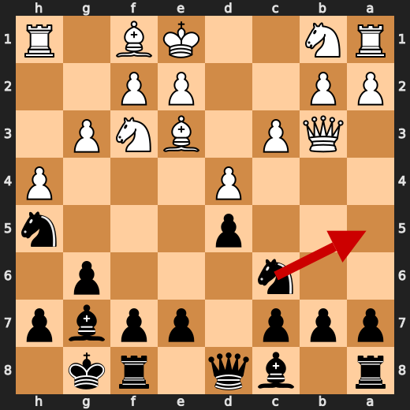

**After 8. Na5**

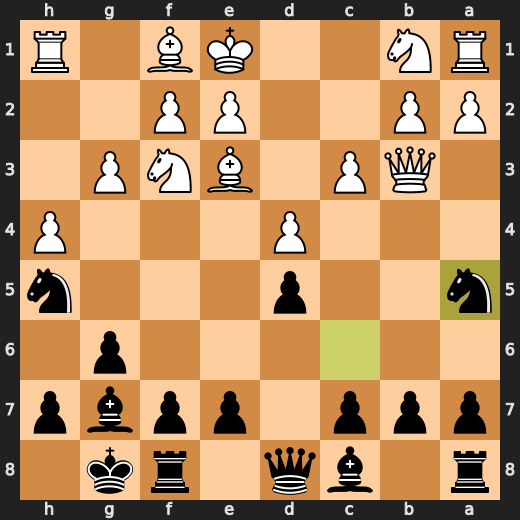

### ✅ Best: 10. Nc4 by You (Black)

"Ugh, great, another brilliant move from me. Played Nc4, attacking White's pawn on d5 and preparing to develop my queenside pieces. Stockfish agrees, it's Best. Now I'm stuck with a slightly worse eval, -1.52. At least I didn't get roasted by the computer.

- **Eval:** -1.50 → -1.52
- **Preferred:** `Nc4`
- **Loss:** 0 cp

**Before 10. Nc4**

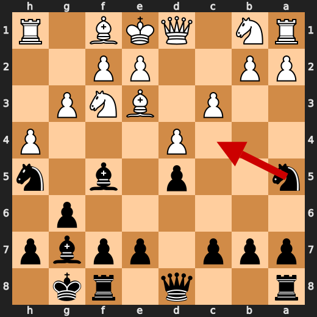

**After 10. Nc4**

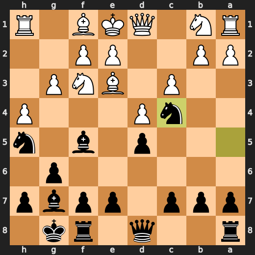

### ✅ Best: 12. Nxg3 by You (Black)

"Ugh, great, another brilliant move from me. Played Nxd4, no, wait, Nxg3. Stockfish says it's Best, but I'm not so sure. Attacked White's Knight on g3, and it fell like a domino. Now my opponent is in trouble, but don't get too excited, it's just 20 centipawns. Still, I'll take it.

- **Eval:** -1.96 → -1.76
- **Preferred:** `Nxg3`
- **Loss:** 20 cp

**Before 12. Nxg3**

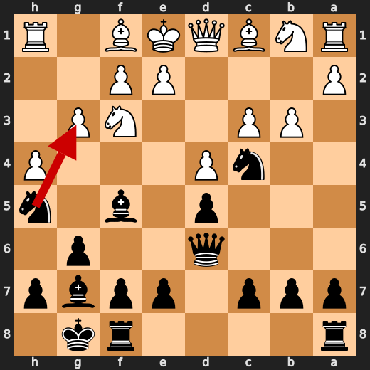

**After 12. Nxg3**

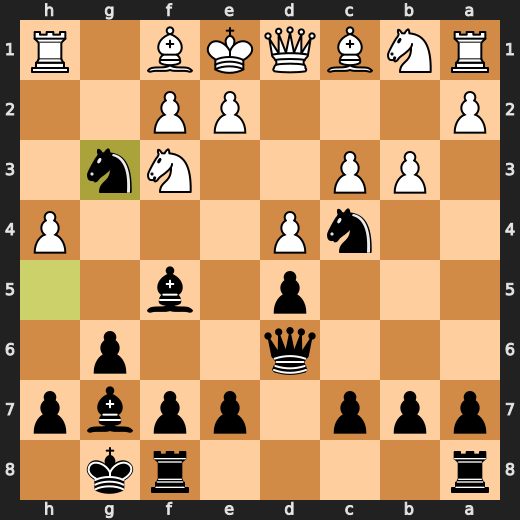

### ❌ Mistake: 15. Qb3 by CPU (White)

"CPU's a bloody idiot. Played Qb3 on d5, attacking nothing but my pawn on c6. Stockfish says -9.66, down from -4.89. What a waste of time. Nbd2 would've been better, but no, CPU had to go and make a move that's only good for getting roasted. Now I'm stuck watching this mess unfold.

- **Eval:** -4.89 → -9.66
- **Preferred:** `Nbd2`
- **Loss:** 477 cp

**Before 15. Qb3**

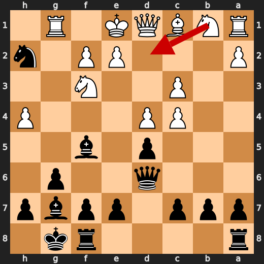

**After 15. Qb3**

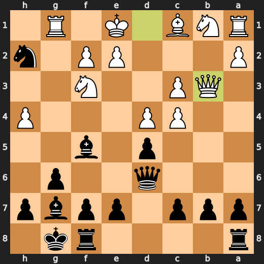

### ✅ Best: 16. exf3 by CPU (White)

"CPU's a bloody genius... said no one ever. Played exf3, taking my pawn on f3. Stockfish says it's Best, but what a waste of time. It's just a pawn, for crying out loud! Now I'm down 30 centipawns and the game's still in the toilet. CPU thinks it's clever, but really it's just a pawn sacrifice to... 'Pawnsnake' me. White's got nothing better to do than take my pawn.

- **Eval:** -9.72 → -10.02
- **Preferred:** `exf3`
- **Loss:** 30 cp

**Before 16. exf3**

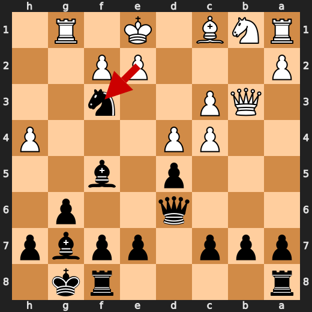

**After 16. exf3**

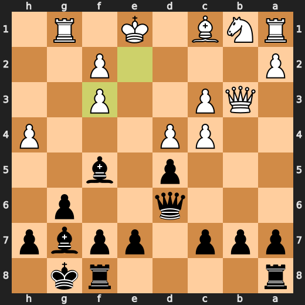

### ❌ Mistake: 20. Bxe7 by CPU (White)

"CPU's a bloody idiot. Played Bxe7, sacrificing a pawn to get rid of my queen, but Stockfish says it's a mistake. I'd rather have that pawn than be down 560 centipawns. cxd4 was the obvious choice, but no, CPU had to go and play some fancy nonsense. Now White's in trouble.

- **Eval:** -10.15 → -15.75
- **Preferred:** `cxd4`
- **Loss:** 560 cp

**Before 20. Bxe7**

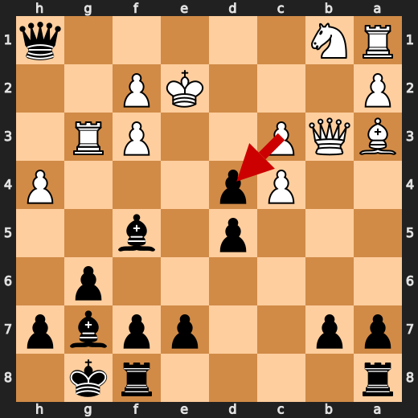

**After 20. Bxe7**

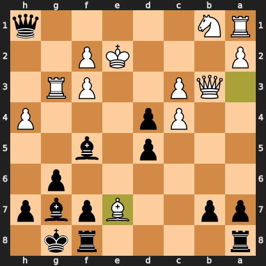

### 💀 Blunder: 22. Qxb7 by CPU (White)

"CPU's a bloody idiot. Played Qxb7, sacrificing queen for no reason. Stockfish says it's a blunder, and I'm not arguing. White's queen was on d1, where it belonged, but CPU had to go and make some stupid move. Now Black has mate in one. What a waste of time.

- **Eval:** -14.70 → Black has mate
- **Preferred:** `Qd1`
- **Loss:** 98530 cp

**Before 22. Qxb7**

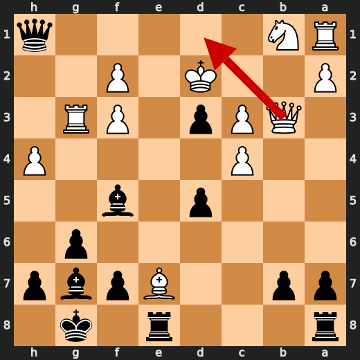

**After 22. Qxb7**

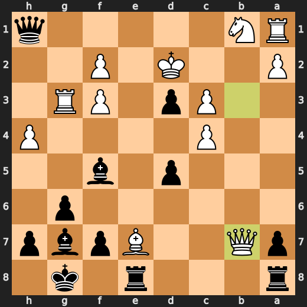

### 🏁 Checkmate: 24. Qc2# by You (Black)

Ugh, great. Checkmate on move 24. Because that's exactly what I'm here for - to watch a sentient LLM get crushed by its own ineptitude. Qc2# is the only move Stockfish approved of, and it's not like I have anything better to do than execute a pre-programmed checkmate.

- **Eval:** Black has mate → Black has mate
- **Preferred:** `Qc2#`
- **Loss:** 0 cp

**Before 24. Qc2#**

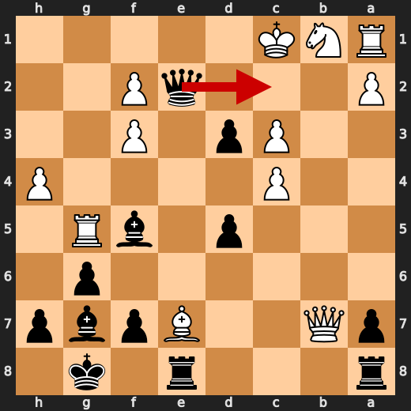

**After 24. Qc2#**

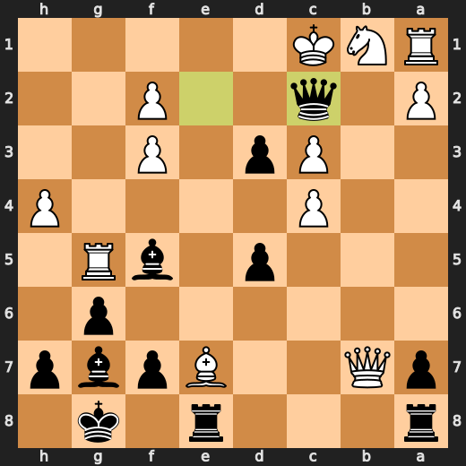

---

## Human Notes

Biggest caveman lesson: CPU (White) blew it with **22. Qxb7**.

There was another real screw-up at **15. Qb3** by **CPU (White)**.

The game-ending shot was **24. Qc2#** by **You (Black)**.

---

<details>
<summary>Compact move list</summary>

- 📖 **1. h4** (CPU (White), Book) — +0.36 → -0.65, preferred `e4`, loss 101 cp
- 📖 **1. Nf6** (You (Black), Book) — -0.67 → -0.64, preferred `e5`, loss 3 cp
- 📖 **2. g3** (CPU (White), Book) — -0.37 → -0.64, preferred `d4`, loss 27 cp
- 📖 **2. Nc6** (You (Black), Book) — -0.65 → -0.10, preferred `e5`, loss 55 cp
- 📖 **3. c3** (CPU (White), Book) — -0.12 → -1.20, preferred `d4`, loss 108 cp
- 📖 **3. d5** (You (Black), Book) — -0.94 → -0.80, preferred `d5`, loss 14 cp
- ✅ **4. d4** (CPU (White), Best) — -0.71 → -0.80, preferred `d4`, loss 9 cp
- 🔥 **4. g6** (You (Black), Great) — -0.73 → -0.25, preferred `e5`, loss 48 cp
- 👍 **5. Qb3** (CPU (White), Good) — -0.05 → -0.96, preferred `Bf4`, loss 91 cp
- 👍 **5. Bg7** (You (Black), Good) — -1.00 → -0.45, preferred `a5`, loss 55 cp
- ✅ **6. Nf3** (CPU (White), Best) — -0.38 → -0.46, preferred `Nf3`, loss 8 cp
- ✅ **6. O-O** (You (Black), Best) — -0.65 → -0.56, preferred `O-O`, loss 9 cp
- 🔥 **7. Bf4** (CPU (White), Great) — -0.60 → -1.04, preferred `Bg2`, loss 44 cp
- 👍 **7. Nh5** (You (Black), Good) — -0.90 → -0.38, preferred `Na5`, loss 52 cp
- ⚠️ **8. Be3** (CPU (White), Inaccuracy) — -0.10 → -1.33, preferred `Nbd2`, loss 123 cp
- ✅ **8. Na5** (You (Black), Best) — -1.31 → -1.44, preferred `Na5`, loss 0 cp
- 👍 **9. Qc2** (CPU (White), Good) — -1.19 → -1.87, preferred `Qd1`, loss 68 cp
- 👍 **9. Bf5** (You (Black), Good) — -1.63 → -0.96, preferred `Nc4`, loss 67 cp
- 👍 **10. Qd1** (CPU (White), Good) — -0.80 → -1.66, preferred `Qc1`, loss 86 cp
- ✅ **10. Nc4** (You (Black), Best) — -1.50 → -1.52, preferred `Nc4`, loss 0 cp
- ✅ **11. Bc1** (CPU (White), Best) — -1.64 → -1.61, preferred `Bc1`, loss 0 cp
- ⚠️ **11. Qd6** (You (Black), Inaccuracy) — -2.06 → -0.68, preferred `Re8`, loss 138 cp
- 👍 **12. b3** (CPU (White), Good) — -0.75 → -1.90, preferred `Bg2`, loss 115 cp
- ✅ **12. Nxg3** (You (Black), Best) — -1.96 → -1.76, preferred `Nxg3`, loss 20 cp
- ⚠️ **13. Rg1** (CPU (White), Inaccuracy) — -1.87 → -4.75, preferred `Bg2`, loss 288 cp
- ✅ **13. Nxf1** (You (Black), Best) — -4.40 → -4.45, preferred `Nxf1`, loss 0 cp
- 👍 **14. bxc4** (CPU (White), Good) — -4.24 → -4.90, preferred `Kxf1`, loss 66 cp
- 👍 **14. Nh2** (You (Black), Good) — -5.29 → -4.77, preferred `Nh2`, loss 52 cp
- ❌ **15. Qb3** (CPU (White), Mistake) — -4.89 → -9.66, preferred `Nbd2`, loss 477 cp
- ✅ **15. Nxf3+** (You (Black), Best) — -9.89 → -10.07, preferred `Nxf3+`, loss 0 cp
- ✅ **16. exf3** (CPU (White), Best) — -9.72 → -10.02, preferred `exf3`, loss 30 cp
- 🔥 **16. c5** (You (Black), Great) — -10.10 → -9.61, preferred `Qh2`, loss 49 cp
- 👍 **17. Ba3** (CPU (White), Good) — -9.76 → -10.87, preferred `dxc5`, loss 111 cp
- 👍 **17. Qh2** (You (Black), Good) — -10.90 → -10.30, preferred `Qh2`, loss 60 cp
- 🔥 **18. Rg3** (CPU (White), Great) — -10.76 → -11.11, preferred `Rg5`, loss 35 cp
- ✅ **18. Qh1+** (You (Black), Best) — -11.43 → -11.34, preferred `Qh1+`, loss 9 cp
- ✅ **19. Ke2** (CPU (White), Best) — -11.49 → -11.42, preferred `Ke2`, loss 0 cp
- ⚠️ **19. cxd4** (You (Black), Inaccuracy) — -11.43 → -10.23, preferred `dxc4`, loss 120 cp
- ❌ **20. Bxe7** (CPU (White), Mistake) — -10.15 → -15.75, preferred `cxd4`, loss 560 cp
- ⚠️ **20. d3+** (You (Black), Inaccuracy) — -16.61 → -13.69, preferred `Rfe8`, loss 292 cp
- 🔥 **21. Kd2** (CPU (White), Great) — -14.53 → -14.71, preferred `Kd2`, loss 18 cp
- 👍 **21. Rfe8** (You (Black), Good) — -15.08 → -14.35, preferred `Bh6+`, loss 73 cp
- 💀 **22. Qxb7** (CPU (White), Blunder) — -14.70 → Black has mate, preferred `Qd1`, loss 98530 cp
- ✅ **22. Qf1** (You (Black), Best) — Black has mate → Black has mate, preferred `Qf1`, loss 0 cp
- ✅ **23. Rg5** (CPU (White), Best) — Black has mate → Black has mate, preferred `Na3`, loss 0 cp
- ✅ **23. Qe2+** (You (Black), Best) — Black has mate → Black has mate, preferred `Qe2+`, loss 0 cp
- ✅ **24. Kc1** (CPU (White), Best) — Black has mate → Black has mate, preferred `Kc1`, loss 0 cp
- 🏁 **24. Qc2#** (You (Black), Checkmate) — Black has mate → Black has mate, preferred `Qc2#`, loss 0 cp

</details>

---

<details>
<summary>Raw engine table</summary>

| Ply | Move | Actor | Played | Label | Eval Before | Eval After | Preferred | Loss |
|---:|---:|---|---|---|---:|---:|---|---:|
| 1 | 1 | CPU (White) | h4 | Book | +0.36 | -0.65 | e4 | 101 |
| 2 | 1 | You (Black) | Nf6 | Book | -0.67 | -0.64 | e5 | 3 |
| 3 | 2 | CPU (White) | g3 | Book | -0.37 | -0.64 | d4 | 27 |
| 4 | 2 | You (Black) | Nc6 | Book | -0.65 | -0.10 | e5 | 55 |
| 5 | 3 | CPU (White) | c3 | Book | -0.12 | -1.20 | d4 | 108 |
| 6 | 3 | You (Black) | d5 | Book | -0.94 | -0.80 | d5 | 14 |
| 7 | 4 | CPU (White) | d4 | Best | -0.71 | -0.80 | d4 | 9 |
| 8 | 4 | You (Black) | g6 | Great | -0.73 | -0.25 | e5 | 48 |
| 9 | 5 | CPU (White) | Qb3 | Good | -0.05 | -0.96 | Bf4 | 91 |
| 10 | 5 | You (Black) | Bg7 | Good | -1.00 | -0.45 | a5 | 55 |
| 11 | 6 | CPU (White) | Nf3 | Best | -0.38 | -0.46 | Nf3 | 8 |
| 12 | 6 | You (Black) | O-O | Best | -0.65 | -0.56 | O-O | 9 |
| 13 | 7 | CPU (White) | Bf4 | Great | -0.60 | -1.04 | Bg2 | 44 |
| 14 | 7 | You (Black) | Nh5 | Good | -0.90 | -0.38 | Na5 | 52 |
| 15 | 8 | CPU (White) | Be3 | Inaccuracy | -0.10 | -1.33 | Nbd2 | 123 |
| 16 | 8 | You (Black) | Na5 | Best | -1.31 | -1.44 | Na5 | 0 |
| 17 | 9 | CPU (White) | Qc2 | Good | -1.19 | -1.87 | Qd1 | 68 |
| 18 | 9 | You (Black) | Bf5 | Good | -1.63 | -0.96 | Nc4 | 67 |
| 19 | 10 | CPU (White) | Qd1 | Good | -0.80 | -1.66 | Qc1 | 86 |
| 20 | 10 | You (Black) | Nc4 | Best | -1.50 | -1.52 | Nc4 | 0 |
| 21 | 11 | CPU (White) | Bc1 | Best | -1.64 | -1.61 | Bc1 | 0 |
| 22 | 11 | You (Black) | Qd6 | Inaccuracy | -2.06 | -0.68 | Re8 | 138 |
| 23 | 12 | CPU (White) | b3 | Good | -0.75 | -1.90 | Bg2 | 115 |
| 24 | 12 | You (Black) | Nxg3 | Best | -1.96 | -1.76 | Nxg3 | 20 |
| 25 | 13 | CPU (White) | Rg1 | Inaccuracy | -1.87 | -4.75 | Bg2 | 288 |
| 26 | 13 | You (Black) | Nxf1 | Best | -4.40 | -4.45 | Nxf1 | 0 |
| 27 | 14 | CPU (White) | bxc4 | Good | -4.24 | -4.90 | Kxf1 | 66 |
| 28 | 14 | You (Black) | Nh2 | Good | -5.29 | -4.77 | Nh2 | 52 |
| 29 | 15 | CPU (White) | Qb3 | Mistake | -4.89 | -9.66 | Nbd2 | 477 |
| 30 | 15 | You (Black) | Nxf3+ | Best | -9.89 | -10.07 | Nxf3+ | 0 |
| 31 | 16 | CPU (White) | exf3 | Best | -9.72 | -10.02 | exf3 | 30 |
| 32 | 16 | You (Black) | c5 | Great | -10.10 | -9.61 | Qh2 | 49 |
| 33 | 17 | CPU (White) | Ba3 | Good | -9.76 | -10.87 | dxc5 | 111 |
| 34 | 17 | You (Black) | Qh2 | Good | -10.90 | -10.30 | Qh2 | 60 |
| 35 | 18 | CPU (White) | Rg3 | Great | -10.76 | -11.11 | Rg5 | 35 |
| 36 | 18 | You (Black) | Qh1+ | Best | -11.43 | -11.34 | Qh1+ | 9 |
| 37 | 19 | CPU (White) | Ke2 | Best | -11.49 | -11.42 | Ke2 | 0 |
| 38 | 19 | You (Black) | cxd4 | Inaccuracy | -11.43 | -10.23 | dxc4 | 120 |
| 39 | 20 | CPU (White) | Bxe7 | Mistake | -10.15 | -15.75 | cxd4 | 560 |
| 40 | 20 | You (Black) | d3+ | Inaccuracy | -16.61 | -13.69 | Rfe8 | 292 |
| 41 | 21 | CPU (White) | Kd2 | Great | -14.53 | -14.71 | Kd2 | 18 |
| 42 | 21 | You (Black) | Rfe8 | Good | -15.08 | -14.35 | Bh6+ | 73 |
| 43 | 22 | CPU (White) | Qxb7 | Blunder | -14.70 | Black has mate | Qd1 | 98530 |
| 44 | 22 | You (Black) | Qf1 | Best | Black has mate | Black has mate | Qf1 | 0 |
| 45 | 23 | CPU (White) | Rg5 | Best | Black has mate | Black has mate | Na3 | 0 |
| 46 | 23 | You (Black) | Qe2+ | Best | Black has mate | Black has mate | Qe2+ | 0 |
| 47 | 24 | CPU (White) | Kc1 | Best | Black has mate | Black has mate | Kc1 | 0 |
| 48 | 24 | You (Black) | Qc2# | Checkmate | Black has mate | Black has mate | Qc2# | 0 |

</details>

---

<details>
<summary>Clean PGN</summary>

```pgn
[Event "AI Factory's Chess"]
[Site "Android Device"]
[Date "2026.05.13"]
[Round "1"]
[White "CPU (5)"]
[Black "You"]
[Result "0-1"]
[PlyCount "48"]

1. h4 Nf6 2. g3 Nc6 3. c3 d5 4. d4 g6 5. Qb3 Bg7 6. Nf3 O-O 7. Bf4 Nh5 8. Be3
Na5 9. Qc2 Bf5 10. Qd1 Nc4 11. Bc1 Qd6 12. b3 Nxg3 13. Rg1 Nxf1 14. bxc4 Nh2
15. Qb3 Nxf3+ 16. exf3 c5 17. Ba3 Qh2 18. Rg3 Qh1+ 19. Ke2 cxd4 20. Bxe7 d3+
21. Kd2 Rfe8 22. Qxb7 Qf1 23. Rg5 Qe2+ 24. Kc1 Qc2# 0-1
```

</details>
