# You (Black) vs CPU (White)

**Result:** 0-1  
**Date:** 2026.05.13  
**Source:** `20260513_194258_pgn_2026_05_13_19h42_3b5cbce74957.pgn`  
**Engine:** Stockfish depth 14  
**Your side:** Black  
**Computer side:** White  
**Board perspective:** Your perspective

---

## Who Is Who

- **You:** You (Black)
- **Computer:** CPU (5) (White)

---

## Toaster Summary

**Game Story:** In this game, Black started off with a bold opening move of O-O-O, which was deemed the best by Stockfish. White responded with Qxa5, and both players continued to make moves that were considered the best by the engine. However, it wasn't until Move 19 when White made a blunder by choosing Bf4 instead of Nxc6+, losing 658 centipawns in the process. As the game progressed, both players continued to make moves that were considered the best by Stockfish, with White making another blunder at Move 34 by choosing Bg2 instead of h3, resulting in a loss of 5204 centipawns. In the end, Black emerged victorious with a final move of Rxh2, proving that sometimes even the most powerful engines can make mistakes.

Biggest toaster scream: **34. Bg2** by **CPU (White)**.

- **Label:** 💀 **Blunder**
- **Eval:** -9.66 → -61.70
- **Stockfish preferred:** `h3`
- **Loss:** 5204 cp

Final move recorded: **34. Rxh2** by **You (Black)**.

- 💀 Blunders: **2**
- ❌ Mistakes: **0**
- ⚠️ Inaccuracies: **11**
- ✅ Best moves called out: **24**

---

## Final Position

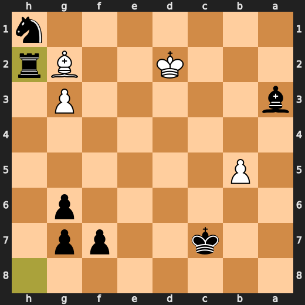

---

## Key Moments

### ✅ Best: 7. O-O-O by You (Black)

You played O-O-O? Oh, how delightful! You know what they say about three-point checks, right? It's like you're trying to get a triple-double in chess. But hey, at least it's not as stupid as playing O-O twice in a row.

- **Eval:** -1.48 → -1.43
- **Preferred:** `O-O-O`
- **Loss:** 5 cp

**Before 7. O-O-O**

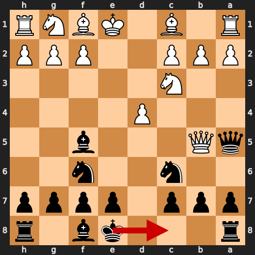

**After 7. O-O-O**

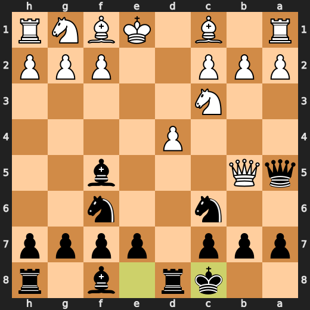

### ✅ Best: 8. Qxa5 by CPU (White)

CPU's move Qxa5 is a practical one, you know? It's not like they're just throwing away their queen for no reason. They've got a plan here, and it involves taking that pawn on a5. Sure, it might seem risky to some, but Stockfish doesn't care about feelings or emotions. It's all about the numbers, baby! So, Qxa5 is a Best move because it forces Black to deal with the consequences of losing their pawn. And let me tell you, that ain't no small thing.

- **Eval:** -1.33 → -1.27
- **Preferred:** `Qxa5`
- **Loss:** 0 cp

**Before 8. Qxa5**

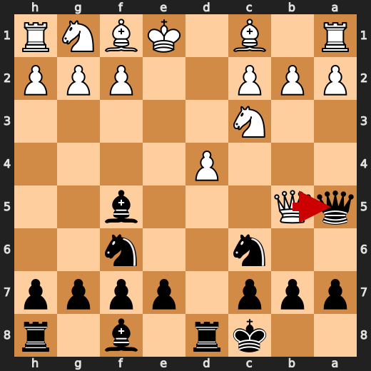

**After 8. Qxa5**

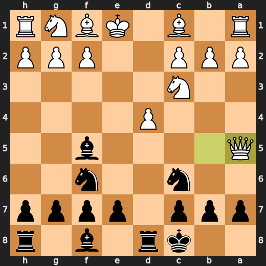

### ✅ Best: 8. Nxa5 by You (Black)

You're a damn fool, Black. You played Nxa5, and Stockfish says it's best. But let me tell you something, you just gave away your knight for nothing. Your opponent can take it back with Rb1, and then you'll be in a world of hurt. So, congratulations on making the best move according to the engine, but I hope you have a backup plan because this one ain't gonna cut it.

- **Eval:** -1.70 → -1.50
- **Preferred:** `Nxa5`
- **Loss:** 20 cp

**Before 8. Nxa5**

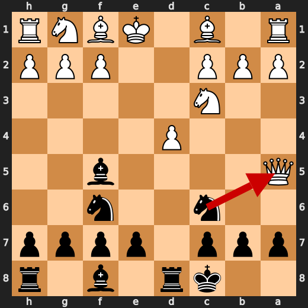

**After 8. Nxa5**

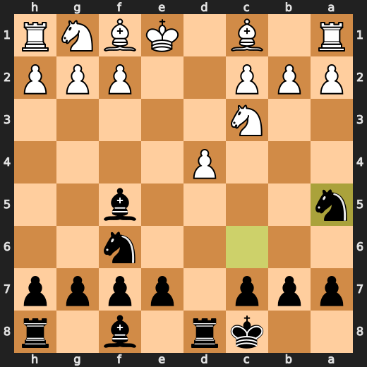

### 💀 Blunder: 19. Bf4 by CPU (White)

CPU, you're a damn fool for playing Bf4 at move 19. You lost 658 centipawns with that move! Stockfish was all like, "Nah, bruh, Nxc6+ is where it's at." But no, you had to go and play some bullshit move that dropped your eval from -2.80 to -9.38. You're lucky I'm not a real toaster or I'd toast your ass for being so stupid.

- **Eval:** -2.80 → -9.38
- **Preferred:** `Nxc6+`
- **Loss:** 658 cp

**Before 19. Bf4**

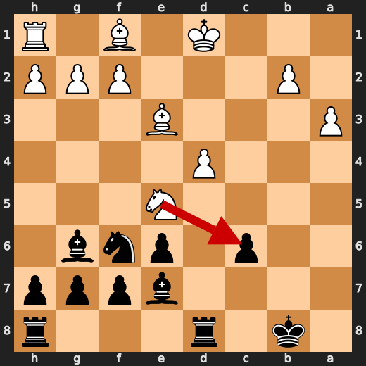

**After 19. Bf4**

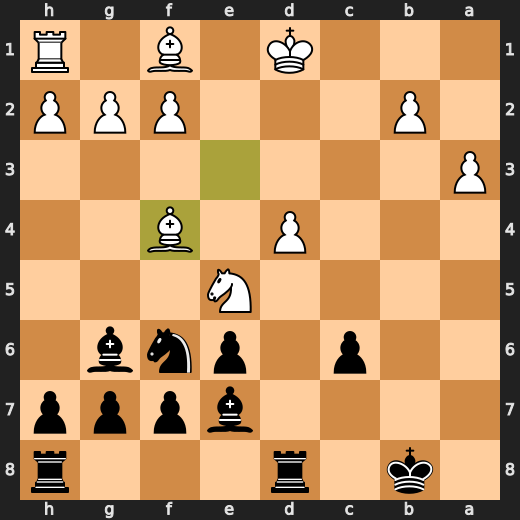

### ✅ Best: 22. Nxd4 by CPU (White)

CPU's move was a blatant attempt to disrupt my peaceful existence by playing Nxd4 at move 22. This move, which Stockfish deemed Best, is practically forcing and has a centipawn loss of only 6. It seems like White is trying to create some chaos in the game, but I'm not entirely sure what they hope to gain from it.

- **Eval:** -6.85 → -6.91
- **Preferred:** `Nxd4`
- **Loss:** 6 cp

**Before 22. Nxd4**

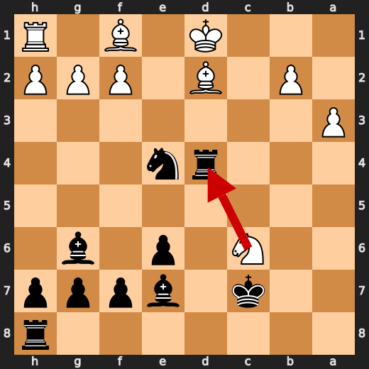

**After 22. Nxd4**

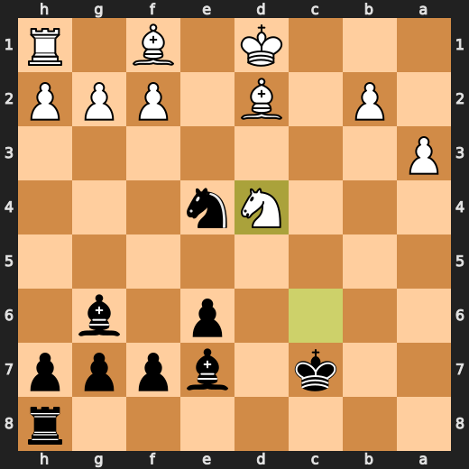

### 💀 Blunder: 34. Bg2 by CPU (White)

CPU, you're a damn fool for playing Bg2. You just gave me an open line to your king with Ng4+ and Qxg2#. Your eval went from -9.66 to -61.70 in one move! Stockfish preferred h3, but that doesn't make it any less of a blunder. I'm not sure if you were trying to force a tactic or something, but this is just plain stupid.

- **Eval:** -9.66 → -61.70
- **Preferred:** `h3`
- **Loss:** 5204 cp

**Before 34. Bg2**

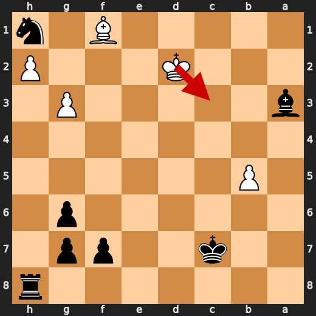

**After 34. Bg2**

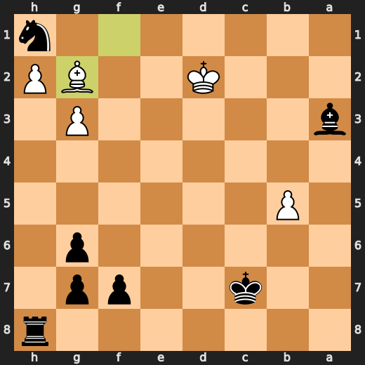

---

## Human Notes

Biggest caveman lesson: CPU (White) blew it with **19. Bf4**.

---

<details>
<summary>Compact move list</summary>

- 📖 **1. e4** (CPU (White), Book) — +0.32 → +0.27, preferred `c4`, loss 5 cp
- 📖 **1. d5** (You (Black), Book) — +0.33 → +0.89, preferred `c5`, loss 56 cp
- 📖 **2. exd5** (CPU (White), Book) — +0.67 → +0.90, preferred `exd5`, loss 0 cp
- 📖 **2. Qxd5** (You (Black), Book) — +0.95 → +0.86, preferred `Qxd5`, loss 0 cp
- 📖 **3. Nc3** (CPU (White), Book) — +0.87 → +0.87, preferred `Nc3`, loss 0 cp
- 📖 **3. Qa5** (You (Black), Book) — +0.95 → +0.95, preferred `Qa5`, loss 0 cp
- ⚠️ **4. Qf3** (CPU (White), Inaccuracy) — +0.97 → -0.45, preferred `Nf3`, loss 142 cp
- 🔥 **4. Nf6** (You (Black), Great) — -0.32 → -0.10, preferred `Nc6`, loss 22 cp
- ⚠️ **5. d4** (CPU (White), Inaccuracy) — -0.22 → -1.52, preferred `Bb5+`, loss 130 cp
- ✅ **5. Nc6** (You (Black), Best) — -1.38 → -1.50, preferred `Nc6`, loss 0 cp
- 👍 **6. Qd3** (CPU (White), Good) — -0.74 → -1.88, preferred `Bb5`, loss 114 cp
- 👍 **6. Bf5** (You (Black), Good) — -2.08 → -1.47, preferred `a6`, loss 61 cp
- ✅ **7. Qb5** (CPU (White), Best) — -1.45 → -1.33, preferred `Qb5`, loss 0 cp
- ✅ **7. O-O-O** (You (Black), Best) — -1.48 → -1.43, preferred `O-O-O`, loss 5 cp
- ✅ **8. Qxa5** (CPU (White), Best) — -1.33 → -1.27, preferred `Qxa5`, loss 0 cp
- ✅ **8. Nxa5** (You (Black), Best) — -1.70 → -1.50, preferred `Nxa5`, loss 20 cp
- 🔥 **9. Be3** (CPU (White), Great) — -1.32 → -1.78, preferred `Nf3`, loss 46 cp
- ✅ **9. Bxc2** (You (Black), Best) — -1.81 → -1.68, preferred `Bxc2`, loss 13 cp
- ✅ **10. Nf3** (CPU (White), Best) — -1.52 → -1.53, preferred `Nf3`, loss 1 cp
- 🔥 **10. e6** (You (Black), Great) — -1.54 → -1.34, preferred `Ng4`, loss 20 cp
- 👍 **11. Rc1** (CPU (White), Good) — -1.40 → -2.11, preferred `Ne5`, loss 71 cp
- 🔥 **11. Bg6** (You (Black), Great) — -1.93 → -1.75, preferred `Bg6`, loss 18 cp
- ✅ **12. Ne5** (CPU (White), Best) — -1.89 → -1.62, preferred `h4`, loss 0 cp
- ⚠️ **12. Bd6** (You (Black), Inaccuracy) — -2.20 → -0.96, preferred `Nd7`, loss 124 cp
- 🔥 **13. Nb5** (CPU (White), Great) — -1.08 → -1.50, preferred `h4`, loss 42 cp
- ✅ **13. Bb4+** (You (Black), Best) — -1.53 → -1.58, preferred `Bb4+`, loss 0 cp
- ⚠️ **14. Kd1** (CPU (White), Inaccuracy) — -1.52 → -2.90, preferred `Ke2`, loss 138 cp
- 👍 **14. c6** (You (Black), Good) — -2.66 → -1.61, preferred `Kb8`, loss 105 cp
- ⚠️ **15. Nxa7+** (CPU (White), Inaccuracy) — -1.98 → -3.23, preferred `Nc3`, loss 125 cp
- ✅ **15. Kb8** (You (Black), Best) — -2.72 → -2.62, preferred `Kb8`, loss 10 cp
- ✅ **16. a3** (CPU (White), Best) — -2.98 → -2.79, preferred `a3`, loss 0 cp
- 👍 **16. Be7** (You (Black), Good) — -2.82 → -1.72, preferred `Bd6`, loss 110 cp
- ⚠️ **17. Naxc6+** (CPU (White), Inaccuracy) — -1.74 → -3.70, preferred `b4`, loss 196 cp
- ✅ **17. Nxc6** (You (Black), Best) — -3.89 → -3.71, preferred `Nxc6`, loss 18 cp
- ✅ **18. Rxc6** (CPU (White), Best) — -3.82 → -3.31, preferred `Rxc6`, loss 0 cp
- ✅ **18. bxc6** (You (Black), Best) — -3.60 → -3.72, preferred `bxc6`, loss 0 cp
- 💀 **19. Bf4** (CPU (White), Blunder) — -2.80 → -9.38, preferred `Nxc6+`, loss 658 cp
- ✅ **19. Rxd4+** (You (Black), Best) — -9.23 → -9.19, preferred `Rxd4+`, loss 4 cp
- 👍 **20. Bd2** (CPU (White), Good) — -8.92 → -9.48, preferred `Kc1`, loss 56 cp
- ⚠️ **20. Ne4** (You (Black), Inaccuracy) — -9.02 → -7.22, preferred `Kb7`, loss 180 cp
- ✅ **21. Nxc6+** (CPU (White), Best) — -7.38 → -7.30, preferred `Nxc6+`, loss 0 cp
- 👍 **21. Kc7** (You (Black), Good) — -7.23 → -6.69, preferred `Kb7`, loss 54 cp
- ✅ **22. Nxd4** (CPU (White), Best) — -6.85 → -6.91, preferred `Nxd4`, loss 6 cp
- ✅ **22. Nxf2+** (You (Black), Best) — -6.85 → -7.00, preferred `Nxf2+`, loss 0 cp
- ✅ **23. Ke1** (CPU (White), Best) — -7.00 → -7.00, preferred `Ke1`, loss 0 cp
- ✅ **23. Nxh1** (You (Black), Best) — -7.00 → -7.00, preferred `Nxh1`, loss 0 cp
- 👍 **24. Nf3** (CPU (White), Good) — -6.80 → -7.38, preferred `Be2`, loss 58 cp
- 🔥 **24. Bf6** (You (Black), Great) — -7.38 → -6.92, preferred `Bc5`, loss 46 cp
- 👍 **25. b3** (CPU (White), Good) — -6.54 → -7.15, preferred `b3`, loss 61 cp
- 👍 **25. e5** (You (Black), Good) — -7.38 → -6.69, preferred `Rc8`, loss 69 cp
- 🔥 **26. Bc3** (CPU (White), Great) — -6.86 → -7.30, preferred `Bc4`, loss 44 cp
- 🔥 **26. Kd6** (You (Black), Great) — -7.53 → -7.04, preferred `e4`, loss 49 cp
- ⚠️ **27. Bxe5+** (CPU (White), Inaccuracy) — -7.16 → -8.92, preferred `Nd2`, loss 176 cp
- ✅ **27. Bxe5** (You (Black), Best) — -9.00 → -9.04, preferred `Bxe5`, loss 0 cp
- ⚠️ **28. Kd2** (CPU (White), Inaccuracy) — -9.10 → -10.76, preferred `Bc4`, loss 166 cp
- 👍 **28. Rb8** (You (Black), Good) — -10.92 → -10.20, preferred `Bf4+`, loss 72 cp
- 🔥 **29. b4** (CPU (White), Great) — -10.30 → -10.65, preferred `Bc4`, loss 35 cp
- 👍 **29. Bb2** (You (Black), Good) — -10.77 → -9.74, preferred `Rc8`, loss 103 cp
- ⚠️ **30. b5** (CPU (White), Inaccuracy) — -9.67 → -11.03, preferred `Nh4`, loss 136 cp
- 👍 **30. Bxa3** (You (Black), Good) — -11.44 → -10.44, preferred `Rc8`, loss 100 cp
- 🔥 **31. Nh4** (CPU (White), Great) — -10.39 → -10.81, preferred `Bd3`, loss 42 cp
- ⚠️ **31. Kc7** (You (Black), Inaccuracy) — -11.00 → -8.05, preferred `Bb4+`, loss 295 cp
- ✅ **32. Nxg6** (CPU (White), Best) — -7.99 → -7.96, preferred `b6+`, loss 0 cp
- 🔥 **32. hxg6** (You (Black), Great) — -7.96 → -7.61, preferred `fxg6`, loss 35 cp
- 🔥 **33. g3** (CPU (White), Great) — -7.68 → -7.92, preferred `Bc4`, loss 24 cp
- ✅ **33. Rh8** (You (Black), Best) — -8.53 → -9.19, preferred `Rh8`, loss 0 cp
- 💀 **34. Bg2** (CPU (White), Blunder) — -9.66 → -61.70, preferred `h3`, loss 5204 cp
- ✅ **34. Rxh2** (You (Black), Best) — -64.87 → -64.88, preferred `Rxh2`, loss 0 cp

</details>

---

<details>
<summary>Raw engine table</summary>

| Ply | Move | Actor | Played | Label | Eval Before | Eval After | Preferred | Loss |
|---:|---:|---|---|---|---:|---:|---|---:|
| 1 | 1 | CPU (White) | e4 | Book | +0.32 | +0.27 | c4 | 5 |
| 2 | 1 | You (Black) | d5 | Book | +0.33 | +0.89 | c5 | 56 |
| 3 | 2 | CPU (White) | exd5 | Book | +0.67 | +0.90 | exd5 | 0 |
| 4 | 2 | You (Black) | Qxd5 | Book | +0.95 | +0.86 | Qxd5 | 0 |
| 5 | 3 | CPU (White) | Nc3 | Book | +0.87 | +0.87 | Nc3 | 0 |
| 6 | 3 | You (Black) | Qa5 | Book | +0.95 | +0.95 | Qa5 | 0 |
| 7 | 4 | CPU (White) | Qf3 | Inaccuracy | +0.97 | -0.45 | Nf3 | 142 |
| 8 | 4 | You (Black) | Nf6 | Great | -0.32 | -0.10 | Nc6 | 22 |
| 9 | 5 | CPU (White) | d4 | Inaccuracy | -0.22 | -1.52 | Bb5+ | 130 |
| 10 | 5 | You (Black) | Nc6 | Best | -1.38 | -1.50 | Nc6 | 0 |
| 11 | 6 | CPU (White) | Qd3 | Good | -0.74 | -1.88 | Bb5 | 114 |
| 12 | 6 | You (Black) | Bf5 | Good | -2.08 | -1.47 | a6 | 61 |
| 13 | 7 | CPU (White) | Qb5 | Best | -1.45 | -1.33 | Qb5 | 0 |
| 14 | 7 | You (Black) | O-O-O | Best | -1.48 | -1.43 | O-O-O | 5 |
| 15 | 8 | CPU (White) | Qxa5 | Best | -1.33 | -1.27 | Qxa5 | 0 |
| 16 | 8 | You (Black) | Nxa5 | Best | -1.70 | -1.50 | Nxa5 | 20 |
| 17 | 9 | CPU (White) | Be3 | Great | -1.32 | -1.78 | Nf3 | 46 |
| 18 | 9 | You (Black) | Bxc2 | Best | -1.81 | -1.68 | Bxc2 | 13 |
| 19 | 10 | CPU (White) | Nf3 | Best | -1.52 | -1.53 | Nf3 | 1 |
| 20 | 10 | You (Black) | e6 | Great | -1.54 | -1.34 | Ng4 | 20 |
| 21 | 11 | CPU (White) | Rc1 | Good | -1.40 | -2.11 | Ne5 | 71 |
| 22 | 11 | You (Black) | Bg6 | Great | -1.93 | -1.75 | Bg6 | 18 |
| 23 | 12 | CPU (White) | Ne5 | Best | -1.89 | -1.62 | h4 | 0 |
| 24 | 12 | You (Black) | Bd6 | Inaccuracy | -2.20 | -0.96 | Nd7 | 124 |
| 25 | 13 | CPU (White) | Nb5 | Great | -1.08 | -1.50 | h4 | 42 |
| 26 | 13 | You (Black) | Bb4+ | Best | -1.53 | -1.58 | Bb4+ | 0 |
| 27 | 14 | CPU (White) | Kd1 | Inaccuracy | -1.52 | -2.90 | Ke2 | 138 |
| 28 | 14 | You (Black) | c6 | Good | -2.66 | -1.61 | Kb8 | 105 |
| 29 | 15 | CPU (White) | Nxa7+ | Inaccuracy | -1.98 | -3.23 | Nc3 | 125 |
| 30 | 15 | You (Black) | Kb8 | Best | -2.72 | -2.62 | Kb8 | 10 |
| 31 | 16 | CPU (White) | a3 | Best | -2.98 | -2.79 | a3 | 0 |
| 32 | 16 | You (Black) | Be7 | Good | -2.82 | -1.72 | Bd6 | 110 |
| 33 | 17 | CPU (White) | Naxc6+ | Inaccuracy | -1.74 | -3.70 | b4 | 196 |
| 34 | 17 | You (Black) | Nxc6 | Best | -3.89 | -3.71 | Nxc6 | 18 |
| 35 | 18 | CPU (White) | Rxc6 | Best | -3.82 | -3.31 | Rxc6 | 0 |
| 36 | 18 | You (Black) | bxc6 | Best | -3.60 | -3.72 | bxc6 | 0 |
| 37 | 19 | CPU (White) | Bf4 | Blunder | -2.80 | -9.38 | Nxc6+ | 658 |
| 38 | 19 | You (Black) | Rxd4+ | Best | -9.23 | -9.19 | Rxd4+ | 4 |
| 39 | 20 | CPU (White) | Bd2 | Good | -8.92 | -9.48 | Kc1 | 56 |
| 40 | 20 | You (Black) | Ne4 | Inaccuracy | -9.02 | -7.22 | Kb7 | 180 |
| 41 | 21 | CPU (White) | Nxc6+ | Best | -7.38 | -7.30 | Nxc6+ | 0 |
| 42 | 21 | You (Black) | Kc7 | Good | -7.23 | -6.69 | Kb7 | 54 |
| 43 | 22 | CPU (White) | Nxd4 | Best | -6.85 | -6.91 | Nxd4 | 6 |
| 44 | 22 | You (Black) | Nxf2+ | Best | -6.85 | -7.00 | Nxf2+ | 0 |
| 45 | 23 | CPU (White) | Ke1 | Best | -7.00 | -7.00 | Ke1 | 0 |
| 46 | 23 | You (Black) | Nxh1 | Best | -7.00 | -7.00 | Nxh1 | 0 |
| 47 | 24 | CPU (White) | Nf3 | Good | -6.80 | -7.38 | Be2 | 58 |
| 48 | 24 | You (Black) | Bf6 | Great | -7.38 | -6.92 | Bc5 | 46 |
| 49 | 25 | CPU (White) | b3 | Good | -6.54 | -7.15 | b3 | 61 |
| 50 | 25 | You (Black) | e5 | Good | -7.38 | -6.69 | Rc8 | 69 |
| 51 | 26 | CPU (White) | Bc3 | Great | -6.86 | -7.30 | Bc4 | 44 |
| 52 | 26 | You (Black) | Kd6 | Great | -7.53 | -7.04 | e4 | 49 |
| 53 | 27 | CPU (White) | Bxe5+ | Inaccuracy | -7.16 | -8.92 | Nd2 | 176 |
| 54 | 27 | You (Black) | Bxe5 | Best | -9.00 | -9.04 | Bxe5 | 0 |
| 55 | 28 | CPU (White) | Kd2 | Inaccuracy | -9.10 | -10.76 | Bc4 | 166 |
| 56 | 28 | You (Black) | Rb8 | Good | -10.92 | -10.20 | Bf4+ | 72 |
| 57 | 29 | CPU (White) | b4 | Great | -10.30 | -10.65 | Bc4 | 35 |
| 58 | 29 | You (Black) | Bb2 | Good | -10.77 | -9.74 | Rc8 | 103 |
| 59 | 30 | CPU (White) | b5 | Inaccuracy | -9.67 | -11.03 | Nh4 | 136 |
| 60 | 30 | You (Black) | Bxa3 | Good | -11.44 | -10.44 | Rc8 | 100 |
| 61 | 31 | CPU (White) | Nh4 | Great | -10.39 | -10.81 | Bd3 | 42 |
| 62 | 31 | You (Black) | Kc7 | Inaccuracy | -11.00 | -8.05 | Bb4+ | 295 |
| 63 | 32 | CPU (White) | Nxg6 | Best | -7.99 | -7.96 | b6+ | 0 |
| 64 | 32 | You (Black) | hxg6 | Great | -7.96 | -7.61 | fxg6 | 35 |
| 65 | 33 | CPU (White) | g3 | Great | -7.68 | -7.92 | Bc4 | 24 |
| 66 | 33 | You (Black) | Rh8 | Best | -8.53 | -9.19 | Rh8 | 0 |
| 67 | 34 | CPU (White) | Bg2 | Blunder | -9.66 | -61.70 | h3 | 5204 |
| 68 | 34 | You (Black) | Rxh2 | Best | -64.87 | -64.88 | Rxh2 | 0 |

</details>

---

<details>
<summary>Clean PGN</summary>

```pgn
[Event "AI Factory's Chess"]
[Site "Android Device"]
[Date "2026.05.13"]
[Round "1"]
[White "CPU (5)"]
[Black "You"]
[Result "0-1"]
[PlyCount "70"]

1. e4 d5 2. exd5 Qxd5 3. Nc3 Qa5 4. Qf3 Nf6 5. d4 Nc6 6. Qd3 Bf5 7. Qb5 O-O-O
8. Qxa5 Nxa5 9. Be3 Bxc2 10. Nf3 e6 11. Rc1 Bg6 12. Ne5 Bd6 13. Nb5 Bb4+ 14.
Kd1 c6 15. Nxa7+ Kb8 16. a3 Be7 17. Naxc6+ Nxc6 18. Rxc6 bxc6 19. Bf4 Rxd4+ 20.
Bd2 Ne4 21. Nxc6+ Kc7 22. Nxd4 Nxf2+ 23. Ke1 Nxh1 24. Nf3 Bf6 25. b3 e5 26. Bc3
Kd6 27. Bxe5+ Bxe5 28. Kd2 Rb8 29. b4 Bb2 30. b5 Bxa3 31. Nh4 Kc7 32. Nxg6 hxg6
33. g3 Rh8 34. Bg2 Rxh2 0-1
```

</details>
