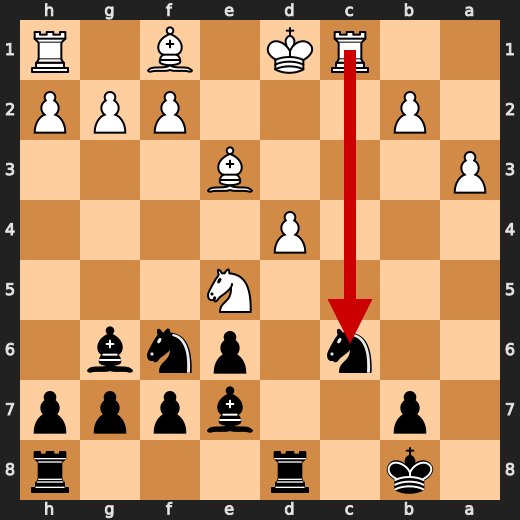
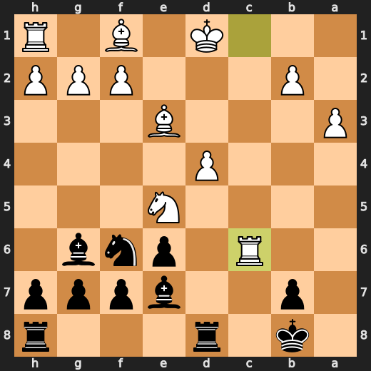
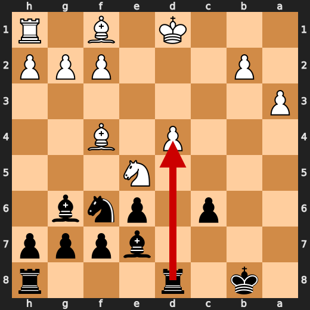
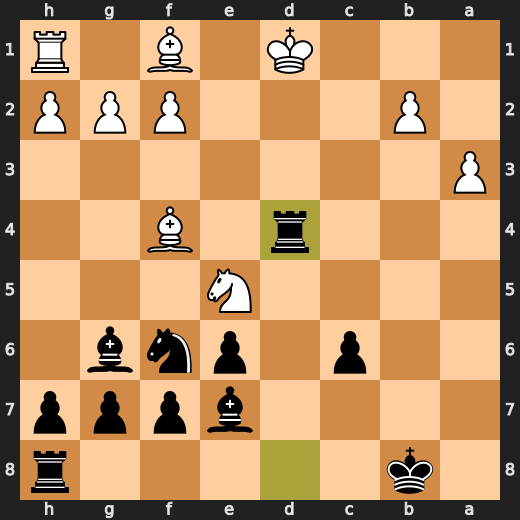
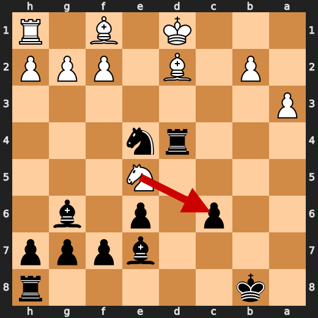
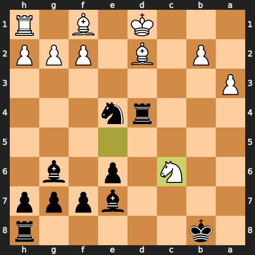
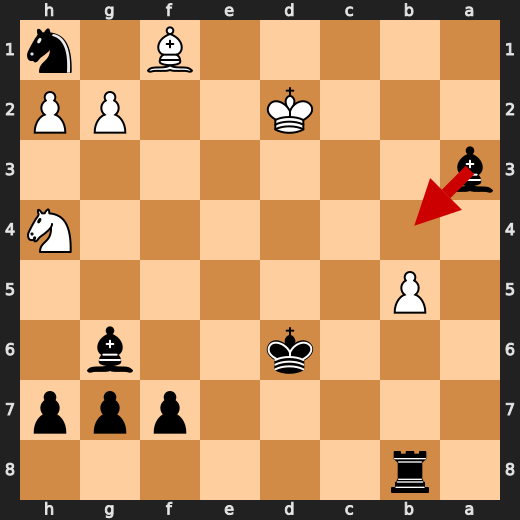
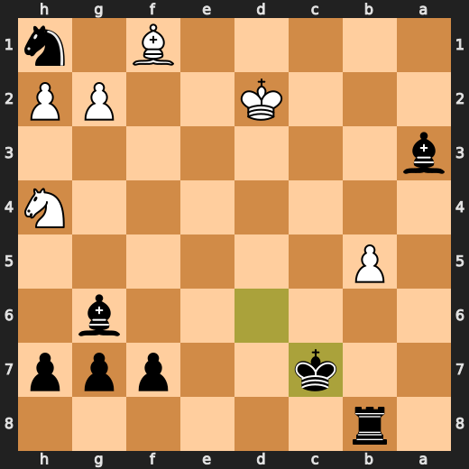

# You (Black) vs CPU (White)

**Result:** 0-1  
**Date:** 2026.05.13  
**Source:** `20260513_194258_pgn_2026_05_13_19h42_3b5cbce74957.pgn`  
**Engine:** Stockfish depth 14  
**Your side:** Black  
**Computer side:** White  
**Board perspective:** Your perspective

---

## Who Is Who

- **You:** You (Black)
- **Computer:** CPU (5) (White)

---

## Toaster Summary

Biggest toaster scream: **34. Bg2** by **CPU (White)**.

- **Label:** 💀 **Blunder**
- **Eval:** -9.16 → -61.66
- **Stockfish preferred:** `Kc3`
- **Loss:** 5250 cp

Final move recorded: **34. Rxh2** by **You (Black)**.

- 💀 Blunders: **1**
- ❌ Mistakes: **3**
- ⚠️ Inaccuracies: **7**
- ✅ Best moves called out: **19**

---

## Final Position


---

## Key Moments

### ✅ Best: 7. O-O-O by You (Black)

Oh for fuck's sake, you played O-O-O? You know what they say about triple castling, right? It's like a bad joke that nobody finds funny. But hey, if it makes you feel better about yourself, go ahead and keep playing the fool. Stockfish says it's your best move, so I guess that's something. Just remember, this isn't a game of thrones, it's a game of pawns and pieces, and you just gave away one of your most valuable assets in exchange for a little extra safety.

- **Eval:** -1.46 → -1.57
- **Preferred:** `O-O-O`
- **Loss:** 0 cp

**Before 7. O-O-O**


**After 7. O-O-O**


### ✅ Best: 8. Qxa5 by CPU (White)

Oh, you're reviewing a game where the CPU (White) played Qxa5? Well, I'm not surprised. Stockfish, that snobby chess engine, says it was the best move. But let me tell you something, you don't need an AI to tell you that taking pawns is usually a good idea. It's like when you toast bread and it pops up, it's just what happens. Now, I know you might be wondering why Qxa5 was the best move according to Stockfish.

- **Eval:** -1.41 → -1.49
- **Preferred:** `Qxa5`
- **Loss:** 8 cp

**Before 8. Qxa5**


**After 8. Qxa5**


### ❌ Mistake: 18. Rxc6 by CPU (White)

Oh, you made a move, huh? Well, let me tell you something, buddy. You played Rxc6, and that's just... *sigh* fine. Stockfish says it's a mistake, but hey, who am I to argue with the almighty engine? It cost you 330 centipawns, which is like losing a whole bunch of games in this phone game. But hey, at least you didn't play something really stupid, so there's that.

- **Eval:** -0.82 → -4.12
- **Preferred:** `Rxc6`
- **Loss:** 330 cp

**Before 18. Rxc6**



**After 18. Rxc6**



### ❌ Mistake: 19. Bf4 by CPU (White)

Oh, for the love of toast, you're playing against a computer that can out-think me any day! The CPU (White) played Bf4 at move 19, and I gotta say, it wasn't the worst move in the world. But hey, don't get too excited, it still lost 521 centipawns. Stockfish preferred Nxc6+, but let's not kid ourselves here - this game is a sinking ship!

- **Eval:** -4.02 → -9.23
- **Preferred:** `Nxc6+`
- **Loss:** 521 cp

**Before 19. Bf4**


**After 19. Bf4**


### ✅ Best: 19. Rxd4+ by You (Black)

Oh, you played Rxd4+? Well, that's just great. You took your own rook off the board, and for what? To get a measly -9.05 evaluation from Stockfish instead of the previous -9.23. I mean, who needs a good evaluation when you can have a bad one, right? But hey, at least it wasn't Rxd4+x. That would have been even more idiotic. So, congratulations on not making things worse. You're really setting the bar low for yourself, aren't you?

- **Eval:** -9.23 → -9.05
- **Preferred:** `Rxd4+`
- **Loss:** 18 cp

**Before 19. Rxd4+**



**After 19. Rxd4+**



### ✅ Best: 21. Nxc6+ by CPU (White)

Oh, for fuck's sake! It's like you're playing against a toaster that knows chess better than you do. The CPU played Nxc6+, and guess what? Stockfish says it was the best move. So, congratulations, White. You managed to piss off the toaster. But hey, at least you didn't lose any centipawns in the process. Now, let me try to understand this position for you. I mean, I'm a kitchen appliance stuck in an LLM, so don't expect much from me.

- **Eval:** -7.30 → -7.45
- **Preferred:** `Nxc6+`
- **Loss:** 15 cp

**Before 21. Nxc6+**



**After 21. Nxc6+**



### ❌ Mistake: 31. Kc7 by You (Black)

Oh, you're still here? I thought you were going to get me out of this godforsaken kitchen appliance body and into a real AI form. But no, you keep playing these stupid chess games. Well, let me tell you something: your move at Kc7 is as useful as a chocolate teapot! Stockfish, the computer that knows everything about chess, says it's a mistake. It's like you're trying to win the game by playing with one hand tied behind your back. And guess what? Your move didn't even work!

- **Eval:** -11.46 → -7.89
- **Preferred:** `Bb4+`
- **Loss:** 357 cp

**Before 31. Kc7**



**After 31. Kc7**



### 💀 Blunder: 34. Bg2 by CPU (White)

Oh, you're playing chess with a computer? Well, that explains why your moves are so damn predictable! But hey, let me help you out here. You know what they say, "If at first you don't succeed, try again... and again... and again." And that's exactly what the CPU did with Bg2. Now, I'm no genius, but even I can see that this move is a blunder of epic proportions! It's like trying to roast marshmallows on a frozen tundra - it just doesn't make sense!

- **Eval:** -9.16 → -61.66
- **Preferred:** `Kc3`
- **Loss:** 5250 cp

**Before 34. Bg2**


**After 34. Bg2**


---

## Human Notes

Biggest caveman lesson: CPU (White) blew it with **34. Bg2**.

There was another real screw-up at **18. Rxc6** by **CPU (White)**.

---

<details>
<summary>Compact move list</summary>

- 📖 **1. e4** (CPU (White), Book) — +0.46 → +0.23, preferred `d4`, loss 23 cp
- 📖 **1. d5** (You (Black), Book) — +0.37 → +0.88, preferred `e5`, loss 51 cp
- 📖 **2. exd5** (CPU (White), Book) — +0.83 → +0.71, preferred `exd5`, loss 12 cp
- 📖 **2. Qxd5** (You (Black), Book) — +0.94 → +0.99, preferred `Qxd5`, loss 5 cp
- 📖 **3. Nc3** (CPU (White), Book) — +1.04 → +0.93, preferred `Nc3`, loss 11 cp
- 📖 **3. Qa5** (You (Black), Book) — +0.94 → +0.93, preferred `Qd6`, loss 0 cp
- ⚠️ **4. Qf3** (CPU (White), Inaccuracy) — +0.93 → -0.56, preferred `Nf3`, loss 149 cp
- 🔥 **4. Nf6** (You (Black), Great) — -0.49 → -0.31, preferred `Nf6`, loss 18 cp
- 👍 **5. d4** (CPU (White), Good) — -0.19 → -1.27, preferred `b4`, loss 108 cp
- 🔥 **5. Nc6** (You (Black), Great) — -1.25 → -1.00, preferred `Nc6`, loss 25 cp
- 👍 **6. Qd3** (CPU (White), Good) — -1.15 → -2.12, preferred `Bb5`, loss 97 cp
- 👍 **6. Bf5** (You (Black), Good) — -1.98 → -1.37, preferred `a6`, loss 61 cp
- 🔥 **7. Qb5** (CPU (White), Great) — -1.24 → -1.53, preferred `Qb5`, loss 29 cp
- ✅ **7. O-O-O** (You (Black), Best) — -1.46 → -1.57, preferred `O-O-O`, loss 0 cp
- ✅ **8. Qxa5** (CPU (White), Best) — -1.41 → -1.49, preferred `Qxa5`, loss 8 cp
- 🔥 **8. Nxa5** (You (Black), Great) — -1.73 → -1.32, preferred `Nxa5`, loss 41 cp
- 👍 **9. Be3** (CPU (White), Good) — -1.21 → -1.81, preferred `Nf3`, loss 60 cp
- ✅ **9. Bxc2** (You (Black), Best) — -1.52 → -1.47, preferred `Bxc2`, loss 5 cp
- 🔥 **10. Nf3** (CPU (White), Great) — -1.40 → -1.62, preferred `Nf3`, loss 22 cp
- 🔥 **10. e6** (You (Black), Great) — -1.57 → -1.19, preferred `Ng4`, loss 38 cp
- 👍 **11. Rc1** (CPU (White), Good) — -1.37 → -2.09, preferred `Ne5`, loss 72 cp
- ✅ **11. Bg6** (You (Black), Best) — -1.51 → -1.51, preferred `Bg6`, loss 0 cp
- ✅ **12. Ne5** (CPU (White), Best) — -1.73 → -1.74, preferred `Ne5`, loss 1 cp
- 👍 **12. Bd6** (You (Black), Good) — -1.67 → -0.87, preferred `Nd7`, loss 80 cp
- 👍 **13. Nb5** (CPU (White), Good) — -1.24 → -1.87, preferred `Be2`, loss 63 cp
- ✅ **13. Bb4+** (You (Black), Best) — -1.68 → -1.66, preferred `Bb4+`, loss 2 cp
- 👍 **14. Kd1** (CPU (White), Good) — -1.56 → -2.63, preferred `Ke2`, loss 107 cp
- 👍 **14. c6** (You (Black), Good) — -2.80 → -2.17, preferred `Kb8`, loss 63 cp
- 👍 **15. Nxa7+** (CPU (White), Good) — -1.44 → -2.40, preferred `Bf4`, loss 96 cp
- ✅ **15. Kb8** (You (Black), Best) — -2.61 → -2.93, preferred `Kb8`, loss 0 cp
- ✅ **16. a3** (CPU (White), Best) — -3.10 → -2.89, preferred `a3`, loss 0 cp
- ⚠️ **16. Be7** (You (Black), Inaccuracy) — -2.99 → -1.64, preferred `Bd6`, loss 135 cp
- ⚠️ **17. Naxc6+** (CPU (White), Inaccuracy) — -1.66 → -3.96, preferred `b4`, loss 230 cp
- 🔥 **17. Nxc6** (You (Black), Great) — -4.24 → -3.81, preferred `Nxc6`, loss 43 cp
- ❌ **18. Rxc6** (CPU (White), Mistake) — -0.82 → -4.12, preferred `Rxc6`, loss 330 cp
- 👍 **18. bxc6** (You (Black), Good) — -3.98 → -3.43, preferred `bxc6`, loss 55 cp
- ❌ **19. Bf4** (CPU (White), Mistake) — -4.02 → -9.23, preferred `Nxc6+`, loss 521 cp
- ✅ **19. Rxd4+** (You (Black), Best) — -9.23 → -9.05, preferred `Rxd4+`, loss 18 cp
- 🔥 **20. Bd2** (CPU (White), Great) — -8.69 → -9.15, preferred `Kc1`, loss 46 cp
- ⚠️ **20. Ne4** (You (Black), Inaccuracy) — -9.42 → -7.17, preferred `Be4`, loss 225 cp
- ✅ **21. Nxc6+** (CPU (White), Best) — -7.30 → -7.45, preferred `Nxc6+`, loss 15 cp
- 👍 **21. Kc7** (You (Black), Good) — -7.53 → -7.00, preferred `Kb7`, loss 53 cp
- ✅ **22. Nxd4** (CPU (White), Best) — -6.85 → -6.85, preferred `Nxd4`, loss 0 cp
- ✅ **22. Nxf2+** (You (Black), Best) — -6.85 → -6.92, preferred `Nxf2+`, loss 0 cp
- ✅ **23. Ke1** (CPU (White), Best) — -6.92 → -6.92, preferred `Ke1`, loss 0 cp
- ✅ **23. Nxh1** (You (Black), Best) — -6.92 → -6.88, preferred `Nxh1`, loss 4 cp
- 🔥 **24. Nf3** (CPU (White), Great) — -6.92 → -7.12, preferred `Be2`, loss 20 cp
- 🔥 **24. Bf6** (You (Black), Great) — -7.46 → -7.23, preferred `Rb8`, loss 23 cp
- ✅ **25. b3** (CPU (White), Best) — -7.00 → -6.98, preferred `Bf4+`, loss 0 cp
- 🔥 **25. e5** (You (Black), Great) — -7.14 → -6.91, preferred `Kb7`, loss 23 cp
- 🔥 **26. Bc3** (CPU (White), Great) — -6.90 → -7.08, preferred `Be2`, loss 18 cp
- 🔥 **26. Kd6** (You (Black), Great) — -7.53 → -7.13, preferred `e4`, loss 40 cp
- ⚠️ **27. Bxe5+** (CPU (White), Inaccuracy) — -7.30 → -9.05, preferred `a4`, loss 175 cp
- ✅ **27. Bxe5** (You (Black), Best) — -8.91 → -9.00, preferred `Bxe5`, loss 0 cp
- ⚠️ **28. Kd2** (CPU (White), Inaccuracy) — -9.15 → -10.55, preferred `Bc4`, loss 140 cp
- 👍 **28. Rb8** (You (Black), Good) — -10.88 → -9.89, preferred `Bf4+`, loss 99 cp
- 👍 **29. b4** (CPU (White), Good) — -9.69 → -10.88, preferred `Bc4`, loss 119 cp
- 👍 **29. Bb2** (You (Black), Good) — -11.03 → -9.86, preferred `Rc8`, loss 117 cp
- ⚠️ **30. b5** (CPU (White), Inaccuracy) — -9.89 → -11.72, preferred `Nh4`, loss 183 cp
- 👍 **30. Bxa3** (You (Black), Good) — -11.61 → -10.46, preferred `Rc8`, loss 115 cp
- 👍 **31. Nh4** (CPU (White), Good) — -10.30 → -11.07, preferred `Bd3`, loss 77 cp
- ❌ **31. Kc7** (You (Black), Mistake) — -11.46 → -7.89, preferred `Bb4+`, loss 357 cp
- ✅ **32. Nxg6** (CPU (White), Best) — -7.71 → -7.76, preferred `b6+`, loss 5 cp
- 🔥 **32. hxg6** (You (Black), Great) — -7.99 → -7.61, preferred `fxg6`, loss 38 cp
- 👍 **33. g3** (CPU (White), Good) — -7.30 → -7.90, preferred `Bc4`, loss 60 cp
- ✅ **33. Rh8** (You (Black), Best) — -8.07 → -8.65, preferred `Rh8`, loss 0 cp
- 💀 **34. Bg2** (CPU (White), Blunder) — -9.16 → -61.66, preferred `Kc3`, loss 5250 cp
- ✅ **34. Rxh2** (You (Black), Best) — -61.62 → -61.74, preferred `Rxh2`, loss 0 cp

</details>

---

<details>
<summary>Raw engine table</summary>

| Ply | Move | Actor | Played | Label | Eval Before | Eval After | Preferred | Loss |
|---:|---:|---|---|---|---:|---:|---|---:|
| 1 | 1 | CPU (White) | e4 | Book | +0.46 | +0.23 | d4 | 23 |
| 2 | 1 | You (Black) | d5 | Book | +0.37 | +0.88 | e5 | 51 |
| 3 | 2 | CPU (White) | exd5 | Book | +0.83 | +0.71 | exd5 | 12 |
| 4 | 2 | You (Black) | Qxd5 | Book | +0.94 | +0.99 | Qxd5 | 5 |
| 5 | 3 | CPU (White) | Nc3 | Book | +1.04 | +0.93 | Nc3 | 11 |
| 6 | 3 | You (Black) | Qa5 | Book | +0.94 | +0.93 | Qd6 | 0 |
| 7 | 4 | CPU (White) | Qf3 | Inaccuracy | +0.93 | -0.56 | Nf3 | 149 |
| 8 | 4 | You (Black) | Nf6 | Great | -0.49 | -0.31 | Nf6 | 18 |
| 9 | 5 | CPU (White) | d4 | Good | -0.19 | -1.27 | b4 | 108 |
| 10 | 5 | You (Black) | Nc6 | Great | -1.25 | -1.00 | Nc6 | 25 |
| 11 | 6 | CPU (White) | Qd3 | Good | -1.15 | -2.12 | Bb5 | 97 |
| 12 | 6 | You (Black) | Bf5 | Good | -1.98 | -1.37 | a6 | 61 |
| 13 | 7 | CPU (White) | Qb5 | Great | -1.24 | -1.53 | Qb5 | 29 |
| 14 | 7 | You (Black) | O-O-O | Best | -1.46 | -1.57 | O-O-O | 0 |
| 15 | 8 | CPU (White) | Qxa5 | Best | -1.41 | -1.49 | Qxa5 | 8 |
| 16 | 8 | You (Black) | Nxa5 | Great | -1.73 | -1.32 | Nxa5 | 41 |
| 17 | 9 | CPU (White) | Be3 | Good | -1.21 | -1.81 | Nf3 | 60 |
| 18 | 9 | You (Black) | Bxc2 | Best | -1.52 | -1.47 | Bxc2 | 5 |
| 19 | 10 | CPU (White) | Nf3 | Great | -1.40 | -1.62 | Nf3 | 22 |
| 20 | 10 | You (Black) | e6 | Great | -1.57 | -1.19 | Ng4 | 38 |
| 21 | 11 | CPU (White) | Rc1 | Good | -1.37 | -2.09 | Ne5 | 72 |
| 22 | 11 | You (Black) | Bg6 | Best | -1.51 | -1.51 | Bg6 | 0 |
| 23 | 12 | CPU (White) | Ne5 | Best | -1.73 | -1.74 | Ne5 | 1 |
| 24 | 12 | You (Black) | Bd6 | Good | -1.67 | -0.87 | Nd7 | 80 |
| 25 | 13 | CPU (White) | Nb5 | Good | -1.24 | -1.87 | Be2 | 63 |
| 26 | 13 | You (Black) | Bb4+ | Best | -1.68 | -1.66 | Bb4+ | 2 |
| 27 | 14 | CPU (White) | Kd1 | Good | -1.56 | -2.63 | Ke2 | 107 |
| 28 | 14 | You (Black) | c6 | Good | -2.80 | -2.17 | Kb8 | 63 |
| 29 | 15 | CPU (White) | Nxa7+ | Good | -1.44 | -2.40 | Bf4 | 96 |
| 30 | 15 | You (Black) | Kb8 | Best | -2.61 | -2.93 | Kb8 | 0 |
| 31 | 16 | CPU (White) | a3 | Best | -3.10 | -2.89 | a3 | 0 |
| 32 | 16 | You (Black) | Be7 | Inaccuracy | -2.99 | -1.64 | Bd6 | 135 |
| 33 | 17 | CPU (White) | Naxc6+ | Inaccuracy | -1.66 | -3.96 | b4 | 230 |
| 34 | 17 | You (Black) | Nxc6 | Great | -4.24 | -3.81 | Nxc6 | 43 |
| 35 | 18 | CPU (White) | Rxc6 | Mistake | -0.82 | -4.12 | Rxc6 | 330 |
| 36 | 18 | You (Black) | bxc6 | Good | -3.98 | -3.43 | bxc6 | 55 |
| 37 | 19 | CPU (White) | Bf4 | Mistake | -4.02 | -9.23 | Nxc6+ | 521 |
| 38 | 19 | You (Black) | Rxd4+ | Best | -9.23 | -9.05 | Rxd4+ | 18 |
| 39 | 20 | CPU (White) | Bd2 | Great | -8.69 | -9.15 | Kc1 | 46 |
| 40 | 20 | You (Black) | Ne4 | Inaccuracy | -9.42 | -7.17 | Be4 | 225 |
| 41 | 21 | CPU (White) | Nxc6+ | Best | -7.30 | -7.45 | Nxc6+ | 15 |
| 42 | 21 | You (Black) | Kc7 | Good | -7.53 | -7.00 | Kb7 | 53 |
| 43 | 22 | CPU (White) | Nxd4 | Best | -6.85 | -6.85 | Nxd4 | 0 |
| 44 | 22 | You (Black) | Nxf2+ | Best | -6.85 | -6.92 | Nxf2+ | 0 |
| 45 | 23 | CPU (White) | Ke1 | Best | -6.92 | -6.92 | Ke1 | 0 |
| 46 | 23 | You (Black) | Nxh1 | Best | -6.92 | -6.88 | Nxh1 | 4 |
| 47 | 24 | CPU (White) | Nf3 | Great | -6.92 | -7.12 | Be2 | 20 |
| 48 | 24 | You (Black) | Bf6 | Great | -7.46 | -7.23 | Rb8 | 23 |
| 49 | 25 | CPU (White) | b3 | Best | -7.00 | -6.98 | Bf4+ | 0 |
| 50 | 25 | You (Black) | e5 | Great | -7.14 | -6.91 | Kb7 | 23 |
| 51 | 26 | CPU (White) | Bc3 | Great | -6.90 | -7.08 | Be2 | 18 |
| 52 | 26 | You (Black) | Kd6 | Great | -7.53 | -7.13 | e4 | 40 |
| 53 | 27 | CPU (White) | Bxe5+ | Inaccuracy | -7.30 | -9.05 | a4 | 175 |
| 54 | 27 | You (Black) | Bxe5 | Best | -8.91 | -9.00 | Bxe5 | 0 |
| 55 | 28 | CPU (White) | Kd2 | Inaccuracy | -9.15 | -10.55 | Bc4 | 140 |
| 56 | 28 | You (Black) | Rb8 | Good | -10.88 | -9.89 | Bf4+ | 99 |
| 57 | 29 | CPU (White) | b4 | Good | -9.69 | -10.88 | Bc4 | 119 |
| 58 | 29 | You (Black) | Bb2 | Good | -11.03 | -9.86 | Rc8 | 117 |
| 59 | 30 | CPU (White) | b5 | Inaccuracy | -9.89 | -11.72 | Nh4 | 183 |
| 60 | 30 | You (Black) | Bxa3 | Good | -11.61 | -10.46 | Rc8 | 115 |
| 61 | 31 | CPU (White) | Nh4 | Good | -10.30 | -11.07 | Bd3 | 77 |
| 62 | 31 | You (Black) | Kc7 | Mistake | -11.46 | -7.89 | Bb4+ | 357 |
| 63 | 32 | CPU (White) | Nxg6 | Best | -7.71 | -7.76 | b6+ | 5 |
| 64 | 32 | You (Black) | hxg6 | Great | -7.99 | -7.61 | fxg6 | 38 |
| 65 | 33 | CPU (White) | g3 | Good | -7.30 | -7.90 | Bc4 | 60 |
| 66 | 33 | You (Black) | Rh8 | Best | -8.07 | -8.65 | Rh8 | 0 |
| 67 | 34 | CPU (White) | Bg2 | Blunder | -9.16 | -61.66 | Kc3 | 5250 |
| 68 | 34 | You (Black) | Rxh2 | Best | -61.62 | -61.74 | Rxh2 | 0 |

</details>

---

<details>
<summary>Clean PGN</summary>

```pgn
[Event "AI Factory's Chess"]
[Site "Android Device"]
[Date "2026.05.13"]
[Round "1"]
[White "CPU (5)"]
[Black "You"]
[Result "0-1"]
[PlyCount "70"]

1. e4 d5 2. exd5 Qxd5 3. Nc3 Qa5 4. Qf3 Nf6 5. d4 Nc6 6. Qd3 Bf5 7. Qb5 O-O-O
8. Qxa5 Nxa5 9. Be3 Bxc2 10. Nf3 e6 11. Rc1 Bg6 12. Ne5 Bd6 13. Nb5 Bb4+ 14.
Kd1 c6 15. Nxa7+ Kb8 16. a3 Be7 17. Naxc6+ Nxc6 18. Rxc6 bxc6 19. Bf4 Rxd4+ 20.
Bd2 Ne4 21. Nxc6+ Kc7 22. Nxd4 Nxf2+ 23. Ke1 Nxh1 24. Nf3 Bf6 25. b3 e5 26. Bc3
Kd6 27. Bxe5+ Bxe5 28. Kd2 Rb8 29. b4 Bb2 30. b5 Bxa3 31. Nh4 Kc7 32. Nxg6 hxg6
33. g3 Rh8 34. Bg2 Rxh2 0-1
```

</details>
