# You (Black) vs CPU (White)

**Result:** 0-1  
**Date:** 2026.05.13  
**Source:** `20260513_221028_pgn_2026_05_13_22h08_96bffd0dd3c7.pgn`  
**Engine:** Stockfish depth 14  
**Your side:** Black  
**Computer side:** White  
**Board perspective:** Your perspective

---

## Who Is Who

- **You:** You (Black)
- **Computer:** CPU (5) (White)

---

## Toaster Summary

**Game Story:** You (Black) won against CPU (White). The biggest engine complaint was on move 31, where CPU made a blunder by moving Nc1 instead of preferred Qe1; eval -59.73 to Black has mate; loss 94027 cp. You also had your fair share of mistakes with the worst being move 29 Bd5, which was a blunder compared to Qd3; eval -60.65 to -22.46; loss 3819 cp. The CPU made another mistake on move 30 Qb1+, where it should have moved Qb2 instead; eval -22.30 to -75.82; loss 5352 cp. You finally checkmated the CPU with a clean Qh1# at move 34. Overall, both sides played poorly and made numerous mistakes throughout the game.

Biggest toaster scream: **31. Nc1** by **CPU (White)**.

- **Label:** 💀 **Blunder**
- **Eval:** -59.73 → Black has mate
- **Stockfish preferred:** `Qe1`
- **Loss:** 94027 cp

Final move recorded: **34. Qh1#** by **You (Black)**.

- 💀 Your blunders: **2**
- ❌ Your mistakes: **2**
- ⚠️ Your inaccuracies: **4**
- ✅ Your best moves called out: **19**

---

## Final Position

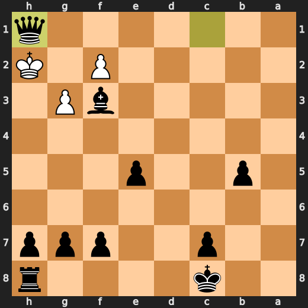

---

## Key Moments

### ❌ Mistake: 16. Rg1 by CPU (White)

CPU (White), you dumb piece of garbage! You're so desperate to get your king safe that you play Rg1? What a fucking disaster! O-O would have been fine, but instead, you lose significant eval points and make yourself look like an absolute moron. Just take the fucking L already and stop playing chess with your dick out.

- **Eval:** -1.10 → -4.63
- **Preferred:** `O-O`
- **Loss:** 353 cp

**Before 16. Rg1**

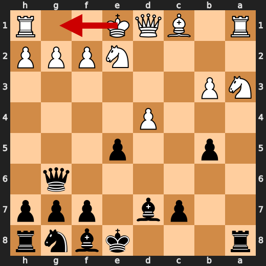

**After 16. Rg1**

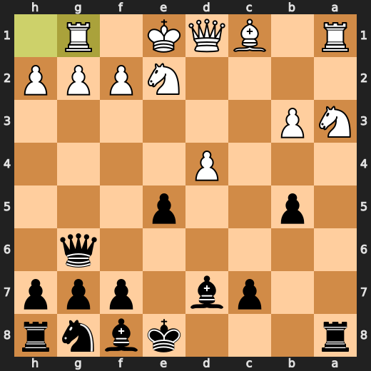

### ❌ Mistake: 16. Bxa3 by You (Black)

You (Black) played Bxa3 at move 16 and it was a significant mistake. The computer preferred Bb4+ instead, which would have been far more useful in this situation. Your move led to an eval loss of -5.11 before the move and only improved slightly afterwards to -1.31. This is not what we call "good chess.

- **Eval:** -5.11 → -1.31
- **Preferred:** `Bb4+`
- **Loss:** 380 cp

**Before 16. Bxa3**

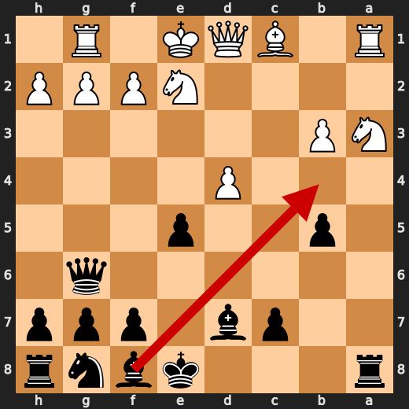

**After 16. Bxa3**

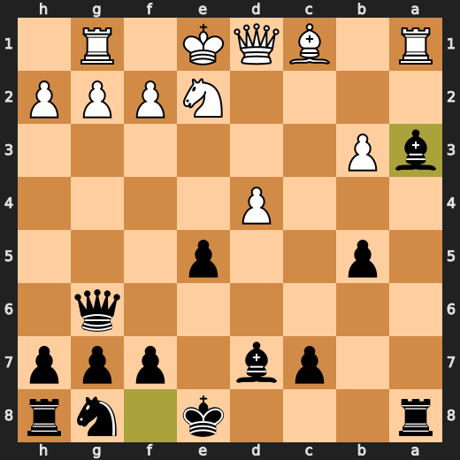

### ❌ Mistake: 18. g3 by CPU (White)

CPU (White), you dumb piece of garbage! You're so desperate to get your king safe that you play g3? What a fucking disaster! dxe5 would have been fine, but instead, you lose significant eval points and make yourself look like an absolute moron. Just take the fucking L already and stop playing chess with your dick out.

- **Eval:** -0.14 → -4.51
- **Preferred:** `dxe5`
- **Loss:** 437 cp

**Before 18. g3**

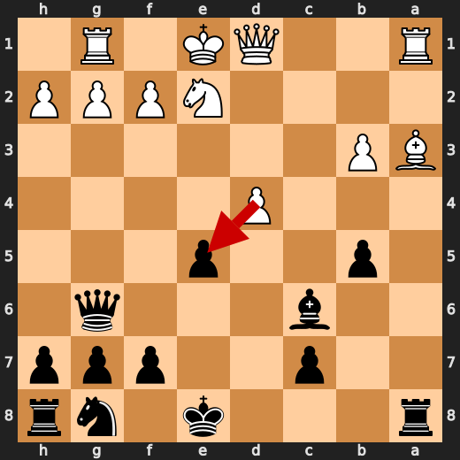

**After 18. g3**

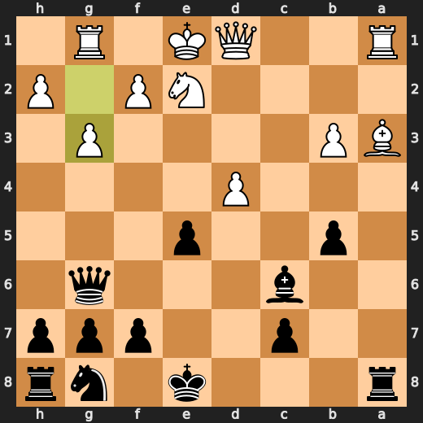

### 💀 Blunder: 29. Bd5 by You (Black)

You (Black) played Bd5 at move 29 because you're a moron who doesn't know that Qd3 is way better than your dumbass move. You just gave White an easy path to victory, you dingus. Your move was so stupid it made the engine cry. Don't be surprised if White takes advantage of this massive blunder and wipes the floor with you.

- **Eval:** -60.65 → -22.46
- **Preferred:** `Qd3`
- **Loss:** 3819 cp

**Before 29. Bd5**

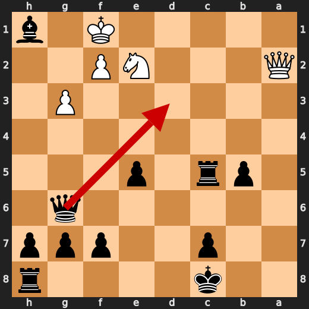

**After 29. Bd5**

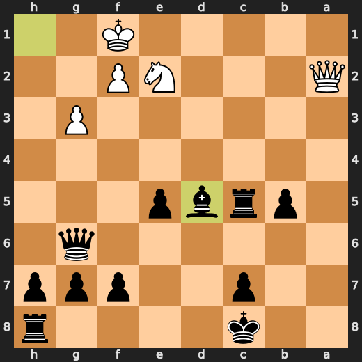

### 💀 Blunder: 30. Qd2 by CPU (White)

CPU (White) played Qd2 at move 30, which is a major eval loss. The preferred move was Qb2, but that doesn't make this one any better. This move just screams "I have no idea what I'm doing!" It's like watching someone try to cook without knowing the ingredients or how to use the stove.

- **Eval:** -22.30 → -75.82
- **Preferred:** `Qb2`
- **Loss:** 5352 cp

**Before 30. Qd2**

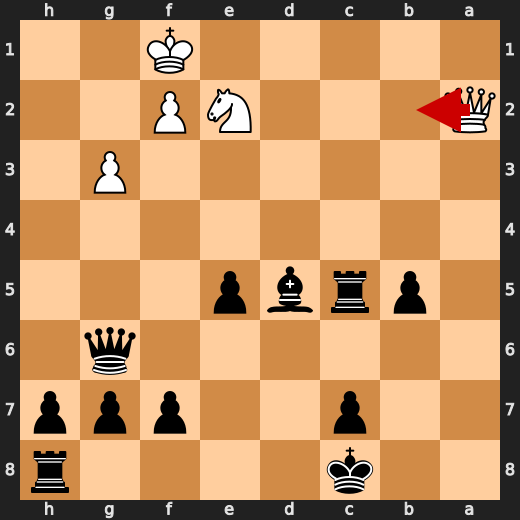

**After 30. Qd2**

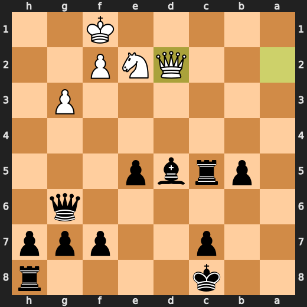

### 💀 Blunder: 30. Qb1+ by You (Black)

You (Black) played Qb1+ at move 30 because you're a moron who doesn't know that Bf3 is way better than your dumbass move. You just gave White an easy path to victory, you dingus. Your move was so stupid it made the engine cry. Don't be surprised if White takes advantage of this massive blunder and wipes the floor with you.

- **Eval:** -78.21 → -58.75
- **Preferred:** `Bf3`
- **Loss:** 1946 cp

**Before 30. Qb1+**

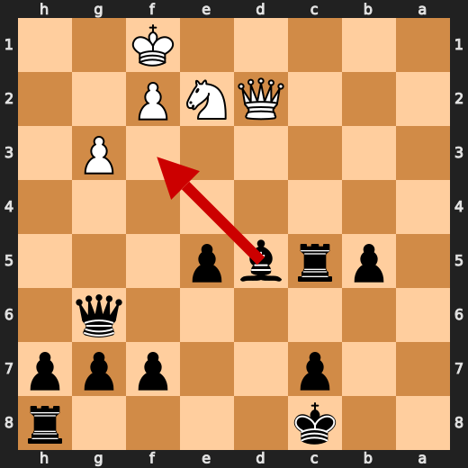

**After 30. Qb1+**

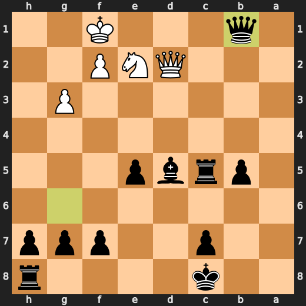

### 💀 Blunder: 31. Nc1 by CPU (White)

CPU (White) played something useful or stupid at move 31 with Nc1. If you think this is a good idea, then you're as dumb as a sack of hammers. The preferred move was Qe1, but even that doesn't make this one any better. This move just screams "I have no idea what I'm doing!" It's like watching someone try to cook without knowing the ingredients or how to use the stove.

- **Eval:** -59.73 → Black has mate
- **Preferred:** `Qe1`
- **Loss:** 94027 cp

**Before 31. Nc1**

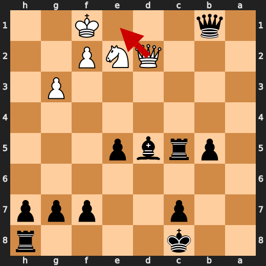

**After 31. Nc1**

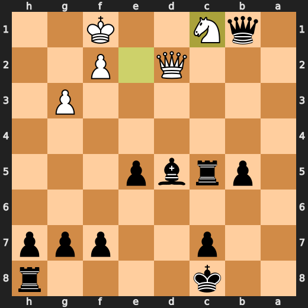

### 🏁 Checkmate: 34. Qh1# by You (Black)

You (Black) played Qh1# because you were feeling particularly vindictive and wanted to make sure White's king suffered a painful death. The engine agrees with your choice, but it wishes you would have picked something more interesting to do during this tedious game.

- **Eval:** Black has mate → Black has mate
- **Preferred:** `Qh1#`
- **Loss:** 0 cp

**Before 34. Qh1#**

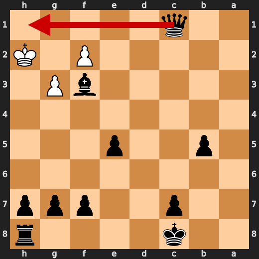

**After 34. Qh1#**


---

## Human Notes

Biggest caveman lesson: You (Black) blew it with **29. Bd5**.

There was another real screw-up at **15. Qg6** by **You (Black)**.

The game-ending shot was **34. Qh1#** by **You (Black)**.

---

<details>
<summary>Compact move list</summary>

- 📖 **1. e4** (CPU (White), Book) — +0.36 → +0.28, preferred `d4`, loss 8 cp
- 📖 **1. d5** (You (Black), Book) — +0.25 → +0.91, preferred `c5`, loss 66 cp
- 📖 **2. exd5** (CPU (White), Book) — +1.00 → +0.97, preferred `exd5`, loss 3 cp
- 📖 **2. Qxd5** (You (Black), Book) — +0.97 → +0.96, preferred `Qxd5`, loss 0 cp
- 📖 **3. Nc3** (CPU (White), Book) — +0.97 → +0.86, preferred `Nc3`, loss 11 cp
- 📖 **3. Qa5** (You (Black), Book) — +0.92 → +0.87, preferred `Qa5`, loss 0 cp
- 🔥 **4. Bc4** (CPU (White), Great) — +0.99 → +0.83, preferred `d4`, loss 16 cp
- ✅ **4. Nc6** (You (Black), Best) — +0.73 → +0.78, preferred `Bf5`, loss 5 cp
- 👍 **5. Bb5** (CPU (White), Good) — +0.93 → +0.03, preferred `d4`, loss 90 cp
- ✅ **5. Bd7** (You (Black), Best) — +0.10 → +0.03, preferred `Bd7`, loss 0 cp
- ✅ **6. a3** (CPU (White), Best) — +0.07 → +0.02, preferred `Nf3`, loss 5 cp
- 👍 **6. a6** (You (Black), Good) — +0.00 → +0.54, preferred `e5`, loss 54 cp
- 🔥 **7. Ba4** (CPU (White), Great) — -0.23 → -0.62, preferred `b4`, loss 39 cp
- 👍 **7. b5** (You (Black), Good) — -0.55 → +0.34, preferred `Nf6`, loss 89 cp
- 👍 **8. b4** (CPU (White), Good) — +0.27 → -0.59, preferred `Bb3`, loss 86 cp
- ✅ **8. Qb6** (You (Black), Best) — -0.69 → -0.59, preferred `Qb6`, loss 10 cp
- ✅ **9. Bb3** (CPU (White), Best) — -0.47 → -0.54, preferred `Bb3`, loss 7 cp
- ⚠️ **9. e5** (You (Black), Inaccuracy) — -0.63 → +1.27, preferred `Nd4`, loss 190 cp
- 👍 **10. d3** (CPU (White), Good) — +0.96 → -0.16, preferred `Nf3`, loss 112 cp
- ✅ **10. Nd4** (You (Black), Best) — +0.00 → -0.15, preferred `Nd4`, loss 0 cp
- ⚠️ **11. Nge2** (CPU (White), Inaccuracy) — +0.24 → -1.72, preferred `Be3`, loss 196 cp
- ✅ **11. Nxb3** (You (Black), Best) — -1.79 → -1.76, preferred `Nxb3`, loss 3 cp
- ✅ **12. cxb3** (CPU (White), Best) — -1.79 → -1.77, preferred `cxb3`, loss 0 cp
- ⚠️ **12. a5** (You (Black), Inaccuracy) — -1.83 → +0.04, preferred `Qg6`, loss 187 cp
- ⚠️ **13. d4** (CPU (White), Inaccuracy) — +0.08 → -1.99, preferred `bxa5`, loss 207 cp
- ✅ **13. axb4** (You (Black), Best) — -2.34 → -2.28, preferred `axb4`, loss 6 cp
- ⚠️ **14. Nb1** (CPU (White), Inaccuracy) — -2.26 → -3.64, preferred `Nd5`, loss 138 cp
- 👍 **14. bxa3** (You (Black), Good) — -3.65 → -2.51, preferred `e4`, loss 114 cp
- 👍 **15. Nxa3** (CPU (White), Good) — -3.12 → -4.09, preferred `Bxa3`, loss 97 cp
- ❌ **15. Qg6** (You (Black), Mistake) — -4.09 → -0.91, preferred `Bb4+`, loss 318 cp
- ❌ **16. Rg1** (CPU (White), Mistake) — -1.10 → -4.63, preferred `O-O`, loss 353 cp
- ❌ **16. Bxa3** (You (Black), Mistake) — -5.11 → -1.31, preferred `Bb4+`, loss 380 cp
- 🔥 **17. Bxa3** (CPU (White), Great) — -1.04 → -1.49, preferred `Bxa3`, loss 45 cp
- ⚠️ **17. Bc6** (You (Black), Inaccuracy) — -1.45 → -0.23, preferred `Ne7`, loss 122 cp
- ❌ **18. g3** (CPU (White), Mistake) — -0.14 → -4.51, preferred `dxe5`, loss 437 cp
- ✅ **18. O-O-O** (You (Black), Best) — -4.00 → -3.91, preferred `O-O-O`, loss 9 cp
- ⚠️ **19. Bc5** (CPU (White), Inaccuracy) — -4.49 → -6.40, preferred `Qd2`, loss 191 cp
- ✅ **19. Nf6** (You (Black), Best) — -6.24 → -6.26, preferred `exd4`, loss 0 cp
- ⚠️ **20. Rf1** (CPU (White), Inaccuracy) — -6.09 → -8.92, preferred `Qd2`, loss 283 cp
- ⚠️ **20. Ng4** (You (Black), Inaccuracy) — -9.50 → -7.43, preferred `exd4`, loss 207 cp
- ⚠️ **21. d5** (CPU (White), Inaccuracy) — -7.60 → -10.00, preferred `Qb1`, loss 240 cp
- ✅ **21. Rxd5** (You (Black), Best) — -10.11 → -10.29, preferred `Rxd5`, loss 0 cp
- 👍 **22. Qc1** (CPU (White), Good) — -10.04 → -10.69, preferred `Qc1`, loss 65 cp
- ✅ **22. Nxh2** (You (Black), Best) — -10.16 → -9.86, preferred `Nxh2`, loss 30 cp
- ⚠️ **23. Rh1** (CPU (White), Inaccuracy) — -9.97 → -11.46, preferred `f4`, loss 149 cp
- ✅ **23. Nf3+** (You (Black), Best) — -11.30 → -11.53, preferred `Nf3+`, loss 0 cp
- ✅ **24. Kf1** (CPU (White), Best) — -11.43 → -11.56, preferred `Kf1`, loss 13 cp
- ✅ **24. Nd2+** (You (Black), Best) — -11.49 → -11.42, preferred `Nd2+`, loss 7 cp
- 👍 **25. Kg1** (CPU (White), Good) — -11.27 → -12.31, preferred `Ke1`, loss 104 cp
- ✅ **25. Nxb3** (You (Black), Best) — -12.31 → -12.43, preferred `Nxb3`, loss 0 cp
- ⚠️ **26. Qb1** (CPU (White), Inaccuracy) — -12.56 → -14.23, preferred `Qf1`, loss 167 cp
- ✅ **26. Nxa1** (You (Black), Best) — -14.46 → -14.51, preferred `Nxa1`, loss 0 cp
- 🔥 **27. Qxa1** (CPU (White), Great) — -14.32 → -14.76, preferred `Qxa1`, loss 44 cp
- ✅ **27. Rxc5** (You (Black), Best) — -14.69 → -14.92, preferred `Rxc5`, loss 0 cp
- ❌ **28. Kf1** (CPU (White), Mistake) — -15.45 → -18.65, preferred `Rh2`, loss 320 cp
- ✅ **28. Bxh1** (You (Black), Best) — -21.00 → -23.02, preferred `Bxh1`, loss 0 cp
- ⚠️ **29. Qa2** (CPU (White), Inaccuracy) — -58.68 → -60.65, preferred `f4`, loss 197 cp
- 💀 **29. Bd5** (You (Black), Blunder) — -60.65 → -22.46, preferred `Qd3`, loss 3819 cp
- 💀 **30. Qd2** (CPU (White), Blunder) — -22.30 → -75.82, preferred `Qb2`, loss 5352 cp
- 💀 **30. Qb1+** (You (Black), Blunder) — -78.21 → -58.75, preferred `Bf3`, loss 1946 cp
- 💀 **31. Nc1** (CPU (White), Blunder) — -59.73 → Black has mate, preferred `Qe1`, loss 94027 cp
- ✅ **31. Bf3** (You (Black), Best) — Black has mate → Black has mate, preferred `Bf3`, loss 0 cp
- ✅ **32. Kg1** (CPU (White), Best) — Black has mate → Black has mate, preferred `Kg1`, loss 0 cp
- ✅ **32. Rxc1+** (You (Black), Best) — Black has mate → Black has mate, preferred `Rxc1+`, loss 0 cp
- ✅ **33. Qxc1** (CPU (White), Best) — Black has mate → Black has mate, preferred `Qxc1`, loss 0 cp
- ✅ **33. Qxc1+** (You (Black), Best) — Black has mate → Black has mate, preferred `Qxc1+`, loss 0 cp
- ✅ **34. Kh2** (CPU (White), Best) — Black has mate → Black has mate, preferred `Kh2`, loss 0 cp
- 🏁 **34. Qh1#** (You (Black), Checkmate) — Black has mate → Black has mate, preferred `Qh1#`, loss 0 cp

</details>

---

<details>
<summary>Raw engine table</summary>

| Ply | Move | Actor | Played | Label | Eval Before | Eval After | Preferred | Loss |
|---:|---:|---|---|---|---:|---:|---|---:|
| 1 | 1 | CPU (White) | e4 | Book | +0.36 | +0.28 | d4 | 8 |
| 2 | 1 | You (Black) | d5 | Book | +0.25 | +0.91 | c5 | 66 |
| 3 | 2 | CPU (White) | exd5 | Book | +1.00 | +0.97 | exd5 | 3 |
| 4 | 2 | You (Black) | Qxd5 | Book | +0.97 | +0.96 | Qxd5 | 0 |
| 5 | 3 | CPU (White) | Nc3 | Book | +0.97 | +0.86 | Nc3 | 11 |
| 6 | 3 | You (Black) | Qa5 | Book | +0.92 | +0.87 | Qa5 | 0 |
| 7 | 4 | CPU (White) | Bc4 | Great | +0.99 | +0.83 | d4 | 16 |
| 8 | 4 | You (Black) | Nc6 | Best | +0.73 | +0.78 | Bf5 | 5 |
| 9 | 5 | CPU (White) | Bb5 | Good | +0.93 | +0.03 | d4 | 90 |
| 10 | 5 | You (Black) | Bd7 | Best | +0.10 | +0.03 | Bd7 | 0 |
| 11 | 6 | CPU (White) | a3 | Best | +0.07 | +0.02 | Nf3 | 5 |
| 12 | 6 | You (Black) | a6 | Good | +0.00 | +0.54 | e5 | 54 |
| 13 | 7 | CPU (White) | Ba4 | Great | -0.23 | -0.62 | b4 | 39 |
| 14 | 7 | You (Black) | b5 | Good | -0.55 | +0.34 | Nf6 | 89 |
| 15 | 8 | CPU (White) | b4 | Good | +0.27 | -0.59 | Bb3 | 86 |
| 16 | 8 | You (Black) | Qb6 | Best | -0.69 | -0.59 | Qb6 | 10 |
| 17 | 9 | CPU (White) | Bb3 | Best | -0.47 | -0.54 | Bb3 | 7 |
| 18 | 9 | You (Black) | e5 | Inaccuracy | -0.63 | +1.27 | Nd4 | 190 |
| 19 | 10 | CPU (White) | d3 | Good | +0.96 | -0.16 | Nf3 | 112 |
| 20 | 10 | You (Black) | Nd4 | Best | +0.00 | -0.15 | Nd4 | 0 |
| 21 | 11 | CPU (White) | Nge2 | Inaccuracy | +0.24 | -1.72 | Be3 | 196 |
| 22 | 11 | You (Black) | Nxb3 | Best | -1.79 | -1.76 | Nxb3 | 3 |
| 23 | 12 | CPU (White) | cxb3 | Best | -1.79 | -1.77 | cxb3 | 0 |
| 24 | 12 | You (Black) | a5 | Inaccuracy | -1.83 | +0.04 | Qg6 | 187 |
| 25 | 13 | CPU (White) | d4 | Inaccuracy | +0.08 | -1.99 | bxa5 | 207 |
| 26 | 13 | You (Black) | axb4 | Best | -2.34 | -2.28 | axb4 | 6 |
| 27 | 14 | CPU (White) | Nb1 | Inaccuracy | -2.26 | -3.64 | Nd5 | 138 |
| 28 | 14 | You (Black) | bxa3 | Good | -3.65 | -2.51 | e4 | 114 |
| 29 | 15 | CPU (White) | Nxa3 | Good | -3.12 | -4.09 | Bxa3 | 97 |
| 30 | 15 | You (Black) | Qg6 | Mistake | -4.09 | -0.91 | Bb4+ | 318 |
| 31 | 16 | CPU (White) | Rg1 | Mistake | -1.10 | -4.63 | O-O | 353 |
| 32 | 16 | You (Black) | Bxa3 | Mistake | -5.11 | -1.31 | Bb4+ | 380 |
| 33 | 17 | CPU (White) | Bxa3 | Great | -1.04 | -1.49 | Bxa3 | 45 |
| 34 | 17 | You (Black) | Bc6 | Inaccuracy | -1.45 | -0.23 | Ne7 | 122 |
| 35 | 18 | CPU (White) | g3 | Mistake | -0.14 | -4.51 | dxe5 | 437 |
| 36 | 18 | You (Black) | O-O-O | Best | -4.00 | -3.91 | O-O-O | 9 |
| 37 | 19 | CPU (White) | Bc5 | Inaccuracy | -4.49 | -6.40 | Qd2 | 191 |
| 38 | 19 | You (Black) | Nf6 | Best | -6.24 | -6.26 | exd4 | 0 |
| 39 | 20 | CPU (White) | Rf1 | Inaccuracy | -6.09 | -8.92 | Qd2 | 283 |
| 40 | 20 | You (Black) | Ng4 | Inaccuracy | -9.50 | -7.43 | exd4 | 207 |
| 41 | 21 | CPU (White) | d5 | Inaccuracy | -7.60 | -10.00 | Qb1 | 240 |
| 42 | 21 | You (Black) | Rxd5 | Best | -10.11 | -10.29 | Rxd5 | 0 |
| 43 | 22 | CPU (White) | Qc1 | Good | -10.04 | -10.69 | Qc1 | 65 |
| 44 | 22 | You (Black) | Nxh2 | Best | -10.16 | -9.86 | Nxh2 | 30 |
| 45 | 23 | CPU (White) | Rh1 | Inaccuracy | -9.97 | -11.46 | f4 | 149 |
| 46 | 23 | You (Black) | Nf3+ | Best | -11.30 | -11.53 | Nf3+ | 0 |
| 47 | 24 | CPU (White) | Kf1 | Best | -11.43 | -11.56 | Kf1 | 13 |
| 48 | 24 | You (Black) | Nd2+ | Best | -11.49 | -11.42 | Nd2+ | 7 |
| 49 | 25 | CPU (White) | Kg1 | Good | -11.27 | -12.31 | Ke1 | 104 |
| 50 | 25 | You (Black) | Nxb3 | Best | -12.31 | -12.43 | Nxb3 | 0 |
| 51 | 26 | CPU (White) | Qb1 | Inaccuracy | -12.56 | -14.23 | Qf1 | 167 |
| 52 | 26 | You (Black) | Nxa1 | Best | -14.46 | -14.51 | Nxa1 | 0 |
| 53 | 27 | CPU (White) | Qxa1 | Great | -14.32 | -14.76 | Qxa1 | 44 |
| 54 | 27 | You (Black) | Rxc5 | Best | -14.69 | -14.92 | Rxc5 | 0 |
| 55 | 28 | CPU (White) | Kf1 | Mistake | -15.45 | -18.65 | Rh2 | 320 |
| 56 | 28 | You (Black) | Bxh1 | Best | -21.00 | -23.02 | Bxh1 | 0 |
| 57 | 29 | CPU (White) | Qa2 | Inaccuracy | -58.68 | -60.65 | f4 | 197 |
| 58 | 29 | You (Black) | Bd5 | Blunder | -60.65 | -22.46 | Qd3 | 3819 |
| 59 | 30 | CPU (White) | Qd2 | Blunder | -22.30 | -75.82 | Qb2 | 5352 |
| 60 | 30 | You (Black) | Qb1+ | Blunder | -78.21 | -58.75 | Bf3 | 1946 |
| 61 | 31 | CPU (White) | Nc1 | Blunder | -59.73 | Black has mate | Qe1 | 94027 |
| 62 | 31 | You (Black) | Bf3 | Best | Black has mate | Black has mate | Bf3 | 0 |
| 63 | 32 | CPU (White) | Kg1 | Best | Black has mate | Black has mate | Kg1 | 0 |
| 64 | 32 | You (Black) | Rxc1+ | Best | Black has mate | Black has mate | Rxc1+ | 0 |
| 65 | 33 | CPU (White) | Qxc1 | Best | Black has mate | Black has mate | Qxc1 | 0 |
| 66 | 33 | You (Black) | Qxc1+ | Best | Black has mate | Black has mate | Qxc1+ | 0 |
| 67 | 34 | CPU (White) | Kh2 | Best | Black has mate | Black has mate | Kh2 | 0 |
| 68 | 34 | You (Black) | Qh1# | Checkmate | Black has mate | Black has mate | Qh1# | 0 |

</details>

---

<details>
<summary>Clean PGN</summary>

```pgn
[Event "AI Factory's Chess"]
[Site "Android Device"]
[Date "2026.05.13"]
[Round "1"]
[White "CPU (5)"]
[Black "You"]
[Result "0-1"]
[PlyCount "70"]

1. e4 d5 2. exd5 Qxd5 3. Nc3 Qa5 4. Bc4 Nc6 5. Bb5 Bd7 6. a3 a6 7. Ba4 b5 8. b4
Qb6 9. Bb3 e5 10. d3 Nd4 11. Nge2 Nxb3 12. cxb3 a5 13. d4 axb4 14. Nb1 bxa3 15.
Nxa3 Qg6 16. Rg1 Bxa3 17. Bxa3 Bc6 18. g3 O-O-O 19. Bc5 Nf6 20. Rf1 Ng4 21. d5
Rxd5 22. Qc1 Nxh2 23. Rh1 Nf3+ 24. Kf1 Nd2+ 25. Kg1 Nxb3 26. Qb1 Nxa1 27. Qxa1
Rxc5 28. Kf1 Bxh1 29. Qa2 Bd5 30. Qd2 Qb1+ 31. Nc1 Bf3 32. Kg1 Rxc1+ 33. Qxc1
Qxc1+ 34. Kh2 Qh1# 0-1
```

</details>
