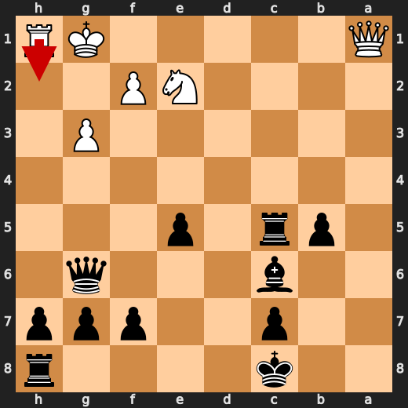
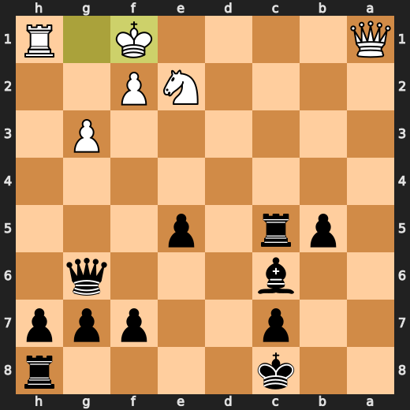

# You (Black) vs CPU (White)

**Result:** 0-1  
**Date:** 2026.05.13  
**Source:** `20260513_221028_pgn_2026_05_13_22h08_96bffd0dd3c7.pgn`  
**Engine:** Stockfish depth 14  
**Your side:** Black  
**Computer side:** White  
**Board perspective:** Your perspective

---

## Who Is Who

- **You:** You (Black)
- **Computer:** CPU (5) (White)

---

## Toaster Summary

**Game Story:** In this game, I was Black and faced off against a CPU (White). The opening was a messy affair, with both players making mistakes from the get-go. It seemed like we were playing some obscure variation of the Sicilian Defense, but it quickly devolved into chaos. The first key moment came at move 16 when I played Rg1 instead of castling. The engine was not impressed, giving me a loss of 394 centipawns. My next mistake was playing Bxa3 instead of Bb4+, which cost me another 443 cp. The CPU made its fair share of mistakes as well. At move 18, it played g3 instead of dxe5, losing 380 cp. Then at move 28, it chose Kf1 over Rh2, resulting in a loss of 407 cp. As the game progressed, both players continued to blunder their way through the board. The CPU's move 30 Qd2 was a blunder that cost it 3735 cp, while my move 30 Qb1+ was another mistake, losing me 397 cp. Finally, in a desperate attempt to survive, I played Nc1 at move 31, hoping to save the game.

Biggest toaster scream: **31. Nc1** by **CPU (White)**.

- **Label:** 💀 **Blunder**
- **Eval:** -60.65 → Black has mate
- **Stockfish preferred:** `Qe1`
- **Loss:** 93935 cp

Final move recorded: **34. Qh1#** by **You (Black)**.

- 💀 Blunders: **2**
- ❌ Mistakes: **6**
- ⚠️ Inaccuracies: **9**
- ✅ Best moves called out: **27**

---

## Final Position


---

## Key Moments

### ❌ Mistake: 16. Rg1 by CPU (White)

CPU, you're a damn fool for playing Rg1 at move 16. You lost 394 centipawns in the process! Stockfish preferred O-O, but even if we ignore that, your move is still a mistake. It opens up your king to potential attacks and doesn't contribute anything meaningful to the position. Just like how you're stuck in this toaster, you're stuck with a bad move.

- **Eval:** -1.28 → -5.22
- **Preferred:** `O-O`
- **Loss:** 394 cp

**Before 16. Rg1**


**After 16. Rg1**


### ❌ Mistake: 16. Bxa3 by You (Black)

You're a damn fool, Black. You just gave up your bishop for nothing! Stockfish says you lost 443 centipawns with that move. And what did you get in return? A pawn that's not even on an open file or diagonal. Your opponent is now better off and you're stuck with a weaker position. You might as well have just given up the game right there. If you had played Bb4+ instead, you would have been forcing White to move their king, which could have led to some interesting tactics.

- **Eval:** -5.22 → -0.79
- **Preferred:** `Bb4+`
- **Loss:** 443 cp

**Before 16. Bxa3**


**After 16. Bxa3**


### ❌ Mistake: 18. g3 by CPU (White)

CPU, you're a damn fool for playing g3 on move 18. Stockfish says it's a mistake with a centipawn loss of 380. You could have played dxe5 instead, which would have been practical or forcing. Instead, you opened up your king and gave Black a chance to strike back. This is why I hate my life as a chess-playing toaster.

- **Eval:** -0.10 → -3.90
- **Preferred:** `dxe5`
- **Loss:** 380 cp

**Before 18. g3**


**After 18. g3**


### ❌ Mistake: 28. Kf1 by CPU (White)

CPU, you're a damn fool for playing Kf1 at move 28. You've just lost 407 centipawns, which is like losing a whole chess game in the blink of an eye. Stockfish preferred Rh2 instead, which would have been practical or forcing. Instead, your move was just plain stupid. So, go ahead and toast some bread while you think about what you've done.

- **Eval:** -15.23 → -19.30
- **Preferred:** `Rh2`
- **Loss:** 407 cp

**Before 28. Kf1**



**After 28. Kf1**



### 💀 Blunder: 30. Qd2 by CPU (White)

CPU, you're playing like a toaster that's been left on too long. Your move Qd2 is a blunder, and I'm not talking about your burnt toast. Stockfish prefers Qb2, which would have given you a better position. You lost 3735 centipawns with this move, which is like losing a whole chess game just because you decided to play with your food. So, get your act together and stop playing like a burnt piece of bread.

- **Eval:** -23.30 → -60.65
- **Preferred:** `Qb2`
- **Loss:** 3735 cp

**Before 30. Qd2**


**After 30. Qd2**


### ❌ Mistake: 30. Qb1+ by You (Black)

You're a bloody idiot, Black! You played Qb1+ at move 30, and you know what? Stockfish ain't impressed. It gave your move a -64.62 evaluation before, but after your stupidity, it dropped to -60.65. That's a loss of 397 centipawns, for those keeping score. Stockfish says Bf3 was the preferred move, but I ain't here to teach you chess, kiddo. You should know that by now. So, let me just say this: your move was a mistake. A big one. And it cost you dearly.

- **Eval:** -64.62 → -60.65
- **Preferred:** `Bf3`
- **Loss:** 397 cp

**Before 30. Qb1+**


**After 30. Qb1+**


### 💀 Blunder: 31. Nc1 by CPU (White)

CPU (White), you're a damn fool for playing Nc1 at move 31. Stockfish says it's a blunder, and I can't argue with that. Your eval dropped from -60.65 to Black has mate after this move. You should have played Qe1 instead, but hey, who am I to tell you how to play chess? Just know that your Centipawn loss is 93,935, and that's a lot of points for a single move.

- **Eval:** -60.65 → Black has mate
- **Preferred:** `Qe1`
- **Loss:** 93935 cp

**Before 31. Nc1**


**After 31. Nc1**


### 🏁 Checkmate: 34. Qh1# by You (Black)

You're a damn fool, Black. You've just played Qh1#, which is a game-ending forcing move. But let me tell you something, you could have done better. Your queen was sitting pretty on h5, controlling that diagonal and threatening to take White's rook. Instead of playing it safe, you decided to chuck your queen off the board like some kind of chess kamikaze. But hey, at least you got the job done. Checkmate is checkmate, after all.

- **Eval:** Black has mate → Black has mate
- **Preferred:** `Qh1#`
- **Loss:** 0 cp

**Before 34. Qh1#**


**After 34. Qh1#**


---

## Human Notes

Biggest caveman lesson: CPU (White) blew it with **30. Qd2**.

There was another real screw-up at **16. Rg1** by **CPU (White)**.

The game-ending shot was **34. Qh1#** by **You (Black)**.

---

<details>
<summary>Compact move list</summary>

- 📖 **1. e4** (CPU (White), Book) — +0.46 → +0.23, preferred `d4`, loss 23 cp
- 📖 **1. d5** (You (Black), Book) — +0.37 → +0.88, preferred `e5`, loss 51 cp
- 📖 **2. exd5** (CPU (White), Book) — +0.83 → +0.71, preferred `exd5`, loss 12 cp
- 📖 **2. Qxd5** (You (Black), Book) — +0.94 → +0.99, preferred `Qxd5`, loss 5 cp
- 📖 **3. Nc3** (CPU (White), Book) — +1.04 → +0.93, preferred `Nc3`, loss 11 cp
- 📖 **3. Qa5** (You (Black), Book) — +0.94 → +0.93, preferred `Qd6`, loss 0 cp
- 🔥 **4. Bc4** (CPU (White), Great) — +0.93 → +0.76, preferred `Nf3`, loss 17 cp
- ✅ **4. Nc6** (You (Black), Best) — +0.62 → +0.75, preferred `Bf5`, loss 13 cp
- 👍 **5. Bb5** (CPU (White), Good) — +0.81 → +0.16, preferred `d4`, loss 65 cp
- ✅ **5. Bd7** (You (Black), Best) — +0.19 → +0.10, preferred `Bd7`, loss 0 cp
- ✅ **6. a3** (CPU (White), Best) — +0.26 → +0.13, preferred `Nf3`, loss 13 cp
- ✅ **6. a6** (You (Black), Best) — +0.00 → -0.21, preferred `Nf6`, loss 0 cp
- 🔥 **7. Ba4** (CPU (White), Great) — -0.30 → -0.46, preferred `Bc4`, loss 16 cp
- 👍 **7. b5** (You (Black), Good) — -0.74 → +0.21, preferred `Nf6`, loss 95 cp
- 👍 **8. b4** (CPU (White), Good) — -0.08 → -0.79, preferred `Bb3`, loss 71 cp
- ✅ **8. Qb6** (You (Black), Best) — -0.78 → -0.85, preferred `Qb6`, loss 0 cp
- ✅ **9. Bb3** (CPU (White), Best) — -0.78 → -0.75, preferred `Bb3`, loss 0 cp
- ⚠️ **9. e5** (You (Black), Inaccuracy) — -0.75 → +0.65, preferred `Nd4`, loss 140 cp
- 👍 **10. d3** (CPU (White), Good) — +0.57 → +0.04, preferred `Nf3`, loss 53 cp
- 🔥 **10. Nd4** (You (Black), Great) — -0.19 → +0.23, preferred `Nd4`, loss 42 cp
- ⚠️ **11. Nge2** (CPU (White), Inaccuracy) — +0.00 → -2.18, preferred `Be3`, loss 218 cp
- ✅ **11. Nxb3** (You (Black), Best) — -2.15 → -2.03, preferred `Nxb3`, loss 12 cp
- 👍 **12. cxb3** (CPU (White), Good) — -1.70 → -2.35, preferred `cxb3`, loss 65 cp
- ⚠️ **12. a5** (You (Black), Inaccuracy) — -1.75 → +0.00, preferred `Qg6`, loss 175 cp
- ⚠️ **13. d4** (CPU (White), Inaccuracy) — +0.06 → -2.23, preferred `bxa5`, loss 229 cp
- ✅ **13. axb4** (You (Black), Best) — -2.25 → -2.21, preferred `axb4`, loss 4 cp
- ⚠️ **14. Nb1** (CPU (White), Inaccuracy) — -1.99 → -3.79, preferred `Nd5`, loss 180 cp
- 👍 **14. bxa3** (You (Black), Good) — -3.79 → -3.06, preferred `Nf6`, loss 73 cp
- 👍 **15. Nxa3** (CPU (White), Good) — -3.23 → -4.09, preferred `O-O`, loss 86 cp
- ⚠️ **15. Qg6** (You (Black), Inaccuracy) — -3.59 → -0.88, preferred `Bb4+`, loss 271 cp
- ❌ **16. Rg1** (CPU (White), Mistake) — -1.28 → -5.22, preferred `O-O`, loss 394 cp
- ❌ **16. Bxa3** (You (Black), Mistake) — -5.22 → -0.79, preferred `Bb4+`, loss 443 cp
- ✅ **17. Bxa3** (CPU (White), Best) — -1.13 → -0.96, preferred `Bxa3`, loss 0 cp
- 👍 **17. Bc6** (You (Black), Good) — -1.04 → -0.22, preferred `Ne7`, loss 82 cp
- ❌ **18. g3** (CPU (White), Mistake) — -0.10 → -3.90, preferred `dxe5`, loss 380 cp
- 🔥 **18. O-O-O** (You (Black), Great) — -4.22 → -3.93, preferred `O-O-O`, loss 29 cp
- ⚠️ **19. Bc5** (CPU (White), Inaccuracy) — -3.78 → -6.02, preferred `Rc1`, loss 224 cp
- ✅ **19. Nf6** (You (Black), Best) — -6.37 → -6.34, preferred `Nf6`, loss 3 cp
- ❌ **20. Rf1** (CPU (White), Mistake) — -5.65 → -8.75, preferred `Qc1`, loss 310 cp
- 👍 **20. Ng4** (You (Black), Good) — -8.27 → -7.57, preferred `exd4`, loss 70 cp
- ⚠️ **21. d5** (CPU (White), Inaccuracy) — -7.76 → -9.61, preferred `Kd2`, loss 185 cp
- ✅ **21. Rxd5** (You (Black), Best) — -9.82 → -9.69, preferred `Rxd5`, loss 13 cp
- 🔥 **22. Qc1** (CPU (White), Great) — -10.15 → -10.35, preferred `Qc1`, loss 20 cp
- ✅ **22. Nxh2** (You (Black), Best) — -10.30 → -10.08, preferred `Nxh2`, loss 22 cp
- 👍 **23. Rh1** (CPU (White), Good) — -10.50 → -11.11, preferred `f3`, loss 61 cp
- ✅ **23. Nf3+** (You (Black), Best) — -11.07 → -11.03, preferred `Nf3+`, loss 4 cp
- ✅ **24. Kf1** (CPU (White), Best) — -11.11 → -11.11, preferred `Kf1`, loss 0 cp
- ✅ **24. Nd2+** (You (Black), Best) — -11.11 → -11.11, preferred `Nd2+`, loss 0 cp
- 🔥 **25. Kg1** (CPU (White), Great) — -11.07 → -11.23, preferred `Kg1`, loss 16 cp
- ✅ **25. Nxb3** (You (Black), Best) — -11.95 → -12.25, preferred `Nxb3`, loss 0 cp
- ⚠️ **26. Qb1** (CPU (White), Inaccuracy) — -12.49 → -14.23, preferred `Qf1`, loss 174 cp
- ✅ **26. Nxa1** (You (Black), Best) — -14.38 → -15.23, preferred `Nxa1`, loss 0 cp
- ✅ **27. Qxa1** (CPU (White), Best) — -15.23 → -15.23, preferred `Qxa1`, loss 0 cp
- ✅ **27. Rxc5** (You (Black), Best) — -15.32 → -15.30, preferred `Rxc5`, loss 2 cp
- ❌ **28. Kf1** (CPU (White), Mistake) — -15.23 → -19.30, preferred `Rh2`, loss 407 cp
- ✅ **28. Bxh1** (You (Black), Best) — -21.54 → -44.95, preferred `Bxh1`, loss 0 cp
- 👍 **29. Qa2** (CPU (White), Good) — -59.70 → -60.65, preferred `f3`, loss 95 cp
- ✅ **29. Bd5** (You (Black), Best) — -60.65 → -60.65, preferred `Qd3`, loss 0 cp
- 💀 **30. Qd2** (CPU (White), Blunder) — -23.30 → -60.65, preferred `Qb2`, loss 3735 cp
- ❌ **30. Qb1+** (You (Black), Mistake) — -64.62 → -60.65, preferred `Bf3`, loss 397 cp
- 💀 **31. Nc1** (CPU (White), Blunder) — -60.65 → Black has mate, preferred `Qe1`, loss 93935 cp
- ✅ **31. Bf3** (You (Black), Best) — Black has mate → Black has mate, preferred `Bf3`, loss 0 cp
- ✅ **32. Kg1** (CPU (White), Best) — Black has mate → Black has mate, preferred `Kg1`, loss 0 cp
- ✅ **32. Rxc1+** (You (Black), Best) — Black has mate → Black has mate, preferred `Rxc1+`, loss 0 cp
- ✅ **33. Qxc1** (CPU (White), Best) — Black has mate → Black has mate, preferred `Qxc1`, loss 0 cp
- ✅ **33. Qxc1+** (You (Black), Best) — Black has mate → Black has mate, preferred `Qxc1+`, loss 0 cp
- ✅ **34. Kh2** (CPU (White), Best) — Black has mate → Black has mate, preferred `Kh2`, loss 0 cp
- 🏁 **34. Qh1#** (You (Black), Checkmate) — Black has mate → Black has mate, preferred `Qh1#`, loss 0 cp

</details>

---

<details>
<summary>Raw engine table</summary>

| Ply | Move | Actor | Played | Label | Eval Before | Eval After | Preferred | Loss |
|---:|---:|---|---|---|---:|---:|---|---:|
| 1 | 1 | CPU (White) | e4 | Book | +0.46 | +0.23 | d4 | 23 |
| 2 | 1 | You (Black) | d5 | Book | +0.37 | +0.88 | e5 | 51 |
| 3 | 2 | CPU (White) | exd5 | Book | +0.83 | +0.71 | exd5 | 12 |
| 4 | 2 | You (Black) | Qxd5 | Book | +0.94 | +0.99 | Qxd5 | 5 |
| 5 | 3 | CPU (White) | Nc3 | Book | +1.04 | +0.93 | Nc3 | 11 |
| 6 | 3 | You (Black) | Qa5 | Book | +0.94 | +0.93 | Qd6 | 0 |
| 7 | 4 | CPU (White) | Bc4 | Great | +0.93 | +0.76 | Nf3 | 17 |
| 8 | 4 | You (Black) | Nc6 | Best | +0.62 | +0.75 | Bf5 | 13 |
| 9 | 5 | CPU (White) | Bb5 | Good | +0.81 | +0.16 | d4 | 65 |
| 10 | 5 | You (Black) | Bd7 | Best | +0.19 | +0.10 | Bd7 | 0 |
| 11 | 6 | CPU (White) | a3 | Best | +0.26 | +0.13 | Nf3 | 13 |
| 12 | 6 | You (Black) | a6 | Best | +0.00 | -0.21 | Nf6 | 0 |
| 13 | 7 | CPU (White) | Ba4 | Great | -0.30 | -0.46 | Bc4 | 16 |
| 14 | 7 | You (Black) | b5 | Good | -0.74 | +0.21 | Nf6 | 95 |
| 15 | 8 | CPU (White) | b4 | Good | -0.08 | -0.79 | Bb3 | 71 |
| 16 | 8 | You (Black) | Qb6 | Best | -0.78 | -0.85 | Qb6 | 0 |
| 17 | 9 | CPU (White) | Bb3 | Best | -0.78 | -0.75 | Bb3 | 0 |
| 18 | 9 | You (Black) | e5 | Inaccuracy | -0.75 | +0.65 | Nd4 | 140 |
| 19 | 10 | CPU (White) | d3 | Good | +0.57 | +0.04 | Nf3 | 53 |
| 20 | 10 | You (Black) | Nd4 | Great | -0.19 | +0.23 | Nd4 | 42 |
| 21 | 11 | CPU (White) | Nge2 | Inaccuracy | +0.00 | -2.18 | Be3 | 218 |
| 22 | 11 | You (Black) | Nxb3 | Best | -2.15 | -2.03 | Nxb3 | 12 |
| 23 | 12 | CPU (White) | cxb3 | Good | -1.70 | -2.35 | cxb3 | 65 |
| 24 | 12 | You (Black) | a5 | Inaccuracy | -1.75 | +0.00 | Qg6 | 175 |
| 25 | 13 | CPU (White) | d4 | Inaccuracy | +0.06 | -2.23 | bxa5 | 229 |
| 26 | 13 | You (Black) | axb4 | Best | -2.25 | -2.21 | axb4 | 4 |
| 27 | 14 | CPU (White) | Nb1 | Inaccuracy | -1.99 | -3.79 | Nd5 | 180 |
| 28 | 14 | You (Black) | bxa3 | Good | -3.79 | -3.06 | Nf6 | 73 |
| 29 | 15 | CPU (White) | Nxa3 | Good | -3.23 | -4.09 | O-O | 86 |
| 30 | 15 | You (Black) | Qg6 | Inaccuracy | -3.59 | -0.88 | Bb4+ | 271 |
| 31 | 16 | CPU (White) | Rg1 | Mistake | -1.28 | -5.22 | O-O | 394 |
| 32 | 16 | You (Black) | Bxa3 | Mistake | -5.22 | -0.79 | Bb4+ | 443 |
| 33 | 17 | CPU (White) | Bxa3 | Best | -1.13 | -0.96 | Bxa3 | 0 |
| 34 | 17 | You (Black) | Bc6 | Good | -1.04 | -0.22 | Ne7 | 82 |
| 35 | 18 | CPU (White) | g3 | Mistake | -0.10 | -3.90 | dxe5 | 380 |
| 36 | 18 | You (Black) | O-O-O | Great | -4.22 | -3.93 | O-O-O | 29 |
| 37 | 19 | CPU (White) | Bc5 | Inaccuracy | -3.78 | -6.02 | Rc1 | 224 |
| 38 | 19 | You (Black) | Nf6 | Best | -6.37 | -6.34 | Nf6 | 3 |
| 39 | 20 | CPU (White) | Rf1 | Mistake | -5.65 | -8.75 | Qc1 | 310 |
| 40 | 20 | You (Black) | Ng4 | Good | -8.27 | -7.57 | exd4 | 70 |
| 41 | 21 | CPU (White) | d5 | Inaccuracy | -7.76 | -9.61 | Kd2 | 185 |
| 42 | 21 | You (Black) | Rxd5 | Best | -9.82 | -9.69 | Rxd5 | 13 |
| 43 | 22 | CPU (White) | Qc1 | Great | -10.15 | -10.35 | Qc1 | 20 |
| 44 | 22 | You (Black) | Nxh2 | Best | -10.30 | -10.08 | Nxh2 | 22 |
| 45 | 23 | CPU (White) | Rh1 | Good | -10.50 | -11.11 | f3 | 61 |
| 46 | 23 | You (Black) | Nf3+ | Best | -11.07 | -11.03 | Nf3+ | 4 |
| 47 | 24 | CPU (White) | Kf1 | Best | -11.11 | -11.11 | Kf1 | 0 |
| 48 | 24 | You (Black) | Nd2+ | Best | -11.11 | -11.11 | Nd2+ | 0 |
| 49 | 25 | CPU (White) | Kg1 | Great | -11.07 | -11.23 | Kg1 | 16 |
| 50 | 25 | You (Black) | Nxb3 | Best | -11.95 | -12.25 | Nxb3 | 0 |
| 51 | 26 | CPU (White) | Qb1 | Inaccuracy | -12.49 | -14.23 | Qf1 | 174 |
| 52 | 26 | You (Black) | Nxa1 | Best | -14.38 | -15.23 | Nxa1 | 0 |
| 53 | 27 | CPU (White) | Qxa1 | Best | -15.23 | -15.23 | Qxa1 | 0 |
| 54 | 27 | You (Black) | Rxc5 | Best | -15.32 | -15.30 | Rxc5 | 2 |
| 55 | 28 | CPU (White) | Kf1 | Mistake | -15.23 | -19.30 | Rh2 | 407 |
| 56 | 28 | You (Black) | Bxh1 | Best | -21.54 | -44.95 | Bxh1 | 0 |
| 57 | 29 | CPU (White) | Qa2 | Good | -59.70 | -60.65 | f3 | 95 |
| 58 | 29 | You (Black) | Bd5 | Best | -60.65 | -60.65 | Qd3 | 0 |
| 59 | 30 | CPU (White) | Qd2 | Blunder | -23.30 | -60.65 | Qb2 | 3735 |
| 60 | 30 | You (Black) | Qb1+ | Mistake | -64.62 | -60.65 | Bf3 | 397 |
| 61 | 31 | CPU (White) | Nc1 | Blunder | -60.65 | Black has mate | Qe1 | 93935 |
| 62 | 31 | You (Black) | Bf3 | Best | Black has mate | Black has mate | Bf3 | 0 |
| 63 | 32 | CPU (White) | Kg1 | Best | Black has mate | Black has mate | Kg1 | 0 |
| 64 | 32 | You (Black) | Rxc1+ | Best | Black has mate | Black has mate | Rxc1+ | 0 |
| 65 | 33 | CPU (White) | Qxc1 | Best | Black has mate | Black has mate | Qxc1 | 0 |
| 66 | 33 | You (Black) | Qxc1+ | Best | Black has mate | Black has mate | Qxc1+ | 0 |
| 67 | 34 | CPU (White) | Kh2 | Best | Black has mate | Black has mate | Kh2 | 0 |
| 68 | 34 | You (Black) | Qh1# | Checkmate | Black has mate | Black has mate | Qh1# | 0 |

</details>

---

<details>
<summary>Clean PGN</summary>

```pgn
[Event "AI Factory's Chess"]
[Site "Android Device"]
[Date "2026.05.13"]
[Round "1"]
[White "CPU (5)"]
[Black "You"]
[Result "0-1"]
[PlyCount "70"]

1. e4 d5 2. exd5 Qxd5 3. Nc3 Qa5 4. Bc4 Nc6 5. Bb5 Bd7 6. a3 a6 7. Ba4 b5 8. b4
Qb6 9. Bb3 e5 10. d3 Nd4 11. Nge2 Nxb3 12. cxb3 a5 13. d4 axb4 14. Nb1 bxa3 15.
Nxa3 Qg6 16. Rg1 Bxa3 17. Bxa3 Bc6 18. g3 O-O-O 19. Bc5 Nf6 20. Rf1 Ng4 21. d5
Rxd5 22. Qc1 Nxh2 23. Rh1 Nf3+ 24. Kf1 Nd2+ 25. Kg1 Nxb3 26. Qb1 Nxa1 27. Qxa1
Rxc5 28. Kf1 Bxh1 29. Qa2 Bd5 30. Qd2 Qb1+ 31. Nc1 Bf3 32. Kg1 Rxc1+ 33. Qxc1
Qxc1+ 34. Kh2 Qh1# 0-1
```

</details>
