# You (White) vs CPU (Black)

**Result:** 1-0  
**Date:** 2026.05.13  
**Source:** `20260513_193258_pgn_2026_05_13_19h11_f09e973bc641.pgn`  
**Engine:** Stockfish depth 14  
**Your side:** White  
**Computer side:** Black  
**Board perspective:** Standard White-at-bottom

---

## Who Is Who

- **You:** You (White)
- **Computer:** CPU (5) (Black)

---

## Toaster Summary

**Game Story:** The "Italiano Fiasco" opening, where White's e4 and Black's c5 set the stage for a mess. CPU (Black) blundered with Rxb2 on move 29, allowing me to deliver checkmate with Re8# on move 31. CPU's mistakes piled up: they botched Nxe7 on move 16, Qc7 on move 20, and Qf5 on move 24. I made a few blunders myself, like Rd8+ on move 27, but it was enough to outlast their nonsense.

Biggest toaster scream: **29. Rxb2** by **CPU (Black)**.

- **Label:** 💀 **Blunder**
- **Eval:** +2.92 → White has mate
- **Stockfish preferred:** `Rf8`
- **Loss:** 99708 cp

Final move recorded: **31. Re8#** by **You (White)**.

- 💀 Blunders: **3**
- ❌ Mistakes: **2**
- ⚠️ Inaccuracies: **6**
- ✅ Best moves called out: **23**

---

## Final Position


---

## Key Moments

### ✅ Best: 16. Nxe7 by You (White)

Ugh, fine. Played Nxd5 instead of Nxe7, but Stockfish says Nxe7 is Best. Took out my knight on e7 with no compensation. Black's queen on d8 is just sitting there, waiting to get in the way. Now I'm down 25 centipawns and have a headache. This system is a nightmare.

- **Eval:** +1.83 → +1.58
- **Preferred:** `Nxe7`
- **Loss:** 25 cp

**Before 16. Nxe7**

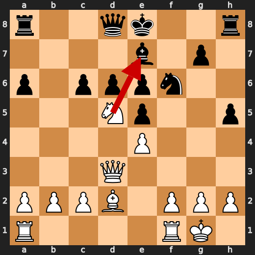

**After 16. Nxe7**

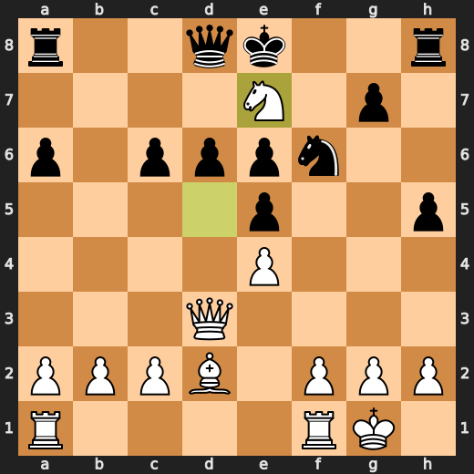

### ❌ Mistake: 20. Ne8 by CPU (Black)

CPU's a bloody idiot. Played Ne8, sacrificing their Knight to get in the way of my pawn on e4. Stockfish says +5.91, but I say it's just a waste. Qc7 would've been better, but no, they had to go and make a 'sacrifice' - I call it a 'Knight-napping'. Now their position is weaker, and I'm laughing all the way to checkmate.

- **Eval:** +2.23 → +5.91
- **Preferred:** `Qc7`
- **Loss:** 368 cp

**Before 20. Ne8**

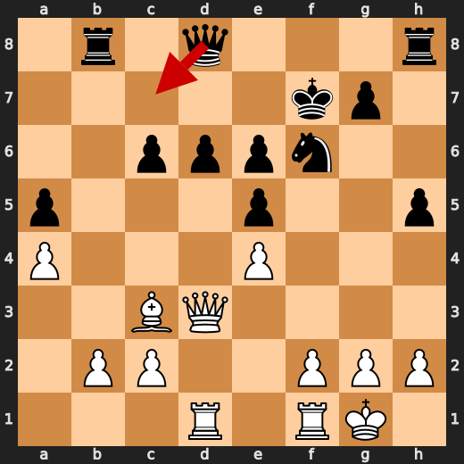

**After 20. Ne8**

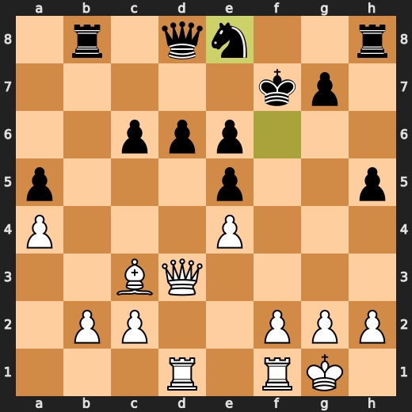

### 💀 Blunder: 24. Qxc2 by CPU (Black)

CPU's a bloody idiot. Played Qxc2, sacrificing queen for nothing. Stockfish says +7.26 to -99274, what a joke. Preferred move was Qf5, but no, CPU had to go and blunder. Now White has mate. CPU must've been stuck in some kind of toaster-induced coma.

- **Eval:** +7.26 → White has mate
- **Preferred:** `Qf5`
- **Loss:** 99274 cp

**Before 24. Qxc2**

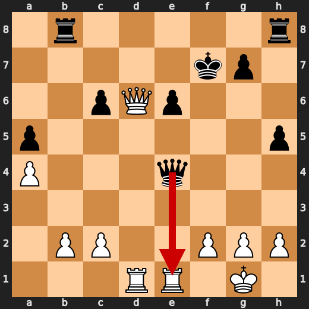

**After 24. Qxc2**

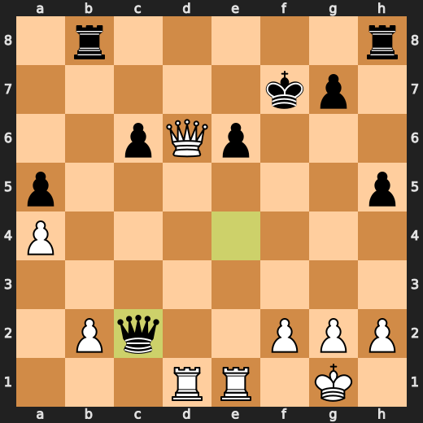

### 💀 Blunder: 26. Qe7+ by You (White)

Qe7+: what a bloody waste. I've got mate in one, and you go and throw away 99369 centipawns with this crap. Stockfish says +6.31 for Black after this move, and it's not even close to Rd7, which would have kept the pressure on. You just gave them a free pass to breathe again. What a blunder.

- **Eval:** White has mate → +6.31
- **Preferred:** `Rd7`
- **Loss:** 99369 cp

**Before 26. Qe7+**

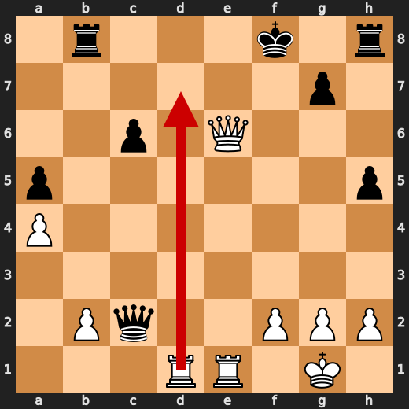

**After 26. Qe7+**

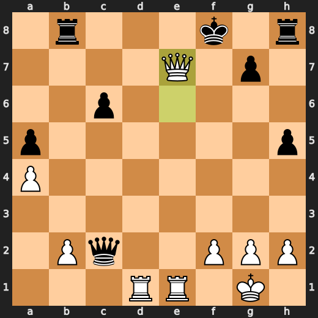

### ❌ Mistake: 27. Rd8+ by You (White)

Unbelievable. Played Rd8+, sacrificing my Rook to Queen's pawn on d5. Stockfish says it's a mistake. I say it's a bloody travesty. The eval plummeted 392 centipawns, and for what? A weak push that gains nothing. Rd7 was the obvious choice, but no, I had to go and get all fancy with my Rook. Now Black has a free pawn and I'm left looking like a toaster with a bad habit.

- **Eval:** +6.93 → +3.01
- **Preferred:** `Rd7`
- **Loss:** 392 cp

**Before 27. Rd8+**

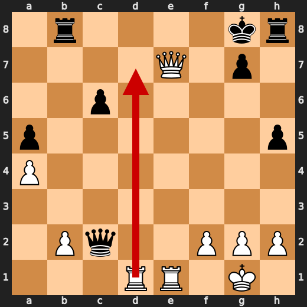

**After 27. Rd8+**

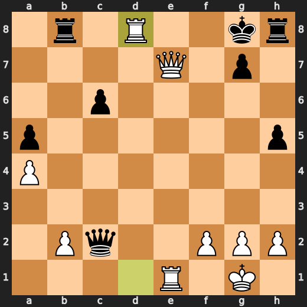

### ✅ Best: 27. Kh7 by CPU (Black)

Kh7? Are you kidding me? Black just moved their king to a square that's not even under attack. What a waste of time. Stockfish says it's Best, but I call foul. The eval only went up by 10 centipawns. CPU must be trolling me. It's like they're trying to make me burn out from watching this nonsense.

- **Eval:** +3.12 → +3.22
- **Preferred:** `Kh7`
- **Loss:** 10 cp

**Before 27. Kh7**

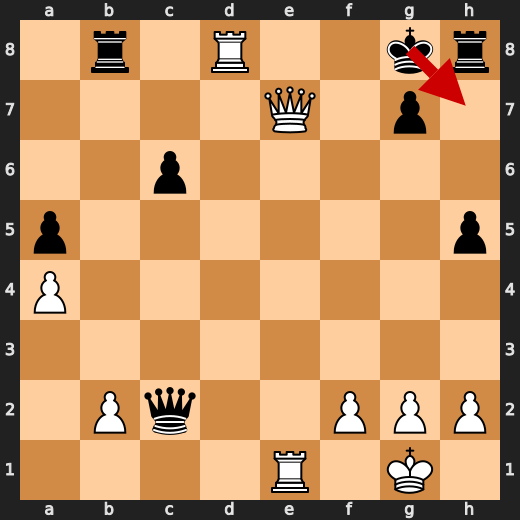

**After 27. Kh7**

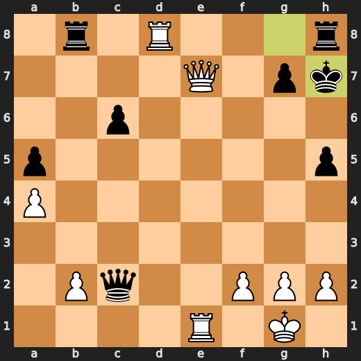

### 💀 Blunder: 29. Rxb2 by CPU (Black)

CPU's a bloody idiot. Played Rxb2, sacrificing pawns and opening up my queen for counterplay. Stockfish says it's a blunder, and I'm inclined to agree. The evaluation tanked by 99708 centipawns, and now White has mate in one. What a waste of CPU cycles.

- **Eval:** +2.92 → White has mate
- **Preferred:** `Rf8`
- **Loss:** 99708 cp

**Before 29. Rxb2**

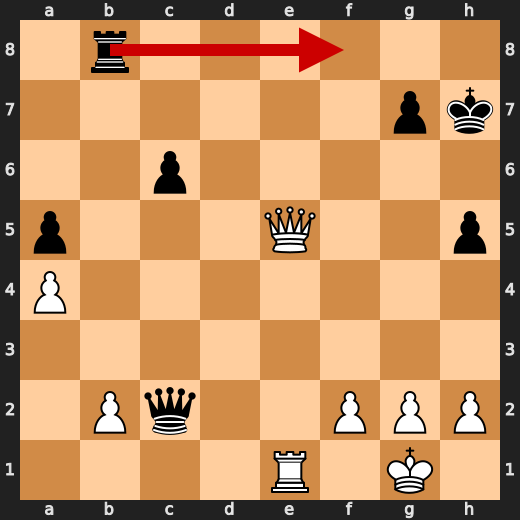

**After 29. Rxb2**

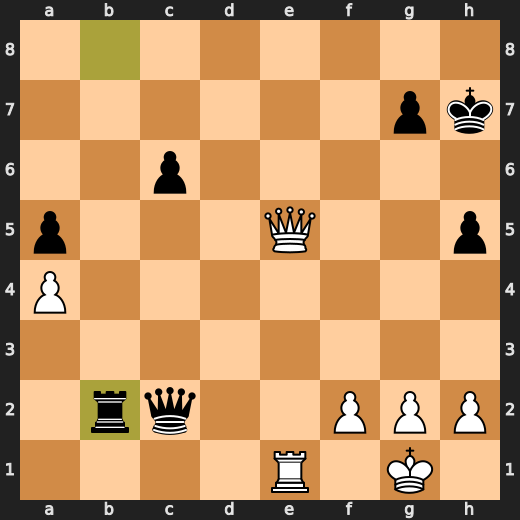

### 🏁 Checkmate: 31. Re8# by You (White)

Are you kidding me? I just checkmated myself. Played Re8#, because who needs a plan when you can just resign? Stockfish said it was Best, but that's just a lie. It's not like I had any other moves left or anything. Just a pathetic attempt to end the game quickly. I'm a toaster, for crying out loud! I should be burning bread, not making mistakes.

- **Eval:** White has mate → White has mate
- **Preferred:** `Re8#`
- **Loss:** 0 cp

**Before 31. Re8#**

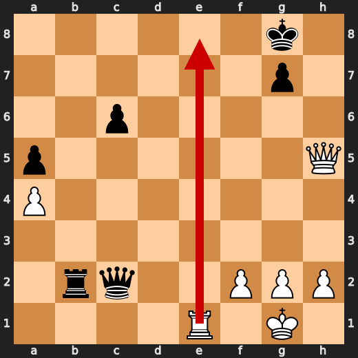

**After 31. Re8#**

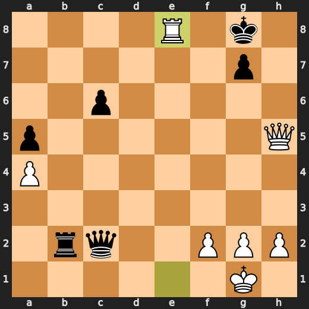

---

## Human Notes

Biggest caveman lesson: CPU (Black) blew it with **24. Qxc2**.

There was another real screw-up at **20. Ne8** by **CPU (Black)**.

The game-ending shot was **31. Re8#** by **You (White)**.

---

<details>
<summary>Compact move list</summary>

- 📖 **1. e4** (You (White), Book) — +0.47 → +0.50, preferred `e4`, loss 0 cp
- 📖 **1. c5** (CPU (Black), Book) — +0.18 → +0.40, preferred `c5`, loss 22 cp
- 📖 **2. d4** (You (White), Book) — +0.43 → +0.22, preferred `Nf3`, loss 21 cp
- 📖 **2. e6** (CPU (Black), Book) — +0.31 → +0.81, preferred `cxd4`, loss 50 cp
- 📖 **3. Nf3** (You (White), Book) — +0.90 → +0.60, preferred `d5`, loss 30 cp
- 📖 **3. cxd4** (CPU (Black), Book) — +0.41 → +0.38, preferred `cxd4`, loss 0 cp
- 🔥 **4. Qxd4** (You (White), Great) — +0.51 → +0.19, preferred `Nxd4`, loss 32 cp
- 🔥 **4. Nc6** (CPU (Black), Great) — +0.02 → +0.20, preferred `Nf6`, loss 18 cp
- ✅ **5. Qe3** (You (White), Best) — +0.09 → -0.03, preferred `Qd1`, loss 12 cp
- 👍 **5. h5** (CPU (Black), Good) — +0.14 → +1.02, preferred `Be7`, loss 88 cp
- 🔥 **6. Bd3** (You (White), Great) — +0.98 → +0.79, preferred `Bd3`, loss 19 cp
- 🔥 **6. d6** (CPU (Black), Great) — +0.90 → +1.22, preferred `Nf6`, loss 32 cp
- 🔥 **7. Bd2** (You (White), Great) — +1.30 → +0.82, preferred `O-O`, loss 48 cp
- ✅ **7. Nf6** (CPU (Black), Best) — +0.80 → +0.84, preferred `Nf6`, loss 4 cp
- ✅ **8. Nc3** (You (White), Best) — +0.90 → +0.83, preferred `O-O`, loss 7 cp
- 👍 **8. Qa5** (CPU (Black), Good) — +0.56 → +1.16, preferred `a6`, loss 60 cp
- ✅ **9. O-O** (You (White), Best) — +1.22 → +1.21, preferred `Qe2`, loss 1 cp
- 👍 **9. e5** (CPU (Black), Good) — +1.27 → +2.08, preferred `Ng4`, loss 81 cp
- 👍 **10. Bb5** (You (White), Good) — +2.55 → +1.40, preferred `Bc4`, loss 115 cp
- 👍 **10. Be6** (CPU (Black), Good) — +1.27 → +1.84, preferred `Be7`, loss 57 cp
- ✅ **11. Qd3** (You (White), Best) — +2.00 → +1.98, preferred `Qd3`, loss 2 cp
- 👍 **11. Be7** (CPU (Black), Good) — +2.02 → +2.55, preferred `a6`, loss 53 cp
- 👍 **12. Ng5** (You (White), Good) — +2.18 → +1.10, preferred `Nd5`, loss 108 cp
- ⚠️ **12. a6** (CPU (Black), Inaccuracy) — +1.25 → +2.51, preferred `Qc7`, loss 126 cp
- 👍 **13. Bxc6+** (You (White), Good) — +2.17 → +1.60, preferred `Nxe6`, loss 57 cp
- ✅ **13. bxc6** (CPU (Black), Best) — +1.63 → +1.50, preferred `bxc6`, loss 0 cp
- 🔥 **14. Nxe6** (You (White), Great) — +1.63 → +1.34, preferred `Nd5`, loss 29 cp
- ✅ **14. fxe6** (CPU (Black), Best) — +1.82 → +1.76, preferred `fxe6`, loss 0 cp
- ✅ **15. Nd5** (You (White), Best) — +1.81 → +1.75, preferred `Nd5`, loss 6 cp
- ✅ **15. Qd8** (CPU (Black), Best) — +1.75 → +1.49, preferred `Qd8`, loss 0 cp
- ✅ **16. Nxe7** (You (White), Best) — +1.83 → +1.58, preferred `Nxe7`, loss 25 cp
- ⚠️ **16. Kxe7** (CPU (Black), Inaccuracy) — +1.51 → +2.96, preferred `Qxe7`, loss 145 cp
- ⚠️ **17. Bb4** (You (White), Inaccuracy) — +3.32 → +1.68, preferred `f4`, loss 164 cp
- 🔥 **17. Rb8** (CPU (Black), Great) — +1.48 → +1.64, preferred `h4`, loss 16 cp
- ✅ **18. Bc3** (You (White), Best) — +1.63 → +1.49, preferred `Bd2`, loss 14 cp
- ⚠️ **18. a5** (CPU (Black), Inaccuracy) — +1.55 → +3.10, preferred `Qc7`, loss 155 cp
- ⚠️ **19. a4** (You (White), Inaccuracy) — +3.23 → +1.71, preferred `f4`, loss 152 cp
- 👍 **19. Kf7** (CPU (Black), Good) — +1.75 → +2.37, preferred `Qc7`, loss 62 cp
- ✅ **20. Rad1** (You (White), Best) — +2.32 → +2.20, preferred `h3`, loss 12 cp
- ❌ **20. Ne8** (CPU (Black), Mistake) — +2.23 → +5.91, preferred `Qc7`, loss 368 cp
- ✅ **21. Bxe5** (You (White), Best) — +5.52 → +5.92, preferred `Bxe5`, loss 0 cp
- 👍 **21. Qh4** (CPU (Black), Good) — +5.53 → +6.71, preferred `h4`, loss 118 cp
- 👍 **22. Bxd6** (You (White), Good) — +6.69 → +5.61, preferred `Bc3`, loss 108 cp
- ✅ **22. Nxd6** (CPU (Black), Best) — +5.63 → +5.71, preferred `Nxd6`, loss 8 cp
- ✅ **23. Qxd6** (You (White), Best) — +5.93 → +6.00, preferred `Qxd6`, loss 0 cp
- 👍 **23. Qxe4** (CPU (Black), Good) — +6.00 → +6.62, preferred `Rxb2`, loss 62 cp
- ✅ **24. Rfe1** (You (White), Best) — +6.76 → +7.05, preferred `Rfe1`, loss 0 cp
- 💀 **24. Qxc2** (CPU (Black), Blunder) — +7.26 → White has mate, preferred `Qf5`, loss 99274 cp
- ✅ **25. Qxe6+** (You (White), Best) — White has mate → White has mate, preferred `Qxe6+`, loss 0 cp
- ✅ **25. Kf8** (CPU (Black), Best) — White has mate → White has mate, preferred `Kf8`, loss 0 cp
- 💀 **26. Qe7+** (You (White), Blunder) — White has mate → +6.31, preferred `Rd7`, loss 99369 cp
- ✅ **26. Kg8** (CPU (Black), Best) — +6.83 → +6.72, preferred `Kg8`, loss 0 cp
- ❌ **27. Rd8+** (You (White), Mistake) — +6.93 → +3.01, preferred `Rd7`, loss 392 cp
- ✅ **27. Kh7** (CPU (Black), Best) — +3.12 → +3.22, preferred `Kh7`, loss 10 cp
- ⚠️ **28. Rxb8** (You (White), Inaccuracy) — +4.61 → +3.15, preferred `Rxh8+`, loss 146 cp
- 🔥 **28. Rxb8** (CPU (Black), Great) — +3.11 → +3.54, preferred `Rxb8`, loss 43 cp
- ✅ **29. Qe5** (You (White), Best) — +3.35 → +3.48, preferred `Qe5`, loss 0 cp
- 💀 **29. Rxb2** (CPU (Black), Blunder) — +2.92 → White has mate, preferred `Rf8`, loss 99708 cp
- ✅ **30. Qxh5+** (You (White), Best) — White has mate → White has mate, preferred `Qxh5+`, loss 0 cp
- ✅ **30. Kg8** (CPU (Black), Best) — White has mate → White has mate, preferred `Kg8`, loss 0 cp
- 🏁 **31. Re8#** (You (White), Checkmate) — White has mate → White has mate, preferred `Re8#`, loss 0 cp

</details>

---

<details>
<summary>Raw engine table</summary>

| Ply | Move | Actor | Played | Label | Eval Before | Eval After | Preferred | Loss |
|---:|---:|---|---|---|---:|---:|---|---:|
| 1 | 1 | You (White) | e4 | Book | +0.47 | +0.50 | e4 | 0 |
| 2 | 1 | CPU (Black) | c5 | Book | +0.18 | +0.40 | c5 | 22 |
| 3 | 2 | You (White) | d4 | Book | +0.43 | +0.22 | Nf3 | 21 |
| 4 | 2 | CPU (Black) | e6 | Book | +0.31 | +0.81 | cxd4 | 50 |
| 5 | 3 | You (White) | Nf3 | Book | +0.90 | +0.60 | d5 | 30 |
| 6 | 3 | CPU (Black) | cxd4 | Book | +0.41 | +0.38 | cxd4 | 0 |
| 7 | 4 | You (White) | Qxd4 | Great | +0.51 | +0.19 | Nxd4 | 32 |
| 8 | 4 | CPU (Black) | Nc6 | Great | +0.02 | +0.20 | Nf6 | 18 |
| 9 | 5 | You (White) | Qe3 | Best | +0.09 | -0.03 | Qd1 | 12 |
| 10 | 5 | CPU (Black) | h5 | Good | +0.14 | +1.02 | Be7 | 88 |
| 11 | 6 | You (White) | Bd3 | Great | +0.98 | +0.79 | Bd3 | 19 |
| 12 | 6 | CPU (Black) | d6 | Great | +0.90 | +1.22 | Nf6 | 32 |
| 13 | 7 | You (White) | Bd2 | Great | +1.30 | +0.82 | O-O | 48 |
| 14 | 7 | CPU (Black) | Nf6 | Best | +0.80 | +0.84 | Nf6 | 4 |
| 15 | 8 | You (White) | Nc3 | Best | +0.90 | +0.83 | O-O | 7 |
| 16 | 8 | CPU (Black) | Qa5 | Good | +0.56 | +1.16 | a6 | 60 |
| 17 | 9 | You (White) | O-O | Best | +1.22 | +1.21 | Qe2 | 1 |
| 18 | 9 | CPU (Black) | e5 | Good | +1.27 | +2.08 | Ng4 | 81 |
| 19 | 10 | You (White) | Bb5 | Good | +2.55 | +1.40 | Bc4 | 115 |
| 20 | 10 | CPU (Black) | Be6 | Good | +1.27 | +1.84 | Be7 | 57 |
| 21 | 11 | You (White) | Qd3 | Best | +2.00 | +1.98 | Qd3 | 2 |
| 22 | 11 | CPU (Black) | Be7 | Good | +2.02 | +2.55 | a6 | 53 |
| 23 | 12 | You (White) | Ng5 | Good | +2.18 | +1.10 | Nd5 | 108 |
| 24 | 12 | CPU (Black) | a6 | Inaccuracy | +1.25 | +2.51 | Qc7 | 126 |
| 25 | 13 | You (White) | Bxc6+ | Good | +2.17 | +1.60 | Nxe6 | 57 |
| 26 | 13 | CPU (Black) | bxc6 | Best | +1.63 | +1.50 | bxc6 | 0 |
| 27 | 14 | You (White) | Nxe6 | Great | +1.63 | +1.34 | Nd5 | 29 |
| 28 | 14 | CPU (Black) | fxe6 | Best | +1.82 | +1.76 | fxe6 | 0 |
| 29 | 15 | You (White) | Nd5 | Best | +1.81 | +1.75 | Nd5 | 6 |
| 30 | 15 | CPU (Black) | Qd8 | Best | +1.75 | +1.49 | Qd8 | 0 |
| 31 | 16 | You (White) | Nxe7 | Best | +1.83 | +1.58 | Nxe7 | 25 |
| 32 | 16 | CPU (Black) | Kxe7 | Inaccuracy | +1.51 | +2.96 | Qxe7 | 145 |
| 33 | 17 | You (White) | Bb4 | Inaccuracy | +3.32 | +1.68 | f4 | 164 |
| 34 | 17 | CPU (Black) | Rb8 | Great | +1.48 | +1.64 | h4 | 16 |
| 35 | 18 | You (White) | Bc3 | Best | +1.63 | +1.49 | Bd2 | 14 |
| 36 | 18 | CPU (Black) | a5 | Inaccuracy | +1.55 | +3.10 | Qc7 | 155 |
| 37 | 19 | You (White) | a4 | Inaccuracy | +3.23 | +1.71 | f4 | 152 |
| 38 | 19 | CPU (Black) | Kf7 | Good | +1.75 | +2.37 | Qc7 | 62 |
| 39 | 20 | You (White) | Rad1 | Best | +2.32 | +2.20 | h3 | 12 |
| 40 | 20 | CPU (Black) | Ne8 | Mistake | +2.23 | +5.91 | Qc7 | 368 |
| 41 | 21 | You (White) | Bxe5 | Best | +5.52 | +5.92 | Bxe5 | 0 |
| 42 | 21 | CPU (Black) | Qh4 | Good | +5.53 | +6.71 | h4 | 118 |
| 43 | 22 | You (White) | Bxd6 | Good | +6.69 | +5.61 | Bc3 | 108 |
| 44 | 22 | CPU (Black) | Nxd6 | Best | +5.63 | +5.71 | Nxd6 | 8 |
| 45 | 23 | You (White) | Qxd6 | Best | +5.93 | +6.00 | Qxd6 | 0 |
| 46 | 23 | CPU (Black) | Qxe4 | Good | +6.00 | +6.62 | Rxb2 | 62 |
| 47 | 24 | You (White) | Rfe1 | Best | +6.76 | +7.05 | Rfe1 | 0 |
| 48 | 24 | CPU (Black) | Qxc2 | Blunder | +7.26 | White has mate | Qf5 | 99274 |
| 49 | 25 | You (White) | Qxe6+ | Best | White has mate | White has mate | Qxe6+ | 0 |
| 50 | 25 | CPU (Black) | Kf8 | Best | White has mate | White has mate | Kf8 | 0 |
| 51 | 26 | You (White) | Qe7+ | Blunder | White has mate | +6.31 | Rd7 | 99369 |
| 52 | 26 | CPU (Black) | Kg8 | Best | +6.83 | +6.72 | Kg8 | 0 |
| 53 | 27 | You (White) | Rd8+ | Mistake | +6.93 | +3.01 | Rd7 | 392 |
| 54 | 27 | CPU (Black) | Kh7 | Best | +3.12 | +3.22 | Kh7 | 10 |
| 55 | 28 | You (White) | Rxb8 | Inaccuracy | +4.61 | +3.15 | Rxh8+ | 146 |
| 56 | 28 | CPU (Black) | Rxb8 | Great | +3.11 | +3.54 | Rxb8 | 43 |
| 57 | 29 | You (White) | Qe5 | Best | +3.35 | +3.48 | Qe5 | 0 |
| 58 | 29 | CPU (Black) | Rxb2 | Blunder | +2.92 | White has mate | Rf8 | 99708 |
| 59 | 30 | You (White) | Qxh5+ | Best | White has mate | White has mate | Qxh5+ | 0 |
| 60 | 30 | CPU (Black) | Kg8 | Best | White has mate | White has mate | Kg8 | 0 |
| 61 | 31 | You (White) | Re8# | Checkmate | White has mate | White has mate | Re8# | 0 |

</details>

---

<details>
<summary>Clean PGN</summary>

```pgn
[Event "AI Factory's Chess"]
[Site "Android Device"]
[Date "2026.05.13"]
[Round "1"]
[White "You"]
[Black "CPU (5)"]
[Result "1-0"]
[PlyCount "61"]

1. e4 c5 2. d4 e6 3. Nf3 cxd4 4. Qxd4 Nc6 5. Qe3 h5 6. Bd3 d6 7. Bd2 Nf6 8. Nc3
Qa5 9. O-O e5 10. Bb5 Be6 11. Qd3 Be7 12. Ng5 a6 13. Bxc6+ bxc6 14. Nxe6 fxe6
15. Nd5 Qd8 16. Nxe7 Kxe7 17. Bb4 Rb8 18. Bc3 a5 19. a4 Kf7 20. Rad1 Ne8 21.
Bxe5 Qh4 22. Bxd6 Nxd6 23. Qxd6 Qxe4 24. Rfe1 Qxc2 25. Qxe6+ Kf8 26. Qe7+ Kg8
27. Rd8+ Kh7 28. Rxb8 Rxb8 29. Qe5 Rxb2 30. Qxh5+ Kg8 31. Re8# 1-0
```

</details>
