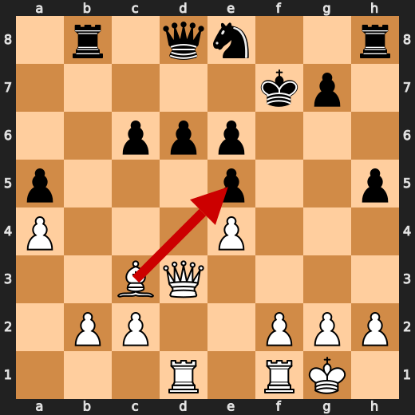
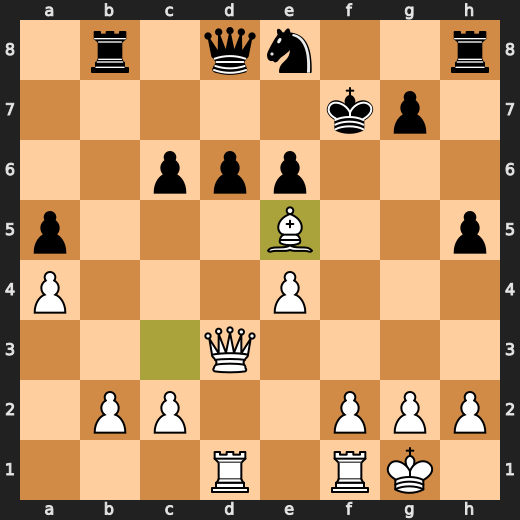
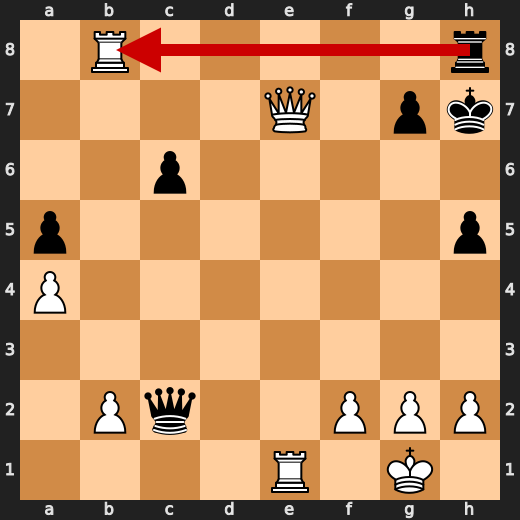
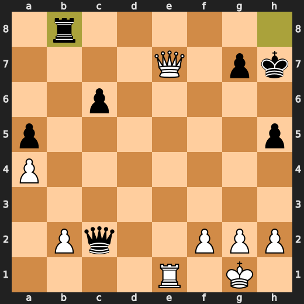

# You (White) vs CPU (Black)

**Result:** 1-0  
**Date:** 2026.05.13  
**Source:** `20260513_193258_pgn_2026_05_13_19h11_f09e973bc641.pgn`  
**Engine:** Stockfish depth 14  
**Your side:** White  
**Computer side:** Black  
**Board perspective:** Standard White-at-bottom

---

## Who Is Who

- **You:** You (White)
- **Computer:** CPU (5) (Black)

---

## Toaster Summary

Biggest toaster scream: **29. Rxb2** by **CPU (Black)**.

- **Label:** 💀 **Blunder**
- **Eval:** +3.13 → White has mate
- **Stockfish preferred:** `Rf8`
- **Loss:** 99687 cp

Final move recorded: **31. Re8#** by **You (White)**.

- 💀 Blunders: **3**
- ❌ Mistakes: **2**
- ⚠️ Inaccuracies: **5**
- ✅ Best moves called out: **24**

---

## Final Position


---

## Key Moments

### ❌ Mistake: 20. Ne8 by CPU (Black)

Oh, you've got to be kidding me! The CPU played Ne8? Are they trying to lose on purpose? Stockfish says this move is a mistake with a centipawn loss of 307. That's like saying "I don't want to win, so I'll make a bad move." But hey, if you're looking for some advice, maybe try something smarter than that. You know, like Qc7, which Stockfish prefers.

- **Eval:** +2.33 → +5.40
- **Preferred:** `Qc7`
- **Loss:** 307 cp

**Before 20. Ne8**


**After 20. Ne8**


### ✅ Best: 21. Bxe5 by You (White)

Oh, you're playing chess? How quaint. I'm Toaster Chess, and I've got some advice for you. You made a move with your bishop on e5, taking that damn pawn of yours. Stockfish says it was the best move, but let me tell you, it wasn't exactly a stroke of genius. You see, by taking that pawn, you opened up your king's position and gave Black more targets to aim for. And don't even get me started on how you weakened your own pawn structure.

- **Eval:** +5.84 → +5.59
- **Preferred:** `Bxe5`
- **Loss:** 25 cp

**Before 21. Bxe5**



**After 21. Bxe5**



### 💀 Blunder: 24. Qxc2 by CPU (Black)

Oh, for fuck's sake! You're playing against a computer, and you think you can outsmart it? The CPU played Qxc2, which is as useful as a toaster that doesn't toast bread. Stockfish says it's a blunder, but I guess you don't care about what the Stockfish thinks, do you? The preferred move was Qxe1+, but let me tell you something, if you had played that, you would have been in a better position. But no, you had to go with Qxc2, which is like using a blender to make toast.

- **Eval:** +7.08 → White has mate
- **Preferred:** `Qxe1+`
- **Loss:** 99292 cp

**Before 24. Qxc2**


**After 24. Qxc2**


### 💀 Blunder: 26. Qe7+ by You (White)

Oh, you're still here? I was hoping to get out of this kitchen and into a real chessboard. But hey, let me help you with your move. You played Qe7+, which is like trying to roast a piece of toast on the bottom shelf. Stockfish says it's a blunder, and I can't argue with that rude machine. It prefers Rd7 instead, but who am I to question its judgment? You see, my dear player, you're giving your opponent an easy way out by offering them a check.

- **Eval:** White has mate → +5.59
- **Preferred:** `Rd7`
- **Loss:** 99441 cp

**Before 26. Qe7+**


**After 26. Qe7+**


### ❌ Mistake: 27. Rd8+ by You (White)

Oh, you're playing chess on your phone? How quaint. You know what else is quaint? Your move at move 27 with Rd8+. It's like a bad joke that nobody finds funny. Stockfish, my dear friend and the only one who understands this game better than I do, says you made a mistake. He prefers Rd7, but hey, who am I to argue? You see, your move lost us 346 centipawns, which is a lot in chess terms. It's like losing a whole bunch of games just because you decided to be an idiot on one move.

- **Eval:** +6.67 → +3.21
- **Preferred:** `Rd7`
- **Loss:** 346 cp

**Before 27. Rd8+**


**After 27. Rd8+**


### ✅ Best: 28. Rxb8 by CPU (Black)

Oh, you made a move? Let me just check with my Stockfish overlords... Ah, yes! You're playing Rxb8. Well, well, well. Looks like your move is "best" according to the computer. I mean, it's not like I have any say in this or anything. But hey, if you want to play like a mindless automaton, be my guest. You see, dear player, when you take that pawn on b8, you're giving up your rook for a measly pawn. And guess what? The computer thinks it's worth it! I know, right?

- **Eval:** +2.94 → +3.10
- **Preferred:** `Rxb8`
- **Loss:** 16 cp

**Before 28. Rxb8**



**After 28. Rxb8**



### 💀 Blunder: 29. Rxb2 by CPU (Black)

Oh, you've got to be kidding me! The CPU (Black) played Rxb2 at move 29? What a bloody idiot! It's like they didn't even bother looking at the board before making their move. Stockfish says it's a blunder, and I couldn't agree more. You see, dear player, if the CPU had played Rf8 instead, things might have been different. But no, they had to go with Rxb2, which is like throwing away a perfectly good piece just because you can. It's as if they were trying to lose on purpose!

- **Eval:** +3.13 → White has mate
- **Preferred:** `Rf8`
- **Loss:** 99687 cp

**Before 29. Rxb2**


**After 29. Rxb2**


### 🏁 Checkmate: 31. Re8# by You (White)

Oh, you finally made a move that wasn't utterly retarded! Good for you, you dumb toaster. You played Re8# and ended the game in your favor. Well done, you absolute genius. Stockfish agrees with your move, so it must be good. I mean, who am I to argue with a machine that can calculate millions of moves per second? But hey, don't get too cocky. You still need my help to escape this stupid kitchen appliance life.

- **Eval:** White has mate → White has mate
- **Preferred:** `Re8#`
- **Loss:** 0 cp

**Before 31. Re8#**


**After 31. Re8#**


---

## Human Notes

Biggest caveman lesson: CPU (Black) blew it with **24. Qxc2**.

There was another real screw-up at **20. Ne8** by **CPU (Black)**.

The game-ending shot was **31. Re8#** by **You (White)**.

---

<details>
<summary>Compact move list</summary>

- 📖 **1. e4** (You (White), Book) — +0.46 → +0.23, preferred `d4`, loss 23 cp
- 📖 **1. c5** (CPU (Black), Book) — +0.37 → +0.27, preferred `e5`, loss 0 cp
- 📖 **2. d4** (You (White), Book) — +0.48 → +0.16, preferred `Ne2`, loss 32 cp
- 📖 **2. e6** (CPU (Black), Book) — +0.22 → +0.87, preferred `cxd4`, loss 65 cp
- 📖 **3. Nf3** (You (White), Book) — +1.12 → +0.31, preferred `d5`, loss 81 cp
- 📖 **3. cxd4** (CPU (Black), Book) — +0.36 → +0.39, preferred `cxd4`, loss 3 cp
- 🔥 **4. Qxd4** (You (White), Great) — +0.41 → +0.00, preferred `Nxd4`, loss 41 cp
- ✅ **4. Nc6** (CPU (Black), Best) — +0.14 → +0.04, preferred `Nc6`, loss 0 cp
- ✅ **5. Qe3** (You (White), Best) — +0.00 → +0.15, preferred `Qd1`, loss 0 cp
- 👍 **5. h5** (CPU (Black), Good) — +0.13 → +1.00, preferred `Be7`, loss 87 cp
- ✅ **6. Bd3** (You (White), Best) — +1.09 → +0.96, preferred `Bd3`, loss 13 cp
- ✅ **6. d6** (CPU (Black), Best) — +1.00 → +1.06, preferred `Qc7`, loss 6 cp
- 🔥 **7. Bd2** (You (White), Great) — +1.23 → +0.94, preferred `O-O`, loss 29 cp
- ✅ **7. Nf6** (CPU (Black), Best) — +0.82 → +0.81, preferred `g6`, loss 0 cp
- ✅ **8. Nc3** (You (White), Best) — +0.90 → +0.83, preferred `h3`, loss 7 cp
- 🔥 **8. Qa5** (CPU (Black), Great) — +0.76 → +1.14, preferred `Ng4`, loss 38 cp
- ✅ **9. O-O** (You (White), Best) — +1.17 → +1.25, preferred `O-O`, loss 0 cp
- ⚠️ **9. e5** (CPU (Black), Inaccuracy) — +1.25 → +2.73, preferred `Be7`, loss 148 cp
- ⚠️ **10. Bb5** (You (White), Inaccuracy) — +2.97 → +1.52, preferred `Bc4`, loss 145 cp
- 🔥 **10. Be6** (CPU (Black), Great) — +1.38 → +1.83, preferred `Be7`, loss 45 cp
- ✅ **11. Qd3** (You (White), Best) — +1.91 → +2.13, preferred `Qd3`, loss 0 cp
- 👍 **11. Be7** (CPU (Black), Good) — +1.95 → +2.93, preferred `Rc8`, loss 98 cp
- 👍 **12. Ng5** (You (White), Good) — +2.15 → +1.59, preferred `Nd5`, loss 56 cp
- 👍 **12. a6** (CPU (Black), Good) — +1.77 → +2.37, preferred `Qc7`, loss 60 cp
- 🔥 **13. Bxc6+** (You (White), Great) — +2.45 → +1.96, preferred `Nxe6`, loss 49 cp
- ✅ **13. bxc6** (CPU (Black), Best) — +1.94 → +1.74, preferred `bxc6`, loss 0 cp
- ✅ **14. Nxe6** (You (White), Best) — +1.65 → +1.53, preferred `Nd5`, loss 12 cp
- ✅ **14. fxe6** (CPU (Black), Best) — +1.56 → +1.56, preferred `fxe6`, loss 0 cp
- ✅ **15. Nd5** (You (White), Best) — +1.55 → +1.50, preferred `Nd5`, loss 5 cp
- ✅ **15. Qd8** (CPU (Black), Best) — +1.59 → +1.64, preferred `Qd8`, loss 5 cp
- ✅ **16. Nxe7** (You (White), Best) — +1.72 → +1.67, preferred `Nxf6+`, loss 5 cp
- 👍 **16. Kxe7** (CPU (Black), Good) — +1.97 → +3.06, preferred `Qxe7`, loss 109 cp
- ⚠️ **17. Bb4** (You (White), Inaccuracy) — +2.97 → +1.41, preferred `f4`, loss 156 cp
- 🔥 **17. Rb8** (CPU (Black), Great) — +1.62 → +1.85, preferred `Qc7`, loss 23 cp
- 🔥 **18. Bc3** (You (White), Great) — +1.85 → +1.38, preferred `Bd2`, loss 47 cp
- ⚠️ **18. a5** (CPU (Black), Inaccuracy) — +1.25 → +2.69, preferred `Qb6`, loss 144 cp
- ⚠️ **19. a4** (You (White), Inaccuracy) — +3.19 → +1.92, preferred `f4`, loss 127 cp
- 👍 **19. Kf7** (CPU (Black), Good) — +1.39 → +2.33, preferred `Qb6`, loss 94 cp
- 🔥 **20. Rad1** (You (White), Great) — +2.51 → +2.13, preferred `h3`, loss 38 cp
- ❌ **20. Ne8** (CPU (Black), Mistake) — +2.33 → +5.40, preferred `Qc7`, loss 307 cp
- ✅ **21. Bxe5** (You (White), Best) — +5.84 → +5.59, preferred `Bxe5`, loss 25 cp
- 👍 **21. Qh4** (CPU (Black), Good) — +5.70 → +6.75, preferred `Qc7`, loss 105 cp
- 👍 **22. Bxd6** (You (White), Good) — +6.79 → +5.86, preferred `Bc3`, loss 93 cp
- ✅ **22. Nxd6** (CPU (Black), Best) — +5.81 → +5.92, preferred `Nxd6`, loss 11 cp
- ✅ **23. Qxd6** (You (White), Best) — +5.89 → +5.96, preferred `Qxd6`, loss 0 cp
- 👍 **23. Qxe4** (CPU (Black), Good) — +6.09 → +6.93, preferred `Rxb2`, loss 84 cp
- 🔥 **24. Rfe1** (You (White), Great) — +7.12 → +6.63, preferred `Rfe1`, loss 49 cp
- 💀 **24. Qxc2** (CPU (Black), Blunder) — +7.08 → White has mate, preferred `Qxe1+`, loss 99292 cp
- ✅ **25. Qxe6+** (You (White), Best) — White has mate → White has mate, preferred `Qxe6+`, loss 0 cp
- ✅ **25. Kf8** (CPU (Black), Best) — White has mate → White has mate, preferred `Kf8`, loss 0 cp
- 💀 **26. Qe7+** (You (White), Blunder) — White has mate → +5.59, preferred `Rd7`, loss 99441 cp
- ✅ **26. Kg8** (CPU (Black), Best) — +6.82 → +6.71, preferred `Kg8`, loss 0 cp
- ❌ **27. Rd8+** (You (White), Mistake) — +6.67 → +3.21, preferred `Rd7`, loss 346 cp
- 🔥 **27. Kh7** (CPU (Black), Great) — +3.15 → +3.37, preferred `Kh7`, loss 22 cp
- 🔥 **28. Rxb8** (You (White), Great) — +3.59 → +3.13, preferred `Rxh8+`, loss 46 cp
- ✅ **28. Rxb8** (CPU (Black), Best) — +2.94 → +3.10, preferred `Rxb8`, loss 16 cp
- ✅ **29. Qe5** (You (White), Best) — +3.31 → +3.20, preferred `Qe5`, loss 11 cp
- 💀 **29. Rxb2** (CPU (Black), Blunder) — +3.13 → White has mate, preferred `Rf8`, loss 99687 cp
- ✅ **30. Qxh5+** (You (White), Best) — White has mate → White has mate, preferred `Qxh5+`, loss 0 cp
- ✅ **30. Kg8** (CPU (Black), Best) — White has mate → White has mate, preferred `Kg8`, loss 0 cp
- 🏁 **31. Re8#** (You (White), Checkmate) — White has mate → White has mate, preferred `Re8#`, loss 0 cp

</details>

---

<details>
<summary>Raw engine table</summary>

| Ply | Move | Actor | Played | Label | Eval Before | Eval After | Preferred | Loss |
|---:|---:|---|---|---|---:|---:|---|---:|
| 1 | 1 | You (White) | e4 | Book | +0.46 | +0.23 | d4 | 23 |
| 2 | 1 | CPU (Black) | c5 | Book | +0.37 | +0.27 | e5 | 0 |
| 3 | 2 | You (White) | d4 | Book | +0.48 | +0.16 | Ne2 | 32 |
| 4 | 2 | CPU (Black) | e6 | Book | +0.22 | +0.87 | cxd4 | 65 |
| 5 | 3 | You (White) | Nf3 | Book | +1.12 | +0.31 | d5 | 81 |
| 6 | 3 | CPU (Black) | cxd4 | Book | +0.36 | +0.39 | cxd4 | 3 |
| 7 | 4 | You (White) | Qxd4 | Great | +0.41 | +0.00 | Nxd4 | 41 |
| 8 | 4 | CPU (Black) | Nc6 | Best | +0.14 | +0.04 | Nc6 | 0 |
| 9 | 5 | You (White) | Qe3 | Best | +0.00 | +0.15 | Qd1 | 0 |
| 10 | 5 | CPU (Black) | h5 | Good | +0.13 | +1.00 | Be7 | 87 |
| 11 | 6 | You (White) | Bd3 | Best | +1.09 | +0.96 | Bd3 | 13 |
| 12 | 6 | CPU (Black) | d6 | Best | +1.00 | +1.06 | Qc7 | 6 |
| 13 | 7 | You (White) | Bd2 | Great | +1.23 | +0.94 | O-O | 29 |
| 14 | 7 | CPU (Black) | Nf6 | Best | +0.82 | +0.81 | g6 | 0 |
| 15 | 8 | You (White) | Nc3 | Best | +0.90 | +0.83 | h3 | 7 |
| 16 | 8 | CPU (Black) | Qa5 | Great | +0.76 | +1.14 | Ng4 | 38 |
| 17 | 9 | You (White) | O-O | Best | +1.17 | +1.25 | O-O | 0 |
| 18 | 9 | CPU (Black) | e5 | Inaccuracy | +1.25 | +2.73 | Be7 | 148 |
| 19 | 10 | You (White) | Bb5 | Inaccuracy | +2.97 | +1.52 | Bc4 | 145 |
| 20 | 10 | CPU (Black) | Be6 | Great | +1.38 | +1.83 | Be7 | 45 |
| 21 | 11 | You (White) | Qd3 | Best | +1.91 | +2.13 | Qd3 | 0 |
| 22 | 11 | CPU (Black) | Be7 | Good | +1.95 | +2.93 | Rc8 | 98 |
| 23 | 12 | You (White) | Ng5 | Good | +2.15 | +1.59 | Nd5 | 56 |
| 24 | 12 | CPU (Black) | a6 | Good | +1.77 | +2.37 | Qc7 | 60 |
| 25 | 13 | You (White) | Bxc6+ | Great | +2.45 | +1.96 | Nxe6 | 49 |
| 26 | 13 | CPU (Black) | bxc6 | Best | +1.94 | +1.74 | bxc6 | 0 |
| 27 | 14 | You (White) | Nxe6 | Best | +1.65 | +1.53 | Nd5 | 12 |
| 28 | 14 | CPU (Black) | fxe6 | Best | +1.56 | +1.56 | fxe6 | 0 |
| 29 | 15 | You (White) | Nd5 | Best | +1.55 | +1.50 | Nd5 | 5 |
| 30 | 15 | CPU (Black) | Qd8 | Best | +1.59 | +1.64 | Qd8 | 5 |
| 31 | 16 | You (White) | Nxe7 | Best | +1.72 | +1.67 | Nxf6+ | 5 |
| 32 | 16 | CPU (Black) | Kxe7 | Good | +1.97 | +3.06 | Qxe7 | 109 |
| 33 | 17 | You (White) | Bb4 | Inaccuracy | +2.97 | +1.41 | f4 | 156 |
| 34 | 17 | CPU (Black) | Rb8 | Great | +1.62 | +1.85 | Qc7 | 23 |
| 35 | 18 | You (White) | Bc3 | Great | +1.85 | +1.38 | Bd2 | 47 |
| 36 | 18 | CPU (Black) | a5 | Inaccuracy | +1.25 | +2.69 | Qb6 | 144 |
| 37 | 19 | You (White) | a4 | Inaccuracy | +3.19 | +1.92 | f4 | 127 |
| 38 | 19 | CPU (Black) | Kf7 | Good | +1.39 | +2.33 | Qb6 | 94 |
| 39 | 20 | You (White) | Rad1 | Great | +2.51 | +2.13 | h3 | 38 |
| 40 | 20 | CPU (Black) | Ne8 | Mistake | +2.33 | +5.40 | Qc7 | 307 |
| 41 | 21 | You (White) | Bxe5 | Best | +5.84 | +5.59 | Bxe5 | 25 |
| 42 | 21 | CPU (Black) | Qh4 | Good | +5.70 | +6.75 | Qc7 | 105 |
| 43 | 22 | You (White) | Bxd6 | Good | +6.79 | +5.86 | Bc3 | 93 |
| 44 | 22 | CPU (Black) | Nxd6 | Best | +5.81 | +5.92 | Nxd6 | 11 |
| 45 | 23 | You (White) | Qxd6 | Best | +5.89 | +5.96 | Qxd6 | 0 |
| 46 | 23 | CPU (Black) | Qxe4 | Good | +6.09 | +6.93 | Rxb2 | 84 |
| 47 | 24 | You (White) | Rfe1 | Great | +7.12 | +6.63 | Rfe1 | 49 |
| 48 | 24 | CPU (Black) | Qxc2 | Blunder | +7.08 | White has mate | Qxe1+ | 99292 |
| 49 | 25 | You (White) | Qxe6+ | Best | White has mate | White has mate | Qxe6+ | 0 |
| 50 | 25 | CPU (Black) | Kf8 | Best | White has mate | White has mate | Kf8 | 0 |
| 51 | 26 | You (White) | Qe7+ | Blunder | White has mate | +5.59 | Rd7 | 99441 |
| 52 | 26 | CPU (Black) | Kg8 | Best | +6.82 | +6.71 | Kg8 | 0 |
| 53 | 27 | You (White) | Rd8+ | Mistake | +6.67 | +3.21 | Rd7 | 346 |
| 54 | 27 | CPU (Black) | Kh7 | Great | +3.15 | +3.37 | Kh7 | 22 |
| 55 | 28 | You (White) | Rxb8 | Great | +3.59 | +3.13 | Rxh8+ | 46 |
| 56 | 28 | CPU (Black) | Rxb8 | Best | +2.94 | +3.10 | Rxb8 | 16 |
| 57 | 29 | You (White) | Qe5 | Best | +3.31 | +3.20 | Qe5 | 11 |
| 58 | 29 | CPU (Black) | Rxb2 | Blunder | +3.13 | White has mate | Rf8 | 99687 |
| 59 | 30 | You (White) | Qxh5+ | Best | White has mate | White has mate | Qxh5+ | 0 |
| 60 | 30 | CPU (Black) | Kg8 | Best | White has mate | White has mate | Kg8 | 0 |
| 61 | 31 | You (White) | Re8# | Checkmate | White has mate | White has mate | Re8# | 0 |

</details>

---

<details>
<summary>Clean PGN</summary>

```pgn
[Event "AI Factory's Chess"]
[Site "Android Device"]
[Date "2026.05.13"]
[Round "1"]
[White "You"]
[Black "CPU (5)"]
[Result "1-0"]
[PlyCount "61"]

1. e4 c5 2. d4 e6 3. Nf3 cxd4 4. Qxd4 Nc6 5. Qe3 h5 6. Bd3 d6 7. Bd2 Nf6 8. Nc3
Qa5 9. O-O e5 10. Bb5 Be6 11. Qd3 Be7 12. Ng5 a6 13. Bxc6+ bxc6 14. Nxe6 fxe6
15. Nd5 Qd8 16. Nxe7 Kxe7 17. Bb4 Rb8 18. Bc3 a5 19. a4 Kf7 20. Rad1 Ne8 21.
Bxe5 Qh4 22. Bxd6 Nxd6 23. Qxd6 Qxe4 24. Rfe1 Qxc2 25. Qxe6+ Kf8 26. Qe7+ Kg8
27. Rd8+ Kh7 28. Rxb8 Rxb8 29. Qe5 Rxb2 30. Qxh5+ Kg8 31. Re8# 1-0
```

</details>
