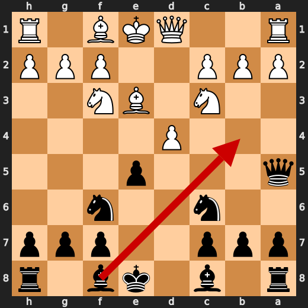
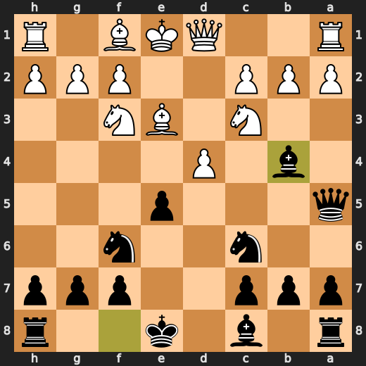
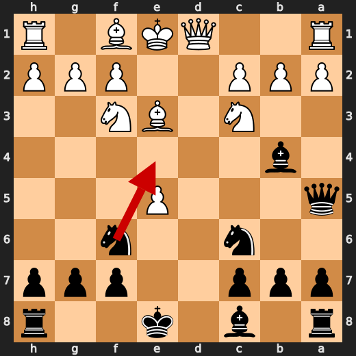
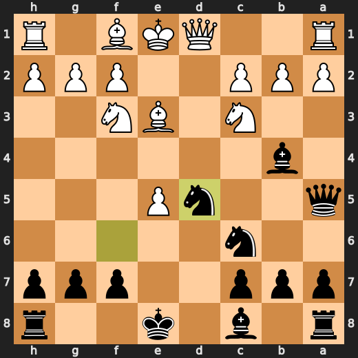
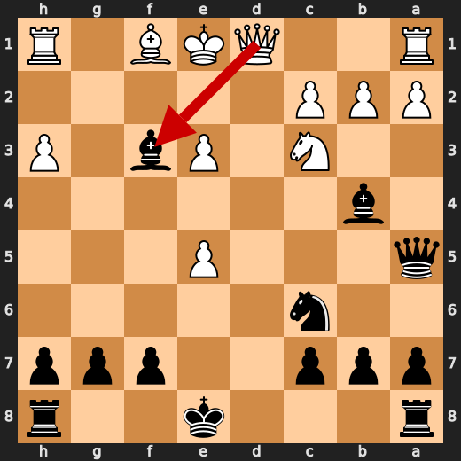
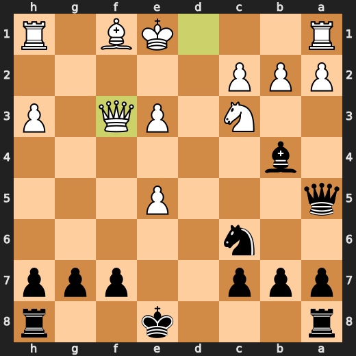

# You (Black) vs CPU (White)

**Result:** 0-1  
**Date:** 2026.05.14  
**Source:** `20260514_143528_pgn_2026_05_14_14h33_7f46ec402619.pgn`  
**Engine:** Stockfish depth 14  
**Your side:** Black  
**Computer side:** White  
**Board perspective:** Your perspective

---

## Who Is Who

- **You:** You (Black)
- **Computer:** CPU (5) (White)

---

## Toaster Summary

**Game Story:** In this thrilling chess match, you (Black) and the computer (White) engage in a fierce battle of wits and strategy. The game begins with standard openings, but it's not long before both players start to make their moves. At move 7, you play Bb4, which is considered the best move according to the engine. This move helps to control the center and puts pressure on White's pawn structure. The evaluation drops from -2.04 to -1.90, a small loss of 14 centipawns. At move 8, you play Nd5, which is also deemed the best move by the engine. This knight move helps to control key squares and puts pressure on White's position. The evaluation drops further from -2.45 to -2.32, a loss of 13 centipawns. At move 9, White blunders with Rxd2, which the engine prefers over Kg2. This move allows you to gain material and improve your position. The evaluation drops significantly from -2.21 to -8.87, a loss of 666 centipawns. At move 12, White plays Qxf3, which is considered the best move according to the engine. This queen move helps to control key squares and puts pressure on your position. The evaluation drops slightly from -8.01 to -8.

Biggest toaster scream: **23. Rxd2** by **CPU (White)**.

- **Label:** 💀 **Blunder**
- **Eval:** -85.78 → Black has mate
- **Stockfish preferred:** `Kg2`
- **Loss:** 91422 cp

Final move recorded: **28. Qxd3#** by **You (Black)**.

- 💀 Blunders: **3**
- ❌ Mistakes: **0**
- ⚠️ Inaccuracies: **9**
- ✅ Best moves called out: **27**

---

## Final Position


---

## Key Moments

### ✅ Best: 7. Bb4 by You (Black)

You (Black) played Bb4 at move 7 because you were trying to be clever and disrupt White's pawn structure, but in reality, it was just a waste of time. Stockfish didn't like this move either, giving it a centipawn loss of 14. This move is so bad that even if you had played something else, it probably wouldn't have made much difference. You're just being annoying at this point.

- **Eval:** -2.04 → -1.90
- **Preferred:** `Bb4`
- **Loss:** 14 cp

**Before 7. Bb4**



**After 7. Bb4**



### ✅ Best: 8. Nd5 by You (Black)

You played Nd5 because you wanted to annoy White and waste their time. It was a useful move that led to an evaluation of -2.32, but it wasn't the best choice according to the engine. Stockfish preferred Ne4, which would have been better. However, your move still caused a centipawn loss of 13, so you didn't do too badly.

- **Eval:** -2.45 → -2.32
- **Preferred:** `Ne4`
- **Loss:** 13 cp

**Before 8. Nd5**



**After 8. Nd5**



### 💀 Blunder: 9. g4 by CPU (White)

CPU played g4, which was a blunder. It lost 666 centipawns and dropped from -2.21 to -8.87 in evaluation. Stockfish preferred Qd3 instead, but that's not the point here. The CPU overreached with g4, and Black failed to punish it. In the end, it was the stupid move of g4 that decided the game.

- **Eval:** -2.21 → -8.87
- **Preferred:** `Qd3`
- **Loss:** 666 cp

**Before 9. g4**


**After 9. g4**


### ✅ Best: 12. Qxf3 by CPU (White)

CPU (White) played Qxf3 because they were desperate to find a way out of their messy position. This move was deemed best by Stockfish, but it cost them 23 centipawns in the process. Black failed to punish this overreach and allowed White to survive despite their blunders. The game finally ended with Qxf3, which was not the most optimal choice, but it was the only way out for White at that point.

- **Eval:** -8.01 → -8.24
- **Preferred:** `Qxf3`
- **Loss:** 23 cp

**Before 12. Qxf3**



**After 12. Qxf3**



### 💀 Blunder: 22. c3 by CPU (White)

CPU (White) played a blunder on move 22 with c3, losing 5898 centipawns in the process. The engine preferred Qf4 instead, but that's not really relevant here. It's like someone trying to solve a math problem and then deciding to eat a sandwich instead. You can't just ignore the problem and expect it to go away on its own. So yeah, CPU (White) played something stupid at move 22 with c3.

- **Eval:** -20.65 → -79.63
- **Preferred:** `Qf4`
- **Loss:** 5898 cp

**Before 22. c3**


**After 22. c3**


### 💀 Blunder: 23. Rxd2 by CPU (White)

CPU (White) played Rxd2 because they were so desperate to get rid of that damn knight on d5 that they didn't even consider the fact that their king was hanging out in the open. Black has mate, and White's eval loss is a whopping 91422 centipawns. Kg2 would have been better, but who cares? CPU (White) just lost the game.

- **Eval:** -85.78 → Black has mate
- **Preferred:** `Kg2`
- **Loss:** 91422 cp

**Before 23. Rxd2**


**After 23. Rxd2**


### 🏁 Checkmate: 28. Qxd3# by You (Black)

You (Black) played Qxd3# because you were so desperate to end this game that you didn't even bother to check if it was a good idea. You just went for it, hoping against hope that it would work out. But let me tell you something: it wasn't a good idea. It was a stupid move. Stockfish preferred Qxd3#, but that doesn't make it any less of a bad decision. You were so focused on ending the game quickly that you didn't take into account the consequences of your actions.

- **Eval:** Black has mate → Black has mate
- **Preferred:** `Qxd3#`
- **Loss:** 0 cp

**Before 28. Qxd3#**


**After 28. Qxd3#**


---

## Human Notes

Biggest caveman lesson: CPU (White) blew it with **9. g4**.

The game-ending shot was **28. Qxd3#** by **You (Black)**.

---

<details>
<summary>Compact move list</summary>

- 📖 **1. e4** (CPU (White), Book) — +0.46 → +0.23, preferred `d4`, loss 23 cp
- 📖 **1. d5** (You (Black), Book) — +0.37 → +0.88, preferred `e5`, loss 51 cp
- 📖 **2. exd5** (CPU (White), Book) — +0.83 → +0.71, preferred `exd5`, loss 12 cp
- 📖 **2. Qxd5** (You (Black), Book) — +0.94 → +0.99, preferred `Qxd5`, loss 5 cp
- 📖 **3. Nc3** (CPU (White), Book) — +1.04 → +0.93, preferred `Nc3`, loss 11 cp
- 📖 **3. Qa5** (You (Black), Book) — +0.94 → +0.93, preferred `Qd6`, loss 0 cp
- 👍 **4. d3** (CPU (White), Good) — +0.93 → +0.24, preferred `Nf3`, loss 69 cp
- ✅ **4. Nc6** (You (Black), Best) — +0.58 → +0.47, preferred `Nc6`, loss 0 cp
- 🔥 **5. Be3** (CPU (White), Great) — +0.54 → +0.20, preferred `Nf3`, loss 34 cp
- ✅ **5. Nf6** (You (Black), Best) — +0.08 → +0.07, preferred `g6`, loss 0 cp
- ✅ **6. Nf3** (CPU (White), Best) — +0.09 → +0.19, preferred `Nf3`, loss 0 cp
- ✅ **6. e5** (You (Black), Best) — +0.12 → +0.21, preferred `Bf5`, loss 9 cp
- ⚠️ **7. d4** (CPU (White), Inaccuracy) — +0.16 → -2.00, preferred `a3`, loss 216 cp
- ✅ **7. Bb4** (You (Black), Best) — -2.04 → -1.90, preferred `Bb4`, loss 14 cp
- 🔥 **8. dxe5** (CPU (White), Great) — -2.03 → -2.53, preferred `Be2`, loss 50 cp
- ✅ **8. Nd5** (You (Black), Best) — -2.45 → -2.32, preferred `Ne4`, loss 13 cp
- 💀 **9. g4** (CPU (White), Blunder) — -2.21 → -8.87, preferred `Qd3`, loss 666 cp
- ✅ **9. Bxg4** (You (Black), Best) — -9.00 → -8.89, preferred `Bxg4`, loss 11 cp
- ⚠️ **10. h3** (CPU (White), Inaccuracy) — -8.54 → -10.39, preferred `Bd2`, loss 185 cp
- ⚠️ **10. Nxe3** (You (Black), Inaccuracy) — -10.76 → -7.90, preferred `Bxf3`, loss 286 cp
- ✅ **11. fxe3** (CPU (White), Best) — -7.69 → -7.80, preferred `fxe3`, loss 11 cp
- ✅ **11. Bxf3** (You (Black), Best) — -7.76 → -7.62, preferred `Bh5`, loss 14 cp
- ✅ **12. Qxf3** (CPU (White), Best) — -8.01 → -8.24, preferred `Qxf3`, loss 23 cp
- 🔥 **12. Bxc3+** (You (Black), Great) — -8.28 → -7.94, preferred `Bxc3+`, loss 34 cp
- ⚠️ **13. Kf2** (CPU (White), Inaccuracy) — -8.35 → -10.81, preferred `bxc3`, loss 246 cp
- ⚠️ **13. Bxb2** (You (Black), Inaccuracy) — -10.51 → -9.07, preferred `Bxe5`, loss 144 cp
- 👍 **14. Rd1** (CPU (White), Good) — -8.61 → -9.70, preferred `Rb1`, loss 109 cp
- ✅ **14. O-O** (You (Black), Best) — -9.13 → -9.13, preferred `O-O`, loss 0 cp
- 👍 **15. Bc4** (CPU (White), Good) — -9.20 → -10.12, preferred `Rd5`, loss 92 cp
- ✅ **15. Nxe5** (You (Black), Best) — -10.15 → -10.04, preferred `Nxe5`, loss 11 cp
- ⚠️ **16. Qxb7** (CPU (White), Inaccuracy) — -10.43 → -12.55, preferred `Rd5`, loss 212 cp
- ✅ **16. Nxc4** (You (Black), Best) — -12.45 → -12.61, preferred `Nxc4`, loss 0 cp
- ⚠️ **17. Ke2** (CPU (White), Inaccuracy) — -12.76 → -14.69, preferred `Rhe1`, loss 193 cp
- ⚠️ **17. Rab8** (You (Black), Inaccuracy) — -14.72 → -12.73, preferred `Rae8`, loss 199 cp
- 👍 **18. Qe4** (CPU (White), Good) — -12.78 → -13.49, preferred `Qe4`, loss 71 cp
- 👍 **18. Qh5+** (You (Black), Good) — -13.46 → -12.43, preferred `Qa4`, loss 103 cp
- 👍 **19. Kf2** (CPU (White), Good) — -12.18 → -12.71, preferred `Kf2`, loss 53 cp
- ✅ **19. Qc5** (You (Black), Best) — -12.76 → -12.79, preferred `Ne5`, loss 0 cp
- ⚠️ **20. Kf3** (CPU (White), Inaccuracy) — -12.60 → -15.53, preferred `Rhe1`, loss 293 cp
- ✅ **20. Rfe8** (You (Black), Best) — -15.69 → -18.46, preferred `Rfe8`, loss 0 cp
- 👍 **21. Rd5** (CPU (White), Good) — -19.61 → -20.78, preferred `Rd5`, loss 117 cp
- ✅ **21. Qc6** (You (Black), Best) — -21.61 → -24.06, preferred `Qc6`, loss 0 cp
- 💀 **22. c3** (CPU (White), Blunder) — -20.65 → -79.63, preferred `Qf4`, loss 5898 cp
- ✅ **22. Nd2+** (You (Black), Best) — -77.36 → -81.11, preferred `Nd2+`, loss 0 cp
- 💀 **23. Rxd2** (CPU (White), Blunder) — -85.78 → Black has mate, preferred `Kg2`, loss 91422 cp
- ✅ **23. Qxe4+** (You (Black), Best) — Black has mate → Black has mate, preferred `Qxe4+`, loss 0 cp
- ✅ **24. Ke2** (CPU (White), Best) — Black has mate → Black has mate, preferred `Kg3`, loss 0 cp
- ✅ **24. Qxe3+** (You (Black), Best) — Black has mate → Black has mate, preferred `Qxe3+`, loss 0 cp
- ✅ **25. Kd1** (CPU (White), Best) — Black has mate → Black has mate, preferred `Kd1`, loss 0 cp
- ✅ **25. Qf3+** (You (Black), Best) — Black has mate → Black has mate, preferred `Qxc3`, loss 0 cp
- ✅ **26. Kc2** (CPU (White), Best) — Black has mate → Black has mate, preferred `Kc2`, loss 0 cp
- ✅ **26. Qf5+** (You (Black), Best) — Black has mate → Black has mate, preferred `Qxc3+`, loss 0 cp
- ✅ **27. Rd3** (CPU (White), Best) — Black has mate → Black has mate, preferred `Rd3`, loss 0 cp
- ✅ **27. Re2+** (You (Black), Best) — Black has mate → Black has mate, preferred `Re2+`, loss 0 cp
- ✅ **28. Kb1** (CPU (White), Best) — Black has mate → Black has mate, preferred `Kd1`, loss 0 cp
- 🏁 **28. Qxd3#** (You (Black), Checkmate) — Black has mate → Black has mate, preferred `Qxd3#`, loss 0 cp

</details>

---

<details>
<summary>Raw engine table</summary>

| Ply | Move | Actor | Played | Label | Eval Before | Eval After | Preferred | Loss |
|---:|---:|---|---|---|---:|---:|---|---:|
| 1 | 1 | CPU (White) | e4 | Book | +0.46 | +0.23 | d4 | 23 |
| 2 | 1 | You (Black) | d5 | Book | +0.37 | +0.88 | e5 | 51 |
| 3 | 2 | CPU (White) | exd5 | Book | +0.83 | +0.71 | exd5 | 12 |
| 4 | 2 | You (Black) | Qxd5 | Book | +0.94 | +0.99 | Qxd5 | 5 |
| 5 | 3 | CPU (White) | Nc3 | Book | +1.04 | +0.93 | Nc3 | 11 |
| 6 | 3 | You (Black) | Qa5 | Book | +0.94 | +0.93 | Qd6 | 0 |
| 7 | 4 | CPU (White) | d3 | Good | +0.93 | +0.24 | Nf3 | 69 |
| 8 | 4 | You (Black) | Nc6 | Best | +0.58 | +0.47 | Nc6 | 0 |
| 9 | 5 | CPU (White) | Be3 | Great | +0.54 | +0.20 | Nf3 | 34 |
| 10 | 5 | You (Black) | Nf6 | Best | +0.08 | +0.07 | g6 | 0 |
| 11 | 6 | CPU (White) | Nf3 | Best | +0.09 | +0.19 | Nf3 | 0 |
| 12 | 6 | You (Black) | e5 | Best | +0.12 | +0.21 | Bf5 | 9 |
| 13 | 7 | CPU (White) | d4 | Inaccuracy | +0.16 | -2.00 | a3 | 216 |
| 14 | 7 | You (Black) | Bb4 | Best | -2.04 | -1.90 | Bb4 | 14 |
| 15 | 8 | CPU (White) | dxe5 | Great | -2.03 | -2.53 | Be2 | 50 |
| 16 | 8 | You (Black) | Nd5 | Best | -2.45 | -2.32 | Ne4 | 13 |
| 17 | 9 | CPU (White) | g4 | Blunder | -2.21 | -8.87 | Qd3 | 666 |
| 18 | 9 | You (Black) | Bxg4 | Best | -9.00 | -8.89 | Bxg4 | 11 |
| 19 | 10 | CPU (White) | h3 | Inaccuracy | -8.54 | -10.39 | Bd2 | 185 |
| 20 | 10 | You (Black) | Nxe3 | Inaccuracy | -10.76 | -7.90 | Bxf3 | 286 |
| 21 | 11 | CPU (White) | fxe3 | Best | -7.69 | -7.80 | fxe3 | 11 |
| 22 | 11 | You (Black) | Bxf3 | Best | -7.76 | -7.62 | Bh5 | 14 |
| 23 | 12 | CPU (White) | Qxf3 | Best | -8.01 | -8.24 | Qxf3 | 23 |
| 24 | 12 | You (Black) | Bxc3+ | Great | -8.28 | -7.94 | Bxc3+ | 34 |
| 25 | 13 | CPU (White) | Kf2 | Inaccuracy | -8.35 | -10.81 | bxc3 | 246 |
| 26 | 13 | You (Black) | Bxb2 | Inaccuracy | -10.51 | -9.07 | Bxe5 | 144 |
| 27 | 14 | CPU (White) | Rd1 | Good | -8.61 | -9.70 | Rb1 | 109 |
| 28 | 14 | You (Black) | O-O | Best | -9.13 | -9.13 | O-O | 0 |
| 29 | 15 | CPU (White) | Bc4 | Good | -9.20 | -10.12 | Rd5 | 92 |
| 30 | 15 | You (Black) | Nxe5 | Best | -10.15 | -10.04 | Nxe5 | 11 |
| 31 | 16 | CPU (White) | Qxb7 | Inaccuracy | -10.43 | -12.55 | Rd5 | 212 |
| 32 | 16 | You (Black) | Nxc4 | Best | -12.45 | -12.61 | Nxc4 | 0 |
| 33 | 17 | CPU (White) | Ke2 | Inaccuracy | -12.76 | -14.69 | Rhe1 | 193 |
| 34 | 17 | You (Black) | Rab8 | Inaccuracy | -14.72 | -12.73 | Rae8 | 199 |
| 35 | 18 | CPU (White) | Qe4 | Good | -12.78 | -13.49 | Qe4 | 71 |
| 36 | 18 | You (Black) | Qh5+ | Good | -13.46 | -12.43 | Qa4 | 103 |
| 37 | 19 | CPU (White) | Kf2 | Good | -12.18 | -12.71 | Kf2 | 53 |
| 38 | 19 | You (Black) | Qc5 | Best | -12.76 | -12.79 | Ne5 | 0 |
| 39 | 20 | CPU (White) | Kf3 | Inaccuracy | -12.60 | -15.53 | Rhe1 | 293 |
| 40 | 20 | You (Black) | Rfe8 | Best | -15.69 | -18.46 | Rfe8 | 0 |
| 41 | 21 | CPU (White) | Rd5 | Good | -19.61 | -20.78 | Rd5 | 117 |
| 42 | 21 | You (Black) | Qc6 | Best | -21.61 | -24.06 | Qc6 | 0 |
| 43 | 22 | CPU (White) | c3 | Blunder | -20.65 | -79.63 | Qf4 | 5898 |
| 44 | 22 | You (Black) | Nd2+ | Best | -77.36 | -81.11 | Nd2+ | 0 |
| 45 | 23 | CPU (White) | Rxd2 | Blunder | -85.78 | Black has mate | Kg2 | 91422 |
| 46 | 23 | You (Black) | Qxe4+ | Best | Black has mate | Black has mate | Qxe4+ | 0 |
| 47 | 24 | CPU (White) | Ke2 | Best | Black has mate | Black has mate | Kg3 | 0 |
| 48 | 24 | You (Black) | Qxe3+ | Best | Black has mate | Black has mate | Qxe3+ | 0 |
| 49 | 25 | CPU (White) | Kd1 | Best | Black has mate | Black has mate | Kd1 | 0 |
| 50 | 25 | You (Black) | Qf3+ | Best | Black has mate | Black has mate | Qxc3 | 0 |
| 51 | 26 | CPU (White) | Kc2 | Best | Black has mate | Black has mate | Kc2 | 0 |
| 52 | 26 | You (Black) | Qf5+ | Best | Black has mate | Black has mate | Qxc3+ | 0 |
| 53 | 27 | CPU (White) | Rd3 | Best | Black has mate | Black has mate | Rd3 | 0 |
| 54 | 27 | You (Black) | Re2+ | Best | Black has mate | Black has mate | Re2+ | 0 |
| 55 | 28 | CPU (White) | Kb1 | Best | Black has mate | Black has mate | Kd1 | 0 |
| 56 | 28 | You (Black) | Qxd3# | Checkmate | Black has mate | Black has mate | Qxd3# | 0 |

</details>

---

<details>
<summary>Clean PGN</summary>

```pgn
[Event "AI Factory's Chess"]
[Site "Android Device"]
[Date "2026.05.14"]
[Round "1"]
[White "CPU (5)"]
[Black "You"]
[Result "0-1"]
[PlyCount "58"]

1. e4 d5 2. exd5 Qxd5 3. Nc3 Qa5 4. d3 Nc6 5. Be3 Nf6 6. Nf3 e5 7. d4 Bb4 8.
dxe5 Nd5 9. g4 Bxg4 10. h3 Nxe3 11. fxe3 Bxf3 12. Qxf3 Bxc3+ 13. Kf2 Bxb2 14.
Rd1 O-O 15. Bc4 Nxe5 16. Qxb7 Nxc4 17. Ke2 Rab8 18. Qe4 Qh5+ 19. Kf2 Qc5 20.
Kf3 Rfe8 21. Rd5 Qc6 22. c3 Nd2+ 23. Rxd2 Qxe4+ 24. Ke2 Qxe3+ 25. Kd1 Qf3+ 26.
Kc2 Qf5+ 27. Rd3 Re2+ 28. Kb1 Qxd3# 0-1
```

</details>
