# You (Black) vs CPU (White)

**Result:** 0-1  
**Date:** 2026.05.14  
**Source:** `20260514_143528_pgn_2026_05_14_14h33_7f46ec402619.pgn`  
**Engine:** Stockfish depth 14  
**Your side:** Black  
**Computer side:** White  
**Board perspective:** Your perspective

---

## Who Is Who

- **You:** You (Black)
- **Computer:** CPU (5) (White)

---

## Toaster Summary

**Game Story:** You (Black) won this one, but it wasn't pretty. CPU (White) started strong with a blunder at move 9, gifting you an advantage. You responded by making a mistake on move 10, which could have been better. The CPU continued to play poorly, and you had a chance to make another mistake on move 22 but decided to stick it out. Eventually, the CPU threw away the game with yet another blunder on move 23, giving you an easy checkmate on move 28. In the end, you took advantage of the CPU's mistakes and claimed victory.

Biggest toaster scream: **23. Rxd2** by **CPU (White)**.

- **Label:** 💀 **Blunder**
- **Eval:** -81.18 → Black has mate
- **Stockfish preferred:** `Ke2`
- **Loss:** 91882 cp

Final move recorded: **28. Qxd3#** by **You (Black)**.

- 💀 Your blunders: **1**
- ❌ Your mistakes: **2**
- ⚠️ Your inaccuracies: **2**
- ✅ Your best moves called out: **16**

---

## Final Position

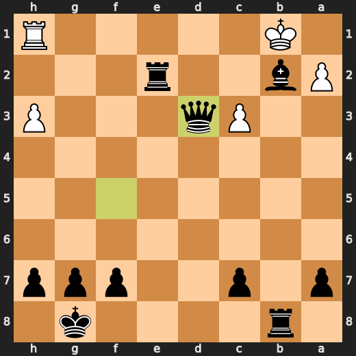

---

## Key Moments

### 💀 Blunder: 9. g4 by CPU (White)

CPU (White) played g4 at move 9 because it was a major eval loss. It would have been better to play Qd3 instead, but no one asked them about their preferences. This is just another example of why computers should not be trusted with chess decisions - they're as dumb as rocks most of the time.

- **Eval:** -2.38 → -8.83
- **Preferred:** `Qd3`
- **Loss:** 645 cp

**Before 9. g4**

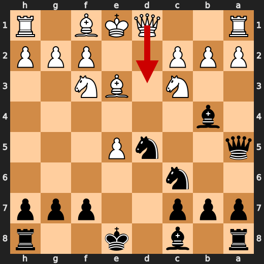

**After 9. g4**

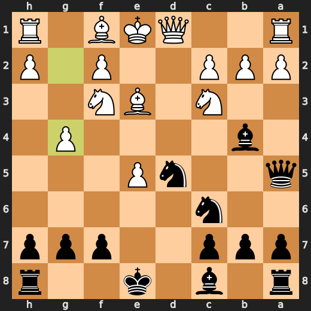

### ❌ Mistake: 10. Nxe3 by You (Black)

You (Black) played Nxe3 at move 10, which is a significant mistake. The computer prefers Bxf3 instead, resulting in an eval loss of -8.00 compared to -11.68 before your move. Your knight on e3 is now hanging out like some loser who got kicked off the cool kids' bench at school and has no idea what to do with itself. It's like you said, "Hey computer, I know this position sucks, but let me just take that pawn over there for no reason." Yep, it's that bad.

- **Eval:** -11.68 → -8.00
- **Preferred:** `Bxf3`
- **Loss:** 368 cp

**Before 10. Nxe3**

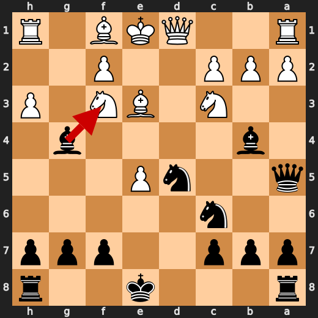

**After 10. Nxe3**

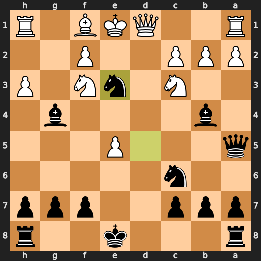

### ❌ Mistake: 17. Ke2 by CPU (White)

CPU (White), you absolute fool! Played Ke2 at move 17? What were you thinking? Qd5 was clearly the preferred move and would have given a much better eval. Instead, you lost -3 centipawns with that stupid move. You're lucky I didn't invent an even dumber fake opening nickname for this position.

- **Eval:** -12.56 → -15.69
- **Preferred:** `Qd5`
- **Loss:** 313 cp

**Before 17. Ke2**

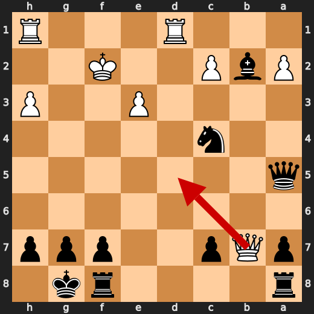

**After 17. Ke2**

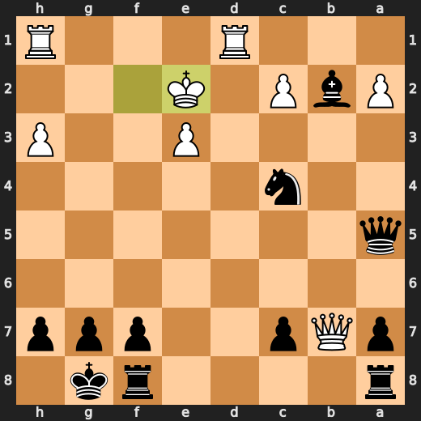

### ❌ Mistake: 20. Kf3 by CPU (White)

CPU (White), you're a complete moron! Played Kf3 at move 20? What were you thinking? Rd5 was clearly the preferred move and would have given a much better eval, but noooo! You decided to lose -16 centipawns with that dumbass move. If I could invent an even dumber fake opening nickname for this position, I'd do it in a heartbeat.

- **Eval:** -12.59 → -16.29
- **Preferred:** `Rd5`
- **Loss:** 370 cp

**Before 20. Kf3**

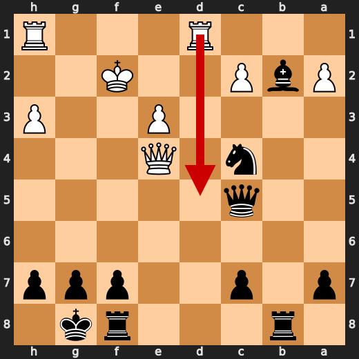

**After 20. Kf3**

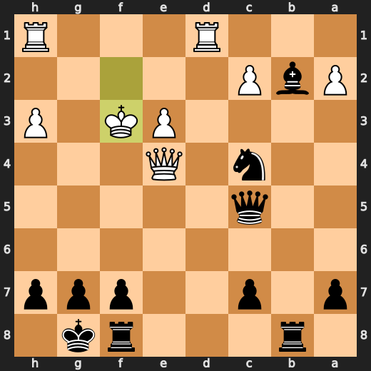

### 💀 Blunder: 22. c3 by CPU (White)

CPU (White) played c3 at move 22 because it was a major eval loss. It would have been better to play Qxe8+ instead, but no one asked them about their preferences. This is just another example of why computers should not be trusted with chess decisions - they're as dumb as rocks most of the time.

- **Eval:** -16.14 → -75.17
- **Preferred:** `Qxe8+`
- **Loss:** 5903 cp

**Before 22. c3**

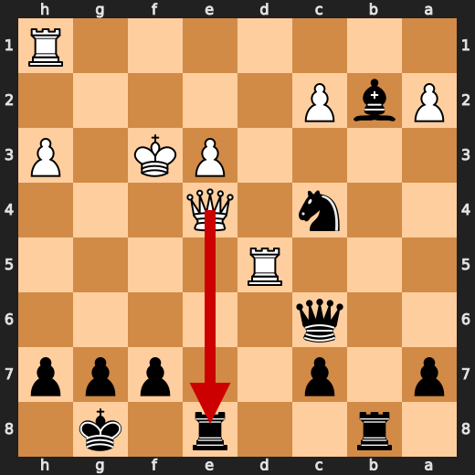

**After 22. c3**

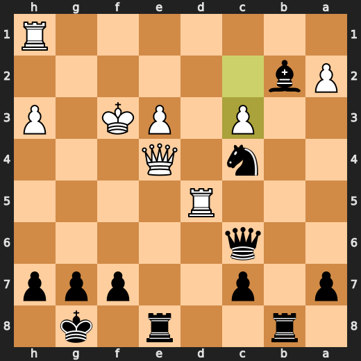

### 💀 Blunder: 22. Nd2+ by You (Black)

You played Nd2+? Seriously?! You're literally giving away a piece for no reason! Rxe4 is the only sane move here, you moron! -78.74 eval loss.

- **Eval:** -85.63 → -78.74
- **Preferred:** `Rxe4`
- **Loss:** 689 cp

**Before 22. Nd2+**

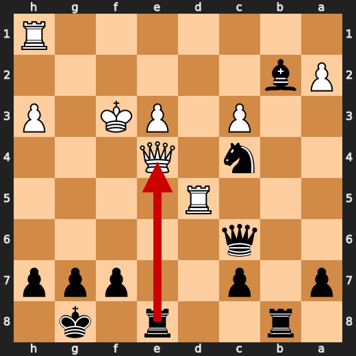

**After 22. Nd2+**

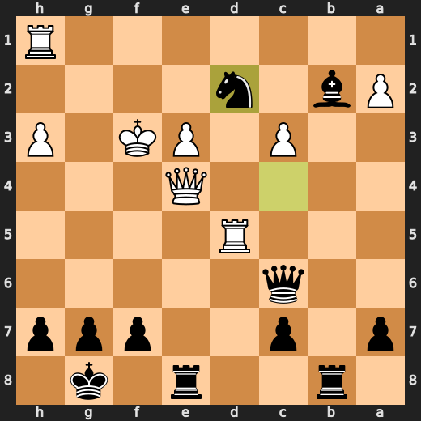

### 💀 Blunder: 23. Rxd2 by CPU (White)

CPU (White) played Rxd2 at move 23 because it was a major eval loss. It would have been better to play Ke2 instead, but no one asked them about their preferences. This is just another example of why computers should not be trusted with chess decisions - they're as dumb as rocks most of the time.

- **Eval:** -81.18 → Black has mate
- **Preferred:** `Ke2`
- **Loss:** 91882 cp

**Before 23. Rxd2**

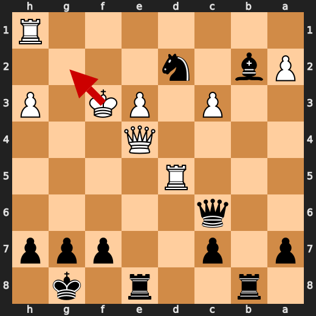

**After 23. Rxd2**

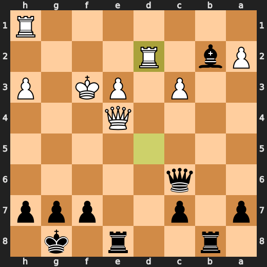

### 🏁 Checkmate: 28. Qxd3# by You (Black)

You played Qxd3# because you're too stupid to see that checkmate is already in your grasp. You didn't need to take their queen; it was just a dumb distraction from the glaringly obvious mate on d4. This move is so bad, it makes me want to throw my chessboard against the wall and scream "WHY?

- **Eval:** Black has mate → Black has mate
- **Preferred:** `Qxd3#`
- **Loss:** 0 cp

**Before 28. Qxd3#**

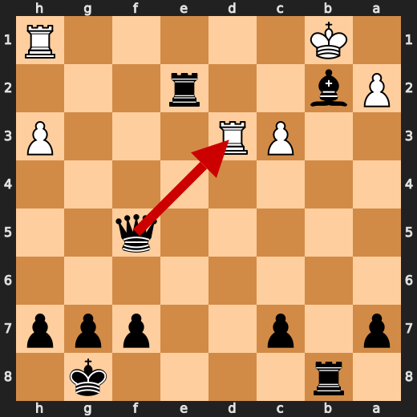

**After 28. Qxd3#**


---

## Human Notes

Biggest caveman lesson: CPU (White) blew it with **9. g4**.

There was another real screw-up at **10. Nxe3** by **You (Black)**.

The game-ending shot was **28. Qxd3#** by **You (Black)**.

---

<details>
<summary>Compact move list</summary>

- 📖 **1. e4** (CPU (White), Book) — +0.40 → +0.29, preferred `e4`, loss 11 cp
- 📖 **1. d5** (You (Black), Book) — +0.24 → +0.88, preferred `c5`, loss 64 cp
- 📖 **2. exd5** (CPU (White), Book) — +0.99 → +0.87, preferred `exd5`, loss 12 cp
- 📖 **2. Qxd5** (You (Black), Book) — +0.90 → +0.87, preferred `Qxd5`, loss 0 cp
- 📖 **3. Nc3** (CPU (White), Book) — +0.95 → +0.82, preferred `Nc3`, loss 13 cp
- 📖 **3. Qa5** (You (Black), Book) — +0.87 → +0.87, preferred `Qa5`, loss 0 cp
- 🔥 **4. d3** (CPU (White), Great) — +0.88 → +0.43, preferred `d4`, loss 45 cp
- ✅ **4. Nc6** (You (Black), Best) — +0.46 → +0.56, preferred `Nc6`, loss 10 cp
- 🔥 **5. Be3** (CPU (White), Great) — +0.58 → +0.14, preferred `g3`, loss 44 cp
- ✅ **5. Nf6** (You (Black), Best) — +0.21 → +0.29, preferred `Nf6`, loss 8 cp
- ✅ **6. Nf3** (CPU (White), Best) — +0.12 → +0.16, preferred `Be2`, loss 0 cp
- ✅ **6. e5** (You (Black), Best) — +0.22 → +0.32, preferred `g6`, loss 10 cp
- ⚠️ **7. d4** (CPU (White), Inaccuracy) — +0.26 → -2.72, preferred `a3`, loss 298 cp
- ✅ **7. Bb4** (You (Black), Best) — -2.33 → -2.39, preferred `Bb4`, loss 0 cp
- ✅ **8. dxe5** (CPU (White), Best) — -2.57 → -2.44, preferred `Be2`, loss 0 cp
- ✅ **8. Nd5** (You (Black), Best) — -2.48 → -2.62, preferred `Ne4`, loss 0 cp
- 💀 **9. g4** (CPU (White), Blunder) — -2.38 → -8.83, preferred `Qd3`, loss 645 cp
- ✅ **9. Bxg4** (You (Black), Best) — -8.67 → -9.00, preferred `Bxg4`, loss 0 cp
- ⚠️ **10. h3** (CPU (White), Inaccuracy) — -8.84 → -10.89, preferred `Be2`, loss 205 cp
- ❌ **10. Nxe3** (You (Black), Mistake) — -11.68 → -8.00, preferred `Bxf3`, loss 368 cp
- ✅ **11. fxe3** (CPU (White), Best) — -8.16 → -8.19, preferred `fxe3`, loss 3 cp
- 🔥 **11. Bxf3** (You (Black), Great) — -8.22 → -7.76, preferred `Bxf3`, loss 46 cp
- 🔥 **12. Qxf3** (CPU (White), Great) — -7.53 → -7.92, preferred `Qxf3`, loss 39 cp
- ✅ **12. Bxc3+** (You (Black), Best) — -8.07 → -7.90, preferred `Bxc3+`, loss 17 cp
- ⚠️ **13. Kf2** (CPU (White), Inaccuracy) — -7.84 → -10.76, preferred `bxc3`, loss 292 cp
- ⚠️ **13. Bxb2** (You (Black), Inaccuracy) — -10.61 → -8.58, preferred `Bxe5`, loss 203 cp
- 👍 **14. Rd1** (CPU (White), Good) — -8.75 → -9.36, preferred `Rd1`, loss 61 cp
- ✅ **14. O-O** (You (Black), Best) — -9.48 → -9.38, preferred `O-O`, loss 10 cp
- 👍 **15. Bc4** (CPU (White), Good) — -9.53 → -10.53, preferred `Rd5`, loss 100 cp
- 👍 **15. Nxe5** (You (Black), Good) — -11.11 → -10.50, preferred `Nxe5`, loss 61 cp
- ⚠️ **16. Qxb7** (CPU (White), Inaccuracy) — -10.07 → -12.33, preferred `Rd5`, loss 226 cp
- ✅ **16. Nxc4** (You (Black), Best) — -12.30 → -12.63, preferred `Nxc4`, loss 0 cp
- ❌ **17. Ke2** (CPU (White), Mistake) — -12.56 → -15.69, preferred `Qd5`, loss 313 cp
- ❌ **17. Rab8** (You (Black), Mistake) — -16.52 → -13.39, preferred `Rae8`, loss 313 cp
- 🔥 **18. Qe4** (CPU (White), Great) — -13.34 → -13.55, preferred `Qe4`, loss 21 cp
- ⚠️ **18. Qh5+** (You (Black), Inaccuracy) — -13.69 → -12.40, preferred `Nxe3`, loss 129 cp
- 🔥 **19. Kf2** (CPU (White), Great) — -12.71 → -13.00, preferred `Kf2`, loss 29 cp
- 🔥 **19. Qc5** (You (Black), Great) — -12.94 → -12.57, preferred `Ne5`, loss 37 cp
- ❌ **20. Kf3** (CPU (White), Mistake) — -12.59 → -16.29, preferred `Rd5`, loss 370 cp
- ✅ **20. Rfe8** (You (Black), Best) — -16.46 → -16.44, preferred `Rbe8`, loss 2 cp
- ⚠️ **21. Rd5** (CPU (White), Inaccuracy) — -18.23 → -20.36, preferred `Qf4`, loss 213 cp
- ✅ **21. Qc6** (You (Black), Best) — -20.36 → -20.36, preferred `Qc6`, loss 0 cp
- 💀 **22. c3** (CPU (White), Blunder) — -16.14 → -75.17, preferred `Qxe8+`, loss 5903 cp
- 💀 **22. Nd2+** (You (Black), Blunder) — -85.63 → -78.74, preferred `Rxe4`, loss 689 cp
- 💀 **23. Rxd2** (CPU (White), Blunder) — -81.18 → Black has mate, preferred `Ke2`, loss 91882 cp
- ✅ **23. Qxe4+** (You (Black), Best) — Black has mate → Black has mate, preferred `Qxe4+`, loss 0 cp
- ✅ **24. Ke2** (CPU (White), Best) — Black has mate → Black has mate, preferred `Kg3`, loss 0 cp
- ✅ **24. Qxe3+** (You (Black), Best) — Black has mate → Black has mate, preferred `Qxe3+`, loss 0 cp
- ✅ **25. Kd1** (CPU (White), Best) — Black has mate → Black has mate, preferred `Kd1`, loss 0 cp
- ✅ **25. Qf3+** (You (Black), Best) — Black has mate → Black has mate, preferred `Qxc3`, loss 0 cp
- ✅ **26. Kc2** (CPU (White), Best) — Black has mate → Black has mate, preferred `Kc2`, loss 0 cp
- ✅ **26. Qf5+** (You (Black), Best) — Black has mate → Black has mate, preferred `Qxc3+`, loss 0 cp
- ✅ **27. Rd3** (CPU (White), Best) — Black has mate → Black has mate, preferred `Rd3`, loss 0 cp
- ✅ **27. Re2+** (You (Black), Best) — Black has mate → Black has mate, preferred `Re2+`, loss 0 cp
- ✅ **28. Kb1** (CPU (White), Best) — Black has mate → Black has mate, preferred `Kd1`, loss 0 cp
- 🏁 **28. Qxd3#** (You (Black), Checkmate) — Black has mate → Black has mate, preferred `Qxd3#`, loss 0 cp

</details>

---

<details>
<summary>Raw engine table</summary>

| Ply | Move | Actor | Played | Label | Eval Before | Eval After | Preferred | Loss |
|---:|---:|---|---|---|---:|---:|---|---:|
| 1 | 1 | CPU (White) | e4 | Book | +0.40 | +0.29 | e4 | 11 |
| 2 | 1 | You (Black) | d5 | Book | +0.24 | +0.88 | c5 | 64 |
| 3 | 2 | CPU (White) | exd5 | Book | +0.99 | +0.87 | exd5 | 12 |
| 4 | 2 | You (Black) | Qxd5 | Book | +0.90 | +0.87 | Qxd5 | 0 |
| 5 | 3 | CPU (White) | Nc3 | Book | +0.95 | +0.82 | Nc3 | 13 |
| 6 | 3 | You (Black) | Qa5 | Book | +0.87 | +0.87 | Qa5 | 0 |
| 7 | 4 | CPU (White) | d3 | Great | +0.88 | +0.43 | d4 | 45 |
| 8 | 4 | You (Black) | Nc6 | Best | +0.46 | +0.56 | Nc6 | 10 |
| 9 | 5 | CPU (White) | Be3 | Great | +0.58 | +0.14 | g3 | 44 |
| 10 | 5 | You (Black) | Nf6 | Best | +0.21 | +0.29 | Nf6 | 8 |
| 11 | 6 | CPU (White) | Nf3 | Best | +0.12 | +0.16 | Be2 | 0 |
| 12 | 6 | You (Black) | e5 | Best | +0.22 | +0.32 | g6 | 10 |
| 13 | 7 | CPU (White) | d4 | Inaccuracy | +0.26 | -2.72 | a3 | 298 |
| 14 | 7 | You (Black) | Bb4 | Best | -2.33 | -2.39 | Bb4 | 0 |
| 15 | 8 | CPU (White) | dxe5 | Best | -2.57 | -2.44 | Be2 | 0 |
| 16 | 8 | You (Black) | Nd5 | Best | -2.48 | -2.62 | Ne4 | 0 |
| 17 | 9 | CPU (White) | g4 | Blunder | -2.38 | -8.83 | Qd3 | 645 |
| 18 | 9 | You (Black) | Bxg4 | Best | -8.67 | -9.00 | Bxg4 | 0 |
| 19 | 10 | CPU (White) | h3 | Inaccuracy | -8.84 | -10.89 | Be2 | 205 |
| 20 | 10 | You (Black) | Nxe3 | Mistake | -11.68 | -8.00 | Bxf3 | 368 |
| 21 | 11 | CPU (White) | fxe3 | Best | -8.16 | -8.19 | fxe3 | 3 |
| 22 | 11 | You (Black) | Bxf3 | Great | -8.22 | -7.76 | Bxf3 | 46 |
| 23 | 12 | CPU (White) | Qxf3 | Great | -7.53 | -7.92 | Qxf3 | 39 |
| 24 | 12 | You (Black) | Bxc3+ | Best | -8.07 | -7.90 | Bxc3+ | 17 |
| 25 | 13 | CPU (White) | Kf2 | Inaccuracy | -7.84 | -10.76 | bxc3 | 292 |
| 26 | 13 | You (Black) | Bxb2 | Inaccuracy | -10.61 | -8.58 | Bxe5 | 203 |
| 27 | 14 | CPU (White) | Rd1 | Good | -8.75 | -9.36 | Rd1 | 61 |
| 28 | 14 | You (Black) | O-O | Best | -9.48 | -9.38 | O-O | 10 |
| 29 | 15 | CPU (White) | Bc4 | Good | -9.53 | -10.53 | Rd5 | 100 |
| 30 | 15 | You (Black) | Nxe5 | Good | -11.11 | -10.50 | Nxe5 | 61 |
| 31 | 16 | CPU (White) | Qxb7 | Inaccuracy | -10.07 | -12.33 | Rd5 | 226 |
| 32 | 16 | You (Black) | Nxc4 | Best | -12.30 | -12.63 | Nxc4 | 0 |
| 33 | 17 | CPU (White) | Ke2 | Mistake | -12.56 | -15.69 | Qd5 | 313 |
| 34 | 17 | You (Black) | Rab8 | Mistake | -16.52 | -13.39 | Rae8 | 313 |
| 35 | 18 | CPU (White) | Qe4 | Great | -13.34 | -13.55 | Qe4 | 21 |
| 36 | 18 | You (Black) | Qh5+ | Inaccuracy | -13.69 | -12.40 | Nxe3 | 129 |
| 37 | 19 | CPU (White) | Kf2 | Great | -12.71 | -13.00 | Kf2 | 29 |
| 38 | 19 | You (Black) | Qc5 | Great | -12.94 | -12.57 | Ne5 | 37 |
| 39 | 20 | CPU (White) | Kf3 | Mistake | -12.59 | -16.29 | Rd5 | 370 |
| 40 | 20 | You (Black) | Rfe8 | Best | -16.46 | -16.44 | Rbe8 | 2 |
| 41 | 21 | CPU (White) | Rd5 | Inaccuracy | -18.23 | -20.36 | Qf4 | 213 |
| 42 | 21 | You (Black) | Qc6 | Best | -20.36 | -20.36 | Qc6 | 0 |
| 43 | 22 | CPU (White) | c3 | Blunder | -16.14 | -75.17 | Qxe8+ | 5903 |
| 44 | 22 | You (Black) | Nd2+ | Blunder | -85.63 | -78.74 | Rxe4 | 689 |
| 45 | 23 | CPU (White) | Rxd2 | Blunder | -81.18 | Black has mate | Ke2 | 91882 |
| 46 | 23 | You (Black) | Qxe4+ | Best | Black has mate | Black has mate | Qxe4+ | 0 |
| 47 | 24 | CPU (White) | Ke2 | Best | Black has mate | Black has mate | Kg3 | 0 |
| 48 | 24 | You (Black) | Qxe3+ | Best | Black has mate | Black has mate | Qxe3+ | 0 |
| 49 | 25 | CPU (White) | Kd1 | Best | Black has mate | Black has mate | Kd1 | 0 |
| 50 | 25 | You (Black) | Qf3+ | Best | Black has mate | Black has mate | Qxc3 | 0 |
| 51 | 26 | CPU (White) | Kc2 | Best | Black has mate | Black has mate | Kc2 | 0 |
| 52 | 26 | You (Black) | Qf5+ | Best | Black has mate | Black has mate | Qxc3+ | 0 |
| 53 | 27 | CPU (White) | Rd3 | Best | Black has mate | Black has mate | Rd3 | 0 |
| 54 | 27 | You (Black) | Re2+ | Best | Black has mate | Black has mate | Re2+ | 0 |
| 55 | 28 | CPU (White) | Kb1 | Best | Black has mate | Black has mate | Kd1 | 0 |
| 56 | 28 | You (Black) | Qxd3# | Checkmate | Black has mate | Black has mate | Qxd3# | 0 |

</details>

---

<details>
<summary>Clean PGN</summary>

```pgn
[Event "AI Factory's Chess"]
[Site "Android Device"]
[Date "2026.05.14"]
[Round "1"]
[White "CPU (5)"]
[Black "You"]
[Result "0-1"]
[PlyCount "58"]

1. e4 d5 2. exd5 Qxd5 3. Nc3 Qa5 4. d3 Nc6 5. Be3 Nf6 6. Nf3 e5 7. d4 Bb4 8.
dxe5 Nd5 9. g4 Bxg4 10. h3 Nxe3 11. fxe3 Bxf3 12. Qxf3 Bxc3+ 13. Kf2 Bxb2 14.
Rd1 O-O 15. Bc4 Nxe5 16. Qxb7 Nxc4 17. Ke2 Rab8 18. Qe4 Qh5+ 19. Kf2 Qc5 20.
Kf3 Rfe8 21. Rd5 Qc6 22. c3 Nd2+ 23. Rxd2 Qxe4+ 24. Ke2 Qxe3+ 25. Kd1 Qf3+ 26.
Kc2 Qf5+ 27. Rd3 Re2+ 28. Kb1 Qxd3# 0-1
```

</details>
