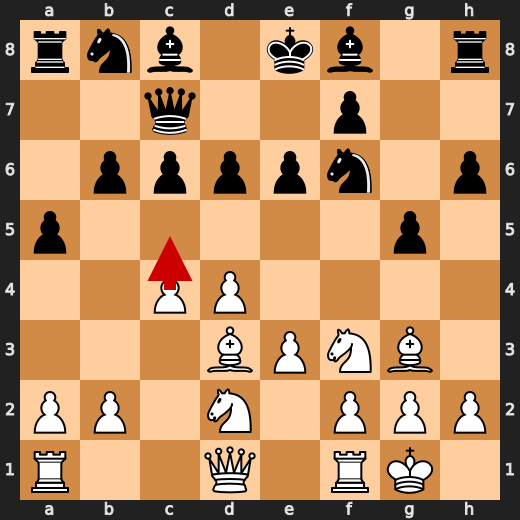
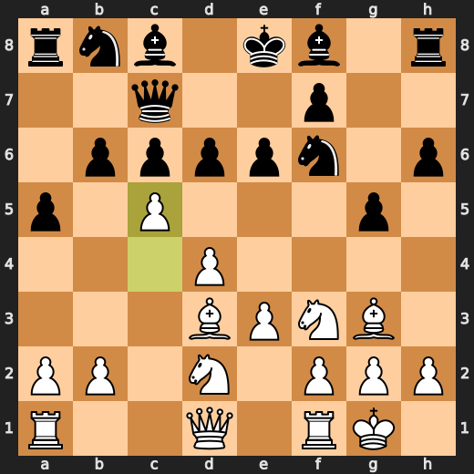
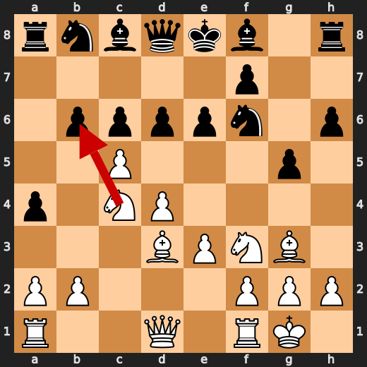
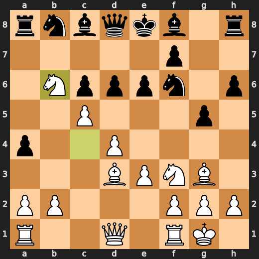

# You (White) vs CPU (Black)

**Result:** 1-0  
**Date:** 2026.05.14  
**Source:** `20260514_001658_pgn_2026_05_14_00h16_5a58f5284c0b.pgn`  
**Engine:** Stockfish depth 14  
**Your side:** White  
**Computer side:** Black  
**Board perspective:** Standard White-at-bottom

---

## Who Is Who

- **You:** You (White)
- **Computer:** CPU (5) (Black)

---

## Toaster Summary

**Game Story:** In this thrilling chess match, White (You) and Black (CPU) engage in an intense battle of wits and strategy. The game begins with a series of opening moves that set the stage for an exciting encounter. As the pieces are moved around the board, both players showcase their mastery of the game, making strategic choices that keep the audience on the edge of their seats. The first key moment comes at move 9, where White plays c4, a strong and well-preferred move according to the engine evaluation. This move sets the tone for the rest of the game, as both players continue to make calculated moves that push the boundaries of their respective strategies. At move 10, White plays c5, another well-preferred move by the engine. Black responds with a4, which the engine considers a mistake and prefers Nbd7 instead. This misstep by Black allows White to gain an advantage in the game. The next critical moment occurs at move 12, where White plays Nxb6, another well-preferred move according to the engine evaluation. This move further strengthens White's position on the board and puts pressure on Black to respond effectively. As the game progresses, both players continue to make strategic moves that keep the audience engaged and invested in the outcome of the match. However, it is at move 35 where Black makes a blunder by playing Bxa2 instead of the preferred a3.

Biggest toaster scream: **35. Bxa2** by **CPU (Black)**.

- **Label:** 💀 **Blunder**
- **Eval:** +63.81 → White has mate
- **Stockfish preferred:** `a3`
- **Loss:** 93619 cp

Final move recorded: **39. Rhxg8#** by **You (White)**.

- 💀 Blunders: **1**
- ❌ Mistakes: **1**
- ⚠️ Inaccuracies: **5**
- ✅ Best moves called out: **36**

---

## Final Position


---

## Key Moments

### ✅ Best: 9. c4 by You (White)

You played c4 because you wanted to control the center and prevent Black from getting a strong fianchetto bishop. This is a common strategy in many openings, but it can also lead to overextension if not handled carefully. Stockfish agrees that this move is good, so there's no need for further explanation. Black failed to punish your c4 by playing the passive 9...b6, which allowed you to maintain control of the center and develop your pieces more comfortably.

- **Eval:** +2.24 → +2.75
- **Preferred:** `c4`
- **Loss:** 0 cp

**Before 9. c4**


**After 9. c4**


### ✅ Best: 10. c5 by You (White)

You (White) played c5 because you wanted to annoy Black and make them think about their next move for a few seconds. It was a useful move, but not the best one. You could have played d4 instead, which would have been more annoying and made Black's life even more difficult. But hey, at least you didn't play something stupid like c6 or c7.

- **Eval:** +3.09 → +3.00
- **Preferred:** `c5`
- **Loss:** 9 cp

**Before 10. c5**



**After 10. c5**



### ❌ Mistake: 10. a4 by CPU (Black)

CPU played a4 because they're an idiot who doesn't know how to play chess. They lost 428 centipawns, which is like losing a whole game of checkers. If you want to see what move they should have played instead, it was Nbd7. But hey, who am I to tell them how to play their own game?

- **Eval:** +3.09 → +7.37
- **Preferred:** `Nbd7`
- **Loss:** 428 cp

**Before 10. a4**


**After 10. a4**


### ✅ Best: 12. Nxb6 by You (White)

You played Nxb6, which was the best move according to the engine. The evaluation dropped slightly from +7.99 to +7.84, but you still gained a centipawn. Stockfish preferred this move over any other option, so it's not like you were doing something stupid. But hey, if you want to force an engine-approved move, Nxb6 is as good as any.

- **Eval:** +7.99 → +7.84
- **Preferred:** `Nxb6`
- **Loss:** 15 cp

**Before 12. Nxb6**



**After 12. Nxb6**



### ✅ Best: 31. exd4 by CPU (Black)

CPU played exd4 because it's an engine-approved move that forces White to make a decision about how to recapture on d4, which will affect the rest of the game. It's not a stupid move, but it doesn't exactly win the game either. If White takes with their pawn, they weaken their center and give Black more space. If White takes with their knight, they open up the bishop on c1 for attack.

- **Eval:** +12.45 → +12.69
- **Preferred:** `exd4`
- **Loss:** 24 cp

**Before 31. exd4**


**After 31. exd4**


### 💀 Blunder: 35. Bxa2 by CPU (Black)

CPU (Black) played Bxa2 at move 35, which was a blunder. The engine evaluation before this move was +63.81, but after this move, White had mate. Stockfish preferred a3 as the best move, but it didn't matter because Black just handed White the game on a silver platter with Bxa2. The centipawn loss for this move was 93,619, which is a major eval loss. So, congratulations, CPU (Black), you played something incredibly stupid at move 35.

- **Eval:** +63.81 → White has mate
- **Preferred:** `a3`
- **Loss:** 93619 cp

**Before 35. Bxa2**


**After 35. Bxa2**


### 🏁 Checkmate: 39. Rhxg8# by You (White)

You (White) played something useful at move 39 with Rhxg8#. Black overreached by leaving their king exposed, and you failed to punish it. The game was decided when you checkmated them with Rhxg8#.

- **Eval:** White has mate → White has mate
- **Preferred:** `Rhxg8#`
- **Loss:** 0 cp

**Before 39. Rhxg8#**


**After 39. Rhxg8#**


---

## Human Notes

Biggest caveman lesson: CPU (Black) blew it with **35. Bxa2**.

There was another real screw-up at **10. a4** by **CPU (Black)**.

The game-ending shot was **39. Rhxg8#** by **You (White)**.

---

<details>
<summary>Compact move list</summary>

- 📖 **1. d4** (You (White), Book) — +0.46 → +0.39, preferred `d4`, loss 7 cp
- 📖 **1. Nf6** (CPU (Black), Book) — +0.44 → +0.57, preferred `Nf6`, loss 13 cp
- 📖 **2. Bf4** (You (White), Book) — +0.47 → +0.03, preferred `c4`, loss 44 cp
- 📖 **2. d6** (CPU (Black), Book) — +0.02 → +0.36, preferred `d5`, loss 34 cp
- 📖 **3. e3** (You (White), Book) — +0.31 → +0.03, preferred `Nf3`, loss 28 cp
- 📖 **3. c6** (CPU (Black), Book) — +0.13 → +0.39, preferred `g6`, loss 26 cp
- 🔥 **4. Nf3** (You (White), Great) — +0.32 → +0.08, preferred `Nd2`, loss 24 cp
- 👍 **4. h6** (CPU (Black), Good) — +0.09 → +0.64, preferred `Nh5`, loss 55 cp
- 👍 **5. Nbd2** (You (White), Good) — +0.66 → +0.14, preferred `h3`, loss 52 cp
- 👍 **5. Qc7** (CPU (Black), Good) — +0.13 → +0.83, preferred `Nh5`, loss 70 cp
- 👍 **6. Bd3** (You (White), Good) — +0.88 → +0.09, preferred `h3`, loss 79 cp
- 🔥 **6. g5** (CPU (Black), Great) — +0.35 → +0.81, preferred `Nh5`, loss 46 cp
- 🔥 **7. Bg3** (You (White), Great) — +0.86 → +0.67, preferred `Bg3`, loss 19 cp
- 👍 **7. e6** (CPU (Black), Good) — +0.79 → +1.96, preferred `Nh5`, loss 117 cp
- 👍 **8. O-O** (You (White), Good) — +1.93 → +1.17, preferred `h3`, loss 76 cp
- 👍 **8. a5** (CPU (Black), Good) — +1.17 → +2.20, preferred `Nh5`, loss 103 cp
- ✅ **9. c4** (You (White), Best) — +2.24 → +2.75, preferred `c4`, loss 0 cp
- 🔥 **9. b6** (CPU (Black), Great) — +2.58 → +3.07, preferred `Nbd7`, loss 49 cp
- ✅ **10. c5** (You (White), Best) — +3.09 → +3.00, preferred `c5`, loss 9 cp
- ❌ **10. a4** (CPU (Black), Mistake) — +3.09 → +7.37, preferred `Nbd7`, loss 428 cp
- ✅ **11. Nc4** (You (White), Best) — +7.30 → +7.29, preferred `Nc4`, loss 1 cp
- 👍 **11. Qd8** (CPU (Black), Good) — +7.29 → +8.06, preferred `Ba6`, loss 77 cp
- ✅ **12. Nxb6** (You (White), Best) — +7.99 → +7.84, preferred `Nxb6`, loss 15 cp
- ⚠️ **12. Ra5** (CPU (Black), Inaccuracy) — +7.75 → +9.46, preferred `Ra7`, loss 171 cp
- 🔥 **13. Nc4** (You (White), Great) — +9.46 → +9.23, preferred `Nc4`, loss 23 cp
- 🔥 **13. Ra7** (CPU (Black), Great) — +9.17 → +9.53, preferred `g4`, loss 36 cp
- 👍 **14. Bxd6** (You (White), Good) — +9.46 → +8.84, preferred `Nxd6+`, loss 62 cp
- ✅ **14. Nbd7** (CPU (Black), Best) — +8.92 → +9.07, preferred `Ba6`, loss 15 cp
- ✅ **15. Nfe5** (You (White), Best) — +9.33 → +9.38, preferred `Nfe5`, loss 0 cp
- ✅ **15. Nxe5** (CPU (Black), Best) — +9.36 → +9.31, preferred `Nxe5`, loss 0 cp
- ✅ **16. Bxe5** (You (White), Best) — +9.19 → +9.15, preferred `Bxe5`, loss 4 cp
- ✅ **16. Bg7** (CPU (Black), Best) — +8.96 → +9.07, preferred `Bg7`, loss 11 cp
- 👍 **17. Bxf6** (You (White), Good) — +9.05 → +8.30, preferred `Bb8`, loss 75 cp
- 👍 **17. Qxf6** (CPU (Black), Good) — +8.09 → +8.74, preferred `Bxf6`, loss 65 cp
- 🔥 **18. Nd6+** (You (White), Great) — +8.75 → +8.38, preferred `Nd6+`, loss 37 cp
- 👍 **18. Kd8** (CPU (Black), Good) — +8.52 → +9.46, preferred `Ke7`, loss 94 cp
- 👍 **19. f4** (You (White), Good) — +9.58 → +8.67, preferred `b4`, loss 91 cp
- ⚠️ **19. Kc7** (CPU (Black), Inaccuracy) — +8.46 → +9.81, preferred `gxf4`, loss 135 cp
- ✅ **20. fxg5** (You (White), Best) — +9.87 → +10.25, preferred `Qe1`, loss 0 cp
- 🔥 **20. Qxg5** (CPU (Black), Great) — +9.69 → +10.15, preferred `Qe7`, loss 46 cp
- ⚠️ **21. Qf3** (You (White), Inaccuracy) — +10.59 → +8.38, preferred `Rxf7+`, loss 221 cp
- 🔥 **21. f5** (CPU (Black), Great) — +8.61 → +8.87, preferred `e5`, loss 26 cp
- ✅ **22. Nf7** (You (White), Best) — +9.23 → +9.15, preferred `b4`, loss 8 cp
- ✅ **22. Qh4** (CPU (Black), Best) — +9.23 → +9.17, preferred `Bf6`, loss 0 cp
- ✅ **23. g3** (You (White), Best) — +8.90 → +8.86, preferred `g3`, loss 4 cp
- 👍 **23. Qg4** (CPU (Black), Good) — +8.52 → +9.07, preferred `Qe7`, loss 55 cp
- ✅ **24. Qxg4** (You (White), Best) — +8.52 → +8.90, preferred `Qxg4`, loss 0 cp
- ✅ **24. fxg4** (CPU (Black), Best) — +9.14 → +8.87, preferred `fxg4`, loss 0 cp
- ✅ **25. Nxh8** (You (White), Best) — +8.70 → +9.19, preferred `Nxh8`, loss 0 cp
- 🔥 **25. Bxh8** (CPU (Black), Great) — +8.86 → +9.25, preferred `Bxh8`, loss 39 cp
- 🔥 **26. Rf8** (You (White), Great) — +9.23 → +8.76, preferred `Rf7+`, loss 47 cp
- ✅ **26. Bg7** (CPU (Black), Best) — +8.85 → +8.99, preferred `Bg7`, loss 14 cp
- ✅ **27. Rf7+** (You (White), Best) — +8.96 → +8.88, preferred `Rf7+`, loss 8 cp
- ✅ **27. Kb8** (CPU (Black), Best) — +9.30 → +8.86, preferred `Kb8`, loss 0 cp
- 🔥 **28. Raf1** (You (White), Great) — +8.98 → +8.62, preferred `Raf1`, loss 36 cp
- ⚠️ **28. e5** (CPU (Black), Inaccuracy) — +8.72 → +10.65, preferred `Rxf7`, loss 193 cp
- ✅ **29. Rxa7** (You (White), Best) — +10.96 → +11.46, preferred `Rxa7`, loss 0 cp
- ✅ **29. Kxa7** (CPU (Black), Best) — +11.46 → +11.69, preferred `Kxa7`, loss 23 cp
- ✅ **30. Rf7+** (You (White), Best) — +11.84 → +12.07, preferred `Rf7+`, loss 0 cp
- ✅ **30. Ka8** (CPU (Black), Best) — +11.87 → +11.93, preferred `Kb8`, loss 6 cp
- ✅ **31. Rxg7** (You (White), Best) — +12.56 → +12.84, preferred `Rxg7`, loss 0 cp
- ✅ **31. exd4** (CPU (Black), Best) — +12.45 → +12.69, preferred `exd4`, loss 24 cp
- ✅ **32. exd4** (You (White), Best) — +12.69 → +12.56, preferred `exd4`, loss 13 cp
- ✅ **32. h5** (CPU (Black), Best) — +12.69 → +12.48, preferred `h5`, loss 0 cp
- 👍 **33. Bg6** (You (White), Good) — +12.86 → +11.98, preferred `Be4`, loss 88 cp
- ⚠️ **33. h4** (CPU (Black), Inaccuracy) — +13.25 → +15.91, preferred `Kb8`, loss 266 cp
- ✅ **34. gxh4** (You (White), Best) — +16.00 → +18.78, preferred `gxh4`, loss 0 cp
- ✅ **34. Be6** (CPU (Black), Best) — +18.78 → +18.78, preferred `Kb8`, loss 0 cp
- ✅ **35. h5** (You (White), Best) — +18.78 → +21.36, preferred `Be4`, loss 0 cp
- 💀 **35. Bxa2** (CPU (Black), Blunder) — +63.81 → White has mate, preferred `a3`, loss 93619 cp
- ✅ **36. h6** (You (White), Best) — White has mate → White has mate, preferred `h6`, loss 0 cp
- ✅ **36. Bc4** (CPU (Black), Best) — White has mate → White has mate, preferred `Bg8`, loss 0 cp
- ✅ **37. h7** (You (White), Best) — White has mate → White has mate, preferred `h7`, loss 0 cp
- ✅ **37. a3** (CPU (Black), Best) — White has mate → White has mate, preferred `a3`, loss 0 cp
- ✅ **38. h8=R+** (You (White), Best) — White has mate → White has mate, preferred `h8=R+`, loss 0 cp
- ✅ **38. Bg8** (CPU (Black), Best) — White has mate → White has mate, preferred `Bg8`, loss 0 cp
- 🏁 **39. Rhxg8#** (You (White), Checkmate) — White has mate → White has mate, preferred `Rhxg8#`, loss 0 cp

</details>

---

<details>
<summary>Raw engine table</summary>

| Ply | Move | Actor | Played | Label | Eval Before | Eval After | Preferred | Loss |
|---:|---:|---|---|---|---:|---:|---|---:|
| 1 | 1 | You (White) | d4 | Book | +0.46 | +0.39 | d4 | 7 |
| 2 | 1 | CPU (Black) | Nf6 | Book | +0.44 | +0.57 | Nf6 | 13 |
| 3 | 2 | You (White) | Bf4 | Book | +0.47 | +0.03 | c4 | 44 |
| 4 | 2 | CPU (Black) | d6 | Book | +0.02 | +0.36 | d5 | 34 |
| 5 | 3 | You (White) | e3 | Book | +0.31 | +0.03 | Nf3 | 28 |
| 6 | 3 | CPU (Black) | c6 | Book | +0.13 | +0.39 | g6 | 26 |
| 7 | 4 | You (White) | Nf3 | Great | +0.32 | +0.08 | Nd2 | 24 |
| 8 | 4 | CPU (Black) | h6 | Good | +0.09 | +0.64 | Nh5 | 55 |
| 9 | 5 | You (White) | Nbd2 | Good | +0.66 | +0.14 | h3 | 52 |
| 10 | 5 | CPU (Black) | Qc7 | Good | +0.13 | +0.83 | Nh5 | 70 |
| 11 | 6 | You (White) | Bd3 | Good | +0.88 | +0.09 | h3 | 79 |
| 12 | 6 | CPU (Black) | g5 | Great | +0.35 | +0.81 | Nh5 | 46 |
| 13 | 7 | You (White) | Bg3 | Great | +0.86 | +0.67 | Bg3 | 19 |
| 14 | 7 | CPU (Black) | e6 | Good | +0.79 | +1.96 | Nh5 | 117 |
| 15 | 8 | You (White) | O-O | Good | +1.93 | +1.17 | h3 | 76 |
| 16 | 8 | CPU (Black) | a5 | Good | +1.17 | +2.20 | Nh5 | 103 |
| 17 | 9 | You (White) | c4 | Best | +2.24 | +2.75 | c4 | 0 |
| 18 | 9 | CPU (Black) | b6 | Great | +2.58 | +3.07 | Nbd7 | 49 |
| 19 | 10 | You (White) | c5 | Best | +3.09 | +3.00 | c5 | 9 |
| 20 | 10 | CPU (Black) | a4 | Mistake | +3.09 | +7.37 | Nbd7 | 428 |
| 21 | 11 | You (White) | Nc4 | Best | +7.30 | +7.29 | Nc4 | 1 |
| 22 | 11 | CPU (Black) | Qd8 | Good | +7.29 | +8.06 | Ba6 | 77 |
| 23 | 12 | You (White) | Nxb6 | Best | +7.99 | +7.84 | Nxb6 | 15 |
| 24 | 12 | CPU (Black) | Ra5 | Inaccuracy | +7.75 | +9.46 | Ra7 | 171 |
| 25 | 13 | You (White) | Nc4 | Great | +9.46 | +9.23 | Nc4 | 23 |
| 26 | 13 | CPU (Black) | Ra7 | Great | +9.17 | +9.53 | g4 | 36 |
| 27 | 14 | You (White) | Bxd6 | Good | +9.46 | +8.84 | Nxd6+ | 62 |
| 28 | 14 | CPU (Black) | Nbd7 | Best | +8.92 | +9.07 | Ba6 | 15 |
| 29 | 15 | You (White) | Nfe5 | Best | +9.33 | +9.38 | Nfe5 | 0 |
| 30 | 15 | CPU (Black) | Nxe5 | Best | +9.36 | +9.31 | Nxe5 | 0 |
| 31 | 16 | You (White) | Bxe5 | Best | +9.19 | +9.15 | Bxe5 | 4 |
| 32 | 16 | CPU (Black) | Bg7 | Best | +8.96 | +9.07 | Bg7 | 11 |
| 33 | 17 | You (White) | Bxf6 | Good | +9.05 | +8.30 | Bb8 | 75 |
| 34 | 17 | CPU (Black) | Qxf6 | Good | +8.09 | +8.74 | Bxf6 | 65 |
| 35 | 18 | You (White) | Nd6+ | Great | +8.75 | +8.38 | Nd6+ | 37 |
| 36 | 18 | CPU (Black) | Kd8 | Good | +8.52 | +9.46 | Ke7 | 94 |
| 37 | 19 | You (White) | f4 | Good | +9.58 | +8.67 | b4 | 91 |
| 38 | 19 | CPU (Black) | Kc7 | Inaccuracy | +8.46 | +9.81 | gxf4 | 135 |
| 39 | 20 | You (White) | fxg5 | Best | +9.87 | +10.25 | Qe1 | 0 |
| 40 | 20 | CPU (Black) | Qxg5 | Great | +9.69 | +10.15 | Qe7 | 46 |
| 41 | 21 | You (White) | Qf3 | Inaccuracy | +10.59 | +8.38 | Rxf7+ | 221 |
| 42 | 21 | CPU (Black) | f5 | Great | +8.61 | +8.87 | e5 | 26 |
| 43 | 22 | You (White) | Nf7 | Best | +9.23 | +9.15 | b4 | 8 |
| 44 | 22 | CPU (Black) | Qh4 | Best | +9.23 | +9.17 | Bf6 | 0 |
| 45 | 23 | You (White) | g3 | Best | +8.90 | +8.86 | g3 | 4 |
| 46 | 23 | CPU (Black) | Qg4 | Good | +8.52 | +9.07 | Qe7 | 55 |
| 47 | 24 | You (White) | Qxg4 | Best | +8.52 | +8.90 | Qxg4 | 0 |
| 48 | 24 | CPU (Black) | fxg4 | Best | +9.14 | +8.87 | fxg4 | 0 |
| 49 | 25 | You (White) | Nxh8 | Best | +8.70 | +9.19 | Nxh8 | 0 |
| 50 | 25 | CPU (Black) | Bxh8 | Great | +8.86 | +9.25 | Bxh8 | 39 |
| 51 | 26 | You (White) | Rf8 | Great | +9.23 | +8.76 | Rf7+ | 47 |
| 52 | 26 | CPU (Black) | Bg7 | Best | +8.85 | +8.99 | Bg7 | 14 |
| 53 | 27 | You (White) | Rf7+ | Best | +8.96 | +8.88 | Rf7+ | 8 |
| 54 | 27 | CPU (Black) | Kb8 | Best | +9.30 | +8.86 | Kb8 | 0 |
| 55 | 28 | You (White) | Raf1 | Great | +8.98 | +8.62 | Raf1 | 36 |
| 56 | 28 | CPU (Black) | e5 | Inaccuracy | +8.72 | +10.65 | Rxf7 | 193 |
| 57 | 29 | You (White) | Rxa7 | Best | +10.96 | +11.46 | Rxa7 | 0 |
| 58 | 29 | CPU (Black) | Kxa7 | Best | +11.46 | +11.69 | Kxa7 | 23 |
| 59 | 30 | You (White) | Rf7+ | Best | +11.84 | +12.07 | Rf7+ | 0 |
| 60 | 30 | CPU (Black) | Ka8 | Best | +11.87 | +11.93 | Kb8 | 6 |
| 61 | 31 | You (White) | Rxg7 | Best | +12.56 | +12.84 | Rxg7 | 0 |
| 62 | 31 | CPU (Black) | exd4 | Best | +12.45 | +12.69 | exd4 | 24 |
| 63 | 32 | You (White) | exd4 | Best | +12.69 | +12.56 | exd4 | 13 |
| 64 | 32 | CPU (Black) | h5 | Best | +12.69 | +12.48 | h5 | 0 |
| 65 | 33 | You (White) | Bg6 | Good | +12.86 | +11.98 | Be4 | 88 |
| 66 | 33 | CPU (Black) | h4 | Inaccuracy | +13.25 | +15.91 | Kb8 | 266 |
| 67 | 34 | You (White) | gxh4 | Best | +16.00 | +18.78 | gxh4 | 0 |
| 68 | 34 | CPU (Black) | Be6 | Best | +18.78 | +18.78 | Kb8 | 0 |
| 69 | 35 | You (White) | h5 | Best | +18.78 | +21.36 | Be4 | 0 |
| 70 | 35 | CPU (Black) | Bxa2 | Blunder | +63.81 | White has mate | a3 | 93619 |
| 71 | 36 | You (White) | h6 | Best | White has mate | White has mate | h6 | 0 |
| 72 | 36 | CPU (Black) | Bc4 | Best | White has mate | White has mate | Bg8 | 0 |
| 73 | 37 | You (White) | h7 | Best | White has mate | White has mate | h7 | 0 |
| 74 | 37 | CPU (Black) | a3 | Best | White has mate | White has mate | a3 | 0 |
| 75 | 38 | You (White) | h8=R+ | Best | White has mate | White has mate | h8=R+ | 0 |
| 76 | 38 | CPU (Black) | Bg8 | Best | White has mate | White has mate | Bg8 | 0 |
| 77 | 39 | You (White) | Rhxg8# | Checkmate | White has mate | White has mate | Rhxg8# | 0 |

</details>

---

<details>
<summary>Clean PGN</summary>

```pgn
[Event "AI Factory's Chess"]
[Site "Android Device"]
[Date "2026.05.14"]
[Round "1"]
[White "You"]
[Black "CPU (5)"]
[Result "1-0"]
[PlyCount "79"]

1. d4 Nf6 2. Bf4 d6 3. e3 c6 4. Nf3 h6 5. Nbd2 Qc7 6. Bd3 g5 7. Bg3 e6 8. O-O
a5 9. c4 b6 10. c5 a4 11. Nc4 Qd8 12. Nxb6 Ra5 13. Nc4 Ra7 14. Bxd6 Nbd7 15.
Nfe5 Nxe5 16. Bxe5 Bg7 17. Bxf6 Qxf6 18. Nd6+ Kd8 19. f4 Kc7 20. fxg5 Qxg5 21.
Qf3 f5 22. Nf7 Qh4 23. g3 Qg4 24. Qxg4 fxg4 25. Nxh8 Bxh8 26. Rf8 Bg7 27. Rf7+
Kb8 28. Raf1 e5 29. Rxa7 Kxa7 30. Rf7+ Ka8 31. Rxg7 exd4 32. exd4 h5 33. Bg6 h4
34. gxh4 Be6 35. h5 Bxa2 36. h6 Bc4 37. h7 a3 38. h8=R+ Bg8 39. Rhxg8# 1-0
```

</details>
