# You (White) vs CPU (Black)

**Result:** 1-0  
**Date:** 2026.05.14  
**Source:** `20260514_001658_pgn_2026_05_14_00h16_5a58f5284c0b.pgn`  
**Engine:** Stockfish depth 14  
**Your side:** White  
**Computer side:** Black  
**Board perspective:** Standard White-at-bottom

---

## Who Is Who

- **You:** You (White)
- **Computer:** CPU (5) (Black)

---

## Toaster Summary

**Game Story:** This was a London System where your early c4 and Nc4 helped White take control after Black’s 10...a4 mistake. Your 21 Qf3 was not the strongest continuation, so the lesson is to look for forcing rook checks when the opponent’s king is exposed. Black’s 35...Bxa2 let the attack become decisive, and you finished the messy win with 39. Rhxg8#.

Biggest toaster scream: **35. Bxa2** by **CPU (Black)**.

- **Label:** 💀 **Blunder**
- **Eval:** +30.78 → White has mate
- **Stockfish preferred:** `a3`
- **Loss:** 96922 cp

Final move recorded: **39. Rhxg8#** by **You (White)**.

- 💀 Your blunders: **0**
- ❌ Your mistakes: **0**
- ⚠️ Your inaccuracies: **1**
- ✅ Your best moves called out: **24**

---

## Final Position


---

## Key Moments

### ✅ Best: 9. c4 by You (White)

c4 was the engine’s preferred move, so it keeps White’s position in good shape. The useful pattern is to choose a steady pawn advance when it is at or very near Stockfish’s top choice.

- **Eval:** +2.52 → +2.38
- **Preferred:** `c4`
- **Loss:** 14 cp

**Before 9. c4**

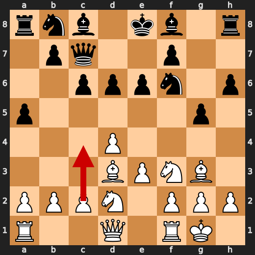

**After 9. c4**

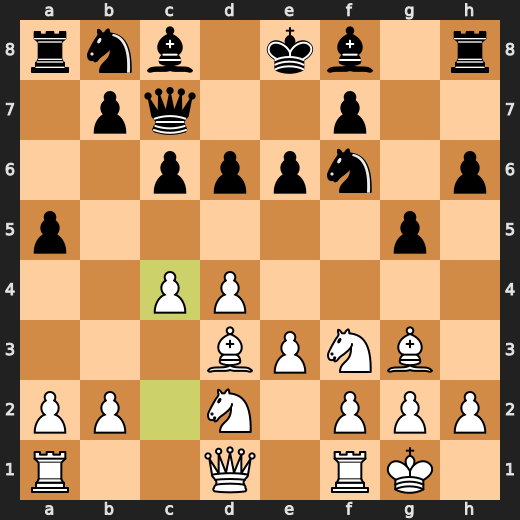

### ❌ Mistake: 10. a4 by CPU (Black)

a4 worsened Black’s position without addressing the more important need to develop and coordinate pieces. Nbd7 was preferred because it improves Black’s setup instead of spending a tempo on a flank pawn move.

- **Eval:** +3.13 → +7.65
- **Preferred:** `Nbd7`
- **Loss:** 452 cp

**Before 10. a4**

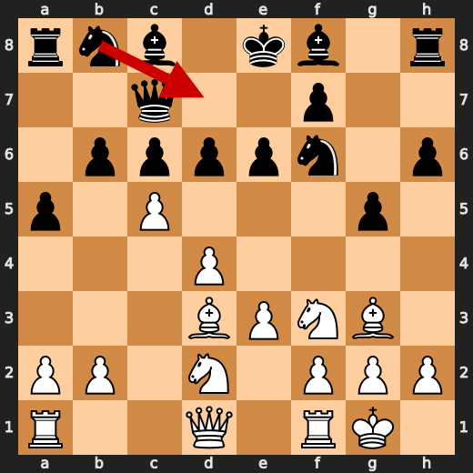

**After 10. a4**

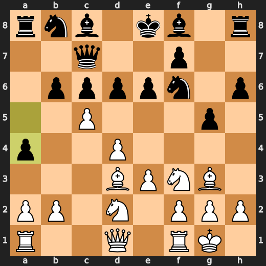

### ✅ Best: 11. Nc4 by You (White)

Nc4 matches the preferred move, so it keeps White’s strong position essentially intact. The useful pattern is to improve a piece when the engine confirms it is the most accurate choice.

- **Eval:** +7.50 → +7.40
- **Preferred:** `Nc4`
- **Loss:** 10 cp

**Before 11. Nc4**

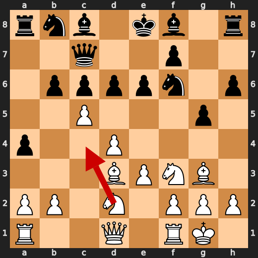

**After 11. Nc4**

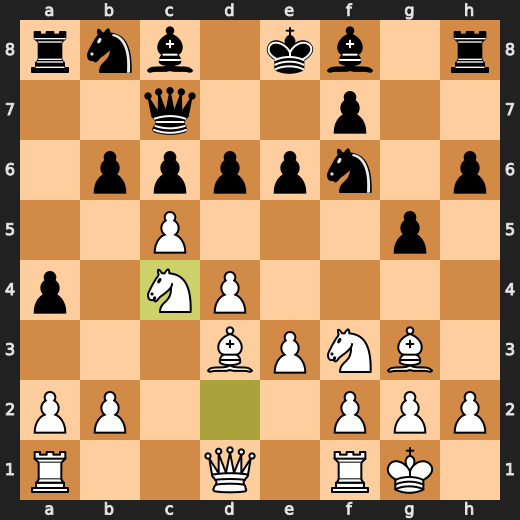

### ✅ Best: 31. exd4 by CPU (Black)

exd4 was the preferred move, so Black at least chose the forcing engine-approved capture. The practical pattern is to take the available forcing move when it is best, even if it does not change the position much.

- **Eval:** +12.00 → +12.23
- **Preferred:** `exd4`
- **Loss:** 23 cp

**Before 31. exd4**

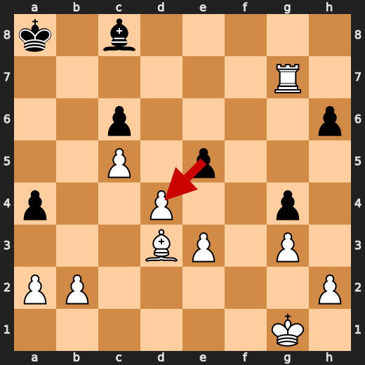

**After 31. exd4**

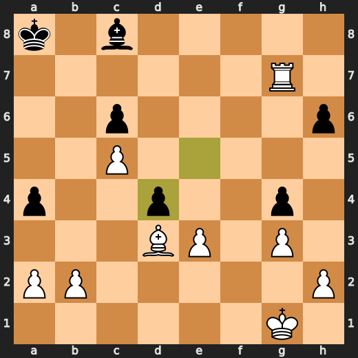

### ✅ Best: 32. exd4 by You (White)

exd4 was the preferred move, so it was a forcing, engine-approved way to keep White’s advantage. The useful pattern is to choose the direct capture when it is confirmed as the most accurate move.

- **Eval:** +12.33 → +12.10
- **Preferred:** `exd4`
- **Loss:** 23 cp

**Before 32. exd4**

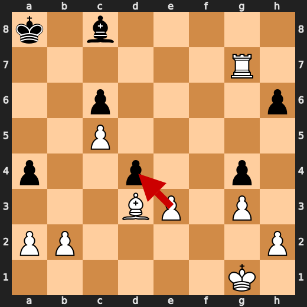

**After 32. exd4**

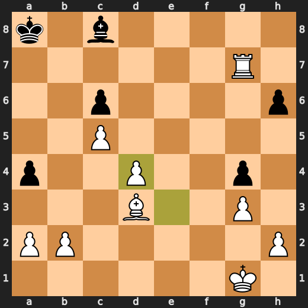

### 💀 Blunder: 35. Bxa2 by CPU (Black)

Bxa2 failed to address White’s immediate winning chances and worsened Black’s position into a forced mate. The preferred move was a3, which was a more resistant defensive try.

- **Eval:** +30.78 → White has mate
- **Preferred:** `a3`
- **Loss:** 96922 cp

**Before 35. Bxa2**

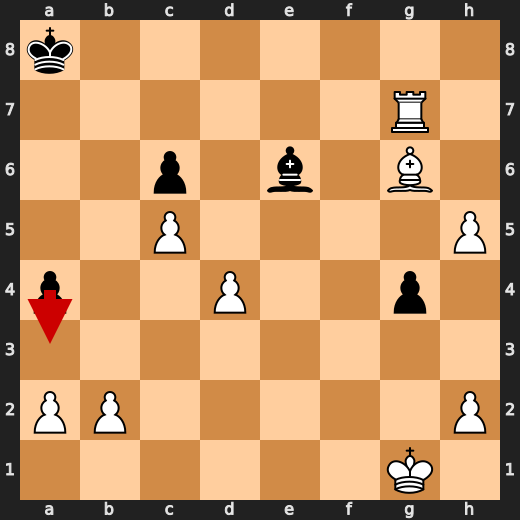

**After 35. Bxa2**

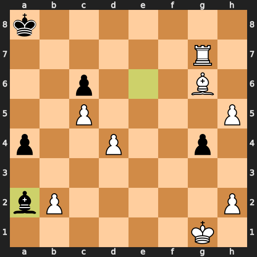

### 🏁 Checkmate: 39. Rhxg8# by You (White)

Rhxg8# was the preferred move because it immediately used the forcing checkmate available in the position. Learn to spot game-ending forcing moves before considering slower alternatives.

- **Eval:** White has mate → White has mate
- **Preferred:** `Rhxg8#`
- **Loss:** 0 cp

**Before 39. Rhxg8#**

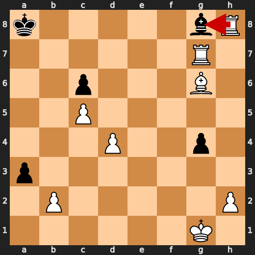

**After 39. Rhxg8#**

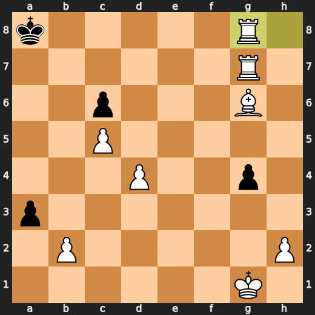

---

## Human Notes

Biggest caveman lesson: CPU (Black) blew it with **35. Bxa2**.

There was another real screw-up at **10. a4** by **CPU (Black)**.

The game-ending shot was **39. Rhxg8#** by **You (White)**.

---

<details>
<summary>Compact move list</summary>

- 📖 **1. d4** (You (White), Book) — +0.44 → +0.33, preferred `d4`, loss 11 cp
- 📖 **1. Nf6** (CPU (Black), Book) — +0.33 → +0.35, preferred `Nf6`, loss 2 cp
- 📖 **2. Bf4** (You (White), Book) — +0.40 → +0.16, preferred `Nf3`, loss 24 cp
- 📖 **2. d6** (CPU (Black), Book) — +0.00 → +0.43, preferred `c5`, loss 43 cp
- 📖 **3. e3** (You (White), Book) — +0.37 → +0.26, preferred `Nf3`, loss 11 cp
- 📖 **3. c6** (CPU (Black), Book) — +0.12 → +0.27, preferred `c5`, loss 15 cp
- 🔥 **4. Nf3** (You (White), Great) — +0.36 → +0.10, preferred `h3`, loss 26 cp
- 👍 **4. h6** (CPU (Black), Good) — -0.18 → +0.55, preferred `Nh5`, loss 73 cp
- 🔥 **5. Nbd2** (You (White), Great) — +0.58 → +0.09, preferred `h3`, loss 49 cp
- 👍 **5. Qc7** (CPU (Black), Good) — +0.05 → +0.83, preferred `Nh5`, loss 78 cp
- 🔥 **6. Bd3** (You (White), Great) — +0.84 → +0.40, preferred `e4`, loss 44 cp
- 👍 **6. g5** (CPU (Black), Good) — +0.38 → +0.92, preferred `Nh5`, loss 54 cp
- ✅ **7. Bg3** (You (White), Best) — +0.76 → +0.74, preferred `Bg3`, loss 2 cp
- ⚠️ **7. e6** (CPU (Black), Inaccuracy) — +0.75 → +1.98, preferred `Nh5`, loss 123 cp
- 👍 **8. O-O** (You (White), Good) — +1.96 → +0.96, preferred `h3`, loss 100 cp
- ⚠️ **8. a5** (CPU (Black), Inaccuracy) — +0.96 → +2.56, preferred `Nh5`, loss 160 cp
- ✅ **9. c4** (You (White), Best) — +2.52 → +2.38, preferred `c4`, loss 14 cp
- 👍 **9. b6** (CPU (Black), Good) — +2.26 → +3.14, preferred `c5`, loss 88 cp
- 👍 **10. c5** (You (White), Good) — +3.49 → +2.92, preferred `c5`, loss 57 cp
- ❌ **10. a4** (CPU (Black), Mistake) — +3.13 → +7.65, preferred `Nbd7`, loss 452 cp
- ✅ **11. Nc4** (You (White), Best) — +7.50 → +7.40, preferred `Nc4`, loss 10 cp
- 👍 **11. Qd8** (CPU (Black), Good) — +7.37 → +8.27, preferred `bxc5`, loss 90 cp
- ✅ **12. Nxb6** (You (White), Best) — +7.96 → +7.85, preferred `Nxb6`, loss 11 cp
- ⚠️ **12. Ra5** (CPU (Black), Inaccuracy) — +7.81 → +9.46, preferred `Ra7`, loss 165 cp
- ✅ **13. Nc4** (You (White), Best) — +9.30 → +9.53, preferred `Nc4`, loss 0 cp
- 🔥 **13. Ra7** (CPU (Black), Great) — +9.24 → +9.43, preferred `g4`, loss 19 cp
- 👍 **14. Bxd6** (You (White), Good) — +9.37 → +8.83, preferred `Nxd6+`, loss 54 cp
- ✅ **14. Nbd7** (CPU (Black), Best) — +8.92 → +9.00, preferred `Ba6`, loss 8 cp
- ✅ **15. Nfe5** (You (White), Best) — +9.35 → +9.22, preferred `Nfe5`, loss 13 cp
- ✅ **15. Nxe5** (CPU (Black), Best) — +9.20 → +9.15, preferred `Nxe5`, loss 0 cp
- ✅ **16. Bxe5** (You (White), Best) — +9.38 → +9.37, preferred `Bxe5`, loss 1 cp
- ✅ **16. Bg7** (CPU (Black), Best) — +9.38 → +9.15, preferred `Be7`, loss 0 cp
- 👍 **17. Bxf6** (You (White), Good) — +9.13 → +8.12, preferred `Nd6+`, loss 101 cp
- 🔥 **17. Qxf6** (CPU (Black), Great) — +8.09 → +8.38, preferred `Bxf6`, loss 29 cp
- ✅ **18. Nd6+** (You (White), Best) — +8.61 → +8.52, preferred `Nd6+`, loss 9 cp
- 👍 **18. Kd8** (CPU (Black), Good) — +8.60 → +9.48, preferred `Ke7`, loss 88 cp
- 👍 **19. f4** (You (White), Good) — +9.46 → +8.61, preferred `b4`, loss 85 cp
- 👍 **19. Kc7** (CPU (Black), Good) — +8.56 → +9.66, preferred `Bf8`, loss 110 cp
- ✅ **20. fxg5** (You (White), Best) — +9.92 → +10.00, preferred `Qe1`, loss 0 cp
- 👍 **20. Qxg5** (CPU (Black), Good) — +9.53 → +10.65, preferred `Qe7`, loss 112 cp
- ⚠️ **21. Qf3** (You (White), Inaccuracy) — +10.53 → +8.95, preferred `Rxf7+`, loss 158 cp
- 🔥 **21. f5** (CPU (Black), Great) — +8.79 → +9.28, preferred `e5`, loss 49 cp
- 🔥 **22. Nf7** (You (White), Great) — +9.47 → +9.07, preferred `b4`, loss 40 cp
- ✅ **22. Qh4** (CPU (Black), Best) — +9.07 → +8.95, preferred `Qh4`, loss 0 cp
- 👍 **23. g3** (You (White), Good) — +9.26 → +8.75, preferred `Nxh8`, loss 51 cp
- 🔥 **23. Qg4** (CPU (Black), Great) — +8.52 → +9.00, preferred `Qe7`, loss 48 cp
- ✅ **24. Qxg4** (You (White), Best) — +8.69 → +8.52, preferred `Qxg4`, loss 17 cp
- ✅ **24. fxg4** (CPU (Black), Best) — +8.83 → +9.05, preferred `fxg4`, loss 22 cp
- ✅ **25. Nxh8** (You (White), Best) — +9.00 → +8.83, preferred `Nxh8`, loss 17 cp
- ✅ **25. Bxh8** (CPU (Black), Best) — +8.84 → +8.83, preferred `Bxh8`, loss 0 cp
- ✅ **26. Rf8** (You (White), Best) — +8.92 → +8.84, preferred `Rf8`, loss 8 cp
- ✅ **26. Bg7** (CPU (Black), Best) — +8.83 → +8.90, preferred `Bg7`, loss 7 cp
- ✅ **27. Rf7+** (You (White), Best) — +9.00 → +8.91, preferred `Rf7+`, loss 9 cp
- ✅ **27. Kb8** (CPU (Black), Best) — +8.91 → +8.76, preferred `Kb8`, loss 0 cp
- ✅ **28. Raf1** (You (White), Best) — +8.83 → +9.16, preferred `Rxa7`, loss 0 cp
- ⚠️ **28. e5** (CPU (Black), Inaccuracy) — +9.04 → +10.65, preferred `Rxf7`, loss 161 cp
- ✅ **29. Rxa7** (You (White), Best) — +10.94 → +11.63, preferred `Rxa7`, loss 0 cp
- ✅ **29. Kxa7** (CPU (Black), Best) — +11.72 → +11.76, preferred `Kxa7`, loss 4 cp
- ✅ **30. Rf7+** (You (White), Best) — +11.76 → +11.95, preferred `Rf7+`, loss 0 cp
- ✅ **30. Ka8** (CPU (Black), Best) — +12.00 → +11.69, preferred `Kb8`, loss 0 cp
- ✅ **31. Rxg7** (You (White), Best) — +12.10 → +12.02, preferred `Rxg7`, loss 8 cp
- ✅ **31. exd4** (CPU (Black), Best) — +12.00 → +12.23, preferred `exd4`, loss 23 cp
- ✅ **32. exd4** (You (White), Best) — +12.33 → +12.10, preferred `exd4`, loss 23 cp
- 🔥 **32. h5** (CPU (Black), Great) — +12.30 → +12.69, preferred `Bb7`, loss 39 cp
- ✅ **33. Bg6** (You (White), Best) — +12.84 → +12.84, preferred `Be4`, loss 0 cp
- ⚠️ **33. h4** (CPU (Black), Inaccuracy) — +12.92 → +14.33, preferred `Ba6`, loss 141 cp
- ✅ **34. gxh4** (You (White), Best) — +14.76 → +15.69, preferred `gxh4`, loss 0 cp
- 👍 **34. Be6** (CPU (Black), Good) — +26.48 → +27.10, preferred `Kb8`, loss 62 cp
- ✅ **35. h5** (You (White), Best) — +29.30 → +32.16, preferred `h5`, loss 0 cp
- 💀 **35. Bxa2** (CPU (Black), Blunder) — +30.78 → White has mate, preferred `a3`, loss 96922 cp
- ✅ **36. h6** (You (White), Best) — White has mate → White has mate, preferred `h6`, loss 0 cp
- ✅ **36. Bc4** (CPU (Black), Best) — White has mate → White has mate, preferred `Bg8`, loss 0 cp
- ✅ **37. h7** (You (White), Best) — White has mate → White has mate, preferred `h7`, loss 0 cp
- ✅ **37. a3** (CPU (Black), Best) — White has mate → White has mate, preferred `a3`, loss 0 cp
- ✅ **38. h8=R+** (You (White), Best) — White has mate → White has mate, preferred `h8=R+`, loss 0 cp
- ✅ **38. Bg8** (CPU (Black), Best) — White has mate → White has mate, preferred `Bg8`, loss 0 cp
- 🏁 **39. Rhxg8#** (You (White), Checkmate) — White has mate → White has mate, preferred `Rhxg8#`, loss 0 cp

</details>

---

<details>
<summary>Raw engine table</summary>

| Ply | Move | Actor | Played | Label | Eval Before | Eval After | Preferred | Loss |
|---:|---:|---|---|---|---:|---:|---|---:|
| 1 | 1 | You (White) | d4 | Book | +0.44 | +0.33 | d4 | 11 |
| 2 | 1 | CPU (Black) | Nf6 | Book | +0.33 | +0.35 | Nf6 | 2 |
| 3 | 2 | You (White) | Bf4 | Book | +0.40 | +0.16 | Nf3 | 24 |
| 4 | 2 | CPU (Black) | d6 | Book | +0.00 | +0.43 | c5 | 43 |
| 5 | 3 | You (White) | e3 | Book | +0.37 | +0.26 | Nf3 | 11 |
| 6 | 3 | CPU (Black) | c6 | Book | +0.12 | +0.27 | c5 | 15 |
| 7 | 4 | You (White) | Nf3 | Great | +0.36 | +0.10 | h3 | 26 |
| 8 | 4 | CPU (Black) | h6 | Good | -0.18 | +0.55 | Nh5 | 73 |
| 9 | 5 | You (White) | Nbd2 | Great | +0.58 | +0.09 | h3 | 49 |
| 10 | 5 | CPU (Black) | Qc7 | Good | +0.05 | +0.83 | Nh5 | 78 |
| 11 | 6 | You (White) | Bd3 | Great | +0.84 | +0.40 | e4 | 44 |
| 12 | 6 | CPU (Black) | g5 | Good | +0.38 | +0.92 | Nh5 | 54 |
| 13 | 7 | You (White) | Bg3 | Best | +0.76 | +0.74 | Bg3 | 2 |
| 14 | 7 | CPU (Black) | e6 | Inaccuracy | +0.75 | +1.98 | Nh5 | 123 |
| 15 | 8 | You (White) | O-O | Good | +1.96 | +0.96 | h3 | 100 |
| 16 | 8 | CPU (Black) | a5 | Inaccuracy | +0.96 | +2.56 | Nh5 | 160 |
| 17 | 9 | You (White) | c4 | Best | +2.52 | +2.38 | c4 | 14 |
| 18 | 9 | CPU (Black) | b6 | Good | +2.26 | +3.14 | c5 | 88 |
| 19 | 10 | You (White) | c5 | Good | +3.49 | +2.92 | c5 | 57 |
| 20 | 10 | CPU (Black) | a4 | Mistake | +3.13 | +7.65 | Nbd7 | 452 |
| 21 | 11 | You (White) | Nc4 | Best | +7.50 | +7.40 | Nc4 | 10 |
| 22 | 11 | CPU (Black) | Qd8 | Good | +7.37 | +8.27 | bxc5 | 90 |
| 23 | 12 | You (White) | Nxb6 | Best | +7.96 | +7.85 | Nxb6 | 11 |
| 24 | 12 | CPU (Black) | Ra5 | Inaccuracy | +7.81 | +9.46 | Ra7 | 165 |
| 25 | 13 | You (White) | Nc4 | Best | +9.30 | +9.53 | Nc4 | 0 |
| 26 | 13 | CPU (Black) | Ra7 | Great | +9.24 | +9.43 | g4 | 19 |
| 27 | 14 | You (White) | Bxd6 | Good | +9.37 | +8.83 | Nxd6+ | 54 |
| 28 | 14 | CPU (Black) | Nbd7 | Best | +8.92 | +9.00 | Ba6 | 8 |
| 29 | 15 | You (White) | Nfe5 | Best | +9.35 | +9.22 | Nfe5 | 13 |
| 30 | 15 | CPU (Black) | Nxe5 | Best | +9.20 | +9.15 | Nxe5 | 0 |
| 31 | 16 | You (White) | Bxe5 | Best | +9.38 | +9.37 | Bxe5 | 1 |
| 32 | 16 | CPU (Black) | Bg7 | Best | +9.38 | +9.15 | Be7 | 0 |
| 33 | 17 | You (White) | Bxf6 | Good | +9.13 | +8.12 | Nd6+ | 101 |
| 34 | 17 | CPU (Black) | Qxf6 | Great | +8.09 | +8.38 | Bxf6 | 29 |
| 35 | 18 | You (White) | Nd6+ | Best | +8.61 | +8.52 | Nd6+ | 9 |
| 36 | 18 | CPU (Black) | Kd8 | Good | +8.60 | +9.48 | Ke7 | 88 |
| 37 | 19 | You (White) | f4 | Good | +9.46 | +8.61 | b4 | 85 |
| 38 | 19 | CPU (Black) | Kc7 | Good | +8.56 | +9.66 | Bf8 | 110 |
| 39 | 20 | You (White) | fxg5 | Best | +9.92 | +10.00 | Qe1 | 0 |
| 40 | 20 | CPU (Black) | Qxg5 | Good | +9.53 | +10.65 | Qe7 | 112 |
| 41 | 21 | You (White) | Qf3 | Inaccuracy | +10.53 | +8.95 | Rxf7+ | 158 |
| 42 | 21 | CPU (Black) | f5 | Great | +8.79 | +9.28 | e5 | 49 |
| 43 | 22 | You (White) | Nf7 | Great | +9.47 | +9.07 | b4 | 40 |
| 44 | 22 | CPU (Black) | Qh4 | Best | +9.07 | +8.95 | Qh4 | 0 |
| 45 | 23 | You (White) | g3 | Good | +9.26 | +8.75 | Nxh8 | 51 |
| 46 | 23 | CPU (Black) | Qg4 | Great | +8.52 | +9.00 | Qe7 | 48 |
| 47 | 24 | You (White) | Qxg4 | Best | +8.69 | +8.52 | Qxg4 | 17 |
| 48 | 24 | CPU (Black) | fxg4 | Best | +8.83 | +9.05 | fxg4 | 22 |
| 49 | 25 | You (White) | Nxh8 | Best | +9.00 | +8.83 | Nxh8 | 17 |
| 50 | 25 | CPU (Black) | Bxh8 | Best | +8.84 | +8.83 | Bxh8 | 0 |
| 51 | 26 | You (White) | Rf8 | Best | +8.92 | +8.84 | Rf8 | 8 |
| 52 | 26 | CPU (Black) | Bg7 | Best | +8.83 | +8.90 | Bg7 | 7 |
| 53 | 27 | You (White) | Rf7+ | Best | +9.00 | +8.91 | Rf7+ | 9 |
| 54 | 27 | CPU (Black) | Kb8 | Best | +8.91 | +8.76 | Kb8 | 0 |
| 55 | 28 | You (White) | Raf1 | Best | +8.83 | +9.16 | Rxa7 | 0 |
| 56 | 28 | CPU (Black) | e5 | Inaccuracy | +9.04 | +10.65 | Rxf7 | 161 |
| 57 | 29 | You (White) | Rxa7 | Best | +10.94 | +11.63 | Rxa7 | 0 |
| 58 | 29 | CPU (Black) | Kxa7 | Best | +11.72 | +11.76 | Kxa7 | 4 |
| 59 | 30 | You (White) | Rf7+ | Best | +11.76 | +11.95 | Rf7+ | 0 |
| 60 | 30 | CPU (Black) | Ka8 | Best | +12.00 | +11.69 | Kb8 | 0 |
| 61 | 31 | You (White) | Rxg7 | Best | +12.10 | +12.02 | Rxg7 | 8 |
| 62 | 31 | CPU (Black) | exd4 | Best | +12.00 | +12.23 | exd4 | 23 |
| 63 | 32 | You (White) | exd4 | Best | +12.33 | +12.10 | exd4 | 23 |
| 64 | 32 | CPU (Black) | h5 | Great | +12.30 | +12.69 | Bb7 | 39 |
| 65 | 33 | You (White) | Bg6 | Best | +12.84 | +12.84 | Be4 | 0 |
| 66 | 33 | CPU (Black) | h4 | Inaccuracy | +12.92 | +14.33 | Ba6 | 141 |
| 67 | 34 | You (White) | gxh4 | Best | +14.76 | +15.69 | gxh4 | 0 |
| 68 | 34 | CPU (Black) | Be6 | Good | +26.48 | +27.10 | Kb8 | 62 |
| 69 | 35 | You (White) | h5 | Best | +29.30 | +32.16 | h5 | 0 |
| 70 | 35 | CPU (Black) | Bxa2 | Blunder | +30.78 | White has mate | a3 | 96922 |
| 71 | 36 | You (White) | h6 | Best | White has mate | White has mate | h6 | 0 |
| 72 | 36 | CPU (Black) | Bc4 | Best | White has mate | White has mate | Bg8 | 0 |
| 73 | 37 | You (White) | h7 | Best | White has mate | White has mate | h7 | 0 |
| 74 | 37 | CPU (Black) | a3 | Best | White has mate | White has mate | a3 | 0 |
| 75 | 38 | You (White) | h8=R+ | Best | White has mate | White has mate | h8=R+ | 0 |
| 76 | 38 | CPU (Black) | Bg8 | Best | White has mate | White has mate | Bg8 | 0 |
| 77 | 39 | You (White) | Rhxg8# | Checkmate | White has mate | White has mate | Rhxg8# | 0 |

</details>

---

<details>
<summary>Clean PGN</summary>

```pgn
[Event "AI Factory's Chess"]
[Site "Android Device"]
[Date "2026.05.14"]
[Round "1"]
[White "You"]
[Black "CPU (5)"]
[Result "1-0"]
[PlyCount "79"]

1. d4 Nf6 2. Bf4 d6 3. e3 c6 4. Nf3 h6 5. Nbd2 Qc7 6. Bd3 g5 7. Bg3 e6 8. O-O
a5 9. c4 b6 10. c5 a4 11. Nc4 Qd8 12. Nxb6 Ra5 13. Nc4 Ra7 14. Bxd6 Nbd7 15.
Nfe5 Nxe5 16. Bxe5 Bg7 17. Bxf6 Qxf6 18. Nd6+ Kd8 19. f4 Kc7 20. fxg5 Qxg5 21.
Qf3 f5 22. Nf7 Qh4 23. g3 Qg4 24. Qxg4 fxg4 25. Nxh8 Bxh8 26. Rf8 Bg7 27. Rf7+
Kb8 28. Raf1 e5 29. Rxa7 Kxa7 30. Rf7+ Ka8 31. Rxg7 exd4 32. exd4 h5 33. Bg6 h4
34. gxh4 Be6 35. h5 Bxa2 36. h6 Bc4 37. h7 a3 38. h8=R+ Bg8 39. Rhxg8# 1-0
```

</details>
