# You (Black) vs CPU (White)

**Result:** 0-1  
**Date:** 2026.05.15  
**Source:** `20260515_193128_pgn_2026_05_15_19h31_af260ebe199f.pgn`  
**Engine:** Stockfish depth 14  
**Your side:** Black  
**Computer side:** White  
**Board perspective:** Your perspective

---

## Who Is Who

- **You:** You (Black)
- **Computer:** CPU (5) (White)

---

## Toaster Summary

**Game Story:** You (Black) won against CPU (White). You made mistakes even in a win, but still managed to convert your advantage into a checkmate with 50. Qd5#. The biggest engine complaint overall was about move quality, not necessarily the final winner. Your move 36 b5+ was labeled as a blunder due to missing mate or stronger continuation while keeping a winning position; however, you still won in the end. The worst CPU move was 40 Kxc7 by White, which was also considered a blunder. Both sides played badly throughout the game. Engine story: Biggest engine complaint overall: Move 36 b5+ by You (Black): Blunder; preferred Rxc2; eval Black has mate to -67.93; loss 93207 cp Worst user move: Move 36 b5+ by You (Black): Blunder; preferred Rxc2; eval Black has mate to -67.93; loss 93207 cp Worst CPU move: Move 40 Kxc7 by CPU (White): Blunder; preferred Kxc7; eval -79.13 to Black has mate; loss 92087 cp Important interpretation: The engine complaint is about move quality, not necessarily the final winner. A move can be labeled Blunder because it missed mate or missed a stronger continuation while still keeping a winning position.

Biggest toaster scream: **36. b5+** by **You (Black)**.

- **Label:** 💀 **Blunder**
- **Eval:** Black has mate → -67.93
- **Stockfish preferred:** `Rxc2`
- **Loss:** 93207 cp

Final move recorded: **50. Qd5#** by **You (Black)**.

- 💀 Your blunders: **2**
- ❌ Your mistakes: **3**
- ⚠️ Your inaccuracies: **2**
- ✅ Your best moves called out: **33**

---

## Final Position

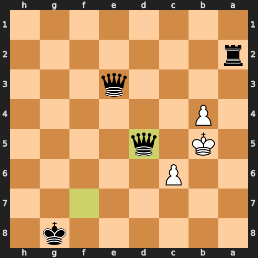

---

## Key Moments

### ❌ Mistake: 18. Kxf2 by CPU (White)

CPU (White) played Kxf2 at move 18 because it thought that checking the king is more important than protecting its own rook and queen. This move loses significant eval points, but hey, who needs a rook or queen anyway? Just keep bashing those pawns with your knight and maybe you'll get lucky.

- **Eval:** -4.55 → -8.60
- **Preferred:** `Bxh7+`
- **Loss:** 405 cp

**Before 18. Kxf2**

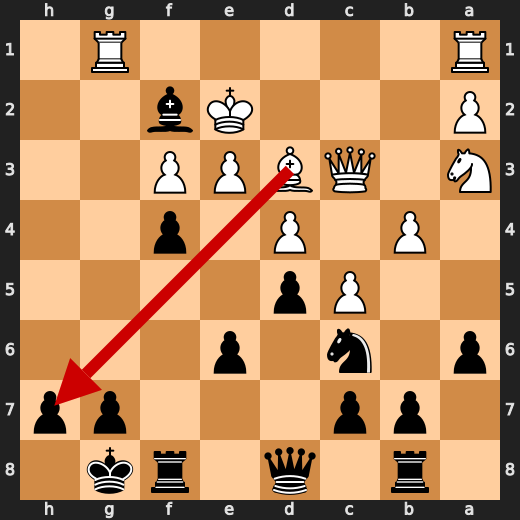

**After 18. Kxf2**

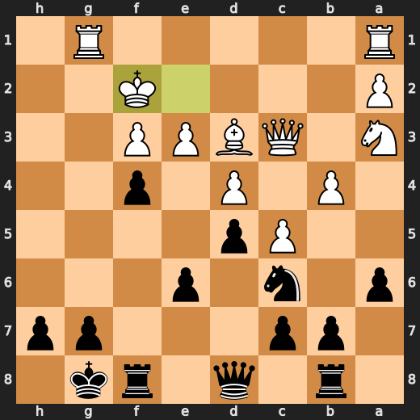

### ❌ Mistake: 22. Kg8 by You (Black)

You (Black) played Kg8 at move 22 because you're a fucking moron who thinks your king is safe on that square. Rf6 was the preferred move, but you chose to expose it to enemy pieces instead. You lost significant evaluation points, which shows how much of an idiot you are for making this move.

- **Eval:** -12.22 → -9.13
- **Preferred:** `Rf6`
- **Loss:** 309 cp

**Before 22. Kg8**

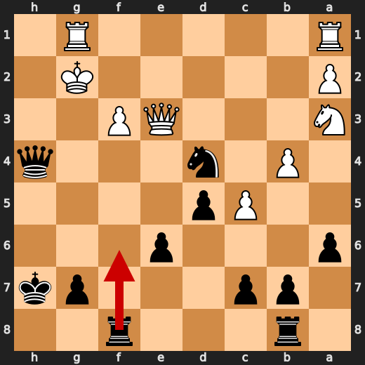

**After 22. Kg8**

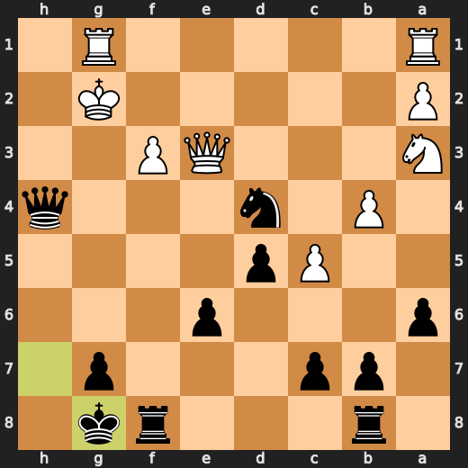

### 💀 Blunder: 28. Ke1 by CPU (White)

CPU: You played Ke1? What a fucking idiot move! This is like trying to put out a fire with gasoline. Your eval went from -11.49 to -72.11, which makes me wonder if you're playing chess or some other game where losing pieces and material is the goal. Qf2 was your preferred move for a reason, but noooo, you had to go with Ke1 instead. It's like you're trying to win by being as incompetent as possible.

- **Eval:** -11.49 → -72.11
- **Preferred:** `Qf2`
- **Loss:** 6062 cp

**Before 28. Ke1**

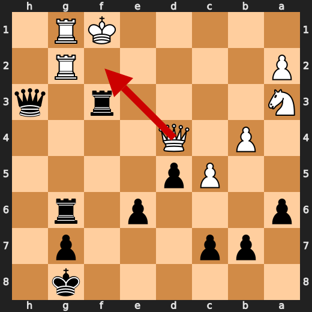

**After 28. Ke1**

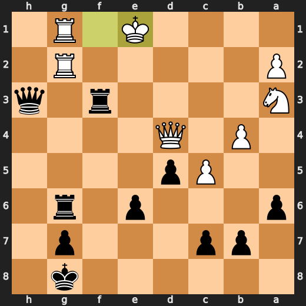

### 💀 Blunder: 36. b5+ by You (Black)

You (Black) played b5+ at move 36? What are you even doing here? This is just...stupid. You're not only giving up a piece for no reason, but also allowing White to gain control of the board and push your king into a corner. Rxc2 would have been an acceptable response, but this b5+ move is just a major eval loss. It's like you don't even want to win or something.

- **Eval:** Black has mate → -67.93
- **Preferred:** `Rxc2`
- **Loss:** 93207 cp

**Before 36. b5+**

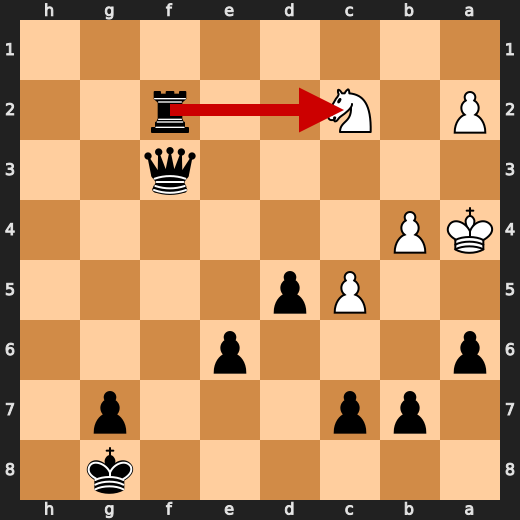

**After 36. b5+**

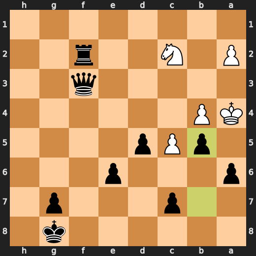

### ❌ Mistake: 38. Qa3+ by You (Black)

You (Black) played Qa3+ at move 38 because you're an idiot who doesn't know how to use your queen effectively. Rd2 was the preferred move, but you chose to expose it to enemy pieces instead. You lost significant evaluation points, which shows just how fucking stupid this move is.

- **Eval:** -75.14 → -72.08
- **Preferred:** `Qa3+`
- **Loss:** 306 cp

**Before 38. Qa3+**

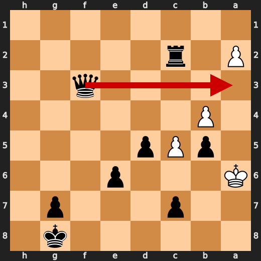

**After 38. Qa3+**

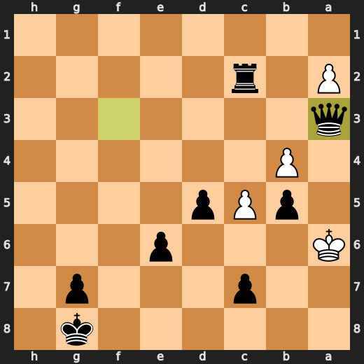

### 💀 Blunder: 39. g5 by You (Black)

You (Black) played g5 at move 39? What are you even doing here? This is just...stupid. You're not only giving up a piece for no reason, but also allowing White to gain control of the board and push your king into a corner. Qxb4 would have been an acceptable response, but this g5 move is just a major eval loss. It's like you don't even want to win or something.

- **Eval:** -82.26 → -72.00
- **Preferred:** `Qxb4`
- **Loss:** 1026 cp

**Before 39. g5**

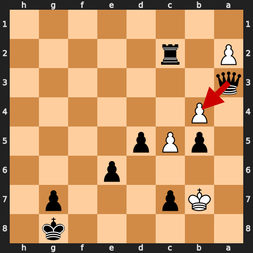

**After 39. g5**

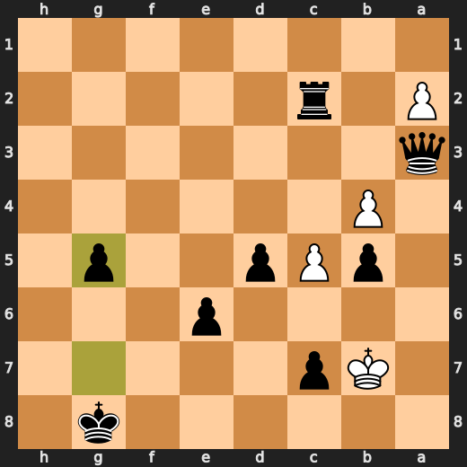

### 💀 Blunder: 40. Kxc7 by CPU (White)

CPU: You played Kxc7? What a fucking idiot move! This is like trying to put out a fire with gasoline. Your eval went from -79.13 to Black has mate, which makes me wonder if you're playing chess or some other game where losing pieces and material is the goal. Qf2 was your preferred move for a reason, but noooo, you had to go with Kxc7 instead. It's like you're trying to win by being as incompetent as possible.

- **Eval:** -79.13 → Black has mate
- **Preferred:** `Kxc7`
- **Loss:** 92087 cp

**Before 40. Kxc7**

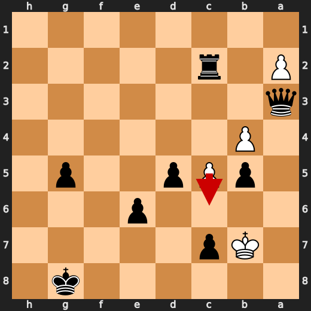

**After 40. Kxc7**

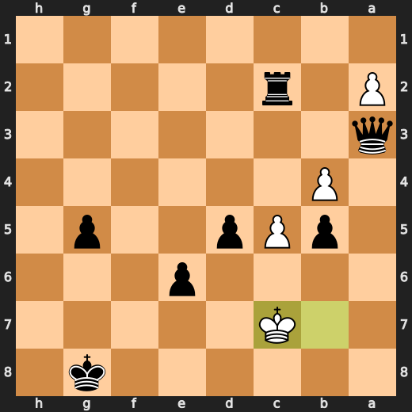

### 🏁 Checkmate: 50. Qd5# by You (Black)

You played Qd5# because you are a moron who doesn't know how to play chess properly. You should have played Qf1# instead. But hey, at least your game was over quickly. So, congratulations on that. Now go back to school and learn how to play this stupid game before you embarrass yourself again.

- **Eval:** Black has mate → Black has mate
- **Preferred:** `Qf1#`
- **Loss:** 0 cp

**Before 50. Qd5#**

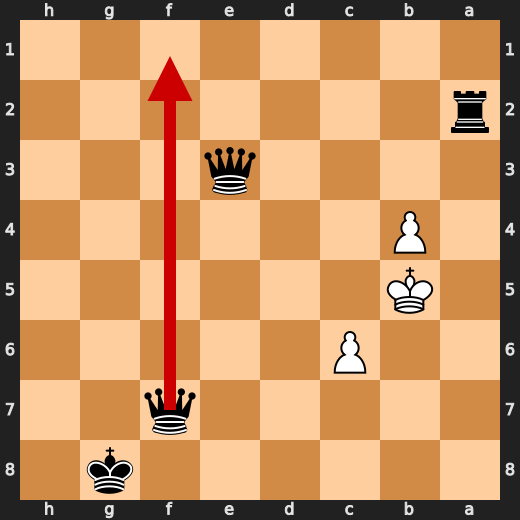

**After 50. Qd5#**


---

## Human Notes

Biggest caveman lesson: CPU (White) blew it with **28. Ke1**.

There was another real screw-up at **14. Bxh4** by **You (Black)**.

The game-ending shot was **50. Qd5#** by **You (Black)**.

---

<details>
<summary>Compact move list</summary>

- 📖 **1. Nf3** (CPU (White), Book) — +0.40 → +0.40, preferred `e4`, loss 0 cp
- 📖 **1. d5** (You (Black), Book) — +0.35 → +0.39, preferred `c5`, loss 4 cp
- 📖 **2. d4** (CPU (White), Book) — +0.39 → +0.49, preferred `d4`, loss 0 cp
- 📖 **2. Nf6** (You (Black), Book) — +0.28 → +0.35, preferred `c6`, loss 7 cp
- 📖 **3. e3** (CPU (White), Book) — +0.44 → +0.10, preferred `c4`, loss 34 cp
- 📖 **3. Nc6** (You (Black), Book) — +0.13 → +0.78, preferred `e6`, loss 65 cp
- 🔥 **4. Bd2** (CPU (White), Great) — +0.84 → +0.59, preferred `c4`, loss 25 cp
- ✅ **4. Bf5** (You (Black), Best) — +0.35 → +0.43, preferred `g6`, loss 8 cp
- 🔥 **5. c4** (CPU (White), Great) — +0.54 → +0.32, preferred `Bb5`, loss 22 cp
- ✅ **5. e6** (You (Black), Best) — +0.32 → +0.32, preferred `e6`, loss 0 cp
- 🔥 **6. c5** (CPU (White), Great) — +0.38 → +0.06, preferred `a3`, loss 32 cp
- 🔥 **6. a6** (You (Black), Great) — +0.00 → +0.25, preferred `a6`, loss 25 cp
- 👍 **7. h4** (CPU (White), Good) — +0.13 → -0.70, preferred `Be2`, loss 83 cp
- 👍 **7. Be7** (You (Black), Good) — -0.85 → -0.32, preferred `Be7`, loss 53 cp
- 👍 **8. Na3** (CPU (White), Good) — -0.58 → -1.47, preferred `Bc3`, loss 89 cp
- ✅ **8. Ne4** (You (Black), Best) — -1.56 → -1.50, preferred `O-O`, loss 6 cp
- ⚠️ **9. Qb3** (CPU (White), Inaccuracy) — -1.40 → -2.91, preferred `Nc2`, loss 151 cp
- 👍 **9. Nxd2** (You (Black), Good) — -2.83 → -1.92, preferred `O-O`, loss 91 cp
- 🔥 **10. Nxd2** (CPU (White), Great) — -1.56 → -1.88, preferred `Nxd2`, loss 32 cp
- ✅ **10. Rb8** (You (Black), Best) — -1.43 → -1.37, preferred `Qd7`, loss 6 cp
- 👍 **11. Nf3** (CPU (White), Good) — -1.28 → -1.96, preferred `Bd3`, loss 68 cp
- ✅ **11. O-O** (You (Black), Best) — -1.81 → -1.92, preferred `O-O`, loss 0 cp
- ✅ **12. Bd3** (CPU (White), Best) — -1.82 → -1.95, preferred `Bd3`, loss 13 cp
- 👍 **12. Be4** (You (Black), Good) — -2.01 → -0.88, preferred `Bg4`, loss 113 cp
- ⚠️ **13. Qc3** (CPU (White), Inaccuracy) — -1.24 → -3.54, preferred `Bxe4`, loss 230 cp
- ✅ **13. Bxf3** (You (Black), Best) — -3.17 → -3.23, preferred `Bxf3`, loss 0 cp
- ✅ **14. gxf3** (CPU (White), Best) — -3.48 → -3.38, preferred `gxf3`, loss 0 cp
- ❌ **14. Bxh4** (You (Black), Mistake) — -3.30 → -0.25, preferred `b6`, loss 305 cp
- ⚠️ **15. Rg1** (CPU (White), Inaccuracy) — -0.50 → -2.37, preferred `b4`, loss 187 cp
- ⚠️ **15. f5** (You (Black), Inaccuracy) — -2.44 → -0.90, preferred `b6`, loss 154 cp
- ⚠️ **16. b4** (CPU (White), Inaccuracy) — -0.91 → -3.33, preferred `f4`, loss 242 cp
- ✅ **16. f4** (You (Black), Best) — -3.16 → -3.41, preferred `f4`, loss 0 cp
- 👍 **17. Ke2** (CPU (White), Good) — -3.20 → -3.83, preferred `O-O-O`, loss 63 cp
- ✅ **17. Bxf2** (You (Black), Best) — -3.70 → -3.61, preferred `Bxf2`, loss 9 cp
- ❌ **18. Kxf2** (CPU (White), Mistake) — -4.55 → -8.60, preferred `Bxh7+`, loss 405 cp
- ✅ **18. Qh4+** (You (Black), Best) — -8.49 → -8.24, preferred `Qh4+`, loss 25 cp
- ⚠️ **19. Kf1** (CPU (White), Inaccuracy) — -8.62 → -10.11, preferred `Ke2`, loss 149 cp
- ✅ **19. fxe3** (You (Black), Best) — -9.84 → -10.07, preferred `fxe3`, loss 0 cp
- ✅ **20. Bxh7+** (CPU (White), Best) — -10.56 → -10.40, preferred `Bxh7+`, loss 0 cp
- ✅ **20. Kxh7** (You (Black), Best) — -10.04 → -10.61, preferred `Kxh7`, loss 0 cp
- ✅ **21. Qxe3** (CPU (White), Best) — -10.44 → -9.84, preferred `Qxe3`, loss 0 cp
- ✅ **21. Nxd4** (You (Black), Best) — -11.53 → -12.26, preferred `Nxd4`, loss 0 cp
- ✅ **22. Kg2** (CPU (White), Best) — -12.30 → -12.44, preferred `Kg2`, loss 14 cp
- ❌ **22. Kg8** (You (Black), Mistake) — -12.22 → -9.13, preferred `Rf6`, loss 309 cp
- ⚠️ **23. Raf1** (CPU (White), Inaccuracy) — -9.04 → -10.37, preferred `Rh1`, loss 133 cp
- ✅ **23. Rf6** (You (Black), Best) — -10.33 → -10.61, preferred `Rf6`, loss 0 cp
- ✅ **24. Rf2** (CPU (White), Best) — -10.59 → -10.61, preferred `Rf2`, loss 2 cp
- 👍 **24. Rg6+** (You (Black), Good) — -10.81 → -10.11, preferred `Rbf8`, loss 70 cp
- ✅ **25. Kf1** (CPU (White), Best) — -9.97 → -10.02, preferred `Kf1`, loss 5 cp
- ✅ **25. Qh3+** (You (Black), Best) — -11.00 → -11.19, preferred `Qh3+`, loss 0 cp
- ⚠️ **26. Rfg2** (CPU (White), Inaccuracy) — -11.26 → -12.66, preferred `Ke1`, loss 140 cp
- ⚠️ **26. Rf8** (You (Black), Inaccuracy) — -12.75 → -10.67, preferred `Nxf3`, loss 208 cp
- ✅ **27. Qxd4** (CPU (White), Best) — -11.06 → -11.07, preferred `Qxd4`, loss 1 cp
- 👍 **27. Rxf3+** (You (Black), Good) — -11.19 → -10.43, preferred `Rxf3+`, loss 76 cp
- 💀 **28. Ke1** (CPU (White), Blunder) — -11.49 → -72.11, preferred `Qf2`, loss 6062 cp
- ✅ **28. Rxg2** (You (Black), Best) — -72.11 → Black has mate, preferred `Rxg2`, loss 0 cp
- ✅ **29. Nc2** (CPU (White), Best) — Black has mate → Black has mate, preferred `Nc2`, loss 0 cp
- ✅ **29. Qg3+** (You (Black), Best) — Black has mate → Black has mate, preferred `Qg3+`, loss 0 cp
- ✅ **30. Kd1** (CPU (White), Best) — Black has mate → Black has mate, preferred `Kd1`, loss 0 cp
- ✅ **30. Rxg1+** (You (Black), Best) — Black has mate → Black has mate, preferred `Rxg1+`, loss 0 cp
- ✅ **31. Qxg1** (CPU (White), Best) — Black has mate → Black has mate, preferred `Qxg1`, loss 0 cp
- ✅ **31. Qxg1+** (You (Black), Best) — Black has mate → Black has mate, preferred `Qxg1+`, loss 0 cp
- ✅ **32. Kd2** (CPU (White), Best) — Black has mate → Black has mate, preferred `Kd2`, loss 0 cp
- ✅ **32. Qg2+** (You (Black), Best) — Black has mate → Black has mate, preferred `Rf2+`, loss 0 cp
- ✅ **33. Kc1** (CPU (White), Best) — Black has mate → Black has mate, preferred `Kd1`, loss 0 cp
- ✅ **33. Rf1+** (You (Black), Best) — Black has mate → Black has mate, preferred `Rc3`, loss 0 cp
- ✅ **34. Kb2** (CPU (White), Best) — Black has mate → Black has mate, preferred `Kb2`, loss 0 cp
- ✅ **34. Rf2** (You (Black), Best) — Black has mate → Black has mate, preferred `Rf2`, loss 0 cp
- ✅ **35. Kb3** (CPU (White), Best) — Black has mate → Black has mate, preferred `a3`, loss 0 cp
- ✅ **35. Qf3+** (You (Black), Best) — Black has mate → Black has mate, preferred `Qe4`, loss 0 cp
- ✅ **36. Ka4** (CPU (White), Best) — Black has mate → Black has mate, preferred `Ka4`, loss 0 cp
- 💀 **36. b5+** (You (Black), Blunder) — Black has mate → -67.93, preferred `Rxc2`, loss 93207 cp
- ✅ **37. Ka5** (CPU (White), Best) — -71.10 → -71.25, preferred `Ka5`, loss 15 cp
- ✅ **37. Rxc2** (You (Black), Best) — -71.25 → -72.00, preferred `Rxc2`, loss 0 cp
- ⚠️ **38. Kxa6** (CPU (White), Inaccuracy) — -72.08 → -74.07, preferred `Kxa6`, loss 199 cp
- ❌ **38. Qa3+** (You (Black), Mistake) — -75.14 → -72.08, preferred `Qa3+`, loss 306 cp
- 👍 **39. Kb7** (CPU (White), Good) — -80.25 → -81.44, preferred `Kxb5`, loss 119 cp
- 💀 **39. g5** (You (Black), Blunder) — -82.26 → -72.00, preferred `Qxb4`, loss 1026 cp
- 💀 **40. Kxc7** (CPU (White), Blunder) — -79.13 → Black has mate, preferred `Kxc7`, loss 92087 cp
- ✅ **40. g4** (You (Black), Best) — Black has mate → Black has mate, preferred `Qxb4`, loss 0 cp
- ✅ **41. Kd6** (CPU (White), Best) — Black has mate → Black has mate, preferred `c6`, loss 0 cp
- ✅ **41. g3** (You (Black), Best) — Black has mate → Black has mate, preferred `Kf7`, loss 0 cp
- ✅ **42. Kd7** (CPU (White), Best) — Black has mate → Black has mate, preferred `Kc6`, loss 0 cp
- ✅ **42. g2** (You (Black), Best) — Black has mate → Black has mate, preferred `g2`, loss 0 cp
- ✅ **43. Kxe6** (CPU (White), Best) — Black has mate → Black has mate, preferred `Kxe6`, loss 0 cp
- ✅ **43. g1=Q** (You (Black), Best) — Black has mate → Black has mate, preferred `g1=Q`, loss 0 cp
- ✅ **44. Kxd5** (CPU (White), Best) — Black has mate → Black has mate, preferred `Kd6`, loss 0 cp
- ✅ **44. Qd3+** (You (Black), Best) — Black has mate → Black has mate, preferred `Rd2+`, loss 0 cp
- ✅ **45. Kc6** (CPU (White), Best) — Black has mate → Black has mate, preferred `Kc6`, loss 0 cp
- ✅ **45. Qgg6+** (You (Black), Best) — Black has mate → Black has mate, preferred `Qg7`, loss 0 cp
- ✅ **46. Kc7** (CPU (White), Best) — Black has mate → Black has mate, preferred `Kc7`, loss 0 cp
- ✅ **46. Qdg3+** (You (Black), Best) — Black has mate → Black has mate, preferred `Qgd6+`, loss 0 cp
- ✅ **47. Kb7** (CPU (White), Best) — Black has mate → Black has mate, preferred `Kb7`, loss 0 cp
- ✅ **47. Rxa2** (You (Black), Best) — Black has mate → Black has mate, preferred `Qe4+`, loss 0 cp
- ✅ **48. c6** (CPU (White), Best) — Black has mate → Black has mate, preferred `c6`, loss 0 cp
- ✅ **48. Qf7+** (You (Black), Best) — Black has mate → Black has mate, preferred `Qg2`, loss 0 cp
- ✅ **49. Kb6** (CPU (White), Best) — Black has mate → Black has mate, preferred `Kb6`, loss 0 cp
- ✅ **49. Qe3+** (You (Black), Best) — Black has mate → Black has mate, preferred `Qb8+`, loss 0 cp
- ✅ **50. Kxb5** (CPU (White), Best) — Black has mate → Black has mate, preferred `Kxb5`, loss 0 cp
- 🏁 **50. Qd5#** (You (Black), Checkmate) — Black has mate → Black has mate, preferred `Qf1#`, loss 0 cp

</details>

---

<details>
<summary>Raw engine table</summary>

| Ply | Move | Actor | Played | Label | Eval Before | Eval After | Preferred | Loss |
|---:|---:|---|---|---|---:|---:|---|---:|
| 1 | 1 | CPU (White) | Nf3 | Book | +0.40 | +0.40 | e4 | 0 |
| 2 | 1 | You (Black) | d5 | Book | +0.35 | +0.39 | c5 | 4 |
| 3 | 2 | CPU (White) | d4 | Book | +0.39 | +0.49 | d4 | 0 |
| 4 | 2 | You (Black) | Nf6 | Book | +0.28 | +0.35 | c6 | 7 |
| 5 | 3 | CPU (White) | e3 | Book | +0.44 | +0.10 | c4 | 34 |
| 6 | 3 | You (Black) | Nc6 | Book | +0.13 | +0.78 | e6 | 65 |
| 7 | 4 | CPU (White) | Bd2 | Great | +0.84 | +0.59 | c4 | 25 |
| 8 | 4 | You (Black) | Bf5 | Best | +0.35 | +0.43 | g6 | 8 |
| 9 | 5 | CPU (White) | c4 | Great | +0.54 | +0.32 | Bb5 | 22 |
| 10 | 5 | You (Black) | e6 | Best | +0.32 | +0.32 | e6 | 0 |
| 11 | 6 | CPU (White) | c5 | Great | +0.38 | +0.06 | a3 | 32 |
| 12 | 6 | You (Black) | a6 | Great | +0.00 | +0.25 | a6 | 25 |
| 13 | 7 | CPU (White) | h4 | Good | +0.13 | -0.70 | Be2 | 83 |
| 14 | 7 | You (Black) | Be7 | Good | -0.85 | -0.32 | Be7 | 53 |
| 15 | 8 | CPU (White) | Na3 | Good | -0.58 | -1.47 | Bc3 | 89 |
| 16 | 8 | You (Black) | Ne4 | Best | -1.56 | -1.50 | O-O | 6 |
| 17 | 9 | CPU (White) | Qb3 | Inaccuracy | -1.40 | -2.91 | Nc2 | 151 |
| 18 | 9 | You (Black) | Nxd2 | Good | -2.83 | -1.92 | O-O | 91 |
| 19 | 10 | CPU (White) | Nxd2 | Great | -1.56 | -1.88 | Nxd2 | 32 |
| 20 | 10 | You (Black) | Rb8 | Best | -1.43 | -1.37 | Qd7 | 6 |
| 21 | 11 | CPU (White) | Nf3 | Good | -1.28 | -1.96 | Bd3 | 68 |
| 22 | 11 | You (Black) | O-O | Best | -1.81 | -1.92 | O-O | 0 |
| 23 | 12 | CPU (White) | Bd3 | Best | -1.82 | -1.95 | Bd3 | 13 |
| 24 | 12 | You (Black) | Be4 | Good | -2.01 | -0.88 | Bg4 | 113 |
| 25 | 13 | CPU (White) | Qc3 | Inaccuracy | -1.24 | -3.54 | Bxe4 | 230 |
| 26 | 13 | You (Black) | Bxf3 | Best | -3.17 | -3.23 | Bxf3 | 0 |
| 27 | 14 | CPU (White) | gxf3 | Best | -3.48 | -3.38 | gxf3 | 0 |
| 28 | 14 | You (Black) | Bxh4 | Mistake | -3.30 | -0.25 | b6 | 305 |
| 29 | 15 | CPU (White) | Rg1 | Inaccuracy | -0.50 | -2.37 | b4 | 187 |
| 30 | 15 | You (Black) | f5 | Inaccuracy | -2.44 | -0.90 | b6 | 154 |
| 31 | 16 | CPU (White) | b4 | Inaccuracy | -0.91 | -3.33 | f4 | 242 |
| 32 | 16 | You (Black) | f4 | Best | -3.16 | -3.41 | f4 | 0 |
| 33 | 17 | CPU (White) | Ke2 | Good | -3.20 | -3.83 | O-O-O | 63 |
| 34 | 17 | You (Black) | Bxf2 | Best | -3.70 | -3.61 | Bxf2 | 9 |
| 35 | 18 | CPU (White) | Kxf2 | Mistake | -4.55 | -8.60 | Bxh7+ | 405 |
| 36 | 18 | You (Black) | Qh4+ | Best | -8.49 | -8.24 | Qh4+ | 25 |
| 37 | 19 | CPU (White) | Kf1 | Inaccuracy | -8.62 | -10.11 | Ke2 | 149 |
| 38 | 19 | You (Black) | fxe3 | Best | -9.84 | -10.07 | fxe3 | 0 |
| 39 | 20 | CPU (White) | Bxh7+ | Best | -10.56 | -10.40 | Bxh7+ | 0 |
| 40 | 20 | You (Black) | Kxh7 | Best | -10.04 | -10.61 | Kxh7 | 0 |
| 41 | 21 | CPU (White) | Qxe3 | Best | -10.44 | -9.84 | Qxe3 | 0 |
| 42 | 21 | You (Black) | Nxd4 | Best | -11.53 | -12.26 | Nxd4 | 0 |
| 43 | 22 | CPU (White) | Kg2 | Best | -12.30 | -12.44 | Kg2 | 14 |
| 44 | 22 | You (Black) | Kg8 | Mistake | -12.22 | -9.13 | Rf6 | 309 |
| 45 | 23 | CPU (White) | Raf1 | Inaccuracy | -9.04 | -10.37 | Rh1 | 133 |
| 46 | 23 | You (Black) | Rf6 | Best | -10.33 | -10.61 | Rf6 | 0 |
| 47 | 24 | CPU (White) | Rf2 | Best | -10.59 | -10.61 | Rf2 | 2 |
| 48 | 24 | You (Black) | Rg6+ | Good | -10.81 | -10.11 | Rbf8 | 70 |
| 49 | 25 | CPU (White) | Kf1 | Best | -9.97 | -10.02 | Kf1 | 5 |
| 50 | 25 | You (Black) | Qh3+ | Best | -11.00 | -11.19 | Qh3+ | 0 |
| 51 | 26 | CPU (White) | Rfg2 | Inaccuracy | -11.26 | -12.66 | Ke1 | 140 |
| 52 | 26 | You (Black) | Rf8 | Inaccuracy | -12.75 | -10.67 | Nxf3 | 208 |
| 53 | 27 | CPU (White) | Qxd4 | Best | -11.06 | -11.07 | Qxd4 | 1 |
| 54 | 27 | You (Black) | Rxf3+ | Good | -11.19 | -10.43 | Rxf3+ | 76 |
| 55 | 28 | CPU (White) | Ke1 | Blunder | -11.49 | -72.11 | Qf2 | 6062 |
| 56 | 28 | You (Black) | Rxg2 | Best | -72.11 | Black has mate | Rxg2 | 0 |
| 57 | 29 | CPU (White) | Nc2 | Best | Black has mate | Black has mate | Nc2 | 0 |
| 58 | 29 | You (Black) | Qg3+ | Best | Black has mate | Black has mate | Qg3+ | 0 |
| 59 | 30 | CPU (White) | Kd1 | Best | Black has mate | Black has mate | Kd1 | 0 |
| 60 | 30 | You (Black) | Rxg1+ | Best | Black has mate | Black has mate | Rxg1+ | 0 |
| 61 | 31 | CPU (White) | Qxg1 | Best | Black has mate | Black has mate | Qxg1 | 0 |
| 62 | 31 | You (Black) | Qxg1+ | Best | Black has mate | Black has mate | Qxg1+ | 0 |
| 63 | 32 | CPU (White) | Kd2 | Best | Black has mate | Black has mate | Kd2 | 0 |
| 64 | 32 | You (Black) | Qg2+ | Best | Black has mate | Black has mate | Rf2+ | 0 |
| 65 | 33 | CPU (White) | Kc1 | Best | Black has mate | Black has mate | Kd1 | 0 |
| 66 | 33 | You (Black) | Rf1+ | Best | Black has mate | Black has mate | Rc3 | 0 |
| 67 | 34 | CPU (White) | Kb2 | Best | Black has mate | Black has mate | Kb2 | 0 |
| 68 | 34 | You (Black) | Rf2 | Best | Black has mate | Black has mate | Rf2 | 0 |
| 69 | 35 | CPU (White) | Kb3 | Best | Black has mate | Black has mate | a3 | 0 |
| 70 | 35 | You (Black) | Qf3+ | Best | Black has mate | Black has mate | Qe4 | 0 |
| 71 | 36 | CPU (White) | Ka4 | Best | Black has mate | Black has mate | Ka4 | 0 |
| 72 | 36 | You (Black) | b5+ | Blunder | Black has mate | -67.93 | Rxc2 | 93207 |
| 73 | 37 | CPU (White) | Ka5 | Best | -71.10 | -71.25 | Ka5 | 15 |
| 74 | 37 | You (Black) | Rxc2 | Best | -71.25 | -72.00 | Rxc2 | 0 |
| 75 | 38 | CPU (White) | Kxa6 | Inaccuracy | -72.08 | -74.07 | Kxa6 | 199 |
| 76 | 38 | You (Black) | Qa3+ | Mistake | -75.14 | -72.08 | Qa3+ | 306 |
| 77 | 39 | CPU (White) | Kb7 | Good | -80.25 | -81.44 | Kxb5 | 119 |
| 78 | 39 | You (Black) | g5 | Blunder | -82.26 | -72.00 | Qxb4 | 1026 |
| 79 | 40 | CPU (White) | Kxc7 | Blunder | -79.13 | Black has mate | Kxc7 | 92087 |
| 80 | 40 | You (Black) | g4 | Best | Black has mate | Black has mate | Qxb4 | 0 |
| 81 | 41 | CPU (White) | Kd6 | Best | Black has mate | Black has mate | c6 | 0 |
| 82 | 41 | You (Black) | g3 | Best | Black has mate | Black has mate | Kf7 | 0 |
| 83 | 42 | CPU (White) | Kd7 | Best | Black has mate | Black has mate | Kc6 | 0 |
| 84 | 42 | You (Black) | g2 | Best | Black has mate | Black has mate | g2 | 0 |
| 85 | 43 | CPU (White) | Kxe6 | Best | Black has mate | Black has mate | Kxe6 | 0 |
| 86 | 43 | You (Black) | g1=Q | Best | Black has mate | Black has mate | g1=Q | 0 |
| 87 | 44 | CPU (White) | Kxd5 | Best | Black has mate | Black has mate | Kd6 | 0 |
| 88 | 44 | You (Black) | Qd3+ | Best | Black has mate | Black has mate | Rd2+ | 0 |
| 89 | 45 | CPU (White) | Kc6 | Best | Black has mate | Black has mate | Kc6 | 0 |
| 90 | 45 | You (Black) | Qgg6+ | Best | Black has mate | Black has mate | Qg7 | 0 |
| 91 | 46 | CPU (White) | Kc7 | Best | Black has mate | Black has mate | Kc7 | 0 |
| 92 | 46 | You (Black) | Qdg3+ | Best | Black has mate | Black has mate | Qgd6+ | 0 |
| 93 | 47 | CPU (White) | Kb7 | Best | Black has mate | Black has mate | Kb7 | 0 |
| 94 | 47 | You (Black) | Rxa2 | Best | Black has mate | Black has mate | Qe4+ | 0 |
| 95 | 48 | CPU (White) | c6 | Best | Black has mate | Black has mate | c6 | 0 |
| 96 | 48 | You (Black) | Qf7+ | Best | Black has mate | Black has mate | Qg2 | 0 |
| 97 | 49 | CPU (White) | Kb6 | Best | Black has mate | Black has mate | Kb6 | 0 |
| 98 | 49 | You (Black) | Qe3+ | Best | Black has mate | Black has mate | Qb8+ | 0 |
| 99 | 50 | CPU (White) | Kxb5 | Best | Black has mate | Black has mate | Kxb5 | 0 |
| 100 | 50 | You (Black) | Qd5# | Checkmate | Black has mate | Black has mate | Qf1# | 0 |

</details>

---

<details>
<summary>Clean PGN</summary>

```pgn
[Event "AI Factory's Chess"]
[Site "Android Device"]
[Date "2026.05.15"]
[Round "1"]
[White "CPU (5)"]
[Black "You"]
[Result "0-1"]
[PlyCount "102"]

1. Nf3 d5 2. d4 Nf6 3. e3 Nc6 4. Bd2 Bf5 5. c4 e6 6. c5 a6 7. h4 Be7 8. Na3 Ne4
9. Qb3 Nxd2 10. Nxd2 Rb8 11. Nf3 O-O 12. Bd3 Be4 13. Qc3 Bxf3 14. gxf3 Bxh4 15.
Rg1 f5 16. b4 f4 17. Ke2 Bxf2 18. Kxf2 Qh4+ 19. Kf1 fxe3 20. Bxh7+ Kxh7 21.
Qxe3 Nxd4 22. Kg2 Kg8 23. Raf1 Rf6 24. Rf2 Rg6+ 25. Kf1 Qh3+ 26. Rfg2 Rf8 27.
Qxd4 Rxf3+ 28. Ke1 Rxg2 29. Nc2 Qg3+ 30. Kd1 Rxg1+ 31. Qxg1 Qxg1+ 32. Kd2 Qg2+
33. Kc1 Rf1+ 34. Kb2 Rf2 35. Kb3 Qf3+ 36. Ka4 b5+ 37. Ka5 Rxc2 38. Kxa6 Qa3+
39. Kb7 g5 40. Kxc7 g4 41. Kd6 g3 42. Kd7 g2 43. Kxe6 g1=Q 44. Kxd5 Qd3+ 45.
Kc6 Qgg6+ 46. Kc7 Qdg3+ 47. Kb7 Rxa2 48. c6 Qf7+ 49. Kb6 Qe3+ 50. Kxb5 Qd5# 0-1
```

</details>
