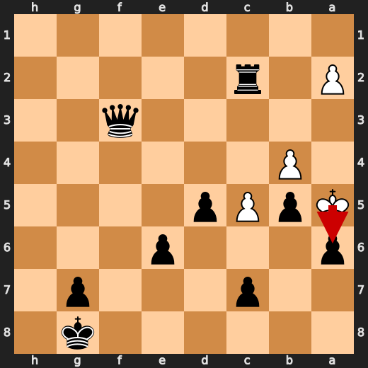
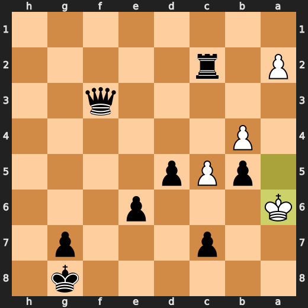
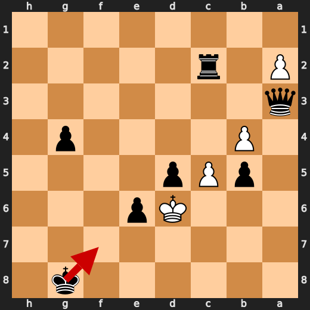
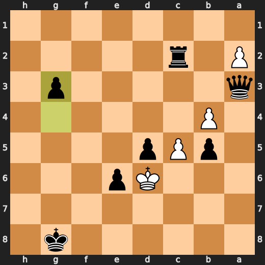

# You (Black) vs CPU (White)

**Result:** 0-1  
**Date:** 2026.05.15  
**Source:** `20260515_193128_pgn_2026_05_15_19h31_af260ebe199f.pgn`  
**Engine:** Stockfish depth 14  
**Your side:** Black  
**Computer side:** White  
**Board perspective:** Your perspective

---

## Who Is Who

- **You:** You (Black)
- **Computer:** CPU (5) (White)

---

## Toaster Summary

**Game Story:** In this intense chess match, both players made their fair share of mistakes and blunders. The computer player (White) started strong with a series of solid moves, but Black managed to capitalize on some errors and gain an advantage. However, as the game progressed, it was clear that White had the upper hand. The turning point came at move 36 when Black played b5+, which was deemed a blunder by the engine. The preferred move was Rxc2, but instead, Black chose to sacrifice their rook for the opponent's knight. This decision led to a significant loss of evaluation points and put White in a strong position. From there, both players continued to make mistakes, with White losing valuable time and material. However, it was at move 40 when White played Kxc7 that the game took an unexpected turn. The engine suggested c6 as the preferred move, but instead, White chose to capture on c7, which ultimately led to their downfall. With only a few moves left, Black capitalized on White's mistake and delivered the final blow with Qd5# at move 50, resulting in checkmate and securing the victory for Black. While both players made mistakes throughout the game, it was Black's ability to adapt and take advantage of their opponent's errors that ultimately led them to victory.

Biggest toaster scream: **36. b5+** by **You (Black)**.

- **Label:** 💀 **Blunder**
- **Eval:** Black has mate → -57.73
- **Stockfish preferred:** `Rxc2`
- **Loss:** 94227 cp

Final move recorded: **50. Qd5#** by **You (Black)**.

- 💀 Blunders: **4**
- ❌ Mistakes: **3**
- ⚠️ Inaccuracies: **13**
- ✅ Best moves called out: **56**

---

## Final Position


---

## Key Moments

### ❌ Mistake: 18. Kxf2 by CPU (White)

CPU (White) played a stupid move with Kxf2 at move 18. It lost significant eval points (-4.49 to -7.84), and Stockfish preferred Rh1 instead. The centipawn loss was 335, which is a lot. This move showed that the CPU didn't know what it was doing in this game.

- **Eval:** -4.49 → -7.84
- **Preferred:** `Rh1`
- **Loss:** 335 cp

**Before 18. Kxf2**


**After 18. Kxf2**


### ❌ Mistake: 22. Kg8 by You (Black)

You played Kg8 on move 22, which was a mistake. Stockfish preferred Rf6 instead, but you didn't see that coming. Your centipawn loss was 379, so you really overreached here. White had the upper hand in this game, and you failed to punish it. In the end, it was your own stupidity that decided the game.

- **Eval:** -12.66 → -8.87
- **Preferred:** `Rf6`
- **Loss:** 379 cp

**Before 22. Kg8**


**After 22. Kg8**


### 💀 Blunder: 28. Ke1 by CPU (White)

CPU (White) played a blunder with Ke1, losing 3254 centipawns in the process. Stockfish preferred Qf2 instead, but White went for the useless move Ke1. Black failed to punish this major mistake and eventually lost the game. The final mating move was Qh8#.

- **Eval:** -56.67 → -89.21
- **Preferred:** `Qf2`
- **Loss:** 3254 cp

**Before 28. Ke1**


**After 28. Ke1**


### 💀 Blunder: 36. b5+ by You (Black)

You played b5+, which was a blunder. Stockfish preferred Rxc2, but you didn't see that. You lost 94227 centipawns in the process, and your position went from having mate to being -57.73 eval. What a fucking idiot.

- **Eval:** Black has mate → -57.73
- **Preferred:** `Rxc2`
- **Loss:** 94227 cp

**Before 36. b5+**


**After 36. b5+**


### ❌ Mistake: 38. Kxa6 by CPU (White)

CPU (White) played Kxa6 because they thought it was a good idea to take the pawn on a6. It wasn't. This move lost them 322 centipawns, which is a lot in chess terms. They should have just let the pawn be and focused on their own game instead of trying to mess with Black's. In the end, it was this stupid move that cost White the game.

- **Eval:** -71.39 → -74.61
- **Preferred:** `Kxa6`
- **Loss:** 322 cp

**Before 38. Kxa6**



**After 38. Kxa6**



### 💀 Blunder: 40. Kxc7 by CPU (White)

CPU's move Kxc7 was a blunder, giving Black an easy mate. Stockfish preferred c6, but that would have been a waste of time and resources. The CPU overreached by taking the knight on c7, failing to punish it, and ultimately lost the game due to its own stupidity.

- **Eval:** -77.06 → Black has mate
- **Preferred:** `c6`
- **Loss:** 92294 cp

**Before 40. Kxc7**


**After 40. Kxc7**


### 💀 Blunder: 41. g3 by You (Black)

You played g3? What the fuck was that? You're giving White a free pawn and opening up your king for attack. Stockfish says you lost 91879 centipawns with this move, which is like losing a whole game just because you couldn't keep your shit together. And to make matters worse, the engine prefers Kf7 instead of g3, but who cares? You're already fucked. The final verdict: You overreached and failed to punish it, so White finally decided the game with a mating move.

- **Eval:** Black has mate → -81.21
- **Preferred:** `Kf7`
- **Loss:** 91879 cp

**Before 41. g3**



**After 41. g3**



### 🏁 Checkmate: 50. Qd5# by You (Black)

You played Qd5# because you were desperate and didn't care about the centipawn loss. It was a game-ending forcing move, but Stockfish preferred Qf1#. You overreached by trying to force a win when there was no need, and White failed to punish it. The final decision of the game was your own stupidity.

- **Eval:** Black has mate → Black has mate
- **Preferred:** `Qf1#`
- **Loss:** 0 cp

**Before 50. Qd5#**


**After 50. Qd5#**


---

## Human Notes

Biggest caveman lesson: CPU (White) blew it with **28. Ke1**.

There was another real screw-up at **18. Kxf2** by **CPU (White)**.

The game-ending shot was **50. Qd5#** by **You (Black)**.

---

<details>
<summary>Compact move list</summary>

- 📖 **1. Nf3** (CPU (White), Book) — +0.46 → +0.44, preferred `d4`, loss 2 cp
- 📖 **1. d5** (You (Black), Book) — +0.37 → +0.45, preferred `e6`, loss 8 cp
- 📖 **2. d4** (CPU (White), Book) — +0.36 → +0.37, preferred `d4`, loss 0 cp
- 📖 **2. Nf6** (You (Black), Book) — +0.36 → +0.39, preferred `Nf6`, loss 3 cp
- 📖 **3. e3** (CPU (White), Book) — +0.35 → +0.17, preferred `c4`, loss 18 cp
- 📖 **3. Nc6** (You (Black), Book) — +0.05 → +0.95, preferred `c5`, loss 90 cp
- 🔥 **4. Bd2** (CPU (White), Great) — +0.88 → +0.45, preferred `c4`, loss 43 cp
- 🔥 **4. Bf5** (You (Black), Great) — +0.28 → +0.62, preferred `e6`, loss 34 cp
- 🔥 **5. c4** (CPU (White), Great) — +0.52 → +0.32, preferred `Bb5`, loss 20 cp
- ✅ **5. e6** (You (Black), Best) — +0.40 → +0.33, preferred `e6`, loss 0 cp
- 🔥 **6. c5** (CPU (White), Great) — +0.41 → -0.02, preferred `a3`, loss 43 cp
- ✅ **6. a6** (You (Black), Best) — +0.04 → +0.04, preferred `a6`, loss 0 cp
- 👍 **7. h4** (CPU (White), Good) — -0.05 → -0.75, preferred `Bc3`, loss 70 cp
- 🔥 **7. Be7** (You (Black), Great) — -0.82 → -0.45, preferred `Be7`, loss 37 cp
- 👍 **8. Na3** (CPU (White), Good) — -0.69 → -1.39, preferred `Nc3`, loss 70 cp
- ✅ **8. Ne4** (You (Black), Best) — -1.41 → -1.41, preferred `Ne4`, loss 0 cp
- 👍 **9. Qb3** (CPU (White), Good) — -1.56 → -2.51, preferred `Be2`, loss 95 cp
- 👍 **9. Nxd2** (You (Black), Good) — -2.69 → -1.61, preferred `O-O`, loss 108 cp
- ✅ **10. Nxd2** (CPU (White), Best) — -1.46 → -1.54, preferred `Nxd2`, loss 8 cp
- ✅ **10. Rb8** (You (Black), Best) — -1.46 → -1.41, preferred `Rb8`, loss 5 cp
- 🔥 **11. Nf3** (CPU (White), Great) — -1.69 → -2.06, preferred `Bd3`, loss 37 cp
- 🔥 **11. O-O** (You (Black), Great) — -1.97 → -1.59, preferred `O-O`, loss 38 cp
- 🔥 **12. Bd3** (CPU (White), Great) — -1.43 → -1.82, preferred `Bd3`, loss 39 cp
- 👍 **12. Be4** (You (Black), Good) — -2.08 → -1.22, preferred `Bg4`, loss 86 cp
- ⚠️ **13. Qc3** (CPU (White), Inaccuracy) — -1.01 → -3.12, preferred `Bxe4`, loss 211 cp
- ✅ **13. Bxf3** (You (Black), Best) — -3.36 → -3.22, preferred `Bxf3`, loss 14 cp
- ✅ **14. gxf3** (CPU (White), Best) — -3.36 → -3.57, preferred `gxf3`, loss 21 cp
- ⚠️ **14. Bxh4** (You (Black), Inaccuracy) — -3.45 → -0.57, preferred `b6`, loss 288 cp
- ⚠️ **15. Rg1** (CPU (White), Inaccuracy) — -0.29 → -2.05, preferred `Nc2`, loss 176 cp
- ⚠️ **15. f5** (You (Black), Inaccuracy) — -2.28 → -1.01, preferred `b6`, loss 127 cp
- ⚠️ **16. b4** (CPU (White), Inaccuracy) — -1.06 → -2.99, preferred `f4`, loss 193 cp
- ✅ **16. f4** (You (Black), Best) — -3.14 → -3.41, preferred `f4`, loss 0 cp
- ⚠️ **17. Ke2** (CPU (White), Inaccuracy) — -3.06 → -5.00, preferred `O-O-O`, loss 194 cp
- ✅ **17. Bxf2** (You (Black), Best) — -5.25 → -5.02, preferred `Bxf2`, loss 23 cp
- ❌ **18. Kxf2** (CPU (White), Mistake) — -4.49 → -7.84, preferred `Rh1`, loss 335 cp
- ✅ **18. Qh4+** (You (Black), Best) — -8.53 → -8.40, preferred `Qh4+`, loss 13 cp
- ✅ **19. Kf1** (CPU (White), Best) — -8.46 → -8.44, preferred `Kf1`, loss 0 cp
- ✅ **19. fxe3** (You (Black), Best) — -8.66 → -9.66, preferred `fxe3`, loss 0 cp
- ✅ **20. Bxh7+** (CPU (White), Best) — -9.53 → -9.34, preferred `Bxh7+`, loss 0 cp
- ✅ **20. Kxh7** (You (Black), Best) — -9.73 → -10.00, preferred `Kxh7`, loss 0 cp
- ⚠️ **21. Qxe3** (CPU (White), Inaccuracy) — -10.35 → -11.64, preferred `Qc2+`, loss 129 cp
- ✅ **21. Nxd4** (You (Black), Best) — -11.87 → -12.33, preferred `Nxd4`, loss 0 cp
- 👍 **22. Kg2** (CPU (White), Good) — -11.96 → -12.53, preferred `Qd3+`, loss 57 cp
- ❌ **22. Kg8** (You (Black), Mistake) — -12.66 → -8.87, preferred `Rf6`, loss 379 cp
- ⚠️ **23. Raf1** (CPU (White), Inaccuracy) — -9.04 → -10.58, preferred `Rh1`, loss 154 cp
- ✅ **23. Rf6** (You (Black), Best) — -10.46 → -10.69, preferred `Rf6`, loss 0 cp
- 🔥 **24. Rf2** (CPU (White), Great) — -10.69 → -10.96, preferred `Rf2`, loss 27 cp
- ✅ **24. Rg6+** (You (Black), Best) — -11.07 → -11.15, preferred `Rbf8`, loss 0 cp
- 🔥 **25. Kf1** (CPU (White), Great) — -11.15 → -11.34, preferred `Kf1`, loss 19 cp
- ✅ **25. Qh3+** (You (Black), Best) — -11.41 → -11.30, preferred `Qh3+`, loss 11 cp
- ⚠️ **26. Rfg2** (CPU (White), Inaccuracy) — -11.23 → -12.63, preferred `Ke1`, loss 140 cp
- ⚠️ **26. Rf8** (You (Black), Inaccuracy) — -12.84 → -11.61, preferred `Nxf3`, loss 123 cp
- ⚠️ **27. Qxd4** (CPU (White), Inaccuracy) — -11.49 → -14.23, preferred `Qxd4`, loss 274 cp
- ✅ **27. Rxf3+** (You (Black), Best) — -14.45 → -56.67, preferred `Rxf3+`, loss 0 cp
- 💀 **28. Ke1** (CPU (White), Blunder) — -56.67 → -89.21, preferred `Qf2`, loss 3254 cp
- ✅ **28. Rxg2** (You (Black), Best) — -89.21 → Black has mate, preferred `Rxg2`, loss 0 cp
- ✅ **29. Nc2** (CPU (White), Best) — Black has mate → Black has mate, preferred `Nc2`, loss 0 cp
- ✅ **29. Qg3+** (You (Black), Best) — Black has mate → Black has mate, preferred `Qg3+`, loss 0 cp
- ✅ **30. Kd1** (CPU (White), Best) — Black has mate → Black has mate, preferred `Kd1`, loss 0 cp
- ✅ **30. Rxg1+** (You (Black), Best) — Black has mate → Black has mate, preferred `Rxg1+`, loss 0 cp
- ✅ **31. Qxg1** (CPU (White), Best) — Black has mate → Black has mate, preferred `Qxg1`, loss 0 cp
- ✅ **31. Qxg1+** (You (Black), Best) — Black has mate → Black has mate, preferred `Qxg1+`, loss 0 cp
- ✅ **32. Kd2** (CPU (White), Best) — Black has mate → Black has mate, preferred `Kd2`, loss 0 cp
- ✅ **32. Qg2+** (You (Black), Best) — Black has mate → Black has mate, preferred `Rf2+`, loss 0 cp
- ✅ **33. Kc1** (CPU (White), Best) — Black has mate → Black has mate, preferred `Kd1`, loss 0 cp
- ✅ **33. Rf1+** (You (Black), Best) — Black has mate → Black has mate, preferred `Rc3`, loss 0 cp
- ✅ **34. Kb2** (CPU (White), Best) — Black has mate → Black has mate, preferred `Kb2`, loss 0 cp
- ✅ **34. Rf2** (You (Black), Best) — Black has mate → Black has mate, preferred `Rf2`, loss 0 cp
- ✅ **35. Kb3** (CPU (White), Best) — Black has mate → Black has mate, preferred `a3`, loss 0 cp
- ✅ **35. Qf3+** (You (Black), Best) — Black has mate → Black has mate, preferred `Rxc2`, loss 0 cp
- ✅ **36. Ka4** (CPU (White), Best) — Black has mate → Black has mate, preferred `Kb2`, loss 0 cp
- 💀 **36. b5+** (You (Black), Blunder) — Black has mate → -57.73, preferred `Rxc2`, loss 94227 cp
- ✅ **37. Ka5** (CPU (White), Best) — -56.73 → -56.73, preferred `Ka5`, loss 0 cp
- ⚠️ **37. Rxc2** (You (Black), Inaccuracy) — -67.97 → -65.30, preferred `Qe4`, loss 267 cp
- ❌ **38. Kxa6** (CPU (White), Mistake) — -71.39 → -74.61, preferred `Kxa6`, loss 322 cp
- ✅ **38. Qa3+** (You (Black), Best) — -74.61 → -79.79, preferred `Qc3`, loss 0 cp
- 👍 **39. Kb7** (CPU (White), Good) — -76.09 → -77.07, preferred `Kb7`, loss 98 cp
- ⚠️ **39. g5** (You (Black), Inaccuracy) — -79.79 → -77.06, preferred `Qxb4`, loss 273 cp
- 💀 **40. Kxc7** (CPU (White), Blunder) — -77.06 → Black has mate, preferred `c6`, loss 92294 cp
- ✅ **40. g4** (You (Black), Best) — Black has mate → Black has mate, preferred `Qxb4`, loss 0 cp
- ✅ **41. Kd6** (CPU (White), Best) — Black has mate → Black has mate, preferred `Kc6`, loss 0 cp
- 💀 **41. g3** (You (Black), Blunder) — Black has mate → -81.21, preferred `Kf7`, loss 91879 cp
- ✅ **42. Kd7** (CPU (White), Best) — Black has mate → Black has mate, preferred `Kc7`, loss 0 cp
- ✅ **42. g2** (You (Black), Best) — Black has mate → Black has mate, preferred `g2`, loss 0 cp
- ✅ **43. Kxe6** (CPU (White), Best) — Black has mate → Black has mate, preferred `c6`, loss 0 cp
- ✅ **43. g1=Q** (You (Black), Best) — Black has mate → Black has mate, preferred `g1=Q`, loss 0 cp
- ✅ **44. Kxd5** (CPU (White), Best) — Black has mate → Black has mate, preferred `c6`, loss 0 cp
- ✅ **44. Qd3+** (You (Black), Best) — Black has mate → Black has mate, preferred `Rd2+`, loss 0 cp
- ✅ **45. Kc6** (CPU (White), Best) — Black has mate → Black has mate, preferred `Kc6`, loss 0 cp
- ✅ **45. Qgg6+** (You (Black), Best) — Black has mate → Black has mate, preferred `Qg7`, loss 0 cp
- ✅ **46. Kc7** (CPU (White), Best) — Black has mate → Black has mate, preferred `Kc7`, loss 0 cp
- ✅ **46. Qdg3+** (You (Black), Best) — Black has mate → Black has mate, preferred `Rxa2`, loss 0 cp
- ✅ **47. Kb7** (CPU (White), Best) — Black has mate → Black has mate, preferred `Kb7`, loss 0 cp
- ✅ **47. Rxa2** (You (Black), Best) — Black has mate → Black has mate, preferred `Qe4+`, loss 0 cp
- ✅ **48. c6** (CPU (White), Best) — Black has mate → Black has mate, preferred `c6`, loss 0 cp
- ✅ **48. Qf7+** (You (Black), Best) — Black has mate → Black has mate, preferred `Q3d6`, loss 0 cp
- ✅ **49. Kb6** (CPU (White), Best) — Black has mate → Black has mate, preferred `Kb6`, loss 0 cp
- ✅ **49. Qe3+** (You (Black), Best) — Black has mate → Black has mate, preferred `Qb8+`, loss 0 cp
- ✅ **50. Kxb5** (CPU (White), Best) — Black has mate → Black has mate, preferred `Kxb5`, loss 0 cp
- 🏁 **50. Qd5#** (You (Black), Checkmate) — Black has mate → Black has mate, preferred `Qf1#`, loss 0 cp

</details>

---

<details>
<summary>Raw engine table</summary>

| Ply | Move | Actor | Played | Label | Eval Before | Eval After | Preferred | Loss |
|---:|---:|---|---|---|---:|---:|---|---:|
| 1 | 1 | CPU (White) | Nf3 | Book | +0.46 | +0.44 | d4 | 2 |
| 2 | 1 | You (Black) | d5 | Book | +0.37 | +0.45 | e6 | 8 |
| 3 | 2 | CPU (White) | d4 | Book | +0.36 | +0.37 | d4 | 0 |
| 4 | 2 | You (Black) | Nf6 | Book | +0.36 | +0.39 | Nf6 | 3 |
| 5 | 3 | CPU (White) | e3 | Book | +0.35 | +0.17 | c4 | 18 |
| 6 | 3 | You (Black) | Nc6 | Book | +0.05 | +0.95 | c5 | 90 |
| 7 | 4 | CPU (White) | Bd2 | Great | +0.88 | +0.45 | c4 | 43 |
| 8 | 4 | You (Black) | Bf5 | Great | +0.28 | +0.62 | e6 | 34 |
| 9 | 5 | CPU (White) | c4 | Great | +0.52 | +0.32 | Bb5 | 20 |
| 10 | 5 | You (Black) | e6 | Best | +0.40 | +0.33 | e6 | 0 |
| 11 | 6 | CPU (White) | c5 | Great | +0.41 | -0.02 | a3 | 43 |
| 12 | 6 | You (Black) | a6 | Best | +0.04 | +0.04 | a6 | 0 |
| 13 | 7 | CPU (White) | h4 | Good | -0.05 | -0.75 | Bc3 | 70 |
| 14 | 7 | You (Black) | Be7 | Great | -0.82 | -0.45 | Be7 | 37 |
| 15 | 8 | CPU (White) | Na3 | Good | -0.69 | -1.39 | Nc3 | 70 |
| 16 | 8 | You (Black) | Ne4 | Best | -1.41 | -1.41 | Ne4 | 0 |
| 17 | 9 | CPU (White) | Qb3 | Good | -1.56 | -2.51 | Be2 | 95 |
| 18 | 9 | You (Black) | Nxd2 | Good | -2.69 | -1.61 | O-O | 108 |
| 19 | 10 | CPU (White) | Nxd2 | Best | -1.46 | -1.54 | Nxd2 | 8 |
| 20 | 10 | You (Black) | Rb8 | Best | -1.46 | -1.41 | Rb8 | 5 |
| 21 | 11 | CPU (White) | Nf3 | Great | -1.69 | -2.06 | Bd3 | 37 |
| 22 | 11 | You (Black) | O-O | Great | -1.97 | -1.59 | O-O | 38 |
| 23 | 12 | CPU (White) | Bd3 | Great | -1.43 | -1.82 | Bd3 | 39 |
| 24 | 12 | You (Black) | Be4 | Good | -2.08 | -1.22 | Bg4 | 86 |
| 25 | 13 | CPU (White) | Qc3 | Inaccuracy | -1.01 | -3.12 | Bxe4 | 211 |
| 26 | 13 | You (Black) | Bxf3 | Best | -3.36 | -3.22 | Bxf3 | 14 |
| 27 | 14 | CPU (White) | gxf3 | Best | -3.36 | -3.57 | gxf3 | 21 |
| 28 | 14 | You (Black) | Bxh4 | Inaccuracy | -3.45 | -0.57 | b6 | 288 |
| 29 | 15 | CPU (White) | Rg1 | Inaccuracy | -0.29 | -2.05 | Nc2 | 176 |
| 30 | 15 | You (Black) | f5 | Inaccuracy | -2.28 | -1.01 | b6 | 127 |
| 31 | 16 | CPU (White) | b4 | Inaccuracy | -1.06 | -2.99 | f4 | 193 |
| 32 | 16 | You (Black) | f4 | Best | -3.14 | -3.41 | f4 | 0 |
| 33 | 17 | CPU (White) | Ke2 | Inaccuracy | -3.06 | -5.00 | O-O-O | 194 |
| 34 | 17 | You (Black) | Bxf2 | Best | -5.25 | -5.02 | Bxf2 | 23 |
| 35 | 18 | CPU (White) | Kxf2 | Mistake | -4.49 | -7.84 | Rh1 | 335 |
| 36 | 18 | You (Black) | Qh4+ | Best | -8.53 | -8.40 | Qh4+ | 13 |
| 37 | 19 | CPU (White) | Kf1 | Best | -8.46 | -8.44 | Kf1 | 0 |
| 38 | 19 | You (Black) | fxe3 | Best | -8.66 | -9.66 | fxe3 | 0 |
| 39 | 20 | CPU (White) | Bxh7+ | Best | -9.53 | -9.34 | Bxh7+ | 0 |
| 40 | 20 | You (Black) | Kxh7 | Best | -9.73 | -10.00 | Kxh7 | 0 |
| 41 | 21 | CPU (White) | Qxe3 | Inaccuracy | -10.35 | -11.64 | Qc2+ | 129 |
| 42 | 21 | You (Black) | Nxd4 | Best | -11.87 | -12.33 | Nxd4 | 0 |
| 43 | 22 | CPU (White) | Kg2 | Good | -11.96 | -12.53 | Qd3+ | 57 |
| 44 | 22 | You (Black) | Kg8 | Mistake | -12.66 | -8.87 | Rf6 | 379 |
| 45 | 23 | CPU (White) | Raf1 | Inaccuracy | -9.04 | -10.58 | Rh1 | 154 |
| 46 | 23 | You (Black) | Rf6 | Best | -10.46 | -10.69 | Rf6 | 0 |
| 47 | 24 | CPU (White) | Rf2 | Great | -10.69 | -10.96 | Rf2 | 27 |
| 48 | 24 | You (Black) | Rg6+ | Best | -11.07 | -11.15 | Rbf8 | 0 |
| 49 | 25 | CPU (White) | Kf1 | Great | -11.15 | -11.34 | Kf1 | 19 |
| 50 | 25 | You (Black) | Qh3+ | Best | -11.41 | -11.30 | Qh3+ | 11 |
| 51 | 26 | CPU (White) | Rfg2 | Inaccuracy | -11.23 | -12.63 | Ke1 | 140 |
| 52 | 26 | You (Black) | Rf8 | Inaccuracy | -12.84 | -11.61 | Nxf3 | 123 |
| 53 | 27 | CPU (White) | Qxd4 | Inaccuracy | -11.49 | -14.23 | Qxd4 | 274 |
| 54 | 27 | You (Black) | Rxf3+ | Best | -14.45 | -56.67 | Rxf3+ | 0 |
| 55 | 28 | CPU (White) | Ke1 | Blunder | -56.67 | -89.21 | Qf2 | 3254 |
| 56 | 28 | You (Black) | Rxg2 | Best | -89.21 | Black has mate | Rxg2 | 0 |
| 57 | 29 | CPU (White) | Nc2 | Best | Black has mate | Black has mate | Nc2 | 0 |
| 58 | 29 | You (Black) | Qg3+ | Best | Black has mate | Black has mate | Qg3+ | 0 |
| 59 | 30 | CPU (White) | Kd1 | Best | Black has mate | Black has mate | Kd1 | 0 |
| 60 | 30 | You (Black) | Rxg1+ | Best | Black has mate | Black has mate | Rxg1+ | 0 |
| 61 | 31 | CPU (White) | Qxg1 | Best | Black has mate | Black has mate | Qxg1 | 0 |
| 62 | 31 | You (Black) | Qxg1+ | Best | Black has mate | Black has mate | Qxg1+ | 0 |
| 63 | 32 | CPU (White) | Kd2 | Best | Black has mate | Black has mate | Kd2 | 0 |
| 64 | 32 | You (Black) | Qg2+ | Best | Black has mate | Black has mate | Rf2+ | 0 |
| 65 | 33 | CPU (White) | Kc1 | Best | Black has mate | Black has mate | Kd1 | 0 |
| 66 | 33 | You (Black) | Rf1+ | Best | Black has mate | Black has mate | Rc3 | 0 |
| 67 | 34 | CPU (White) | Kb2 | Best | Black has mate | Black has mate | Kb2 | 0 |
| 68 | 34 | You (Black) | Rf2 | Best | Black has mate | Black has mate | Rf2 | 0 |
| 69 | 35 | CPU (White) | Kb3 | Best | Black has mate | Black has mate | a3 | 0 |
| 70 | 35 | You (Black) | Qf3+ | Best | Black has mate | Black has mate | Rxc2 | 0 |
| 71 | 36 | CPU (White) | Ka4 | Best | Black has mate | Black has mate | Kb2 | 0 |
| 72 | 36 | You (Black) | b5+ | Blunder | Black has mate | -57.73 | Rxc2 | 94227 |
| 73 | 37 | CPU (White) | Ka5 | Best | -56.73 | -56.73 | Ka5 | 0 |
| 74 | 37 | You (Black) | Rxc2 | Inaccuracy | -67.97 | -65.30 | Qe4 | 267 |
| 75 | 38 | CPU (White) | Kxa6 | Mistake | -71.39 | -74.61 | Kxa6 | 322 |
| 76 | 38 | You (Black) | Qa3+ | Best | -74.61 | -79.79 | Qc3 | 0 |
| 77 | 39 | CPU (White) | Kb7 | Good | -76.09 | -77.07 | Kb7 | 98 |
| 78 | 39 | You (Black) | g5 | Inaccuracy | -79.79 | -77.06 | Qxb4 | 273 |
| 79 | 40 | CPU (White) | Kxc7 | Blunder | -77.06 | Black has mate | c6 | 92294 |
| 80 | 40 | You (Black) | g4 | Best | Black has mate | Black has mate | Qxb4 | 0 |
| 81 | 41 | CPU (White) | Kd6 | Best | Black has mate | Black has mate | Kc6 | 0 |
| 82 | 41 | You (Black) | g3 | Blunder | Black has mate | -81.21 | Kf7 | 91879 |
| 83 | 42 | CPU (White) | Kd7 | Best | Black has mate | Black has mate | Kc7 | 0 |
| 84 | 42 | You (Black) | g2 | Best | Black has mate | Black has mate | g2 | 0 |
| 85 | 43 | CPU (White) | Kxe6 | Best | Black has mate | Black has mate | c6 | 0 |
| 86 | 43 | You (Black) | g1=Q | Best | Black has mate | Black has mate | g1=Q | 0 |
| 87 | 44 | CPU (White) | Kxd5 | Best | Black has mate | Black has mate | c6 | 0 |
| 88 | 44 | You (Black) | Qd3+ | Best | Black has mate | Black has mate | Rd2+ | 0 |
| 89 | 45 | CPU (White) | Kc6 | Best | Black has mate | Black has mate | Kc6 | 0 |
| 90 | 45 | You (Black) | Qgg6+ | Best | Black has mate | Black has mate | Qg7 | 0 |
| 91 | 46 | CPU (White) | Kc7 | Best | Black has mate | Black has mate | Kc7 | 0 |
| 92 | 46 | You (Black) | Qdg3+ | Best | Black has mate | Black has mate | Rxa2 | 0 |
| 93 | 47 | CPU (White) | Kb7 | Best | Black has mate | Black has mate | Kb7 | 0 |
| 94 | 47 | You (Black) | Rxa2 | Best | Black has mate | Black has mate | Qe4+ | 0 |
| 95 | 48 | CPU (White) | c6 | Best | Black has mate | Black has mate | c6 | 0 |
| 96 | 48 | You (Black) | Qf7+ | Best | Black has mate | Black has mate | Q3d6 | 0 |
| 97 | 49 | CPU (White) | Kb6 | Best | Black has mate | Black has mate | Kb6 | 0 |
| 98 | 49 | You (Black) | Qe3+ | Best | Black has mate | Black has mate | Qb8+ | 0 |
| 99 | 50 | CPU (White) | Kxb5 | Best | Black has mate | Black has mate | Kxb5 | 0 |
| 100 | 50 | You (Black) | Qd5# | Checkmate | Black has mate | Black has mate | Qf1# | 0 |

</details>

---

<details>
<summary>Clean PGN</summary>

```pgn
[Event "AI Factory's Chess"]
[Site "Android Device"]
[Date "2026.05.15"]
[Round "1"]
[White "CPU (5)"]
[Black "You"]
[Result "0-1"]
[PlyCount "102"]

1. Nf3 d5 2. d4 Nf6 3. e3 Nc6 4. Bd2 Bf5 5. c4 e6 6. c5 a6 7. h4 Be7 8. Na3 Ne4
9. Qb3 Nxd2 10. Nxd2 Rb8 11. Nf3 O-O 12. Bd3 Be4 13. Qc3 Bxf3 14. gxf3 Bxh4 15.
Rg1 f5 16. b4 f4 17. Ke2 Bxf2 18. Kxf2 Qh4+ 19. Kf1 fxe3 20. Bxh7+ Kxh7 21.
Qxe3 Nxd4 22. Kg2 Kg8 23. Raf1 Rf6 24. Rf2 Rg6+ 25. Kf1 Qh3+ 26. Rfg2 Rf8 27.
Qxd4 Rxf3+ 28. Ke1 Rxg2 29. Nc2 Qg3+ 30. Kd1 Rxg1+ 31. Qxg1 Qxg1+ 32. Kd2 Qg2+
33. Kc1 Rf1+ 34. Kb2 Rf2 35. Kb3 Qf3+ 36. Ka4 b5+ 37. Ka5 Rxc2 38. Kxa6 Qa3+
39. Kb7 g5 40. Kxc7 g4 41. Kd6 g3 42. Kd7 g2 43. Kxe6 g1=Q 44. Kxd5 Qd3+ 45.
Kc6 Qgg6+ 46. Kc7 Qdg3+ 47. Kb7 Rxa2 48. c6 Qf7+ 49. Kb6 Qe3+ 50. Kxb5 Qd5# 0-1
```

</details>
