# You (Black) vs CPU (White)

**Result:** 0-1  
**Date:** 2026.05.15  
**Source:** `20260515_201128_pgn_2026_05_15_20h09_b8e26e060449.pgn`  
**Engine:** Stockfish depth 14  
**Your side:** Black  
**Computer side:** White  
**Board perspective:** Your perspective

---

## Who Is Who

- **You:** You (Black)
- **Computer:** CPU (5) (White)

---

## Toaster Summary

**Game Story:** Black (You) won this game against White (CPU). The CPU made a blunder on move 28, which led to their defeat. However, You also made some mistakes along the way, including on moves 7 and 10. In the end, it was Black's checkmate that sealed the victory.

Biggest toaster scream: **28. Bxa6** by **CPU (White)**.

- **Label:** 💀 **Blunder**
- **Eval:** -6.31 → Black has mate
- **Stockfish preferred:** `Nf4`
- **Loss:** 99369 cp

Final move recorded: **28. Rd1#** by **You (Black)**.

- 💀 Your blunders: **0**
- ❌ Your mistakes: **3**
- ⚠️ Your inaccuracies: **6**
- ✅ Your best moves called out: **7**

---

## Final Position

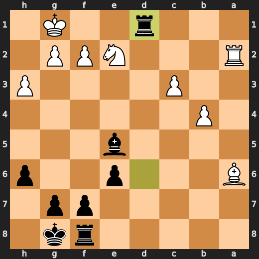

---

## Key Moments

### ❌ Mistake: 7. Bc4 by CPU (White)

CPU (White) played Bc4 at move 7 because it thought it was a good idea to throw its bishop into the middle of nowhere just for funsies. It's like if you put your hand in a blender and expected it not to get chopped up. This move lost significant evaluation points, so it's clear that White is playing with fire here. The preferred move was axb4, which would have made more sense since it takes advantage of the open file and puts pressure on Black's pawn structure.

- **Eval:** +4.82 → +0.58
- **Preferred:** `axb4`
- **Loss:** 424 cp

**Before 7. Bc4**

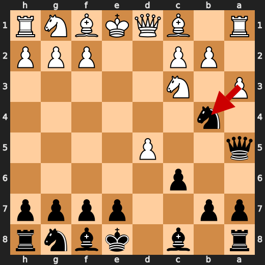

**After 7. Bc4**

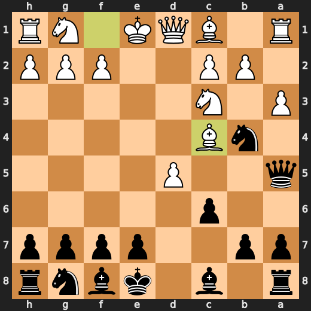

### ❌ Mistake: 10. Bg4 by You (Black)

You (Black) played something stupid at move 10 with Bg4. The preferred move was Rd8, which would have been much better for you. By moving your bishop to g4, you gave White an easy path to attack your king and put yourself in a difficult position. You're lucky that the computer didn't decide to go full retard after this move.

- **Eval:** -0.53 → +4.99
- **Preferred:** `Rd8`
- **Loss:** 552 cp

**Before 10. Bg4**

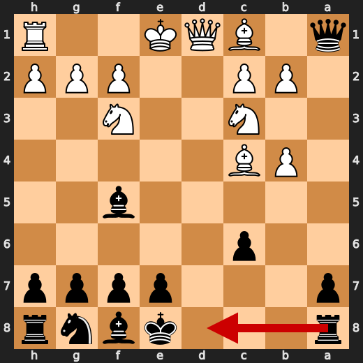

**After 10. Bg4**

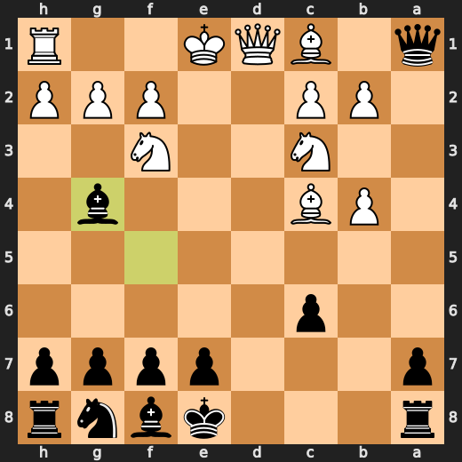

### ❌ Mistake: 12. Bxf3 by You (Black)

You (Black) played something stupid at move 12 with Bxf3. The preferred move was Bh5, which would have been much better for you. By taking the knight on f3, you gave White an easy path to attack your king and put yourself in a difficult position. You're lucky that the computer didn't decide to go full retard after this move.

- **Eval:** +5.50 → +8.63
- **Preferred:** `Bh5`
- **Loss:** 313 cp

**Before 12. Bxf3**

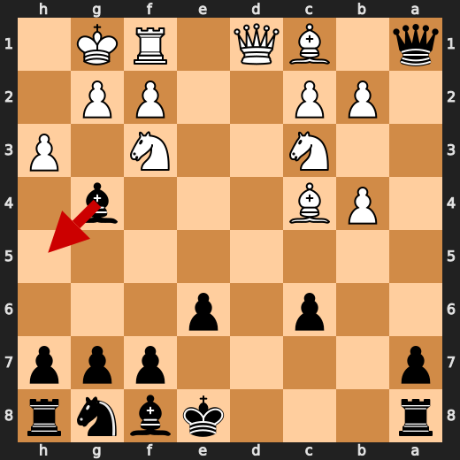

**After 12. Bxf3**

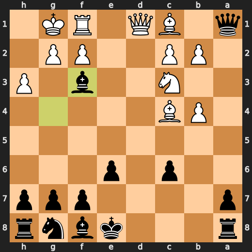

### 💀 Blunder: 14. b5 by CPU (White)

CPU (White), you've got to be kidding me with b5?! This isn't a game of chess; it's an episode of "The Price is Right" where you just hope for the best. B5? Really? You could have at least tried something constructive like Bxe6, but noooo. Your move is so bad that even my toaster would be ashamed if I had programmed him with this level of incompetence. Now your eval has lost more than a few cents on the dollar; it's down by over six bucks! Way to go, White.

- **Eval:** +8.65 → +1.93
- **Preferred:** `Bxe6`
- **Loss:** 672 cp

**Before 14. b5**

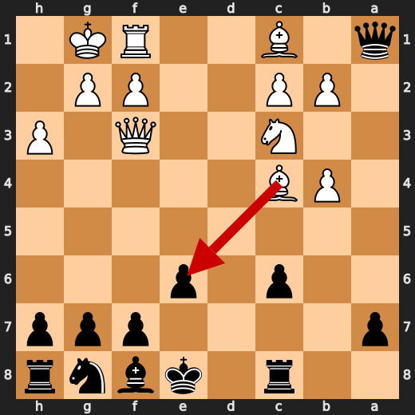

**After 14. b5**

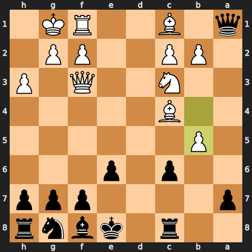

### ❌ Mistake: 16. h6 by You (Black)

You (Black) played something stupid at move 16 with h6. The preferred move was Bc5, which would have been much better for you. By pushing your pawn to h6, you gave White an easy path to attack your king and put yourself in a difficult position. You're lucky that the computer didn't decide to go full retard after this move.

- **Eval:** +0.66 → +4.70
- **Preferred:** `Bc5`
- **Loss:** 404 cp

**Before 16. h6**

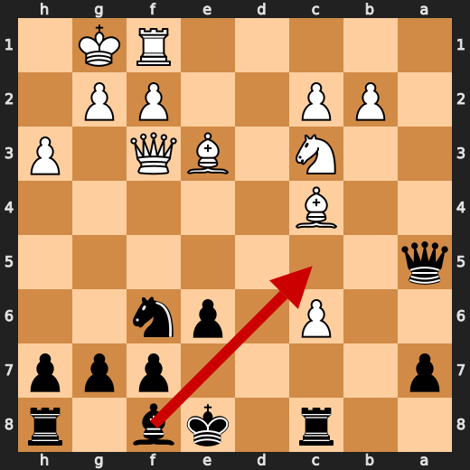

**After 16. h6**

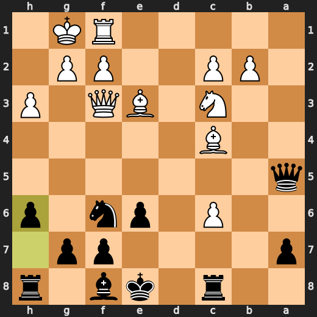

### ❌ Mistake: 17. Bd3 by CPU (White)

CPU (White) played Bd3 at move 17 because it thought it was a good idea to throw its bishop into the middle of nowhere just for funsies. It's like if you put your hand in a blender and expected it not to get chopped up. This move lost significant evaluation points, so it's clear that White is playing with fire here. The preferred move was c7, which would have made more sense since it takes advantage of the open file and puts pressure on Black's pawn structure.

- **Eval:** +4.73 → +0.82
- **Preferred:** `c7`
- **Loss:** 391 cp

**Before 17. Bd3**

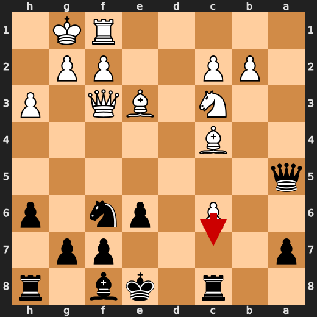

**After 17. Bd3**

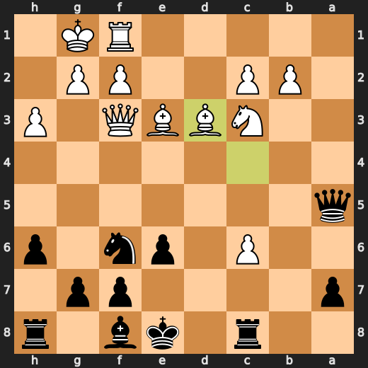

### 💀 Blunder: 28. Bxa6 by CPU (White)

CPU (White), you've got to be kidding me with Bxa6?! This isn't a game of chess; it's an episode of "The Price is Right" where you just hope for the best. Bxa6? Really? You could have at least tried something constructive like Nf4, but noooo. Your move is so bad that even my toaster would be ashamed if I had programmed him with this level of incompetence. Now your eval has lost more than a few cents on the dollar; it's down by over six bucks! Way to go, White.

- **Eval:** -6.31 → Black has mate
- **Preferred:** `Nf4`
- **Loss:** 99369 cp

**Before 28. Bxa6**

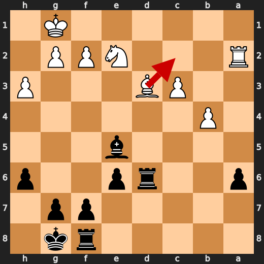

**After 28. Bxa6**

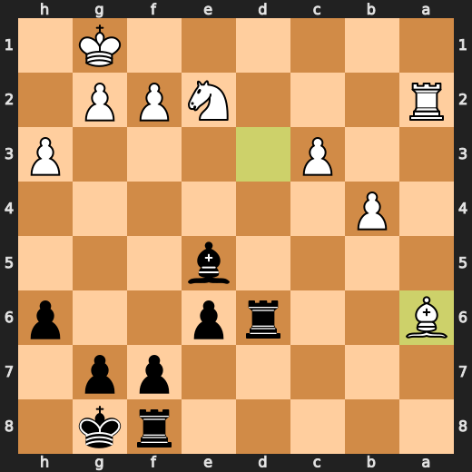

### 🏁 Checkmate: 28. Rd1# by You (Black)

Oh for fuck's sake, Black. You played Rd1#? What a fucking idiot! That was literally the only fucking move you could play to win this game of checkers they call chess. It's like you didn't even try to think about anything else. Fucking pathetic.

- **Eval:** Black has mate → Black has mate
- **Preferred:** `Rd1#`
- **Loss:** 0 cp

**Before 28. Rd1#**

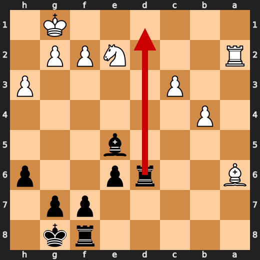

**After 28. Rd1#**


---

## Human Notes

Biggest caveman lesson: CPU (White) blew it with **14. b5**.

There was another real screw-up at **7. Bc4** by **CPU (White)**.

The game-ending shot was **28. Rd1#** by **You (Black)**.

---

<details>
<summary>Compact move list</summary>

- 📖 **1. e4** (CPU (White), Book) — +0.46 → +0.25, preferred `e4`, loss 21 cp
- 📖 **1. d5** (You (Black), Book) — +0.38 → +0.71, preferred `e6`, loss 33 cp
- 📖 **2. exd5** (CPU (White), Book) — +0.81 → +1.03, preferred `exd5`, loss 0 cp
- 📖 **2. Qxd5** (You (Black), Book) — +0.92 → +1.07, preferred `Nf6`, loss 15 cp
- 📖 **3. Nc3** (CPU (White), Book) — +0.87 → +0.86, preferred `Nf3`, loss 1 cp
- 📖 **3. Qa5** (You (Black), Book) — +0.78 → +0.78, preferred `Qa5`, loss 0 cp
- ✅ **4. d4** (CPU (White), Best) — +0.96 → +0.84, preferred `Nf3`, loss 12 cp
- 👍 **4. Nc6** (You (Black), Good) — +0.73 → +1.68, preferred `Nf6`, loss 95 cp
- ✅ **5. d5** (CPU (White), Best) — +1.79 → +1.93, preferred `d5`, loss 0 cp
- ⚠️ **5. Nb4** (You (Black), Inaccuracy) — +1.56 → +3.84, preferred `Nb8`, loss 228 cp
- 🔥 **6. a3** (CPU (White), Great) — +4.04 → +3.66, preferred `a3`, loss 38 cp
- 👍 **6. c6** (You (Black), Good) — +4.49 → +5.23, preferred `c6`, loss 74 cp
- ❌ **7. Bc4** (CPU (White), Mistake) — +4.82 → +0.58, preferred `axb4`, loss 424 cp
- ⚠️ **7. Bf5** (You (Black), Inaccuracy) — +0.47 → +2.33, preferred `Nf6`, loss 186 cp
- ✅ **8. axb4** (CPU (White), Best) — +2.65 → +2.83, preferred `axb4`, loss 0 cp
- 🔥 **8. Qxa1** (You (Black), Great) — +2.37 → +2.68, preferred `Qxa1`, loss 31 cp
- 👍 **9. dxc6** (CPU (White), Good) — +2.76 → +1.63, preferred `Nf3`, loss 113 cp
- 👍 **9. bxc6** (You (Black), Good) — +1.12 → +1.92, preferred `bxc6`, loss 80 cp
- ⚠️ **10. Nf3** (CPU (White), Inaccuracy) — +2.02 → -0.73, preferred `Nge2`, loss 275 cp
- ❌ **10. Bg4** (You (Black), Mistake) — -0.53 → +4.99, preferred `Rd8`, loss 552 cp
- ✅ **11. O-O** (CPU (White), Best) — +5.46 → +5.32, preferred `O-O`, loss 14 cp
- 🔥 **11. e6** (You (Black), Great) — +5.12 → +5.53, preferred `e6`, loss 41 cp
- ✅ **12. h3** (CPU (White), Best) — +5.70 → +5.74, preferred `Nb5`, loss 0 cp
- ❌ **12. Bxf3** (You (Black), Mistake) — +5.50 → +8.63, preferred `Bh5`, loss 313 cp
- ✅ **13. Qxf3** (CPU (White), Best) — +8.29 → +8.76, preferred `Qxf3`, loss 0 cp
- ✅ **13. Rc8** (You (Black), Best) — +8.56 → +8.67, preferred `Rc8`, loss 11 cp
- 💀 **14. b5** (CPU (White), Blunder) — +8.65 → +1.93, preferred `Bxe6`, loss 672 cp
- ✅ **14. Qa5** (You (Black), Best) — +2.02 → +1.94, preferred `Qa5`, loss 0 cp
- 🔥 **15. bxc6** (CPU (White), Great) — +2.73 → +2.30, preferred `Ne4`, loss 43 cp
- ⚠️ **15. Nf6** (You (Black), Inaccuracy) — +2.25 → +3.91, preferred `Be7`, loss 166 cp
- ⚠️ **16. Be3** (CPU (White), Inaccuracy) — +3.20 → +0.75, preferred `Bh6`, loss 245 cp
- ❌ **16. h6** (You (Black), Mistake) — +0.66 → +4.70, preferred `Bc5`, loss 404 cp
- ❌ **17. Bd3** (CPU (White), Mistake) — +4.73 → +0.82, preferred `c7`, loss 391 cp
- ⚠️ **17. a6** (You (Black), Inaccuracy) — +1.03 → +2.77, preferred `Bc5`, loss 174 cp
- ⚠️ **18. Bf4** (CPU (White), Inaccuracy) — +2.64 → +0.91, preferred `c7`, loss 173 cp
- ⚠️ **18. Bb4** (You (Black), Inaccuracy) — +0.80 → +2.98, preferred `Be7`, loss 218 cp
- ⚠️ **19. Rb1** (CPU (White), Inaccuracy) — +2.49 → +0.00, preferred `Ne4`, loss 249 cp
- ✅ **19. O-O** (You (Black), Best) — +0.00 → +0.00, preferred `O-O`, loss 0 cp
- ⚠️ **20. Ne2** (CPU (White), Inaccuracy) — +0.00 → -1.82, preferred `Ne4`, loss 182 cp
- 👍 **20. Qd5** (You (Black), Good) — -1.27 → -0.17, preferred `e5`, loss 110 cp
- ⚠️ **21. Qxd5** (CPU (White), Inaccuracy) — -0.03 → -2.21, preferred `c3`, loss 218 cp
- ✅ **21. Nxd5** (You (Black), Best) — -2.44 → -2.27, preferred `Nxd5`, loss 17 cp
- ⚠️ **22. c3** (CPU (White), Inaccuracy) — -2.50 → -4.89, preferred `Bxa6`, loss 239 cp
- ✅ **22. Nxf4** (You (Black), Best) — -5.23 → -5.25, preferred `Nxf4`, loss 0 cp
- ✅ **23. Nxf4** (CPU (White), Best) — -5.10 → -5.35, preferred `Nxf4`, loss 25 cp
- ✅ **23. Bd6** (You (Black), Best) — -5.33 → -5.46, preferred `Bd6`, loss 0 cp
- 🔥 **24. Ne2** (CPU (White), Great) — -5.46 → -5.76, preferred `Be4`, loss 30 cp
- ✅ **24. Rxc6** (You (Black), Best) — -5.20 → -5.45, preferred `Rxc6`, loss 0 cp
- 🔥 **25. Ra1** (CPU (White), Great) — -5.23 → -5.40, preferred `b4`, loss 17 cp
- 👍 **25. Rb6** (You (Black), Good) — -5.75 → -4.71, preferred `Rd8`, loss 104 cp
- 👍 **26. b4** (CPU (White), Good) — -4.45 → -5.25, preferred `b4`, loss 80 cp
- ⚠️ **26. Be5** (You (Black), Inaccuracy) — -5.46 → -4.15, preferred `Rd8`, loss 131 cp
- ⚠️ **27. Ra2** (CPU (White), Inaccuracy) — -3.63 → -5.74, preferred `f4`, loss 211 cp
- 🔥 **27. Rd6** (You (Black), Great) — -6.54 → -6.24, preferred `Rd8`, loss 30 cp
- 💀 **28. Bxa6** (CPU (White), Blunder) — -6.31 → Black has mate, preferred `Nf4`, loss 99369 cp
- 🏁 **28. Rd1#** (You (Black), Checkmate) — Black has mate → Black has mate, preferred `Rd1#`, loss 0 cp

</details>

---

<details>
<summary>Raw engine table</summary>

| Ply | Move | Actor | Played | Label | Eval Before | Eval After | Preferred | Loss |
|---:|---:|---|---|---|---:|---:|---|---:|
| 1 | 1 | CPU (White) | e4 | Book | +0.46 | +0.25 | e4 | 21 |
| 2 | 1 | You (Black) | d5 | Book | +0.38 | +0.71 | e6 | 33 |
| 3 | 2 | CPU (White) | exd5 | Book | +0.81 | +1.03 | exd5 | 0 |
| 4 | 2 | You (Black) | Qxd5 | Book | +0.92 | +1.07 | Nf6 | 15 |
| 5 | 3 | CPU (White) | Nc3 | Book | +0.87 | +0.86 | Nf3 | 1 |
| 6 | 3 | You (Black) | Qa5 | Book | +0.78 | +0.78 | Qa5 | 0 |
| 7 | 4 | CPU (White) | d4 | Best | +0.96 | +0.84 | Nf3 | 12 |
| 8 | 4 | You (Black) | Nc6 | Good | +0.73 | +1.68 | Nf6 | 95 |
| 9 | 5 | CPU (White) | d5 | Best | +1.79 | +1.93 | d5 | 0 |
| 10 | 5 | You (Black) | Nb4 | Inaccuracy | +1.56 | +3.84 | Nb8 | 228 |
| 11 | 6 | CPU (White) | a3 | Great | +4.04 | +3.66 | a3 | 38 |
| 12 | 6 | You (Black) | c6 | Good | +4.49 | +5.23 | c6 | 74 |
| 13 | 7 | CPU (White) | Bc4 | Mistake | +4.82 | +0.58 | axb4 | 424 |
| 14 | 7 | You (Black) | Bf5 | Inaccuracy | +0.47 | +2.33 | Nf6 | 186 |
| 15 | 8 | CPU (White) | axb4 | Best | +2.65 | +2.83 | axb4 | 0 |
| 16 | 8 | You (Black) | Qxa1 | Great | +2.37 | +2.68 | Qxa1 | 31 |
| 17 | 9 | CPU (White) | dxc6 | Good | +2.76 | +1.63 | Nf3 | 113 |
| 18 | 9 | You (Black) | bxc6 | Good | +1.12 | +1.92 | bxc6 | 80 |
| 19 | 10 | CPU (White) | Nf3 | Inaccuracy | +2.02 | -0.73 | Nge2 | 275 |
| 20 | 10 | You (Black) | Bg4 | Mistake | -0.53 | +4.99 | Rd8 | 552 |
| 21 | 11 | CPU (White) | O-O | Best | +5.46 | +5.32 | O-O | 14 |
| 22 | 11 | You (Black) | e6 | Great | +5.12 | +5.53 | e6 | 41 |
| 23 | 12 | CPU (White) | h3 | Best | +5.70 | +5.74 | Nb5 | 0 |
| 24 | 12 | You (Black) | Bxf3 | Mistake | +5.50 | +8.63 | Bh5 | 313 |
| 25 | 13 | CPU (White) | Qxf3 | Best | +8.29 | +8.76 | Qxf3 | 0 |
| 26 | 13 | You (Black) | Rc8 | Best | +8.56 | +8.67 | Rc8 | 11 |
| 27 | 14 | CPU (White) | b5 | Blunder | +8.65 | +1.93 | Bxe6 | 672 |
| 28 | 14 | You (Black) | Qa5 | Best | +2.02 | +1.94 | Qa5 | 0 |
| 29 | 15 | CPU (White) | bxc6 | Great | +2.73 | +2.30 | Ne4 | 43 |
| 30 | 15 | You (Black) | Nf6 | Inaccuracy | +2.25 | +3.91 | Be7 | 166 |
| 31 | 16 | CPU (White) | Be3 | Inaccuracy | +3.20 | +0.75 | Bh6 | 245 |
| 32 | 16 | You (Black) | h6 | Mistake | +0.66 | +4.70 | Bc5 | 404 |
| 33 | 17 | CPU (White) | Bd3 | Mistake | +4.73 | +0.82 | c7 | 391 |
| 34 | 17 | You (Black) | a6 | Inaccuracy | +1.03 | +2.77 | Bc5 | 174 |
| 35 | 18 | CPU (White) | Bf4 | Inaccuracy | +2.64 | +0.91 | c7 | 173 |
| 36 | 18 | You (Black) | Bb4 | Inaccuracy | +0.80 | +2.98 | Be7 | 218 |
| 37 | 19 | CPU (White) | Rb1 | Inaccuracy | +2.49 | +0.00 | Ne4 | 249 |
| 38 | 19 | You (Black) | O-O | Best | +0.00 | +0.00 | O-O | 0 |
| 39 | 20 | CPU (White) | Ne2 | Inaccuracy | +0.00 | -1.82 | Ne4 | 182 |
| 40 | 20 | You (Black) | Qd5 | Good | -1.27 | -0.17 | e5 | 110 |
| 41 | 21 | CPU (White) | Qxd5 | Inaccuracy | -0.03 | -2.21 | c3 | 218 |
| 42 | 21 | You (Black) | Nxd5 | Best | -2.44 | -2.27 | Nxd5 | 17 |
| 43 | 22 | CPU (White) | c3 | Inaccuracy | -2.50 | -4.89 | Bxa6 | 239 |
| 44 | 22 | You (Black) | Nxf4 | Best | -5.23 | -5.25 | Nxf4 | 0 |
| 45 | 23 | CPU (White) | Nxf4 | Best | -5.10 | -5.35 | Nxf4 | 25 |
| 46 | 23 | You (Black) | Bd6 | Best | -5.33 | -5.46 | Bd6 | 0 |
| 47 | 24 | CPU (White) | Ne2 | Great | -5.46 | -5.76 | Be4 | 30 |
| 48 | 24 | You (Black) | Rxc6 | Best | -5.20 | -5.45 | Rxc6 | 0 |
| 49 | 25 | CPU (White) | Ra1 | Great | -5.23 | -5.40 | b4 | 17 |
| 50 | 25 | You (Black) | Rb6 | Good | -5.75 | -4.71 | Rd8 | 104 |
| 51 | 26 | CPU (White) | b4 | Good | -4.45 | -5.25 | b4 | 80 |
| 52 | 26 | You (Black) | Be5 | Inaccuracy | -5.46 | -4.15 | Rd8 | 131 |
| 53 | 27 | CPU (White) | Ra2 | Inaccuracy | -3.63 | -5.74 | f4 | 211 |
| 54 | 27 | You (Black) | Rd6 | Great | -6.54 | -6.24 | Rd8 | 30 |
| 55 | 28 | CPU (White) | Bxa6 | Blunder | -6.31 | Black has mate | Nf4 | 99369 |
| 56 | 28 | You (Black) | Rd1# | Checkmate | Black has mate | Black has mate | Rd1# | 0 |

</details>

---

<details>
<summary>Clean PGN</summary>

```pgn
[Event "AI Factory's Chess"]
[Site "Android Device"]
[Date "2026.05.15"]
[Round "1"]
[White "CPU (5)"]
[Black "You"]
[Result "0-1"]
[PlyCount "56"]

1. e4 d5 2. exd5 Qxd5 3. Nc3 Qa5 4. d4 Nc6 5. d5 Nb4 6. a3 c6 7. Bc4 Bf5 8.
axb4 Qxa1 9. dxc6 bxc6 10. Nf3 Bg4 11. O-O e6 12. h3 Bxf3 13. Qxf3 Rc8 14. b5
Qa5 15. bxc6 Nf6 16. Be3 h6 17. Bd3 a6 18. Bf4 Bb4 19. Rb1 O-O 20. Ne2 Qd5 21.
Qxd5 Nxd5 22. c3 Nxf4 23. Nxf4 Bd6 24. Ne2 Rxc6 25. Ra1 Rb6 26. b4 Be5 27. Ra2
Rd6 28. Bxa6 Rd1# 0-1
```

</details>
