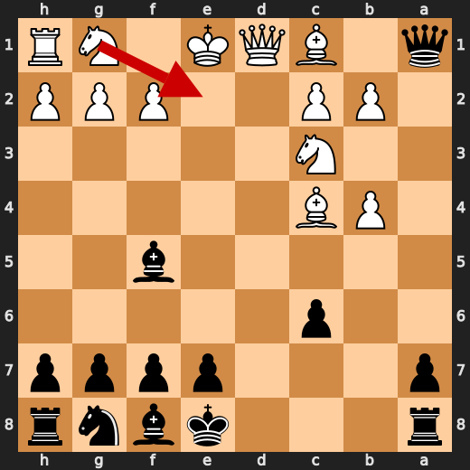
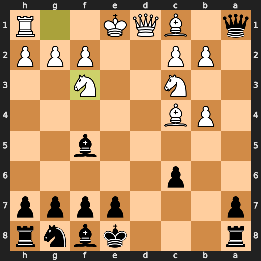

# You (Black) vs CPU (White)

**Result:** 0-1  
**Date:** 2026.05.15  
**Source:** `20260515_201128_pgn_2026_05_15_20h09_b8e26e060449.pgn`  
**Engine:** Stockfish depth 14  
**Your side:** Black  
**Computer side:** White  
**Board perspective:** Your perspective

---

## Who Is Who

- **You:** You (Black)
- **Computer:** CPU (5) (White)

---

## Toaster Summary

**Game Story:** In this game, both players made a series of mistakes that led to a decisive checkmate for Black. The computer's first mistake was on move 7, where it played Bc4 instead of axb4. This allowed Black to gain an advantage in the evaluation. On move 10, the computer again erred by playing Nf3 instead of Nge2. Black responded with a mistake of their own on move 10, playing Rd8 instead of Bg4. This allowed White to regain some ground in the evaluation. The next significant error occurred on move 14, where the computer played b5 instead of Bxe6. This blunder gave Black an even greater advantage in the position. Black then made a mistake on move 16 by playing h6 instead of Bc5, which allowed White to gain some ground back in the evaluation. On move 17, the computer played Bd3 instead of c7, giving Black another opportunity to increase their advantage. Finally, on move 28, the computer made a blunder by playing Bxa6 instead of Bc2. This allowed Black to deliver checkmate with Rd1#, resulting in a decisive win for Black. The game story highlights the importance of avoiding mistakes and capitalizing on your opponent's errors to achieve victory.

Biggest toaster scream: **28. Bxa6** by **CPU (White)**.

- **Label:** 💀 **Blunder**
- **Eval:** -5.89 → Black has mate
- **Stockfish preferred:** `Bc2`
- **Loss:** 99411 cp

Final move recorded: **28. Rd1#** by **You (Black)**.

- 💀 Blunders: **2**
- ❌ Mistakes: **7**
- ⚠️ Inaccuracies: **13**
- ✅ Best moves called out: **16**

---

## Final Position


---

## Key Moments

### ❌ Mistake: 7. Bc4 by CPU (White)

CPU's Bc4 is a mistake because it loses 515 centipawns and drops from +5.74 to +0.59. Stockfish prefers axb4, but that doesn't matter since White should have played something else entirely. This move shows that the CPU is not only weak at chess, but also has a terrible sense of humor.

- **Eval:** +5.74 → +0.59
- **Preferred:** `axb4`
- **Loss:** 515 cp

**Before 7. Bc4**


**After 7. Bc4**


### ❌ Mistake: 10. Nf3 by CPU (White)

CPU (White) played a dumbass move with Nf3 at move 10. It lost 388 centipawns and went from +2.51 to -1.37 on the evaluation scale. Stockfish preferred Nge2, but who cares? The CPU is just trying to make things difficult for itself.

- **Eval:** +2.51 → -1.37
- **Preferred:** `Nge2`
- **Loss:** 388 cp

**Before 10. Nf3**



**After 10. Nf3**



### ❌ Mistake: 10. Bg4 by You (Black)

You played Bg4, which was a mistake. Stockfish prefers Rd8 instead, but you didn't see that coming. Your centipawn loss is a whopping 430 points. You overreached and failed to punish it, so now you're stuck with this mess. The game is decided by the computer's superior vision, not your half-baked ideas.

- **Eval:** -0.78 → +3.52
- **Preferred:** `Rd8`
- **Loss:** 430 cp

**Before 10. Bg4**


**After 10. Bg4**


### 💀 Blunder: 14. b5 by CPU (White)

CPU (White) played the blunder of b5 on move 14, losing 651 centipawns in the process. Stockfish preferred Bxe6 instead, but White went for b5 anyway. This move was so stupid that it's like they forgot how to play chess. The computer should have known better than to make such a blunder. It's like they were playing with their eyes closed. In the end, Black took advantage of this mistake and won the game.

- **Eval:** +8.67 → +2.16
- **Preferred:** `Bxe6`
- **Loss:** 651 cp

**Before 14. b5**


**After 14. b5**


### ❌ Mistake: 16. h6 by You (Black)

You played h6, which was a mistake. Stockfish preferred Bc5, but you didn't see that. You lost 410 centipawns with this move. What were you thinking?

- **Eval:** +0.65 → +4.75
- **Preferred:** `Bc5`
- **Loss:** 410 cp

**Before 16. h6**


**After 16. h6**


### ❌ Mistake: 17. Bd3 by CPU (White)

CPU (White) played a stupid move with Bd3, losing significant eval points. It should have played c7 instead, but instead it went for this garbage. Black failed to punish it and eventually won because White overreached.

- **Eval:** +5.02 → +0.62
- **Preferred:** `c7`
- **Loss:** 440 cp

**Before 17. Bd3**


**After 17. Bd3**


### 💀 Blunder: 28. Bxa6 by CPU (White)

CPU (White) played Bxa6, a blunder that led to Black having mate. Stockfish preferred Bc2, but White's move was so stupid that it doesn't matter. The centipawn loss is massive at 99411. This game was a disaster for both sides, but White had the biggest overreach with this move.

- **Eval:** -5.89 → Black has mate
- **Preferred:** `Bc2`
- **Loss:** 99411 cp

**Before 28. Bxa6**


**After 28. Bxa6**


### 🏁 Checkmate: 28. Rd1# by You (Black)

You played Rd1# because you were so desperate to end this game that you didn't care about the consequences. Stockfish preferred Rd1#, but it doesn't matter anymore since White has mate anyway. You overreached and failed to punish it, and now you've got a checkmate on your hands. The game is over, and you lost because of your own stupidity.

- **Eval:** Black has mate → Black has mate
- **Preferred:** `Rd1#`
- **Loss:** 0 cp

**Before 28. Rd1#**


**After 28. Rd1#**


---

## Human Notes

Biggest caveman lesson: CPU (White) blew it with **14. b5**.

There was another real screw-up at **7. Bc4** by **CPU (White)**.

The game-ending shot was **28. Rd1#** by **You (Black)**.

---

<details>
<summary>Compact move list</summary>

- 📖 **1. e4** (CPU (White), Book) — +0.46 → +0.23, preferred `d4`, loss 23 cp
- 📖 **1. d5** (You (Black), Book) — +0.37 → +0.88, preferred `e5`, loss 51 cp
- 📖 **2. exd5** (CPU (White), Book) — +0.83 → +0.71, preferred `exd5`, loss 12 cp
- 📖 **2. Qxd5** (You (Black), Book) — +0.94 → +0.99, preferred `Qxd5`, loss 5 cp
- 📖 **3. Nc3** (CPU (White), Book) — +1.04 → +0.93, preferred `Nc3`, loss 11 cp
- 📖 **3. Qa5** (You (Black), Book) — +0.94 → +0.93, preferred `Qd6`, loss 0 cp
- ✅ **4. d4** (CPU (White), Best) — +0.93 → +0.93, preferred `Nf3`, loss 0 cp
- 👍 **4. Nc6** (You (Black), Good) — +0.99 → +1.98, preferred `c6`, loss 99 cp
- ✅ **5. d5** (CPU (White), Best) — +1.80 → +1.85, preferred `d5`, loss 0 cp
- ⚠️ **5. Nb4** (You (Black), Inaccuracy) — +1.81 → +4.09, preferred `Nb8`, loss 228 cp
- ✅ **6. a3** (CPU (White), Best) — +4.18 → +4.12, preferred `a3`, loss 6 cp
- ⚠️ **6. c6** (You (Black), Inaccuracy) — +4.34 → +5.98, preferred `Bf5`, loss 164 cp
- ❌ **7. Bc4** (CPU (White), Mistake) — +5.74 → +0.59, preferred `axb4`, loss 515 cp
- ⚠️ **7. Bf5** (You (Black), Inaccuracy) — +0.30 → +2.59, preferred `Nf6`, loss 229 cp
- ✅ **8. axb4** (CPU (White), Best) — +2.49 → +2.38, preferred `axb4`, loss 11 cp
- ✅ **8. Qxa1** (You (Black), Best) — +2.37 → +2.49, preferred `Qxa1`, loss 12 cp
- 👍 **9. dxc6** (CPU (White), Good) — +2.29 → +1.73, preferred `Nge2`, loss 56 cp
- ✅ **9. bxc6** (You (Black), Best) — +2.16 → +2.36, preferred `bxc6`, loss 20 cp
- ❌ **10. Nf3** (CPU (White), Mistake) — +2.51 → -1.37, preferred `Nge2`, loss 388 cp
- ❌ **10. Bg4** (You (Black), Mistake) — -0.78 → +3.52, preferred `Rd8`, loss 430 cp
- ✅ **11. O-O** (CPU (White), Best) — +4.62 → +4.87, preferred `O-O`, loss 0 cp
- 👍 **11. e6** (You (Black), Good) — +4.58 → +5.36, preferred `e6`, loss 78 cp
- 👍 **12. h3** (CPU (White), Good) — +5.99 → +5.47, preferred `Nb5`, loss 52 cp
- ⚠️ **12. Bxf3** (You (Black), Inaccuracy) — +5.78 → +8.34, preferred `Bh5`, loss 256 cp
- ✅ **13. Qxf3** (CPU (White), Best) — +8.51 → +8.70, preferred `Qxf3`, loss 0 cp
- 🔥 **13. Rc8** (You (Black), Great) — +8.35 → +8.53, preferred `Ne7`, loss 18 cp
- 💀 **14. b5** (CPU (White), Blunder) — +8.67 → +2.16, preferred `Bxe6`, loss 651 cp
- ✅ **14. Qa5** (You (Black), Best) — +2.86 → +2.87, preferred `Qa5`, loss 1 cp
- 👍 **15. bxc6** (CPU (White), Good) — +2.95 → +2.16, preferred `Bd2`, loss 79 cp
- ⚠️ **15. Nf6** (You (Black), Inaccuracy) — +1.84 → +3.68, preferred `Be7`, loss 184 cp
- ❌ **16. Be3** (CPU (White), Mistake) — +3.72 → +0.62, preferred `Bh6`, loss 310 cp
- ❌ **16. h6** (You (Black), Mistake) — +0.65 → +4.75, preferred `Bc5`, loss 410 cp
- ❌ **17. Bd3** (CPU (White), Mistake) — +5.02 → +0.62, preferred `c7`, loss 440 cp
- ⚠️ **17. a6** (You (Black), Inaccuracy) — +1.41 → +3.28, preferred `Bc5`, loss 187 cp
- ⚠️ **18. Bf4** (CPU (White), Inaccuracy) — +2.98 → +1.32, preferred `c7`, loss 166 cp
- ⚠️ **18. Bb4** (You (Black), Inaccuracy) — +0.76 → +2.58, preferred `Be7`, loss 182 cp
- ❌ **19. Rb1** (CPU (White), Mistake) — +2.84 → -0.44, preferred `Ne4`, loss 328 cp
- ✅ **19. O-O** (You (Black), Best) — +0.00 → +0.00, preferred `O-O`, loss 0 cp
- 👍 **20. Ne2** (CPU (White), Good) — +0.00 → -1.19, preferred `Ne4`, loss 119 cp
- 👍 **20. Qd5** (You (Black), Good) — -1.34 → -0.32, preferred `e5`, loss 102 cp
- ⚠️ **21. Qxd5** (CPU (White), Inaccuracy) — -0.31 → -2.33, preferred `c3`, loss 202 cp
- ✅ **21. Nxd5** (You (Black), Best) — -2.19 → -2.41, preferred `Nxd5`, loss 0 cp
- ⚠️ **22. c3** (CPU (White), Inaccuracy) — -2.16 → -5.15, preferred `Be5`, loss 299 cp
- ✅ **22. Nxf4** (You (Black), Best) — -5.10 → -5.38, preferred `Nxf4`, loss 0 cp
- ✅ **23. Nxf4** (CPU (White), Best) — -4.92 → -4.79, preferred `Nxf4`, loss 0 cp
- ✅ **23. Bd6** (You (Black), Best) — -5.04 → -5.25, preferred `Bd6`, loss 0 cp
- 🔥 **24. Ne2** (CPU (White), Great) — -5.23 → -5.42, preferred `Ne2`, loss 19 cp
- ✅ **24. Rxc6** (You (Black), Best) — -5.10 → -5.29, preferred `Rxc6`, loss 0 cp
- ✅ **25. Ra1** (CPU (White), Best) — -5.24 → -5.38, preferred `Ra1`, loss 14 cp
- ⚠️ **25. Rb6** (You (Black), Inaccuracy) — -5.71 → -4.09, preferred `Rd8`, loss 162 cp
- 🔥 **26. b4** (CPU (White), Great) — -4.59 → -4.97, preferred `b4`, loss 38 cp
- ⚠️ **26. Be5** (You (Black), Inaccuracy) — -5.50 → -4.07, preferred `Rd8`, loss 143 cp
- ⚠️ **27. Ra2** (CPU (White), Inaccuracy) — -3.92 → -5.84, preferred `f4`, loss 192 cp
- 👍 **27. Rd6** (You (Black), Good) — -6.48 → -5.84, preferred `Rd6`, loss 64 cp
- 💀 **28. Bxa6** (CPU (White), Blunder) — -5.89 → Black has mate, preferred `Bc2`, loss 99411 cp
- 🏁 **28. Rd1#** (You (Black), Checkmate) — Black has mate → Black has mate, preferred `Rd1#`, loss 0 cp

</details>

---

<details>
<summary>Raw engine table</summary>

| Ply | Move | Actor | Played | Label | Eval Before | Eval After | Preferred | Loss |
|---:|---:|---|---|---|---:|---:|---|---:|
| 1 | 1 | CPU (White) | e4 | Book | +0.46 | +0.23 | d4 | 23 |
| 2 | 1 | You (Black) | d5 | Book | +0.37 | +0.88 | e5 | 51 |
| 3 | 2 | CPU (White) | exd5 | Book | +0.83 | +0.71 | exd5 | 12 |
| 4 | 2 | You (Black) | Qxd5 | Book | +0.94 | +0.99 | Qxd5 | 5 |
| 5 | 3 | CPU (White) | Nc3 | Book | +1.04 | +0.93 | Nc3 | 11 |
| 6 | 3 | You (Black) | Qa5 | Book | +0.94 | +0.93 | Qd6 | 0 |
| 7 | 4 | CPU (White) | d4 | Best | +0.93 | +0.93 | Nf3 | 0 |
| 8 | 4 | You (Black) | Nc6 | Good | +0.99 | +1.98 | c6 | 99 |
| 9 | 5 | CPU (White) | d5 | Best | +1.80 | +1.85 | d5 | 0 |
| 10 | 5 | You (Black) | Nb4 | Inaccuracy | +1.81 | +4.09 | Nb8 | 228 |
| 11 | 6 | CPU (White) | a3 | Best | +4.18 | +4.12 | a3 | 6 |
| 12 | 6 | You (Black) | c6 | Inaccuracy | +4.34 | +5.98 | Bf5 | 164 |
| 13 | 7 | CPU (White) | Bc4 | Mistake | +5.74 | +0.59 | axb4 | 515 |
| 14 | 7 | You (Black) | Bf5 | Inaccuracy | +0.30 | +2.59 | Nf6 | 229 |
| 15 | 8 | CPU (White) | axb4 | Best | +2.49 | +2.38 | axb4 | 11 |
| 16 | 8 | You (Black) | Qxa1 | Best | +2.37 | +2.49 | Qxa1 | 12 |
| 17 | 9 | CPU (White) | dxc6 | Good | +2.29 | +1.73 | Nge2 | 56 |
| 18 | 9 | You (Black) | bxc6 | Best | +2.16 | +2.36 | bxc6 | 20 |
| 19 | 10 | CPU (White) | Nf3 | Mistake | +2.51 | -1.37 | Nge2 | 388 |
| 20 | 10 | You (Black) | Bg4 | Mistake | -0.78 | +3.52 | Rd8 | 430 |
| 21 | 11 | CPU (White) | O-O | Best | +4.62 | +4.87 | O-O | 0 |
| 22 | 11 | You (Black) | e6 | Good | +4.58 | +5.36 | e6 | 78 |
| 23 | 12 | CPU (White) | h3 | Good | +5.99 | +5.47 | Nb5 | 52 |
| 24 | 12 | You (Black) | Bxf3 | Inaccuracy | +5.78 | +8.34 | Bh5 | 256 |
| 25 | 13 | CPU (White) | Qxf3 | Best | +8.51 | +8.70 | Qxf3 | 0 |
| 26 | 13 | You (Black) | Rc8 | Great | +8.35 | +8.53 | Ne7 | 18 |
| 27 | 14 | CPU (White) | b5 | Blunder | +8.67 | +2.16 | Bxe6 | 651 |
| 28 | 14 | You (Black) | Qa5 | Best | +2.86 | +2.87 | Qa5 | 1 |
| 29 | 15 | CPU (White) | bxc6 | Good | +2.95 | +2.16 | Bd2 | 79 |
| 30 | 15 | You (Black) | Nf6 | Inaccuracy | +1.84 | +3.68 | Be7 | 184 |
| 31 | 16 | CPU (White) | Be3 | Mistake | +3.72 | +0.62 | Bh6 | 310 |
| 32 | 16 | You (Black) | h6 | Mistake | +0.65 | +4.75 | Bc5 | 410 |
| 33 | 17 | CPU (White) | Bd3 | Mistake | +5.02 | +0.62 | c7 | 440 |
| 34 | 17 | You (Black) | a6 | Inaccuracy | +1.41 | +3.28 | Bc5 | 187 |
| 35 | 18 | CPU (White) | Bf4 | Inaccuracy | +2.98 | +1.32 | c7 | 166 |
| 36 | 18 | You (Black) | Bb4 | Inaccuracy | +0.76 | +2.58 | Be7 | 182 |
| 37 | 19 | CPU (White) | Rb1 | Mistake | +2.84 | -0.44 | Ne4 | 328 |
| 38 | 19 | You (Black) | O-O | Best | +0.00 | +0.00 | O-O | 0 |
| 39 | 20 | CPU (White) | Ne2 | Good | +0.00 | -1.19 | Ne4 | 119 |
| 40 | 20 | You (Black) | Qd5 | Good | -1.34 | -0.32 | e5 | 102 |
| 41 | 21 | CPU (White) | Qxd5 | Inaccuracy | -0.31 | -2.33 | c3 | 202 |
| 42 | 21 | You (Black) | Nxd5 | Best | -2.19 | -2.41 | Nxd5 | 0 |
| 43 | 22 | CPU (White) | c3 | Inaccuracy | -2.16 | -5.15 | Be5 | 299 |
| 44 | 22 | You (Black) | Nxf4 | Best | -5.10 | -5.38 | Nxf4 | 0 |
| 45 | 23 | CPU (White) | Nxf4 | Best | -4.92 | -4.79 | Nxf4 | 0 |
| 46 | 23 | You (Black) | Bd6 | Best | -5.04 | -5.25 | Bd6 | 0 |
| 47 | 24 | CPU (White) | Ne2 | Great | -5.23 | -5.42 | Ne2 | 19 |
| 48 | 24 | You (Black) | Rxc6 | Best | -5.10 | -5.29 | Rxc6 | 0 |
| 49 | 25 | CPU (White) | Ra1 | Best | -5.24 | -5.38 | Ra1 | 14 |
| 50 | 25 | You (Black) | Rb6 | Inaccuracy | -5.71 | -4.09 | Rd8 | 162 |
| 51 | 26 | CPU (White) | b4 | Great | -4.59 | -4.97 | b4 | 38 |
| 52 | 26 | You (Black) | Be5 | Inaccuracy | -5.50 | -4.07 | Rd8 | 143 |
| 53 | 27 | CPU (White) | Ra2 | Inaccuracy | -3.92 | -5.84 | f4 | 192 |
| 54 | 27 | You (Black) | Rd6 | Good | -6.48 | -5.84 | Rd6 | 64 |
| 55 | 28 | CPU (White) | Bxa6 | Blunder | -5.89 | Black has mate | Bc2 | 99411 |
| 56 | 28 | You (Black) | Rd1# | Checkmate | Black has mate | Black has mate | Rd1# | 0 |

</details>

---

<details>
<summary>Clean PGN</summary>

```pgn
[Event "AI Factory's Chess"]
[Site "Android Device"]
[Date "2026.05.15"]
[Round "1"]
[White "CPU (5)"]
[Black "You"]
[Result "0-1"]
[PlyCount "56"]

1. e4 d5 2. exd5 Qxd5 3. Nc3 Qa5 4. d4 Nc6 5. d5 Nb4 6. a3 c6 7. Bc4 Bf5 8.
axb4 Qxa1 9. dxc6 bxc6 10. Nf3 Bg4 11. O-O e6 12. h3 Bxf3 13. Qxf3 Rc8 14. b5
Qa5 15. bxc6 Nf6 16. Be3 h6 17. Bd3 a6 18. Bf4 Bb4 19. Rb1 O-O 20. Ne2 Qd5 21.
Qxd5 Nxd5 22. c3 Nxf4 23. Nxf4 Bd6 24. Ne2 Rxc6 25. Ra1 Rb6 26. b4 Be5 27. Ra2
Rd6 28. Bxa6 Rd1# 0-1
```

</details>
