# You (White) vs CPU (Black)

**Result:** 1-0  
**Date:** 2026.05.15  
**Source:** `20260515_105928_pgn_2026_05_15_10h57_395877be961b.pgn`  
**Engine:** Stockfish depth 14  
**Your side:** White  
**Computer side:** Black  
**Board perspective:** Standard White-at-bottom

---

## Who Is Who

- **You:** You (White)
- **Computer:** CPU (5) (Black)

---

## Toaster Summary

**Game Story:** The opening was the Philidor Defense, and you won because Black’s king and back rank became too exposed after 38...Kb6. Your own 39. a8=Q missed a faster mate, so the finish was a sloppy conversion rather than a clean one. The key lesson is to look for forcing checks before promoting, especially when the enemy king is already trapped. You still finished the job with 42. Ra1#, sealing checkmate.

Biggest toaster scream: **38. Kb6** by **CPU (Black)**.

- **Label:** 💀 **Blunder**
- **Eval:** +14.63 → White has mate
- **Stockfish preferred:** `d5`
- **Loss:** 98537 cp

Final move recorded: **42. Ra1#** by **You (White)**.

- 💀 Your blunders: **2**
- ❌ Your mistakes: **1**
- ⚠️ Your inaccuracies: **2**
- ✅ Your best moves called out: **13**

---

## Final Position


---

## Key Moments

### ❌ Mistake: 7. Bg5 by You (White)

Bg5 did not preserve White’s strong advantage and significantly worsened the position. Ng5 was preferred because it keeps more pressure in the position, so learn to choose the most forcing improvement when the engine shows a large swing.

- **Eval:** +4.10 → +0.13
- **Preferred:** `Ng5`
- **Loss:** 397 cp

**Before 7. Bg5**

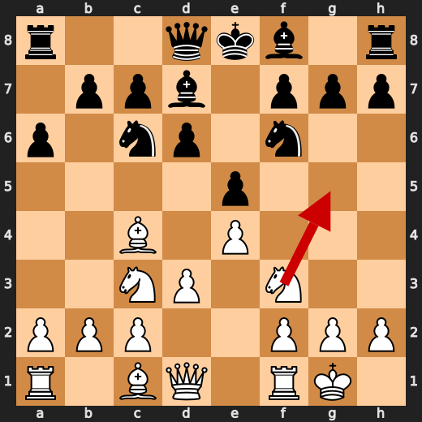

**After 7. Bg5**

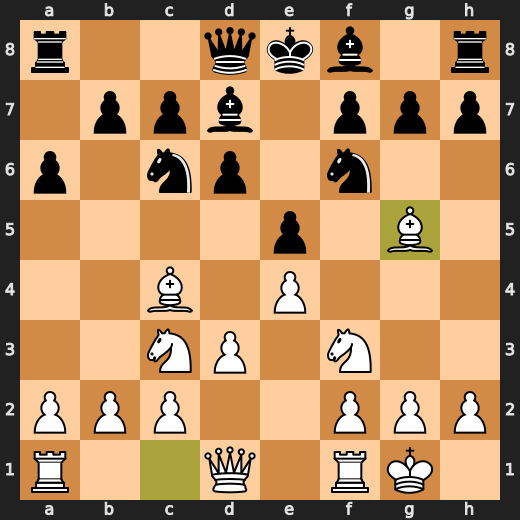

### ❌ Mistake: 37. Kxb7 by CPU (Black)

Kxb7 failed to limit White’s already winning position and made Black’s situation even worse. Bd2 was preferred because it would have put up more resistance than taking the pawn. Learn to avoid grabbing material when the engine shows that improving resistance is more important.

- **Eval:** +14.07 → +18.69
- **Preferred:** `Bd2`
- **Loss:** 462 cp

**Before 37. Kxb7**

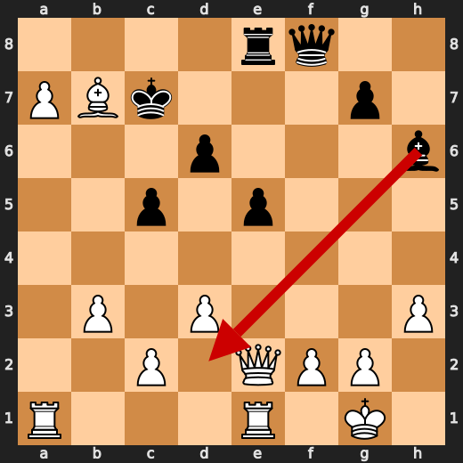

**After 37. Kxb7**

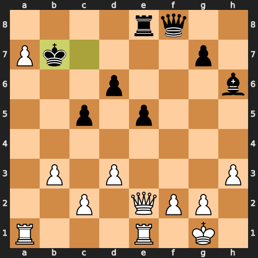

### 💀 Blunder: 38. Kb6 by CPU (Black)

Kb6 failed to address White’s decisive attacking chances, and the position became mate for White. Black needed d5 instead to improve resistance and avoid allowing an immediate forced finish.

- **Eval:** +14.63 → White has mate
- **Preferred:** `d5`
- **Loss:** 98537 cp

**Before 38. Kb6**

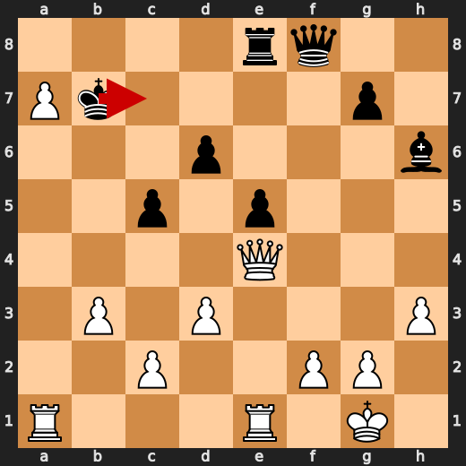

**After 38. Kb6**

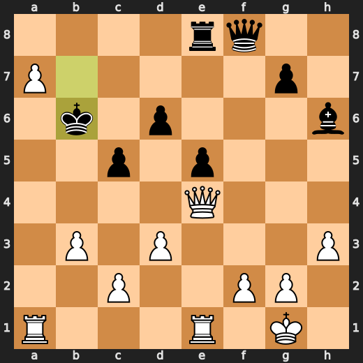

### 💀 Blunder: 39. a8=Q by You (White)

a8=Q promoted, but it failed to keep the forced mate that was available. Ra6+ was the move that preserved the decisive continuation, so the lesson is to check forcing moves before choosing a generally useful promotion.

- **Eval:** White has mate → +66.71
- **Preferred:** `Ra6+`
- **Loss:** 93329 cp

**Before 39. a8=Q**

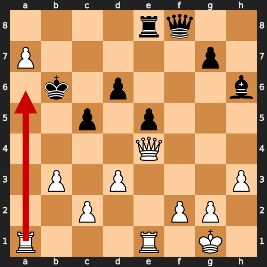

**After 39. a8=Q**

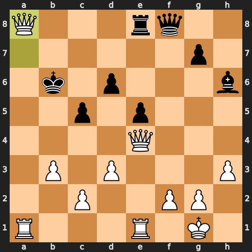

### 💀 Blunder: 39. Rxa8 by CPU (Black)

Rxa8 was the preferred move in the provided engine facts, but the evaluation still swung sharply further in White’s favor. The practical lesson is that even a useful capture can leave the position decisively worse when Black has no adequate resistance.

- **Eval:** +13.01 → +66.11
- **Preferred:** `Rxa8`
- **Loss:** 5310 cp

**Before 39. Rxa8**

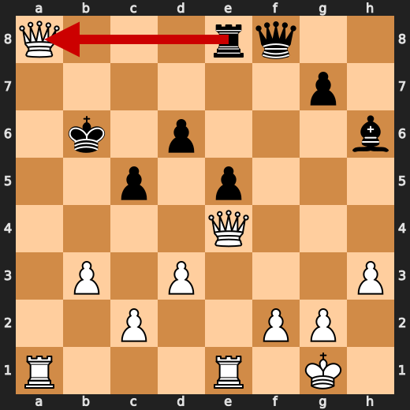

**After 39. Rxa8**

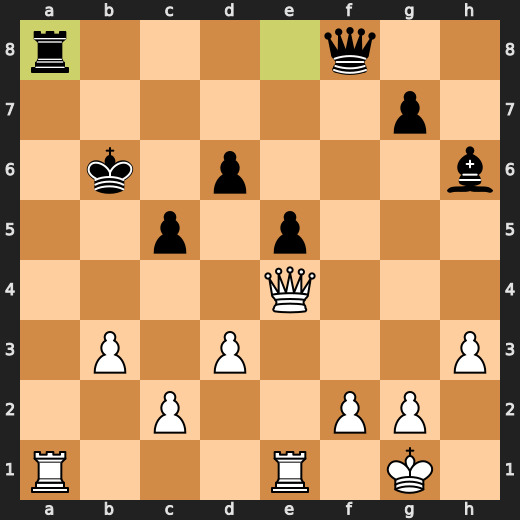

### 💀 Blunder: 40. Rxa8 by You (White)

Rxa8 failed to keep White’s overwhelming advantage, even though the provided facts also list Rxa8 as the preferred move. Since the concrete tactic is unclear, the lesson is to recheck forcing details before trusting a capture.

- **Eval:** +65.83 → +13.61
- **Preferred:** `Rxa8`
- **Loss:** 5222 cp

**Before 40. Rxa8**

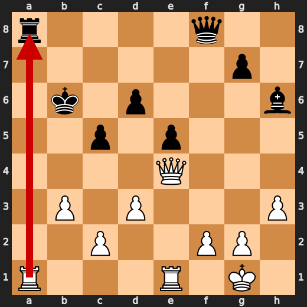

**After 40. Rxa8**

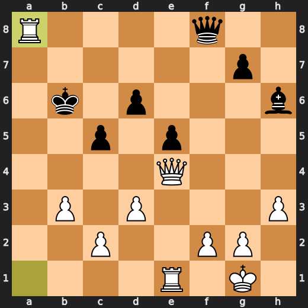

### 💀 Blunder: 40. Qf6 by CPU (Black)

Qf6 failed to prevent White’s forced mate and sharply worsened Black’s position. The preferred move was d5, which offered better resistance than moving the queen to f6. Learn to prioritize stopping immediate mating chances over making a move that only looks active.

- **Eval:** +66.02 → White has mate
- **Preferred:** `d5`
- **Loss:** 93398 cp

**Before 40. Qf6**

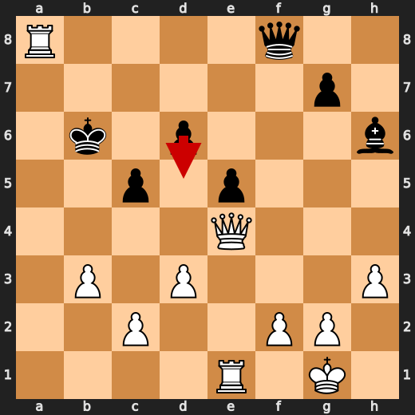

**After 40. Qf6**

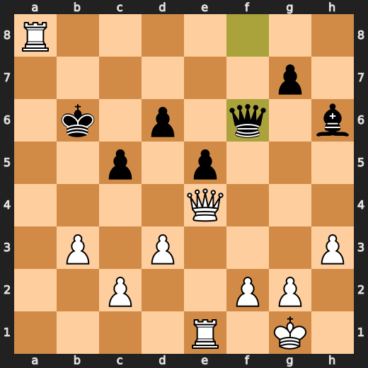

### 🏁 Checkmate: 42. Ra1# by You (White)

Ra1# was useful because it delivers the game-ending forcing move. The engine also liked Qa8#, so the practical pattern is to recognize direct mating moves when mate is already available.

- **Eval:** White has mate → White has mate
- **Preferred:** `Qa8#`
- **Loss:** 0 cp

**Before 42. Ra1#**

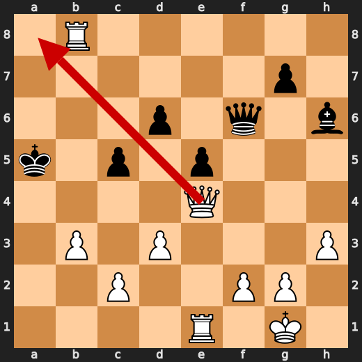

**After 42. Ra1#**

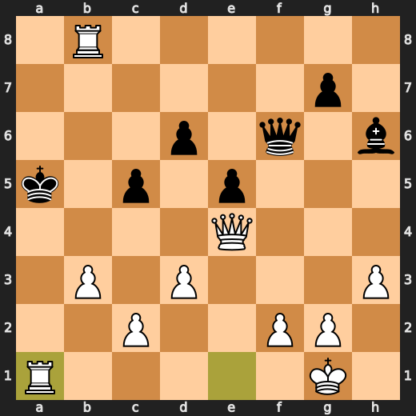

---

## Human Notes

Biggest caveman lesson: CPU (Black) blew it with **38. Kb6**.

There was another real screw-up at **6. Bd7** by **CPU (Black)**.

The game-ending shot was **42. Ra1#** by **You (White)**.

---

<details>
<summary>Compact move list</summary>

- 📖 **1. e4** (You (White), Book) — +0.41 → +0.49, preferred `e4`, loss 0 cp
- 📖 **1. e5** (CPU (Black), Book) — +0.35 → +0.37, preferred `c5`, loss 2 cp
- 📖 **2. Nf3** (You (White), Book) — +0.47 → +0.54, preferred `Nf3`, loss 0 cp
- 📖 **2. d6** (CPU (Black), Book) — +0.32 → +0.55, preferred `Nc6`, loss 23 cp
- 📖 **3. Bc4** (You (White), Book) — +0.77 → +0.51, preferred `d4`, loss 26 cp
- 📖 **3. Nf6** (CPU (Black), Book) — +0.31 → +0.41, preferred `Be7`, loss 10 cp
- 🔥 **4. d3** (You (White), Great) — +0.53 → +0.35, preferred `Nc3`, loss 18 cp
- 👍 **4. a6** (CPU (Black), Good) — +0.26 → +0.89, preferred `Be7`, loss 63 cp
- 👍 **5. O-O** (You (White), Good) — +1.05 → +0.37, preferred `Ng5`, loss 68 cp
- 👍 **5. Nc6** (CPU (Black), Good) — +0.33 → +1.51, preferred `Be7`, loss 118 cp
- 👍 **6. Nc3** (You (White), Good) — +1.16 → +0.03, preferred `Ng5`, loss 113 cp
- ❌ **6. Bd7** (CPU (Black), Mistake) — -0.08 → +4.24, preferred `Na5`, loss 432 cp
- ❌ **7. Bg5** (You (White), Mistake) — +4.10 → +0.13, preferred `Ng5`, loss 397 cp
- 🔥 **7. Be7** (CPU (Black), Great) — +0.15 → +0.39, preferred `Na5`, loss 24 cp
- ✅ **8. a4** (You (White), Best) — +0.43 → +0.47, preferred `a3`, loss 0 cp
- 🔥 **8. Qc8** (CPU (Black), Great) — +0.46 → +0.80, preferred `O-O`, loss 34 cp
- 🔥 **9. Nd5** (You (White), Great) — +0.80 → +0.50, preferred `a5`, loss 30 cp
- ⚠️ **9. Nxd5** (CPU (Black), Inaccuracy) — +0.36 → +1.97, preferred `Nxd5`, loss 161 cp
- ✅ **10. exd5** (You (White), Best) — +1.23 → +1.39, preferred `exd5`, loss 0 cp
- ⚠️ **10. Bxg5** (CPU (Black), Inaccuracy) — +1.37 → +4.12, preferred `Na5`, loss 275 cp
- 👍 **11. dxc6** (You (White), Good) — +5.51 → +4.63, preferred `dxc6`, loss 88 cp
- 👍 **11. Bg4** (CPU (Black), Good) — +4.39 → +5.00, preferred `Bg4`, loss 61 cp
- 👍 **12. Bxf7+** (You (White), Good) — +4.60 → +3.98, preferred `h3`, loss 62 cp
- ✅ **12. Ke7** (CPU (Black), Best) — +3.94 → +3.92, preferred `Kd8`, loss 0 cp
- ✅ **13. Bd5** (You (White), Best) — +3.78 → +3.64, preferred `Bd5`, loss 14 cp
- ✅ **13. bxc6** (CPU (Black), Best) — +3.91 → +4.01, preferred `bxc6`, loss 10 cp
- ✅ **14. Bxc6** (You (White), Best) — +4.13 → +4.04, preferred `Bxc6`, loss 9 cp
- 🔥 **14. Rb8** (CPU (Black), Great) — +3.92 → +4.12, preferred `Rb8`, loss 20 cp
- 👍 **15. b3** (You (White), Good) — +4.21 → +3.08, preferred `d4`, loss 113 cp
- 👍 **15. Qf5** (CPU (Black), Good) — +2.70 → +3.37, preferred `Bf4`, loss 67 cp
- 👍 **16. Qe1** (You (White), Good) — +3.93 → +3.34, preferred `Be4`, loss 59 cp
- ⚠️ **16. Bh6** (CPU (Black), Inaccuracy) — +3.17 → +4.65, preferred `Bf4`, loss 148 cp
- 👍 **17. Qa5** (You (White), Good) — +4.56 → +3.85, preferred `d4`, loss 71 cp
- 👍 **17. Rb6** (CPU (Black), Good) — +3.59 → +4.49, preferred `Rhd8`, loss 90 cp
- ✅ **18. Qc3** (You (White), Best) — +4.05 → +4.06, preferred `Qc3`, loss 0 cp
- 👍 **18. Bxf3** (CPU (Black), Good) — +4.24 → +5.29, preferred `Rhb8`, loss 105 cp
- ✅ **19. Bxf3** (You (White), Best) — +5.33 → +5.24, preferred `Bxf3`, loss 9 cp
- ✅ **19. c5** (CPU (Black), Best) — +5.18 → +4.93, preferred `c5`, loss 0 cp
- 👍 **20. Qa5** (You (White), Good) — +5.35 → +4.80, preferred `Rae1`, loss 55 cp
- ✅ **20. Rhb8** (CPU (Black), Best) — +4.38 → +4.29, preferred `Rhb8`, loss 0 cp
- 👍 **21. Qe1** (You (White), Good) — +4.77 → +3.63, preferred `Bd5`, loss 114 cp
- 👍 **21. Qf7** (CPU (Black), Good) — +3.61 → +4.29, preferred `Rb4`, loss 68 cp
- ✅ **22. Qe4** (You (White), Best) — +4.11 → +3.97, preferred `a5`, loss 14 cp
- ⚠️ **22. Kd8** (CPU (Black), Inaccuracy) — +3.84 → +5.56, preferred `Qg8`, loss 172 cp
- ⚠️ **23. Qxh7** (You (White), Inaccuracy) — +5.42 → +4.08, preferred `a5`, loss 134 cp
- ⚠️ **23. Kc7** (CPU (Black), Inaccuracy) — +4.43 → +6.46, preferred `d5`, loss 203 cp
- 🔥 **24. Qe4** (You (White), Great) — +6.89 → +6.51, preferred `Qe4`, loss 38 cp
- 👍 **24. Qe8** (CPU (Black), Good) — +6.28 → +7.22, preferred `a5`, loss 94 cp
- ⚠️ **25. a5** (You (White), Inaccuracy) — +7.24 → +5.93, preferred `Qc4`, loss 131 cp
- 👍 **25. Rb4** (CPU (Black), Good) — +6.09 → +6.74, preferred `Rb4`, loss 65 cp
- 🔥 **26. Qe2** (You (White), Great) — +6.46 → +6.17, preferred `Qe2`, loss 29 cp
- 🔥 **26. Qg6** (CPU (Black), Great) — +6.35 → +6.80, preferred `Qe6`, loss 45 cp
- 🔥 **27. Be4** (You (White), Great) — +6.89 → +6.40, preferred `g3`, loss 49 cp
- ✅ **27. Qe6** (CPU (Black), Best) — +6.46 → +6.48, preferred `Qe6`, loss 2 cp
- 🔥 **28. Rfe1** (You (White), Great) — +6.51 → +6.19, preferred `g3`, loss 32 cp
- 👍 **28. R4b5** (CPU (Black), Good) — +5.74 → +6.82, preferred `Bg5`, loss 108 cp
- 👍 **29. h3** (You (White), Good) — +7.02 → +6.07, preferred `g3`, loss 95 cp
- 👍 **29. Qe7** (CPU (Black), Good) — +6.22 → +7.37, preferred `Rb4`, loss 115 cp
- 🔥 **30. Bd5** (You (White), Great) — +7.38 → +7.15, preferred `Ra4`, loss 23 cp
- ⚠️ **30. Qf8** (CPU (Black), Inaccuracy) — +7.38 → +8.73, preferred `Rf8`, loss 135 cp
- ✅ **31. Bc4** (You (White), Best) — +8.00 → +8.53, preferred `Bc4`, loss 0 cp
- 🔥 **31. R5b7** (CPU (Black), Great) — +8.30 → +8.55, preferred `Rb4`, loss 25 cp
- ✅ **32. Bxa6** (You (White), Best) — +8.61 → +8.76, preferred `Bxa6`, loss 0 cp
- 👍 **32. Rb4** (CPU (Black), Good) — +8.67 → +9.61, preferred `Ra7`, loss 94 cp
- ✅ **33. Bc4** (You (White), Best) — +9.82 → +9.89, preferred `Bc4`, loss 0 cp
- ✅ **33. R4b7** (CPU (Black), Best) — +9.60 → +9.69, preferred `Qf4`, loss 9 cp
- 🔥 **34. a6** (You (White), Great) — +9.74 → +9.46, preferred `c3`, loss 28 cp
- ⚠️ **34. Rb6** (CPU (Black), Inaccuracy) — +9.15 → +11.84, preferred `Ra7`, loss 269 cp
- ✅ **35. a7** (You (White), Best) — +11.61 → +11.49, preferred `Bd5`, loss 12 cp
- 🔥 **35. Re8** (CPU (Black), Great) — +11.27 → +11.61, preferred `Qe8`, loss 34 cp
- 🔥 **36. Bd5** (You (White), Great) — +12.30 → +12.00, preferred `Bd5`, loss 30 cp
- ⚠️ **36. Rb7** (CPU (Black), Inaccuracy) — +12.32 → +14.23, preferred `Bd2`, loss 191 cp
- 👍 **37. Bxb7** (You (White), Good) — +14.92 → +14.41, preferred `Bxb7`, loss 51 cp
- ❌ **37. Kxb7** (CPU (Black), Mistake) — +14.07 → +18.69, preferred `Bd2`, loss 462 cp
- ✅ **38. Qe4+** (You (White), Best) — +21.09 → +71.20, preferred `Qe4+`, loss 0 cp
- 💀 **38. Kb6** (CPU (Black), Blunder) — +14.63 → White has mate, preferred `d5`, loss 98537 cp
- 💀 **39. a8=Q** (You (White), Blunder) — White has mate → +66.71, preferred `Ra6+`, loss 93329 cp
- 💀 **39. Rxa8** (CPU (Black), Blunder) — +13.01 → +66.11, preferred `Rxa8`, loss 5310 cp
- 💀 **40. Rxa8** (You (White), Blunder) — +65.83 → +13.61, preferred `Rxa8`, loss 5222 cp
- 💀 **40. Qf6** (CPU (Black), Blunder) — +66.02 → White has mate, preferred `d5`, loss 93398 cp
- ✅ **41. Rb8+** (You (White), Best) — White has mate → White has mate, preferred `Rb8+`, loss 0 cp
- ✅ **41. Ka5** (CPU (Black), Best) — White has mate → White has mate, preferred `Ka5`, loss 0 cp
- 🏁 **42. Ra1#** (You (White), Checkmate) — White has mate → White has mate, preferred `Qa8#`, loss 0 cp

</details>

---

<details>
<summary>Raw engine table</summary>

| Ply | Move | Actor | Played | Label | Eval Before | Eval After | Preferred | Loss |
|---:|---:|---|---|---|---:|---:|---|---:|
| 1 | 1 | You (White) | e4 | Book | +0.41 | +0.49 | e4 | 0 |
| 2 | 1 | CPU (Black) | e5 | Book | +0.35 | +0.37 | c5 | 2 |
| 3 | 2 | You (White) | Nf3 | Book | +0.47 | +0.54 | Nf3 | 0 |
| 4 | 2 | CPU (Black) | d6 | Book | +0.32 | +0.55 | Nc6 | 23 |
| 5 | 3 | You (White) | Bc4 | Book | +0.77 | +0.51 | d4 | 26 |
| 6 | 3 | CPU (Black) | Nf6 | Book | +0.31 | +0.41 | Be7 | 10 |
| 7 | 4 | You (White) | d3 | Great | +0.53 | +0.35 | Nc3 | 18 |
| 8 | 4 | CPU (Black) | a6 | Good | +0.26 | +0.89 | Be7 | 63 |
| 9 | 5 | You (White) | O-O | Good | +1.05 | +0.37 | Ng5 | 68 |
| 10 | 5 | CPU (Black) | Nc6 | Good | +0.33 | +1.51 | Be7 | 118 |
| 11 | 6 | You (White) | Nc3 | Good | +1.16 | +0.03 | Ng5 | 113 |
| 12 | 6 | CPU (Black) | Bd7 | Mistake | -0.08 | +4.24 | Na5 | 432 |
| 13 | 7 | You (White) | Bg5 | Mistake | +4.10 | +0.13 | Ng5 | 397 |
| 14 | 7 | CPU (Black) | Be7 | Great | +0.15 | +0.39 | Na5 | 24 |
| 15 | 8 | You (White) | a4 | Best | +0.43 | +0.47 | a3 | 0 |
| 16 | 8 | CPU (Black) | Qc8 | Great | +0.46 | +0.80 | O-O | 34 |
| 17 | 9 | You (White) | Nd5 | Great | +0.80 | +0.50 | a5 | 30 |
| 18 | 9 | CPU (Black) | Nxd5 | Inaccuracy | +0.36 | +1.97 | Nxd5 | 161 |
| 19 | 10 | You (White) | exd5 | Best | +1.23 | +1.39 | exd5 | 0 |
| 20 | 10 | CPU (Black) | Bxg5 | Inaccuracy | +1.37 | +4.12 | Na5 | 275 |
| 21 | 11 | You (White) | dxc6 | Good | +5.51 | +4.63 | dxc6 | 88 |
| 22 | 11 | CPU (Black) | Bg4 | Good | +4.39 | +5.00 | Bg4 | 61 |
| 23 | 12 | You (White) | Bxf7+ | Good | +4.60 | +3.98 | h3 | 62 |
| 24 | 12 | CPU (Black) | Ke7 | Best | +3.94 | +3.92 | Kd8 | 0 |
| 25 | 13 | You (White) | Bd5 | Best | +3.78 | +3.64 | Bd5 | 14 |
| 26 | 13 | CPU (Black) | bxc6 | Best | +3.91 | +4.01 | bxc6 | 10 |
| 27 | 14 | You (White) | Bxc6 | Best | +4.13 | +4.04 | Bxc6 | 9 |
| 28 | 14 | CPU (Black) | Rb8 | Great | +3.92 | +4.12 | Rb8 | 20 |
| 29 | 15 | You (White) | b3 | Good | +4.21 | +3.08 | d4 | 113 |
| 30 | 15 | CPU (Black) | Qf5 | Good | +2.70 | +3.37 | Bf4 | 67 |
| 31 | 16 | You (White) | Qe1 | Good | +3.93 | +3.34 | Be4 | 59 |
| 32 | 16 | CPU (Black) | Bh6 | Inaccuracy | +3.17 | +4.65 | Bf4 | 148 |
| 33 | 17 | You (White) | Qa5 | Good | +4.56 | +3.85 | d4 | 71 |
| 34 | 17 | CPU (Black) | Rb6 | Good | +3.59 | +4.49 | Rhd8 | 90 |
| 35 | 18 | You (White) | Qc3 | Best | +4.05 | +4.06 | Qc3 | 0 |
| 36 | 18 | CPU (Black) | Bxf3 | Good | +4.24 | +5.29 | Rhb8 | 105 |
| 37 | 19 | You (White) | Bxf3 | Best | +5.33 | +5.24 | Bxf3 | 9 |
| 38 | 19 | CPU (Black) | c5 | Best | +5.18 | +4.93 | c5 | 0 |
| 39 | 20 | You (White) | Qa5 | Good | +5.35 | +4.80 | Rae1 | 55 |
| 40 | 20 | CPU (Black) | Rhb8 | Best | +4.38 | +4.29 | Rhb8 | 0 |
| 41 | 21 | You (White) | Qe1 | Good | +4.77 | +3.63 | Bd5 | 114 |
| 42 | 21 | CPU (Black) | Qf7 | Good | +3.61 | +4.29 | Rb4 | 68 |
| 43 | 22 | You (White) | Qe4 | Best | +4.11 | +3.97 | a5 | 14 |
| 44 | 22 | CPU (Black) | Kd8 | Inaccuracy | +3.84 | +5.56 | Qg8 | 172 |
| 45 | 23 | You (White) | Qxh7 | Inaccuracy | +5.42 | +4.08 | a5 | 134 |
| 46 | 23 | CPU (Black) | Kc7 | Inaccuracy | +4.43 | +6.46 | d5 | 203 |
| 47 | 24 | You (White) | Qe4 | Great | +6.89 | +6.51 | Qe4 | 38 |
| 48 | 24 | CPU (Black) | Qe8 | Good | +6.28 | +7.22 | a5 | 94 |
| 49 | 25 | You (White) | a5 | Inaccuracy | +7.24 | +5.93 | Qc4 | 131 |
| 50 | 25 | CPU (Black) | Rb4 | Good | +6.09 | +6.74 | Rb4 | 65 |
| 51 | 26 | You (White) | Qe2 | Great | +6.46 | +6.17 | Qe2 | 29 |
| 52 | 26 | CPU (Black) | Qg6 | Great | +6.35 | +6.80 | Qe6 | 45 |
| 53 | 27 | You (White) | Be4 | Great | +6.89 | +6.40 | g3 | 49 |
| 54 | 27 | CPU (Black) | Qe6 | Best | +6.46 | +6.48 | Qe6 | 2 |
| 55 | 28 | You (White) | Rfe1 | Great | +6.51 | +6.19 | g3 | 32 |
| 56 | 28 | CPU (Black) | R4b5 | Good | +5.74 | +6.82 | Bg5 | 108 |
| 57 | 29 | You (White) | h3 | Good | +7.02 | +6.07 | g3 | 95 |
| 58 | 29 | CPU (Black) | Qe7 | Good | +6.22 | +7.37 | Rb4 | 115 |
| 59 | 30 | You (White) | Bd5 | Great | +7.38 | +7.15 | Ra4 | 23 |
| 60 | 30 | CPU (Black) | Qf8 | Inaccuracy | +7.38 | +8.73 | Rf8 | 135 |
| 61 | 31 | You (White) | Bc4 | Best | +8.00 | +8.53 | Bc4 | 0 |
| 62 | 31 | CPU (Black) | R5b7 | Great | +8.30 | +8.55 | Rb4 | 25 |
| 63 | 32 | You (White) | Bxa6 | Best | +8.61 | +8.76 | Bxa6 | 0 |
| 64 | 32 | CPU (Black) | Rb4 | Good | +8.67 | +9.61 | Ra7 | 94 |
| 65 | 33 | You (White) | Bc4 | Best | +9.82 | +9.89 | Bc4 | 0 |
| 66 | 33 | CPU (Black) | R4b7 | Best | +9.60 | +9.69 | Qf4 | 9 |
| 67 | 34 | You (White) | a6 | Great | +9.74 | +9.46 | c3 | 28 |
| 68 | 34 | CPU (Black) | Rb6 | Inaccuracy | +9.15 | +11.84 | Ra7 | 269 |
| 69 | 35 | You (White) | a7 | Best | +11.61 | +11.49 | Bd5 | 12 |
| 70 | 35 | CPU (Black) | Re8 | Great | +11.27 | +11.61 | Qe8 | 34 |
| 71 | 36 | You (White) | Bd5 | Great | +12.30 | +12.00 | Bd5 | 30 |
| 72 | 36 | CPU (Black) | Rb7 | Inaccuracy | +12.32 | +14.23 | Bd2 | 191 |
| 73 | 37 | You (White) | Bxb7 | Good | +14.92 | +14.41 | Bxb7 | 51 |
| 74 | 37 | CPU (Black) | Kxb7 | Mistake | +14.07 | +18.69 | Bd2 | 462 |
| 75 | 38 | You (White) | Qe4+ | Best | +21.09 | +71.20 | Qe4+ | 0 |
| 76 | 38 | CPU (Black) | Kb6 | Blunder | +14.63 | White has mate | d5 | 98537 |
| 77 | 39 | You (White) | a8=Q | Blunder | White has mate | +66.71 | Ra6+ | 93329 |
| 78 | 39 | CPU (Black) | Rxa8 | Blunder | +13.01 | +66.11 | Rxa8 | 5310 |
| 79 | 40 | You (White) | Rxa8 | Blunder | +65.83 | +13.61 | Rxa8 | 5222 |
| 80 | 40 | CPU (Black) | Qf6 | Blunder | +66.02 | White has mate | d5 | 93398 |
| 81 | 41 | You (White) | Rb8+ | Best | White has mate | White has mate | Rb8+ | 0 |
| 82 | 41 | CPU (Black) | Ka5 | Best | White has mate | White has mate | Ka5 | 0 |
| 83 | 42 | You (White) | Ra1# | Checkmate | White has mate | White has mate | Qa8# | 0 |

</details>

---

<details>
<summary>Clean PGN</summary>

```pgn
[Event "AI Factory's Chess"]
[Site "Android Device"]
[Date "2026.05.15"]
[Round "1"]
[White "You"]
[Black "CPU (5)"]
[Result "1-0"]
[PlyCount "83"]

1. e4 e5 2. Nf3 d6 3. Bc4 Nf6 4. d3 a6 5. O-O Nc6 6. Nc3 Bd7 7. Bg5 Be7 8. a4
Qc8 9. Nd5 Nxd5 10. exd5 Bxg5 11. dxc6 Bg4 12. Bxf7+ Ke7 13. Bd5 bxc6 14. Bxc6
Rb8 15. b3 Qf5 16. Qe1 Bh6 17. Qa5 Rb6 18. Qc3 Bxf3 19. Bxf3 c5 20. Qa5 Rhb8
21. Qe1 Qf7 22. Qe4 Kd8 23. Qxh7 Kc7 24. Qe4 Qe8 25. a5 Rb4 26. Qe2 Qg6 27. Be4
Qe6 28. Rfe1 R4b5 29. h3 Qe7 30. Bd5 Qf8 31. Bc4 R5b7 32. Bxa6 Rb4 33. Bc4 R4b7
34. a6 Rb6 35. a7 Re8 36. Bd5 Rb7 37. Bxb7 Kxb7 38. Qe4+ Kb6 39. a8=Q Rxa8 40.
Rxa8 Qf6 41. Rb8+ Ka5 42. Ra1# 1-0
```

</details>
