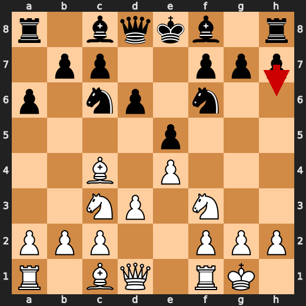
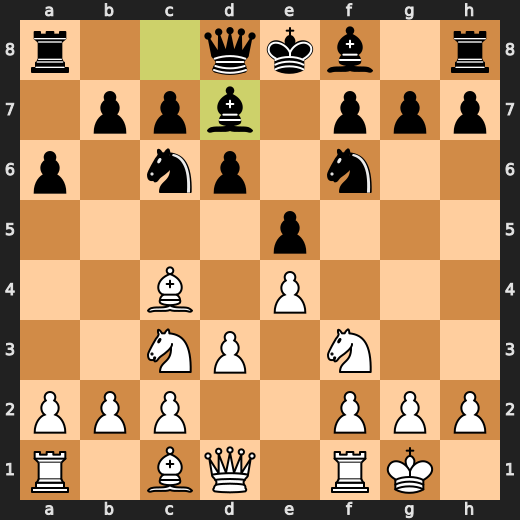

# You (White) vs CPU (Black)

**Result:** 1-0  
**Date:** 2026.05.15  
**Source:** `20260515_105928_pgn_2026_05_15_10h57_395877be961b.pgn`  
**Engine:** Stockfish depth 14  
**Your side:** White  
**Computer side:** Black  
**Board perspective:** Standard White-at-bottom

---

## Who Is Who

- **You:** You (White)
- **Computer:** CPU (5) (Black)

---

## Toaster Summary

**Game Story:** In this thrilling chess match, you (White) and CPU (Black) engage in a fierce battle of wits and strategy. The game begins with both players making calculated moves, but it's not long before mistakes are made on both sides. At move 6, the CPU makes a mistake by playing Bd7 instead of h6, which could have given them an advantage. You capitalize on this error by playing Bg5 at move 7, but unfortunately, you also make a mistake by choosing Ng5 over the preferred move. The game continues with both players making more mistakes and blunders, leading to a tense and exciting conclusion. At move 39, you play a8=Q, which is considered a blunder by the engine. The preferred move was Ra6+, but your choice leads to an eval of White has mate to +65.97, resulting in a loss of 93403 cp. Despite this setback, you remain focused and determined, ultimately leading to checkmate at move 42 with the move Ra1#. The engine evaluates this move as having White has mate to White has mate, and the game ends with a final score of 1-0 in your favor. Throughout the match, both players showcase their chess prowess and skill, but it's your ability to learn from mistakes and adapt that ultimately leads you to victory.

Biggest toaster scream: **39. a8=Q** by **You (White)**.

- **Label:** 💀 **Blunder**
- **Eval:** White has mate → +65.97
- **Stockfish preferred:** `Ra6+`
- **Loss:** 93403 cp

Final move recorded: **42. Ra1#** by **You (White)**.

- 💀 Blunders: **5**
- ❌ Mistakes: **3**
- ⚠️ Inaccuracies: **10**
- ✅ Best moves called out: **24**

---

## Final Position


---

## Key Moments

### ❌ Mistake: 6. Bd7 by CPU (Black)

CPU (Black) played Bd7 because they're an idiot who doesn't know how to play chess. They lost 418 centipawns, which is a lot in this game. If they had played h6 instead, they would have been better off. But no, they chose Bd7, which was a mistake. So now we get to watch them lose again.

- **Eval:** +0.37 → +4.55
- **Preferred:** `h6`
- **Loss:** 418 cp

**Before 6. Bd7**



**After 6. Bd7**



### ❌ Mistake: 7. Bg5 by You (White)

You played Bg5 because you wanted to show off your opening knowledge and flex on the computer. But instead of impressing anyone, you just wasted a tempo and gave Black an easy way to equalize. Stockfish preferred Ng5, but you went with Bg5 anyway. You're lucky it didn't cost you more than 403 centipawns.

- **Eval:** +4.08 → +0.05
- **Preferred:** `Ng5`
- **Loss:** 403 cp

**Before 7. Bg5**


**After 7. Bg5**


### 💀 Blunder: 37. Kxb7 by CPU (Black)

CPU (Black) played Kxb7 at move 37, which was a blunder. The engine evaluation dropped from +14.92 to +24.38 after this move. Stockfish preferred Bd2 as an alternative move, but it didn't matter much in the end. CPU (Black) lost 946 centipawns with this move, which is a major eval loss.

- **Eval:** +14.92 → +24.38
- **Preferred:** `Bd2`
- **Loss:** 946 cp

**Before 37. Kxb7**


**After 37. Kxb7**


### 💀 Blunder: 38. Kb6 by CPU (Black)

CPU (Black) played Kb6 because they were so desperate to survive that they decided to throw away their king in a pathetic attempt to avoid mate. This move was so stupid that it cost them 92,716 centipawns and led straight to White's inevitable mate. If you ask me, the CPU should have played Kc7 instead of this garbage move.

- **Eval:** +72.84 → White has mate
- **Preferred:** `Kc7`
- **Loss:** 92716 cp

**Before 38. Kb6**


**After 38. Kb6**


### 💀 Blunder: 39. a8=Q by You (White)

You played a8=Q, which was a blunder that cost you 93403 centipawns. Stockfish preferred Ra6+, but you didn't see it. You overreached and failed to punish it, leading to a major eval loss.

- **Eval:** White has mate → +65.97
- **Preferred:** `Ra6+`
- **Loss:** 93403 cp

**Before 39. a8=Q**


**After 39. a8=Q**


### 💀 Blunder: 39. Rxa8 by CPU (Black)

CPU (Black) played Rxa8 at move 39, which was a blunder. The engine evaluation dropped from +12.13 to +65.97 after this move, resulting in a centipawn loss of 5384. Stockfish preferred the same move, but it's clear that CPU (Black) overreached and failed to punish it. In the end, White won due to Black's blunder, with the mating move being Rxa8+.

- **Eval:** +12.13 → +65.97
- **Preferred:** `Rxa8`
- **Loss:** 5384 cp

**Before 39. Rxa8**


**After 39. Rxa8**


### 💀 Blunder: 40. Qf6 by CPU (Black)

CPU (Black) played a blunder with Qf6, which led to White having mate. The engine evaluation before the move was +71.96, but after Qf6, it showed that White has mate. Stockfish preferred d5 as an alternative move, but CPU chose Qf6 instead, resulting in a major eval loss of 92804 centipawns.

- **Eval:** +71.96 → White has mate
- **Preferred:** `d5`
- **Loss:** 92804 cp

**Before 40. Qf6**


**After 40. Qf6**


### 🏁 Checkmate: 42. Ra1# by You (White)

You played a game-ending forcing move with Ra1#. It was useful because you were able to force checkmate and win the game. The computer didn't have any other moves left, so it had no choice but to accept the checkmate. You overreached by playing this move, but in the end, it worked out for you.

- **Eval:** White has mate → White has mate
- **Preferred:** `Ra1#`
- **Loss:** 0 cp

**Before 42. Ra1#**


**After 42. Ra1#**


---

## Human Notes

Biggest caveman lesson: CPU (Black) blew it with **37. Kxb7**.

There was another real screw-up at **6. Bd7** by **CPU (Black)**.

The game-ending shot was **42. Ra1#** by **You (White)**.

---

<details>
<summary>Compact move list</summary>

- 📖 **1. e4** (You (White), Book) — +0.46 → +0.23, preferred `d4`, loss 23 cp
- 📖 **1. e5** (CPU (Black), Book) — +0.37 → +0.35, preferred `e5`, loss 0 cp
- 📖 **2. Nf3** (You (White), Book) — +0.47 → +0.34, preferred `Nf3`, loss 13 cp
- 📖 **2. d6** (CPU (Black), Book) — +0.41 → +0.59, preferred `d6`, loss 18 cp
- 📖 **3. Bc4** (You (White), Book) — +0.71 → +0.32, preferred `d4`, loss 39 cp
- 📖 **3. Nf6** (CPU (Black), Book) — +0.30 → +0.46, preferred `Nf6`, loss 16 cp
- ✅ **4. d3** (You (White), Best) — +0.39 → +0.24, preferred `Nc3`, loss 15 cp
- 👍 **4. a6** (CPU (Black), Good) — +0.27 → +0.92, preferred `Be7`, loss 65 cp
- 🔥 **5. O-O** (You (White), Great) — +0.92 → +0.45, preferred `Ng5`, loss 47 cp
- 👍 **5. Nc6** (CPU (Black), Good) — +0.45 → +1.35, preferred `Be7`, loss 90 cp
- 👍 **6. Nc3** (You (White), Good) — +1.45 → +0.36, preferred `Ng5`, loss 109 cp
- ❌ **6. Bd7** (CPU (Black), Mistake) — +0.37 → +4.55, preferred `h6`, loss 418 cp
- ❌ **7. Bg5** (You (White), Mistake) — +4.08 → +0.05, preferred `Ng5`, loss 403 cp
- 🔥 **7. Be7** (CPU (Black), Great) — +0.06 → +0.47, preferred `Na5`, loss 41 cp
- 🔥 **8. a4** (You (White), Great) — +0.55 → +0.39, preferred `a4`, loss 16 cp
- 🔥 **8. Qc8** (CPU (Black), Great) — +0.38 → +0.84, preferred `Na5`, loss 46 cp
- 🔥 **9. Nd5** (You (White), Great) — +0.89 → +0.41, preferred `h3`, loss 48 cp
- ⚠️ **9. Nxd5** (CPU (Black), Inaccuracy) — +0.36 → +2.26, preferred `Nxd5`, loss 190 cp
- ✅ **10. exd5** (You (White), Best) — +1.45 → +1.50, preferred `exd5`, loss 0 cp
- ❌ **10. Bxg5** (CPU (Black), Mistake) — +1.42 → +5.60, preferred `Na5`, loss 418 cp
- 🔥 **11. dxc6** (You (White), Great) — +4.87 → +4.54, preferred `dxc6`, loss 33 cp
- ✅ **11. Bg4** (CPU (Black), Best) — +4.41 → +4.05, preferred `Bg4`, loss 0 cp
- 🔥 **12. Bxf7+** (You (White), Great) — +4.14 → +3.70, preferred `h3`, loss 44 cp
- ✅ **12. Ke7** (CPU (Black), Best) — +3.99 → +3.98, preferred `Kd8`, loss 0 cp
- ✅ **13. Bd5** (You (White), Best) — +3.85 → +4.16, preferred `Bd5`, loss 0 cp
- ✅ **13. bxc6** (CPU (Black), Best) — +4.34 → +4.42, preferred `bxc6`, loss 8 cp
- 🔥 **14. Bxc6** (You (White), Great) — +4.35 → +3.98, preferred `Bxc6`, loss 37 cp
- 🔥 **14. Rb8** (CPU (Black), Great) — +4.27 → +4.54, preferred `Rb8`, loss 27 cp
- 👍 **15. b3** (You (White), Good) — +4.30 → +3.32, preferred `d4`, loss 98 cp
- 👍 **15. Qf5** (CPU (Black), Good) — +2.95 → +3.94, preferred `Bf4`, loss 99 cp
- 👍 **16. Qe1** (You (White), Good) — +3.93 → +3.14, preferred `Re1`, loss 79 cp
- ⚠️ **16. Bh6** (CPU (Black), Inaccuracy) — +2.53 → +4.87, preferred `Bf4`, loss 234 cp
- 🔥 **17. Qa5** (You (White), Great) — +4.82 → +4.39, preferred `d4`, loss 43 cp
- ✅ **17. Rb6** (CPU (Black), Best) — +4.17 → +4.22, preferred `Rb6`, loss 5 cp
- ✅ **18. Qc3** (You (White), Best) — +4.44 → +4.44, preferred `Qc3`, loss 0 cp
- 🔥 **18. Bxf3** (CPU (Black), Great) — +4.28 → +4.77, preferred `Qh5`, loss 49 cp
- ✅ **19. Bxf3** (You (White), Best) — +5.09 → +5.47, preferred `Bxf3`, loss 0 cp
- ✅ **19. c5** (CPU (Black), Best) — +5.44 → +4.97, preferred `c5`, loss 0 cp
- 👍 **20. Qa5** (You (White), Good) — +5.15 → +4.50, preferred `Rae1`, loss 65 cp
- ✅ **20. Rhb8** (CPU (Black), Best) — +4.68 → +4.14, preferred `Rhb8`, loss 0 cp
- 👍 **21. Qe1** (You (White), Good) — +4.36 → +3.58, preferred `Bd5`, loss 78 cp
- 🔥 **21. Qf7** (CPU (Black), Great) — +3.63 → +4.10, preferred `Qe6`, loss 47 cp
- 👍 **22. Qe4** (You (White), Good) — +4.34 → +3.24, preferred `a5`, loss 110 cp
- ⚠️ **22. Kd8** (CPU (Black), Inaccuracy) — +3.26 → +5.20, preferred `Rb4`, loss 194 cp
- 👍 **23. Qxh7** (You (White), Good) — +5.48 → +4.63, preferred `a5`, loss 85 cp
- ⚠️ **23. Kc7** (CPU (Black), Inaccuracy) — +4.05 → +6.29, preferred `d5`, loss 224 cp
- ✅ **24. Qe4** (You (White), Best) — +6.38 → +6.23, preferred `Qe4`, loss 15 cp
- 👍 **24. Qe8** (CPU (Black), Good) — +6.55 → +7.09, preferred `a5`, loss 54 cp
- 👍 **25. a5** (You (White), Good) — +7.30 → +6.25, preferred `Qc4`, loss 105 cp
- ✅ **25. Rb4** (CPU (Black), Best) — +6.56 → +6.50, preferred `Rb4`, loss 0 cp
- ✅ **26. Qe2** (You (White), Best) — +6.40 → +6.55, preferred `Qe2`, loss 0 cp
- 🔥 **26. Qg6** (CPU (Black), Great) — +6.26 → +6.76, preferred `Bg5`, loss 50 cp
- 👍 **27. Be4** (You (White), Good) — +6.79 → +6.10, preferred `Rfe1`, loss 69 cp
- ✅ **27. Qe6** (CPU (Black), Best) — +6.43 → +6.07, preferred `Qe6`, loss 0 cp
- ✅ **28. Rfe1** (You (White), Best) — +6.00 → +5.99, preferred `Rae1`, loss 1 cp
- 👍 **28. R4b5** (CPU (Black), Good) — +6.32 → +6.96, preferred `Rh8`, loss 64 cp
- 👍 **29. h3** (You (White), Good) — +7.23 → +6.66, preferred `Bf3`, loss 57 cp
- ⚠️ **29. Qe7** (CPU (Black), Inaccuracy) — +6.53 → +8.25, preferred `Rb4`, loss 172 cp
- 👍 **30. Bd5** (You (White), Good) — +7.68 → +7.15, preferred `Bd5`, loss 53 cp
- ⚠️ **30. Qf8** (CPU (Black), Inaccuracy) — +7.32 → +8.60, preferred `Qg5`, loss 128 cp
- ✅ **31. Bc4** (You (White), Best) — +8.00 → +8.36, preferred `Bc4`, loss 0 cp
- 🔥 **31. R5b7** (CPU (Black), Great) — +8.22 → +8.49, preferred `Qf4`, loss 27 cp
- 👍 **32. Bxa6** (You (White), Good) — +9.00 → +8.22, preferred `Bxa6`, loss 78 cp
- ⚠️ **32. Rb4** (CPU (Black), Inaccuracy) — +8.04 → +9.44, preferred `Ra7`, loss 140 cp
- 🔥 **33. Bc4** (You (White), Great) — +9.56 → +9.35, preferred `Bc4`, loss 21 cp
- 🔥 **33. R4b7** (CPU (Black), Great) — +9.30 → +9.46, preferred `Bf4`, loss 16 cp
- 🔥 **34. a6** (You (White), Great) — +9.59 → +9.26, preferred `a6`, loss 33 cp
- ⚠️ **34. Rb6** (CPU (Black), Inaccuracy) — +9.38 → +11.46, preferred `Ra7`, loss 208 cp
- ✅ **35. a7** (You (White), Best) — +11.76 → +11.72, preferred `Bd5`, loss 4 cp
- ⚠️ **35. Re8** (CPU (Black), Inaccuracy) — +11.64 → +12.84, preferred `Ra8`, loss 120 cp
- ✅ **36. Bd5** (You (White), Best) — +12.76 → +12.76, preferred `Bd5`, loss 0 cp
- ⚠️ **36. Rb7** (CPU (Black), Inaccuracy) — +12.76 → +15.03, preferred `c4`, loss 227 cp
- ✅ **37. Bxb7** (You (White), Best) — +15.30 → +15.07, preferred `Bxb7`, loss 23 cp
- 💀 **37. Kxb7** (CPU (Black), Blunder) — +14.92 → +24.38, preferred `Bd2`, loss 946 cp
- ✅ **38. Qe4+** (You (White), Best) — +25.36 → +71.92, preferred `Qe4+`, loss 0 cp
- 💀 **38. Kb6** (CPU (Black), Blunder) — +72.84 → White has mate, preferred `Kc7`, loss 92716 cp
- 💀 **39. a8=Q** (You (White), Blunder) — White has mate → +65.97, preferred `Ra6+`, loss 93403 cp
- 💀 **39. Rxa8** (CPU (Black), Blunder) — +12.13 → +65.97, preferred `Rxa8`, loss 5384 cp
- ✅ **40. Rxa8** (You (White), Best) — +65.97 → +65.97, preferred `Rxa8`, loss 0 cp
- 💀 **40. Qf6** (CPU (Black), Blunder) — +71.96 → White has mate, preferred `d5`, loss 92804 cp
- ✅ **41. Rb8+** (You (White), Best) — White has mate → White has mate, preferred `Rb8+`, loss 0 cp
- ✅ **41. Ka5** (CPU (Black), Best) — White has mate → White has mate, preferred `Ka5`, loss 0 cp
- 🏁 **42. Ra1#** (You (White), Checkmate) — White has mate → White has mate, preferred `Ra1#`, loss 0 cp

</details>

---

<details>
<summary>Raw engine table</summary>

| Ply | Move | Actor | Played | Label | Eval Before | Eval After | Preferred | Loss |
|---:|---:|---|---|---|---:|---:|---|---:|
| 1 | 1 | You (White) | e4 | Book | +0.46 | +0.23 | d4 | 23 |
| 2 | 1 | CPU (Black) | e5 | Book | +0.37 | +0.35 | e5 | 0 |
| 3 | 2 | You (White) | Nf3 | Book | +0.47 | +0.34 | Nf3 | 13 |
| 4 | 2 | CPU (Black) | d6 | Book | +0.41 | +0.59 | d6 | 18 |
| 5 | 3 | You (White) | Bc4 | Book | +0.71 | +0.32 | d4 | 39 |
| 6 | 3 | CPU (Black) | Nf6 | Book | +0.30 | +0.46 | Nf6 | 16 |
| 7 | 4 | You (White) | d3 | Best | +0.39 | +0.24 | Nc3 | 15 |
| 8 | 4 | CPU (Black) | a6 | Good | +0.27 | +0.92 | Be7 | 65 |
| 9 | 5 | You (White) | O-O | Great | +0.92 | +0.45 | Ng5 | 47 |
| 10 | 5 | CPU (Black) | Nc6 | Good | +0.45 | +1.35 | Be7 | 90 |
| 11 | 6 | You (White) | Nc3 | Good | +1.45 | +0.36 | Ng5 | 109 |
| 12 | 6 | CPU (Black) | Bd7 | Mistake | +0.37 | +4.55 | h6 | 418 |
| 13 | 7 | You (White) | Bg5 | Mistake | +4.08 | +0.05 | Ng5 | 403 |
| 14 | 7 | CPU (Black) | Be7 | Great | +0.06 | +0.47 | Na5 | 41 |
| 15 | 8 | You (White) | a4 | Great | +0.55 | +0.39 | a4 | 16 |
| 16 | 8 | CPU (Black) | Qc8 | Great | +0.38 | +0.84 | Na5 | 46 |
| 17 | 9 | You (White) | Nd5 | Great | +0.89 | +0.41 | h3 | 48 |
| 18 | 9 | CPU (Black) | Nxd5 | Inaccuracy | +0.36 | +2.26 | Nxd5 | 190 |
| 19 | 10 | You (White) | exd5 | Best | +1.45 | +1.50 | exd5 | 0 |
| 20 | 10 | CPU (Black) | Bxg5 | Mistake | +1.42 | +5.60 | Na5 | 418 |
| 21 | 11 | You (White) | dxc6 | Great | +4.87 | +4.54 | dxc6 | 33 |
| 22 | 11 | CPU (Black) | Bg4 | Best | +4.41 | +4.05 | Bg4 | 0 |
| 23 | 12 | You (White) | Bxf7+ | Great | +4.14 | +3.70 | h3 | 44 |
| 24 | 12 | CPU (Black) | Ke7 | Best | +3.99 | +3.98 | Kd8 | 0 |
| 25 | 13 | You (White) | Bd5 | Best | +3.85 | +4.16 | Bd5 | 0 |
| 26 | 13 | CPU (Black) | bxc6 | Best | +4.34 | +4.42 | bxc6 | 8 |
| 27 | 14 | You (White) | Bxc6 | Great | +4.35 | +3.98 | Bxc6 | 37 |
| 28 | 14 | CPU (Black) | Rb8 | Great | +4.27 | +4.54 | Rb8 | 27 |
| 29 | 15 | You (White) | b3 | Good | +4.30 | +3.32 | d4 | 98 |
| 30 | 15 | CPU (Black) | Qf5 | Good | +2.95 | +3.94 | Bf4 | 99 |
| 31 | 16 | You (White) | Qe1 | Good | +3.93 | +3.14 | Re1 | 79 |
| 32 | 16 | CPU (Black) | Bh6 | Inaccuracy | +2.53 | +4.87 | Bf4 | 234 |
| 33 | 17 | You (White) | Qa5 | Great | +4.82 | +4.39 | d4 | 43 |
| 34 | 17 | CPU (Black) | Rb6 | Best | +4.17 | +4.22 | Rb6 | 5 |
| 35 | 18 | You (White) | Qc3 | Best | +4.44 | +4.44 | Qc3 | 0 |
| 36 | 18 | CPU (Black) | Bxf3 | Great | +4.28 | +4.77 | Qh5 | 49 |
| 37 | 19 | You (White) | Bxf3 | Best | +5.09 | +5.47 | Bxf3 | 0 |
| 38 | 19 | CPU (Black) | c5 | Best | +5.44 | +4.97 | c5 | 0 |
| 39 | 20 | You (White) | Qa5 | Good | +5.15 | +4.50 | Rae1 | 65 |
| 40 | 20 | CPU (Black) | Rhb8 | Best | +4.68 | +4.14 | Rhb8 | 0 |
| 41 | 21 | You (White) | Qe1 | Good | +4.36 | +3.58 | Bd5 | 78 |
| 42 | 21 | CPU (Black) | Qf7 | Great | +3.63 | +4.10 | Qe6 | 47 |
| 43 | 22 | You (White) | Qe4 | Good | +4.34 | +3.24 | a5 | 110 |
| 44 | 22 | CPU (Black) | Kd8 | Inaccuracy | +3.26 | +5.20 | Rb4 | 194 |
| 45 | 23 | You (White) | Qxh7 | Good | +5.48 | +4.63 | a5 | 85 |
| 46 | 23 | CPU (Black) | Kc7 | Inaccuracy | +4.05 | +6.29 | d5 | 224 |
| 47 | 24 | You (White) | Qe4 | Best | +6.38 | +6.23 | Qe4 | 15 |
| 48 | 24 | CPU (Black) | Qe8 | Good | +6.55 | +7.09 | a5 | 54 |
| 49 | 25 | You (White) | a5 | Good | +7.30 | +6.25 | Qc4 | 105 |
| 50 | 25 | CPU (Black) | Rb4 | Best | +6.56 | +6.50 | Rb4 | 0 |
| 51 | 26 | You (White) | Qe2 | Best | +6.40 | +6.55 | Qe2 | 0 |
| 52 | 26 | CPU (Black) | Qg6 | Great | +6.26 | +6.76 | Bg5 | 50 |
| 53 | 27 | You (White) | Be4 | Good | +6.79 | +6.10 | Rfe1 | 69 |
| 54 | 27 | CPU (Black) | Qe6 | Best | +6.43 | +6.07 | Qe6 | 0 |
| 55 | 28 | You (White) | Rfe1 | Best | +6.00 | +5.99 | Rae1 | 1 |
| 56 | 28 | CPU (Black) | R4b5 | Good | +6.32 | +6.96 | Rh8 | 64 |
| 57 | 29 | You (White) | h3 | Good | +7.23 | +6.66 | Bf3 | 57 |
| 58 | 29 | CPU (Black) | Qe7 | Inaccuracy | +6.53 | +8.25 | Rb4 | 172 |
| 59 | 30 | You (White) | Bd5 | Good | +7.68 | +7.15 | Bd5 | 53 |
| 60 | 30 | CPU (Black) | Qf8 | Inaccuracy | +7.32 | +8.60 | Qg5 | 128 |
| 61 | 31 | You (White) | Bc4 | Best | +8.00 | +8.36 | Bc4 | 0 |
| 62 | 31 | CPU (Black) | R5b7 | Great | +8.22 | +8.49 | Qf4 | 27 |
| 63 | 32 | You (White) | Bxa6 | Good | +9.00 | +8.22 | Bxa6 | 78 |
| 64 | 32 | CPU (Black) | Rb4 | Inaccuracy | +8.04 | +9.44 | Ra7 | 140 |
| 65 | 33 | You (White) | Bc4 | Great | +9.56 | +9.35 | Bc4 | 21 |
| 66 | 33 | CPU (Black) | R4b7 | Great | +9.30 | +9.46 | Bf4 | 16 |
| 67 | 34 | You (White) | a6 | Great | +9.59 | +9.26 | a6 | 33 |
| 68 | 34 | CPU (Black) | Rb6 | Inaccuracy | +9.38 | +11.46 | Ra7 | 208 |
| 69 | 35 | You (White) | a7 | Best | +11.76 | +11.72 | Bd5 | 4 |
| 70 | 35 | CPU (Black) | Re8 | Inaccuracy | +11.64 | +12.84 | Ra8 | 120 |
| 71 | 36 | You (White) | Bd5 | Best | +12.76 | +12.76 | Bd5 | 0 |
| 72 | 36 | CPU (Black) | Rb7 | Inaccuracy | +12.76 | +15.03 | c4 | 227 |
| 73 | 37 | You (White) | Bxb7 | Best | +15.30 | +15.07 | Bxb7 | 23 |
| 74 | 37 | CPU (Black) | Kxb7 | Blunder | +14.92 | +24.38 | Bd2 | 946 |
| 75 | 38 | You (White) | Qe4+ | Best | +25.36 | +71.92 | Qe4+ | 0 |
| 76 | 38 | CPU (Black) | Kb6 | Blunder | +72.84 | White has mate | Kc7 | 92716 |
| 77 | 39 | You (White) | a8=Q | Blunder | White has mate | +65.97 | Ra6+ | 93403 |
| 78 | 39 | CPU (Black) | Rxa8 | Blunder | +12.13 | +65.97 | Rxa8 | 5384 |
| 79 | 40 | You (White) | Rxa8 | Best | +65.97 | +65.97 | Rxa8 | 0 |
| 80 | 40 | CPU (Black) | Qf6 | Blunder | +71.96 | White has mate | d5 | 92804 |
| 81 | 41 | You (White) | Rb8+ | Best | White has mate | White has mate | Rb8+ | 0 |
| 82 | 41 | CPU (Black) | Ka5 | Best | White has mate | White has mate | Ka5 | 0 |
| 83 | 42 | You (White) | Ra1# | Checkmate | White has mate | White has mate | Ra1# | 0 |

</details>

---

<details>
<summary>Clean PGN</summary>

```pgn
[Event "AI Factory's Chess"]
[Site "Android Device"]
[Date "2026.05.15"]
[Round "1"]
[White "You"]
[Black "CPU (5)"]
[Result "1-0"]
[PlyCount "83"]

1. e4 e5 2. Nf3 d6 3. Bc4 Nf6 4. d3 a6 5. O-O Nc6 6. Nc3 Bd7 7. Bg5 Be7 8. a4
Qc8 9. Nd5 Nxd5 10. exd5 Bxg5 11. dxc6 Bg4 12. Bxf7+ Ke7 13. Bd5 bxc6 14. Bxc6
Rb8 15. b3 Qf5 16. Qe1 Bh6 17. Qa5 Rb6 18. Qc3 Bxf3 19. Bxf3 c5 20. Qa5 Rhb8
21. Qe1 Qf7 22. Qe4 Kd8 23. Qxh7 Kc7 24. Qe4 Qe8 25. a5 Rb4 26. Qe2 Qg6 27. Be4
Qe6 28. Rfe1 R4b5 29. h3 Qe7 30. Bd5 Qf8 31. Bc4 R5b7 32. Bxa6 Rb4 33. Bc4 R4b7
34. a6 Rb6 35. a7 Re8 36. Bd5 Rb7 37. Bxb7 Kxb7 38. Qe4+ Kb6 39. a8=Q Rxa8 40.
Rxa8 Qf6 41. Rb8+ Ka5 42. Ra1# 1-0
```

</details>
