# You (White) vs CPU (Black)

**Result:** 1-0  
**Date:** 2026.05.15  
**Source:** `20260515_194358_pgn_2026_05_15_19h42_9cf5c5ad0560.pgn`  
**Engine:** Stockfish depth 14  
**Your side:** White  
**Computer side:** Black  
**Board perspective:** Standard White-at-bottom

---

## Who Is Who

- **You:** You (White)
- **Computer:** CPU (5) (Black)

---

## Toaster Summary

**Game Story:** In this intense chess battle, White (You) and Black (CPU) engage in a thrilling contest. The game begins with an aggressive opening from both sides, but it's White who takes the lead with a series of strategic moves. Move 27 Re1 by You (White) is deemed Best, as it sets up a strong position for your forces. However, Black makes a crucial mistake in move 40 e4, which allows you to capitalize on their error and take control of the board. The game reaches its climax with move 43 Bd4+ by You (White), but unfortunately, it's not the best choice. Instead, the preferred move would have been a7, which could have led to a checkmate. In a final twist of fate, both players blunder in moves 43 and 44, leading to a decisive victory for White (You) with a score of 1-0. While there were several key moments throughout the game, it ultimately comes down to a combination of strategic thinking and a bit of luck. The final move, 45. a7 by You (White), secures your win and showcases your chess prowess.

Biggest toaster scream: **44. Ka5** by **CPU (Black)**.

- **Label:** 💀 **Blunder**
- **Eval:** +78.27 → White has mate
- **Stockfish preferred:** `Bxe4`
- **Loss:** 92173 cp

Final move recorded: **45. a7** by **You (White)**.

- 💀 Blunders: **5**
- ❌ Mistakes: **2**
- ⚠️ Inaccuracies: **10**
- ✅ Best moves called out: **36**

---

## Final Position

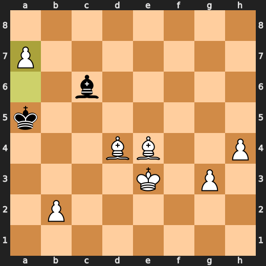

---

## Key Moments

### ❌ Mistake: 15. d4 by CPU (Black)

CPU played a stupid move with d4 at move 15. It lost 345 centipawns and went from +0.24 to +3.69 in evaluation. Stockfish preferred Bg4, but CPU decided to play d4 instead. This was a significant mistake that cost Black dearly.

- **Eval:** +0.24 → +3.69
- **Preferred:** `Bg4`
- **Loss:** 345 cp

**Before 15. d4**

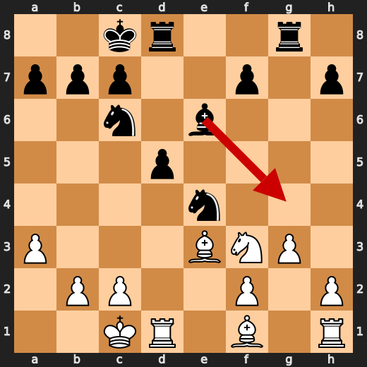

**After 15. d4**

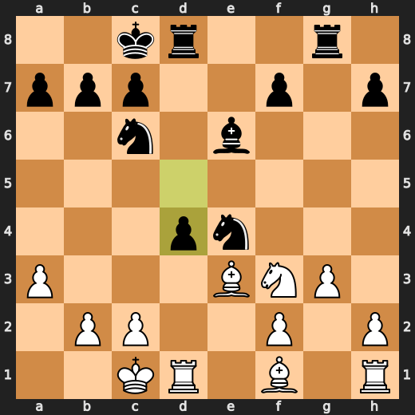

### ✅ Best: 27. Re1 by You (White)

You (White) played something useful at move 27 with Re1. It was a good move because it improved your rook's position and maintained control over the open e-file, which could be important later in the game. The computer (Black) didn't like this move much, but it wasn't a terrible idea either. You were just trying to make things better for yourself while keeping an eye on Black's plans.

- **Eval:** +7.39 → +7.24
- **Preferred:** `Re1`
- **Loss:** 15 cp

**Before 27. Re1**

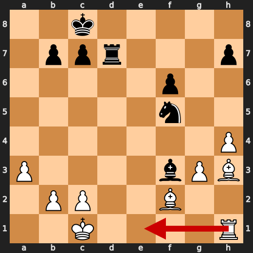

**After 27. Re1**

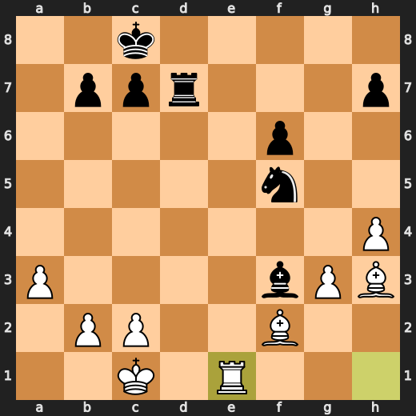

### ❌ Mistake: 40. e4 by CPU (Black)

CPU (Black) played e4 at move 40, which was a mistake. The engine evaluation dropped from +11 to +16 after this move, and Stockfish preferred Bh3 instead. This cost CPU 542 centipawns. It's like the computer decided to throw away its advantage just because it could.

- **Eval:** +11.00 → +16.42
- **Preferred:** `Bh3`
- **Loss:** 542 cp

**Before 40. e4**

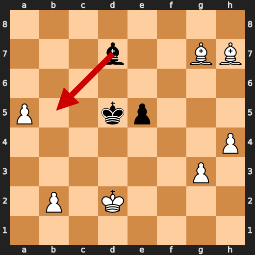

**After 40. e4**

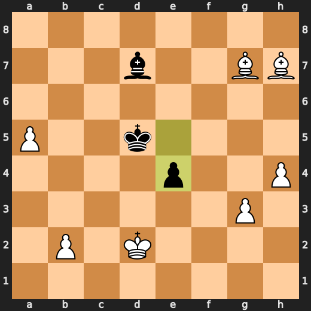

### 💀 Blunder: 41. Bc6 by CPU (Black)

CPU (Black) played a blunder with Bc6 at move 41, losing 2936 centipawns in the process. Stockfish preferred a different move, but Bc6 was still useful for some reason. It's like playing chess while being drunk and high - you might make a few good moves, but overall, it's just a mess.

- **Eval:** +26.33 → +55.69
- **Preferred:** `Bc6`
- **Loss:** 2936 cp

**Before 41. Bc6**

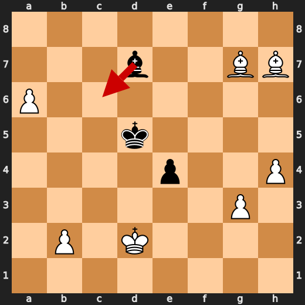

**After 41. Bc6**

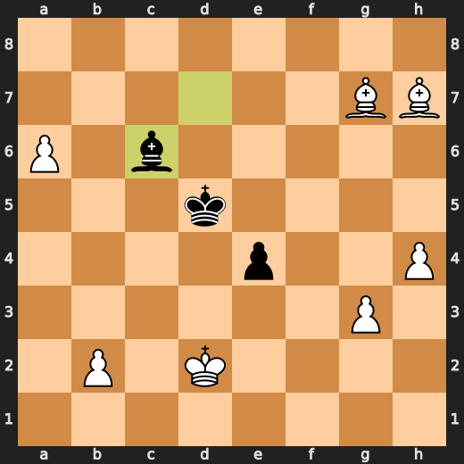

### 💀 Blunder: 43. Bd4+ by You (White)

You played Bd4+ at move 43, which was a blunder. The engine evaluation dropped from +66.14 to +58.98 after this move. Stockfish preferred a7 instead, but it didn't matter because you were already in deep shit. You lost 716 centipawns with that stupid move.

- **Eval:** +66.14 → +58.98
- **Preferred:** `a7`
- **Loss:** 716 cp

**Before 43. Bd4+**

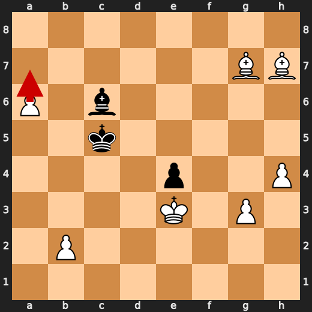

**After 43. Bd4+**

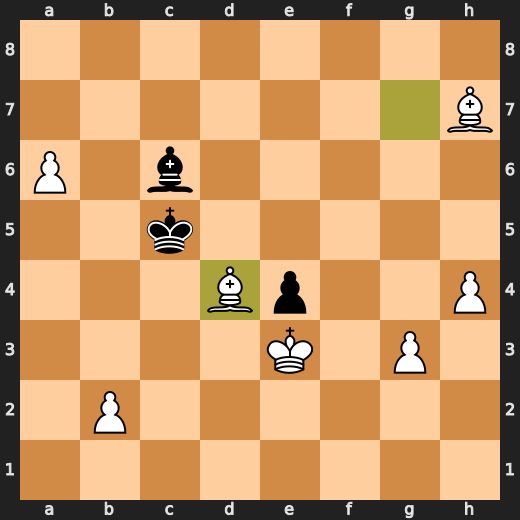

### 💀 Blunder: 43. Kb4 by CPU (Black)

CPU played Kb4 at move 43 because they're a fucking idiot. Stockfish preferred Kb5, but who cares? The CPU lost 921 centipawns in one move. It's like they were playing chess with their eyes closed and hoping for the best. They overreached and failed to punish it, so White finally decided the game by checkmating them with Qf7#.

- **Eval:** +61.83 → +71.04
- **Preferred:** `Kb5`
- **Loss:** 921 cp

**Before 43. Kb4**

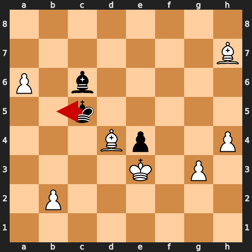

**After 43. Kb4**

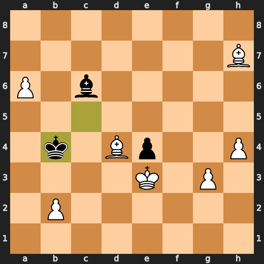

### 💀 Blunder: 44. Ka5 by CPU (Black)

CPU (Black) played a blunder with Ka5 at move 44. This move led to a major eval loss of 92173 centipawns and put White in a position to deliver mate. The preferred move for Black was Bxe4, but CPU decided to play Ka5 instead. This overreach by CPU allowed White to capitalize on the mistake and eventually win the game.

- **Eval:** +78.27 → White has mate
- **Preferred:** `Bxe4`
- **Loss:** 92173 cp

**Before 44. Ka5**

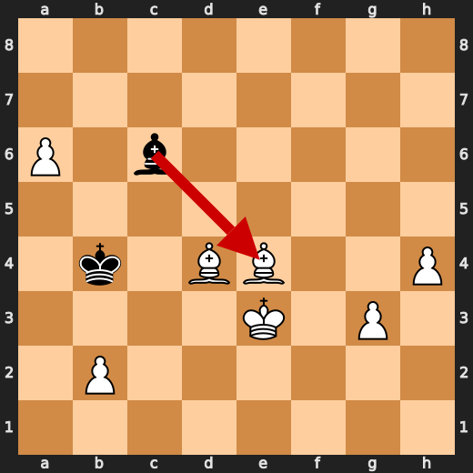

**After 44. Ka5**

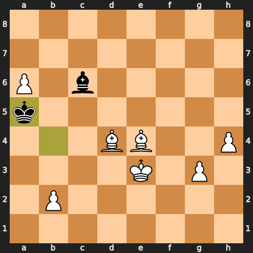

### 💀 Blunder: 45. a7 by You (White)

You played a7? What the hell were you thinking? You're giving Black a free pawn and losing your own piece in one move. Stockfish would have preferred Bxc6, but even that wouldn't save you from your stupidity. The centipawn loss is over 92,000 points. You're lucky the game didn't end right there. But no, you had to go and make things worse for yourself. And now you've lost mate.

- **Eval:** White has mate → +79.18
- **Preferred:** `Bxc6`
- **Loss:** 92082 cp

**Before 45. a7**

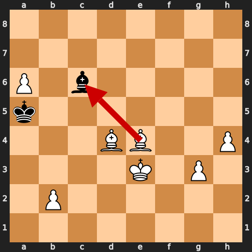

**After 45. a7**


---

## Human Notes

Biggest caveman lesson: CPU (Black) blew it with **41. Bc6**.

There was another real screw-up at **15. d4** by **CPU (Black)**.

---

<details>
<summary>Compact move list</summary>

- 📖 **1. e4** (You (White), Book) — +0.46 → +0.23, preferred `d4`, loss 23 cp
- 📖 **1. e5** (CPU (Black), Book) — +0.37 → +0.35, preferred `e5`, loss 0 cp
- 📖 **2. d4** (You (White), Book) — +0.47 → -0.40, preferred `Nf3`, loss 87 cp
- ⚠️ **2. Qh4** (CPU (Black), Inaccuracy) — -0.29 → +1.22, preferred `exd4`, loss 151 cp
- 📖 **3. Nc3** (You (White), Book) — +1.53 → +0.92, preferred `Nf3`, loss 61 cp
- ⚠️ **3. exd4** (CPU (Black), Inaccuracy) — +0.54 → +1.87, preferred `Bb4`, loss 133 cp
- 👍 **4. Qxd4** (You (White), Good) — +2.00 → +0.87, preferred `Nf3`, loss 113 cp
- 🔥 **4. Nc6** (CPU (Black), Great) — +0.98 → +1.25, preferred `Nc6`, loss 27 cp
- 👍 **5. Qa4** (You (White), Good) — +1.02 → +0.36, preferred `Qe3`, loss 66 cp
- 👍 **5. Bb4** (CPU (Black), Good) — +0.48 → +1.07, preferred `Bc5`, loss 59 cp
- ✅ **6. Bd2** (You (White), Best) — +1.23 → +1.34, preferred `Bd2`, loss 0 cp
- ✅ **6. Bxc3** (CPU (Black), Best) — +1.25 → +1.10, preferred `Bxc3`, loss 0 cp
- ✅ **7. Bxc3** (You (White), Best) — +1.10 → +1.21, preferred `Bxc3`, loss 0 cp
- 🔥 **7. Nf6** (CPU (Black), Great) — +1.08 → +1.30, preferred `Nf6`, loss 22 cp
- 👍 **8. Nf3** (You (White), Good) — +1.35 → +0.44, preferred `O-O-O`, loss 91 cp
- 🔥 **8. Qxe4+** (CPU (Black), Great) — +0.50 → +0.86, preferred `Qxe4+`, loss 36 cp
- 🔥 **9. Qxe4+** (You (White), Great) — +0.92 → +0.55, preferred `Qxe4+`, loss 37 cp
- ✅ **9. Nxe4** (CPU (Black), Best) — +0.54 → +0.73, preferred `Nxe4`, loss 19 cp
- ✅ **10. Bxg7** (You (White), Best) — +0.84 → +0.81, preferred `Bxg7`, loss 3 cp
- ✅ **10. Rg8** (CPU (Black), Best) — +0.64 → +0.79, preferred `Rg8`, loss 15 cp
- 🔥 **11. Bh6** (You (White), Great) — +0.93 → +0.66, preferred `Bh6`, loss 27 cp
- ✅ **11. d6** (CPU (Black), Best) — +0.73 → +0.74, preferred `a5`, loss 1 cp
- ✅ **12. a3** (You (White), Best) — +0.86 → +0.84, preferred `g3`, loss 2 cp
- 🔥 **12. Be6** (CPU (Black), Great) — +0.54 → +0.84, preferred `Be6`, loss 30 cp
- 🔥 **13. Be3** (You (White), Great) — +0.85 → +0.57, preferred `g3`, loss 28 cp
- ✅ **13. O-O-O** (CPU (Black), Best) — +0.62 → +0.54, preferred `Nf6`, loss 0 cp
- 🔥 **14. O-O-O** (You (White), Great) — +0.68 → +0.51, preferred `Nd4`, loss 17 cp
- 🔥 **14. d5** (CPU (Black), Great) — +0.44 → +0.76, preferred `Bd7`, loss 32 cp
- 👍 **15. g3** (You (White), Good) — +0.83 → +0.25, preferred `Rg1`, loss 58 cp
- ❌ **15. d4** (CPU (Black), Mistake) — +0.24 → +3.69, preferred `Bg4`, loss 345 cp
- ⚠️ **16. Nxd4** (You (White), Inaccuracy) — +4.57 → +3.28, preferred `Nxd4`, loss 129 cp
- 👍 **16. Nxd4** (CPU (Black), Good) — +4.00 → +4.63, preferred `Bg4`, loss 63 cp
- ✅ **17. Rxd4** (You (White), Best) — +4.61 → +4.63, preferred `Rxd4`, loss 0 cp
- ✅ **17. Rxd4** (CPU (Black), Best) — +4.62 → +4.56, preferred `Rxd4`, loss 0 cp
- ✅ **18. Bxd4** (You (White), Best) — +4.36 → +4.44, preferred `Bxd4`, loss 0 cp
- 🔥 **18. Rd8** (CPU (Black), Great) — +4.48 → +4.71, preferred `Rd8`, loss 23 cp
- ⚠️ **19. Bxa7** (You (White), Inaccuracy) — +4.75 → +3.14, preferred `Be3`, loss 161 cp
- ⚠️ **19. Nf6** (CPU (Black), Inaccuracy) — +2.91 → +5.31, preferred `b6`, loss 240 cp
- 🔥 **20. Bc5** (You (White), Great) — +5.60 → +5.36, preferred `Be3`, loss 24 cp
- ⚠️ **20. Ne4** (CPU (Black), Inaccuracy) — +5.23 → +6.69, preferred `Rd5`, loss 146 cp
- ✅ **21. Be3** (You (White), Best) — +6.48 → +6.47, preferred `Be3`, loss 1 cp
- 👍 **21. Rd7** (CPU (Black), Good) — +6.61 → +7.33, preferred `Bg4`, loss 72 cp
- 👍 **22. f3** (You (White), Good) — +7.22 → +6.62, preferred `Rg1`, loss 60 cp
- ✅ **22. Nd6** (CPU (Black), Best) — +6.61 → +6.40, preferred `Nd6`, loss 0 cp
- 🔥 **23. h4** (You (White), Great) — +6.75 → +6.38, preferred `Be2`, loss 37 cp
- ✅ **23. Bd5** (CPU (Black), Best) — +6.30 → +6.30, preferred `Rd8`, loss 0 cp
- 🔥 **24. Bg2** (You (White), Great) — +6.63 → +6.26, preferred `Bg2`, loss 37 cp
- 👍 **24. Nf5** (CPU (Black), Good) — +6.31 → +7.00, preferred `Rd8`, loss 69 cp
- 👍 **25. Bf2** (You (White), Good) — +7.12 → +6.61, preferred `Bf2`, loss 51 cp
- ⚠️ **25. f6** (CPU (Black), Inaccuracy) — +6.62 → +7.87, preferred `Nd6`, loss 125 cp
- ✅ **26. Bh3** (You (White), Best) — +7.35 → +7.33, preferred `Bh3`, loss 2 cp
- ✅ **26. Bxf3** (CPU (Black), Best) — +7.35 → +7.29, preferred `Bxf3`, loss 0 cp
- ✅ **27. Re1** (You (White), Best) — +7.39 → +7.24, preferred `Re1`, loss 15 cp
- ⚠️ **27. Rd5** (CPU (Black), Inaccuracy) — +7.11 → +9.28, preferred `Nd6`, loss 217 cp
- ✅ **28. c4** (You (White), Best) — +9.13 → +9.10, preferred `c4`, loss 3 cp
- 🔥 **28. Re5** (CPU (Black), Great) — +8.76 → +9.17, preferred `Kd8`, loss 41 cp
- ✅ **29. Rxe5** (You (White), Best) — +9.07 → +9.04, preferred `Rxe5`, loss 3 cp
- ✅ **29. fxe5** (CPU (Black), Best) — +9.15 → +9.26, preferred `fxe5`, loss 11 cp
- ✅ **30. Bxf5+** (You (White), Best) — +9.26 → +9.21, preferred `Bxf5+`, loss 5 cp
- ✅ **30. Kd8** (CPU (Black), Best) — +9.28 → +9.23, preferred `Kd8`, loss 0 cp
- ✅ **31. Bxh7** (You (White), Best) — +9.44 → +9.53, preferred `Bxh7`, loss 0 cp
- 👍 **31. b6** (CPU (Black), Good) — +9.23 → +10.30, preferred `Ke7`, loss 107 cp
- 👍 **32. Kd2** (You (White), Good) — +10.35 → +9.53, preferred `Bf5`, loss 82 cp
- 🔥 **32. Bg4** (CPU (Black), Great) — +9.65 → +9.82, preferred `Bg4`, loss 17 cp
- ✅ **33. c5** (You (White), Best) — +9.74 → +9.69, preferred `Kd3`, loss 5 cp
- ✅ **33. Kd7** (CPU (Black), Best) — +9.34 → +9.30, preferred `Bh5`, loss 0 cp
- ✅ **34. cxb6** (You (White), Best) — +9.84 → +9.69, preferred `Be4`, loss 15 cp
- ✅ **34. cxb6** (CPU (Black), Best) — +9.77 → +9.77, preferred `cxb6`, loss 0 cp
- ✅ **35. Bxb6** (You (White), Best) — +9.81 → +10.07, preferred `Bxb6`, loss 0 cp
- 🔥 **35. Kc6** (CPU (Black), Great) — +9.94 → +10.12, preferred `Kc6`, loss 18 cp
- 🔥 **36. Bd8** (You (White), Great) — +10.07 → +9.77, preferred `Ba5`, loss 30 cp
- ✅ **36. Kd7** (CPU (Black), Best) — +10.07 → +10.00, preferred `Kd7`, loss 0 cp
- ✅ **37. Bf6** (You (White), Best) — +10.13 → +10.20, preferred `Bg5`, loss 0 cp
- 🔥 **37. Ke6** (CPU (Black), Great) — +10.40 → +10.61, preferred `Ke6`, loss 21 cp
- ✅ **38. Bg7** (You (White), Best) — +10.61 → +10.78, preferred `Bg5`, loss 0 cp
- ✅ **38. Kd5** (CPU (Black), Best) — +13.75 → +13.77, preferred `e4`, loss 2 cp
- ✅ **39. a4** (You (White), Best) — +13.95 → +15.53, preferred `Ke3`, loss 0 cp
- ⚠️ **39. Bd7** (CPU (Black), Inaccuracy) — +13.93 → +15.61, preferred `Ke6`, loss 168 cp
- 🔥 **40. a5** (You (White), Great) — +15.45 → +15.15, preferred `Ke3`, loss 30 cp
- ❌ **40. e4** (CPU (Black), Mistake) — +11.00 → +16.42, preferred `Bh3`, loss 542 cp
- ✅ **41. a6** (You (White), Best) — +16.48 → +19.05, preferred `a6`, loss 0 cp
- 💀 **41. Bc6** (CPU (Black), Blunder) — +26.33 → +55.69, preferred `Bc6`, loss 2936 cp
- 👍 **42. Ke3** (You (White), Good) — +56.80 → +55.69, preferred `a7`, loss 111 cp
- ⚠️ **42. Kc5** (CPU (Black), Inaccuracy) — +56.82 → +58.66, preferred `Kd6`, loss 184 cp
- 💀 **43. Bd4+** (You (White), Blunder) — +66.14 → +58.98, preferred `a7`, loss 716 cp
- 💀 **43. Kb4** (CPU (Black), Blunder) — +61.83 → +71.04, preferred `Kb5`, loss 921 cp
- ✅ **44. Bxe4** (You (White), Best) — +71.82 → +78.27, preferred `Bxe4`, loss 0 cp
- 💀 **44. Ka5** (CPU (Black), Blunder) — +78.27 → White has mate, preferred `Bxe4`, loss 92173 cp
- 💀 **45. a7** (You (White), Blunder) — White has mate → +79.18, preferred `Bxc6`, loss 92082 cp

</details>

---

<details>
<summary>Raw engine table</summary>

| Ply | Move | Actor | Played | Label | Eval Before | Eval After | Preferred | Loss |
|---:|---:|---|---|---|---:|---:|---|---:|
| 1 | 1 | You (White) | e4 | Book | +0.46 | +0.23 | d4 | 23 |
| 2 | 1 | CPU (Black) | e5 | Book | +0.37 | +0.35 | e5 | 0 |
| 3 | 2 | You (White) | d4 | Book | +0.47 | -0.40 | Nf3 | 87 |
| 4 | 2 | CPU (Black) | Qh4 | Inaccuracy | -0.29 | +1.22 | exd4 | 151 |
| 5 | 3 | You (White) | Nc3 | Book | +1.53 | +0.92 | Nf3 | 61 |
| 6 | 3 | CPU (Black) | exd4 | Inaccuracy | +0.54 | +1.87 | Bb4 | 133 |
| 7 | 4 | You (White) | Qxd4 | Good | +2.00 | +0.87 | Nf3 | 113 |
| 8 | 4 | CPU (Black) | Nc6 | Great | +0.98 | +1.25 | Nc6 | 27 |
| 9 | 5 | You (White) | Qa4 | Good | +1.02 | +0.36 | Qe3 | 66 |
| 10 | 5 | CPU (Black) | Bb4 | Good | +0.48 | +1.07 | Bc5 | 59 |
| 11 | 6 | You (White) | Bd2 | Best | +1.23 | +1.34 | Bd2 | 0 |
| 12 | 6 | CPU (Black) | Bxc3 | Best | +1.25 | +1.10 | Bxc3 | 0 |
| 13 | 7 | You (White) | Bxc3 | Best | +1.10 | +1.21 | Bxc3 | 0 |
| 14 | 7 | CPU (Black) | Nf6 | Great | +1.08 | +1.30 | Nf6 | 22 |
| 15 | 8 | You (White) | Nf3 | Good | +1.35 | +0.44 | O-O-O | 91 |
| 16 | 8 | CPU (Black) | Qxe4+ | Great | +0.50 | +0.86 | Qxe4+ | 36 |
| 17 | 9 | You (White) | Qxe4+ | Great | +0.92 | +0.55 | Qxe4+ | 37 |
| 18 | 9 | CPU (Black) | Nxe4 | Best | +0.54 | +0.73 | Nxe4 | 19 |
| 19 | 10 | You (White) | Bxg7 | Best | +0.84 | +0.81 | Bxg7 | 3 |
| 20 | 10 | CPU (Black) | Rg8 | Best | +0.64 | +0.79 | Rg8 | 15 |
| 21 | 11 | You (White) | Bh6 | Great | +0.93 | +0.66 | Bh6 | 27 |
| 22 | 11 | CPU (Black) | d6 | Best | +0.73 | +0.74 | a5 | 1 |
| 23 | 12 | You (White) | a3 | Best | +0.86 | +0.84 | g3 | 2 |
| 24 | 12 | CPU (Black) | Be6 | Great | +0.54 | +0.84 | Be6 | 30 |
| 25 | 13 | You (White) | Be3 | Great | +0.85 | +0.57 | g3 | 28 |
| 26 | 13 | CPU (Black) | O-O-O | Best | +0.62 | +0.54 | Nf6 | 0 |
| 27 | 14 | You (White) | O-O-O | Great | +0.68 | +0.51 | Nd4 | 17 |
| 28 | 14 | CPU (Black) | d5 | Great | +0.44 | +0.76 | Bd7 | 32 |
| 29 | 15 | You (White) | g3 | Good | +0.83 | +0.25 | Rg1 | 58 |
| 30 | 15 | CPU (Black) | d4 | Mistake | +0.24 | +3.69 | Bg4 | 345 |
| 31 | 16 | You (White) | Nxd4 | Inaccuracy | +4.57 | +3.28 | Nxd4 | 129 |
| 32 | 16 | CPU (Black) | Nxd4 | Good | +4.00 | +4.63 | Bg4 | 63 |
| 33 | 17 | You (White) | Rxd4 | Best | +4.61 | +4.63 | Rxd4 | 0 |
| 34 | 17 | CPU (Black) | Rxd4 | Best | +4.62 | +4.56 | Rxd4 | 0 |
| 35 | 18 | You (White) | Bxd4 | Best | +4.36 | +4.44 | Bxd4 | 0 |
| 36 | 18 | CPU (Black) | Rd8 | Great | +4.48 | +4.71 | Rd8 | 23 |
| 37 | 19 | You (White) | Bxa7 | Inaccuracy | +4.75 | +3.14 | Be3 | 161 |
| 38 | 19 | CPU (Black) | Nf6 | Inaccuracy | +2.91 | +5.31 | b6 | 240 |
| 39 | 20 | You (White) | Bc5 | Great | +5.60 | +5.36 | Be3 | 24 |
| 40 | 20 | CPU (Black) | Ne4 | Inaccuracy | +5.23 | +6.69 | Rd5 | 146 |
| 41 | 21 | You (White) | Be3 | Best | +6.48 | +6.47 | Be3 | 1 |
| 42 | 21 | CPU (Black) | Rd7 | Good | +6.61 | +7.33 | Bg4 | 72 |
| 43 | 22 | You (White) | f3 | Good | +7.22 | +6.62 | Rg1 | 60 |
| 44 | 22 | CPU (Black) | Nd6 | Best | +6.61 | +6.40 | Nd6 | 0 |
| 45 | 23 | You (White) | h4 | Great | +6.75 | +6.38 | Be2 | 37 |
| 46 | 23 | CPU (Black) | Bd5 | Best | +6.30 | +6.30 | Rd8 | 0 |
| 47 | 24 | You (White) | Bg2 | Great | +6.63 | +6.26 | Bg2 | 37 |
| 48 | 24 | CPU (Black) | Nf5 | Good | +6.31 | +7.00 | Rd8 | 69 |
| 49 | 25 | You (White) | Bf2 | Good | +7.12 | +6.61 | Bf2 | 51 |
| 50 | 25 | CPU (Black) | f6 | Inaccuracy | +6.62 | +7.87 | Nd6 | 125 |
| 51 | 26 | You (White) | Bh3 | Best | +7.35 | +7.33 | Bh3 | 2 |
| 52 | 26 | CPU (Black) | Bxf3 | Best | +7.35 | +7.29 | Bxf3 | 0 |
| 53 | 27 | You (White) | Re1 | Best | +7.39 | +7.24 | Re1 | 15 |
| 54 | 27 | CPU (Black) | Rd5 | Inaccuracy | +7.11 | +9.28 | Nd6 | 217 |
| 55 | 28 | You (White) | c4 | Best | +9.13 | +9.10 | c4 | 3 |
| 56 | 28 | CPU (Black) | Re5 | Great | +8.76 | +9.17 | Kd8 | 41 |
| 57 | 29 | You (White) | Rxe5 | Best | +9.07 | +9.04 | Rxe5 | 3 |
| 58 | 29 | CPU (Black) | fxe5 | Best | +9.15 | +9.26 | fxe5 | 11 |
| 59 | 30 | You (White) | Bxf5+ | Best | +9.26 | +9.21 | Bxf5+ | 5 |
| 60 | 30 | CPU (Black) | Kd8 | Best | +9.28 | +9.23 | Kd8 | 0 |
| 61 | 31 | You (White) | Bxh7 | Best | +9.44 | +9.53 | Bxh7 | 0 |
| 62 | 31 | CPU (Black) | b6 | Good | +9.23 | +10.30 | Ke7 | 107 |
| 63 | 32 | You (White) | Kd2 | Good | +10.35 | +9.53 | Bf5 | 82 |
| 64 | 32 | CPU (Black) | Bg4 | Great | +9.65 | +9.82 | Bg4 | 17 |
| 65 | 33 | You (White) | c5 | Best | +9.74 | +9.69 | Kd3 | 5 |
| 66 | 33 | CPU (Black) | Kd7 | Best | +9.34 | +9.30 | Bh5 | 0 |
| 67 | 34 | You (White) | cxb6 | Best | +9.84 | +9.69 | Be4 | 15 |
| 68 | 34 | CPU (Black) | cxb6 | Best | +9.77 | +9.77 | cxb6 | 0 |
| 69 | 35 | You (White) | Bxb6 | Best | +9.81 | +10.07 | Bxb6 | 0 |
| 70 | 35 | CPU (Black) | Kc6 | Great | +9.94 | +10.12 | Kc6 | 18 |
| 71 | 36 | You (White) | Bd8 | Great | +10.07 | +9.77 | Ba5 | 30 |
| 72 | 36 | CPU (Black) | Kd7 | Best | +10.07 | +10.00 | Kd7 | 0 |
| 73 | 37 | You (White) | Bf6 | Best | +10.13 | +10.20 | Bg5 | 0 |
| 74 | 37 | CPU (Black) | Ke6 | Great | +10.40 | +10.61 | Ke6 | 21 |
| 75 | 38 | You (White) | Bg7 | Best | +10.61 | +10.78 | Bg5 | 0 |
| 76 | 38 | CPU (Black) | Kd5 | Best | +13.75 | +13.77 | e4 | 2 |
| 77 | 39 | You (White) | a4 | Best | +13.95 | +15.53 | Ke3 | 0 |
| 78 | 39 | CPU (Black) | Bd7 | Inaccuracy | +13.93 | +15.61 | Ke6 | 168 |
| 79 | 40 | You (White) | a5 | Great | +15.45 | +15.15 | Ke3 | 30 |
| 80 | 40 | CPU (Black) | e4 | Mistake | +11.00 | +16.42 | Bh3 | 542 |
| 81 | 41 | You (White) | a6 | Best | +16.48 | +19.05 | a6 | 0 |
| 82 | 41 | CPU (Black) | Bc6 | Blunder | +26.33 | +55.69 | Bc6 | 2936 |
| 83 | 42 | You (White) | Ke3 | Good | +56.80 | +55.69 | a7 | 111 |
| 84 | 42 | CPU (Black) | Kc5 | Inaccuracy | +56.82 | +58.66 | Kd6 | 184 |
| 85 | 43 | You (White) | Bd4+ | Blunder | +66.14 | +58.98 | a7 | 716 |
| 86 | 43 | CPU (Black) | Kb4 | Blunder | +61.83 | +71.04 | Kb5 | 921 |
| 87 | 44 | You (White) | Bxe4 | Best | +71.82 | +78.27 | Bxe4 | 0 |
| 88 | 44 | CPU (Black) | Ka5 | Blunder | +78.27 | White has mate | Bxe4 | 92173 |
| 89 | 45 | You (White) | a7 | Blunder | White has mate | +79.18 | Bxc6 | 92082 |

</details>

---

<details>
<summary>Clean PGN</summary>

```pgn
[Event "AI Factory's Chess"]
[Site "Android Device"]
[Date "2026.05.15"]
[Round "1"]
[White "You"]
[Black "CPU (5)"]
[Result "1-0"]
[PlyCount "91"]

1. e4 e5 2. d4 Qh4 3. Nc3 exd4 4. Qxd4 Nc6 5. Qa4 Bb4 6. Bd2 Bxc3 7. Bxc3 Nf6
8. Nf3 Qxe4+ 9. Qxe4+ Nxe4 10. Bxg7 Rg8 11. Bh6 d6 12. a3 Be6 13. Be3 O-O-O 14.
O-O-O d5 15. g3 d4 16. Nxd4 Nxd4 17. Rxd4 Rxd4 18. Bxd4 Rd8 19. Bxa7 Nf6 20.
Bc5 Ne4 21. Be3 Rd7 22. f3 Nd6 23. h4 Bd5 24. Bg2 Nf5 25. Bf2 f6 26. Bh3 Bxf3
27. Re1 Rd5 28. c4 Re5 29. Rxe5 fxe5 30. Bxf5+ Kd8 31. Bxh7 b6 32. Kd2 Bg4 33.
c5 Kd7 34. cxb6 cxb6 35. Bxb6 Kc6 36. Bd8 Kd7 37. Bf6 Ke6 38. Bg7 Kd5 39. a4
Bd7 40. a5 e4 41. a6 Bc6 42. Ke3 Kc5 43. Bd4+ Kb4 44. Bxe4 Ka5 45. a7 1-0
```

</details>
