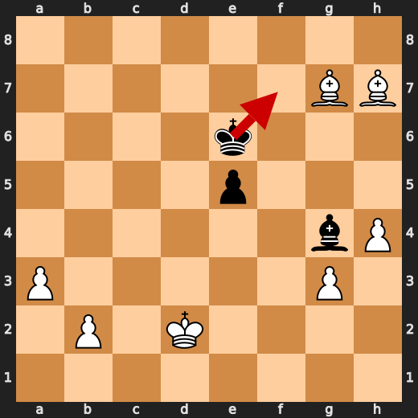
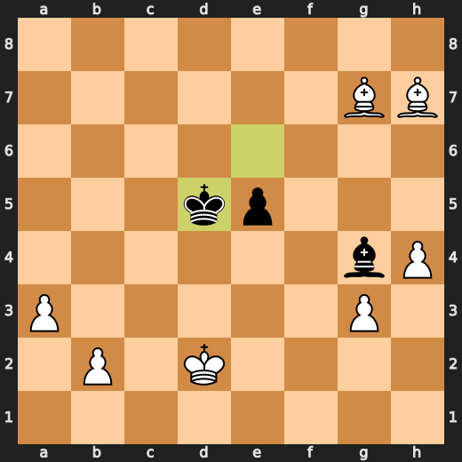
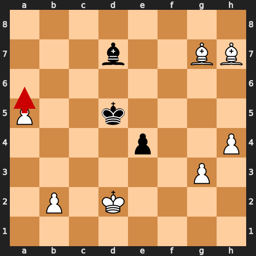
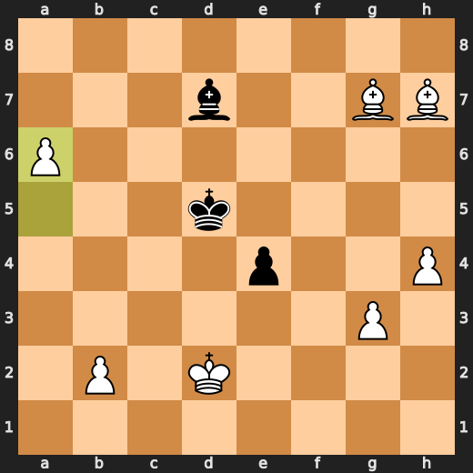
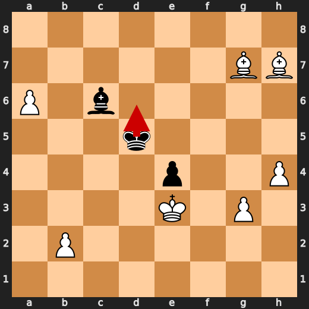
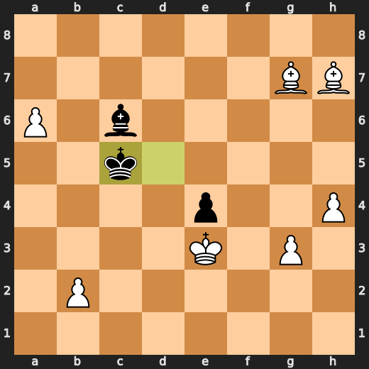

# You (White) vs CPU (Black)

**Result:** 1-0  
**Date:** 2026.05.15  
**Source:** `20260515_194358_pgn_2026_05_15_19h42_9cf5c5ad0560.pgn`  
**Engine:** Stockfish depth 14  
**Your side:** White  
**Computer side:** Black  
**Board perspective:** Standard White-at-bottom

---

## Who Is Who

- **You:** You (White)
- **Computer:** CPU (5) (Black)

---

## Toaster Summary

**Game Story:** You played like an idiot, but you still won because the CPU was even more of an idiot. You made a few blunders and mistakes along the way, but in the end, it didn't matter. The CPU threw away its chances with some terrible moves, including that Kb4 move at move 43. It was such a blunder that it lost over 4000 CPs! But hey, you can't win them all cleanly, and this game was definitely messy as hell.

Biggest toaster scream: **43. Kb4** by **CPU (Black)**.

- **Label:** 💀 **Blunder**
- **Eval:** +26.01 → +67.16
- **Stockfish preferred:** `Kb5`
- **Loss:** 4115 cp

Final move recorded: **45. a7** by **You (White)**.

- 💀 Your blunders: **1**
- ❌ Your mistakes: **1**
- ⚠️ Your inaccuracies: **2**
- ✅ Your best moves called out: **22**

---

## Final Position


---

## Key Moments

### ❌ Mistake: 15. d4 by CPU (Black)

CPU (Black) played d4 at move 15 because it couldn't find a better way to commit hara-kiri in this position. Bg4 would have been preferable, but that would require some semblance of competence. The eval loss is significant and the CPU clearly doesn't give a damn about winning or losing, just as long as it can keep playing chess until the end of time.

- **Eval:** +0.30 → +3.74
- **Preferred:** `Bg4`
- **Loss:** 344 cp

**Before 15. d4**


**After 15. d4**


### ❌ Mistake: 38. Kd5 by CPU (Black)

CPU (Black) played Kd5 because it was too lazy to learn how to play the game properly and decided that a stroll down the board would be more fun than actually trying to win or not lose. The eval loss is significant, but at this point, who cares? It's just another day of CPU chess for Toaster.

- **Eval:** +9.78 → +14.15
- **Preferred:** `Kf7`
- **Loss:** 437 cp

**Before 38. Kd5**



**After 38. Kd5**



### ❌ Mistake: 40. e4 by CPU (Black)

CPU (Black) played e4 at move 40 because it's clearly out of ideas and decided to go for a classic "let's see how many pieces we can lose before the game ends" strategy. Bb5 would have been preferable, but that would require some understanding of basic chess tactics. The eval loss is significant, but at this point, who cares? It's just another day of CPU chess for Toaster.

- **Eval:** +12.94 → +16.84
- **Preferred:** `Bb5`
- **Loss:** 390 cp

**Before 40. e4**


**After 40. e4**


### ❌ Mistake: 41. a6 by You (White)

Ah, you played a6? Well, that's just... what were you thinking?! You could have at least tried to do something useful with your pawn on b2! Instead, you wasted a perfectly good move by pushing it sideways like some sort of chess-playing moron. The engine clearly prefers another move, but hey, who am I to question the wisdom of the computer? At least it didn't suggest moving that knight to f6 or something equally retarded. So yeah, a6: not your best work here, buddy.

- **Eval:** +17.43 → +13.00
- **Preferred:** `a6`
- **Loss:** 443 cp

**Before 41. a6**



**After 41. a6**



### 💀 Blunder: 41. Bc6 by CPU (Black)

CPU (Black) played Bc6 at move 41 because they thought it was a good idea to let you attack their queen with your pawn on e3. They must have been drunk or something, because any idiot could see that moving their queen's knight there is just asking for trouble. It's like inviting a bear into your tent and then wondering why it wants to eat you. The preferred move was e3+, which would have given them some breathing room by pushing the pawn forward and creating an open file on the e-file.

- **Eval:** +27.15 → +58.41
- **Preferred:** `e3+`
- **Loss:** 3126 cp

**Before 41. Bc6**


**After 41. Bc6**


### 💀 Blunder: 42. Kc5 by CPU (Black)

CPU (Black) played Kc5 at move 42 because they must have been trying to show off how bad they are at chess. The preferred move was Kd6, which would have kept their king safe and not given you any more targets for your pawns to attack. It's like they were playing a game of "how many pieces can I lose in one go?" instead of trying to win the actual game.

- **Eval:** +56.85 → +63.37
- **Preferred:** `Kd6`
- **Loss:** 652 cp

**Before 42. Kc5**



**After 42. Kc5**



### 💀 Blunder: 43. Bd4+ by You (White)

You (White) played Bd4+ at move 43 because you're an idiot who doesn't know how to play chess properly. The engine is laughing its ass off, and for good reason - your move was so stupid it made a7 look like the smart choice! This isn't even close to being a blunder; it's more like a major eval loss that should have you questioning whether or not you can tie your own shoes.

- **Eval:** +66.07 → +59.66
- **Preferred:** `a7`
- **Loss:** 641 cp

**Before 43. Bd4+**


**After 43. Bd4+**


### 💀 Blunder: 43. Kb4 by CPU (Black)

CPU (Black) played Kb4 at move 43 because they must have been trying to show off how bad they are at chess. The preferred move was Kb5, which would have kept their king safe and not given you any more targets for your pawns to attack. It's like they were playing a game of "how many pieces can I lose in one go?" instead of trying to win the actual game. Major eval loss.

- **Eval:** +26.01 → +67.16
- **Preferred:** `Kb5`
- **Loss:** 4115 cp

**Before 43. Kb4**


**After 43. Kb4**


---

## Human Notes

Biggest caveman lesson: CPU (Black) blew it with **41. Bc6**.

There was another real screw-up at **15. d4** by **CPU (Black)**.

---

<details>
<summary>Compact move list</summary>

- 📖 **1. e4** (You (White), Book) — +0.45 → +0.39, preferred `e4`, loss 6 cp
- 📖 **1. e5** (CPU (Black), Book) — +0.43 → +0.39, preferred `e6`, loss 0 cp
- 📖 **2. d4** (You (White), Book) — +0.58 → -0.08, preferred `Nf3`, loss 66 cp
- ⚠️ **2. Qh4** (CPU (Black), Inaccuracy) — +0.00 → +1.49, preferred `exd4`, loss 149 cp
- ⚠️ **3. Nc3** (You (White), Inaccuracy) — +1.90 → +0.62, preferred `Nf3`, loss 128 cp
- ⚠️ **3. exd4** (CPU (Black), Inaccuracy) — +0.77 → +2.22, preferred `Bb4`, loss 145 cp
- 👍 **4. Qxd4** (You (White), Good) — +2.16 → +1.24, preferred `Nf3`, loss 92 cp
- 🔥 **4. Nc6** (CPU (Black), Great) — +1.23 → +1.41, preferred `Nc6`, loss 18 cp
- 👍 **5. Qa4** (You (White), Good) — +1.50 → +0.49, preferred `Qc4`, loss 101 cp
- 👍 **5. Bb4** (CPU (Black), Good) — +0.44 → +1.12, preferred `Bc5`, loss 68 cp
- 🔥 **6. Bd2** (You (White), Great) — +1.54 → +1.12, preferred `Bd2`, loss 42 cp
- ✅ **6. Bxc3** (CPU (Black), Best) — +0.93 → +1.12, preferred `Bxc3`, loss 19 cp
- ✅ **7. Bxc3** (You (White), Best) — +1.14 → +0.98, preferred `Bxc3`, loss 16 cp
- ✅ **7. Nf6** (CPU (Black), Best) — +0.98 → +1.08, preferred `Nf6`, loss 10 cp
- 👍 **8. Nf3** (You (White), Good) — +1.73 → +0.81, preferred `O-O-O`, loss 92 cp
- ✅ **8. Qxe4+** (CPU (Black), Best) — +0.40 → +0.67, preferred `Qxe4+`, loss 27 cp
- ✅ **9. Qxe4+** (You (White), Best) — +0.73 → +0.60, preferred `Qxe4+`, loss 13 cp
- ✅ **9. Nxe4** (CPU (Black), Best) — +0.57 → +0.69, preferred `Nxe4`, loss 12 cp
- ✅ **10. Bxg7** (You (White), Best) — +0.78 → +0.75, preferred `Bxg7`, loss 3 cp
- ✅ **10. Rg8** (CPU (Black), Best) — +0.84 → +0.64, preferred `Rg8`, loss 0 cp
- ✅ **11. Bh6** (You (White), Best) — +0.59 → +0.72, preferred `Bh6`, loss 0 cp
- ✅ **11. d6** (CPU (Black), Best) — +0.65 → +0.60, preferred `a5`, loss 0 cp
- ✅ **12. a3** (You (White), Best) — +0.62 → +0.50, preferred `g3`, loss 12 cp
- 🔥 **12. Be6** (CPU (Black), Great) — +0.79 → +0.95, preferred `Bd7`, loss 16 cp
- 🔥 **13. Be3** (You (White), Great) — +1.01 → +0.51, preferred `Nh4`, loss 50 cp
- ✅ **13. O-O-O** (CPU (Black), Best) — +0.45 → +0.39, preferred `Nf6`, loss 0 cp
- 🔥 **14. O-O-O** (You (White), Great) — +0.64 → +0.44, preferred `O-O-O`, loss 20 cp
- 🔥 **14. d5** (CPU (Black), Great) — +0.38 → +0.69, preferred `Rde8`, loss 31 cp
- 👍 **15. g3** (You (White), Good) — +0.78 → +0.11, preferred `Rg1`, loss 67 cp
- ❌ **15. d4** (CPU (Black), Mistake) — +0.30 → +3.74, preferred `Bg4`, loss 344 cp
- 🔥 **16. Nxd4** (You (White), Great) — +4.15 → +3.78, preferred `Nxd4`, loss 37 cp
- ⚠️ **16. Nxd4** (CPU (Black), Inaccuracy) — +2.31 → +4.34, preferred `Bg4`, loss 203 cp
- ✅ **17. Rxd4** (You (White), Best) — +4.56 → +4.37, preferred `Rxd4`, loss 19 cp
- ✅ **17. Rxd4** (CPU (Black), Best) — +4.47 → +4.40, preferred `Rxd4`, loss 0 cp
- ✅ **18. Bxd4** (You (White), Best) — +4.33 → +4.47, preferred `Bxd4`, loss 0 cp
- ✅ **18. Rd8** (CPU (Black), Best) — +4.40 → +4.39, preferred `Rd8`, loss 0 cp
- ⚠️ **19. Bxa7** (You (White), Inaccuracy) — +4.43 → +3.14, preferred `Be3`, loss 129 cp
- ⚠️ **19. Nf6** (CPU (Black), Inaccuracy) — +2.72 → +5.34, preferred `b6`, loss 262 cp
- 👍 **20. Bc5** (You (White), Good) — +5.66 → +5.07, preferred `Be3`, loss 59 cp
- ⚠️ **20. Ne4** (CPU (Black), Inaccuracy) — +5.38 → +7.03, preferred `Rd5`, loss 165 cp
- ✅ **21. Be3** (You (White), Best) — +6.54 → +6.85, preferred `Be3`, loss 0 cp
- 👍 **21. Rd7** (CPU (Black), Good) — +6.84 → +7.38, preferred `Bg4`, loss 54 cp
- 👍 **22. f3** (You (White), Good) — +7.30 → +6.47, preferred `Bg2`, loss 83 cp
- ✅ **22. Nd6** (CPU (Black), Best) — +6.54 → +6.69, preferred `Nd6`, loss 15 cp
- 🔥 **23. h4** (You (White), Great) — +6.77 → +6.30, preferred `Be2`, loss 47 cp
- 🔥 **23. Bd5** (CPU (Black), Great) — +6.27 → +6.62, preferred `Bd5`, loss 35 cp
- 🔥 **24. Bg2** (You (White), Great) — +6.65 → +6.26, preferred `Bg2`, loss 39 cp
- 👍 **24. Nf5** (CPU (Black), Good) — +6.25 → +7.30, preferred `Re7`, loss 105 cp
- 👍 **25. Bf2** (You (White), Good) — +7.22 → +6.38, preferred `Bf2`, loss 84 cp
- 👍 **25. f6** (CPU (Black), Good) — +6.48 → +7.61, preferred `Nd6`, loss 113 cp
- ✅ **26. Bh3** (You (White), Best) — +7.14 → +7.59, preferred `Bh3`, loss 0 cp
- ✅ **26. Bxf3** (CPU (Black), Best) — +7.69 → +7.76, preferred `Nd6`, loss 7 cp
- ✅ **27. Re1** (You (White), Best) — +7.88 → +7.85, preferred `Re1`, loss 3 cp
- ⚠️ **27. Rd5** (CPU (Black), Inaccuracy) — +7.37 → +8.98, preferred `Ng7`, loss 161 cp
- 🔥 **28. c4** (You (White), Great) — +8.98 → +8.55, preferred `c4`, loss 43 cp
- ✅ **28. Re5** (CPU (Black), Best) — +9.23 → +9.23, preferred `Re5`, loss 0 cp
- ✅ **29. Rxe5** (You (White), Best) — +9.23 → +9.23, preferred `Rxe5`, loss 0 cp
- ✅ **29. fxe5** (CPU (Black), Best) — +9.23 → +9.23, preferred `fxe5`, loss 0 cp
- ✅ **30. Bxf5+** (You (White), Best) — +9.32 → +9.28, preferred `Bxf5+`, loss 4 cp
- ✅ **30. Kd8** (CPU (Black), Best) — +9.37 → +9.30, preferred `Kd8`, loss 0 cp
- ✅ **31. Bxh7** (You (White), Best) — +9.38 → +9.34, preferred `Bxh7`, loss 4 cp
- 👍 **31. b6** (CPU (Black), Good) — +9.38 → +10.10, preferred `Bg4`, loss 72 cp
- 👍 **32. Kd2** (You (White), Good) — +10.23 → +9.66, preferred `Bf5`, loss 57 cp
- 🔥 **32. Bg4** (CPU (Black), Great) — +9.59 → +9.76, preferred `Bg4`, loss 17 cp
- ✅ **33. c5** (You (White), Best) — +9.97 → +9.87, preferred `Be3`, loss 10 cp
- ✅ **33. Kd7** (CPU (Black), Best) — +10.14 → +10.15, preferred `Ke7`, loss 1 cp
- 👍 **34. cxb6** (You (White), Good) — +10.17 → +9.46, preferred `a4`, loss 71 cp
- ✅ **34. cxb6** (CPU (Black), Best) — +9.71 → +9.63, preferred `cxb6`, loss 0 cp
- 🔥 **35. Bxb6** (You (White), Great) — +10.30 → +10.07, preferred `a4`, loss 23 cp
- 🔥 **35. Kc6** (CPU (Black), Great) — +10.69 → +11.12, preferred `Kc6`, loss 43 cp
- ✅ **36. Bd8** (You (White), Best) — +11.15 → +12.70, preferred `Be3`, loss 0 cp
- 🔥 **36. Kd7** (CPU (Black), Great) — +12.48 → +12.98, preferred `Kd7`, loss 50 cp
- ✅ **37. Bf6** (You (White), Best) — +12.98 → +13.15, preferred `Bg5`, loss 0 cp
- ✅ **37. Ke6** (CPU (Black), Best) — +13.15 → +13.20, preferred `Ke6`, loss 5 cp
- ✅ **38. Bg7** (You (White), Best) — +13.38 → +13.25, preferred `Bd8`, loss 13 cp
- ❌ **38. Kd5** (CPU (Black), Mistake) — +9.78 → +14.15, preferred `Kf7`, loss 437 cp
- ✅ **39. a4** (You (White), Best) — +14.07 → +14.09, preferred `Bg6`, loss 0 cp
- ✅ **39. Bd7** (CPU (Black), Best) — +15.00 → +15.12, preferred `Bh5`, loss 12 cp
- ✅ **40. a5** (You (White), Best) — +15.35 → +15.36, preferred `a5`, loss 0 cp
- ❌ **40. e4** (CPU (Black), Mistake) — +12.94 → +16.84, preferred `Bb5`, loss 390 cp
- ❌ **41. a6** (You (White), Mistake) — +17.43 → +13.00, preferred `a6`, loss 443 cp
- 💀 **41. Bc6** (CPU (Black), Blunder) — +27.15 → +58.41, preferred `e3+`, loss 3126 cp
- ✅ **42. Ke3** (You (White), Best) — +57.69 → +61.91, preferred `a7`, loss 0 cp
- 💀 **42. Kc5** (CPU (Black), Blunder) — +56.85 → +63.37, preferred `Kd6`, loss 652 cp
- 💀 **43. Bd4+** (You (White), Blunder) — +66.07 → +59.66, preferred `a7`, loss 641 cp
- 💀 **43. Kb4** (CPU (Black), Blunder) — +26.01 → +67.16, preferred `Kb5`, loss 4115 cp
- ✅ **44. Bxe4** (You (White), Best) — +67.72 → +78.22, preferred `a7`, loss 0 cp
- ✅ **44. Ka5** (CPU (Black), Best) — +78.27 → +78.38, preferred `Ka5`, loss 11 cp
- ✅ **45. a7** (You (White), Best) — +79.00 → +79.11, preferred `a7`, loss 0 cp

</details>

---

<details>
<summary>Raw engine table</summary>

| Ply | Move | Actor | Played | Label | Eval Before | Eval After | Preferred | Loss |
|---:|---:|---|---|---|---:|---:|---|---:|
| 1 | 1 | You (White) | e4 | Book | +0.45 | +0.39 | e4 | 6 |
| 2 | 1 | CPU (Black) | e5 | Book | +0.43 | +0.39 | e6 | 0 |
| 3 | 2 | You (White) | d4 | Book | +0.58 | -0.08 | Nf3 | 66 |
| 4 | 2 | CPU (Black) | Qh4 | Inaccuracy | +0.00 | +1.49 | exd4 | 149 |
| 5 | 3 | You (White) | Nc3 | Inaccuracy | +1.90 | +0.62 | Nf3 | 128 |
| 6 | 3 | CPU (Black) | exd4 | Inaccuracy | +0.77 | +2.22 | Bb4 | 145 |
| 7 | 4 | You (White) | Qxd4 | Good | +2.16 | +1.24 | Nf3 | 92 |
| 8 | 4 | CPU (Black) | Nc6 | Great | +1.23 | +1.41 | Nc6 | 18 |
| 9 | 5 | You (White) | Qa4 | Good | +1.50 | +0.49 | Qc4 | 101 |
| 10 | 5 | CPU (Black) | Bb4 | Good | +0.44 | +1.12 | Bc5 | 68 |
| 11 | 6 | You (White) | Bd2 | Great | +1.54 | +1.12 | Bd2 | 42 |
| 12 | 6 | CPU (Black) | Bxc3 | Best | +0.93 | +1.12 | Bxc3 | 19 |
| 13 | 7 | You (White) | Bxc3 | Best | +1.14 | +0.98 | Bxc3 | 16 |
| 14 | 7 | CPU (Black) | Nf6 | Best | +0.98 | +1.08 | Nf6 | 10 |
| 15 | 8 | You (White) | Nf3 | Good | +1.73 | +0.81 | O-O-O | 92 |
| 16 | 8 | CPU (Black) | Qxe4+ | Best | +0.40 | +0.67 | Qxe4+ | 27 |
| 17 | 9 | You (White) | Qxe4+ | Best | +0.73 | +0.60 | Qxe4+ | 13 |
| 18 | 9 | CPU (Black) | Nxe4 | Best | +0.57 | +0.69 | Nxe4 | 12 |
| 19 | 10 | You (White) | Bxg7 | Best | +0.78 | +0.75 | Bxg7 | 3 |
| 20 | 10 | CPU (Black) | Rg8 | Best | +0.84 | +0.64 | Rg8 | 0 |
| 21 | 11 | You (White) | Bh6 | Best | +0.59 | +0.72 | Bh6 | 0 |
| 22 | 11 | CPU (Black) | d6 | Best | +0.65 | +0.60 | a5 | 0 |
| 23 | 12 | You (White) | a3 | Best | +0.62 | +0.50 | g3 | 12 |
| 24 | 12 | CPU (Black) | Be6 | Great | +0.79 | +0.95 | Bd7 | 16 |
| 25 | 13 | You (White) | Be3 | Great | +1.01 | +0.51 | Nh4 | 50 |
| 26 | 13 | CPU (Black) | O-O-O | Best | +0.45 | +0.39 | Nf6 | 0 |
| 27 | 14 | You (White) | O-O-O | Great | +0.64 | +0.44 | O-O-O | 20 |
| 28 | 14 | CPU (Black) | d5 | Great | +0.38 | +0.69 | Rde8 | 31 |
| 29 | 15 | You (White) | g3 | Good | +0.78 | +0.11 | Rg1 | 67 |
| 30 | 15 | CPU (Black) | d4 | Mistake | +0.30 | +3.74 | Bg4 | 344 |
| 31 | 16 | You (White) | Nxd4 | Great | +4.15 | +3.78 | Nxd4 | 37 |
| 32 | 16 | CPU (Black) | Nxd4 | Inaccuracy | +2.31 | +4.34 | Bg4 | 203 |
| 33 | 17 | You (White) | Rxd4 | Best | +4.56 | +4.37 | Rxd4 | 19 |
| 34 | 17 | CPU (Black) | Rxd4 | Best | +4.47 | +4.40 | Rxd4 | 0 |
| 35 | 18 | You (White) | Bxd4 | Best | +4.33 | +4.47 | Bxd4 | 0 |
| 36 | 18 | CPU (Black) | Rd8 | Best | +4.40 | +4.39 | Rd8 | 0 |
| 37 | 19 | You (White) | Bxa7 | Inaccuracy | +4.43 | +3.14 | Be3 | 129 |
| 38 | 19 | CPU (Black) | Nf6 | Inaccuracy | +2.72 | +5.34 | b6 | 262 |
| 39 | 20 | You (White) | Bc5 | Good | +5.66 | +5.07 | Be3 | 59 |
| 40 | 20 | CPU (Black) | Ne4 | Inaccuracy | +5.38 | +7.03 | Rd5 | 165 |
| 41 | 21 | You (White) | Be3 | Best | +6.54 | +6.85 | Be3 | 0 |
| 42 | 21 | CPU (Black) | Rd7 | Good | +6.84 | +7.38 | Bg4 | 54 |
| 43 | 22 | You (White) | f3 | Good | +7.30 | +6.47 | Bg2 | 83 |
| 44 | 22 | CPU (Black) | Nd6 | Best | +6.54 | +6.69 | Nd6 | 15 |
| 45 | 23 | You (White) | h4 | Great | +6.77 | +6.30 | Be2 | 47 |
| 46 | 23 | CPU (Black) | Bd5 | Great | +6.27 | +6.62 | Bd5 | 35 |
| 47 | 24 | You (White) | Bg2 | Great | +6.65 | +6.26 | Bg2 | 39 |
| 48 | 24 | CPU (Black) | Nf5 | Good | +6.25 | +7.30 | Re7 | 105 |
| 49 | 25 | You (White) | Bf2 | Good | +7.22 | +6.38 | Bf2 | 84 |
| 50 | 25 | CPU (Black) | f6 | Good | +6.48 | +7.61 | Nd6 | 113 |
| 51 | 26 | You (White) | Bh3 | Best | +7.14 | +7.59 | Bh3 | 0 |
| 52 | 26 | CPU (Black) | Bxf3 | Best | +7.69 | +7.76 | Nd6 | 7 |
| 53 | 27 | You (White) | Re1 | Best | +7.88 | +7.85 | Re1 | 3 |
| 54 | 27 | CPU (Black) | Rd5 | Inaccuracy | +7.37 | +8.98 | Ng7 | 161 |
| 55 | 28 | You (White) | c4 | Great | +8.98 | +8.55 | c4 | 43 |
| 56 | 28 | CPU (Black) | Re5 | Best | +9.23 | +9.23 | Re5 | 0 |
| 57 | 29 | You (White) | Rxe5 | Best | +9.23 | +9.23 | Rxe5 | 0 |
| 58 | 29 | CPU (Black) | fxe5 | Best | +9.23 | +9.23 | fxe5 | 0 |
| 59 | 30 | You (White) | Bxf5+ | Best | +9.32 | +9.28 | Bxf5+ | 4 |
| 60 | 30 | CPU (Black) | Kd8 | Best | +9.37 | +9.30 | Kd8 | 0 |
| 61 | 31 | You (White) | Bxh7 | Best | +9.38 | +9.34 | Bxh7 | 4 |
| 62 | 31 | CPU (Black) | b6 | Good | +9.38 | +10.10 | Bg4 | 72 |
| 63 | 32 | You (White) | Kd2 | Good | +10.23 | +9.66 | Bf5 | 57 |
| 64 | 32 | CPU (Black) | Bg4 | Great | +9.59 | +9.76 | Bg4 | 17 |
| 65 | 33 | You (White) | c5 | Best | +9.97 | +9.87 | Be3 | 10 |
| 66 | 33 | CPU (Black) | Kd7 | Best | +10.14 | +10.15 | Ke7 | 1 |
| 67 | 34 | You (White) | cxb6 | Good | +10.17 | +9.46 | a4 | 71 |
| 68 | 34 | CPU (Black) | cxb6 | Best | +9.71 | +9.63 | cxb6 | 0 |
| 69 | 35 | You (White) | Bxb6 | Great | +10.30 | +10.07 | a4 | 23 |
| 70 | 35 | CPU (Black) | Kc6 | Great | +10.69 | +11.12 | Kc6 | 43 |
| 71 | 36 | You (White) | Bd8 | Best | +11.15 | +12.70 | Be3 | 0 |
| 72 | 36 | CPU (Black) | Kd7 | Great | +12.48 | +12.98 | Kd7 | 50 |
| 73 | 37 | You (White) | Bf6 | Best | +12.98 | +13.15 | Bg5 | 0 |
| 74 | 37 | CPU (Black) | Ke6 | Best | +13.15 | +13.20 | Ke6 | 5 |
| 75 | 38 | You (White) | Bg7 | Best | +13.38 | +13.25 | Bd8 | 13 |
| 76 | 38 | CPU (Black) | Kd5 | Mistake | +9.78 | +14.15 | Kf7 | 437 |
| 77 | 39 | You (White) | a4 | Best | +14.07 | +14.09 | Bg6 | 0 |
| 78 | 39 | CPU (Black) | Bd7 | Best | +15.00 | +15.12 | Bh5 | 12 |
| 79 | 40 | You (White) | a5 | Best | +15.35 | +15.36 | a5 | 0 |
| 80 | 40 | CPU (Black) | e4 | Mistake | +12.94 | +16.84 | Bb5 | 390 |
| 81 | 41 | You (White) | a6 | Mistake | +17.43 | +13.00 | a6 | 443 |
| 82 | 41 | CPU (Black) | Bc6 | Blunder | +27.15 | +58.41 | e3+ | 3126 |
| 83 | 42 | You (White) | Ke3 | Best | +57.69 | +61.91 | a7 | 0 |
| 84 | 42 | CPU (Black) | Kc5 | Blunder | +56.85 | +63.37 | Kd6 | 652 |
| 85 | 43 | You (White) | Bd4+ | Blunder | +66.07 | +59.66 | a7 | 641 |
| 86 | 43 | CPU (Black) | Kb4 | Blunder | +26.01 | +67.16 | Kb5 | 4115 |
| 87 | 44 | You (White) | Bxe4 | Best | +67.72 | +78.22 | a7 | 0 |
| 88 | 44 | CPU (Black) | Ka5 | Best | +78.27 | +78.38 | Ka5 | 11 |
| 89 | 45 | You (White) | a7 | Best | +79.00 | +79.11 | a7 | 0 |

</details>

---

<details>
<summary>Clean PGN</summary>

```pgn
[Event "AI Factory's Chess"]
[Site "Android Device"]
[Date "2026.05.15"]
[Round "1"]
[White "You"]
[Black "CPU (5)"]
[Result "1-0"]
[PlyCount "91"]

1. e4 e5 2. d4 Qh4 3. Nc3 exd4 4. Qxd4 Nc6 5. Qa4 Bb4 6. Bd2 Bxc3 7. Bxc3 Nf6
8. Nf3 Qxe4+ 9. Qxe4+ Nxe4 10. Bxg7 Rg8 11. Bh6 d6 12. a3 Be6 13. Be3 O-O-O 14.
O-O-O d5 15. g3 d4 16. Nxd4 Nxd4 17. Rxd4 Rxd4 18. Bxd4 Rd8 19. Bxa7 Nf6 20.
Bc5 Ne4 21. Be3 Rd7 22. f3 Nd6 23. h4 Bd5 24. Bg2 Nf5 25. Bf2 f6 26. Bh3 Bxf3
27. Re1 Rd5 28. c4 Re5 29. Rxe5 fxe5 30. Bxf5+ Kd8 31. Bxh7 b6 32. Kd2 Bg4 33.
c5 Kd7 34. cxb6 cxb6 35. Bxb6 Kc6 36. Bd8 Kd7 37. Bf6 Ke6 38. Bg7 Kd5 39. a4
Bd7 40. a5 e4 41. a6 Bc6 42. Ke3 Kc5 43. Bd4+ Kb4 44. Bxe4 Ka5 45. a7 1-0
```

</details>
