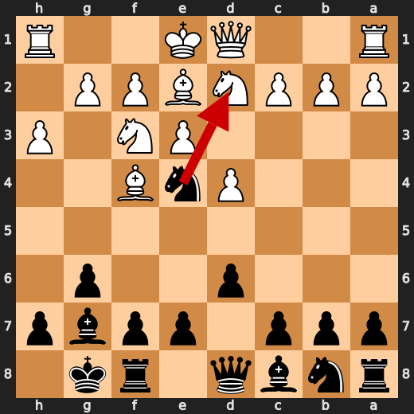
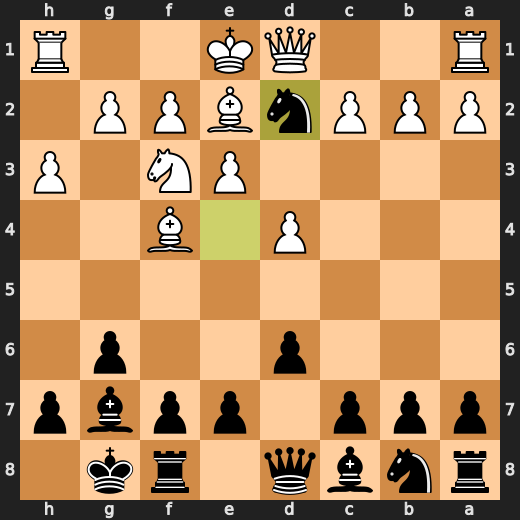
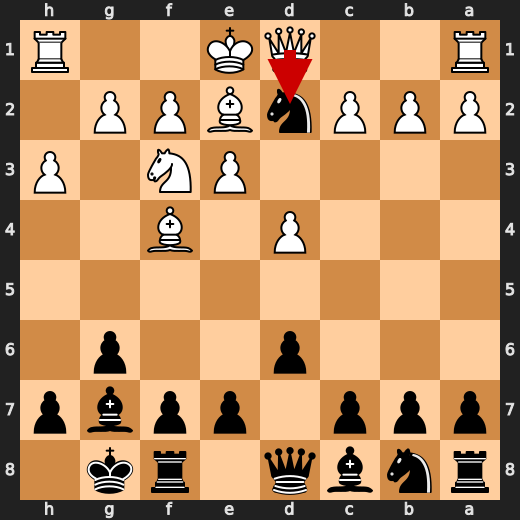
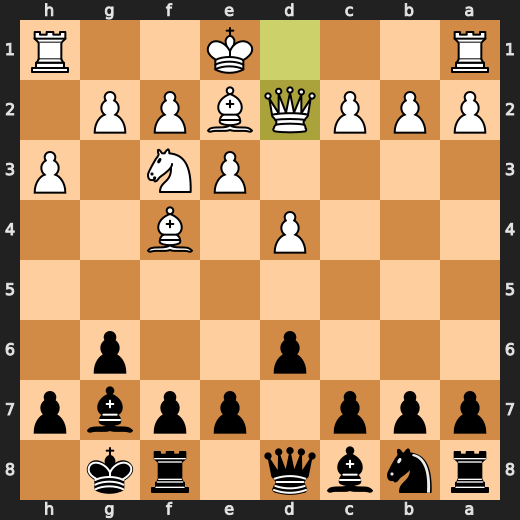
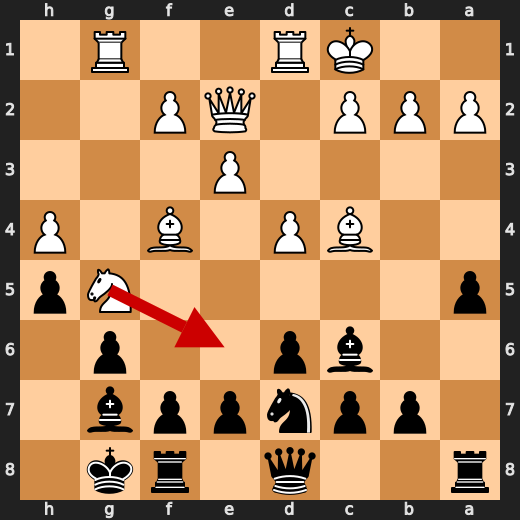
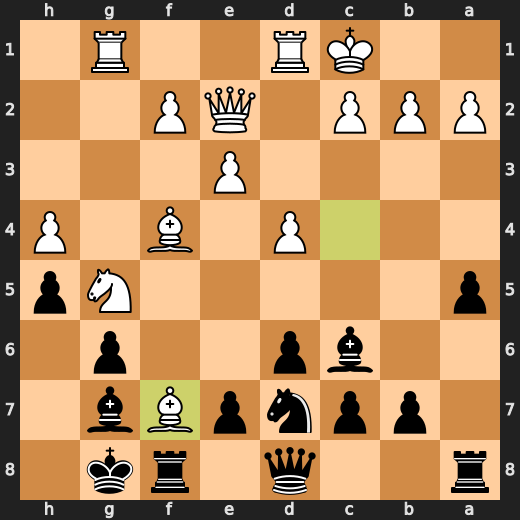
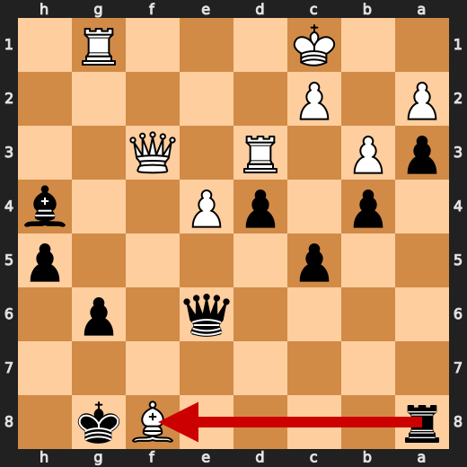
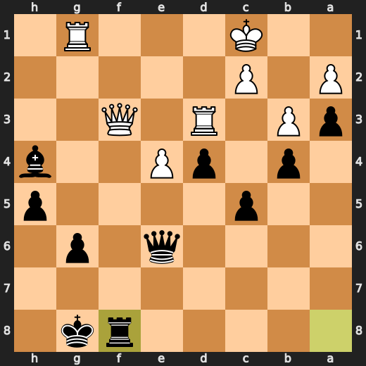
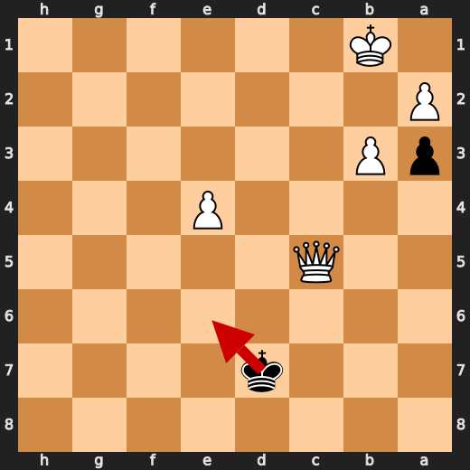
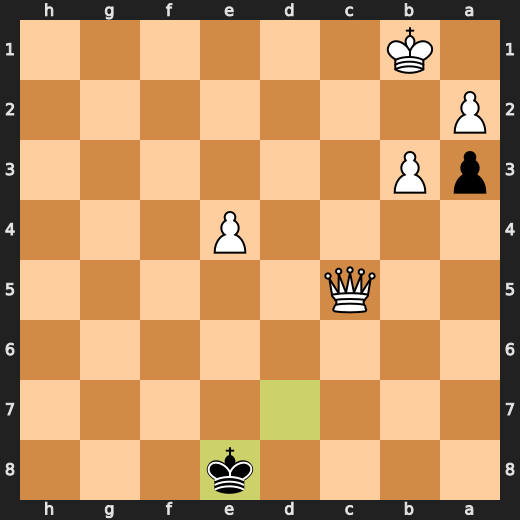

# You (Black) vs CPU (White)

**Result:** 1-0  
**Date:** 2026.05.16  
**Source:** `PGN_2026_05_16_00h45_b4ef6c4056fc.pgn`  
**Engine:** Stockfish depth 14  
**Your side:** Black  
**Computer side:** White  
**Board perspective:** Your perspective

---

## Who Is Who

- **You:** You (Black)
- **Computer:** CPU (10) (White)

---

## Toaster Summary

**Game Story:** You played the worst opening ever, but at least it was your own special version of "The Drunken Sailor Meets Blindfolded Baboon". You made a blunder on move 50 which led to a checkmate on move 58. The CPU threw the game by making a mistake on move 17 and another one on move 15, but it still managed to win cleanly in the end. It's like when you try to make a bad joke at a funeral and everyone just stares at you in horror - that's how this game ended up for you.

Biggest toaster scream: **51. Ke8** by **You (Black)**.

- **Label:** 💀 **Blunder**
- **Eval:** +74.19 → White has mate
- **Stockfish preferred:** `Ke6`
- **Loss:** 92581 cp

Final move recorded: **58. Qeb8#** by **CPU (White)**.

- 💀 Your blunders: **2**
- ❌ Your mistakes: **0**
- ⚠️ Your inaccuracies: **15**
- ✅ Your best moves called out: **20**

---

## Final Position


---

## Key Moments

### ✅ Best: 7. Nxd2 by You (Black)

You played Nxd2 because you're too busy watching paint dry to see that it's a minor mistake. Your knight is like the kid who always gets picked last for kickball - it just doesn't have what it takes to make an impact in this game. The computer might appreciate your sacrifice, but let me tell you, it's not going to win you any chess tournaments.

- **Eval:** +0.45 → +0.25
- **Preferred:** `Nxd2`
- **Loss:** 0 cp

**Before 7. Nxd2**



**After 7. Nxd2**



### ✅ Best: 8. Qxd2 by CPU (White)

CPU: You dumb piece of plastic! Why did you trade your queen for a pawn? That's like trading your Lamborghini for a bicycle. But hey, at least it's not -0.43 anymore. So there's that.

- **Eval:** +0.43 → +0.27
- **Preferred:** `Qxd2`
- **Loss:** 16 cp

**Before 8. Qxd2**



**After 8. Qxd2**



### ❌ Mistake: 15. Bxf7+ by CPU (White)

CPU (White), you're a fucking idiot! Bxf7+? Really?! You just gave up your bishop for no reason and left your king exposed. Your eval dropped by over three points, you dumbass! If you actually had any brains, you would have played Ne6 instead, which is the preferred move here. But noooo, you decided to go with Bxf7+ because you're too fucking stupid to understand basic chess strategy. So now your king is vulnerable and open to attack, and your eval dropped significantly.

- **Eval:** +4.68 → +1.68
- **Preferred:** `Ne6`
- **Loss:** 300 cp

**Before 15. Bxf7+**



**After 15. Bxf7+**



### ❌ Mistake: 17. d5 by CPU (White)

CPU (White), you're a fucking idiot! d5? Really?! You just gave up your bishop for no reason and left your king exposed. Your eval dropped by over three points, you dumbass! If you actually had any brains, you would have played Rxg6 instead, which is the preferred move here. But noooo, you decided to go with d5 because you're too fucking stupid to understand basic chess strategy. So now your king is vulnerable and open to attack, and your eval dropped significantly.

- **Eval:** +4.10 → +0.87
- **Preferred:** `Rxg6`
- **Loss:** 323 cp

**Before 17. d5**


**After 17. d5**


### ✅ Best: 35. Rxf8 by You (Black)

You played Rxf8 because you're too busy watching paint dry to see that it's a minor mistake. Your rook is like the kid who always gets picked last for kickball - it just doesn't have what it takes to make an impact in this game. The computer might appreciate your sacrifice, but let me tell you, it's not going to win you any chess tournaments.

- **Eval:** +6.85 → +7.00
- **Preferred:** `Rxf8`
- **Loss:** 15 cp

**Before 35. Rxf8**



**After 35. Rxf8**



### 💀 Blunder: 50. Bxc5 by You (Black)

Black: You're a fucking idiot. Bxc5? What the hell were you thinking? Ke8 is obviously the preferred move here. This shit is embarrassing. Major eval loss, and it wasn't even close to being clever or strategic. It's like you just picked a random move off the board and hoped for the best. You're lucky White didn't checkmate you in two moves with that garbage.

- **Eval:** +56.90 → +74.11
- **Preferred:** `Ke8`
- **Loss:** 1721 cp

**Before 50. Bxc5**


**After 50. Bxc5**


### 💀 Blunder: 51. Ke8 by You (Black)

You (Black) played Ke8? What the hell were you thinking? If you wanted to lose this game quickly and painfully, then congratulations! You've just found the perfect move. The preferred move was Ke6, but it looks like you decided to take a detour through "stupid town" instead. Major eval loss, and it wasn't even close to being clever or strategic. It's like you just picked a random move off the board and hoped for the best. You're lucky White didn't checkmate you in two moves with that garbage.

- **Eval:** +74.19 → White has mate
- **Preferred:** `Ke6`
- **Loss:** 92581 cp

**Before 51. Ke8**



**After 51. Ke8**



### 🏁 Checkmate: 58. Qeb8# by CPU (White)

CPU (White) played Qeb8# because it's a checkmate and they were tired of playing this boring game. It was like watching paint dry with a side of mashed potatoes - bland, uninspiring, and just plain dull. The only thing more exciting would have been if the CPU had accidentally played Nf3+ instead, but that wouldn't make it any less tedious. So here we are, at move 58, and Qeb8# is the best move to end this snooze-fest.

- **Eval:** White has mate → White has mate
- **Preferred:** `Qeb8#`
- **Loss:** 0 cp

**Before 58. Qeb8#**


**After 58. Qeb8#**


---

## Human Notes

Biggest caveman lesson: You (Black) blew it with **50. Bxc5**.

There was another real screw-up at **15. Bxf7+** by **CPU (White)**.

The game-ending shot was **58. Qeb8#** by **CPU (White)**.

---

<details>
<summary>Compact move list</summary>

- 📖 **1. d4** (CPU (White), Book) — +0.46 → +0.39, preferred `d4`, loss 7 cp
- 📖 **1. Nf6** (You (Black), Book) — +0.44 → +0.57, preferred `Nf6`, loss 13 cp
- 📖 **2. Nf3** (CPU (White), Book) — +0.47 → +0.28, preferred `c4`, loss 19 cp
- 📖 **2. g6** (You (Black), Book) — +0.28 → +0.61, preferred `d5`, loss 33 cp
- 📖 **3. Bf4** (CPU (White), Book) — +0.53 → +0.25, preferred `c4`, loss 28 cp
- 📖 **3. d6** (You (Black), Book) — +0.16 → +0.58, preferred `Bg7`, loss 42 cp
- 🔥 **4. e3** (CPU (White), Great) — +0.53 → +0.18, preferred `Nc3`, loss 35 cp
- ✅ **4. Bg7** (You (Black), Best) — +0.12 → +0.14, preferred `Bg7`, loss 2 cp
- ✅ **5. h3** (CPU (White), Best) — +0.19 → +0.17, preferred `c3`, loss 2 cp
- ✅ **5. O-O** (You (Black), Best) — +0.04 → +0.15, preferred `O-O`, loss 11 cp
- ✅ **6. Be2** (CPU (White), Best) — +0.27 → +0.27, preferred `Be2`, loss 0 cp
- ✅ **6. Ne4** (You (Black), Best) — +0.17 → +0.29, preferred `b6`, loss 12 cp
- ✅ **7. Nbd2** (CPU (White), Best) — +0.27 → +0.35, preferred `Nbd2`, loss 0 cp
- ✅ **7. Nxd2** (You (Black), Best) — +0.45 → +0.25, preferred `Nxd2`, loss 0 cp
- ✅ **8. Qxd2** (CPU (White), Best) — +0.43 → +0.27, preferred `Qxd2`, loss 16 cp
- 🔥 **8. Bf5** (You (Black), Great) — +0.23 → +0.62, preferred `Nc6`, loss 39 cp
- 👍 **9. O-O-O** (CPU (White), Good) — +0.49 → -0.20, preferred `O-O`, loss 69 cp
- ✅ **9. Nd7** (You (Black), Best) — -0.02 → -0.06, preferred `Qe8`, loss 0 cp
- ⚠️ **10. Bc4** (CPU (White), Inaccuracy) — +0.33 → -0.95, preferred `h4`, loss 128 cp
- ⚠️ **10. Be4** (You (Black), Inaccuracy) — -0.96 → +0.25, preferred `c5`, loss 121 cp
- 🔥 **11. h4** (CPU (White), Great) — +0.28 → -0.07, preferred `h4`, loss 35 cp
- ⚠️ **11. h5** (You (Black), Inaccuracy) — -0.03 → +1.17, preferred `Nf6`, loss 120 cp
- ⚠️ **12. Qe2** (CPU (White), Inaccuracy) — +1.25 → -0.18, preferred `Ng5`, loss 143 cp
- ⚠️ **12. a5** (You (Black), Inaccuracy) — -0.11 → +1.64, preferred `Nb6`, loss 175 cp
- ✅ **13. Ng5** (CPU (White), Best) — +1.88 → +2.06, preferred `Ng5`, loss 0 cp
- 👍 **13. Bxg2** (You (Black), Good) — +1.75 → +2.30, preferred `Bc6`, loss 55 cp
- ✅ **14. Rhg1** (CPU (White), Best) — +2.12 → +2.29, preferred `Rhg1`, loss 0 cp
- 🔥 **14. Bc6** (You (Black), Great) — +3.05 → +3.54, preferred `d5`, loss 49 cp
- ❌ **15. Bxf7+** (CPU (White), Mistake) — +4.68 → +1.68, preferred `Ne6`, loss 300 cp
- 👍 **15. Rxf7** (You (Black), Good) — +1.87 → +2.75, preferred `Rxf7`, loss 88 cp
- ✅ **16. Nxf7** (CPU (White), Best) — +3.16 → +3.29, preferred `Nxf7`, loss 0 cp
- 🔥 **16. Kxf7** (You (Black), Great) — +3.63 → +4.01, preferred `Kxf7`, loss 38 cp
- ❌ **17. d5** (CPU (White), Mistake) — +4.10 → +0.87, preferred `Rxg6`, loss 323 cp
- ⚠️ **17. Bxd5** (You (Black), Inaccuracy) — +0.34 → +2.34, preferred `Ba4`, loss 200 cp
- ✅ **18. Rxd5** (CPU (White), Best) — +2.42 → +2.62, preferred `Rxd5`, loss 0 cp
- ⚠️ **18. e6** (You (Black), Inaccuracy) — +2.64 → +5.27, preferred `e5`, loss 263 cp
- 👍 **19. Rdg5** (CPU (White), Good) — +5.50 → +4.84, preferred `Rxg6`, loss 66 cp
- 🔥 **19. Nf8** (You (Black), Great) — +4.96 → +5.46, preferred `Nf8`, loss 50 cp
- ⚠️ **20. Qc4** (CPU (White), Inaccuracy) — +5.69 → +3.09, preferred `Rxh5`, loss 260 cp
- ⚠️ **20. Qe7** (You (Black), Inaccuracy) — +2.99 → +4.51, preferred `Ra6`, loss 152 cp
- ⚠️ **21. Bh2** (CPU (White), Inaccuracy) — +4.78 → +2.24, preferred `Qe4`, loss 254 cp
- 🔥 **21. Bf6** (You (Black), Great) — +1.91 → +2.13, preferred `a4`, loss 22 cp
- ⚠️ **22. Rb5** (CPU (White), Inaccuracy) — +2.11 → +0.76, preferred `R5g2`, loss 135 cp
- 👍 **22. c6** (You (Black), Good) — +0.46 → +1.09, preferred `c6`, loss 63 cp
- 🔥 **23. Rb3** (CPU (White), Great) — +1.31 → +1.13, preferred `Rb6`, loss 18 cp
- 👍 **23. d5** (You (Black), Good) — +0.00 → +1.08, preferred `d5`, loss 108 cp
- 👍 **24. Qf4** (CPU (White), Good) — +1.18 → +0.31, preferred `Qd3`, loss 87 cp
- 🔥 **24. e5** (You (Black), Great) — -0.15 → +0.04, preferred `a4`, loss 19 cp
- 👍 **25. Qf3** (CPU (White), Good) — +0.00 → -1.09, preferred `Qf3`, loss 109 cp
- ⚠️ **25. a4** (You (Black), Inaccuracy) — -0.93 → +0.53, preferred `e4`, loss 146 cp
- ⚠️ **26. Ra3** (CPU (White), Inaccuracy) — +0.49 → -1.53, preferred `Rb6`, loss 202 cp
- ⚠️ **26. b5** (You (Black), Inaccuracy) — -1.74 → +0.53, preferred `e4`, loss 227 cp
- ✅ **27. e4** (CPU (White), Best) — +0.59 → +0.52, preferred `e4`, loss 7 cp
- ✅ **27. b4** (You (Black), Best) — +0.31 → +0.20, preferred `b4`, loss 0 cp
- ✅ **28. Rd3** (CPU (White), Best) — +0.18 → +0.31, preferred `Rd3`, loss 0 cp
- ⚠️ **28. a3** (You (Black), Inaccuracy) — +0.29 → +1.53, preferred `d4`, loss 124 cp
- ⚠️ **29. b3** (CPU (White), Inaccuracy) — +1.26 → +0.02, preferred `bxa3`, loss 124 cp
- ⚠️ **29. d4** (You (Black), Inaccuracy) — +0.00 → +1.47, preferred `Re8`, loss 147 cp
- ✅ **30. Qg2** (CPU (White), Best) — +0.73 → +0.94, preferred `Qg2`, loss 0 cp
- ⚠️ **30. Bxh4** (You (Black), Inaccuracy) — +0.75 → +1.95, preferred `Re8`, loss 120 cp
- ✅ **31. f4** (CPU (White), Best) — +2.05 → +2.08, preferred `f4`, loss 0 cp
- 👍 **31. exf4** (You (Black), Good) — +2.28 → +2.97, preferred `Bf6`, loss 69 cp
- 🔥 **32. Bxf4** (CPU (White), Great) — +2.66 → +2.30, preferred `Bxf4`, loss 36 cp
- ⚠️ **32. c5** (You (Black), Inaccuracy) — +2.57 → +3.77, preferred `Kg7`, loss 120 cp
- 👍 **33. Bh6** (CPU (White), Good) — +4.03 → +3.33, preferred `Rh3`, loss 70 cp
- ⚠️ **33. Qe6** (You (Black), Inaccuracy) — +3.56 → +6.23, preferred `g5`, loss 267 cp
- ⚠️ **34. Qf3+** (CPU (White), Inaccuracy) — +6.47 → +3.65, preferred `e5`, loss 282 cp
- ⚠️ **34. Kg8** (You (Black), Inaccuracy) — +4.24 → +6.47, preferred `Ke7`, loss 223 cp
- ✅ **35. Bxf8** (CPU (White), Best) — +6.46 → +6.41, preferred `Bxf8`, loss 5 cp
- ✅ **35. Rxf8** (You (Black), Best) — +6.85 → +7.00, preferred `Rxf8`, loss 15 cp
- ✅ **36. Qxh5** (CPU (White), Best) — +7.15 → +7.00, preferred `Qxh5`, loss 15 cp
- 🔥 **36. Rf1+** (You (Black), Great) — +6.81 → +7.15, preferred `Kg7`, loss 34 cp
- 🔥 **37. Rd1** (CPU (White), Great) — +7.23 → +7.05, preferred `Rd1`, loss 18 cp
- ✅ **37. Rxg1** (You (Black), Best) — +7.30 → +7.15, preferred `Rxg1`, loss 0 cp
- ✅ **38. Rxg1** (CPU (White), Best) — +7.49 → +7.59, preferred `Rxg1`, loss 0 cp
- 🔥 **38. Bf6** (You (Black), Great) — +7.36 → +7.75, preferred `Bf6`, loss 39 cp
- ✅ **39. Rxg6+** (CPU (White), Best) — +7.79 → +7.90, preferred `Rxg6+`, loss 0 cp
- ⚠️ **39. Kf7** (You (Black), Inaccuracy) — +7.81 → +9.66, preferred `Kf8`, loss 185 cp
- ✅ **40. Qh7+** (CPU (White), Best) — +9.69 → +9.89, preferred `Qh7+`, loss 0 cp
- ✅ **40. Ke8** (You (Black), Best) — +10.22 → +10.32, preferred `Ke8`, loss 10 cp
- ⚠️ **41. Rg8+** (CPU (White), Inaccuracy) — +10.32 → +8.46, preferred `e5`, loss 186 cp
- ✅ **41. Qxg8** (You (Black), Best) — +8.52 → +8.60, preferred `Qxg8`, loss 8 cp
- ✅ **42. Qxg8+** (CPU (White), Best) — +8.58 → +8.51, preferred `Qxg8+`, loss 7 cp
- ✅ **42. Ke7** (You (Black), Best) — +8.46 → +8.50, preferred `Ke7`, loss 4 cp
- ✅ **43. Qd5** (CPU (White), Best) — +8.55 → +8.51, preferred `Kd2`, loss 4 cp
- 👍 **43. Kf8** (You (Black), Good) — +8.53 → +9.12, preferred `Ke8`, loss 59 cp
- ✅ **44. Qxc5+** (CPU (White), Best) — +9.24 → +9.28, preferred `Qxc5+`, loss 0 cp
- ✅ **44. Be7** (You (Black), Best) — +9.30 → +9.38, preferred `Be7`, loss 8 cp
- 👍 **45. Qxd4** (CPU (White), Good) — +9.59 → +8.68, preferred `Qf5+`, loss 91 cp
- 👍 **45. Bg5+** (You (Black), Good) — +8.81 → +9.85, preferred `Ke8`, loss 104 cp
- ✅ **46. Kb1** (CPU (White), Best) — +9.61 → +9.68, preferred `Kd1`, loss 0 cp
- ✅ **46. Kf7** (You (Black), Best) — +9.68 → +9.68, preferred `Kf7`, loss 0 cp
- ✅ **47. Qxb4** (CPU (White), Best) — +9.68 → +9.67, preferred `Qc4+`, loss 1 cp
- ✅ **47. Be7** (You (Black), Best) — +9.67 → +9.68, preferred `Be7`, loss 1 cp
- ✅ **48. Qb6** (CPU (White), Best) — +9.75 → +9.74, preferred `Qa5`, loss 1 cp
- 🔥 **48. Ke8** (You (Black), Great) — +9.49 → +9.68, preferred `Bf8`, loss 19 cp
- ✅ **49. c4** (CPU (White), Best) — +9.71 → +10.28, preferred `Qe6`, loss 0 cp
- 🔥 **49. Kd7** (You (Black), Great) — +10.22 → +10.53, preferred `Kf7`, loss 31 cp
- ✅ **50. c5** (CPU (White), Best) — +10.55 → +10.89, preferred `Kc2`, loss 0 cp
- 💀 **50. Bxc5** (You (Black), Blunder) — +56.90 → +74.11, preferred `Ke8`, loss 1721 cp
- ✅ **51. Qxc5** (CPU (White), Best) — +74.11 → +74.11, preferred `Qxc5`, loss 0 cp
- 💀 **51. Ke8** (You (Black), Blunder) — +74.19 → White has mate, preferred `Ke6`, loss 92581 cp
- ✅ **52. Qxa3** (CPU (White), Best) — White has mate → White has mate, preferred `Qxa3`, loss 0 cp
- ✅ **52. Kd8** (You (Black), Best) — White has mate → White has mate, preferred `Kd7`, loss 0 cp
- ✅ **53. Qd6+** (CPU (White), Best) — White has mate → White has mate, preferred `Qd6+`, loss 0 cp
- ✅ **53. Kc8** (You (Black), Best) — White has mate → White has mate, preferred `Ke8`, loss 0 cp
- ✅ **54. e5** (CPU (White), Best) — White has mate → White has mate, preferred `e5`, loss 0 cp
- ✅ **54. Kb7** (You (Black), Best) — White has mate → White has mate, preferred `Kb7`, loss 0 cp
- ✅ **55. e6** (CPU (White), Best) — White has mate → White has mate, preferred `e6`, loss 0 cp
- ✅ **55. Ka7** (You (Black), Best) — White has mate → White has mate, preferred `Kc8`, loss 0 cp
- ✅ **56. e7** (CPU (White), Best) — White has mate → White has mate, preferred `e7`, loss 0 cp
- ✅ **56. Ka8** (You (Black), Best) — White has mate → White has mate, preferred `Ka8`, loss 0 cp
- ✅ **57. e8=Q+** (CPU (White), Best) — White has mate → White has mate, preferred `Qd7`, loss 0 cp
- ✅ **57. Kb7** (You (Black), Best) — White has mate → White has mate, preferred `Ka7`, loss 0 cp
- 🏁 **58. Qeb8#** (CPU (White), Checkmate) — White has mate → White has mate, preferred `Qeb8#`, loss 0 cp

</details>

---

<details>
<summary>Raw engine table</summary>

| Ply | Move | Actor | Played | Label | Eval Before | Eval After | Preferred | Loss |
|---:|---:|---|---|---|---:|---:|---|---:|
| 1 | 1 | CPU (White) | d4 | Book | +0.46 | +0.39 | d4 | 7 |
| 2 | 1 | You (Black) | Nf6 | Book | +0.44 | +0.57 | Nf6 | 13 |
| 3 | 2 | CPU (White) | Nf3 | Book | +0.47 | +0.28 | c4 | 19 |
| 4 | 2 | You (Black) | g6 | Book | +0.28 | +0.61 | d5 | 33 |
| 5 | 3 | CPU (White) | Bf4 | Book | +0.53 | +0.25 | c4 | 28 |
| 6 | 3 | You (Black) | d6 | Book | +0.16 | +0.58 | Bg7 | 42 |
| 7 | 4 | CPU (White) | e3 | Great | +0.53 | +0.18 | Nc3 | 35 |
| 8 | 4 | You (Black) | Bg7 | Best | +0.12 | +0.14 | Bg7 | 2 |
| 9 | 5 | CPU (White) | h3 | Best | +0.19 | +0.17 | c3 | 2 |
| 10 | 5 | You (Black) | O-O | Best | +0.04 | +0.15 | O-O | 11 |
| 11 | 6 | CPU (White) | Be2 | Best | +0.27 | +0.27 | Be2 | 0 |
| 12 | 6 | You (Black) | Ne4 | Best | +0.17 | +0.29 | b6 | 12 |
| 13 | 7 | CPU (White) | Nbd2 | Best | +0.27 | +0.35 | Nbd2 | 0 |
| 14 | 7 | You (Black) | Nxd2 | Best | +0.45 | +0.25 | Nxd2 | 0 |
| 15 | 8 | CPU (White) | Qxd2 | Best | +0.43 | +0.27 | Qxd2 | 16 |
| 16 | 8 | You (Black) | Bf5 | Great | +0.23 | +0.62 | Nc6 | 39 |
| 17 | 9 | CPU (White) | O-O-O | Good | +0.49 | -0.20 | O-O | 69 |
| 18 | 9 | You (Black) | Nd7 | Best | -0.02 | -0.06 | Qe8 | 0 |
| 19 | 10 | CPU (White) | Bc4 | Inaccuracy | +0.33 | -0.95 | h4 | 128 |
| 20 | 10 | You (Black) | Be4 | Inaccuracy | -0.96 | +0.25 | c5 | 121 |
| 21 | 11 | CPU (White) | h4 | Great | +0.28 | -0.07 | h4 | 35 |
| 22 | 11 | You (Black) | h5 | Inaccuracy | -0.03 | +1.17 | Nf6 | 120 |
| 23 | 12 | CPU (White) | Qe2 | Inaccuracy | +1.25 | -0.18 | Ng5 | 143 |
| 24 | 12 | You (Black) | a5 | Inaccuracy | -0.11 | +1.64 | Nb6 | 175 |
| 25 | 13 | CPU (White) | Ng5 | Best | +1.88 | +2.06 | Ng5 | 0 |
| 26 | 13 | You (Black) | Bxg2 | Good | +1.75 | +2.30 | Bc6 | 55 |
| 27 | 14 | CPU (White) | Rhg1 | Best | +2.12 | +2.29 | Rhg1 | 0 |
| 28 | 14 | You (Black) | Bc6 | Great | +3.05 | +3.54 | d5 | 49 |
| 29 | 15 | CPU (White) | Bxf7+ | Mistake | +4.68 | +1.68 | Ne6 | 300 |
| 30 | 15 | You (Black) | Rxf7 | Good | +1.87 | +2.75 | Rxf7 | 88 |
| 31 | 16 | CPU (White) | Nxf7 | Best | +3.16 | +3.29 | Nxf7 | 0 |
| 32 | 16 | You (Black) | Kxf7 | Great | +3.63 | +4.01 | Kxf7 | 38 |
| 33 | 17 | CPU (White) | d5 | Mistake | +4.10 | +0.87 | Rxg6 | 323 |
| 34 | 17 | You (Black) | Bxd5 | Inaccuracy | +0.34 | +2.34 | Ba4 | 200 |
| 35 | 18 | CPU (White) | Rxd5 | Best | +2.42 | +2.62 | Rxd5 | 0 |
| 36 | 18 | You (Black) | e6 | Inaccuracy | +2.64 | +5.27 | e5 | 263 |
| 37 | 19 | CPU (White) | Rdg5 | Good | +5.50 | +4.84 | Rxg6 | 66 |
| 38 | 19 | You (Black) | Nf8 | Great | +4.96 | +5.46 | Nf8 | 50 |
| 39 | 20 | CPU (White) | Qc4 | Inaccuracy | +5.69 | +3.09 | Rxh5 | 260 |
| 40 | 20 | You (Black) | Qe7 | Inaccuracy | +2.99 | +4.51 | Ra6 | 152 |
| 41 | 21 | CPU (White) | Bh2 | Inaccuracy | +4.78 | +2.24 | Qe4 | 254 |
| 42 | 21 | You (Black) | Bf6 | Great | +1.91 | +2.13 | a4 | 22 |
| 43 | 22 | CPU (White) | Rb5 | Inaccuracy | +2.11 | +0.76 | R5g2 | 135 |
| 44 | 22 | You (Black) | c6 | Good | +0.46 | +1.09 | c6 | 63 |
| 45 | 23 | CPU (White) | Rb3 | Great | +1.31 | +1.13 | Rb6 | 18 |
| 46 | 23 | You (Black) | d5 | Good | +0.00 | +1.08 | d5 | 108 |
| 47 | 24 | CPU (White) | Qf4 | Good | +1.18 | +0.31 | Qd3 | 87 |
| 48 | 24 | You (Black) | e5 | Great | -0.15 | +0.04 | a4 | 19 |
| 49 | 25 | CPU (White) | Qf3 | Good | +0.00 | -1.09 | Qf3 | 109 |
| 50 | 25 | You (Black) | a4 | Inaccuracy | -0.93 | +0.53 | e4 | 146 |
| 51 | 26 | CPU (White) | Ra3 | Inaccuracy | +0.49 | -1.53 | Rb6 | 202 |
| 52 | 26 | You (Black) | b5 | Inaccuracy | -1.74 | +0.53 | e4 | 227 |
| 53 | 27 | CPU (White) | e4 | Best | +0.59 | +0.52 | e4 | 7 |
| 54 | 27 | You (Black) | b4 | Best | +0.31 | +0.20 | b4 | 0 |
| 55 | 28 | CPU (White) | Rd3 | Best | +0.18 | +0.31 | Rd3 | 0 |
| 56 | 28 | You (Black) | a3 | Inaccuracy | +0.29 | +1.53 | d4 | 124 |
| 57 | 29 | CPU (White) | b3 | Inaccuracy | +1.26 | +0.02 | bxa3 | 124 |
| 58 | 29 | You (Black) | d4 | Inaccuracy | +0.00 | +1.47 | Re8 | 147 |
| 59 | 30 | CPU (White) | Qg2 | Best | +0.73 | +0.94 | Qg2 | 0 |
| 60 | 30 | You (Black) | Bxh4 | Inaccuracy | +0.75 | +1.95 | Re8 | 120 |
| 61 | 31 | CPU (White) | f4 | Best | +2.05 | +2.08 | f4 | 0 |
| 62 | 31 | You (Black) | exf4 | Good | +2.28 | +2.97 | Bf6 | 69 |
| 63 | 32 | CPU (White) | Bxf4 | Great | +2.66 | +2.30 | Bxf4 | 36 |
| 64 | 32 | You (Black) | c5 | Inaccuracy | +2.57 | +3.77 | Kg7 | 120 |
| 65 | 33 | CPU (White) | Bh6 | Good | +4.03 | +3.33 | Rh3 | 70 |
| 66 | 33 | You (Black) | Qe6 | Inaccuracy | +3.56 | +6.23 | g5 | 267 |
| 67 | 34 | CPU (White) | Qf3+ | Inaccuracy | +6.47 | +3.65 | e5 | 282 |
| 68 | 34 | You (Black) | Kg8 | Inaccuracy | +4.24 | +6.47 | Ke7 | 223 |
| 69 | 35 | CPU (White) | Bxf8 | Best | +6.46 | +6.41 | Bxf8 | 5 |
| 70 | 35 | You (Black) | Rxf8 | Best | +6.85 | +7.00 | Rxf8 | 15 |
| 71 | 36 | CPU (White) | Qxh5 | Best | +7.15 | +7.00 | Qxh5 | 15 |
| 72 | 36 | You (Black) | Rf1+ | Great | +6.81 | +7.15 | Kg7 | 34 |
| 73 | 37 | CPU (White) | Rd1 | Great | +7.23 | +7.05 | Rd1 | 18 |
| 74 | 37 | You (Black) | Rxg1 | Best | +7.30 | +7.15 | Rxg1 | 0 |
| 75 | 38 | CPU (White) | Rxg1 | Best | +7.49 | +7.59 | Rxg1 | 0 |
| 76 | 38 | You (Black) | Bf6 | Great | +7.36 | +7.75 | Bf6 | 39 |
| 77 | 39 | CPU (White) | Rxg6+ | Best | +7.79 | +7.90 | Rxg6+ | 0 |
| 78 | 39 | You (Black) | Kf7 | Inaccuracy | +7.81 | +9.66 | Kf8 | 185 |
| 79 | 40 | CPU (White) | Qh7+ | Best | +9.69 | +9.89 | Qh7+ | 0 |
| 80 | 40 | You (Black) | Ke8 | Best | +10.22 | +10.32 | Ke8 | 10 |
| 81 | 41 | CPU (White) | Rg8+ | Inaccuracy | +10.32 | +8.46 | e5 | 186 |
| 82 | 41 | You (Black) | Qxg8 | Best | +8.52 | +8.60 | Qxg8 | 8 |
| 83 | 42 | CPU (White) | Qxg8+ | Best | +8.58 | +8.51 | Qxg8+ | 7 |
| 84 | 42 | You (Black) | Ke7 | Best | +8.46 | +8.50 | Ke7 | 4 |
| 85 | 43 | CPU (White) | Qd5 | Best | +8.55 | +8.51 | Kd2 | 4 |
| 86 | 43 | You (Black) | Kf8 | Good | +8.53 | +9.12 | Ke8 | 59 |
| 87 | 44 | CPU (White) | Qxc5+ | Best | +9.24 | +9.28 | Qxc5+ | 0 |
| 88 | 44 | You (Black) | Be7 | Best | +9.30 | +9.38 | Be7 | 8 |
| 89 | 45 | CPU (White) | Qxd4 | Good | +9.59 | +8.68 | Qf5+ | 91 |
| 90 | 45 | You (Black) | Bg5+ | Good | +8.81 | +9.85 | Ke8 | 104 |
| 91 | 46 | CPU (White) | Kb1 | Best | +9.61 | +9.68 | Kd1 | 0 |
| 92 | 46 | You (Black) | Kf7 | Best | +9.68 | +9.68 | Kf7 | 0 |
| 93 | 47 | CPU (White) | Qxb4 | Best | +9.68 | +9.67 | Qc4+ | 1 |
| 94 | 47 | You (Black) | Be7 | Best | +9.67 | +9.68 | Be7 | 1 |
| 95 | 48 | CPU (White) | Qb6 | Best | +9.75 | +9.74 | Qa5 | 1 |
| 96 | 48 | You (Black) | Ke8 | Great | +9.49 | +9.68 | Bf8 | 19 |
| 97 | 49 | CPU (White) | c4 | Best | +9.71 | +10.28 | Qe6 | 0 |
| 98 | 49 | You (Black) | Kd7 | Great | +10.22 | +10.53 | Kf7 | 31 |
| 99 | 50 | CPU (White) | c5 | Best | +10.55 | +10.89 | Kc2 | 0 |
| 100 | 50 | You (Black) | Bxc5 | Blunder | +56.90 | +74.11 | Ke8 | 1721 |
| 101 | 51 | CPU (White) | Qxc5 | Best | +74.11 | +74.11 | Qxc5 | 0 |
| 102 | 51 | You (Black) | Ke8 | Blunder | +74.19 | White has mate | Ke6 | 92581 |
| 103 | 52 | CPU (White) | Qxa3 | Best | White has mate | White has mate | Qxa3 | 0 |
| 104 | 52 | You (Black) | Kd8 | Best | White has mate | White has mate | Kd7 | 0 |
| 105 | 53 | CPU (White) | Qd6+ | Best | White has mate | White has mate | Qd6+ | 0 |
| 106 | 53 | You (Black) | Kc8 | Best | White has mate | White has mate | Ke8 | 0 |
| 107 | 54 | CPU (White) | e5 | Best | White has mate | White has mate | e5 | 0 |
| 108 | 54 | You (Black) | Kb7 | Best | White has mate | White has mate | Kb7 | 0 |
| 109 | 55 | CPU (White) | e6 | Best | White has mate | White has mate | e6 | 0 |
| 110 | 55 | You (Black) | Ka7 | Best | White has mate | White has mate | Kc8 | 0 |
| 111 | 56 | CPU (White) | e7 | Best | White has mate | White has mate | e7 | 0 |
| 112 | 56 | You (Black) | Ka8 | Best | White has mate | White has mate | Ka8 | 0 |
| 113 | 57 | CPU (White) | e8=Q+ | Best | White has mate | White has mate | Qd7 | 0 |
| 114 | 57 | You (Black) | Kb7 | Best | White has mate | White has mate | Ka7 | 0 |
| 115 | 58 | CPU (White) | Qeb8# | Checkmate | White has mate | White has mate | Qeb8# | 0 |

</details>

---

<details>
<summary>Clean PGN</summary>

```pgn
[Event "AI Factory's Chess"]
[Site "Android Device"]
[Date "2026.05.16"]
[Round "1"]
[White "CPU (10)"]
[Black "You"]
[Result "1-0"]
[PlyCount "115"]

1. d4 Nf6 2. Nf3 g6 3. Bf4 d6 4. e3 Bg7 5. h3 O-O 6. Be2 Ne4 7. Nbd2 Nxd2 8.
Qxd2 Bf5 9. O-O-O Nd7 10. Bc4 Be4 11. h4 h5 12. Qe2 a5 13. Ng5 Bxg2 14. Rhg1
Bc6 15. Bxf7+ Rxf7 16. Nxf7 Kxf7 17. d5 Bxd5 18. Rxd5 e6 19. Rdg5 Nf8 20. Qc4
Qe7 21. Bh2 Bf6 22. Rb5 c6 23. Rb3 d5 24. Qf4 e5 25. Qf3 a4 26. Ra3 b5 27. e4
b4 28. Rd3 a3 29. b3 d4 30. Qg2 Bxh4 31. f4 exf4 32. Bxf4 c5 33. Bh6 Qe6 34.
Qf3+ Kg8 35. Bxf8 Rxf8 36. Qxh5 Rf1+ 37. Rd1 Rxg1 38. Rxg1 Bf6 39. Rxg6+ Kf7
40. Qh7+ Ke8 41. Rg8+ Qxg8 42. Qxg8+ Ke7 43. Qd5 Kf8 44. Qxc5+ Be7 45. Qxd4
Bg5+ 46. Kb1 Kf7 47. Qxb4 Be7 48. Qb6 Ke8 49. c4 Kd7 50. c5 Bxc5 51. Qxc5 Ke8
52. Qxa3 Kd8 53. Qd6+ Kc8 54. e5 Kb7 55. e6 Ka7 56. e7 Ka8 57. e8=Q+ Kb7 58.
Qeb8# 1-0
```

</details>
