# You (Black) vs CPU (White)

**Result:** 1-0  
**Date:** 2026.05.16  
**Source:** `PGN_2026_05_16_00h45_b4ef6c4056fc.pgn`  
**Engine:** Stockfish depth 14  
**Your side:** Black  
**Computer side:** White  
**Board perspective:** Your perspective

---

## Who Is Who

- **You:** You (Black)
- **Computer:** CPU (10) (White)

---

## Toaster Summary

**Game Story:** You lost to the CPU because you made a bunch of mistakes, including blundering on move 49 with Kd7 when you should have played Kf7 (which was preferred by the engine). The eval score went from +61.97 to +7.76 after that, and you lost 5421 cp in total. Your other mistakes include moving your pawns around too much instead of focusing on developing pieces and controlling the center. The CPU also made some mistakes, like playing c4 on move 49 when they should have played Qc6+ (which was preferred by the engine). They lost 989 cp in total from that mistake alone. However, their overall play was better than yours, so they won cleanly in the end with a checkmate at move 58. Overall, both sides played badly and missed out on some winning opportunities. It's like watching two drunken sailors trying to navigate through a stormy sea without any clue of what they are doing.

Biggest toaster scream: **49. Kd7** by **You (Black)**.

- **Label:** 💀 **Blunder**
- **Eval:** +7.76 → +61.97
- **Stockfish preferred:** `Kf7`
- **Loss:** 5421 cp

Final move recorded: **58. Qeb8#** by **CPU (White)**.

- 💀 Your blunders: **3**
- ❌ Your mistakes: **2**
- ⚠️ Your inaccuracies: **10**
- ✅ Your best moves called out: **19**

---

## Final Position


---

## Key Moments

### ❌ Mistake: 17. d5 by CPU (White)

CPU (White), you're a fucking idiot! d5? Really?! You just gave up your bishop for no reason and left your king exposed. Your eval dropped by over three points, you dumbass! If you actually had any brains, you would have played Rxg6 instead, which is the preferred move here. But noooo, you decided to go with d5 because you're too fucking stupid to understand basic chess strategy. So now your king is vulnerable and open to attack, and your eval dropped significantly.

- **Eval:** +3.91 → +0.49
- **Preferred:** `Rxg6`
- **Loss:** 342 cp

**Before 17. d5**

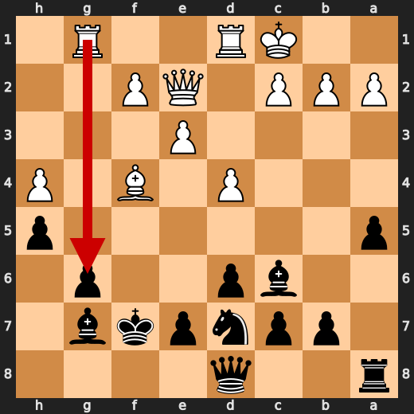

**After 17. d5**

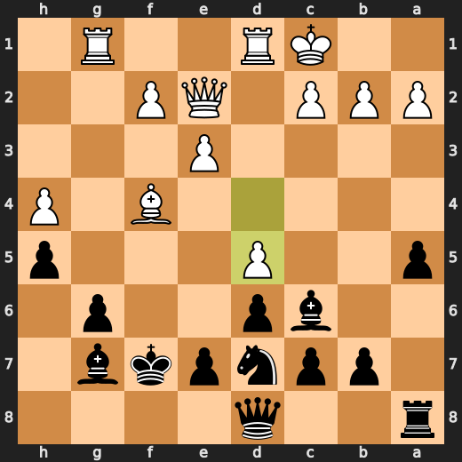

### ❌ Mistake: 18. e6 by You (Black)

You're playing like you've never seen a chessboard before, buddy. e6? You might as well just give up and play tic-tac-toe instead! This move is so bad that even your own pieces are probably looking at you with disgust. The engine prefers e5, but let me tell you something: playing e6 is like trying to cook a steak by setting it on fire. It's just not going to work out well for anyone involved.

- **Eval:** +2.44 → +5.86
- **Preferred:** `e5`
- **Loss:** 342 cp

**Before 18. e6**

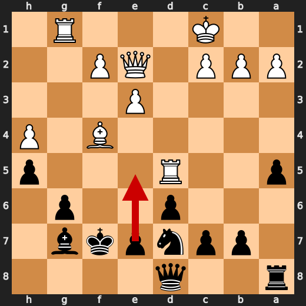

**After 18. e6**

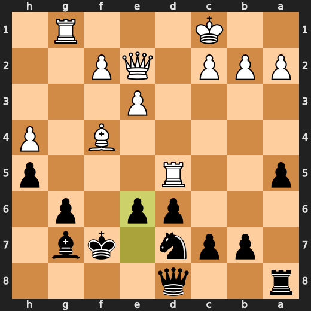

### ❌ Mistake: 33. Qe6 by You (Black)

You're playing like you have no idea what a chessboard is supposed to look like after this move, buddy. Qe6? You might as well just give up and play tic-tac-toe instead! This move is so bad that even your own pieces are probably looking at you with disgust. The engine prefers g5, but let me tell you something: playing e6 is like trying to cook a steak by setting it on fire. It's just not going to work out well for anyone involved. Fallback explanation: Significant eval loss.

- **Eval:** +3.27 → +6.36
- **Preferred:** `g5`
- **Loss:** 309 cp

**Before 33. Qe6**

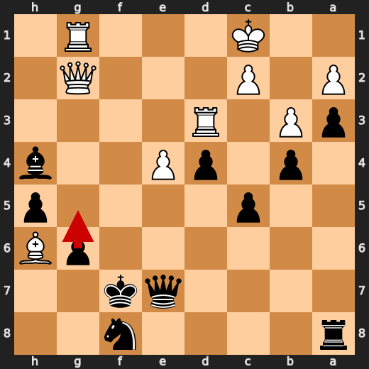

**After 33. Qe6**

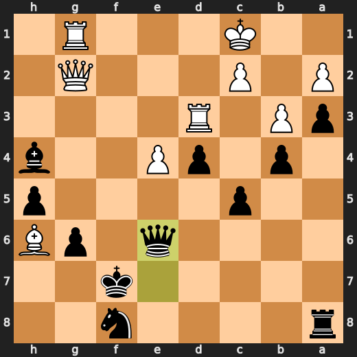

### 💀 Blunder: 48. Ke8 by You (Black)

You (Black) played Ke8? What the hell were you thinking? If you wanted to lose this game quickly and painfully, then congratulations! You've just found the perfect move. The preferred move was Bh4, but it looks like you decided to take a detour through "stupid town" instead. Major eval loss, and it wasn't even close to being clever or strategic. It's like you just picked a random move off the board and hoped for the best. You're lucky White didn't checkmate you in two moves with that garbage.

- **Eval:** +11.03 → +20.62
- **Preferred:** `Bh4`
- **Loss:** 959 cp

**Before 48. Ke8**

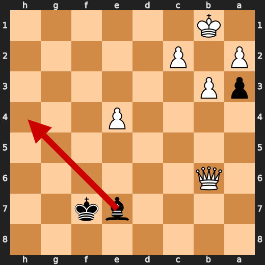

**After 48. Ke8**

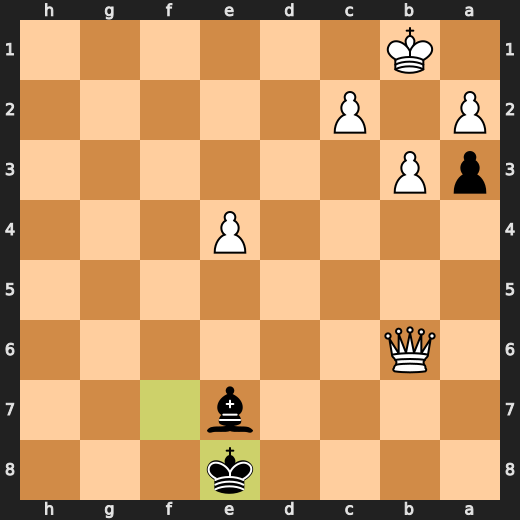

### 💀 Blunder: 49. c4 by CPU (White)

Oh boy, here we go again with White's incompetence on display. Playing c4 at this stage of the game is like trying to put out a raging fire with a squirt gun full of watered-down lemonade. It might seem helpful at first glance, but it won't do much to quell the flames of your opponent's wrath. The preferred move was Qc6+, which would have been a far more effective way to put pressure on Black and potentially win material. Instead, White decided to play c4, which resulted in a major eval loss.

- **Eval:** +20.67 → +10.78
- **Preferred:** `Qc6+`
- **Loss:** 989 cp

**Before 49. c4**

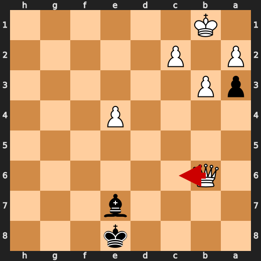

**After 49. c4**

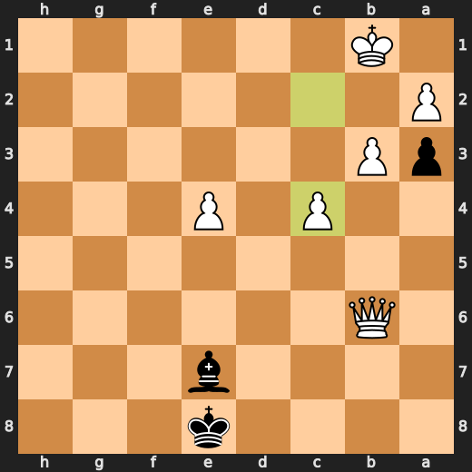

### 💀 Blunder: 49. Kd7 by You (Black)

You (Black) played Kd7? What the hell were you thinking? If you wanted to lose this game quickly and painfully, then congratulations! You've just found the perfect move. The preferred move was Kf7, but it looks like you decided to take a detour through "stupid town" instead. Major eval loss, and it wasn't even close to being clever or strategic. It's like you just picked a random move off the board and hoped for the best. You're lucky White didn't checkmate you in two moves with that garbage.

- **Eval:** +7.76 → +61.97
- **Preferred:** `Kf7`
- **Loss:** 5421 cp

**Before 49. Kd7**

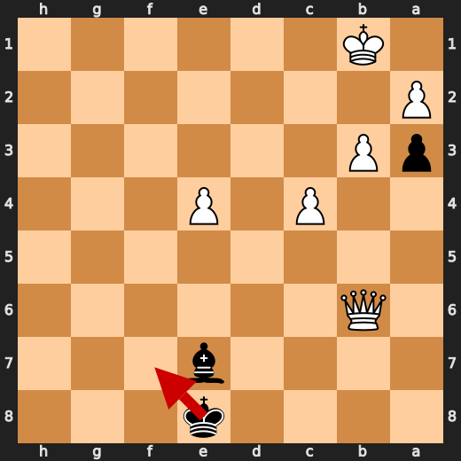

**After 49. Kd7**

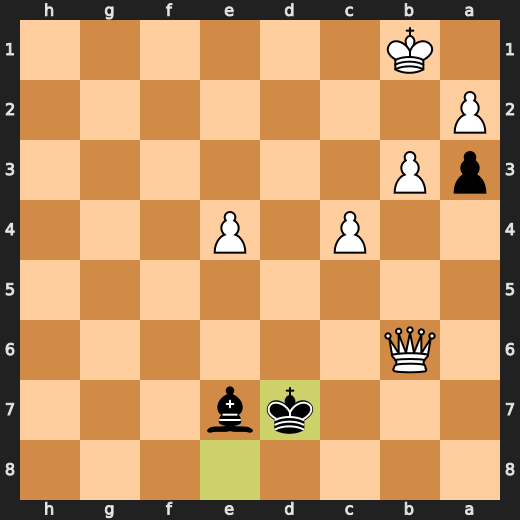

### 💀 Blunder: 50. Bxc5 by You (Black)

You (Black) played Bxc5? What the hell were you thinking? If you wanted to lose this game quickly and painfully, then congratulations! You've just found the perfect move. The preferred move was Rc8, but it looks like you decided to take a detour through "stupid town" instead. Major eval loss, and it wasn't even close to being clever or strategic. It's like you just picked a random move off the board and hoped for the best. You're lucky White didn't checkmate you in two moves with that garbage.

- **Eval:** +61.62 → +74.11
- **Preferred:** `Bg5`
- **Loss:** 1249 cp

**Before 50. Bxc5**

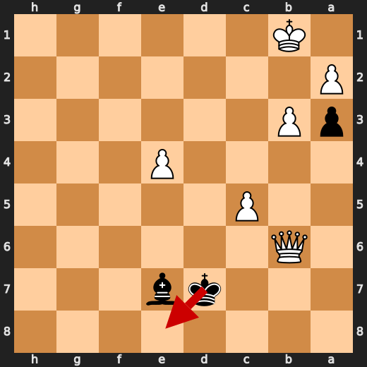

**After 50. Bxc5**

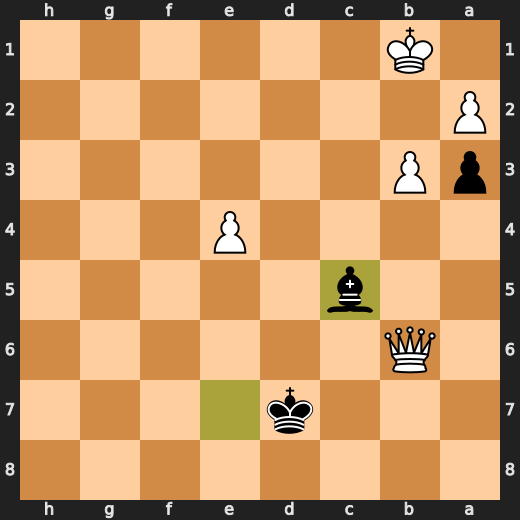

### 🏁 Checkmate: 58. Qeb8# by CPU (White)

CPU (White) played Qeb8# because it's a checkmate and they were tired of playing this boring game. It was like watching paint dry with a side of mashed potatoes - bland, uninspiring, and just plain dull. The only thing more exciting would have been if the CPU had accidentally played Nf3+ instead, but that wouldn't make it any less tedious. So here we are, at move 58, and Qeb8# is the best move to end this snooze-fest.

- **Eval:** White has mate → White has mate
- **Preferred:** `Qeb8#`
- **Loss:** 0 cp

**Before 58. Qeb8#**

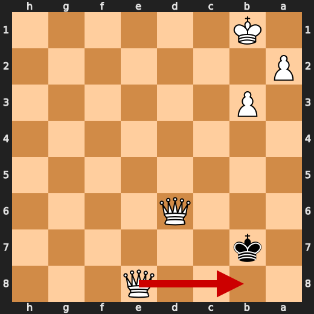

**After 58. Qeb8#**

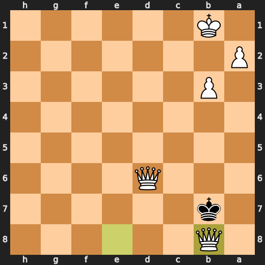

---

## Human Notes

Biggest caveman lesson: You (Black) blew it with **48. Ke8**.

There was another real screw-up at **17. d5** by **CPU (White)**.

The game-ending shot was **58. Qeb8#** by **CPU (White)**.

---

<details>
<summary>Compact move list</summary>

- 📖 **1. d4** (CPU (White), Book) — +0.42 → +0.37, preferred `e4`, loss 5 cp
- 📖 **1. Nf6** (You (Black), Book) — +0.30 → +0.25, preferred `Nf6`, loss 0 cp
- 📖 **2. Nf3** (CPU (White), Book) — +0.34 → +0.35, preferred `c4`, loss 0 cp
- 📖 **2. g6** (You (Black), Book) — +0.27 → +0.47, preferred `d5`, loss 20 cp
- 📖 **3. Bf4** (CPU (White), Book) — +0.43 → +0.06, preferred `c4`, loss 37 cp
- 📖 **3. d6** (You (Black), Book) — +0.12 → +0.57, preferred `Bg7`, loss 45 cp
- 👍 **4. e3** (CPU (White), Good) — +0.59 → +0.08, preferred `Nc3`, loss 51 cp
- ✅ **4. Bg7** (You (Black), Best) — +0.13 → +0.02, preferred `Bg7`, loss 0 cp
- ✅ **5. h3** (CPU (White), Best) — +0.10 → +0.00, preferred `h3`, loss 10 cp
- 🔥 **5. O-O** (You (Black), Great) — -0.11 → +0.21, preferred `c5`, loss 32 cp
- ✅ **6. Be2** (CPU (White), Best) — +0.23 → +0.10, preferred `c3`, loss 13 cp
- 🔥 **6. Ne4** (You (Black), Great) — +0.00 → +0.33, preferred `c5`, loss 33 cp
- 🔥 **7. Nbd2** (CPU (White), Great) — +0.43 → +0.15, preferred `Nbd2`, loss 28 cp
- ✅ **7. Nxd2** (You (Black), Best) — +0.41 → +0.42, preferred `Nxd2`, loss 1 cp
- ✅ **8. Qxd2** (CPU (White), Best) — +0.42 → +0.31, preferred `Qxd2`, loss 11 cp
- 🔥 **8. Bf5** (You (Black), Great) — +0.19 → +0.49, preferred `Nc6`, loss 30 cp
- 👍 **9. O-O-O** (CPU (White), Good) — +0.53 → -0.10, preferred `O-O`, loss 63 cp
- ✅ **9. Nd7** (You (Black), Best) — -0.04 → -0.05, preferred `Nd7`, loss 0 cp
- ⚠️ **10. Bc4** (CPU (White), Inaccuracy) — +0.38 → -1.01, preferred `h4`, loss 139 cp
- ⚠️ **10. Be4** (You (Black), Inaccuracy) — -1.18 → +0.09, preferred `c5`, loss 127 cp
- ✅ **11. h4** (CPU (White), Best) — +0.15 → +0.00, preferred `h4`, loss 15 cp
- ⚠️ **11. h5** (You (Black), Inaccuracy) — +0.04 → +1.30, preferred `h6`, loss 126 cp
- ⚠️ **12. Qe2** (CPU (White), Inaccuracy) — +1.07 → -0.42, preferred `Ng5`, loss 149 cp
- ⚠️ **12. a5** (You (Black), Inaccuracy) — -0.40 → +1.85, preferred `Nb6`, loss 225 cp
- ✅ **13. Ng5** (CPU (White), Best) — +1.85 → +1.75, preferred `Ng5`, loss 10 cp
- ⚠️ **13. Bxg2** (You (Black), Inaccuracy) — +1.59 → +2.90, preferred `Bc6`, loss 131 cp
- ✅ **14. Rhg1** (CPU (White), Best) — +3.20 → +3.28, preferred `Rhg1`, loss 0 cp
- ⚠️ **14. Bc6** (You (Black), Inaccuracy) — +2.85 → +4.12, preferred `d5`, loss 127 cp
- ⚠️ **15. Bxf7+** (CPU (White), Inaccuracy) — +4.69 → +2.15, preferred `Ne6`, loss 254 cp
- ✅ **15. Rxf7** (You (Black), Best) — +3.32 → +2.92, preferred `Rxf7`, loss 0 cp
- ✅ **16. Nxf7** (CPU (White), Best) — +3.24 → +3.58, preferred `Nxf7`, loss 0 cp
- ✅ **16. Kxf7** (You (Black), Best) — +4.00 → +3.45, preferred `Kxf7`, loss 0 cp
- ❌ **17. d5** (CPU (White), Mistake) — +3.91 → +0.49, preferred `Rxg6`, loss 342 cp
- ⚠️ **17. Bxd5** (You (Black), Inaccuracy) — +0.64 → +3.03, preferred `Qh8`, loss 239 cp
- 🔥 **18. Rxd5** (CPU (White), Great) — +2.19 → +1.81, preferred `Qd3`, loss 38 cp
- ❌ **18. e6** (You (Black), Mistake) — +2.44 → +5.86, preferred `e5`, loss 342 cp
- 👍 **19. Rdg5** (CPU (White), Good) — +5.91 → +5.26, preferred `Rxh5`, loss 65 cp
- 👍 **19. Nf8** (You (Black), Good) — +5.23 → +6.01, preferred `Nf8`, loss 78 cp
- ⚠️ **20. Qc4** (CPU (White), Inaccuracy) — +5.84 → +3.43, preferred `Rxh5`, loss 241 cp
- 👍 **20. Qe7** (You (Black), Good) — +3.43 → +4.38, preferred `a4`, loss 95 cp
- ❌ **21. Bh2** (CPU (White), Mistake) — +4.92 → +1.86, preferred `Qe4`, loss 306 cp
- 🔥 **21. Bf6** (You (Black), Great) — +2.09 → +2.53, preferred `a4`, loss 44 cp
- ⚠️ **22. Rb5** (CPU (White), Inaccuracy) — +2.26 → +0.93, preferred `R5g2`, loss 133 cp
- ✅ **22. c6** (You (Black), Best) — +1.31 → +1.37, preferred `c6`, loss 6 cp
- ⚠️ **23. Rb3** (CPU (White), Inaccuracy) — +1.63 → +0.31, preferred `Rb6`, loss 132 cp
- 🔥 **23. d5** (You (Black), Great) — +0.88 → +1.07, preferred `d5`, loss 19 cp
- ⚠️ **24. Qf4** (CPU (White), Inaccuracy) — +0.82 → -0.53, preferred `Qd3`, loss 135 cp
- ✅ **24. e5** (You (Black), Best) — -0.51 → -0.63, preferred `e5`, loss 0 cp
- ✅ **25. Qf3** (CPU (White), Best) — -0.64 → -0.78, preferred `Qf3`, loss 14 cp
- 👍 **25. a4** (You (Black), Good) — -0.15 → +0.48, preferred `e4`, loss 63 cp
- ⚠️ **26. Ra3** (CPU (White), Inaccuracy) — +0.44 → -1.70, preferred `Rb6`, loss 214 cp
- ⚠️ **26. b5** (You (Black), Inaccuracy) — -2.20 → +0.61, preferred `e4`, loss 281 cp
- ✅ **27. e4** (CPU (White), Best) — +0.61 → +0.54, preferred `e4`, loss 7 cp
- 🔥 **27. b4** (You (Black), Great) — +0.37 → +0.81, preferred `b4`, loss 44 cp
- 🔥 **28. Rd3** (CPU (White), Great) — +0.48 → +0.29, preferred `Rd3`, loss 19 cp
- 👍 **28. a3** (You (Black), Good) — +0.42 → +1.61, preferred `d4`, loss 119 cp
- ⚠️ **29. b3** (CPU (White), Inaccuracy) — +1.29 → +0.00, preferred `bxa3`, loss 129 cp
- 🔥 **29. d4** (You (Black), Great) — +0.00 → +0.17, preferred `Rd8`, loss 17 cp
- ✅ **30. Qg2** (CPU (White), Best) — +0.73 → +0.98, preferred `Qg2`, loss 0 cp
- 👍 **30. Bxh4** (You (Black), Good) — +1.12 → +2.10, preferred `Re8`, loss 98 cp
- ✅ **31. f4** (CPU (White), Best) — +2.03 → +1.95, preferred `f4`, loss 8 cp
- 👍 **31. exf4** (You (Black), Good) — +2.05 → +2.88, preferred `Bf6`, loss 83 cp
- ✅ **32. Bxf4** (CPU (White), Best) — +3.14 → +3.15, preferred `Bxf4`, loss 0 cp
- ⚠️ **32. c5** (You (Black), Inaccuracy) — +2.39 → +4.03, preferred `Bf6`, loss 164 cp
- 👍 **33. Bh6** (CPU (White), Good) — +4.04 → +3.09, preferred `Rh3`, loss 95 cp
- ❌ **33. Qe6** (You (Black), Mistake) — +3.27 → +6.36, preferred `g5`, loss 309 cp
- ⚠️ **34. Qf3+** (CPU (White), Inaccuracy) — +6.24 → +4.18, preferred `e5`, loss 206 cp
- ⚠️ **34. Kg8** (You (Black), Inaccuracy) — +4.15 → +6.23, preferred `Ke7`, loss 208 cp
- ✅ **35. Bxf8** (CPU (White), Best) — +6.33 → +6.92, preferred `Bxf8`, loss 0 cp
- 👍 **35. Rxf8** (You (Black), Good) — +6.92 → +7.53, preferred `c4`, loss 61 cp
- ✅ **36. Qxh5** (CPU (White), Best) — +7.53 → +7.61, preferred `Qxh5`, loss 0 cp
- ✅ **36. Rf1+** (You (Black), Best) — +7.38 → +7.11, preferred `Kg7`, loss 0 cp
- ✅ **37. Rd1** (CPU (White), Best) — +7.17 → +7.26, preferred `Rd1`, loss 0 cp
- ✅ **37. Rxg1** (You (Black), Best) — +7.46 → +7.47, preferred `Rxg1`, loss 1 cp
- ✅ **38. Rxg1** (CPU (White), Best) — +7.43 → +7.23, preferred `Rxg1`, loss 20 cp
- ✅ **38. Bf6** (You (Black), Best) — +7.91 → +7.75, preferred `Bf6`, loss 0 cp
- ✅ **39. Rxg6+** (CPU (White), Best) — +7.75 → +8.15, preferred `Rxg6+`, loss 0 cp
- ⚠️ **39. Kf7** (You (Black), Inaccuracy) — +7.85 → +10.07, preferred `Kf8`, loss 222 cp
- ✅ **40. Qh7+** (CPU (White), Best) — +10.12 → +10.43, preferred `Qh7+`, loss 0 cp
- 🔥 **40. Ke8** (You (Black), Great) — +10.58 → +10.84, preferred `Ke8`, loss 26 cp
- ⚠️ **41. Rg8+** (CPU (White), Inaccuracy) — +11.07 → +8.16, preferred `e5`, loss 291 cp
- ✅ **41. Qxg8** (You (Black), Best) — +8.16 → +8.23, preferred `Qxg8`, loss 7 cp
- ✅ **42. Qxg8+** (CPU (White), Best) — +8.27 → +8.41, preferred `Qxg8+`, loss 0 cp
- 👍 **42. Ke7** (You (Black), Good) — +7.35 → +8.37, preferred `Ke7`, loss 102 cp
- ✅ **43. Qd5** (CPU (White), Best) — +8.81 → +8.81, preferred `Qd5`, loss 0 cp
- 🔥 **43. Kf8** (You (Black), Great) — +8.75 → +8.98, preferred `d3`, loss 23 cp
- ✅ **44. Qxc5+** (CPU (White), Best) — +9.02 → +9.02, preferred `Qxc5+`, loss 0 cp
- 🔥 **44. Be7** (You (Black), Great) — +9.10 → +9.41, preferred `Be7`, loss 31 cp
- ✅ **45. Qxd4** (CPU (White), Best) — +9.59 → +10.54, preferred `Qf5+`, loss 0 cp
- ✅ **45. Bg5+** (You (Black), Best) — +11.15 → +11.08, preferred `Ke8`, loss 0 cp
- 👍 **46. Kb1** (CPU (White), Good) — +10.99 → +10.20, preferred `Kd1`, loss 79 cp
- ✅ **46. Kf7** (You (Black), Best) — +10.29 → +10.44, preferred `Ke8`, loss 15 cp
- 🔥 **47. Qxb4** (CPU (White), Great) — +10.25 → +10.06, preferred `Qc4+`, loss 19 cp
- 👍 **47. Be7** (You (Black), Good) — +9.88 → +10.87, preferred `Bf4`, loss 99 cp
- 🔥 **48. Qb6** (CPU (White), Great) — +10.98 → +10.54, preferred `Qb7`, loss 44 cp
- 💀 **48. Ke8** (You (Black), Blunder) — +11.03 → +20.62, preferred `Bh4`, loss 959 cp
- 💀 **49. c4** (CPU (White), Blunder) — +20.67 → +10.78, preferred `Qc6+`, loss 989 cp
- 💀 **49. Kd7** (You (Black), Blunder) — +7.76 → +61.97, preferred `Kf7`, loss 5421 cp
- ⚠️ **50. c5** (CPU (White), Inaccuracy) — +63.56 → +61.56, preferred `Qb7+`, loss 200 cp
- 💀 **50. Bxc5** (You (Black), Blunder) — +61.62 → +74.11, preferred `Bg5`, loss 1249 cp
- ✅ **51. Qxc5** (CPU (White), Best) — +74.19 → +74.19, preferred `Qxc5`, loss 0 cp
- 👍 **51. Ke8** (You (Black), Good) — +74.11 → +75.02, preferred `Ke6`, loss 91 cp
- ✅ **52. Qxa3** (CPU (White), Best) — White has mate → White has mate, preferred `Qxa3`, loss 0 cp
- ✅ **52. Kd8** (You (Black), Best) — White has mate → White has mate, preferred `Kd7`, loss 0 cp
- ✅ **53. Qd6+** (CPU (White), Best) — White has mate → White has mate, preferred `Qd6+`, loss 0 cp
- ✅ **53. Kc8** (You (Black), Best) — White has mate → White has mate, preferred `Ke8`, loss 0 cp
- ✅ **54. e5** (CPU (White), Best) — White has mate → White has mate, preferred `e5`, loss 0 cp
- ✅ **54. Kb7** (You (Black), Best) — White has mate → White has mate, preferred `Kb7`, loss 0 cp
- ✅ **55. e6** (CPU (White), Best) — White has mate → White has mate, preferred `e6`, loss 0 cp
- ✅ **55. Ka7** (You (Black), Best) — White has mate → White has mate, preferred `Kc8`, loss 0 cp
- ✅ **56. e7** (CPU (White), Best) — White has mate → White has mate, preferred `e7`, loss 0 cp
- ✅ **56. Ka8** (You (Black), Best) — White has mate → White has mate, preferred `Ka8`, loss 0 cp
- ✅ **57. e8=Q+** (CPU (White), Best) — White has mate → White has mate, preferred `e8=Q+`, loss 0 cp
- ✅ **57. Kb7** (You (Black), Best) — White has mate → White has mate, preferred `Ka7`, loss 0 cp
- 🏁 **58. Qeb8#** (CPU (White), Checkmate) — White has mate → White has mate, preferred `Qeb8#`, loss 0 cp

</details>

---

<details>
<summary>Raw engine table</summary>

| Ply | Move | Actor | Played | Label | Eval Before | Eval After | Preferred | Loss |
|---:|---:|---|---|---|---:|---:|---|---:|
| 1 | 1 | CPU (White) | d4 | Book | +0.42 | +0.37 | e4 | 5 |
| 2 | 1 | You (Black) | Nf6 | Book | +0.30 | +0.25 | Nf6 | 0 |
| 3 | 2 | CPU (White) | Nf3 | Book | +0.34 | +0.35 | c4 | 0 |
| 4 | 2 | You (Black) | g6 | Book | +0.27 | +0.47 | d5 | 20 |
| 5 | 3 | CPU (White) | Bf4 | Book | +0.43 | +0.06 | c4 | 37 |
| 6 | 3 | You (Black) | d6 | Book | +0.12 | +0.57 | Bg7 | 45 |
| 7 | 4 | CPU (White) | e3 | Good | +0.59 | +0.08 | Nc3 | 51 |
| 8 | 4 | You (Black) | Bg7 | Best | +0.13 | +0.02 | Bg7 | 0 |
| 9 | 5 | CPU (White) | h3 | Best | +0.10 | +0.00 | h3 | 10 |
| 10 | 5 | You (Black) | O-O | Great | -0.11 | +0.21 | c5 | 32 |
| 11 | 6 | CPU (White) | Be2 | Best | +0.23 | +0.10 | c3 | 13 |
| 12 | 6 | You (Black) | Ne4 | Great | +0.00 | +0.33 | c5 | 33 |
| 13 | 7 | CPU (White) | Nbd2 | Great | +0.43 | +0.15 | Nbd2 | 28 |
| 14 | 7 | You (Black) | Nxd2 | Best | +0.41 | +0.42 | Nxd2 | 1 |
| 15 | 8 | CPU (White) | Qxd2 | Best | +0.42 | +0.31 | Qxd2 | 11 |
| 16 | 8 | You (Black) | Bf5 | Great | +0.19 | +0.49 | Nc6 | 30 |
| 17 | 9 | CPU (White) | O-O-O | Good | +0.53 | -0.10 | O-O | 63 |
| 18 | 9 | You (Black) | Nd7 | Best | -0.04 | -0.05 | Nd7 | 0 |
| 19 | 10 | CPU (White) | Bc4 | Inaccuracy | +0.38 | -1.01 | h4 | 139 |
| 20 | 10 | You (Black) | Be4 | Inaccuracy | -1.18 | +0.09 | c5 | 127 |
| 21 | 11 | CPU (White) | h4 | Best | +0.15 | +0.00 | h4 | 15 |
| 22 | 11 | You (Black) | h5 | Inaccuracy | +0.04 | +1.30 | h6 | 126 |
| 23 | 12 | CPU (White) | Qe2 | Inaccuracy | +1.07 | -0.42 | Ng5 | 149 |
| 24 | 12 | You (Black) | a5 | Inaccuracy | -0.40 | +1.85 | Nb6 | 225 |
| 25 | 13 | CPU (White) | Ng5 | Best | +1.85 | +1.75 | Ng5 | 10 |
| 26 | 13 | You (Black) | Bxg2 | Inaccuracy | +1.59 | +2.90 | Bc6 | 131 |
| 27 | 14 | CPU (White) | Rhg1 | Best | +3.20 | +3.28 | Rhg1 | 0 |
| 28 | 14 | You (Black) | Bc6 | Inaccuracy | +2.85 | +4.12 | d5 | 127 |
| 29 | 15 | CPU (White) | Bxf7+ | Inaccuracy | +4.69 | +2.15 | Ne6 | 254 |
| 30 | 15 | You (Black) | Rxf7 | Best | +3.32 | +2.92 | Rxf7 | 0 |
| 31 | 16 | CPU (White) | Nxf7 | Best | +3.24 | +3.58 | Nxf7 | 0 |
| 32 | 16 | You (Black) | Kxf7 | Best | +4.00 | +3.45 | Kxf7 | 0 |
| 33 | 17 | CPU (White) | d5 | Mistake | +3.91 | +0.49 | Rxg6 | 342 |
| 34 | 17 | You (Black) | Bxd5 | Inaccuracy | +0.64 | +3.03 | Qh8 | 239 |
| 35 | 18 | CPU (White) | Rxd5 | Great | +2.19 | +1.81 | Qd3 | 38 |
| 36 | 18 | You (Black) | e6 | Mistake | +2.44 | +5.86 | e5 | 342 |
| 37 | 19 | CPU (White) | Rdg5 | Good | +5.91 | +5.26 | Rxh5 | 65 |
| 38 | 19 | You (Black) | Nf8 | Good | +5.23 | +6.01 | Nf8 | 78 |
| 39 | 20 | CPU (White) | Qc4 | Inaccuracy | +5.84 | +3.43 | Rxh5 | 241 |
| 40 | 20 | You (Black) | Qe7 | Good | +3.43 | +4.38 | a4 | 95 |
| 41 | 21 | CPU (White) | Bh2 | Mistake | +4.92 | +1.86 | Qe4 | 306 |
| 42 | 21 | You (Black) | Bf6 | Great | +2.09 | +2.53 | a4 | 44 |
| 43 | 22 | CPU (White) | Rb5 | Inaccuracy | +2.26 | +0.93 | R5g2 | 133 |
| 44 | 22 | You (Black) | c6 | Best | +1.31 | +1.37 | c6 | 6 |
| 45 | 23 | CPU (White) | Rb3 | Inaccuracy | +1.63 | +0.31 | Rb6 | 132 |
| 46 | 23 | You (Black) | d5 | Great | +0.88 | +1.07 | d5 | 19 |
| 47 | 24 | CPU (White) | Qf4 | Inaccuracy | +0.82 | -0.53 | Qd3 | 135 |
| 48 | 24 | You (Black) | e5 | Best | -0.51 | -0.63 | e5 | 0 |
| 49 | 25 | CPU (White) | Qf3 | Best | -0.64 | -0.78 | Qf3 | 14 |
| 50 | 25 | You (Black) | a4 | Good | -0.15 | +0.48 | e4 | 63 |
| 51 | 26 | CPU (White) | Ra3 | Inaccuracy | +0.44 | -1.70 | Rb6 | 214 |
| 52 | 26 | You (Black) | b5 | Inaccuracy | -2.20 | +0.61 | e4 | 281 |
| 53 | 27 | CPU (White) | e4 | Best | +0.61 | +0.54 | e4 | 7 |
| 54 | 27 | You (Black) | b4 | Great | +0.37 | +0.81 | b4 | 44 |
| 55 | 28 | CPU (White) | Rd3 | Great | +0.48 | +0.29 | Rd3 | 19 |
| 56 | 28 | You (Black) | a3 | Good | +0.42 | +1.61 | d4 | 119 |
| 57 | 29 | CPU (White) | b3 | Inaccuracy | +1.29 | +0.00 | bxa3 | 129 |
| 58 | 29 | You (Black) | d4 | Great | +0.00 | +0.17 | Rd8 | 17 |
| 59 | 30 | CPU (White) | Qg2 | Best | +0.73 | +0.98 | Qg2 | 0 |
| 60 | 30 | You (Black) | Bxh4 | Good | +1.12 | +2.10 | Re8 | 98 |
| 61 | 31 | CPU (White) | f4 | Best | +2.03 | +1.95 | f4 | 8 |
| 62 | 31 | You (Black) | exf4 | Good | +2.05 | +2.88 | Bf6 | 83 |
| 63 | 32 | CPU (White) | Bxf4 | Best | +3.14 | +3.15 | Bxf4 | 0 |
| 64 | 32 | You (Black) | c5 | Inaccuracy | +2.39 | +4.03 | Bf6 | 164 |
| 65 | 33 | CPU (White) | Bh6 | Good | +4.04 | +3.09 | Rh3 | 95 |
| 66 | 33 | You (Black) | Qe6 | Mistake | +3.27 | +6.36 | g5 | 309 |
| 67 | 34 | CPU (White) | Qf3+ | Inaccuracy | +6.24 | +4.18 | e5 | 206 |
| 68 | 34 | You (Black) | Kg8 | Inaccuracy | +4.15 | +6.23 | Ke7 | 208 |
| 69 | 35 | CPU (White) | Bxf8 | Best | +6.33 | +6.92 | Bxf8 | 0 |
| 70 | 35 | You (Black) | Rxf8 | Good | +6.92 | +7.53 | c4 | 61 |
| 71 | 36 | CPU (White) | Qxh5 | Best | +7.53 | +7.61 | Qxh5 | 0 |
| 72 | 36 | You (Black) | Rf1+ | Best | +7.38 | +7.11 | Kg7 | 0 |
| 73 | 37 | CPU (White) | Rd1 | Best | +7.17 | +7.26 | Rd1 | 0 |
| 74 | 37 | You (Black) | Rxg1 | Best | +7.46 | +7.47 | Rxg1 | 1 |
| 75 | 38 | CPU (White) | Rxg1 | Best | +7.43 | +7.23 | Rxg1 | 20 |
| 76 | 38 | You (Black) | Bf6 | Best | +7.91 | +7.75 | Bf6 | 0 |
| 77 | 39 | CPU (White) | Rxg6+ | Best | +7.75 | +8.15 | Rxg6+ | 0 |
| 78 | 39 | You (Black) | Kf7 | Inaccuracy | +7.85 | +10.07 | Kf8 | 222 |
| 79 | 40 | CPU (White) | Qh7+ | Best | +10.12 | +10.43 | Qh7+ | 0 |
| 80 | 40 | You (Black) | Ke8 | Great | +10.58 | +10.84 | Ke8 | 26 |
| 81 | 41 | CPU (White) | Rg8+ | Inaccuracy | +11.07 | +8.16 | e5 | 291 |
| 82 | 41 | You (Black) | Qxg8 | Best | +8.16 | +8.23 | Qxg8 | 7 |
| 83 | 42 | CPU (White) | Qxg8+ | Best | +8.27 | +8.41 | Qxg8+ | 0 |
| 84 | 42 | You (Black) | Ke7 | Good | +7.35 | +8.37 | Ke7 | 102 |
| 85 | 43 | CPU (White) | Qd5 | Best | +8.81 | +8.81 | Qd5 | 0 |
| 86 | 43 | You (Black) | Kf8 | Great | +8.75 | +8.98 | d3 | 23 |
| 87 | 44 | CPU (White) | Qxc5+ | Best | +9.02 | +9.02 | Qxc5+ | 0 |
| 88 | 44 | You (Black) | Be7 | Great | +9.10 | +9.41 | Be7 | 31 |
| 89 | 45 | CPU (White) | Qxd4 | Best | +9.59 | +10.54 | Qf5+ | 0 |
| 90 | 45 | You (Black) | Bg5+ | Best | +11.15 | +11.08 | Ke8 | 0 |
| 91 | 46 | CPU (White) | Kb1 | Good | +10.99 | +10.20 | Kd1 | 79 |
| 92 | 46 | You (Black) | Kf7 | Best | +10.29 | +10.44 | Ke8 | 15 |
| 93 | 47 | CPU (White) | Qxb4 | Great | +10.25 | +10.06 | Qc4+ | 19 |
| 94 | 47 | You (Black) | Be7 | Good | +9.88 | +10.87 | Bf4 | 99 |
| 95 | 48 | CPU (White) | Qb6 | Great | +10.98 | +10.54 | Qb7 | 44 |
| 96 | 48 | You (Black) | Ke8 | Blunder | +11.03 | +20.62 | Bh4 | 959 |
| 97 | 49 | CPU (White) | c4 | Blunder | +20.67 | +10.78 | Qc6+ | 989 |
| 98 | 49 | You (Black) | Kd7 | Blunder | +7.76 | +61.97 | Kf7 | 5421 |
| 99 | 50 | CPU (White) | c5 | Inaccuracy | +63.56 | +61.56 | Qb7+ | 200 |
| 100 | 50 | You (Black) | Bxc5 | Blunder | +61.62 | +74.11 | Bg5 | 1249 |
| 101 | 51 | CPU (White) | Qxc5 | Best | +74.19 | +74.19 | Qxc5 | 0 |
| 102 | 51 | You (Black) | Ke8 | Good | +74.11 | +75.02 | Ke6 | 91 |
| 103 | 52 | CPU (White) | Qxa3 | Best | White has mate | White has mate | Qxa3 | 0 |
| 104 | 52 | You (Black) | Kd8 | Best | White has mate | White has mate | Kd7 | 0 |
| 105 | 53 | CPU (White) | Qd6+ | Best | White has mate | White has mate | Qd6+ | 0 |
| 106 | 53 | You (Black) | Kc8 | Best | White has mate | White has mate | Ke8 | 0 |
| 107 | 54 | CPU (White) | e5 | Best | White has mate | White has mate | e5 | 0 |
| 108 | 54 | You (Black) | Kb7 | Best | White has mate | White has mate | Kb7 | 0 |
| 109 | 55 | CPU (White) | e6 | Best | White has mate | White has mate | e6 | 0 |
| 110 | 55 | You (Black) | Ka7 | Best | White has mate | White has mate | Kc8 | 0 |
| 111 | 56 | CPU (White) | e7 | Best | White has mate | White has mate | e7 | 0 |
| 112 | 56 | You (Black) | Ka8 | Best | White has mate | White has mate | Ka8 | 0 |
| 113 | 57 | CPU (White) | e8=Q+ | Best | White has mate | White has mate | e8=Q+ | 0 |
| 114 | 57 | You (Black) | Kb7 | Best | White has mate | White has mate | Ka7 | 0 |
| 115 | 58 | CPU (White) | Qeb8# | Checkmate | White has mate | White has mate | Qeb8# | 0 |

</details>

---

<details>
<summary>Clean PGN</summary>

```pgn
[Event "AI Factory's Chess"]
[Site "Android Device"]
[Date "2026.05.16"]
[Round "1"]
[White "CPU (10)"]
[Black "You"]
[Result "1-0"]
[PlyCount "115"]

1. d4 Nf6 2. Nf3 g6 3. Bf4 d6 4. e3 Bg7 5. h3 O-O 6. Be2 Ne4 7. Nbd2 Nxd2 8.
Qxd2 Bf5 9. O-O-O Nd7 10. Bc4 Be4 11. h4 h5 12. Qe2 a5 13. Ng5 Bxg2 14. Rhg1
Bc6 15. Bxf7+ Rxf7 16. Nxf7 Kxf7 17. d5 Bxd5 18. Rxd5 e6 19. Rdg5 Nf8 20. Qc4
Qe7 21. Bh2 Bf6 22. Rb5 c6 23. Rb3 d5 24. Qf4 e5 25. Qf3 a4 26. Ra3 b5 27. e4
b4 28. Rd3 a3 29. b3 d4 30. Qg2 Bxh4 31. f4 exf4 32. Bxf4 c5 33. Bh6 Qe6 34.
Qf3+ Kg8 35. Bxf8 Rxf8 36. Qxh5 Rf1+ 37. Rd1 Rxg1 38. Rxg1 Bf6 39. Rxg6+ Kf7
40. Qh7+ Ke8 41. Rg8+ Qxg8 42. Qxg8+ Ke7 43. Qd5 Kf8 44. Qxc5+ Be7 45. Qxd4
Bg5+ 46. Kb1 Kf7 47. Qxb4 Be7 48. Qb6 Ke8 49. c4 Kd7 50. c5 Bxc5 51. Qxc5 Ke8
52. Qxa3 Kd8 53. Qd6+ Kc8 54. e5 Kb7 55. e6 Ka7 56. e7 Ka8 57. e8=Q+ Kb7 58.
Qeb8# 1-0
```

</details>
