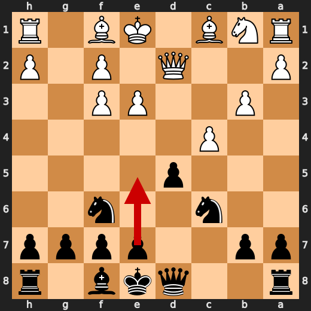
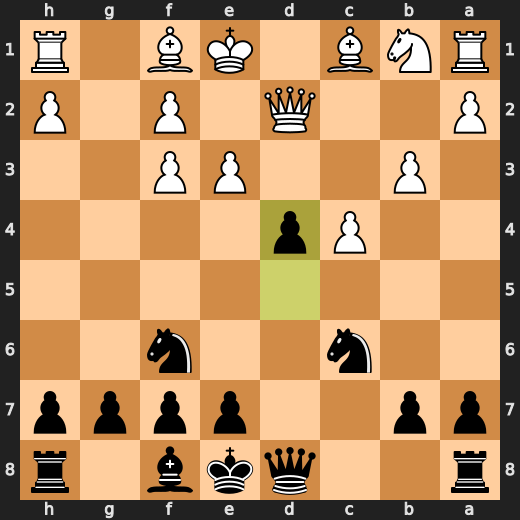
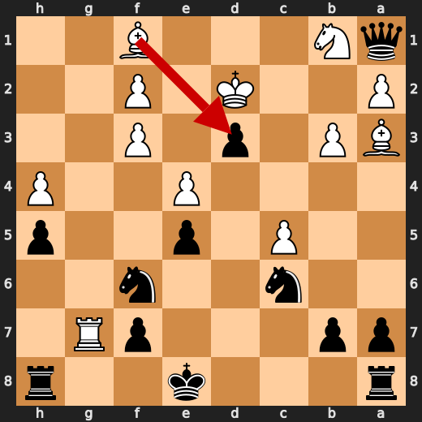
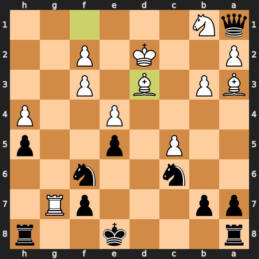

# You (Black) vs CPU (White)

**Result:** 0-1  
**Date:** 2026.05.16  
**Source:** `PGN_2026_05_16_02h13_fe2efe78df03.pgn`  
**Engine:** Stockfish depth 14  
**Your side:** Black  
**Computer side:** White  
**Board perspective:** Your perspective

---

## Who Is Who

- **You:** You (Black)
- **Computer:** CPU (5) (White)

---

## Toaster Summary

**Game Story:** White’s 10.h4 and 14.Rg1 let Black’s position become overwhelming, and 15.Rxg7 allowed a forced mating attack. Black’s 15...Qxa1 was a sloppy choice because 15...Qxf2+ was stronger, but it did not change the winning result. The lesson is to convert forcing attacks before grabbing material; after 17...Qxb3, Black still finished the game as the winner.

Biggest toaster scream: **15. Qxa1** by **You (Black)**.

- **Label:** 💀 **Blunder**
- **Eval:** Black has mate → -16.95
- **Stockfish preferred:** `Qxf2+`
- **Loss:** 98305 cp

Final move recorded: **17. Qxb3** by **You (Black)**.

- 💀 Your blunders: **1**
- ❌ Your mistakes: **0**
- ⚠️ Your inaccuracies: **0**
- ✅ Your best moves called out: **10**

---

## Final Position


---

## Key Moments

### ✅ Best: 8. gxf3 by CPU (White)

gxf3 was the engine-approved move, so White did not miss a better alternative here. It usefully resolves the forced situation, and the practical pattern is to choose the forcing recapture when it is also the preferred move.

- **Eval:** -1.82 → -1.76
- **Preferred:** `gxf3`
- **Loss:** 0 cp

**Before 8. gxf3**


**After 8. gxf3**


### ✅ Best: 8. d4 by You (Black)

d4 was a useful move that kept Black very close to the preferred choice. e5 was the engine’s slight preference, but the practical lesson is to use central pawn breaks when they improve your position.

- **Eval:** -1.69 → -1.57
- **Preferred:** `e5`
- **Loss:** 12 cp

**Before 8. d4**



**After 8. d4**



### ❌ Mistake: 10. h4 by CPU (White)

h4 failed to address White’s worsening position and led to a significant loss of ground. a3 was preferred because it would have made a more useful waiting move without creating the same deterioration. Learn to avoid flank pawn moves when the position already needs stabilization.

- **Eval:** -3.59 → -8.79
- **Preferred:** `a3`
- **Loss:** 520 cp

**Before 10. h4**


**After 10. h4**


### ❌ Mistake: 14. Rg1 by CPU (White)

Rg1 did not solve White’s already very poor position and made it deteriorate further. Bb2 was preferred because it would have developed a piece instead of spending a rook move with no clear stabilizing effect. Learn to prioritize development and stabilization when the engine shows a large negative swing.

- **Eval:** -10.44 → -16.00
- **Preferred:** `Bb2`
- **Loss:** 556 cp

**Before 14. Rg1**


**After 14. Rg1**


### 💀 Blunder: 15. Rxg7 by CPU (White)

Rxg7 failed to address Black’s decisive attacking position and made the position mate-losing. Kd1 was the preferred move because it improved White’s king situation instead of spending time on the rook capture. Learn to prioritize king safety when the evaluation swing shows a move allows forced mate.

- **Eval:** -18.30 → Black has mate
- **Preferred:** `Kd1`
- **Loss:** 98170 cp

**Before 15. Rxg7**


**After 15. Rxg7**


### 💀 Blunder: 15. Qxa1 by You (Black)

Qxa1 failed to use Black’s forced mating chance and only grabbed material. Qxf2+ was the preferred move because it keeps the decisive attack going. Learn to check forcing moves first when the engine shows a mating opportunity.

- **Eval:** Black has mate → -16.95
- **Preferred:** `Qxf2+`
- **Loss:** 98305 cp

**Before 15. Qxa1**


**After 15. Qxa1**


### ✅ Best: 16. Bxd3 by CPU (White)

Bxd3 was the preferred move, so White did not miss a stronger alternative. The useful lesson is to make the forcing engine-approved move when the position leaves no better practical choice.

- **Eval:** -17.05 → -17.07
- **Preferred:** `Bxd3`
- **Loss:** 2 cp

**Before 16. Bxd3**



**After 16. Bxd3**



### ❌ Mistake: 17. Ke3 by CPU (White)

Ke3 failed to improve White’s defensive situation and the position worsened significantly. Kc1 was preferred as the steadier king move. Learn to choose the king move that limits further deterioration when the engine already shows a losing position.

- **Eval:** -16.99 → -20.38
- **Preferred:** `Kc1`
- **Loss:** 339 cp

**Before 17. Ke3**


**After 17. Ke3**


---

## Human Notes

Biggest caveman lesson: CPU (White) blew it with **15. Rxg7**.

There was another real screw-up at **10. h4** by **CPU (White)**.

---

<details>
<summary>Compact move list</summary>

- 📖 **1. Nf3** (CPU (White), Book) — +0.39 → +0.37, preferred `e4`, loss 2 cp
- 📖 **1. d5** (You (Black), Book) — +0.31 → +0.41, preferred `d5`, loss 10 cp
- 📖 **2. d4** (CPU (White), Book) — +0.38 → +0.31, preferred `d4`, loss 7 cp
- 📖 **2. Nf6** (You (Black), Book) — +0.32 → +0.33, preferred `e6`, loss 1 cp
- 📖 **3. c4** (CPU (White), Book) — +0.36 → +0.43, preferred `c4`, loss 0 cp
- 📖 **3. c5** (You (Black), Book) — +0.41 → +0.57, preferred `dxc4`, loss 16 cp
- 🔥 **4. e3** (CPU (White), Great) — +0.63 → +0.23, preferred `cxd5`, loss 40 cp
- ✅ **4. cxd4** (You (Black), Best) — +0.25 → +0.33, preferred `cxd4`, loss 8 cp
- 👍 **5. Qxd4** (CPU (White), Good) — +0.34 → -0.59, preferred `exd4`, loss 93 cp
- ✅ **5. Nc6** (You (Black), Best) — -0.55 → -0.60, preferred `Nc6`, loss 0 cp
- 🔥 **6. Qd2** (CPU (White), Great) — -0.19 → -0.44, preferred `Qd2`, loss 25 cp
- ✅ **6. Bg4** (You (Black), Best) — -0.39 → -0.34, preferred `e5`, loss 5 cp
- ⚠️ **7. b3** (CPU (White), Inaccuracy) — -0.12 → -2.21, preferred `cxd5`, loss 209 cp
- 👍 **7. Bxf3** (You (Black), Good) — -2.56 → -1.71, preferred `e5`, loss 85 cp
- ✅ **8. gxf3** (CPU (White), Best) — -1.82 → -1.76, preferred `gxf3`, loss 0 cp
- ✅ **8. d4** (You (Black), Best) — -1.69 → -1.57, preferred `e5`, loss 12 cp
- ⚠️ **9. e4** (CPU (White), Inaccuracy) — -1.48 → -3.61, preferred `Bg2`, loss 213 cp
- ✅ **9. e5** (You (Black), Best) — -3.47 → -3.50, preferred `a5`, loss 0 cp
- ❌ **10. h4** (CPU (White), Mistake) — -3.59 → -8.79, preferred `a3`, loss 520 cp
- ✅ **10. Bb4** (You (Black), Best) — -8.92 → -9.07, preferred `Bb4`, loss 0 cp
- 👍 **11. Ba3** (CPU (White), Good) — -8.69 → -9.67, preferred `h5`, loss 98 cp
- ✅ **11. Bxd2+** (You (Black), Best) — -9.28 → -9.36, preferred `Bxd2+`, loss 0 cp
- 👍 **12. Kxd2** (CPU (White), Good) — -8.87 → -9.61, preferred `Nxd2`, loss 74 cp
- 👍 **12. h5** (You (Black), Good) — -9.92 → -8.80, preferred `d3`, loss 112 cp
- ⚠️ **13. c5** (CPU (White), Inaccuracy) — -8.96 → -10.76, preferred `Ke1`, loss 180 cp
- 🔥 **13. d3** (You (Black), Great) — -10.97 → -10.66, preferred `Qa5+`, loss 31 cp
- ❌ **14. Rg1** (CPU (White), Mistake) — -10.44 → -16.00, preferred `Bb2`, loss 556 cp
- ✅ **14. Qd4** (You (Black), Best) — -16.02 → -17.45, preferred `Qd4`, loss 0 cp
- 💀 **15. Rxg7** (CPU (White), Blunder) — -18.30 → Black has mate, preferred `Kd1`, loss 98170 cp
- 💀 **15. Qxa1** (You (Black), Blunder) — Black has mate → -16.95, preferred `Qxf2+`, loss 98305 cp
- ✅ **16. Bxd3** (CPU (White), Best) — -17.05 → -17.07, preferred `Bxd3`, loss 2 cp
- ✅ **16. Qxa2+** (You (Black), Best) — -17.13 → -17.13, preferred `Qxa2+`, loss 0 cp
- ❌ **17. Ke3** (CPU (White), Mistake) — -16.99 → -20.38, preferred `Kc1`, loss 339 cp
- ✅ **17. Qxb3** (You (Black), Best) — -20.38 → -24.66, preferred `Qxb3`, loss 0 cp

</details>

---

<details>
<summary>Raw engine table</summary>

| Ply | Move | Actor | Played | Label | Eval Before | Eval After | Preferred | Loss |
|---:|---:|---|---|---|---:|---:|---|---:|
| 1 | 1 | CPU (White) | Nf3 | Book | +0.39 | +0.37 | e4 | 2 |
| 2 | 1 | You (Black) | d5 | Book | +0.31 | +0.41 | d5 | 10 |
| 3 | 2 | CPU (White) | d4 | Book | +0.38 | +0.31 | d4 | 7 |
| 4 | 2 | You (Black) | Nf6 | Book | +0.32 | +0.33 | e6 | 1 |
| 5 | 3 | CPU (White) | c4 | Book | +0.36 | +0.43 | c4 | 0 |
| 6 | 3 | You (Black) | c5 | Book | +0.41 | +0.57 | dxc4 | 16 |
| 7 | 4 | CPU (White) | e3 | Great | +0.63 | +0.23 | cxd5 | 40 |
| 8 | 4 | You (Black) | cxd4 | Best | +0.25 | +0.33 | cxd4 | 8 |
| 9 | 5 | CPU (White) | Qxd4 | Good | +0.34 | -0.59 | exd4 | 93 |
| 10 | 5 | You (Black) | Nc6 | Best | -0.55 | -0.60 | Nc6 | 0 |
| 11 | 6 | CPU (White) | Qd2 | Great | -0.19 | -0.44 | Qd2 | 25 |
| 12 | 6 | You (Black) | Bg4 | Best | -0.39 | -0.34 | e5 | 5 |
| 13 | 7 | CPU (White) | b3 | Inaccuracy | -0.12 | -2.21 | cxd5 | 209 |
| 14 | 7 | You (Black) | Bxf3 | Good | -2.56 | -1.71 | e5 | 85 |
| 15 | 8 | CPU (White) | gxf3 | Best | -1.82 | -1.76 | gxf3 | 0 |
| 16 | 8 | You (Black) | d4 | Best | -1.69 | -1.57 | e5 | 12 |
| 17 | 9 | CPU (White) | e4 | Inaccuracy | -1.48 | -3.61 | Bg2 | 213 |
| 18 | 9 | You (Black) | e5 | Best | -3.47 | -3.50 | a5 | 0 |
| 19 | 10 | CPU (White) | h4 | Mistake | -3.59 | -8.79 | a3 | 520 |
| 20 | 10 | You (Black) | Bb4 | Best | -8.92 | -9.07 | Bb4 | 0 |
| 21 | 11 | CPU (White) | Ba3 | Good | -8.69 | -9.67 | h5 | 98 |
| 22 | 11 | You (Black) | Bxd2+ | Best | -9.28 | -9.36 | Bxd2+ | 0 |
| 23 | 12 | CPU (White) | Kxd2 | Good | -8.87 | -9.61 | Nxd2 | 74 |
| 24 | 12 | You (Black) | h5 | Good | -9.92 | -8.80 | d3 | 112 |
| 25 | 13 | CPU (White) | c5 | Inaccuracy | -8.96 | -10.76 | Ke1 | 180 |
| 26 | 13 | You (Black) | d3 | Great | -10.97 | -10.66 | Qa5+ | 31 |
| 27 | 14 | CPU (White) | Rg1 | Mistake | -10.44 | -16.00 | Bb2 | 556 |
| 28 | 14 | You (Black) | Qd4 | Best | -16.02 | -17.45 | Qd4 | 0 |
| 29 | 15 | CPU (White) | Rxg7 | Blunder | -18.30 | Black has mate | Kd1 | 98170 |
| 30 | 15 | You (Black) | Qxa1 | Blunder | Black has mate | -16.95 | Qxf2+ | 98305 |
| 31 | 16 | CPU (White) | Bxd3 | Best | -17.05 | -17.07 | Bxd3 | 2 |
| 32 | 16 | You (Black) | Qxa2+ | Best | -17.13 | -17.13 | Qxa2+ | 0 |
| 33 | 17 | CPU (White) | Ke3 | Mistake | -16.99 | -20.38 | Kc1 | 339 |
| 34 | 17 | You (Black) | Qxb3 | Best | -20.38 | -24.66 | Qxb3 | 0 |

</details>

---

<details>
<summary>Clean PGN</summary>

```pgn
[Event "AI Factory's Chess"]
[Site "Android Device"]
[Date "2026.05.16"]
[Round "1"]
[White "CPU (5)"]
[Black "You"]
[Result "0-1"]
[PlyCount "36"]

1. Nf3 d5 2. d4 Nf6 3. c4 c5 4. e3 cxd4 5. Qxd4 Nc6 6. Qd2 Bg4 7. b3 Bxf3 8.
gxf3 d4 9. e4 e5 10. h4 Bb4 11. Ba3 Bxd2+ 12. Kxd2 h5 13. c5 d3 14. Rg1 Qd4 15.
Rxg7 Qxa1 16. Bxd3 Qxa2+ 17. Ke3 Qxb3 0-1
```

</details>
