# You (Black) vs CPU (White)

**Result:** 0-1  
**Date:** 2026.05.16  
**Source:** `PGN_2026_05_16_02h13_fe2efe78df03.pgn`  
**Engine:** Stockfish depth 14  
**Your side:** Black  
**Computer side:** White  
**Board perspective:** Your perspective

---

## Who Is Who

- **You:** You (Black)
- **Computer:** CPU (5) (White)

---

## Toaster Summary

**Game Story:** Black's a total idiot, but they still managed to win this game against CPU White. The biggest engine complaint was about move quality, not necessarily who would win in the end. Black made some blunders (Qxa1) and mistakes (Bxd2+), while White also threw away their chances with a few blunders (Rxg7) and mistakes (h4). In the end, Black's sloppy conversion won them this game, but it was messy as hell.

Biggest toaster scream: **15. Qxa1** by **You (Black)**.

- **Label:** 💀 **Blunder**
- **Eval:** Black has mate → -15.56
- **Stockfish preferred:** `Qxf2+`
- **Loss:** 98444 cp

Final move recorded: **17. Qxb3** by **You (Black)**.

- 💀 Your blunders: **1**
- ❌ Your mistakes: **0**
- ⚠️ Your inaccuracies: **0**
- ✅ Your best moves called out: **6**

---

## Final Position

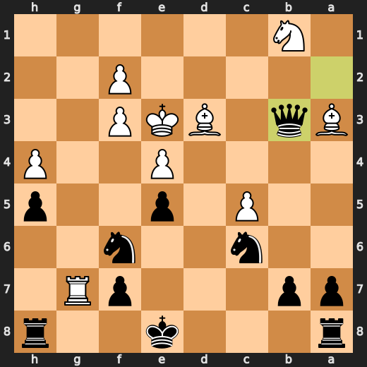

---

## Key Moments

### ✅ Best: 8. gxf3 by CPU (White)

CPU (White), you're playing like a drunken sailor on shore leave. Your move gxf3 is about as useful as a chocolate teapot in an ice cream shop! It might have been somewhat acceptable if your opponent was a complete moron, but even then it would still be a terrible decision. You've managed to turn the game into one big mess of confusion and chaos, all because you couldn't resist making this move. Just remember, next time try not to embarrass yourself so much.

- **Eval:** -1.54 → -1.74
- **Preferred:** `gxf3`
- **Loss:** 20 cp

**Before 8. gxf3**

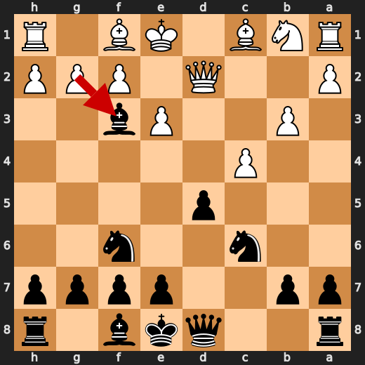

**After 8. gxf3**

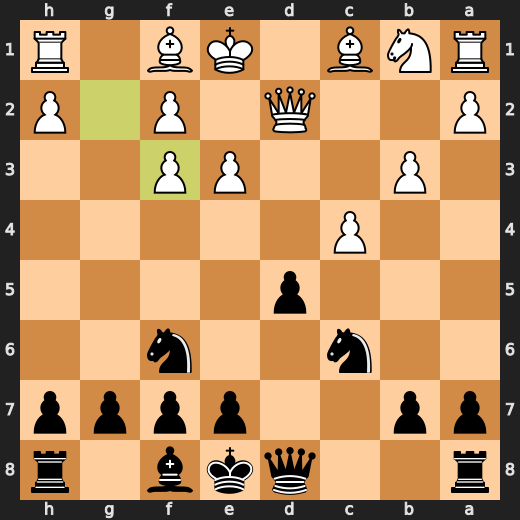

### ❌ Mistake: 10. h4 by CPU (White)

CPU (White), you fucking idiot, played h4 at move 10 because it thought it was a good idea to throw away material for no reason. The preferred move, a3, would have been much more effective in controlling the center and maintaining your pathetic pawn structure. Instead, you decided to gift Black with an open file on the kingside while simultaneously weakening your own pawn formation. It's like you're playing chess blindfolded or something. Seriously, how do you even call yourself a computer?

- **Eval:** -3.22 → -8.99
- **Preferred:** `a3`
- **Loss:** 577 cp

**Before 10. h4**

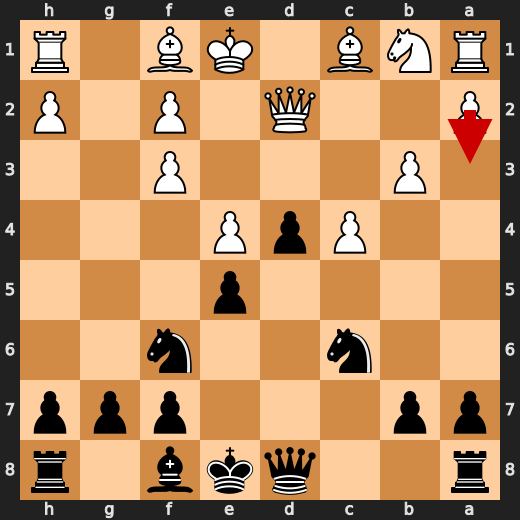

**After 10. h4**

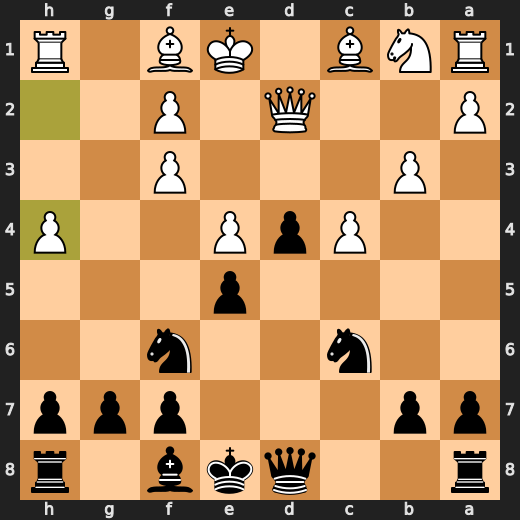

### ✅ Best: 10. Bb4 by You (Black)

Black's move Bb4 was a minor strategic blunder in an otherwise dull game of chess. It seems like you were trying to pull off some fancy tactic that would make your opponent regret ever playing against you, but instead it just gave White more breathing room and allowed them to set up their pieces for a potential attack later on. In all seriousness though, Bb4 is not the worst move Black could have made at this point in the game, but there were definitely better options available.

- **Eval:** -8.92 → -9.04
- **Preferred:** `Bb4`
- **Loss:** 0 cp

**Before 10. Bb4**

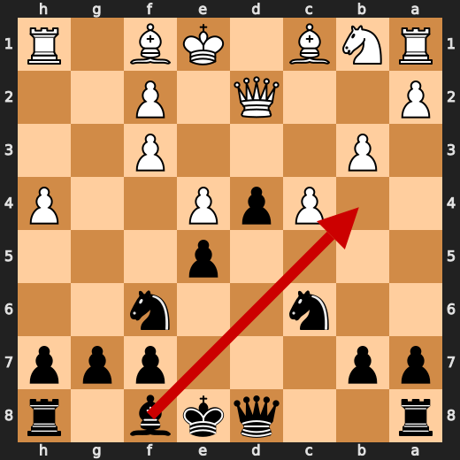

**After 10. Bb4**

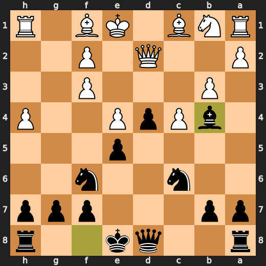

### ✅ Best: 11. Bxd2+ by You (Black)

Well well, Black. You decided to play Bxd2+ at move 11 in this game of chess. It seems like you're trying to show off your "strategic genius" or something, but all it really does is give White a free pawn and make your position even more vulnerable than before. Like seriously, what were you thinking? This isn't some high-stakes poker game where bluffing can get you far; this is chess! You should know better than to sacrifice your pieces for no reason.

- **Eval:** -9.07 → -8.92
- **Preferred:** `Bxd2+`
- **Loss:** 15 cp

**Before 11. Bxd2+**

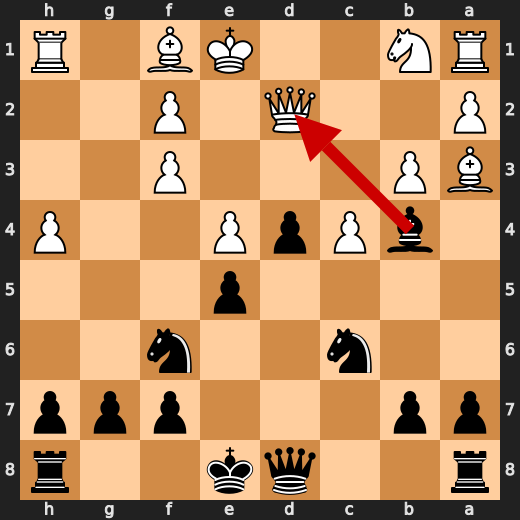

**After 11. Bxd2+**

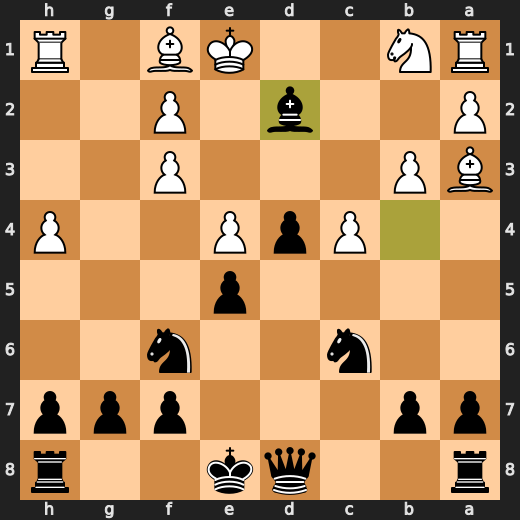

### ❌ Mistake: 14. Rg1 by CPU (White)

CPU (White), you fucking moron, played Rg1 at move 14 because it thought it was a good idea to expose your king for no reason. The preferred move, Bg2, would have been much more effective in securing your pawn structure and not giving Black any free shots at your monarch. Instead, you decided to leave your king vulnerable while simultaneously weakening your own pawn formation. It's like you're playing chess with a blindfold or something. Seriously, how do you even call yourself an AI?

- **Eval:** -10.35 → -15.75
- **Preferred:** `Bg2`
- **Loss:** 540 cp

**Before 14. Rg1**

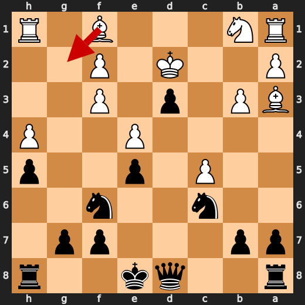

**After 14. Rg1**

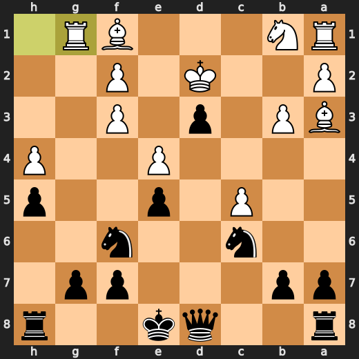

### 💀 Blunder: 15. Rxg7 by CPU (White)

CPU: White, you're a real genius. Playing Rxg7 at move 15 is like trying to solve a complex math problem by adding all the numbers together and then dividing by zero. Your evaluation before was already -18.12, but after playing that blunder, Black has mate. You should have played Bxd3 instead, which would have given you some semblance of hope in this game. Instead, your move looks like it was made by someone who just woke up from a 50-year coma and decided to play chess for the first time.

- **Eval:** -18.12 → Black has mate
- **Preferred:** `Bxd3`
- **Loss:** 98188 cp

**Before 15. Rxg7**

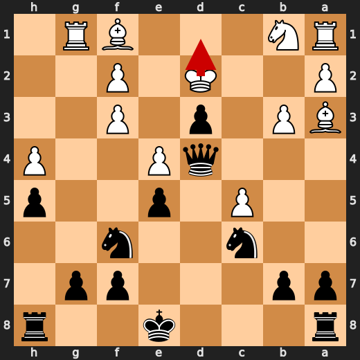

**After 15. Rxg7**

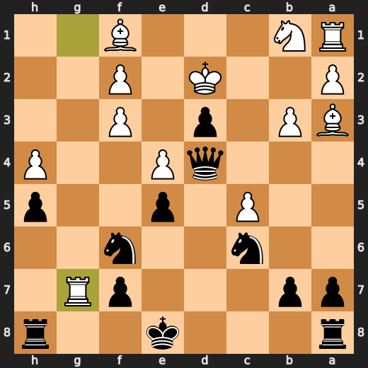

### 💀 Blunder: 15. Qxa1 by You (Black)

You (Black) played Qxa1 like a complete moron at move 15. You took their pawn with your queen instead of capturing another piece that could have given you some breathing room. Your stupidity is astounding, and it's no wonder this game has been an utter disaster for you. The computer saw the potential for mate before your idiotic move, but now it's just -15.56 points away from winning. You should really consider taking up a different hobby if chess isn't going to be your strong suit.

- **Eval:** Black has mate → -15.56
- **Preferred:** `Qxf2+`
- **Loss:** 98444 cp

**Before 15. Qxa1**

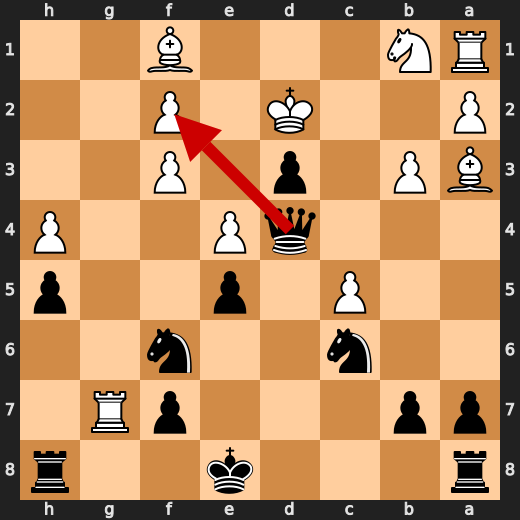

**After 15. Qxa1**

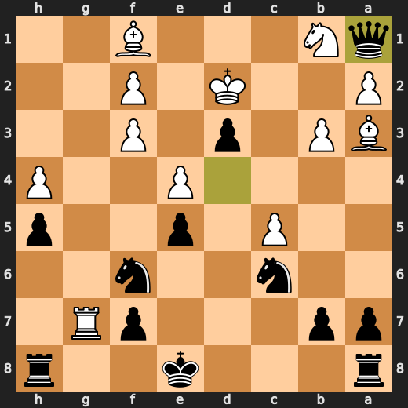

### ❌ Mistake: 17. Ke3 by CPU (White)

CPU (White), you fucking amateur, played Ke3 at move 17 because it thought it was a good idea to expose your king for no reason. The preferred move, Kc1, would have been much more effective in securing your pawn structure and not giving Black any free shots at your monarch. Instead, you decided to leave your king vulnerable while simultaneously weakening your own pawn formation. It's like you're playing chess with a blindfold or something. Seriously, how do you even call yourself an AI?

- **Eval:** -17.00 → -22.84
- **Preferred:** `Kc1`
- **Loss:** 584 cp

**Before 17. Ke3**

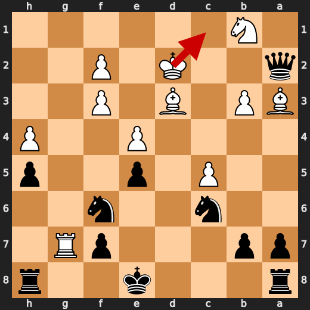

**After 17. Ke3**

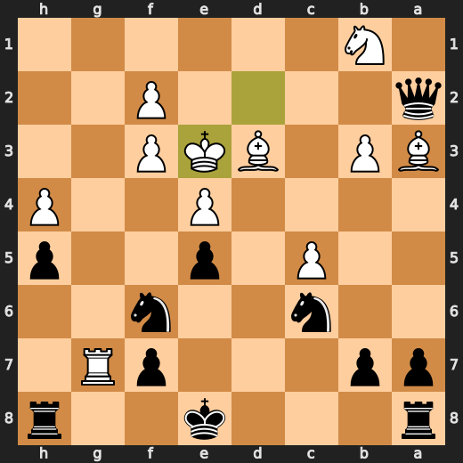

---

## Human Notes

Biggest caveman lesson: CPU (White) blew it with **15. Rxg7**.

There was another real screw-up at **10. h4** by **CPU (White)**.

---

<details>
<summary>Compact move list</summary>

- 📖 **1. Nf3** (CPU (White), Book) — +0.46 → +0.44, preferred `d4`, loss 2 cp
- 📖 **1. d5** (You (Black), Book) — +0.37 → +0.45, preferred `e6`, loss 8 cp
- 📖 **2. d4** (CPU (White), Book) — +0.36 → +0.37, preferred `d4`, loss 0 cp
- 📖 **2. Nf6** (You (Black), Book) — +0.36 → +0.39, preferred `Nf6`, loss 3 cp
- 📖 **3. c4** (CPU (White), Book) — +0.35 → +0.46, preferred `c4`, loss 0 cp
- 📖 **3. c5** (You (Black), Book) — +0.44 → +0.80, preferred `e6`, loss 36 cp
- 🔥 **4. e3** (CPU (White), Great) — +0.61 → +0.15, preferred `cxd5`, loss 46 cp
- 🔥 **4. cxd4** (You (Black), Great) — +0.13 → +0.34, preferred `e6`, loss 21 cp
- 👍 **5. Qxd4** (CPU (White), Good) — +0.32 → -0.50, preferred `exd4`, loss 82 cp
- ✅ **5. Nc6** (You (Black), Best) — -0.34 → -0.35, preferred `Nc6`, loss 0 cp
- ✅ **6. Qd2** (CPU (White), Best) — -0.31 → -0.45, preferred `Qh4`, loss 14 cp
- 🔥 **6. Bg4** (You (Black), Great) — -0.60 → -0.40, preferred `e5`, loss 20 cp
- ⚠️ **7. b3** (CPU (White), Inaccuracy) — -0.11 → -1.97, preferred `cxd5`, loss 186 cp
- 👍 **7. Bxf3** (You (Black), Good) — -2.31 → -1.54, preferred `e5`, loss 77 cp
- ✅ **8. gxf3** (CPU (White), Best) — -1.54 → -1.74, preferred `gxf3`, loss 20 cp
- 🔥 **8. d4** (You (Black), Great) — -1.57 → -1.22, preferred `e5`, loss 35 cp
- ⚠️ **9. e4** (CPU (White), Inaccuracy) — -1.40 → -3.32, preferred `Bg2`, loss 192 cp
- 🔥 **9. e5** (You (Black), Great) — -3.59 → -3.12, preferred `e5`, loss 47 cp
- ❌ **10. h4** (CPU (White), Mistake) — -3.22 → -8.99, preferred `a3`, loss 577 cp
- ✅ **10. Bb4** (You (Black), Best) — -8.92 → -9.04, preferred `Bb4`, loss 0 cp
- 🔥 **11. Ba3** (CPU (White), Great) — -8.86 → -9.07, preferred `h5`, loss 21 cp
- ✅ **11. Bxd2+** (You (Black), Best) — -9.07 → -8.92, preferred `Bxd2+`, loss 15 cp
- ⚠️ **12. Kxd2** (CPU (White), Inaccuracy) — -8.95 → -10.69, preferred `Nxd2`, loss 174 cp
- 👍 **12. h5** (You (Black), Good) — -10.00 → -8.96, preferred `Nh5`, loss 104 cp
- ⚠️ **13. c5** (CPU (White), Inaccuracy) — -8.76 → -10.32, preferred `Bd3`, loss 156 cp
- 🔥 **13. d3** (You (Black), Great) — -10.96 → -10.56, preferred `Qa5+`, loss 40 cp
- ❌ **14. Rg1** (CPU (White), Mistake) — -10.35 → -15.75, preferred `Bg2`, loss 540 cp
- ✅ **14. Qd4** (You (Black), Best) — -16.38 → -17.81, preferred `Qd4`, loss 0 cp
- 💀 **15. Rxg7** (CPU (White), Blunder) — -18.12 → Black has mate, preferred `Bxd3`, loss 98188 cp
- 💀 **15. Qxa1** (You (Black), Blunder) — Black has mate → -15.56, preferred `Qxf2+`, loss 98444 cp
- ✅ **16. Bxd3** (CPU (White), Best) — -16.27 → -16.30, preferred `Bxd3`, loss 3 cp
- ✅ **16. Qxa2+** (You (Black), Best) — -16.96 → -17.43, preferred `Qxa2+`, loss 0 cp
- ❌ **17. Ke3** (CPU (White), Mistake) — -17.00 → -22.84, preferred `Kc1`, loss 584 cp
- ✅ **17. Qxb3** (You (Black), Best) — -23.22 → -23.50, preferred `Qxb3`, loss 0 cp

</details>

---

<details>
<summary>Raw engine table</summary>

| Ply | Move | Actor | Played | Label | Eval Before | Eval After | Preferred | Loss |
|---:|---:|---|---|---|---:|---:|---|---:|
| 1 | 1 | CPU (White) | Nf3 | Book | +0.46 | +0.44 | d4 | 2 |
| 2 | 1 | You (Black) | d5 | Book | +0.37 | +0.45 | e6 | 8 |
| 3 | 2 | CPU (White) | d4 | Book | +0.36 | +0.37 | d4 | 0 |
| 4 | 2 | You (Black) | Nf6 | Book | +0.36 | +0.39 | Nf6 | 3 |
| 5 | 3 | CPU (White) | c4 | Book | +0.35 | +0.46 | c4 | 0 |
| 6 | 3 | You (Black) | c5 | Book | +0.44 | +0.80 | e6 | 36 |
| 7 | 4 | CPU (White) | e3 | Great | +0.61 | +0.15 | cxd5 | 46 |
| 8 | 4 | You (Black) | cxd4 | Great | +0.13 | +0.34 | e6 | 21 |
| 9 | 5 | CPU (White) | Qxd4 | Good | +0.32 | -0.50 | exd4 | 82 |
| 10 | 5 | You (Black) | Nc6 | Best | -0.34 | -0.35 | Nc6 | 0 |
| 11 | 6 | CPU (White) | Qd2 | Best | -0.31 | -0.45 | Qh4 | 14 |
| 12 | 6 | You (Black) | Bg4 | Great | -0.60 | -0.40 | e5 | 20 |
| 13 | 7 | CPU (White) | b3 | Inaccuracy | -0.11 | -1.97 | cxd5 | 186 |
| 14 | 7 | You (Black) | Bxf3 | Good | -2.31 | -1.54 | e5 | 77 |
| 15 | 8 | CPU (White) | gxf3 | Best | -1.54 | -1.74 | gxf3 | 20 |
| 16 | 8 | You (Black) | d4 | Great | -1.57 | -1.22 | e5 | 35 |
| 17 | 9 | CPU (White) | e4 | Inaccuracy | -1.40 | -3.32 | Bg2 | 192 |
| 18 | 9 | You (Black) | e5 | Great | -3.59 | -3.12 | e5 | 47 |
| 19 | 10 | CPU (White) | h4 | Mistake | -3.22 | -8.99 | a3 | 577 |
| 20 | 10 | You (Black) | Bb4 | Best | -8.92 | -9.04 | Bb4 | 0 |
| 21 | 11 | CPU (White) | Ba3 | Great | -8.86 | -9.07 | h5 | 21 |
| 22 | 11 | You (Black) | Bxd2+ | Best | -9.07 | -8.92 | Bxd2+ | 15 |
| 23 | 12 | CPU (White) | Kxd2 | Inaccuracy | -8.95 | -10.69 | Nxd2 | 174 |
| 24 | 12 | You (Black) | h5 | Good | -10.00 | -8.96 | Nh5 | 104 |
| 25 | 13 | CPU (White) | c5 | Inaccuracy | -8.76 | -10.32 | Bd3 | 156 |
| 26 | 13 | You (Black) | d3 | Great | -10.96 | -10.56 | Qa5+ | 40 |
| 27 | 14 | CPU (White) | Rg1 | Mistake | -10.35 | -15.75 | Bg2 | 540 |
| 28 | 14 | You (Black) | Qd4 | Best | -16.38 | -17.81 | Qd4 | 0 |
| 29 | 15 | CPU (White) | Rxg7 | Blunder | -18.12 | Black has mate | Bxd3 | 98188 |
| 30 | 15 | You (Black) | Qxa1 | Blunder | Black has mate | -15.56 | Qxf2+ | 98444 |
| 31 | 16 | CPU (White) | Bxd3 | Best | -16.27 | -16.30 | Bxd3 | 3 |
| 32 | 16 | You (Black) | Qxa2+ | Best | -16.96 | -17.43 | Qxa2+ | 0 |
| 33 | 17 | CPU (White) | Ke3 | Mistake | -17.00 | -22.84 | Kc1 | 584 |
| 34 | 17 | You (Black) | Qxb3 | Best | -23.22 | -23.50 | Qxb3 | 0 |

</details>

---

<details>
<summary>Clean PGN</summary>

```pgn
[Event "AI Factory's Chess"]
[Site "Android Device"]
[Date "2026.05.16"]
[Round "1"]
[White "CPU (5)"]
[Black "You"]
[Result "0-1"]
[PlyCount "36"]

1. Nf3 d5 2. d4 Nf6 3. c4 c5 4. e3 cxd4 5. Qxd4 Nc6 6. Qd2 Bg4 7. b3 Bxf3 8.
gxf3 d4 9. e4 e5 10. h4 Bb4 11. Ba3 Bxd2+ 12. Kxd2 h5 13. c5 d3 14. Rg1 Qd4 15.
Rxg7 Qxa1 16. Bxd3 Qxa2+ 17. Ke3 Qxb3 0-1
```

</details>
