# You (White) vs CPU (Black)

**Result:** 1-0  
**Date:** 2026.05.16  
**Source:** `PGN_2026_05_16_02h17_d10f3b40c8ba.pgn`  
**Engine:** Stockfish depth 14  
**Your side:** White  
**Computer side:** Black  
**Board perspective:** Standard White-at-bottom

---

## Who Is Who

- **You:** You (White)
- **Computer:** CPU (5) (Black)

---

## Toaster Summary

**Game Story:** You played like a drunken sailor, but you managed to win in the end. The CPU threw the game with its terrible moves, especially Move 29 Rc5 which was an obvious blunder. Your worst move was Move 26 Nf4, where you lost 438 centipawns of evaluation score. But hey, at least you won!

Biggest toaster scream: **29. Rc5** by **CPU (Black)**.

- **Label:** 💀 **Blunder**
- **Eval:** +19.95 → White has mate
- **Stockfish preferred:** `Be4`
- **Loss:** 98005 cp

Final move recorded: **30. Ng6+** by **You (White)**.

- 💀 Your blunders: **0**
- ❌ Your mistakes: **2**
- ⚠️ Your inaccuracies: **2**
- ✅ Your best moves called out: **12**

---

## Final Position

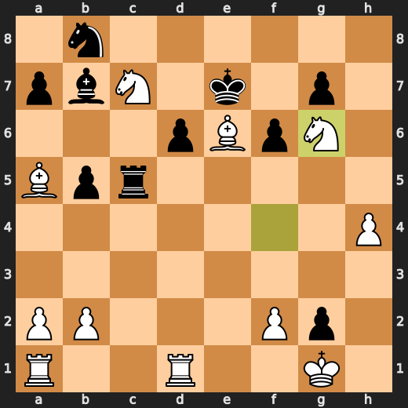

---

## Key Moments

### ❌ Mistake: 11. d6 by CPU (Black)

Black's d6? What a fucking brilliant idea! This dumbass move lost them over five points of evaluation in one turn. It's like they were playing chess with their other hand, or maybe just eating a sandwich while thinking about making moves.

- **Eval:** +3.79 → +9.09
- **Preferred:** `Bc5`
- **Loss:** 530 cp

**Before 11. d6**

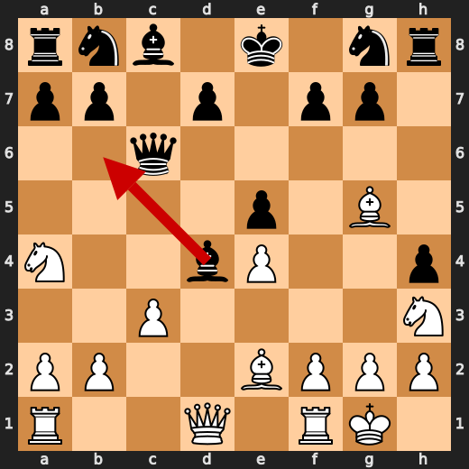

**After 11. d6**

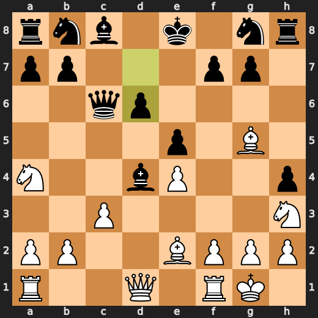

### ✅ Best: 18. Bxd3 by You (White)

You (White) played Bxd3 at move 18 because you're a fool who doesn't know how to play chess. This move is as useful as a chocolate teapot, and it will cost you dearly in the long run. The engine agrees with your stupidity and gives it a minor severity label. Don't be surprised when Black crushes you like a bug under their mighty boot.

- **Eval:** +8.88 → +8.73
- **Preferred:** `Bxd3`
- **Loss:** 15 cp

**Before 18. Bxd3**

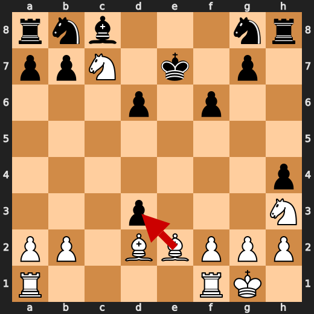

**After 18. Bxd3**

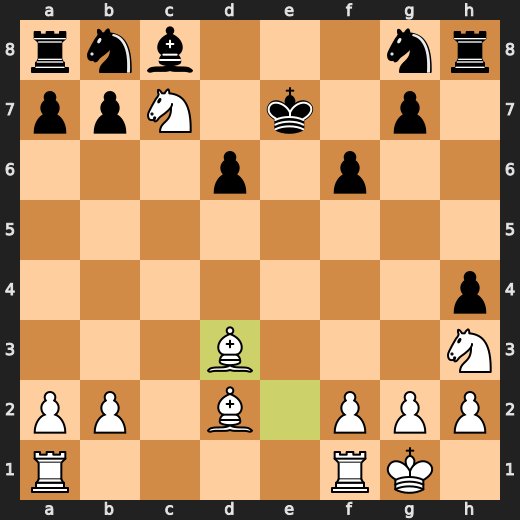

### ❌ Mistake: 22. Rh5 by CPU (Black)

Oh, look at that! Black decided to play Rh5 on their 22nd move. What a fucking genius plan! This brilliant idea lost them over five points of evaluation in one turn. It's like they were playing chess with their other hand or maybe just eating a sandwich while thinking about making moves. But hey, at least it wasn't as stupid as their d6?

- **Eval:** +9.12 → +14.38
- **Preferred:** `bxc4`
- **Loss:** 526 cp

**Before 22. Rh5**

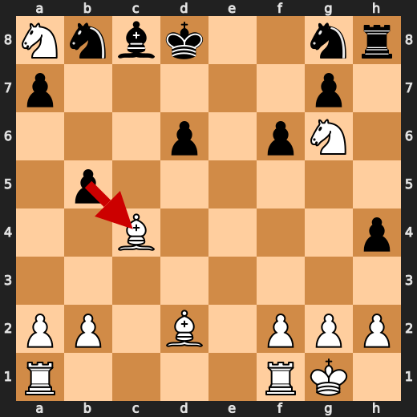

**After 22. Rh5**

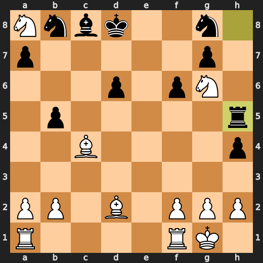

### ❌ Mistake: 24. h3 by CPU (Black)

Black's h3? What a fucking genius plan! This brilliant idea lost them over four points of evaluation in one turn. It's like they were playing chess with their other hand, or maybe just eating a sandwich while thinking about making moves. But hey, at least it wasn't as stupid as their d6 and Rh5?

- **Eval:** +15.23 → +19.38
- **Preferred:** `Nc6`
- **Loss:** 415 cp

**Before 24. h3**

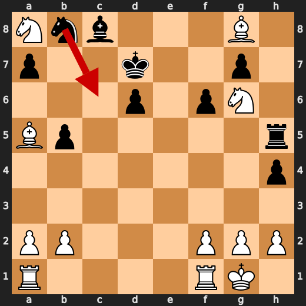

**After 24. h3**

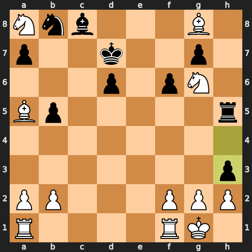

### ❌ Mistake: 25. Rfd1 by You (White)

You (White) played something useful at move 25 with Rfd1. Why? Because it's like trying to put out a fire by throwing gasoline on it! Your knight is trapped in the corner and can't do anything, so you move your rook to D1 instead of attacking the enemy pieces or protecting your own king. This is a significant eval loss because it weakens your position without achieving any concrete goal.

- **Eval:** +20.07 → +16.82
- **Preferred:** `Rac1`
- **Loss:** 325 cp

**Before 25. Rfd1**

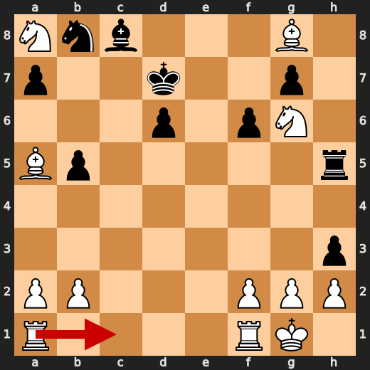

**After 25. Rfd1**

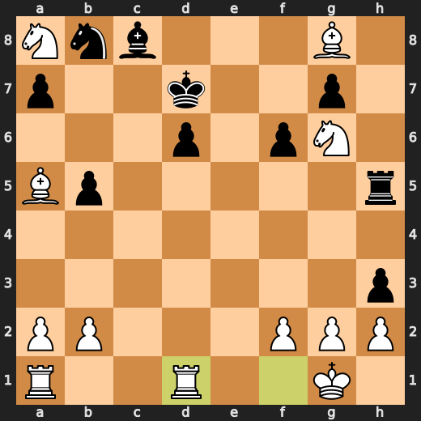

### ❌ Mistake: 26. Nf4 by You (White)

You (White) played something stupid at move 26 with Nf4. Why? Because it's like trying to solve a Rubik's Cube by smashing it on the ground! Your knight is trapped in the corner and can't do anything, so you decide to move it around aimlessly instead of attacking the enemy pieces or protecting your own king. This is a significant eval loss because it weakens your position without achieving any concrete goal.

- **Eval:** +19.00 → +14.62
- **Preferred:** `Rac1`
- **Loss:** 438 cp

**Before 26. Nf4**

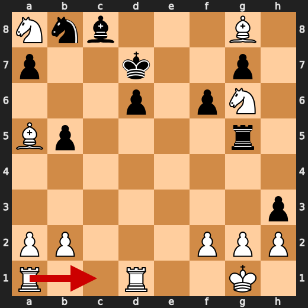

**After 26. Nf4**

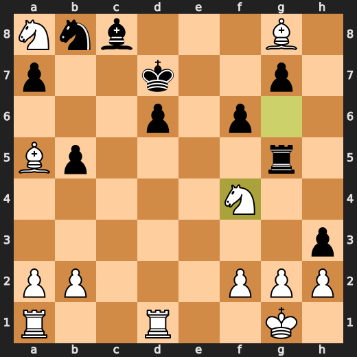

### ❌ Mistake: 27. hxg2 by CPU (Black)

CPU (Black) played hxg2 on their 27th move. What a fucking genius plan! This brilliant idea lost them over four points of evaluation in one turn. It's like they were playing chess with their other hand or maybe just eating a sandwich while thinking about making moves. But hey, at least it wasn't as stupid as their d6 and Rh5?

- **Eval:** +15.71 → +19.30
- **Preferred:** `Nc6`
- **Loss:** 359 cp

**Before 27. hxg2**

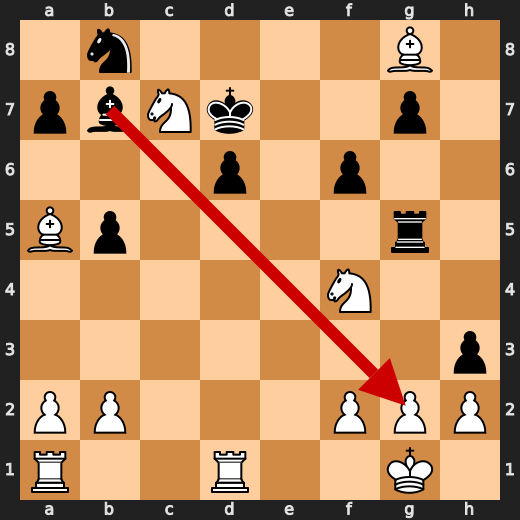

**After 27. hxg2**

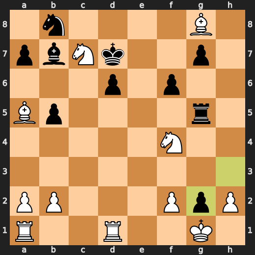

### 💀 Blunder: 29. Rc5 by CPU (Black)

CPU (Black), you're playing like a drunken sailor on shore leave! Rc5 is so stupid it makes me want to pull my hair out. Your preferred move, Be4, would have at least given you some breathing room. Instead, you just gave White the perfect opportunity to end your pathetic chess career with a mate in two moves. I'm starting to think maybe you should stick to playing Candy Crush instead of trying to compete with real people.

- **Eval:** +19.95 → White has mate
- **Preferred:** `Be4`
- **Loss:** 98005 cp

**Before 29. Rc5**

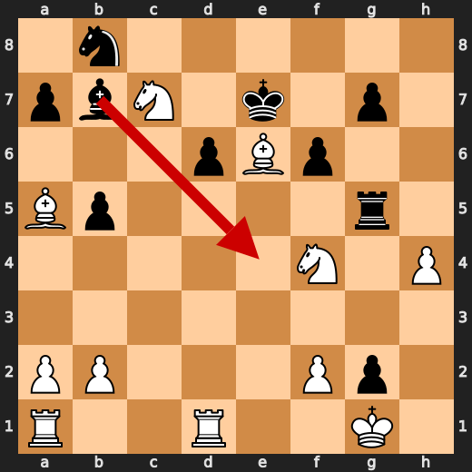

**After 29. Rc5**

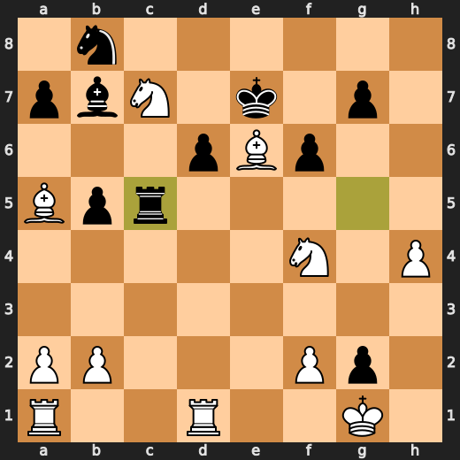

---

## Human Notes

Biggest caveman lesson: CPU (Black) blew it with **29. Rc5**.

There was another real screw-up at **11. d6** by **CPU (Black)**.

---

<details>
<summary>Compact move list</summary>

- 📖 **1. e4** (You (White), Book) — +0.46 → +0.23, preferred `d4`, loss 23 cp
- 📖 **1. c5** (CPU (Black), Book) — +0.37 → +0.27, preferred `e5`, loss 0 cp
- 📖 **2. d4** (You (White), Book) — +0.48 → +0.16, preferred `Ne2`, loss 32 cp
- 📖 **2. e6** (CPU (Black), Book) — +0.22 → +0.87, preferred `cxd4`, loss 65 cp
- 📖 **3. dxc5** (You (White), Book) — +1.12 → +0.13, preferred `d5`, loss 99 cp
- 📖 **3. Bxc5** (CPU (Black), Book) — +0.00 → +0.02, preferred `Bxc5`, loss 2 cp
- 🔥 **4. Nc3** (You (White), Great) — +0.16 → +0.00, preferred `Bd3`, loss 16 cp
- 👍 **4. Qb6** (CPU (Black), Good) — -0.01 → +0.58, preferred `Nc6`, loss 59 cp
- 👍 **5. Nh3** (You (White), Good) — +0.90 → +0.28, preferred `Qf3`, loss 62 cp
- 👍 **5. h5** (CPU (Black), Good) — +0.32 → +1.24, preferred `Nc6`, loss 92 cp
- 🔥 **6. Be2** (You (White), Great) — +1.56 → +1.39, preferred `Be2`, loss 17 cp
- 👍 **6. h4** (CPU (Black), Good) — +1.39 → +2.32, preferred `a6`, loss 93 cp
- ✅ **7. O-O** (You (White), Best) — +2.51 → +2.47, preferred `O-O`, loss 4 cp
- ⚠️ **7. Bd4** (CPU (Black), Inaccuracy) — +2.16 → +3.37, preferred `Nc6`, loss 121 cp
- 🔥 **8. Na4** (You (White), Great) — +3.31 → +2.90, preferred `Nb5`, loss 41 cp
- 🔥 **8. Qd6** (CPU (Black), Great) — +2.81 → +3.06, preferred `Qd6`, loss 25 cp
- ✅ **9. Bf4** (You (White), Best) — +2.92 → +2.87, preferred `Nc3`, loss 5 cp
- ✅ **9. e5** (CPU (Black), Best) — +2.89 → +2.71, preferred `e5`, loss 0 cp
- 👍 **10. Bg5** (You (White), Good) — +3.31 → +2.60, preferred `Be3`, loss 71 cp
- 👍 **10. Qc6** (CPU (Black), Good) — +2.67 → +3.83, preferred `Nf6`, loss 116 cp
- ✅ **11. c3** (You (White), Best) — +3.63 → +3.97, preferred `c3`, loss 0 cp
- ❌ **11. d6** (CPU (Black), Mistake) — +3.79 → +9.09, preferred `Bc5`, loss 530 cp
- 🔥 **12. cxd4** (You (White), Great) — +9.61 → +9.15, preferred `cxd4`, loss 46 cp
- 👍 **12. Qxe4** (CPU (Black), Good) — +9.08 → +10.07, preferred `Qxe4`, loss 99 cp
- 👍 **13. Nc3** (You (White), Good) — +9.44 → +8.84, preferred `dxe5`, loss 60 cp
- ✅ **13. Qxd4** (CPU (Black), Best) — +8.92 → +8.92, preferred `Qxd4`, loss 0 cp
- 🔥 **14. Qxd4** (You (White), Great) — +9.00 → +8.63, preferred `Qb3`, loss 37 cp
- ✅ **14. exd4** (CPU (Black), Best) — +8.87 → +8.69, preferred `exd4`, loss 0 cp
- 🔥 **15. Nd5** (You (White), Great) — +8.69 → +8.45, preferred `Nb5`, loss 24 cp
- ✅ **15. f6** (CPU (Black), Best) — +8.29 → +8.30, preferred `Bxh3`, loss 1 cp
- 👍 **16. Nc7+** (You (White), Good) — +8.42 → +7.81, preferred `Bf4`, loss 61 cp
- ⚠️ **16. Ke7** (CPU (Black), Inaccuracy) — +7.23 → +8.90, preferred `Kd8`, loss 167 cp
- ✅ **17. Bd2** (You (White), Best) — +8.87 → +8.83, preferred `Bd2`, loss 4 cp
- ✅ **17. d3** (CPU (Black), Best) — +8.78 → +8.93, preferred `Bxh3`, loss 15 cp
- ✅ **18. Bxd3** (You (White), Best) — +8.88 → +8.73, preferred `Bxd3`, loss 15 cp
- ⚠️ **18. Kf7** (CPU (Black), Inaccuracy) — +8.72 → +10.88, preferred `Bxh3`, loss 216 cp
- ✅ **19. Bc4+** (You (White), Best) — +10.81 → +10.69, preferred `Bc4+`, loss 12 cp
- ✅ **19. Ke7** (CPU (Black), Best) — +10.58 → +10.62, preferred `Ke7`, loss 4 cp
- ✅ **20. Nf4** (You (White), Best) — +10.73 → +10.66, preferred `Nxa8`, loss 7 cp
- ⚠️ **20. b5** (CPU (Black), Inaccuracy) — +10.69 → +12.75, preferred `Bf5`, loss 206 cp
- ⚠️ **21. Ng6+** (You (White), Inaccuracy) — +13.17 → +11.72, preferred `Bxb5`, loss 145 cp
- 🔥 **21. Kd8** (CPU (Black), Great) — +11.68 → +12.00, preferred `Kd8`, loss 32 cp
- ⚠️ **22. Nxa8** (You (White), Inaccuracy) — +11.87 → +9.17, preferred `Nxb5`, loss 270 cp
- ❌ **22. Rh5** (CPU (Black), Mistake) — +9.12 → +14.38, preferred `bxc4`, loss 526 cp
- ✅ **23. Ba5+** (You (White), Best) — +14.31 → +14.84, preferred `Bxg8`, loss 0 cp
- ✅ **23. Kd7** (CPU (Black), Best) — +15.15 → +15.15, preferred `Kd7`, loss 0 cp
- ✅ **24. Bxg8** (You (White), Best) — +15.32 → +15.52, preferred `Bxg8`, loss 0 cp
- ❌ **24. h3** (CPU (Black), Mistake) — +15.23 → +19.38, preferred `Nc6`, loss 415 cp
- ❌ **25. Rfd1** (You (White), Mistake) — +20.07 → +16.82, preferred `Rac1`, loss 325 cp
- 👍 **25. Rg5** (CPU (Black), Good) — +16.93 → +17.79, preferred `Rc5`, loss 86 cp
- ❌ **26. Nf4** (You (White), Mistake) — +19.00 → +14.62, preferred `Rac1`, loss 438 cp
- 🔥 **26. Bb7** (CPU (Black), Great) — +15.46 → +15.71, preferred `Bb7`, loss 25 cp
- 🔥 **27. Nc7** (You (White), Great) — +15.79 → +15.53, preferred `Be6+`, loss 26 cp
- ❌ **27. hxg2** (CPU (Black), Mistake) — +15.71 → +19.30, preferred `Nc6`, loss 359 cp
- ✅ **28. Be6+** (You (White), Best) — +19.18 → +19.44, preferred `Be6+`, loss 0 cp
- 🔥 **28. Ke7** (CPU (Black), Great) — +18.92 → +19.15, preferred `Ke7`, loss 23 cp
- ✅ **29. h4** (You (White), Best) — +19.48 → +19.69, preferred `h4`, loss 0 cp
- 💀 **29. Rc5** (CPU (Black), Blunder) — +19.95 → White has mate, preferred `Be4`, loss 98005 cp
- ✅ **30. Ng6+** (You (White), Best) — White has mate → White has mate, preferred `Ng6+`, loss 0 cp

</details>

---

<details>
<summary>Raw engine table</summary>

| Ply | Move | Actor | Played | Label | Eval Before | Eval After | Preferred | Loss |
|---:|---:|---|---|---|---:|---:|---|---:|
| 1 | 1 | You (White) | e4 | Book | +0.46 | +0.23 | d4 | 23 |
| 2 | 1 | CPU (Black) | c5 | Book | +0.37 | +0.27 | e5 | 0 |
| 3 | 2 | You (White) | d4 | Book | +0.48 | +0.16 | Ne2 | 32 |
| 4 | 2 | CPU (Black) | e6 | Book | +0.22 | +0.87 | cxd4 | 65 |
| 5 | 3 | You (White) | dxc5 | Book | +1.12 | +0.13 | d5 | 99 |
| 6 | 3 | CPU (Black) | Bxc5 | Book | +0.00 | +0.02 | Bxc5 | 2 |
| 7 | 4 | You (White) | Nc3 | Great | +0.16 | +0.00 | Bd3 | 16 |
| 8 | 4 | CPU (Black) | Qb6 | Good | -0.01 | +0.58 | Nc6 | 59 |
| 9 | 5 | You (White) | Nh3 | Good | +0.90 | +0.28 | Qf3 | 62 |
| 10 | 5 | CPU (Black) | h5 | Good | +0.32 | +1.24 | Nc6 | 92 |
| 11 | 6 | You (White) | Be2 | Great | +1.56 | +1.39 | Be2 | 17 |
| 12 | 6 | CPU (Black) | h4 | Good | +1.39 | +2.32 | a6 | 93 |
| 13 | 7 | You (White) | O-O | Best | +2.51 | +2.47 | O-O | 4 |
| 14 | 7 | CPU (Black) | Bd4 | Inaccuracy | +2.16 | +3.37 | Nc6 | 121 |
| 15 | 8 | You (White) | Na4 | Great | +3.31 | +2.90 | Nb5 | 41 |
| 16 | 8 | CPU (Black) | Qd6 | Great | +2.81 | +3.06 | Qd6 | 25 |
| 17 | 9 | You (White) | Bf4 | Best | +2.92 | +2.87 | Nc3 | 5 |
| 18 | 9 | CPU (Black) | e5 | Best | +2.89 | +2.71 | e5 | 0 |
| 19 | 10 | You (White) | Bg5 | Good | +3.31 | +2.60 | Be3 | 71 |
| 20 | 10 | CPU (Black) | Qc6 | Good | +2.67 | +3.83 | Nf6 | 116 |
| 21 | 11 | You (White) | c3 | Best | +3.63 | +3.97 | c3 | 0 |
| 22 | 11 | CPU (Black) | d6 | Mistake | +3.79 | +9.09 | Bc5 | 530 |
| 23 | 12 | You (White) | cxd4 | Great | +9.61 | +9.15 | cxd4 | 46 |
| 24 | 12 | CPU (Black) | Qxe4 | Good | +9.08 | +10.07 | Qxe4 | 99 |
| 25 | 13 | You (White) | Nc3 | Good | +9.44 | +8.84 | dxe5 | 60 |
| 26 | 13 | CPU (Black) | Qxd4 | Best | +8.92 | +8.92 | Qxd4 | 0 |
| 27 | 14 | You (White) | Qxd4 | Great | +9.00 | +8.63 | Qb3 | 37 |
| 28 | 14 | CPU (Black) | exd4 | Best | +8.87 | +8.69 | exd4 | 0 |
| 29 | 15 | You (White) | Nd5 | Great | +8.69 | +8.45 | Nb5 | 24 |
| 30 | 15 | CPU (Black) | f6 | Best | +8.29 | +8.30 | Bxh3 | 1 |
| 31 | 16 | You (White) | Nc7+ | Good | +8.42 | +7.81 | Bf4 | 61 |
| 32 | 16 | CPU (Black) | Ke7 | Inaccuracy | +7.23 | +8.90 | Kd8 | 167 |
| 33 | 17 | You (White) | Bd2 | Best | +8.87 | +8.83 | Bd2 | 4 |
| 34 | 17 | CPU (Black) | d3 | Best | +8.78 | +8.93 | Bxh3 | 15 |
| 35 | 18 | You (White) | Bxd3 | Best | +8.88 | +8.73 | Bxd3 | 15 |
| 36 | 18 | CPU (Black) | Kf7 | Inaccuracy | +8.72 | +10.88 | Bxh3 | 216 |
| 37 | 19 | You (White) | Bc4+ | Best | +10.81 | +10.69 | Bc4+ | 12 |
| 38 | 19 | CPU (Black) | Ke7 | Best | +10.58 | +10.62 | Ke7 | 4 |
| 39 | 20 | You (White) | Nf4 | Best | +10.73 | +10.66 | Nxa8 | 7 |
| 40 | 20 | CPU (Black) | b5 | Inaccuracy | +10.69 | +12.75 | Bf5 | 206 |
| 41 | 21 | You (White) | Ng6+ | Inaccuracy | +13.17 | +11.72 | Bxb5 | 145 |
| 42 | 21 | CPU (Black) | Kd8 | Great | +11.68 | +12.00 | Kd8 | 32 |
| 43 | 22 | You (White) | Nxa8 | Inaccuracy | +11.87 | +9.17 | Nxb5 | 270 |
| 44 | 22 | CPU (Black) | Rh5 | Mistake | +9.12 | +14.38 | bxc4 | 526 |
| 45 | 23 | You (White) | Ba5+ | Best | +14.31 | +14.84 | Bxg8 | 0 |
| 46 | 23 | CPU (Black) | Kd7 | Best | +15.15 | +15.15 | Kd7 | 0 |
| 47 | 24 | You (White) | Bxg8 | Best | +15.32 | +15.52 | Bxg8 | 0 |
| 48 | 24 | CPU (Black) | h3 | Mistake | +15.23 | +19.38 | Nc6 | 415 |
| 49 | 25 | You (White) | Rfd1 | Mistake | +20.07 | +16.82 | Rac1 | 325 |
| 50 | 25 | CPU (Black) | Rg5 | Good | +16.93 | +17.79 | Rc5 | 86 |
| 51 | 26 | You (White) | Nf4 | Mistake | +19.00 | +14.62 | Rac1 | 438 |
| 52 | 26 | CPU (Black) | Bb7 | Great | +15.46 | +15.71 | Bb7 | 25 |
| 53 | 27 | You (White) | Nc7 | Great | +15.79 | +15.53 | Be6+ | 26 |
| 54 | 27 | CPU (Black) | hxg2 | Mistake | +15.71 | +19.30 | Nc6 | 359 |
| 55 | 28 | You (White) | Be6+ | Best | +19.18 | +19.44 | Be6+ | 0 |
| 56 | 28 | CPU (Black) | Ke7 | Great | +18.92 | +19.15 | Ke7 | 23 |
| 57 | 29 | You (White) | h4 | Best | +19.48 | +19.69 | h4 | 0 |
| 58 | 29 | CPU (Black) | Rc5 | Blunder | +19.95 | White has mate | Be4 | 98005 |
| 59 | 30 | You (White) | Ng6+ | Best | White has mate | White has mate | Ng6+ | 0 |

</details>

---

<details>
<summary>Clean PGN</summary>

```pgn
[Event "AI Factory's Chess"]
[Site "Android Device"]
[Date "2026.05.16"]
[Round "1"]
[White "You"]
[Black "CPU (5)"]
[Result "1-0"]
[PlyCount "61"]

1. e4 c5 2. d4 e6 3. dxc5 Bxc5 4. Nc3 Qb6 5. Nh3 h5 6. Be2 h4 7. O-O Bd4 8. Na4
Qd6 9. Bf4 e5 10. Bg5 Qc6 11. c3 d6 12. cxd4 Qxe4 13. Nc3 Qxd4 14. Qxd4 exd4
15. Nd5 f6 16. Nc7+ Ke7 17. Bd2 d3 18. Bxd3 Kf7 19. Bc4+ Ke7 20. Nf4 b5 21.
Ng6+ Kd8 22. Nxa8 Rh5 23. Ba5+ Kd7 24. Bxg8 h3 25. Rfd1 Rg5 26. Nf4 Bb7 27. Nc7
hxg2 28. Be6+ Ke7 29. h4 Rc5 30. Ng6+ 1-0
```

</details>
