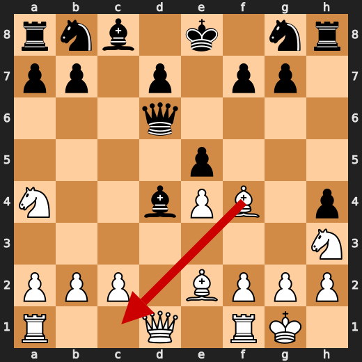
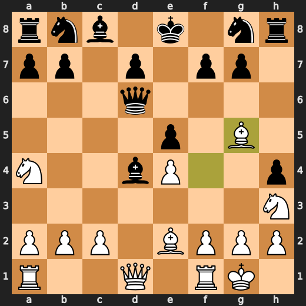
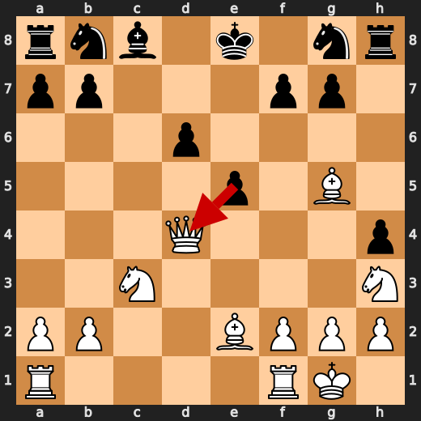
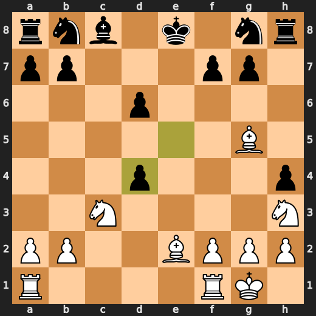
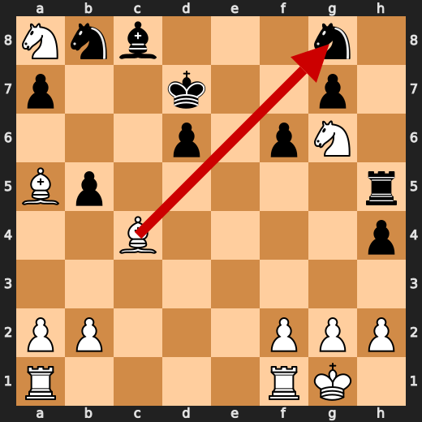
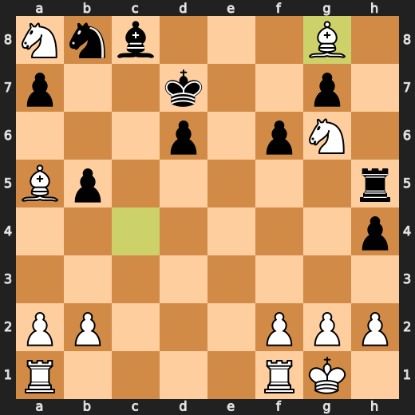

# You (White) vs CPU (Black)

**Result:** 1-0  
**Date:** 2026.05.16  
**Source:** `PGN_2026_05_16_02h17_d10f3b40c8ba.pgn`  
**Engine:** Stockfish depth 14  
**Your side:** White  
**Computer side:** Black  
**Board perspective:** Standard White-at-bottom

---

## Who Is Who

- **You:** You (White)
- **Computer:** CPU (5) (Black)

---

## Toaster Summary

**Game Story:** You won as White after Black’s repeated mistakes left the king unable to cope with your attack. Black’s 11...d6, 22...Rh5, and 24...h3 all worsened the position, and 29...Rc5 allowed your final 30.Ng6+. Your main lesson is to finish accurately once winning; 26.Nf4 was imprecise, but Black’s errors made the conversion successful.

Biggest toaster scream: **29. Rc5** by **CPU (Black)**.

- **Label:** 💀 **Blunder**
- **Eval:** +20.00 → White has mate
- **Stockfish preferred:** `Nc6`
- **Loss:** 98000 cp

Final move recorded: **30. Ng6+** by **You (White)**.

- 💀 Your blunders: **0**
- ❌ Your mistakes: **0**
- ⚠️ Your inaccuracies: **6**
- ✅ Your best moves called out: **10**

---

## Final Position


---

## Key Moments

### ✅ Best: 10. Bg5 by You (White)

Bg5 was a useful move and kept the position at or very near the engine’s preferred choice. Bc1 was the listed preference, but the practical lesson is that this move did not worsen White’s position.

- **Eval:** +2.86 → +2.92
- **Preferred:** `Bc1`
- **Loss:** 0 cp

**Before 10. Bg5**



**After 10. Bg5**



### ❌ Mistake: 11. d6 by CPU (Black)

Black’s d6 significantly worsened the position instead of choosing the stronger Bb6. Bb6 was preferred because it kept Black’s position more resilient, while d6 allowed White’s advantage to grow sharply. Learn to check whether a “useful” pawn move actually addresses the position’s most urgent problems.

- **Eval:** +3.92 → +9.28
- **Preferred:** `Bb6`
- **Loss:** 536 cp

**Before 11. d6**


**After 11. d6**


### ✅ Best: 14. exd4 by CPU (Black)

exd4 was the engine-approved forcing move, so Black chose the best available try. The useful pattern is to use forcing pawn captures when they improve the position more than quiet alternatives.

- **Eval:** +8.52 → +8.69
- **Preferred:** `exd4`
- **Loss:** 17 cp

**Before 14. exd4**



**After 14. exd4**



### ❌ Mistake: 22. Rh5 by CPU (Black)

Rh5 failed to address Black’s urgent defensive problems and significantly worsened the position. bxc4 was preferred because it would at least make a concrete capture instead of spending time on a move that lets White’s advantage grow. Learn to choose moves that solve immediate position issues before making side moves.

- **Eval:** +9.07 → +14.24
- **Preferred:** `bxc4`
- **Loss:** 517 cp

**Before 22. Rh5**


**After 22. Rh5**


### ✅ Best: 24. Bxg8 by You (White)

Bxg8 matched the engine’s preferred move, so it was a forcing, position-preserving choice. The practical pattern is to take the engine-approved forcing move when it keeps your advantage intact.

- **Eval:** +13.71 → +13.64
- **Preferred:** `Bxg8`
- **Loss:** 7 cp

**Before 24. Bxg8**



**After 24. Bxg8**



### ❌ Mistake: 24. h3 by CPU (Black)

h3 did not fix Black’s defensive problems and made the position worse. Nc6 was preferred because it gave Black a more resilient way to continue instead of spending a tempo on the h-pawn. Learn to question pawn pushes that do not address the most urgent needs of the position.

- **Eval:** +13.62 → +19.46
- **Preferred:** `Nc6`
- **Loss:** 584 cp

**Before 24. h3**


**After 24. h3**


### ❌ Mistake: 27. hxg2 by CPU (Black)

hxg2 worsened Black’s position and did not choose the more resilient capture. Bxg2 was preferred because it was the stronger way to handle the situation. Learn to compare pawn captures with piece captures when the position is already under heavy pressure.

- **Eval:** +15.38 → +19.07
- **Preferred:** `Bxg2`
- **Loss:** 369 cp

**Before 27. hxg2**


**After 27. hxg2**


### 💀 Blunder: 29. Rc5 by CPU (Black)

Rc5 worsened Black’s position badly and failed to avoid White’s forced mate. Nc6 was the preferred move because it offered more resistance than Rc5. Learn to choose the move that keeps the king safest when the evaluation swing shows a mating consequence.

- **Eval:** +20.00 → White has mate
- **Preferred:** `Nc6`
- **Loss:** 98000 cp

**Before 29. Rc5**


**After 29. Rc5**


---

## Human Notes

Biggest caveman lesson: CPU (Black) blew it with **29. Rc5**.

There was another real screw-up at **11. d6** by **CPU (Black)**.

---

<details>
<summary>Compact move list</summary>

- 📖 **1. e4** (You (White), Book) — +0.46 → +0.37, preferred `e4`, loss 9 cp
- 📖 **1. c5** (CPU (Black), Book) — +0.15 → +0.17, preferred `e6`, loss 2 cp
- 📖 **2. d4** (You (White), Book) — +0.38 → +0.23, preferred `Nf3`, loss 15 cp
- 📖 **2. e6** (CPU (Black), Book) — +0.00 → +0.93, preferred `cxd4`, loss 93 cp
- 📖 **3. dxc5** (You (White), Book) — +1.03 → +0.01, preferred `d5`, loss 102 cp
- 📖 **3. Bxc5** (CPU (Black), Book) — +0.04 → +0.01, preferred `Bxc5`, loss 0 cp
- ✅ **4. Nc3** (You (White), Best) — +0.19 → +0.05, preferred `Nf3`, loss 14 cp
- 👍 **4. Qb6** (CPU (Black), Good) — +0.00 → +0.70, preferred `Nc6`, loss 70 cp
- 🔥 **5. Nh3** (You (White), Great) — +0.81 → +0.38, preferred `Qf3`, loss 43 cp
- 👍 **5. h5** (CPU (Black), Good) — +0.25 → +1.44, preferred `d6`, loss 119 cp
- ✅ **6. Be2** (You (White), Best) — +1.46 → +1.40, preferred `Be2`, loss 6 cp
- ⚠️ **6. h4** (CPU (Black), Inaccuracy) — +1.49 → +2.73, preferred `a6`, loss 124 cp
- ✅ **7. O-O** (You (White), Best) — +2.19 → +2.05, preferred `O-O`, loss 14 cp
- 👍 **7. Bd4** (CPU (Black), Good) — +2.25 → +3.39, preferred `Qd8`, loss 114 cp
- 🔥 **8. Na4** (You (White), Great) — +3.37 → +3.20, preferred `Nb5`, loss 17 cp
- 👍 **8. Qd6** (CPU (Black), Good) — +2.51 → +3.03, preferred `Qd6`, loss 52 cp
- 🔥 **9. Bf4** (You (White), Great) — +2.78 → +2.58, preferred `Bf4`, loss 20 cp
- 🔥 **9. e5** (CPU (Black), Great) — +2.63 → +2.99, preferred `e5`, loss 36 cp
- ✅ **10. Bg5** (You (White), Best) — +2.86 → +2.92, preferred `Bc1`, loss 0 cp
- 👍 **10. Qc6** (CPU (Black), Good) — +2.61 → +3.54, preferred `Nf6`, loss 93 cp
- ✅ **11. c3** (You (White), Best) — +3.59 → +3.57, preferred `c3`, loss 2 cp
- ❌ **11. d6** (CPU (Black), Mistake) — +3.92 → +9.28, preferred `Bb6`, loss 536 cp
- 👍 **12. cxd4** (You (White), Good) — +9.51 → +9.00, preferred `cxd4`, loss 51 cp
- ✅ **12. Qxe4** (CPU (Black), Best) — +9.13 → +9.23, preferred `Qxe4`, loss 10 cp
- 🔥 **13. Nc3** (You (White), Great) — +9.50 → +9.13, preferred `dxe5`, loss 37 cp
- 🔥 **13. Qxd4** (CPU (Black), Great) — +8.92 → +9.23, preferred `Qxd4`, loss 31 cp
- 🔥 **14. Qxd4** (You (White), Great) — +9.05 → +8.80, preferred `Nb5`, loss 25 cp
- ✅ **14. exd4** (CPU (Black), Best) — +8.52 → +8.69, preferred `exd4`, loss 17 cp
- 🔥 **15. Nd5** (You (White), Great) — +8.71 → +8.41, preferred `Nb5`, loss 30 cp
- 🔥 **15. f6** (CPU (Black), Great) — +8.46 → +8.62, preferred `f6`, loss 16 cp
- ⚠️ **16. Nc7+** (You (White), Inaccuracy) — +8.65 → +7.27, preferred `Bf4`, loss 138 cp
- ⚠️ **16. Ke7** (CPU (Black), Inaccuracy) — +7.15 → +9.15, preferred `Kd8`, loss 200 cp
- 🔥 **17. Bd2** (You (White), Great) — +8.82 → +8.64, preferred `Bd2`, loss 18 cp
- 👍 **17. d3** (CPU (Black), Good) — +8.71 → +9.27, preferred `Bxh3`, loss 56 cp
- 🔥 **18. Bxd3** (You (White), Great) — +9.07 → +8.75, preferred `Bxd3`, loss 32 cp
- ⚠️ **18. Kf7** (CPU (Black), Inaccuracy) — +8.92 → +11.00, preferred `Bxh3`, loss 208 cp
- ✅ **19. Bc4+** (You (White), Best) — +10.62 → +10.66, preferred `Bc4+`, loss 0 cp
- ✅ **19. Ke7** (CPU (Black), Best) — +10.61 → +10.53, preferred `Ke7`, loss 0 cp
- 🔥 **20. Nf4** (You (White), Great) — +10.69 → +10.48, preferred `Nf4`, loss 21 cp
- ⚠️ **20. b5** (CPU (Black), Inaccuracy) — +10.88 → +12.86, preferred `Bf5`, loss 198 cp
- ⚠️ **21. Ng6+** (You (White), Inaccuracy) — +13.07 → +11.37, preferred `Bxb5`, loss 170 cp
- 👍 **21. Kd8** (CPU (Black), Good) — +11.07 → +11.92, preferred `Kd7`, loss 85 cp
- ⚠️ **22. Nxa8** (You (White), Inaccuracy) — +11.84 → +9.36, preferred `Nxb5`, loss 248 cp
- ❌ **22. Rh5** (CPU (Black), Mistake) — +9.07 → +14.24, preferred `bxc4`, loss 517 cp
- ⚠️ **23. Ba5+** (You (White), Inaccuracy) — +14.38 → +13.00, preferred `Bxg8`, loss 138 cp
- ✅ **23. Kd7** (CPU (Black), Best) — +13.76 → +13.61, preferred `Kd7`, loss 0 cp
- ✅ **24. Bxg8** (You (White), Best) — +13.71 → +13.64, preferred `Bxg8`, loss 7 cp
- ❌ **24. h3** (CPU (Black), Mistake) — +13.62 → +19.46, preferred `Nc6`, loss 584 cp
- ⚠️ **25. Rfd1** (You (White), Inaccuracy) — +19.73 → +17.46, preferred `Rac1`, loss 227 cp
- 🔥 **25. Rg5** (CPU (Black), Great) — +17.59 → +18.07, preferred `Nc6`, loss 48 cp
- ⚠️ **26. Nf4** (You (White), Inaccuracy) — +18.07 → +15.30, preferred `Bc7`, loss 277 cp
- ✅ **26. Bb7** (CPU (Black), Best) — +15.91 → +15.74, preferred `Bb7`, loss 0 cp
- 👍 **27. Nc7** (You (White), Good) — +16.02 → +15.22, preferred `Be6+`, loss 80 cp
- ❌ **27. hxg2** (CPU (Black), Mistake) — +15.38 → +19.07, preferred `Bxg2`, loss 369 cp
- ✅ **28. Be6+** (You (White), Best) — +19.26 → +19.23, preferred `Be6+`, loss 3 cp
- ✅ **28. Ke7** (CPU (Black), Best) — +19.69 → +19.76, preferred `Ke7`, loss 7 cp
- ✅ **29. h4** (You (White), Best) — +19.76 → +19.97, preferred `h4`, loss 0 cp
- 💀 **29. Rc5** (CPU (Black), Blunder) — +20.00 → White has mate, preferred `Nc6`, loss 98000 cp
- ✅ **30. Ng6+** (You (White), Best) — White has mate → White has mate, preferred `Ng6+`, loss 0 cp

</details>

---

<details>
<summary>Raw engine table</summary>

| Ply | Move | Actor | Played | Label | Eval Before | Eval After | Preferred | Loss |
|---:|---:|---|---|---|---:|---:|---|---:|
| 1 | 1 | You (White) | e4 | Book | +0.46 | +0.37 | e4 | 9 |
| 2 | 1 | CPU (Black) | c5 | Book | +0.15 | +0.17 | e6 | 2 |
| 3 | 2 | You (White) | d4 | Book | +0.38 | +0.23 | Nf3 | 15 |
| 4 | 2 | CPU (Black) | e6 | Book | +0.00 | +0.93 | cxd4 | 93 |
| 5 | 3 | You (White) | dxc5 | Book | +1.03 | +0.01 | d5 | 102 |
| 6 | 3 | CPU (Black) | Bxc5 | Book | +0.04 | +0.01 | Bxc5 | 0 |
| 7 | 4 | You (White) | Nc3 | Best | +0.19 | +0.05 | Nf3 | 14 |
| 8 | 4 | CPU (Black) | Qb6 | Good | +0.00 | +0.70 | Nc6 | 70 |
| 9 | 5 | You (White) | Nh3 | Great | +0.81 | +0.38 | Qf3 | 43 |
| 10 | 5 | CPU (Black) | h5 | Good | +0.25 | +1.44 | d6 | 119 |
| 11 | 6 | You (White) | Be2 | Best | +1.46 | +1.40 | Be2 | 6 |
| 12 | 6 | CPU (Black) | h4 | Inaccuracy | +1.49 | +2.73 | a6 | 124 |
| 13 | 7 | You (White) | O-O | Best | +2.19 | +2.05 | O-O | 14 |
| 14 | 7 | CPU (Black) | Bd4 | Good | +2.25 | +3.39 | Qd8 | 114 |
| 15 | 8 | You (White) | Na4 | Great | +3.37 | +3.20 | Nb5 | 17 |
| 16 | 8 | CPU (Black) | Qd6 | Good | +2.51 | +3.03 | Qd6 | 52 |
| 17 | 9 | You (White) | Bf4 | Great | +2.78 | +2.58 | Bf4 | 20 |
| 18 | 9 | CPU (Black) | e5 | Great | +2.63 | +2.99 | e5 | 36 |
| 19 | 10 | You (White) | Bg5 | Best | +2.86 | +2.92 | Bc1 | 0 |
| 20 | 10 | CPU (Black) | Qc6 | Good | +2.61 | +3.54 | Nf6 | 93 |
| 21 | 11 | You (White) | c3 | Best | +3.59 | +3.57 | c3 | 2 |
| 22 | 11 | CPU (Black) | d6 | Mistake | +3.92 | +9.28 | Bb6 | 536 |
| 23 | 12 | You (White) | cxd4 | Good | +9.51 | +9.00 | cxd4 | 51 |
| 24 | 12 | CPU (Black) | Qxe4 | Best | +9.13 | +9.23 | Qxe4 | 10 |
| 25 | 13 | You (White) | Nc3 | Great | +9.50 | +9.13 | dxe5 | 37 |
| 26 | 13 | CPU (Black) | Qxd4 | Great | +8.92 | +9.23 | Qxd4 | 31 |
| 27 | 14 | You (White) | Qxd4 | Great | +9.05 | +8.80 | Nb5 | 25 |
| 28 | 14 | CPU (Black) | exd4 | Best | +8.52 | +8.69 | exd4 | 17 |
| 29 | 15 | You (White) | Nd5 | Great | +8.71 | +8.41 | Nb5 | 30 |
| 30 | 15 | CPU (Black) | f6 | Great | +8.46 | +8.62 | f6 | 16 |
| 31 | 16 | You (White) | Nc7+ | Inaccuracy | +8.65 | +7.27 | Bf4 | 138 |
| 32 | 16 | CPU (Black) | Ke7 | Inaccuracy | +7.15 | +9.15 | Kd8 | 200 |
| 33 | 17 | You (White) | Bd2 | Great | +8.82 | +8.64 | Bd2 | 18 |
| 34 | 17 | CPU (Black) | d3 | Good | +8.71 | +9.27 | Bxh3 | 56 |
| 35 | 18 | You (White) | Bxd3 | Great | +9.07 | +8.75 | Bxd3 | 32 |
| 36 | 18 | CPU (Black) | Kf7 | Inaccuracy | +8.92 | +11.00 | Bxh3 | 208 |
| 37 | 19 | You (White) | Bc4+ | Best | +10.62 | +10.66 | Bc4+ | 0 |
| 38 | 19 | CPU (Black) | Ke7 | Best | +10.61 | +10.53 | Ke7 | 0 |
| 39 | 20 | You (White) | Nf4 | Great | +10.69 | +10.48 | Nf4 | 21 |
| 40 | 20 | CPU (Black) | b5 | Inaccuracy | +10.88 | +12.86 | Bf5 | 198 |
| 41 | 21 | You (White) | Ng6+ | Inaccuracy | +13.07 | +11.37 | Bxb5 | 170 |
| 42 | 21 | CPU (Black) | Kd8 | Good | +11.07 | +11.92 | Kd7 | 85 |
| 43 | 22 | You (White) | Nxa8 | Inaccuracy | +11.84 | +9.36 | Nxb5 | 248 |
| 44 | 22 | CPU (Black) | Rh5 | Mistake | +9.07 | +14.24 | bxc4 | 517 |
| 45 | 23 | You (White) | Ba5+ | Inaccuracy | +14.38 | +13.00 | Bxg8 | 138 |
| 46 | 23 | CPU (Black) | Kd7 | Best | +13.76 | +13.61 | Kd7 | 0 |
| 47 | 24 | You (White) | Bxg8 | Best | +13.71 | +13.64 | Bxg8 | 7 |
| 48 | 24 | CPU (Black) | h3 | Mistake | +13.62 | +19.46 | Nc6 | 584 |
| 49 | 25 | You (White) | Rfd1 | Inaccuracy | +19.73 | +17.46 | Rac1 | 227 |
| 50 | 25 | CPU (Black) | Rg5 | Great | +17.59 | +18.07 | Nc6 | 48 |
| 51 | 26 | You (White) | Nf4 | Inaccuracy | +18.07 | +15.30 | Bc7 | 277 |
| 52 | 26 | CPU (Black) | Bb7 | Best | +15.91 | +15.74 | Bb7 | 0 |
| 53 | 27 | You (White) | Nc7 | Good | +16.02 | +15.22 | Be6+ | 80 |
| 54 | 27 | CPU (Black) | hxg2 | Mistake | +15.38 | +19.07 | Bxg2 | 369 |
| 55 | 28 | You (White) | Be6+ | Best | +19.26 | +19.23 | Be6+ | 3 |
| 56 | 28 | CPU (Black) | Ke7 | Best | +19.69 | +19.76 | Ke7 | 7 |
| 57 | 29 | You (White) | h4 | Best | +19.76 | +19.97 | h4 | 0 |
| 58 | 29 | CPU (Black) | Rc5 | Blunder | +20.00 | White has mate | Nc6 | 98000 |
| 59 | 30 | You (White) | Ng6+ | Best | White has mate | White has mate | Ng6+ | 0 |

</details>

---

<details>
<summary>Clean PGN</summary>

```pgn
[Event "AI Factory's Chess"]
[Site "Android Device"]
[Date "2026.05.16"]
[Round "1"]
[White "You"]
[Black "CPU (5)"]
[Result "1-0"]
[PlyCount "61"]

1. e4 c5 2. d4 e6 3. dxc5 Bxc5 4. Nc3 Qb6 5. Nh3 h5 6. Be2 h4 7. O-O Bd4 8. Na4
Qd6 9. Bf4 e5 10. Bg5 Qc6 11. c3 d6 12. cxd4 Qxe4 13. Nc3 Qxd4 14. Qxd4 exd4
15. Nd5 f6 16. Nc7+ Ke7 17. Bd2 d3 18. Bxd3 Kf7 19. Bc4+ Ke7 20. Nf4 b5 21.
Ng6+ Kd8 22. Nxa8 Rh5 23. Ba5+ Kd7 24. Bxg8 h3 25. Rfd1 Rg5 26. Nf4 Bb7 27. Nc7
hxg2 28. Be6+ Ke7 29. h4 Rc5 30. Ng6+ 1-0
```

</details>
