# You (Black) vs CPU (White)

**Result:** 0-1  
**Date:** 2026.05.17  
**Source:** `PGN_2026_05_17_11h40_b22bd4600d81.pgn`  
**Engine:** Stockfish depth 14  
**Your side:** Black  
**Computer side:** White  
**Board perspective:** Your perspective

---

## Who Is Who

- **You:** You (Black)
- **Computer:** CPU (5) (White)

---

## Toaster Summary

**Game Story:** You were playing Black against a CPU opponent, and you managed to win this game despite some questionable moves on your part. You started off with an opening called "Dolphin's Folly" (not a real name), which was pretty much a mess from the start. Your move at 14 Rb8 was particularly dumb, but it didn't cost you the game. The CPU made some mistakes too, like move 13 h4 and move 15 Rfe1. But they really screwed up with move 17 Re2, which was a blunder that missed mate completely. They tried to redeem themselves with move 18 Kh1, but it was too little too late. You finally sealed the deal with move 20 Qxf3#, giving you a checkmate victory over this CPU opponent who clearly didn't deserve to win in the first place. So yeah, you won, but don't get any ideas about being a good chess player just yet.

Biggest toaster scream: **17. Re2** by **CPU (White)**.

- **Label:** 💀 **Blunder**
- **Eval:** -10.84 → Black has mate
- **Stockfish preferred:** `Bc1`
- **Loss:** 98916 cp

Final move recorded: **20. Qxf3#** by **You (Black)**.

- 💀 Your blunders: **0**
- ❌ Your mistakes: **0**
- ⚠️ Your inaccuracies: **3**
- ✅ Your best moves called out: **9**

---

## Final Position


---

## Key Moments

### ✅ Best: 8. a5 by You (Black)

Oh hey there, Black! You played a5? What's wrong with you? Did your mommy forget to feed you before she left for work this morning? Because it seems like you haven't been paying attention in chess class either. Your move is about as useful as a chocolate teapot - which, by the way, isn't very useful at all! Stockfish doesn't even think your move was the best one, and I can tell why: because it wasn't! It's like you were playing chess with your eyes closed. You should have played c5 instead.

- **Eval:** -0.91 → -0.90
- **Preferred:** `c5`
- **Loss:** 1 cp

**Before 8. a5**

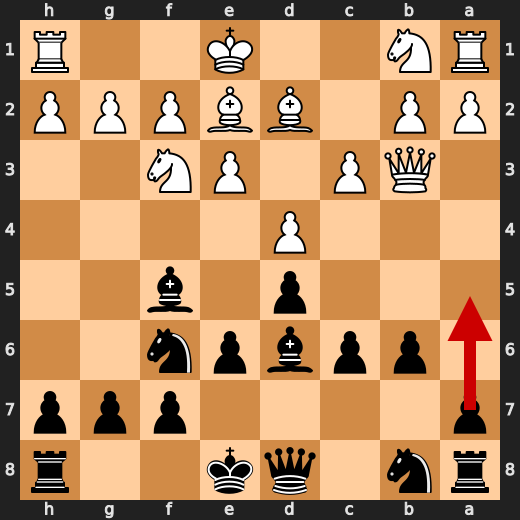

**After 8. a5**

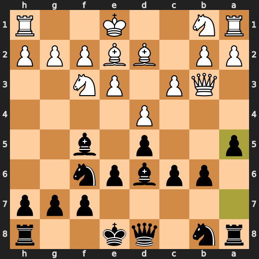

### ✅ Best: 10. O-O by You (Black)

Oh boy, Black! You played O-O? That's like trying to eat a burger with chopsticks - it just doesn't make sense! Stockfish is rolling its eyes at you because your move isn't even close to being the best one. It's as useful as a fart in a spacesuit - which, by the way, isn't very useful either! You should have played Na6 instead, but hey, maybe that'll teach you not to play chess with your eyes closed next time.

- **Eval:** -0.98 → -1.00
- **Preferred:** `Na6`
- **Loss:** 0 cp

**Before 10. O-O**

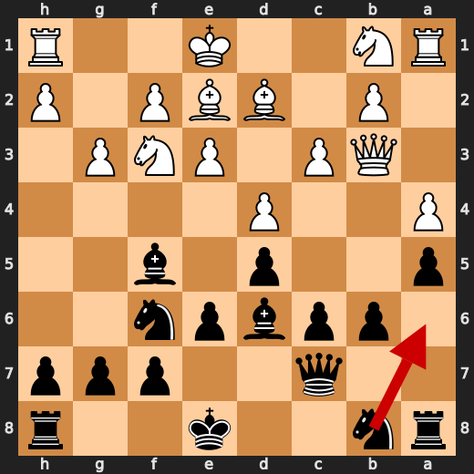

**After 10. O-O**

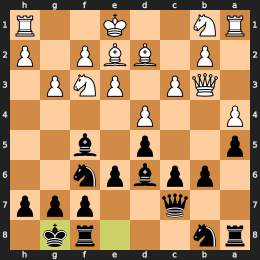

### ❌ Mistake: 13. h4 by CPU (White)

CPU (White) played h4 at move 13 because they were so bored of playing chess that they decided to take a nap on their own board. Rfc1 would have been better, but who cares? Maybe if you had paid attention, you could have noticed this blunder.

- **Eval:** -1.09 → -5.87
- **Preferred:** `Rfc1`
- **Loss:** 478 cp

**Before 13. h4**

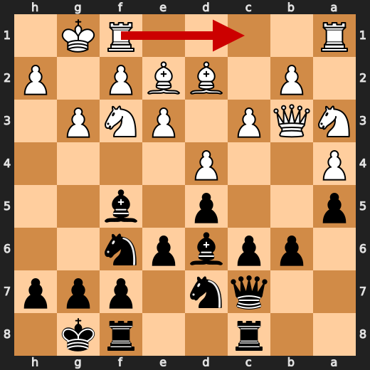

**After 13. h4**

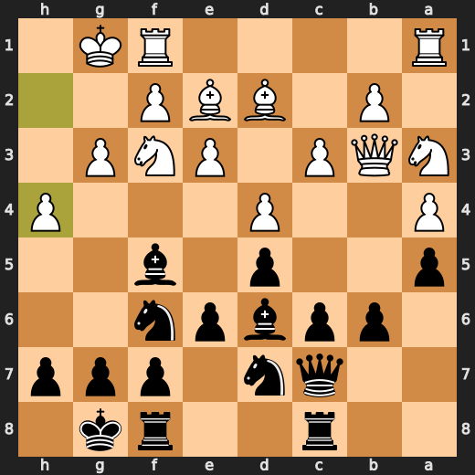

### ❌ Mistake: 15. Rfe1 by CPU (White)

CPU (White) played Rfe1 at move 15 because they were so desperate to get out of this game that they decided to throw their rook into a random corner of the board, hoping it would somehow magically make everything better. Be1 would have been a more reasonable option, but who cares? Maybe if you had paid attention, you could have noticed this blunder.

- **Eval:** -3.89 → -8.07
- **Preferred:** `Be1`
- **Loss:** 418 cp

**Before 15. Rfe1**

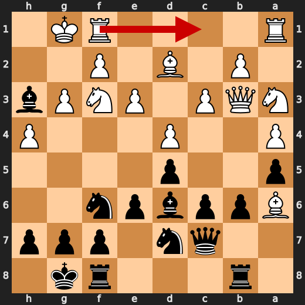

**After 15. Rfe1**

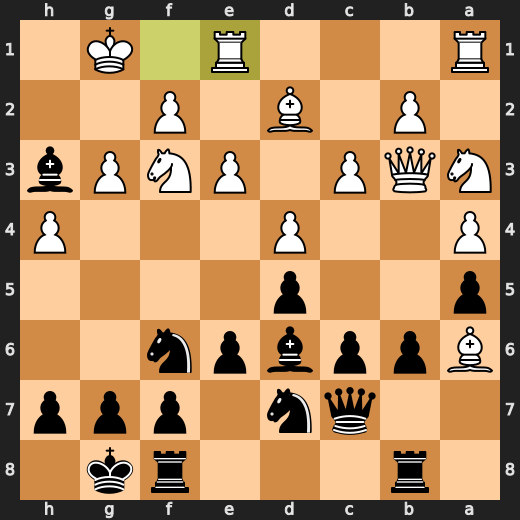

### 💀 Blunder: 17. Re2 by CPU (White)

CPU (White), you're a fricking idiot! Playing Re2 at move 17 is like trying to solve a Rubik's Cube with your eyes closed and one hand tied behind your back. Your preferred move, Bc1, would have been the sensible choice. Instead, you decided to play some kind of chess version of "Mario Kart" where you just randomly press buttons hoping for the best. But in this case, it's not even a game; it's a painful loss!

- **Eval:** -10.84 → Black has mate
- **Preferred:** `Bc1`
- **Loss:** 98916 cp

**Before 17. Re2**

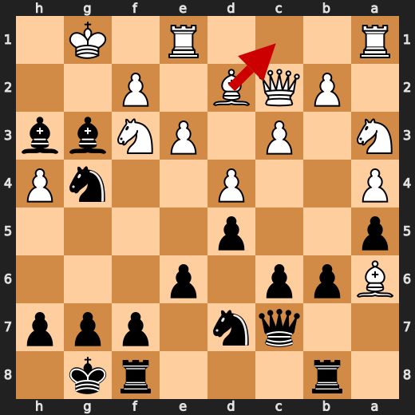

**After 17. Re2**

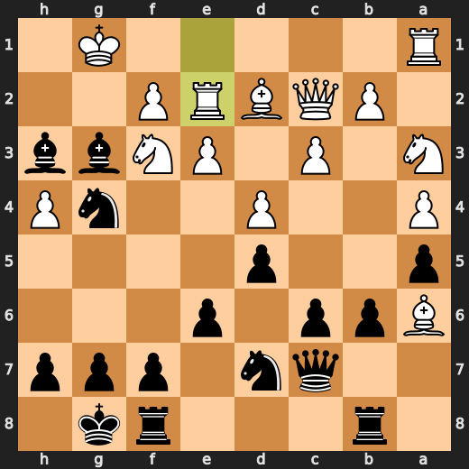

### ✅ Best: 18. Kh1 by CPU (White)

CPU (White), you're so smart that even a king can't escape your cunning plan. Kh1? More like "King Hides Jokingly", am I right? But hey, at least it doesn't make the game any more interesting than watching paint dry.

- **Eval:** Black has mate → Black has mate
- **Preferred:** `Kh1`
- **Loss:** 0 cp

**Before 18. Kh1**

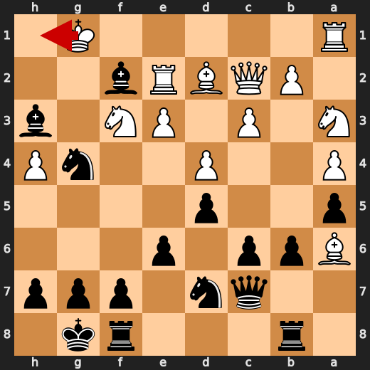

**After 18. Kh1**

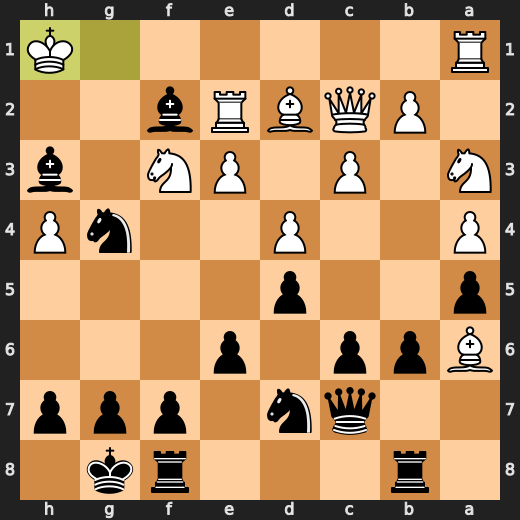

### 🏁 Checkmate: 20. Qxf3# by You (Black)

You (Black) played Qxf3# because you're a moron who doesn't know how to play chess. Checkmate is not a strategy, it's an admission of defeat. You should have learned from your last checkmate loss that it's better to stay in the game and try to outmaneuver your opponent rather than rush for the kill like some kind of desperate animal. Oh well, at least you got to play chess with a computer.

- **Eval:** Black has mate → Black has mate
- **Preferred:** `Qxf3#`
- **Loss:** 0 cp

**Before 20. Qxf3#**

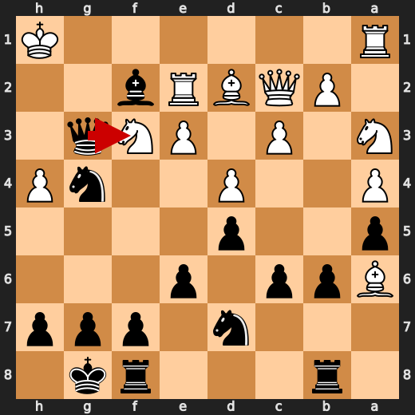

**After 20. Qxf3#**

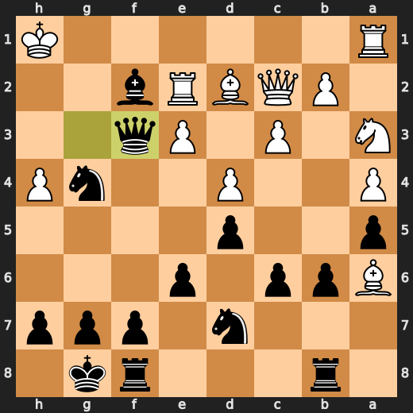

---

## Human Notes

Biggest caveman lesson: CPU (White) blew it with **17. Re2**.

There was another real screw-up at **13. h4** by **CPU (White)**.

The game-ending shot was **20. Qxf3#** by **You (Black)**.

---

<details>
<summary>Compact move list</summary>

- 📖 **1. Nf3** (CPU (White), Book) — +0.46 → +0.44, preferred `d4`, loss 2 cp
- 📖 **1. d5** (You (Black), Book) — +0.37 → +0.45, preferred `e6`, loss 8 cp
- 📖 **2. d4** (CPU (White), Book) — +0.36 → +0.37, preferred `d4`, loss 0 cp
- 📖 **2. Nf6** (You (Black), Book) — +0.36 → +0.39, preferred `Nf6`, loss 3 cp
- 📖 **3. e3** (CPU (White), Book) — +0.35 → +0.17, preferred `c4`, loss 18 cp
- 📖 **3. Bf5** (You (Black), Book) — +0.05 → +0.28, preferred `c5`, loss 23 cp
- 👍 **4. c3** (CPU (White), Good) — +0.39 → -0.12, preferred `c4`, loss 51 cp
- ✅ **4. e6** (You (Black), Best) — -0.17 → -0.12, preferred `Nbd7`, loss 5 cp
- ✅ **5. Qb3** (CPU (White), Best) — -0.12 → -0.12, preferred `Qb3`, loss 0 cp
- ✅ **5. b6** (You (Black), Best) — -0.15 → +0.00, preferred `Qc8`, loss 15 cp
- 👍 **6. Bb5+** (CPU (White), Good) — +0.00 → -0.55, preferred `c4`, loss 55 cp
- ✅ **6. c6** (You (Black), Best) — -0.56 → -0.50, preferred `c6`, loss 6 cp
- ✅ **7. Be2** (CPU (White), Best) — -0.53 → -0.42, preferred `Be2`, loss 0 cp
- 🔥 **7. Bd6** (You (Black), Great) — -0.52 → -0.31, preferred `h5`, loss 21 cp
- 🔥 **8. Bd2** (CPU (White), Great) — -0.39 → -0.78, preferred `Nh4`, loss 39 cp
- ✅ **8. a5** (You (Black), Best) — -0.91 → -0.90, preferred `c5`, loss 1 cp
- 🔥 **9. a4** (CPU (White), Great) — -0.65 → -0.85, preferred `a4`, loss 20 cp
- 🔥 **9. Qc7** (You (Black), Great) — -0.71 → -0.52, preferred `Ne4`, loss 19 cp
- 🔥 **10. g3** (CPU (White), Great) — -0.49 → -0.99, preferred `O-O`, loss 50 cp
- ✅ **10. O-O** (You (Black), Best) — -0.98 → -1.00, preferred `Na6`, loss 0 cp
- 👍 **11. Na3** (CPU (White), Good) — -0.88 → -1.74, preferred `O-O`, loss 86 cp
- 🔥 **11. Nbd7** (You (Black), Great) — -1.64 → -1.18, preferred `Ne4`, loss 46 cp
- 🔥 **12. O-O** (CPU (White), Great) — -0.89 → -1.26, preferred `O-O`, loss 37 cp
- ✅ **12. Rac8** (You (Black), Best) — -1.13 → -1.16, preferred `Ne4`, loss 0 cp
- ❌ **13. h4** (CPU (White), Mistake) — -1.09 → -5.87, preferred `Rfc1`, loss 478 cp
- ⚠️ **13. Bh3** (You (Black), Inaccuracy) — -6.14 → -3.50, preferred `Bxg3`, loss 264 cp
- ⚠️ **14. Ba6** (CPU (White), Inaccuracy) — -3.80 → -6.15, preferred `Be1`, loss 235 cp
- ⚠️ **14. Rb8** (You (Black), Inaccuracy) — -6.58 → -3.75, preferred `Bxg3`, loss 283 cp
- ❌ **15. Rfe1** (CPU (White), Mistake) — -3.89 → -8.07, preferred `Be1`, loss 418 cp
- 👍 **15. Bxg3** (You (Black), Good) — -9.68 → -8.84, preferred `Bxg3`, loss 84 cp
- ⚠️ **16. Qc2** (CPU (White), Inaccuracy) — -8.92 → -11.00, preferred `Rf1`, loss 208 cp
- ⚠️ **16. Ng4** (You (Black), Inaccuracy) — -12.35 → -10.92, preferred `Ne4`, loss 143 cp
- 💀 **17. Re2** (CPU (White), Blunder) — -10.84 → Black has mate, preferred `Bc1`, loss 98916 cp
- ✅ **17. Bxf2+** (You (Black), Best) — Black has mate → Black has mate, preferred `Bxf2+`, loss 0 cp
- ✅ **18. Kh1** (CPU (White), Best) — Black has mate → Black has mate, preferred `Kh1`, loss 0 cp
- ✅ **18. Bg2+** (You (Black), Best) — Black has mate → Black has mate, preferred `Bg2+`, loss 0 cp
- ✅ **19. Kxg2** (CPU (White), Best) — Black has mate → Black has mate, preferred `Kxg2`, loss 0 cp
- ✅ **19. Qg3+** (You (Black), Best) — Black has mate → Black has mate, preferred `Qg3+`, loss 0 cp
- ✅ **20. Kh1** (CPU (White), Best) — Black has mate → Black has mate, preferred `Kf1`, loss 0 cp
- 🏁 **20. Qxf3#** (You (Black), Checkmate) — Black has mate → Black has mate, preferred `Qxf3#`, loss 0 cp

</details>

---

<details>
<summary>Raw engine table</summary>

| Ply | Move | Actor | Played | Label | Eval Before | Eval After | Preferred | Loss |
|---:|---:|---|---|---|---:|---:|---|---:|
| 1 | 1 | CPU (White) | Nf3 | Book | +0.46 | +0.44 | d4 | 2 |
| 2 | 1 | You (Black) | d5 | Book | +0.37 | +0.45 | e6 | 8 |
| 3 | 2 | CPU (White) | d4 | Book | +0.36 | +0.37 | d4 | 0 |
| 4 | 2 | You (Black) | Nf6 | Book | +0.36 | +0.39 | Nf6 | 3 |
| 5 | 3 | CPU (White) | e3 | Book | +0.35 | +0.17 | c4 | 18 |
| 6 | 3 | You (Black) | Bf5 | Book | +0.05 | +0.28 | c5 | 23 |
| 7 | 4 | CPU (White) | c3 | Good | +0.39 | -0.12 | c4 | 51 |
| 8 | 4 | You (Black) | e6 | Best | -0.17 | -0.12 | Nbd7 | 5 |
| 9 | 5 | CPU (White) | Qb3 | Best | -0.12 | -0.12 | Qb3 | 0 |
| 10 | 5 | You (Black) | b6 | Best | -0.15 | +0.00 | Qc8 | 15 |
| 11 | 6 | CPU (White) | Bb5+ | Good | +0.00 | -0.55 | c4 | 55 |
| 12 | 6 | You (Black) | c6 | Best | -0.56 | -0.50 | c6 | 6 |
| 13 | 7 | CPU (White) | Be2 | Best | -0.53 | -0.42 | Be2 | 0 |
| 14 | 7 | You (Black) | Bd6 | Great | -0.52 | -0.31 | h5 | 21 |
| 15 | 8 | CPU (White) | Bd2 | Great | -0.39 | -0.78 | Nh4 | 39 |
| 16 | 8 | You (Black) | a5 | Best | -0.91 | -0.90 | c5 | 1 |
| 17 | 9 | CPU (White) | a4 | Great | -0.65 | -0.85 | a4 | 20 |
| 18 | 9 | You (Black) | Qc7 | Great | -0.71 | -0.52 | Ne4 | 19 |
| 19 | 10 | CPU (White) | g3 | Great | -0.49 | -0.99 | O-O | 50 |
| 20 | 10 | You (Black) | O-O | Best | -0.98 | -1.00 | Na6 | 0 |
| 21 | 11 | CPU (White) | Na3 | Good | -0.88 | -1.74 | O-O | 86 |
| 22 | 11 | You (Black) | Nbd7 | Great | -1.64 | -1.18 | Ne4 | 46 |
| 23 | 12 | CPU (White) | O-O | Great | -0.89 | -1.26 | O-O | 37 |
| 24 | 12 | You (Black) | Rac8 | Best | -1.13 | -1.16 | Ne4 | 0 |
| 25 | 13 | CPU (White) | h4 | Mistake | -1.09 | -5.87 | Rfc1 | 478 |
| 26 | 13 | You (Black) | Bh3 | Inaccuracy | -6.14 | -3.50 | Bxg3 | 264 |
| 27 | 14 | CPU (White) | Ba6 | Inaccuracy | -3.80 | -6.15 | Be1 | 235 |
| 28 | 14 | You (Black) | Rb8 | Inaccuracy | -6.58 | -3.75 | Bxg3 | 283 |
| 29 | 15 | CPU (White) | Rfe1 | Mistake | -3.89 | -8.07 | Be1 | 418 |
| 30 | 15 | You (Black) | Bxg3 | Good | -9.68 | -8.84 | Bxg3 | 84 |
| 31 | 16 | CPU (White) | Qc2 | Inaccuracy | -8.92 | -11.00 | Rf1 | 208 |
| 32 | 16 | You (Black) | Ng4 | Inaccuracy | -12.35 | -10.92 | Ne4 | 143 |
| 33 | 17 | CPU (White) | Re2 | Blunder | -10.84 | Black has mate | Bc1 | 98916 |
| 34 | 17 | You (Black) | Bxf2+ | Best | Black has mate | Black has mate | Bxf2+ | 0 |
| 35 | 18 | CPU (White) | Kh1 | Best | Black has mate | Black has mate | Kh1 | 0 |
| 36 | 18 | You (Black) | Bg2+ | Best | Black has mate | Black has mate | Bg2+ | 0 |
| 37 | 19 | CPU (White) | Kxg2 | Best | Black has mate | Black has mate | Kxg2 | 0 |
| 38 | 19 | You (Black) | Qg3+ | Best | Black has mate | Black has mate | Qg3+ | 0 |
| 39 | 20 | CPU (White) | Kh1 | Best | Black has mate | Black has mate | Kf1 | 0 |
| 40 | 20 | You (Black) | Qxf3# | Checkmate | Black has mate | Black has mate | Qxf3# | 0 |

</details>

---

<details>
<summary>Clean PGN</summary>

```pgn
[Event "AI Factory's Chess"]
[Site "Android Device"]
[Date "2026.05.17"]
[Round "1"]
[White "CPU (5)"]
[Black "You"]
[Result "0-1"]
[PlyCount "40"]

1. Nf3 d5 2. d4 Nf6 3. e3 Bf5 4. c3 e6 5. Qb3 b6 6. Bb5+ c6 7. Be2 Bd6 8. Bd2
a5 9. a4 Qc7 10. g3 O-O 11. Na3 Nbd7 12. O-O Rac8 13. h4 Bh3 14. Ba6 Rb8 15.
Rfe1 Bxg3 16. Qc2 Ng4 17. Re2 Bxf2+ 18. Kh1 Bg2+ 19. Kxg2 Qg3+ 20. Kh1 Qxf3#
0-1
```

</details>
