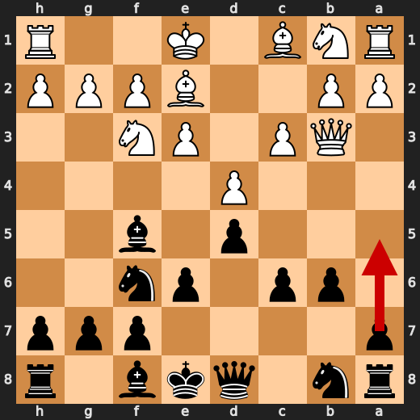
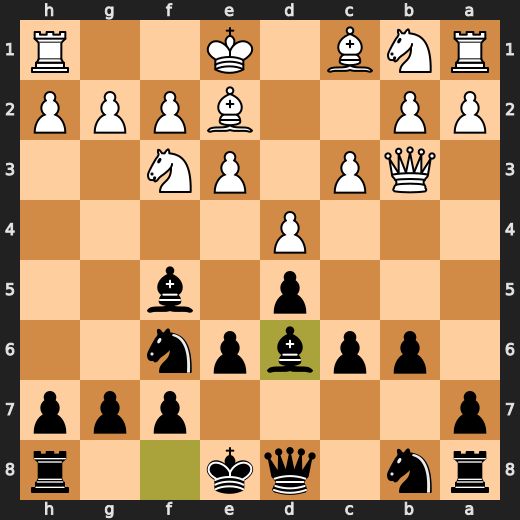
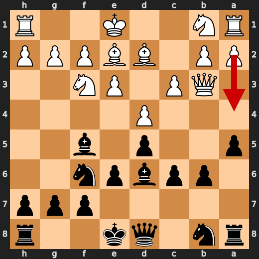
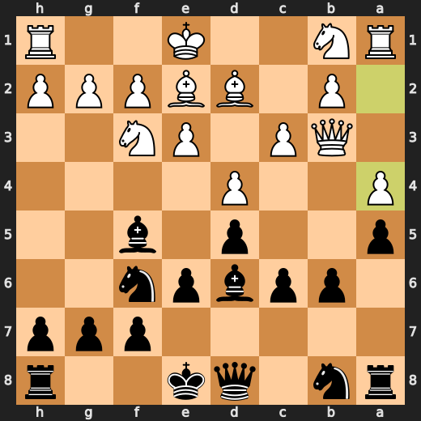
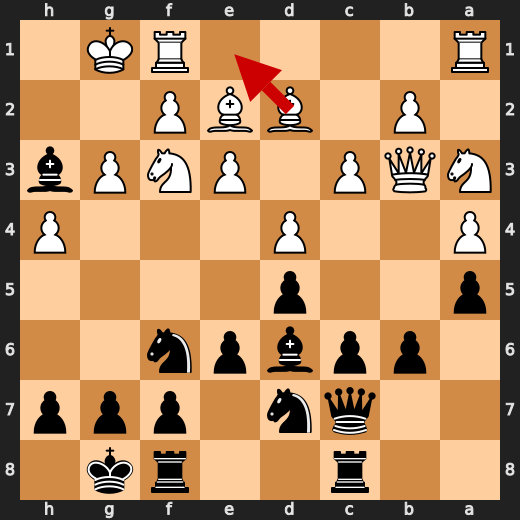
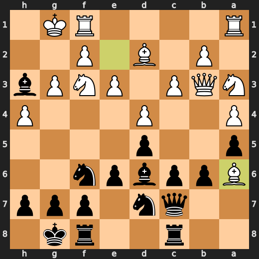

# You (Black) vs CPU (White)

**Result:** 0-1  
**Date:** 2026.05.17  
**Source:** `PGN_2026_05_17_11h40_b22bd4600d81.pgn`  
**Engine:** Stockfish depth 14  
**Your side:** Black  
**Computer side:** White  
**Board perspective:** Your perspective

---

## Who Is Who

- **You:** You (Black)
- **Computer:** CPU (5) (White)

---

## Toaster Summary

**Game Story:** White’s 13 h4, 14 Ba6, and 15 Rfe1 let your attack grow quickly, and 17 Re2 was the move that allowed a forced mate. Your 14 Rb8 missed a stronger attacking move, so the win was powerful but not spotless. The key lesson is to punish loosened kingside squares immediately, as you did by finishing with 20...Qxf3#.

Biggest toaster scream: **17. Re2** by **CPU (White)**.

- **Label:** 💀 **Blunder**
- **Eval:** -10.15 → Black has mate
- **Stockfish preferred:** `Bc1`
- **Loss:** 98985 cp

Final move recorded: **20. Qxf3#** by **You (Black)**.

- 💀 Your blunders: **0**
- ❌ Your mistakes: **0**
- ⚠️ Your inaccuracies: **2**
- ✅ Your best moves called out: **11**

---

## Final Position


---

## Key Moments

### ✅ Best: 7. Bd6 by You (Black)

Bd6 was a useful developing move and kept the position close to Stockfish’s preference. a5 was preferred, but the practical lesson is that improving a piece with tempo-sensitive development can still be sound when it does not worsen the position.

- **Eval:** -0.54 → -0.41
- **Preferred:** `a5`
- **Loss:** 13 cp

**Before 7. Bd6**



**After 7. Bd6**



### ✅ Best: 8. a5 by You (Black)

a5 matched the preferred move and kept Black’s position steady. The useful pattern is to make a queenside pawn move when it fits the engine’s choice and does not concede ground.

- **Eval:** -0.71 → -0.69
- **Preferred:** `a5`
- **Loss:** 2 cp

**Before 8. a5**


**After 8. a5**


### ✅ Best: 9. a4 by CPU (White)

a4 was at or very near the engine’s preferred move, so it did not worsen White’s position. Learn this pattern: when the move matches the preferred choice, the practical goal is to keep making useful moves without creating new problems.

- **Eval:** -0.65 → -0.73
- **Preferred:** `a4`
- **Loss:** 8 cp

**Before 9. a4**



**After 9. a4**



### ❌ Mistake: 13. h4 by CPU (White)

h4 failed to address White’s worsening position and caused a significant drop in evaluation. c4 was preferred because it would have improved White’s practical chances compared with the played move. Learn to prioritize moves that stabilize the position over loose pawn pushes when the position is already difficult.

- **Eval:** -1.17 → -6.58
- **Preferred:** `c4`
- **Loss:** 541 cp

**Before 13. h4**


**After 13. h4**


### ❌ Mistake: 14. Ba6 by CPU (White)

Ba6 worsened White’s position and did not solve the practical problems already present. Be1 was preferred, so learn to choose defensive regrouping moves when the position is difficult rather than moves that allow a larger evaluation swing.

- **Eval:** -3.47 → -6.67
- **Preferred:** `Be1`
- **Loss:** 320 cp

**Before 14. Ba6**



**After 14. Ba6**



### ❌ Mistake: 15. Rfe1 by CPU (White)

Rfe1 did not improve White’s practical defensive setup and the position became much worse. Rfc1 was preferred because it gave White a better chance to organize than the played rook move. Learn to choose the rook placement that best stabilizes the position when already under pressure.

- **Eval:** -4.18 → -9.22
- **Preferred:** `Rfc1`
- **Loss:** 504 cp

**Before 15. Rfe1**


**After 15. Rfe1**


### 💀 Blunder: 17. Re2 by CPU (White)

Re2 failed to prevent Black’s forced mate, so the position became tactically lost. Bc1 was the needed improvement because it avoided that immediate decisive consequence. Learn to prioritize stopping mate threats over making generally useful-looking moves.

- **Eval:** -10.15 → Black has mate
- **Preferred:** `Bc1`
- **Loss:** 98985 cp

**Before 17. Re2**


**After 17. Re2**


### 🏁 Checkmate: 20. Qxf3# by You (Black)

Qxf3# was best because it used the available game-ending forcing move immediately. The pattern to learn is to take a forced checkmate when it is available rather than making any slower move.

- **Eval:** Black has mate → Black has mate
- **Preferred:** `Qxf3#`
- **Loss:** 0 cp

**Before 20. Qxf3#**


**After 20. Qxf3#**


---

## Human Notes

Biggest caveman lesson: CPU (White) blew it with **17. Re2**.

There was another real screw-up at **13. h4** by **CPU (White)**.

The game-ending shot was **20. Qxf3#** by **You (Black)**.

---

<details>
<summary>Compact move list</summary>

- 📖 **1. Nf3** (CPU (White), Book) — +0.59 → +0.38, preferred `e4`, loss 21 cp
- 📖 **1. d5** (You (Black), Book) — +0.31 → +0.37, preferred `Nf6`, loss 6 cp
- 📖 **2. d4** (CPU (White), Book) — +0.25 → +0.30, preferred `d4`, loss 0 cp
- 📖 **2. Nf6** (You (Black), Book) — +0.37 → +0.33, preferred `e6`, loss 0 cp
- 📖 **3. e3** (CPU (White), Book) — +0.29 → +0.18, preferred `c4`, loss 11 cp
- 📖 **3. Bf5** (You (Black), Book) — +0.09 → +0.30, preferred `e6`, loss 21 cp
- 🔥 **4. c3** (CPU (White), Great) — +0.24 → -0.13, preferred `c4`, loss 37 cp
- ✅ **4. e6** (You (Black), Best) — -0.03 → -0.07, preferred `e6`, loss 0 cp
- ✅ **5. Qb3** (CPU (White), Best) — -0.12 → -0.05, preferred `Qb3`, loss 0 cp
- ✅ **5. b6** (You (Black), Best) — -0.10 → -0.07, preferred `Qc8`, loss 3 cp
- 👍 **6. Bb5+** (CPU (White), Good) — -0.06 → -0.68, preferred `c4`, loss 62 cp
- ✅ **6. c6** (You (Black), Best) — -0.50 → -0.51, preferred `c6`, loss 0 cp
- ✅ **7. Be2** (CPU (White), Best) — -0.51 → -0.51, preferred `Be2`, loss 0 cp
- ✅ **7. Bd6** (You (Black), Best) — -0.54 → -0.41, preferred `a5`, loss 13 cp
- 👍 **8. Bd2** (CPU (White), Good) — -0.42 → -0.97, preferred `Nh4`, loss 55 cp
- ✅ **8. a5** (You (Black), Best) — -0.71 → -0.69, preferred `a5`, loss 2 cp
- ✅ **9. a4** (CPU (White), Best) — -0.65 → -0.73, preferred `a4`, loss 8 cp
- 🔥 **9. Qc7** (You (Black), Great) — -0.79 → -0.58, preferred `Ne4`, loss 21 cp
- 🔥 **10. g3** (CPU (White), Great) — -0.51 → -0.88, preferred `O-O`, loss 37 cp
- ✅ **10. O-O** (You (Black), Best) — -0.91 → -0.91, preferred `O-O`, loss 0 cp
- 👍 **11. Na3** (CPU (White), Good) — -0.91 → -1.57, preferred `O-O`, loss 66 cp
- 🔥 **11. Nbd7** (You (Black), Great) — -1.71 → -1.53, preferred `h5`, loss 18 cp
- 🔥 **12. O-O** (CPU (White), Great) — -0.89 → -1.10, preferred `O-O`, loss 21 cp
- ✅ **12. Rac8** (You (Black), Best) — -1.13 → -1.20, preferred `e5`, loss 0 cp
- ❌ **13. h4** (CPU (White), Mistake) — -1.17 → -6.58, preferred `c4`, loss 541 cp
- ⚠️ **13. Bh3** (You (Black), Inaccuracy) — -6.26 → -3.51, preferred `Bxg3`, loss 275 cp
- ❌ **14. Ba6** (CPU (White), Mistake) — -3.47 → -6.67, preferred `Be1`, loss 320 cp
- ⚠️ **14. Rb8** (You (Black), Inaccuracy) — -6.70 → -3.79, preferred `Bxg3`, loss 291 cp
- ❌ **15. Rfe1** (CPU (White), Mistake) — -4.18 → -9.22, preferred `Rfc1`, loss 504 cp
- ✅ **15. Bxg3** (You (Black), Best) — -9.28 → -9.17, preferred `Bxg3`, loss 11 cp
- 👍 **16. Qc2** (CPU (White), Good) — -9.64 → -10.53, preferred `Rf1`, loss 89 cp
- 👍 **16. Ng4** (You (Black), Good) — -10.46 → -9.77, preferred `Ng4`, loss 69 cp
- 💀 **17. Re2** (CPU (White), Blunder) — -10.15 → Black has mate, preferred `Bc1`, loss 98985 cp
- ✅ **17. Bxf2+** (You (Black), Best) — Black has mate → Black has mate, preferred `Bxf2+`, loss 0 cp
- ✅ **18. Kh1** (CPU (White), Best) — Black has mate → Black has mate, preferred `Kh1`, loss 0 cp
- ✅ **18. Bg2+** (You (Black), Best) — Black has mate → Black has mate, preferred `Bg2+`, loss 0 cp
- ✅ **19. Kxg2** (CPU (White), Best) — Black has mate → Black has mate, preferred `Kxg2`, loss 0 cp
- ✅ **19. Qg3+** (You (Black), Best) — Black has mate → Black has mate, preferred `Qg3+`, loss 0 cp
- ✅ **20. Kh1** (CPU (White), Best) — Black has mate → Black has mate, preferred `Kf1`, loss 0 cp
- 🏁 **20. Qxf3#** (You (Black), Checkmate) — Black has mate → Black has mate, preferred `Qxf3#`, loss 0 cp

</details>

---

<details>
<summary>Raw engine table</summary>

| Ply | Move | Actor | Played | Label | Eval Before | Eval After | Preferred | Loss |
|---:|---:|---|---|---|---:|---:|---|---:|
| 1 | 1 | CPU (White) | Nf3 | Book | +0.59 | +0.38 | e4 | 21 |
| 2 | 1 | You (Black) | d5 | Book | +0.31 | +0.37 | Nf6 | 6 |
| 3 | 2 | CPU (White) | d4 | Book | +0.25 | +0.30 | d4 | 0 |
| 4 | 2 | You (Black) | Nf6 | Book | +0.37 | +0.33 | e6 | 0 |
| 5 | 3 | CPU (White) | e3 | Book | +0.29 | +0.18 | c4 | 11 |
| 6 | 3 | You (Black) | Bf5 | Book | +0.09 | +0.30 | e6 | 21 |
| 7 | 4 | CPU (White) | c3 | Great | +0.24 | -0.13 | c4 | 37 |
| 8 | 4 | You (Black) | e6 | Best | -0.03 | -0.07 | e6 | 0 |
| 9 | 5 | CPU (White) | Qb3 | Best | -0.12 | -0.05 | Qb3 | 0 |
| 10 | 5 | You (Black) | b6 | Best | -0.10 | -0.07 | Qc8 | 3 |
| 11 | 6 | CPU (White) | Bb5+ | Good | -0.06 | -0.68 | c4 | 62 |
| 12 | 6 | You (Black) | c6 | Best | -0.50 | -0.51 | c6 | 0 |
| 13 | 7 | CPU (White) | Be2 | Best | -0.51 | -0.51 | Be2 | 0 |
| 14 | 7 | You (Black) | Bd6 | Best | -0.54 | -0.41 | a5 | 13 |
| 15 | 8 | CPU (White) | Bd2 | Good | -0.42 | -0.97 | Nh4 | 55 |
| 16 | 8 | You (Black) | a5 | Best | -0.71 | -0.69 | a5 | 2 |
| 17 | 9 | CPU (White) | a4 | Best | -0.65 | -0.73 | a4 | 8 |
| 18 | 9 | You (Black) | Qc7 | Great | -0.79 | -0.58 | Ne4 | 21 |
| 19 | 10 | CPU (White) | g3 | Great | -0.51 | -0.88 | O-O | 37 |
| 20 | 10 | You (Black) | O-O | Best | -0.91 | -0.91 | O-O | 0 |
| 21 | 11 | CPU (White) | Na3 | Good | -0.91 | -1.57 | O-O | 66 |
| 22 | 11 | You (Black) | Nbd7 | Great | -1.71 | -1.53 | h5 | 18 |
| 23 | 12 | CPU (White) | O-O | Great | -0.89 | -1.10 | O-O | 21 |
| 24 | 12 | You (Black) | Rac8 | Best | -1.13 | -1.20 | e5 | 0 |
| 25 | 13 | CPU (White) | h4 | Mistake | -1.17 | -6.58 | c4 | 541 |
| 26 | 13 | You (Black) | Bh3 | Inaccuracy | -6.26 | -3.51 | Bxg3 | 275 |
| 27 | 14 | CPU (White) | Ba6 | Mistake | -3.47 | -6.67 | Be1 | 320 |
| 28 | 14 | You (Black) | Rb8 | Inaccuracy | -6.70 | -3.79 | Bxg3 | 291 |
| 29 | 15 | CPU (White) | Rfe1 | Mistake | -4.18 | -9.22 | Rfc1 | 504 |
| 30 | 15 | You (Black) | Bxg3 | Best | -9.28 | -9.17 | Bxg3 | 11 |
| 31 | 16 | CPU (White) | Qc2 | Good | -9.64 | -10.53 | Rf1 | 89 |
| 32 | 16 | You (Black) | Ng4 | Good | -10.46 | -9.77 | Ng4 | 69 |
| 33 | 17 | CPU (White) | Re2 | Blunder | -10.15 | Black has mate | Bc1 | 98985 |
| 34 | 17 | You (Black) | Bxf2+ | Best | Black has mate | Black has mate | Bxf2+ | 0 |
| 35 | 18 | CPU (White) | Kh1 | Best | Black has mate | Black has mate | Kh1 | 0 |
| 36 | 18 | You (Black) | Bg2+ | Best | Black has mate | Black has mate | Bg2+ | 0 |
| 37 | 19 | CPU (White) | Kxg2 | Best | Black has mate | Black has mate | Kxg2 | 0 |
| 38 | 19 | You (Black) | Qg3+ | Best | Black has mate | Black has mate | Qg3+ | 0 |
| 39 | 20 | CPU (White) | Kh1 | Best | Black has mate | Black has mate | Kf1 | 0 |
| 40 | 20 | You (Black) | Qxf3# | Checkmate | Black has mate | Black has mate | Qxf3# | 0 |

</details>

---

<details>
<summary>Clean PGN</summary>

```pgn
[Event "AI Factory's Chess"]
[Site "Android Device"]
[Date "2026.05.17"]
[Round "1"]
[White "CPU (5)"]
[Black "You"]
[Result "0-1"]
[PlyCount "40"]

1. Nf3 d5 2. d4 Nf6 3. e3 Bf5 4. c3 e6 5. Qb3 b6 6. Bb5+ c6 7. Be2 Bd6 8. Bd2
a5 9. a4 Qc7 10. g3 O-O 11. Na3 Nbd7 12. O-O Rac8 13. h4 Bh3 14. Ba6 Rb8 15.
Rfe1 Bxg3 16. Qc2 Ng4 17. Re2 Bxf2+ 18. Kh1 Bg2+ 19. Kxg2 Qg3+ 20. Kh1 Qxf3#
0-1
```

</details>
