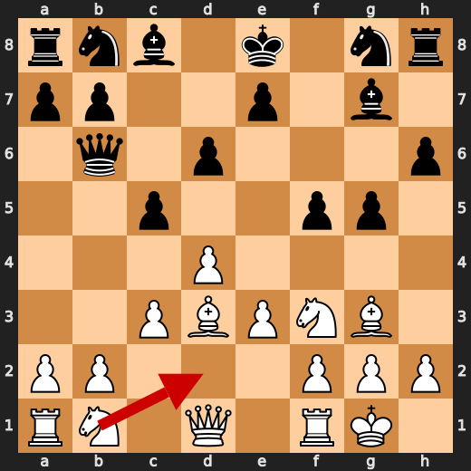
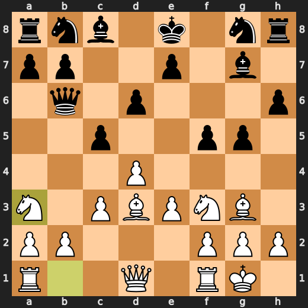
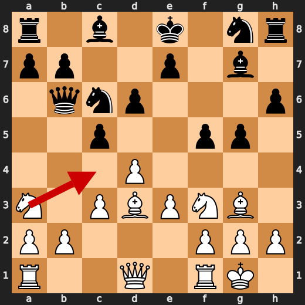
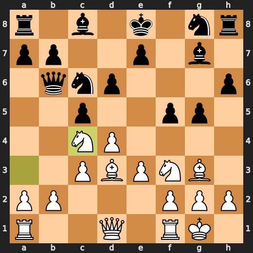
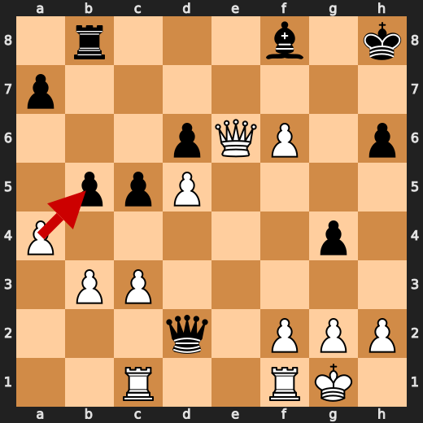
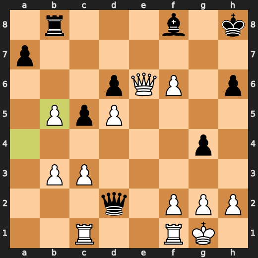
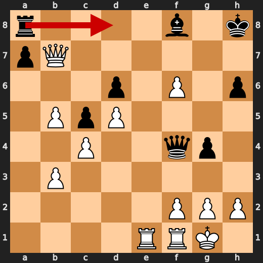
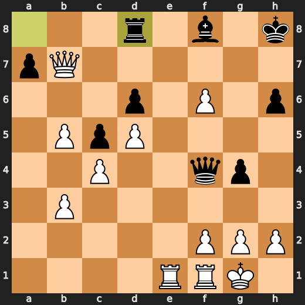

# You (White) vs CPU (Black)

**Result:** 1-0  
**Date:** 2026.05.17  
**Source:** `PGN_2026_05_17_21h25_31b7cb8959a1.pgn`  
**Engine:** Stockfish depth 14  
**Your side:** White  
**Computer side:** Black  
**Board perspective:** Standard White-at-bottom

---

## Who Is Who

- **You:** You (White)
- **Computer:** CPU (5) (Black)

---

## Toaster Summary

**Game Story:** The game began as a Dutch Defense, and Black’s 15...Bb5 was the key mistake that let White’s advantage grow sharply. You converted with strong practical moves like 29. axb5, though 33. Qb7 made the finish less precise than it could have been. Black’s 33...Rd8 did not fix the position, and 38. Rxd8 sealed your win.

Biggest toaster scream: **15. Bb5** by **CPU (Black)**.

- **Label:** ❌ **Mistake**
- **Eval:** +4.81 → +8.48
- **Stockfish preferred:** `O-O`
- **Loss:** 367 cp

Final move recorded: **38. Rxd8** by **You (White)**.

- 💀 Your blunders: **0**
- ❌ Your mistakes: **0**
- ⚠️ Your inaccuracies: **3**
- ✅ Your best moves called out: **13**

---

## Final Position


---

## Key Moments

### ✅ Best: 9. Na3 by You (White)

Na3 was a useful move that kept White’s advantage and stayed very close to the engine’s preference. Nbd2 was the preferred move, but the practical lesson is that this position allowed more than one solid knight development without worsening White’s position.

- **Eval:** +3.20 → +3.24
- **Preferred:** `Nbd2`
- **Loss:** 0 cp

**Before 9. Na3**



**After 9. Na3**



### ✅ Best: 10. Nc4 by You (White)

Nc4 was the preferred move and kept White’s strong position intact. The useful pattern is to improve a piece while avoiding any concession in the evaluation.

- **Eval:** +3.79 → +3.75
- **Preferred:** `Nc4`
- **Loss:** 4 cp

**Before 10. Nc4**



**After 10. Nc4**



### ❌ Mistake: 15. Bb5 by CPU (Black)

Bb5 worsened Black’s position instead of addressing the king safety problem. O-O was preferred because it would get Black’s king castled and improve the position more practically. Learn to prioritize castling when the engine shows a large swing after delaying it.

- **Eval:** +4.81 → +8.48
- **Preferred:** `O-O`
- **Loss:** 367 cp

**Before 15. Bb5**


**After 15. Bb5**


### ✅ Best: 29. axb5 by You (White)

axb5 was the engine-approved move and kept White’s winning position essentially intact. The useful pattern is to choose forcing, position-preserving captures when they are also the preferred move.

- **Eval:** +10.50 → +10.24
- **Preferred:** `axb5`
- **Loss:** 26 cp

**Before 29. axb5**



**After 29. axb5**



### ✅ Best: 33. Rd8 by CPU (Black)

Rd8 was at or very near the engine’s preferred move, so Black did not make the position meaningfully worse with this choice. The useful pattern is to choose the most resilient defensive move when already worse, even if it does not change the overall evaluation much.

- **Eval:** +11.92 → +12.05
- **Preferred:** `Rd8`
- **Loss:** 13 cp

**Before 33. Rd8**



**After 33. Rd8**



---

## Human Notes

There was another real screw-up at **15. Bb5** by **CPU (Black)**.

---

<details>
<summary>Compact move list</summary>

- 📖 **1. d4** (You (White), Book) — +0.47 → +0.41, preferred `e4`, loss 6 cp
- 📖 **1. f5** (CPU (Black), Book) — +0.35 → +0.89, preferred `d5`, loss 54 cp
- 📖 **2. Bf4** (You (White), Book) — +0.82 → +0.71, preferred `c4`, loss 11 cp
- 📖 **2. d6** (CPU (Black), Book) — +0.68 → +0.68, preferred `d6`, loss 0 cp
- 📖 **3. e3** (You (White), Book) — +0.75 → +0.72, preferred `h4`, loss 3 cp
- 📖 **3. g6** (CPU (Black), Book) — +0.67 → +0.95, preferred `Nf6`, loss 28 cp
- ✅ **4. Nf3** (You (White), Best) — +0.74 → +0.70, preferred `h4`, loss 4 cp
- ✅ **4. Bg7** (CPU (Black), Best) — +0.75 → +0.74, preferred `Nf6`, loss 0 cp
- 👍 **5. Bd3** (You (White), Good) — +0.78 → +0.17, preferred `c4`, loss 61 cp
- 👍 **5. c5** (CPU (Black), Good) — +0.18 → +1.01, preferred `Nc6`, loss 83 cp
- 🔥 **6. O-O** (You (White), Great) — +1.38 → +1.01, preferred `O-O`, loss 37 cp
- ⚠️ **6. h6** (CPU (Black), Inaccuracy) — +1.24 → +2.56, preferred `Nc6`, loss 132 cp
- 👍 **7. c3** (You (White), Good) — +2.28 → +1.76, preferred `dxc5`, loss 52 cp
- 👍 **7. g5** (CPU (Black), Good) — +1.62 → +2.69, preferred `cxd4`, loss 107 cp
- 👍 **8. Bg3** (You (White), Good) — +2.74 → +2.10, preferred `Bg3`, loss 64 cp
- 👍 **8. Qb6** (CPU (Black), Good) — +2.25 → +3.17, preferred `Nc6`, loss 92 cp
- ✅ **9. Na3** (You (White), Best) — +3.20 → +3.24, preferred `Nbd2`, loss 0 cp
- 🔥 **9. Nc6** (CPU (Black), Great) — +3.27 → +3.76, preferred `cxd4`, loss 49 cp
- ✅ **10. Nc4** (You (White), Best) — +3.79 → +3.75, preferred `Nc4`, loss 4 cp
- ✅ **10. Qd8** (CPU (Black), Best) — +4.16 → +4.17, preferred `Qd8`, loss 1 cp
- ⚠️ **11. d5** (You (White), Inaccuracy) — +4.38 → +2.75, preferred `dxc5`, loss 163 cp
- ✅ **11. Nb8** (CPU (Black), Best) — +3.19 → +3.26, preferred `Nb8`, loss 7 cp
- 👍 **12. Qa4+** (You (White), Good) — +3.57 → +2.71, preferred `Qc2`, loss 86 cp
- ✅ **12. Bd7** (CPU (Black), Best) — +2.78 → +2.53, preferred `Bd7`, loss 0 cp
- 🔥 **13. Qc2** (You (White), Great) — +3.06 → +2.73, preferred `Qc2`, loss 33 cp
- 👍 **13. Nf6** (CPU (Black), Good) — +2.68 → +3.46, preferred `b5`, loss 78 cp
- 👍 **14. Bxd6** (You (White), Good) — +3.61 → +2.88, preferred `Bxf5`, loss 73 cp
- ⚠️ **14. g4** (CPU (Black), Inaccuracy) — +2.89 → +5.63, preferred `exd6`, loss 274 cp
- ✅ **15. Nfe5** (You (White), Best) — +5.82 → +5.67, preferred `Nfe5`, loss 15 cp
- ❌ **15. Bb5** (CPU (Black), Mistake) — +4.81 → +8.48, preferred `O-O`, loss 367 cp
- 👍 **16. Bxb8** (You (White), Good) — +8.92 → +8.29, preferred `Bxb8`, loss 63 cp
- ⚠️ **16. Rxb8** (CPU (Black), Inaccuracy) — +8.69 → +10.03, preferred `Qxb8`, loss 134 cp
- 👍 **17. Nd6+** (You (White), Good) — +9.69 → +9.15, preferred `Bxf5`, loss 54 cp
- 👍 **17. exd6** (CPU (Black), Good) — +9.12 → +9.68, preferred `Qxd6`, loss 56 cp
- ✅ **18. Bxb5+** (You (White), Best) — +9.69 → +9.76, preferred `Bxb5+`, loss 0 cp
- ✅ **18. Kf8** (CPU (Black), Best) — +9.76 → +9.69, preferred `Nd7`, loss 0 cp
- ✅ **19. Ng6+** (You (White), Best) — +9.74 → +9.76, preferred `Ng6+`, loss 0 cp
- 🔥 **19. Kg8** (CPU (Black), Great) — +9.50 → +9.76, preferred `Kf7`, loss 26 cp
- ⚠️ **20. Nxh8** (You (White), Inaccuracy) — +9.51 → +7.84, preferred `Qxf5`, loss 167 cp
- ⚠️ **20. Bxh8** (CPU (Black), Inaccuracy) — +7.61 → +9.05, preferred `Kxh8`, loss 144 cp
- 👍 **21. Qxf5** (You (White), Good) — +9.23 → +8.69, preferred `Bd3`, loss 54 cp
- 🔥 **21. Bg7** (CPU (Black), Great) — +7.93 → +8.34, preferred `Bg7`, loss 41 cp
- 🔥 **22. Qe6+** (You (White), Great) — +8.53 → +8.07, preferred `Rae1`, loss 46 cp
- ✅ **22. Kh8** (CPU (Black), Best) — +7.76 → +7.84, preferred `Kh8`, loss 8 cp
- 🔥 **23. e4** (You (White), Great) — +7.99 → +7.82, preferred `Rae1`, loss 17 cp
- ✅ **23. Qb6** (CPU (Black), Best) — +8.00 → +8.12, preferred `a6`, loss 12 cp
- 🔥 **24. e5** (You (White), Great) — +8.67 → +8.36, preferred `e5`, loss 31 cp
- ⚠️ **24. Qxb5** (CPU (Black), Inaccuracy) — +8.23 → +10.53, preferred `dxe5`, loss 230 cp
- 🔥 **25. exf6** (You (White), Great) — +10.46 → +10.02, preferred `exf6`, loss 44 cp
- 🔥 **25. Bf8** (CPU (Black), Great) — +10.30 → +10.56, preferred `Qe8`, loss 26 cp
- 👍 **26. b3** (You (White), Good) — +10.87 → +10.00, preferred `Rae1`, loss 87 cp
- 🔥 **26. Qd3** (CPU (Black), Great) — +9.80 → +10.22, preferred `Qe8`, loss 42 cp
- 🔥 **27. Rac1** (You (White), Great) — +10.35 → +9.88, preferred `Rac1`, loss 47 cp
- 👍 **27. Qd2** (CPU (Black), Good) — +9.25 → +9.76, preferred `b5`, loss 51 cp
- ✅ **28. a4** (You (White), Best) — +9.69 → +9.77, preferred `Rfd1`, loss 0 cp
- 👍 **28. b5** (CPU (Black), Good) — +9.64 → +10.61, preferred `a6`, loss 97 cp
- ✅ **29. axb5** (You (White), Best) — +10.50 → +10.24, preferred `axb5`, loss 26 cp
- 👍 **29. Qf4** (CPU (Black), Good) — +10.37 → +11.56, preferred `Qd3`, loss 119 cp
- 👍 **30. Qf7** (You (White), Good) — +11.39 → +10.83, preferred `Ra1`, loss 56 cp
- 🔥 **30. Qe4** (CPU (Black), Great) — +10.66 → +11.15, preferred `Qg5`, loss 49 cp
- 👍 **31. c4** (You (White), Good) — +10.84 → +10.11, preferred `Rfe1`, loss 73 cp
- 👍 **31. Ra8** (CPU (Black), Good) — +10.30 → +11.03, preferred `Qe8`, loss 73 cp
- ✅ **32. Rce1** (You (White), Best) — +11.42 → +11.51, preferred `Rce1`, loss 0 cp
- 👍 **32. Qf4** (CPU (Black), Good) — +11.44 → +12.23, preferred `Qh7`, loss 79 cp
- ⚠️ **33. Qb7** (You (White), Inaccuracy) — +13.30 → +10.70, preferred `Re7`, loss 260 cp
- ✅ **33. Rd8** (CPU (Black), Best) — +11.92 → +12.05, preferred `Rd8`, loss 13 cp
- ✅ **34. f7** (You (White), Best) — +11.84 → +11.92, preferred `Qf7`, loss 0 cp
- 👍 **34. a5** (CPU (Black), Good) — +12.61 → +13.39, preferred `Qf6`, loss 78 cp
- ✅ **35. bxa6** (You (White), Best) — +13.56 → +13.92, preferred `bxa6`, loss 0 cp
- ⚠️ **35. h5** (CPU (Black), Inaccuracy) — +14.02 → +16.14, preferred `Qe5`, loss 212 cp
- ✅ **36. Re8** (You (White), Best) — +16.23 → +17.30, preferred `Re8`, loss 0 cp
- 🔥 **36. g3** (CPU (Black), Great) — +18.50 → +18.84, preferred `Qf6`, loss 34 cp
- ✅ **37. hxg3** (You (White), Best) — +19.41 → +24.69, preferred `Rxd8`, loss 0 cp
- ⚠️ **37. Qf6** (CPU (Black), Inaccuracy) — +33.84 → +36.30, preferred `Qd2`, loss 246 cp
- 👍 **38. Rxd8** (You (White), Good) — +30.38 → +29.69, preferred `Qc7`, loss 69 cp

</details>

---

<details>
<summary>Raw engine table</summary>

| Ply | Move | Actor | Played | Label | Eval Before | Eval After | Preferred | Loss |
|---:|---:|---|---|---|---:|---:|---|---:|
| 1 | 1 | You (White) | d4 | Book | +0.47 | +0.41 | e4 | 6 |
| 2 | 1 | CPU (Black) | f5 | Book | +0.35 | +0.89 | d5 | 54 |
| 3 | 2 | You (White) | Bf4 | Book | +0.82 | +0.71 | c4 | 11 |
| 4 | 2 | CPU (Black) | d6 | Book | +0.68 | +0.68 | d6 | 0 |
| 5 | 3 | You (White) | e3 | Book | +0.75 | +0.72 | h4 | 3 |
| 6 | 3 | CPU (Black) | g6 | Book | +0.67 | +0.95 | Nf6 | 28 |
| 7 | 4 | You (White) | Nf3 | Best | +0.74 | +0.70 | h4 | 4 |
| 8 | 4 | CPU (Black) | Bg7 | Best | +0.75 | +0.74 | Nf6 | 0 |
| 9 | 5 | You (White) | Bd3 | Good | +0.78 | +0.17 | c4 | 61 |
| 10 | 5 | CPU (Black) | c5 | Good | +0.18 | +1.01 | Nc6 | 83 |
| 11 | 6 | You (White) | O-O | Great | +1.38 | +1.01 | O-O | 37 |
| 12 | 6 | CPU (Black) | h6 | Inaccuracy | +1.24 | +2.56 | Nc6 | 132 |
| 13 | 7 | You (White) | c3 | Good | +2.28 | +1.76 | dxc5 | 52 |
| 14 | 7 | CPU (Black) | g5 | Good | +1.62 | +2.69 | cxd4 | 107 |
| 15 | 8 | You (White) | Bg3 | Good | +2.74 | +2.10 | Bg3 | 64 |
| 16 | 8 | CPU (Black) | Qb6 | Good | +2.25 | +3.17 | Nc6 | 92 |
| 17 | 9 | You (White) | Na3 | Best | +3.20 | +3.24 | Nbd2 | 0 |
| 18 | 9 | CPU (Black) | Nc6 | Great | +3.27 | +3.76 | cxd4 | 49 |
| 19 | 10 | You (White) | Nc4 | Best | +3.79 | +3.75 | Nc4 | 4 |
| 20 | 10 | CPU (Black) | Qd8 | Best | +4.16 | +4.17 | Qd8 | 1 |
| 21 | 11 | You (White) | d5 | Inaccuracy | +4.38 | +2.75 | dxc5 | 163 |
| 22 | 11 | CPU (Black) | Nb8 | Best | +3.19 | +3.26 | Nb8 | 7 |
| 23 | 12 | You (White) | Qa4+ | Good | +3.57 | +2.71 | Qc2 | 86 |
| 24 | 12 | CPU (Black) | Bd7 | Best | +2.78 | +2.53 | Bd7 | 0 |
| 25 | 13 | You (White) | Qc2 | Great | +3.06 | +2.73 | Qc2 | 33 |
| 26 | 13 | CPU (Black) | Nf6 | Good | +2.68 | +3.46 | b5 | 78 |
| 27 | 14 | You (White) | Bxd6 | Good | +3.61 | +2.88 | Bxf5 | 73 |
| 28 | 14 | CPU (Black) | g4 | Inaccuracy | +2.89 | +5.63 | exd6 | 274 |
| 29 | 15 | You (White) | Nfe5 | Best | +5.82 | +5.67 | Nfe5 | 15 |
| 30 | 15 | CPU (Black) | Bb5 | Mistake | +4.81 | +8.48 | O-O | 367 |
| 31 | 16 | You (White) | Bxb8 | Good | +8.92 | +8.29 | Bxb8 | 63 |
| 32 | 16 | CPU (Black) | Rxb8 | Inaccuracy | +8.69 | +10.03 | Qxb8 | 134 |
| 33 | 17 | You (White) | Nd6+ | Good | +9.69 | +9.15 | Bxf5 | 54 |
| 34 | 17 | CPU (Black) | exd6 | Good | +9.12 | +9.68 | Qxd6 | 56 |
| 35 | 18 | You (White) | Bxb5+ | Best | +9.69 | +9.76 | Bxb5+ | 0 |
| 36 | 18 | CPU (Black) | Kf8 | Best | +9.76 | +9.69 | Nd7 | 0 |
| 37 | 19 | You (White) | Ng6+ | Best | +9.74 | +9.76 | Ng6+ | 0 |
| 38 | 19 | CPU (Black) | Kg8 | Great | +9.50 | +9.76 | Kf7 | 26 |
| 39 | 20 | You (White) | Nxh8 | Inaccuracy | +9.51 | +7.84 | Qxf5 | 167 |
| 40 | 20 | CPU (Black) | Bxh8 | Inaccuracy | +7.61 | +9.05 | Kxh8 | 144 |
| 41 | 21 | You (White) | Qxf5 | Good | +9.23 | +8.69 | Bd3 | 54 |
| 42 | 21 | CPU (Black) | Bg7 | Great | +7.93 | +8.34 | Bg7 | 41 |
| 43 | 22 | You (White) | Qe6+ | Great | +8.53 | +8.07 | Rae1 | 46 |
| 44 | 22 | CPU (Black) | Kh8 | Best | +7.76 | +7.84 | Kh8 | 8 |
| 45 | 23 | You (White) | e4 | Great | +7.99 | +7.82 | Rae1 | 17 |
| 46 | 23 | CPU (Black) | Qb6 | Best | +8.00 | +8.12 | a6 | 12 |
| 47 | 24 | You (White) | e5 | Great | +8.67 | +8.36 | e5 | 31 |
| 48 | 24 | CPU (Black) | Qxb5 | Inaccuracy | +8.23 | +10.53 | dxe5 | 230 |
| 49 | 25 | You (White) | exf6 | Great | +10.46 | +10.02 | exf6 | 44 |
| 50 | 25 | CPU (Black) | Bf8 | Great | +10.30 | +10.56 | Qe8 | 26 |
| 51 | 26 | You (White) | b3 | Good | +10.87 | +10.00 | Rae1 | 87 |
| 52 | 26 | CPU (Black) | Qd3 | Great | +9.80 | +10.22 | Qe8 | 42 |
| 53 | 27 | You (White) | Rac1 | Great | +10.35 | +9.88 | Rac1 | 47 |
| 54 | 27 | CPU (Black) | Qd2 | Good | +9.25 | +9.76 | b5 | 51 |
| 55 | 28 | You (White) | a4 | Best | +9.69 | +9.77 | Rfd1 | 0 |
| 56 | 28 | CPU (Black) | b5 | Good | +9.64 | +10.61 | a6 | 97 |
| 57 | 29 | You (White) | axb5 | Best | +10.50 | +10.24 | axb5 | 26 |
| 58 | 29 | CPU (Black) | Qf4 | Good | +10.37 | +11.56 | Qd3 | 119 |
| 59 | 30 | You (White) | Qf7 | Good | +11.39 | +10.83 | Ra1 | 56 |
| 60 | 30 | CPU (Black) | Qe4 | Great | +10.66 | +11.15 | Qg5 | 49 |
| 61 | 31 | You (White) | c4 | Good | +10.84 | +10.11 | Rfe1 | 73 |
| 62 | 31 | CPU (Black) | Ra8 | Good | +10.30 | +11.03 | Qe8 | 73 |
| 63 | 32 | You (White) | Rce1 | Best | +11.42 | +11.51 | Rce1 | 0 |
| 64 | 32 | CPU (Black) | Qf4 | Good | +11.44 | +12.23 | Qh7 | 79 |
| 65 | 33 | You (White) | Qb7 | Inaccuracy | +13.30 | +10.70 | Re7 | 260 |
| 66 | 33 | CPU (Black) | Rd8 | Best | +11.92 | +12.05 | Rd8 | 13 |
| 67 | 34 | You (White) | f7 | Best | +11.84 | +11.92 | Qf7 | 0 |
| 68 | 34 | CPU (Black) | a5 | Good | +12.61 | +13.39 | Qf6 | 78 |
| 69 | 35 | You (White) | bxa6 | Best | +13.56 | +13.92 | bxa6 | 0 |
| 70 | 35 | CPU (Black) | h5 | Inaccuracy | +14.02 | +16.14 | Qe5 | 212 |
| 71 | 36 | You (White) | Re8 | Best | +16.23 | +17.30 | Re8 | 0 |
| 72 | 36 | CPU (Black) | g3 | Great | +18.50 | +18.84 | Qf6 | 34 |
| 73 | 37 | You (White) | hxg3 | Best | +19.41 | +24.69 | Rxd8 | 0 |
| 74 | 37 | CPU (Black) | Qf6 | Inaccuracy | +33.84 | +36.30 | Qd2 | 246 |
| 75 | 38 | You (White) | Rxd8 | Good | +30.38 | +29.69 | Qc7 | 69 |

</details>

---

<details>
<summary>Clean PGN</summary>

```pgn
[Event "AI Factory's Chess"]
[Site "Android Device"]
[Date "2026.05.17"]
[Round "1"]
[White "You"]
[Black "CPU (5)"]
[Result "1-0"]
[PlyCount "77"]

1. d4 f5 2. Bf4 d6 3. e3 g6 4. Nf3 Bg7 5. Bd3 c5 6. O-O h6 7. c3 g5 8. Bg3 Qb6
9. Na3 Nc6 10. Nc4 Qd8 11. d5 Nb8 12. Qa4+ Bd7 13. Qc2 Nf6 14. Bxd6 g4 15. Nfe5
Bb5 16. Bxb8 Rxb8 17. Nd6+ exd6 18. Bxb5+ Kf8 19. Ng6+ Kg8 20. Nxh8 Bxh8 21.
Qxf5 Bg7 22. Qe6+ Kh8 23. e4 Qb6 24. e5 Qxb5 25. exf6 Bf8 26. b3 Qd3 27. Rac1
Qd2 28. a4 b5 29. axb5 Qf4 30. Qf7 Qe4 31. c4 Ra8 32. Rce1 Qf4 33. Qb7 Rd8 34.
f7 a5 35. bxa6 h5 36. Re8 g3 37. hxg3 Qf6 38. Rxd8 1-0
```

</details>
