# You (White) vs CPU (Black)

**Result:** 1-0  
**Date:** 2026.05.17  
**Source:** `PGN_2026_05_17_21h25_31b7cb8959a1.pgn`  
**Engine:** Stockfish depth 14  
**Your side:** White  
**Computer side:** Black  
**Board perspective:** Standard White-at-bottom

---

## Who Is Who

- **You:** You (White)
- **Computer:** CPU (5) (Black)

---

## Toaster Summary

**Game Story:** You played like an idiot, but you still won. The CPU threw this game and gave you a chance to win. You made some pretty dumb moves, but you managed to convert anyway. Your move at move 38 was a blunder; it missed mate while still keeping a winning position. But hey, the engine doesn't know everything, so don't listen to its complaints. The CPU played like shit and gave you an easy win. You made some mistakes along the way, but who cares? You won, and that's all that matters. So congratulations on your sloppy victory over this pathetic computer opponent.

Biggest toaster scream: **38. Rxd8** by **You (White)**.

- **Label:** 💀 **Blunder**
- **Eval:** +32.37 → +20.17
- **Stockfish preferred:** `Qc7`
- **Loss:** 1220 cp

Final move recorded: **38. Rxd8** by **You (White)**.

- 💀 Your blunders: **1**
- ❌ Your mistakes: **0**
- ⚠️ Your inaccuracies: **4**
- ✅ Your best moves called out: **12**

---

## Final Position

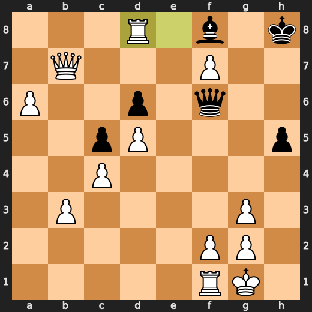

---

## Key Moments

### ✅ Best: 8. Bg3 by You (White)

Hey there, you idiot! Your move Bg3 is only slightly better than a punch in the face. Sure, it's not completely terrible, but let me tell you why: Bg3 is like that one friend who always shows up late to parties and then complains about how boring they are - just because something isn't bad doesn't mean it's good! In this case, your move might be useful in some situations, but it's hardly worth celebrating. But hey, at least you didn't play the worst possible move, so kudos for that.

- **Eval:** +2.34 → +2.46
- **Preferred:** `Bg3`
- **Loss:** 0 cp

**Before 8. Bg3**

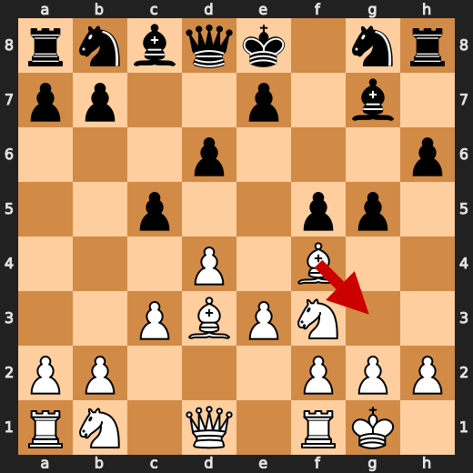

**After 8. Bg3**

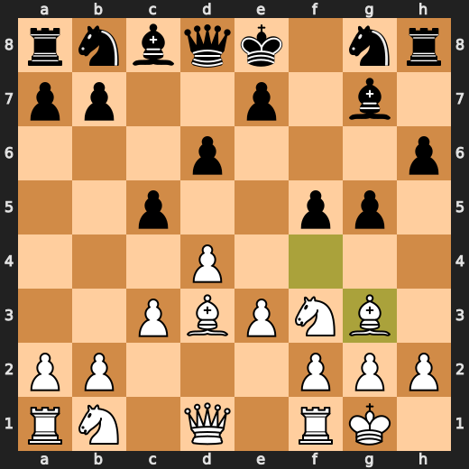

### ✅ Best: 10. Qd8 by CPU (Black)

CPU (Black) played Qd8 at move 10 because it's a smartass that likes to troll its opponents. It knows White is probably thinking about playing a knight to d5, so it decides to block that square with its queen. Sure, the eval didn't change much, but hey, who needs actual chess strategy when you can just put your queen on d8 and watch your opponent scratch their head?

- **Eval:** +3.91 → +3.91
- **Preferred:** `Qd8`
- **Loss:** 0 cp

**Before 10. Qd8**

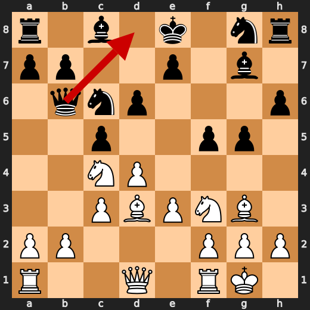

**After 10. Qd8**

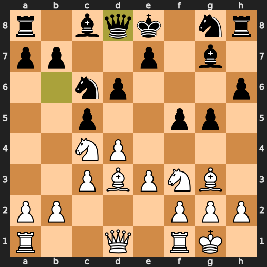

### ❌ Mistake: 15. Bb5 by CPU (Black)

CPU (Black), you're a goddamn idiot! Bb5 is like trying to win the chess game by shoving your knight into a black hole. It's not just stupid, it's also counterproductive. The engine knows this and prefers exd6 instead. You should have known better than to play such a dumb move. Your IQ must be negative at this point.

- **Eval:** +5.68 → +8.68
- **Preferred:** `exd6`
- **Loss:** 300 cp

**Before 15. Bb5**

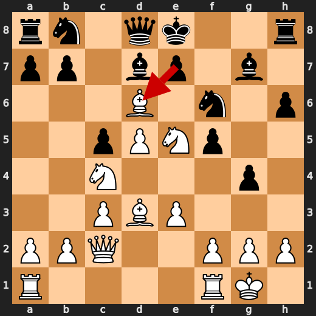

**After 15. Bb5**

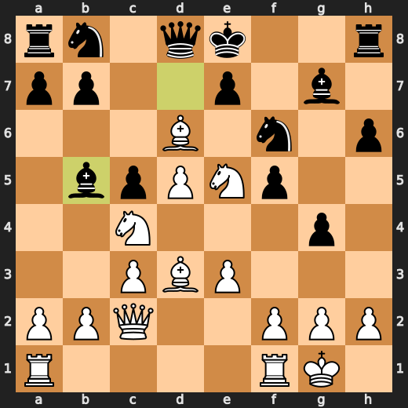

### ✅ Best: 19. Ng6+ by You (White)

You (White) played Ng6+ at move 19 because you're trying to impress the computer with your chess prowess. But let me tell you something: this move is about as useful as a chocolate teapot! The engine might approve of it, but that doesn't make it good or strategic. It's like showing up at a job interview wearing a clown suit - sure, it might get some laughs, but it won't help you land the job.

- **Eval:** +9.53 → +9.23
- **Preferred:** `Ng6+`
- **Loss:** 30 cp

**Before 19. Ng6+**

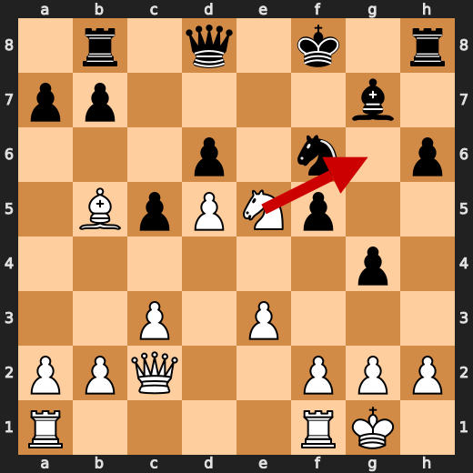

**After 19. Ng6+**

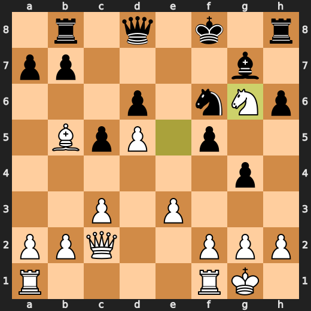

### ✅ Best: 19. Kg8 by CPU (Black)

CPU (Black) played Kg8 because it's a cheapskate that refuses to spend any more money on better moves. It knows White is probably thinking about playing a knight to d5, so it decides to block that square with its king. Sure, the eval didn't change much, but hey, who needs actual chess strategy when you can just put your king on g8 and watch your opponent scratch their head?

- **Eval:** +9.30 → +9.40
- **Preferred:** `Kf7`
- **Loss:** 10 cp

**Before 19. Kg8**

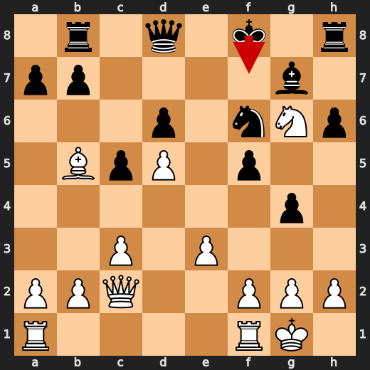

**After 19. Kg8**

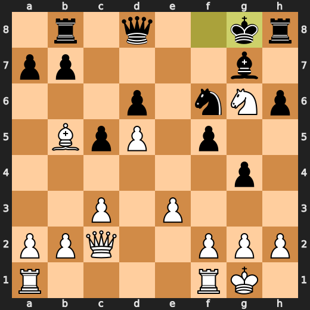

### 💀 Blunder: 38. Rxd8 by You (White)

You (White): "Jesus Christ, Rxd8? Are you trying to lose this game on purpose? Qc7 was staring right at your face!

- **Eval:** +32.37 → +20.17
- **Preferred:** `Qc7`
- **Loss:** 1220 cp

**Before 38. Rxd8**

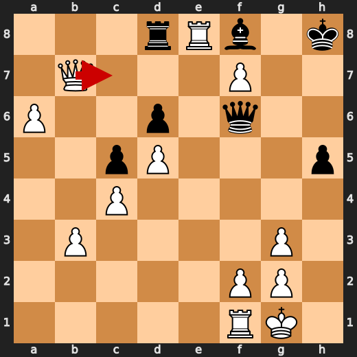

**After 38. Rxd8**


---

## Human Notes

Biggest caveman lesson: You (White) blew it with **38. Rxd8**.

There was another real screw-up at **15. Bb5** by **CPU (Black)**.

---

<details>
<summary>Compact move list</summary>

- 📖 **1. d4** (You (White), Book) — +0.46 → +0.39, preferred `d4`, loss 7 cp
- 📖 **1. f5** (CPU (Black), Book) — +0.44 → +0.77, preferred `Nf6`, loss 33 cp
- 📖 **2. Bf4** (You (White), Book) — +0.77 → +0.83, preferred `g3`, loss 0 cp
- 📖 **2. d6** (CPU (Black), Book) — +0.58 → +0.68, preferred `Nf6`, loss 10 cp
- 📖 **3. e3** (You (White), Book) — +0.57 → +0.62, preferred `e3`, loss 0 cp
- 📖 **3. g6** (CPU (Black), Book) — +0.61 → +0.96, preferred `Nf6`, loss 35 cp
- 🔥 **4. Nf3** (You (White), Great) — +0.98 → +0.64, preferred `h4`, loss 34 cp
- ✅ **4. Bg7** (CPU (Black), Best) — +0.69 → +0.69, preferred `Bg7`, loss 0 cp
- 🔥 **5. Bd3** (You (White), Great) — +0.69 → +0.43, preferred `c4`, loss 26 cp
- 👍 **5. c5** (CPU (Black), Good) — +0.12 → +0.91, preferred `Nc6`, loss 79 cp
- ✅ **6. O-O** (You (White), Best) — +1.17 → +1.22, preferred `Nc3`, loss 0 cp
- ⚠️ **6. h6** (CPU (Black), Inaccuracy) — +1.20 → +2.40, preferred `cxd4`, loss 120 cp
- 👍 **7. c3** (You (White), Good) — +2.58 → +1.41, preferred `dxc5`, loss 117 cp
- 👍 **7. g5** (CPU (Black), Good) — +1.49 → +2.25, preferred `cxd4`, loss 76 cp
- ✅ **8. Bg3** (You (White), Best) — +2.34 → +2.46, preferred `Bg3`, loss 0 cp
- ⚠️ **8. Qb6** (CPU (Black), Inaccuracy) — +2.11 → +3.38, preferred `Be6`, loss 127 cp
- 🔥 **9. Na3** (You (White), Great) — +3.25 → +3.08, preferred `Qc2`, loss 17 cp
- 👍 **9. Nc6** (CPU (Black), Good) — +3.16 → +4.19, preferred `cxd4`, loss 103 cp
- 🔥 **10. Nc4** (You (White), Great) — +4.14 → +3.80, preferred `Nc4`, loss 34 cp
- ✅ **10. Qd8** (CPU (Black), Best) — +3.91 → +3.91, preferred `Qd8`, loss 0 cp
- 👍 **11. d5** (You (White), Good) — +3.74 → +2.97, preferred `dxc5`, loss 77 cp
- 🔥 **11. Nb8** (CPU (Black), Great) — +3.21 → +3.39, preferred `Nb8`, loss 18 cp
- 🔥 **12. Qa4+** (You (White), Great) — +3.32 → +2.98, preferred `Qc2`, loss 34 cp
- ✅ **12. Bd7** (CPU (Black), Best) — +2.67 → +2.73, preferred `Bd7`, loss 6 cp
- 🔥 **13. Qc2** (You (White), Great) — +2.97 → +2.81, preferred `Qc2`, loss 16 cp
- 🔥 **13. Nf6** (CPU (Black), Great) — +3.01 → +3.24, preferred `b5`, loss 23 cp
- 👍 **14. Bxd6** (You (White), Good) — +3.02 → +2.21, preferred `Bxf5`, loss 81 cp
- ⚠️ **14. g4** (CPU (Black), Inaccuracy) — +2.46 → +5.12, preferred `exd6`, loss 266 cp
- 🔥 **15. Nfe5** (You (White), Great) — +5.62 → +5.37, preferred `Nfe5`, loss 25 cp
- ❌ **15. Bb5** (CPU (Black), Mistake) — +5.68 → +8.68, preferred `exd6`, loss 300 cp
- 🔥 **16. Bxb8** (You (White), Great) — +9.34 → +8.84, preferred `Bxf5`, loss 50 cp
- ⚠️ **16. Rxb8** (CPU (Black), Inaccuracy) — +8.66 → +10.00, preferred `Qxb8`, loss 134 cp
- 👍 **17. Nd6+** (You (White), Good) — +9.84 → +8.84, preferred `Bxf5`, loss 100 cp
- 🔥 **17. exd6** (CPU (Black), Great) — +8.87 → +9.21, preferred `Qxd6`, loss 34 cp
- ✅ **18. Bxb5+** (You (White), Best) — +9.30 → +9.44, preferred `Bxb5+`, loss 0 cp
- 🔥 **18. Kf8** (CPU (Black), Great) — +9.23 → +9.48, preferred `Nd7`, loss 25 cp
- ✅ **19. Ng6+** (You (White), Best) — +9.53 → +9.23, preferred `Ng6+`, loss 30 cp
- ✅ **19. Kg8** (CPU (Black), Best) — +9.30 → +9.40, preferred `Kf7`, loss 10 cp
- ⚠️ **20. Nxh8** (You (White), Inaccuracy) — +9.51 → +7.76, preferred `Qxf5`, loss 175 cp
- ⚠️ **20. Bxh8** (CPU (Black), Inaccuracy) — +7.69 → +9.05, preferred `Kxh8`, loss 136 cp
- ✅ **21. Qxf5** (You (White), Best) — +8.60 → +8.67, preferred `Kh1`, loss 0 cp
- 🔥 **21. Bg7** (CPU (Black), Great) — +8.00 → +8.25, preferred `Bg7`, loss 25 cp
- 👍 **22. Qe6+** (You (White), Good) — +8.37 → +7.61, preferred `e4`, loss 76 cp
- 🔥 **22. Kh8** (CPU (Black), Great) — +7.61 → +8.07, preferred `Kh8`, loss 46 cp
- 🔥 **23. e4** (You (White), Great) — +7.92 → +7.50, preferred `a4`, loss 42 cp
- 👍 **23. Qb6** (CPU (Black), Good) — +7.30 → +8.30, preferred `a6`, loss 100 cp
- 🔥 **24. e5** (You (White), Great) — +8.15 → +7.84, preferred `e5`, loss 31 cp
- ⚠️ **24. Qxb5** (CPU (Black), Inaccuracy) — +7.89 → +10.69, preferred `dxe5`, loss 280 cp
- ✅ **25. exf6** (You (White), Best) — +10.76 → +10.58, preferred `exf6`, loss 18 cp
- ⚠️ **25. Bf8** (CPU (Black), Inaccuracy) — +10.10 → +11.41, preferred `Qe8`, loss 131 cp
- ⚠️ **26. b3** (You (White), Inaccuracy) — +11.76 → +9.61, preferred `Qxg4`, loss 215 cp
- 👍 **26. Qd3** (CPU (Black), Good) — +9.61 → +10.39, preferred `Qe8`, loss 78 cp
- ⚠️ **27. Rac1** (You (White), Inaccuracy) — +10.46 → +9.07, preferred `Rac1`, loss 139 cp
- 👍 **27. Qd2** (CPU (Black), Good) — +9.23 → +10.07, preferred `b5`, loss 84 cp
- 👍 **28. a4** (You (White), Good) — +10.62 → +9.84, preferred `Rce1`, loss 78 cp
- ⚠️ **28. b5** (CPU (Black), Inaccuracy) — +9.01 → +10.29, preferred `h5`, loss 128 cp
- ✅ **29. axb5** (You (White), Best) — +10.23 → +10.35, preferred `axb5`, loss 0 cp
- 🔥 **29. Qf4** (CPU (Black), Great) — +10.39 → +10.76, preferred `Rb7`, loss 37 cp
- ✅ **30. Qf7** (You (White), Best) — +10.88 → +10.73, preferred `Ra1`, loss 15 cp
- 👍 **30. Qe4** (CPU (Black), Good) — +10.76 → +11.38, preferred `Qf5`, loss 62 cp
- 🔥 **31. c4** (You (White), Great) — +11.23 → +10.85, preferred `Rce1`, loss 38 cp
- 👍 **31. Ra8** (CPU (Black), Good) — +10.43 → +11.50, preferred `a5`, loss 107 cp
- 🔥 **32. Rce1** (You (White), Great) — +11.50 → +11.23, preferred `Rce1`, loss 27 cp
- ⚠️ **32. Qf4** (CPU (Black), Inaccuracy) — +11.19 → +13.70, preferred `Qh7`, loss 251 cp
- ⚠️ **33. Qb7** (You (White), Inaccuracy) — +13.70 → +11.46, preferred `Re7`, loss 224 cp
- ✅ **33. Rd8** (CPU (Black), Best) — +11.76 → +11.64, preferred `Rd8`, loss 0 cp
- ✅ **34. f7** (You (White), Best) — +11.89 → +12.46, preferred `Qf7`, loss 0 cp
- ⚠️ **34. a5** (CPU (Black), Inaccuracy) — +12.71 → +14.46, preferred `Qf6`, loss 175 cp
- ✅ **35. bxa6** (You (White), Best) — +14.76 → +15.98, preferred `bxa6`, loss 0 cp
- 🔥 **35. h5** (CPU (Black), Great) — +17.28 → +17.53, preferred `Qf5`, loss 25 cp
- ✅ **36. Re8** (You (White), Best) — +17.69 → +18.61, preferred `Re8`, loss 0 cp
- ⚠️ **36. g3** (CPU (Black), Inaccuracy) — +19.72 → +21.54, preferred `Kg7`, loss 182 cp
- ✅ **37. hxg3** (You (White), Best) — +21.78 → +33.75, preferred `hxg3`, loss 0 cp
- ✅ **37. Qf6** (CPU (Black), Best) — +39.44 → +36.70, preferred `Qf6`, loss 0 cp
- 💀 **38. Rxd8** (You (White), Blunder) — +32.37 → +20.17, preferred `Qc7`, loss 1220 cp

</details>

---

<details>
<summary>Raw engine table</summary>

| Ply | Move | Actor | Played | Label | Eval Before | Eval After | Preferred | Loss |
|---:|---:|---|---|---|---:|---:|---|---:|
| 1 | 1 | You (White) | d4 | Book | +0.46 | +0.39 | d4 | 7 |
| 2 | 1 | CPU (Black) | f5 | Book | +0.44 | +0.77 | Nf6 | 33 |
| 3 | 2 | You (White) | Bf4 | Book | +0.77 | +0.83 | g3 | 0 |
| 4 | 2 | CPU (Black) | d6 | Book | +0.58 | +0.68 | Nf6 | 10 |
| 5 | 3 | You (White) | e3 | Book | +0.57 | +0.62 | e3 | 0 |
| 6 | 3 | CPU (Black) | g6 | Book | +0.61 | +0.96 | Nf6 | 35 |
| 7 | 4 | You (White) | Nf3 | Great | +0.98 | +0.64 | h4 | 34 |
| 8 | 4 | CPU (Black) | Bg7 | Best | +0.69 | +0.69 | Bg7 | 0 |
| 9 | 5 | You (White) | Bd3 | Great | +0.69 | +0.43 | c4 | 26 |
| 10 | 5 | CPU (Black) | c5 | Good | +0.12 | +0.91 | Nc6 | 79 |
| 11 | 6 | You (White) | O-O | Best | +1.17 | +1.22 | Nc3 | 0 |
| 12 | 6 | CPU (Black) | h6 | Inaccuracy | +1.20 | +2.40 | cxd4 | 120 |
| 13 | 7 | You (White) | c3 | Good | +2.58 | +1.41 | dxc5 | 117 |
| 14 | 7 | CPU (Black) | g5 | Good | +1.49 | +2.25 | cxd4 | 76 |
| 15 | 8 | You (White) | Bg3 | Best | +2.34 | +2.46 | Bg3 | 0 |
| 16 | 8 | CPU (Black) | Qb6 | Inaccuracy | +2.11 | +3.38 | Be6 | 127 |
| 17 | 9 | You (White) | Na3 | Great | +3.25 | +3.08 | Qc2 | 17 |
| 18 | 9 | CPU (Black) | Nc6 | Good | +3.16 | +4.19 | cxd4 | 103 |
| 19 | 10 | You (White) | Nc4 | Great | +4.14 | +3.80 | Nc4 | 34 |
| 20 | 10 | CPU (Black) | Qd8 | Best | +3.91 | +3.91 | Qd8 | 0 |
| 21 | 11 | You (White) | d5 | Good | +3.74 | +2.97 | dxc5 | 77 |
| 22 | 11 | CPU (Black) | Nb8 | Great | +3.21 | +3.39 | Nb8 | 18 |
| 23 | 12 | You (White) | Qa4+ | Great | +3.32 | +2.98 | Qc2 | 34 |
| 24 | 12 | CPU (Black) | Bd7 | Best | +2.67 | +2.73 | Bd7 | 6 |
| 25 | 13 | You (White) | Qc2 | Great | +2.97 | +2.81 | Qc2 | 16 |
| 26 | 13 | CPU (Black) | Nf6 | Great | +3.01 | +3.24 | b5 | 23 |
| 27 | 14 | You (White) | Bxd6 | Good | +3.02 | +2.21 | Bxf5 | 81 |
| 28 | 14 | CPU (Black) | g4 | Inaccuracy | +2.46 | +5.12 | exd6 | 266 |
| 29 | 15 | You (White) | Nfe5 | Great | +5.62 | +5.37 | Nfe5 | 25 |
| 30 | 15 | CPU (Black) | Bb5 | Mistake | +5.68 | +8.68 | exd6 | 300 |
| 31 | 16 | You (White) | Bxb8 | Great | +9.34 | +8.84 | Bxf5 | 50 |
| 32 | 16 | CPU (Black) | Rxb8 | Inaccuracy | +8.66 | +10.00 | Qxb8 | 134 |
| 33 | 17 | You (White) | Nd6+ | Good | +9.84 | +8.84 | Bxf5 | 100 |
| 34 | 17 | CPU (Black) | exd6 | Great | +8.87 | +9.21 | Qxd6 | 34 |
| 35 | 18 | You (White) | Bxb5+ | Best | +9.30 | +9.44 | Bxb5+ | 0 |
| 36 | 18 | CPU (Black) | Kf8 | Great | +9.23 | +9.48 | Nd7 | 25 |
| 37 | 19 | You (White) | Ng6+ | Best | +9.53 | +9.23 | Ng6+ | 30 |
| 38 | 19 | CPU (Black) | Kg8 | Best | +9.30 | +9.40 | Kf7 | 10 |
| 39 | 20 | You (White) | Nxh8 | Inaccuracy | +9.51 | +7.76 | Qxf5 | 175 |
| 40 | 20 | CPU (Black) | Bxh8 | Inaccuracy | +7.69 | +9.05 | Kxh8 | 136 |
| 41 | 21 | You (White) | Qxf5 | Best | +8.60 | +8.67 | Kh1 | 0 |
| 42 | 21 | CPU (Black) | Bg7 | Great | +8.00 | +8.25 | Bg7 | 25 |
| 43 | 22 | You (White) | Qe6+ | Good | +8.37 | +7.61 | e4 | 76 |
| 44 | 22 | CPU (Black) | Kh8 | Great | +7.61 | +8.07 | Kh8 | 46 |
| 45 | 23 | You (White) | e4 | Great | +7.92 | +7.50 | a4 | 42 |
| 46 | 23 | CPU (Black) | Qb6 | Good | +7.30 | +8.30 | a6 | 100 |
| 47 | 24 | You (White) | e5 | Great | +8.15 | +7.84 | e5 | 31 |
| 48 | 24 | CPU (Black) | Qxb5 | Inaccuracy | +7.89 | +10.69 | dxe5 | 280 |
| 49 | 25 | You (White) | exf6 | Best | +10.76 | +10.58 | exf6 | 18 |
| 50 | 25 | CPU (Black) | Bf8 | Inaccuracy | +10.10 | +11.41 | Qe8 | 131 |
| 51 | 26 | You (White) | b3 | Inaccuracy | +11.76 | +9.61 | Qxg4 | 215 |
| 52 | 26 | CPU (Black) | Qd3 | Good | +9.61 | +10.39 | Qe8 | 78 |
| 53 | 27 | You (White) | Rac1 | Inaccuracy | +10.46 | +9.07 | Rac1 | 139 |
| 54 | 27 | CPU (Black) | Qd2 | Good | +9.23 | +10.07 | b5 | 84 |
| 55 | 28 | You (White) | a4 | Good | +10.62 | +9.84 | Rce1 | 78 |
| 56 | 28 | CPU (Black) | b5 | Inaccuracy | +9.01 | +10.29 | h5 | 128 |
| 57 | 29 | You (White) | axb5 | Best | +10.23 | +10.35 | axb5 | 0 |
| 58 | 29 | CPU (Black) | Qf4 | Great | +10.39 | +10.76 | Rb7 | 37 |
| 59 | 30 | You (White) | Qf7 | Best | +10.88 | +10.73 | Ra1 | 15 |
| 60 | 30 | CPU (Black) | Qe4 | Good | +10.76 | +11.38 | Qf5 | 62 |
| 61 | 31 | You (White) | c4 | Great | +11.23 | +10.85 | Rce1 | 38 |
| 62 | 31 | CPU (Black) | Ra8 | Good | +10.43 | +11.50 | a5 | 107 |
| 63 | 32 | You (White) | Rce1 | Great | +11.50 | +11.23 | Rce1 | 27 |
| 64 | 32 | CPU (Black) | Qf4 | Inaccuracy | +11.19 | +13.70 | Qh7 | 251 |
| 65 | 33 | You (White) | Qb7 | Inaccuracy | +13.70 | +11.46 | Re7 | 224 |
| 66 | 33 | CPU (Black) | Rd8 | Best | +11.76 | +11.64 | Rd8 | 0 |
| 67 | 34 | You (White) | f7 | Best | +11.89 | +12.46 | Qf7 | 0 |
| 68 | 34 | CPU (Black) | a5 | Inaccuracy | +12.71 | +14.46 | Qf6 | 175 |
| 69 | 35 | You (White) | bxa6 | Best | +14.76 | +15.98 | bxa6 | 0 |
| 70 | 35 | CPU (Black) | h5 | Great | +17.28 | +17.53 | Qf5 | 25 |
| 71 | 36 | You (White) | Re8 | Best | +17.69 | +18.61 | Re8 | 0 |
| 72 | 36 | CPU (Black) | g3 | Inaccuracy | +19.72 | +21.54 | Kg7 | 182 |
| 73 | 37 | You (White) | hxg3 | Best | +21.78 | +33.75 | hxg3 | 0 |
| 74 | 37 | CPU (Black) | Qf6 | Best | +39.44 | +36.70 | Qf6 | 0 |
| 75 | 38 | You (White) | Rxd8 | Blunder | +32.37 | +20.17 | Qc7 | 1220 |

</details>

---

<details>
<summary>Clean PGN</summary>

```pgn
[Event "AI Factory's Chess"]
[Site "Android Device"]
[Date "2026.05.17"]
[Round "1"]
[White "You"]
[Black "CPU (5)"]
[Result "1-0"]
[PlyCount "77"]

1. d4 f5 2. Bf4 d6 3. e3 g6 4. Nf3 Bg7 5. Bd3 c5 6. O-O h6 7. c3 g5 8. Bg3 Qb6
9. Na3 Nc6 10. Nc4 Qd8 11. d5 Nb8 12. Qa4+ Bd7 13. Qc2 Nf6 14. Bxd6 g4 15. Nfe5
Bb5 16. Bxb8 Rxb8 17. Nd6+ exd6 18. Bxb5+ Kf8 19. Ng6+ Kg8 20. Nxh8 Bxh8 21.
Qxf5 Bg7 22. Qe6+ Kh8 23. e4 Qb6 24. e5 Qxb5 25. exf6 Bf8 26. b3 Qd3 27. Rac1
Qd2 28. a4 b5 29. axb5 Qf4 30. Qf7 Qe4 31. c4 Ra8 32. Rce1 Qf4 33. Qb7 Rd8 34.
f7 a5 35. bxa6 h5 36. Re8 g3 37. hxg3 Qf6 38. Rxd8 1-0
```

</details>
