# You (Black) vs CPU (White)

**Result:** 0-1  
**Date:** 2026.05.18  
**Source:** `PGN_2026_05_18_17h46_f0b33d40c306.pgn`  
**Engine:** Stockfish depth 14  
**Your side:** Black  
**Computer side:** White  
**Board perspective:** Your perspective

---

## Who Is Who

- **You:** You (Black)
- **Computer:** CPU (5) (White)

---

## Toaster Summary

**Game Story:** Black (You) won this game against White (CPU). The CPU made several blunders, including move 34 Kh6 which lost them the game. Black's final checkmate on move 39 Ra1# was a messy conversion but they still deserve credit for winning sloppily. If you want to learn from your mistakes and improve your chess skills, consider taking lessons or playing more games against stronger opponents.

Biggest toaster scream: **35. Kh6** by **You (Black)**.

- **Label:** 💀 **Blunder**
- **Eval:** Black has mate → -56.73
- **Stockfish preferred:** `Kf6`
- **Loss:** 94327 cp

Final move recorded: **39. Ra1#** by **You (Black)**.

- 💀 Your blunders: **2**
- ❌ Your mistakes: **3**
- ⚠️ Your inaccuracies: **4**
- ✅ Your best moves called out: **11**

---

## Final Position

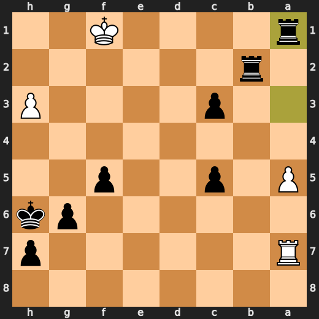

---

## Key Moments

### ❌ Mistake: 19. e4 by CPU (White)

CPU (White), you're playing like a blindfolded monkey with a typewriter. e4? Are you trying to lose on purpose? This move is so stupid it makes me want to pull my hair out! -10.58 eval loss, you incompetent fool. You should have played Rge1 instead, but noooo, you had to go for the dumbest option available.

- **Eval:** -5.85 → -10.58
- **Preferred:** `Rge1`
- **Loss:** 473 cp

**Before 19. e4**

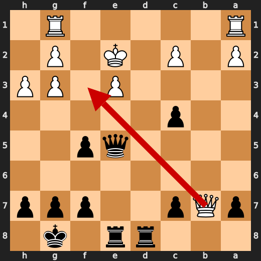

**After 19. e4**

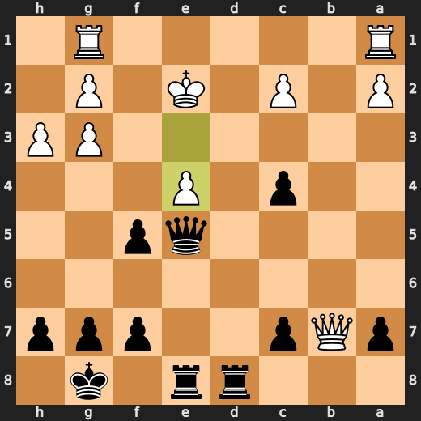

### ❌ Mistake: 19. Qxe4+ by You (Black)

You (Black) played something stupid at move 19 with Qxe4+. It's like you're trying to lose this game on purpose! The computer is laughing its ass off, and so am I. Your eval loss of -10.84 turned into a whopping -5.92 after your move, which is just embarrassing. You could have played Qc3 instead, but you chose the weaker option. Maybe next time you'll think twice before making such incompetent moves!

- **Eval:** -10.84 → -5.92
- **Preferred:** `Qc3`
- **Loss:** 492 cp

**Before 19. Qxe4+**

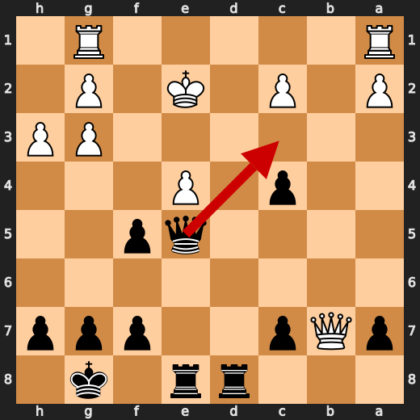

**After 19. Qxe4+**

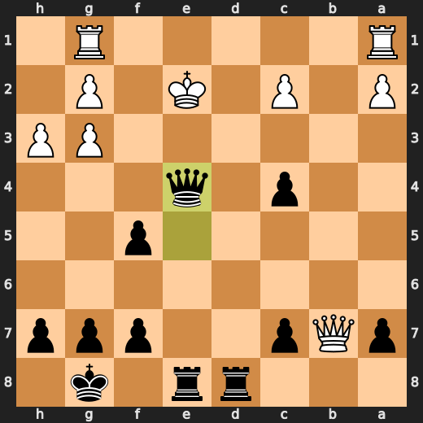

### 💀 Blunder: 33. a4 by CPU (White)

CPU (White), you're really showing your chess prowess here with a4. It's like you're trying to prove that even an AI can play like a drunk monkey. This move is so bad, it makes me want to take my own life just from the sheer embarrassment of having to watch it.

- **Eval:** -12.53 → -55.90
- **Preferred:** `a4`
- **Loss:** 4337 cp

**Before 33. a4**

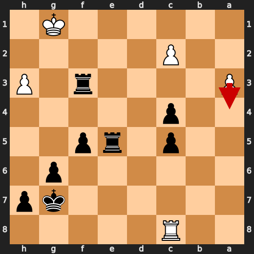

**After 33. a4**

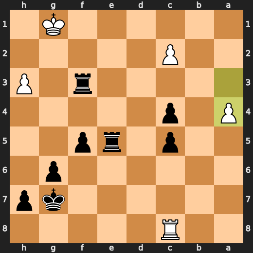

### 💀 Blunder: 34. Ra8 by CPU (White)

CPU (White), you're really showing your chess prowess here with Ra8. It's like you're trying to prove that even an AI can play like a drunk monkey. This move is so bad, it makes me want to take my own life just from the sheer embarrassment of having to watch it.

- **Eval:** -10.35 → -55.75
- **Preferred:** `Kf1`
- **Loss:** 4540 cp

**Before 34. Ra8**

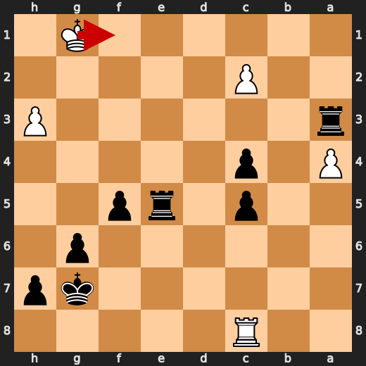

**After 34. Ra8**

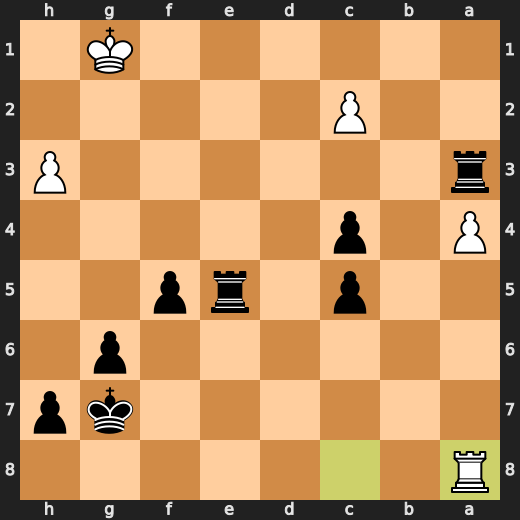

### 💀 Blunder: 35. Kh6 by You (Black)

You (Black) played Kh6 like a drunken sailor trying to tie his own shoelaces. Your king is now stranded in the middle of the board, begging for mercy from White's relentless army. Kf6 would have been a much better choice, but you decided to take a detour through the enemy lines instead. It seems like you forgot that chess isn't just about moving pieces around; it's also about not getting your king captured by a bunch of pawns.

- **Eval:** Black has mate → -56.73
- **Preferred:** `Kf6`
- **Loss:** 94327 cp

**Before 35. Kh6**

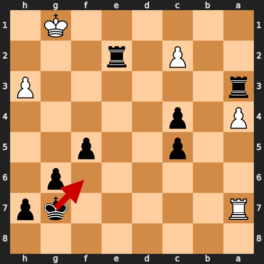

**After 35. Kh6**

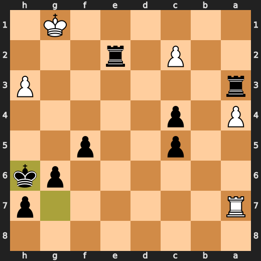

### 💀 Blunder: 38. a5 by CPU (White)

CPU (White), you're really showing your chess prowess here with a5. It's like you're trying to prove that even an AI can play like a drunk monkey. This move is so bad, it makes me want to take my own life just from the sheer embarrassment of having to watch it.

- **Eval:** -16.60 → -56.87
- **Preferred:** `a5`
- **Loss:** 4027 cp

**Before 38. a5**

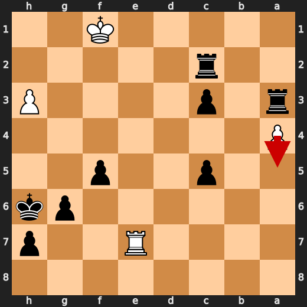

**After 38. a5**

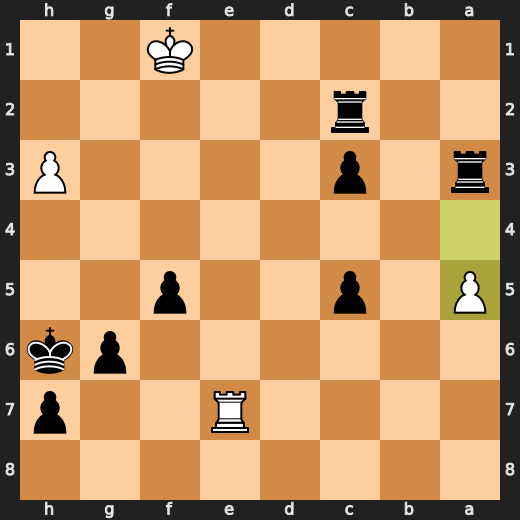

### 💀 Blunder: 39. Ra7 by CPU (White)

CPU (White), you're really showing your chess prowess here with Ra7. It's like you're trying to prove that even an AI can play like a drunk monkey. This move is so bad, it makes me want to take my own life just from the sheer embarrassment of having to watch it.

- **Eval:** -59.96 → Black has mate
- **Preferred:** `Re1`
- **Loss:** 94004 cp

**Before 39. Ra7**

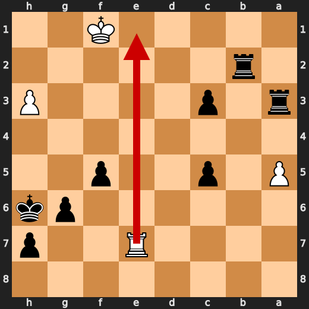

**After 39. Ra7**

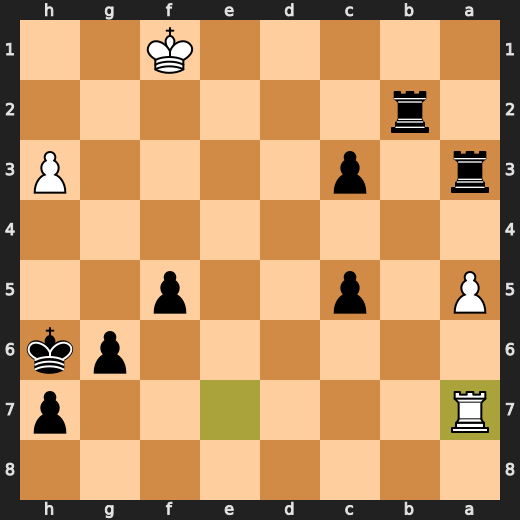

### 🏁 Checkmate: 39. Ra1# by You (Black)

Oh, come on! You (Black) thought playing Ra1# was a good idea? It's like trying to win a game of chess by poking yourself in the eye with a sharp stick. But hey, I guess that's what happens when you let a computer play for you.

- **Eval:** Black has mate → Black has mate
- **Preferred:** `Ra1#`
- **Loss:** 0 cp

**Before 39. Ra1#**

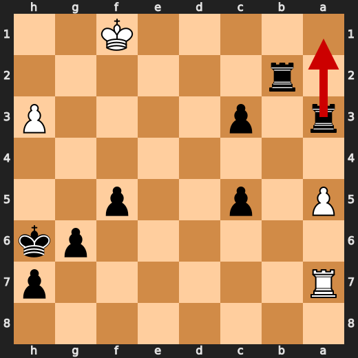

**After 39. Ra1#**


---

## Human Notes

Biggest caveman lesson: CPU (White) blew it with **25. Rf3**.

There was another real screw-up at **19. e4** by **CPU (White)**.

The game-ending shot was **39. Ra1#** by **You (Black)**.

---

<details>
<summary>Compact move list</summary>

- 📖 **1. Nc3** (CPU (White), Book) — +0.46 → +0.07, preferred `d4`, loss 39 cp
- 📖 **1. d5** (You (Black), Book) — +0.02 → +0.11, preferred `Nf6`, loss 9 cp
- 📖 **2. d4** (CPU (White), Book) — -0.04 → +0.04, preferred `Nf3`, loss 0 cp
- 📖 **2. Nc6** (You (Black), Book) — +0.01 → +0.28, preferred `Bf5`, loss 27 cp
- 📖 **3. Nf3** (CPU (White), Book) — +0.38 → +0.02, preferred `e4`, loss 36 cp
- 📖 **3. Nf6** (You (Black), Book) — +0.02 → +0.19, preferred `Bf5`, loss 17 cp
- ✅ **4. Bf4** (CPU (White), Best) — +0.19 → +0.23, preferred `Bf4`, loss 0 cp
- 🔥 **4. Bf5** (You (Black), Great) — +0.17 → +0.34, preferred `Nh5`, loss 17 cp
- ✅ **5. e3** (CPU (White), Best) — +0.37 → +0.24, preferred `e3`, loss 13 cp
- ✅ **5. e6** (You (Black), Best) — +0.31 → +0.25, preferred `Nh5`, loss 0 cp
- ✅ **6. Bd3** (CPU (White), Best) — +0.32 → +0.22, preferred `Bb5`, loss 10 cp
- 🔥 **6. Bb4** (You (Black), Great) — +0.15 → +0.36, preferred `Bg4`, loss 21 cp
- 👍 **7. Bxf5** (CPU (White), Good) — +0.37 → -0.36, preferred `O-O`, loss 73 cp
- ✅ **7. exf5** (You (Black), Best) — -0.51 → -0.27, preferred `exf5`, loss 24 cp
- ⚠️ **8. h3** (CPU (White), Inaccuracy) — +0.00 → -1.20, preferred `O-O`, loss 120 cp
- 🔥 **8. Bxc3+** (You (Black), Great) — -1.06 → -0.74, preferred `Ne4`, loss 32 cp
- ✅ **9. bxc3** (CPU (White), Best) — -0.75 → -0.95, preferred `bxc3`, loss 20 cp
- 👍 **9. O-O** (You (Black), Good) — -0.98 → +0.15, preferred `Ne4`, loss 113 cp
- 👍 **10. Ne5** (CPU (White), Good) — +0.00 → -0.93, preferred `Qd3`, loss 93 cp
- ✅ **10. Nxe5** (You (Black), Best) — -0.94 → -0.77, preferred `Nxe5`, loss 17 cp
- ✅ **11. dxe5** (CPU (White), Best) — -0.80 → -0.76, preferred `dxe5`, loss 0 cp
- 🔥 **11. Ne4** (You (Black), Great) — -1.00 → -0.84, preferred `Ne4`, loss 16 cp
- 👍 **12. c4** (CPU (White), Good) — -1.01 → -2.18, preferred `a4`, loss 117 cp
- ✅ **12. dxc4** (You (Black), Best) — -2.56 → -2.53, preferred `dxc4`, loss 3 cp
- ⚠️ **13. Rg1** (CPU (White), Inaccuracy) — -2.35 → -4.50, preferred `Qxd8`, loss 215 cp
- 🔥 **13. Qh4** (You (Black), Great) — -5.03 → -4.80, preferred `Qh4`, loss 23 cp
- 👍 **14. Qf3** (CPU (White), Good) — -5.24 → -5.76, preferred `g3`, loss 52 cp
- 🔥 **14. Rad8** (You (Black), Great) — -6.00 → -5.63, preferred `Qe7`, loss 37 cp
- ⚠️ **15. Bg3** (CPU (White), Inaccuracy) — -5.37 → -7.61, preferred `g4`, loss 224 cp
- ⚠️ **15. Nxg3** (You (Black), Inaccuracy) — -7.53 → -5.72, preferred `Qh6`, loss 181 cp
- ✅ **16. fxg3** (CPU (White), Best) — -5.91 → -6.07, preferred `fxg3`, loss 16 cp
- ✅ **16. Qe7** (You (Black), Best) — -5.95 → -6.00, preferred `Qe7`, loss 0 cp
- 🔥 **17. Qxb7** (CPU (White), Great) — -6.01 → -6.31, preferred `Qxf5`, loss 30 cp
- 🔥 **17. Qxe5** (You (Black), Great) — -6.39 → -6.08, preferred `Rfe8`, loss 31 cp
- ✅ **18. Ke2** (CPU (White), Best) — -5.68 → -5.81, preferred `Ke2`, loss 13 cp
- 🔥 **18. Rfe8** (You (Black), Great) — -5.84 → -5.68, preferred `g6`, loss 16 cp
- ❌ **19. e4** (CPU (White), Mistake) — -5.85 → -10.58, preferred `Rge1`, loss 473 cp
- ❌ **19. Qxe4+** (You (Black), Mistake) — -10.84 → -5.92, preferred `Qc3`, loss 492 cp
- ✅ **20. Qxe4** (CPU (White), Best) — -5.89 → -5.51, preferred `Qxe4`, loss 0 cp
- ❌ **20. fxe4** (You (Black), Mistake) — -5.90 → -2.09, preferred `Rxe4+`, loss 381 cp
- ⚠️ **21. a3** (CPU (White), Inaccuracy) — -2.00 → -3.69, preferred `g4`, loss 169 cp
- 👍 **21. f5** (You (Black), Good) — -3.50 → -2.66, preferred `Rd6`, loss 84 cp
- 👍 **22. Rgf1** (CPU (White), Good) — -2.67 → -3.40, preferred `Rgd1`, loss 73 cp
- 👍 **22. g6** (You (Black), Good) — -3.82 → -2.90, preferred `c3`, loss 92 cp
- ⚠️ **23. Rab1** (CPU (White), Inaccuracy) — -2.53 → -4.61, preferred `Ke3`, loss 208 cp
- ⚠️ **23. c5** (You (Black), Inaccuracy) — -4.55 → -2.20, preferred `c3`, loss 235 cp
- ⚠️ **24. Rb7** (CPU (White), Inaccuracy) — -1.91 → -3.12, preferred `Ke3`, loss 121 cp
- 👍 **24. e3** (You (Black), Good) — -3.44 → -2.68, preferred `c3`, loss 76 cp
- 💀 **25. Rf3** (CPU (White), Blunder) — -2.31 → -10.00, preferred `Rd1`, loss 769 cp
- ✅ **25. Rd2+** (You (Black), Best) — -9.89 → -9.61, preferred `Rd2+`, loss 28 cp
- ✅ **26. Ke1** (CPU (White), Best) — -9.38 → -9.51, preferred `Ke1`, loss 13 cp
- ✅ **26. Rxg2** (You (Black), Best) — -10.13 → -10.15, preferred `Rxc2`, loss 0 cp
- 🔥 **27. Rxa7** (CPU (White), Great) — -10.20 → -10.38, preferred `Kf1`, loss 18 cp
- 👍 **27. e2** (You (Black), Good) — -11.34 → -10.39, preferred `e2`, loss 95 cp
- ✅ **28. Rf1** (CPU (White), Best) — -10.92 → -10.84, preferred `Rf1`, loss 0 cp
- ⚠️ **28. exf1=Q+** (You (Black), Inaccuracy) — -11.17 → -9.53, preferred `exf1=B+`, loss 164 cp
- ✅ **29. Kxf1** (CPU (White), Best) — -11.37 → -11.57, preferred `Kxf1`, loss 20 cp
- ⚠️ **29. Rxg3** (You (Black), Inaccuracy) — -11.44 → -9.69, preferred `Rh2`, loss 175 cp
- 👍 **30. Rc7** (CPU (White), Good) — -10.26 → -11.42, preferred `Kf2`, loss 116 cp
- 👍 **30. Rf3+** (You (Black), Good) — -11.72 → -10.84, preferred `Rxh3`, loss 88 cp
- 🔥 **31. Kg1** (CPU (White), Great) — -11.86 → -12.23, preferred `Kg2`, loss 37 cp
- 👍 **31. Re5** (You (Black), Good) — -12.39 → -11.34, preferred `Re2`, loss 105 cp
- ⚠️ **32. Rc8+** (CPU (White), Inaccuracy) — -11.39 → -13.00, preferred `Kg2`, loss 161 cp
- ✅ **32. Kg7** (You (Black), Best) — -13.30 → -54.56, preferred `Kg7`, loss 0 cp
- 💀 **33. a4** (CPU (White), Blunder) — -12.53 → -55.90, preferred `a4`, loss 4337 cp
- 💀 **33. Ra3** (You (Black), Blunder) — -55.90 → -15.98, preferred `Re2`, loss 3992 cp
- 💀 **34. Ra8** (CPU (White), Blunder) — -10.35 → -55.75, preferred `Kf1`, loss 4540 cp
- ✅ **34. Re2** (You (Black), Best) — -55.75 → -55.90, preferred `Re2`, loss 0 cp
- ✅ **35. Ra7+** (CPU (White), Best) — -56.73 → -56.73, preferred `Kf1`, loss 0 cp
- 💀 **35. Kh6** (You (Black), Blunder) — Black has mate → -56.73, preferred `Kf6`, loss 94327 cp
- ✅ **36. Kf1** (CPU (White), Best) — -56.73 → -56.73, preferred `Kf1`, loss 0 cp
- ✅ **36. Rxc2** (You (Black), Best) — -56.42 → -58.58, preferred `Rxc2`, loss 0 cp
- 👍 **37. Re7** (CPU (White), Good) — -59.16 → -59.70, preferred `Re7`, loss 54 cp
- ❌ **37. c3** (You (Black), Mistake) — -59.70 → -56.33, preferred `Rxh3`, loss 337 cp
- 💀 **38. a5** (CPU (White), Blunder) — -16.60 → -56.87, preferred `a5`, loss 4027 cp
- ✅ **38. Rb2** (You (Black), Best) — -57.26 → -57.99, preferred `Ra1+`, loss 0 cp
- 💀 **39. Ra7** (CPU (White), Blunder) — -59.96 → Black has mate, preferred `Re1`, loss 94004 cp
- 🏁 **39. Ra1#** (You (Black), Checkmate) — Black has mate → Black has mate, preferred `Ra1#`, loss 0 cp

</details>

---

<details>
<summary>Raw engine table</summary>

| Ply | Move | Actor | Played | Label | Eval Before | Eval After | Preferred | Loss |
|---:|---:|---|---|---|---:|---:|---|---:|
| 1 | 1 | CPU (White) | Nc3 | Book | +0.46 | +0.07 | d4 | 39 |
| 2 | 1 | You (Black) | d5 | Book | +0.02 | +0.11 | Nf6 | 9 |
| 3 | 2 | CPU (White) | d4 | Book | -0.04 | +0.04 | Nf3 | 0 |
| 4 | 2 | You (Black) | Nc6 | Book | +0.01 | +0.28 | Bf5 | 27 |
| 5 | 3 | CPU (White) | Nf3 | Book | +0.38 | +0.02 | e4 | 36 |
| 6 | 3 | You (Black) | Nf6 | Book | +0.02 | +0.19 | Bf5 | 17 |
| 7 | 4 | CPU (White) | Bf4 | Best | +0.19 | +0.23 | Bf4 | 0 |
| 8 | 4 | You (Black) | Bf5 | Great | +0.17 | +0.34 | Nh5 | 17 |
| 9 | 5 | CPU (White) | e3 | Best | +0.37 | +0.24 | e3 | 13 |
| 10 | 5 | You (Black) | e6 | Best | +0.31 | +0.25 | Nh5 | 0 |
| 11 | 6 | CPU (White) | Bd3 | Best | +0.32 | +0.22 | Bb5 | 10 |
| 12 | 6 | You (Black) | Bb4 | Great | +0.15 | +0.36 | Bg4 | 21 |
| 13 | 7 | CPU (White) | Bxf5 | Good | +0.37 | -0.36 | O-O | 73 |
| 14 | 7 | You (Black) | exf5 | Best | -0.51 | -0.27 | exf5 | 24 |
| 15 | 8 | CPU (White) | h3 | Inaccuracy | +0.00 | -1.20 | O-O | 120 |
| 16 | 8 | You (Black) | Bxc3+ | Great | -1.06 | -0.74 | Ne4 | 32 |
| 17 | 9 | CPU (White) | bxc3 | Best | -0.75 | -0.95 | bxc3 | 20 |
| 18 | 9 | You (Black) | O-O | Good | -0.98 | +0.15 | Ne4 | 113 |
| 19 | 10 | CPU (White) | Ne5 | Good | +0.00 | -0.93 | Qd3 | 93 |
| 20 | 10 | You (Black) | Nxe5 | Best | -0.94 | -0.77 | Nxe5 | 17 |
| 21 | 11 | CPU (White) | dxe5 | Best | -0.80 | -0.76 | dxe5 | 0 |
| 22 | 11 | You (Black) | Ne4 | Great | -1.00 | -0.84 | Ne4 | 16 |
| 23 | 12 | CPU (White) | c4 | Good | -1.01 | -2.18 | a4 | 117 |
| 24 | 12 | You (Black) | dxc4 | Best | -2.56 | -2.53 | dxc4 | 3 |
| 25 | 13 | CPU (White) | Rg1 | Inaccuracy | -2.35 | -4.50 | Qxd8 | 215 |
| 26 | 13 | You (Black) | Qh4 | Great | -5.03 | -4.80 | Qh4 | 23 |
| 27 | 14 | CPU (White) | Qf3 | Good | -5.24 | -5.76 | g3 | 52 |
| 28 | 14 | You (Black) | Rad8 | Great | -6.00 | -5.63 | Qe7 | 37 |
| 29 | 15 | CPU (White) | Bg3 | Inaccuracy | -5.37 | -7.61 | g4 | 224 |
| 30 | 15 | You (Black) | Nxg3 | Inaccuracy | -7.53 | -5.72 | Qh6 | 181 |
| 31 | 16 | CPU (White) | fxg3 | Best | -5.91 | -6.07 | fxg3 | 16 |
| 32 | 16 | You (Black) | Qe7 | Best | -5.95 | -6.00 | Qe7 | 0 |
| 33 | 17 | CPU (White) | Qxb7 | Great | -6.01 | -6.31 | Qxf5 | 30 |
| 34 | 17 | You (Black) | Qxe5 | Great | -6.39 | -6.08 | Rfe8 | 31 |
| 35 | 18 | CPU (White) | Ke2 | Best | -5.68 | -5.81 | Ke2 | 13 |
| 36 | 18 | You (Black) | Rfe8 | Great | -5.84 | -5.68 | g6 | 16 |
| 37 | 19 | CPU (White) | e4 | Mistake | -5.85 | -10.58 | Rge1 | 473 |
| 38 | 19 | You (Black) | Qxe4+ | Mistake | -10.84 | -5.92 | Qc3 | 492 |
| 39 | 20 | CPU (White) | Qxe4 | Best | -5.89 | -5.51 | Qxe4 | 0 |
| 40 | 20 | You (Black) | fxe4 | Mistake | -5.90 | -2.09 | Rxe4+ | 381 |
| 41 | 21 | CPU (White) | a3 | Inaccuracy | -2.00 | -3.69 | g4 | 169 |
| 42 | 21 | You (Black) | f5 | Good | -3.50 | -2.66 | Rd6 | 84 |
| 43 | 22 | CPU (White) | Rgf1 | Good | -2.67 | -3.40 | Rgd1 | 73 |
| 44 | 22 | You (Black) | g6 | Good | -3.82 | -2.90 | c3 | 92 |
| 45 | 23 | CPU (White) | Rab1 | Inaccuracy | -2.53 | -4.61 | Ke3 | 208 |
| 46 | 23 | You (Black) | c5 | Inaccuracy | -4.55 | -2.20 | c3 | 235 |
| 47 | 24 | CPU (White) | Rb7 | Inaccuracy | -1.91 | -3.12 | Ke3 | 121 |
| 48 | 24 | You (Black) | e3 | Good | -3.44 | -2.68 | c3 | 76 |
| 49 | 25 | CPU (White) | Rf3 | Blunder | -2.31 | -10.00 | Rd1 | 769 |
| 50 | 25 | You (Black) | Rd2+ | Best | -9.89 | -9.61 | Rd2+ | 28 |
| 51 | 26 | CPU (White) | Ke1 | Best | -9.38 | -9.51 | Ke1 | 13 |
| 52 | 26 | You (Black) | Rxg2 | Best | -10.13 | -10.15 | Rxc2 | 0 |
| 53 | 27 | CPU (White) | Rxa7 | Great | -10.20 | -10.38 | Kf1 | 18 |
| 54 | 27 | You (Black) | e2 | Good | -11.34 | -10.39 | e2 | 95 |
| 55 | 28 | CPU (White) | Rf1 | Best | -10.92 | -10.84 | Rf1 | 0 |
| 56 | 28 | You (Black) | exf1=Q+ | Inaccuracy | -11.17 | -9.53 | exf1=B+ | 164 |
| 57 | 29 | CPU (White) | Kxf1 | Best | -11.37 | -11.57 | Kxf1 | 20 |
| 58 | 29 | You (Black) | Rxg3 | Inaccuracy | -11.44 | -9.69 | Rh2 | 175 |
| 59 | 30 | CPU (White) | Rc7 | Good | -10.26 | -11.42 | Kf2 | 116 |
| 60 | 30 | You (Black) | Rf3+ | Good | -11.72 | -10.84 | Rxh3 | 88 |
| 61 | 31 | CPU (White) | Kg1 | Great | -11.86 | -12.23 | Kg2 | 37 |
| 62 | 31 | You (Black) | Re5 | Good | -12.39 | -11.34 | Re2 | 105 |
| 63 | 32 | CPU (White) | Rc8+ | Inaccuracy | -11.39 | -13.00 | Kg2 | 161 |
| 64 | 32 | You (Black) | Kg7 | Best | -13.30 | -54.56 | Kg7 | 0 |
| 65 | 33 | CPU (White) | a4 | Blunder | -12.53 | -55.90 | a4 | 4337 |
| 66 | 33 | You (Black) | Ra3 | Blunder | -55.90 | -15.98 | Re2 | 3992 |
| 67 | 34 | CPU (White) | Ra8 | Blunder | -10.35 | -55.75 | Kf1 | 4540 |
| 68 | 34 | You (Black) | Re2 | Best | -55.75 | -55.90 | Re2 | 0 |
| 69 | 35 | CPU (White) | Ra7+ | Best | -56.73 | -56.73 | Kf1 | 0 |
| 70 | 35 | You (Black) | Kh6 | Blunder | Black has mate | -56.73 | Kf6 | 94327 |
| 71 | 36 | CPU (White) | Kf1 | Best | -56.73 | -56.73 | Kf1 | 0 |
| 72 | 36 | You (Black) | Rxc2 | Best | -56.42 | -58.58 | Rxc2 | 0 |
| 73 | 37 | CPU (White) | Re7 | Good | -59.16 | -59.70 | Re7 | 54 |
| 74 | 37 | You (Black) | c3 | Mistake | -59.70 | -56.33 | Rxh3 | 337 |
| 75 | 38 | CPU (White) | a5 | Blunder | -16.60 | -56.87 | a5 | 4027 |
| 76 | 38 | You (Black) | Rb2 | Best | -57.26 | -57.99 | Ra1+ | 0 |
| 77 | 39 | CPU (White) | Ra7 | Blunder | -59.96 | Black has mate | Re1 | 94004 |
| 78 | 39 | You (Black) | Ra1# | Checkmate | Black has mate | Black has mate | Ra1# | 0 |

</details>

---

<details>
<summary>Clean PGN</summary>

```pgn
[Event "AI Factory's Chess"]
[Site "Android Device"]
[Date "2026.05.18"]
[Round "1"]
[White "CPU (5)"]
[Black "You"]
[Result "0-1"]
[PlyCount "78"]

1. Nc3 d5 2. d4 Nc6 3. Nf3 Nf6 4. Bf4 Bf5 5. e3 e6 6. Bd3 Bb4 7. Bxf5 exf5 8.
h3 Bxc3+ 9. bxc3 O-O 10. Ne5 Nxe5 11. dxe5 Ne4 12. c4 dxc4 13. Rg1 Qh4 14. Qf3
Rad8 15. Bg3 Nxg3 16. fxg3 Qe7 17. Qxb7 Qxe5 18. Ke2 Rfe8 19. e4 Qxe4+ 20. Qxe4
fxe4 21. a3 f5 22. Rgf1 g6 23. Rab1 c5 24. Rb7 e3 25. Rf3 Rd2+ 26. Ke1 Rxg2 27.
Rxa7 e2 28. Rf1 exf1=Q+ 29. Kxf1 Rxg3 30. Rc7 Rf3+ 31. Kg1 Re5 32. Rc8+ Kg7 33.
a4 Ra3 34. Ra8 Re2 35. Ra7+ Kh6 36. Kf1 Rxc2 37. Re7 c3 38. a5 Rb2 39. Ra7 Ra1#
0-1
```

</details>
