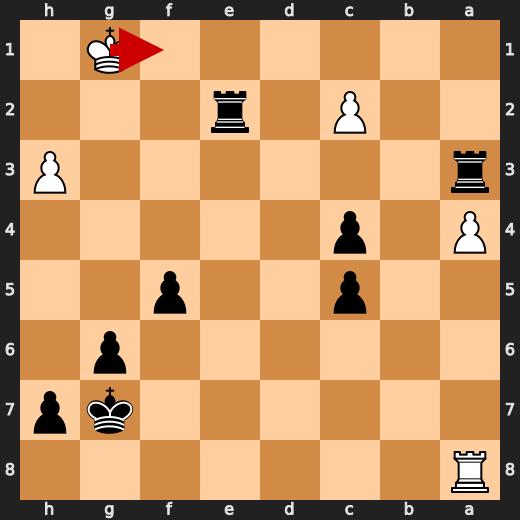
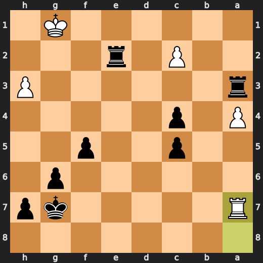
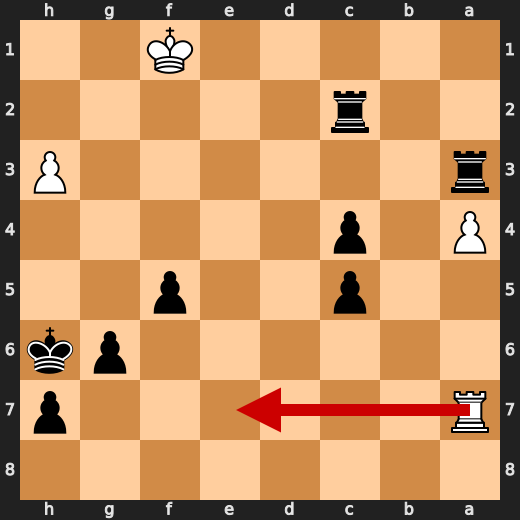
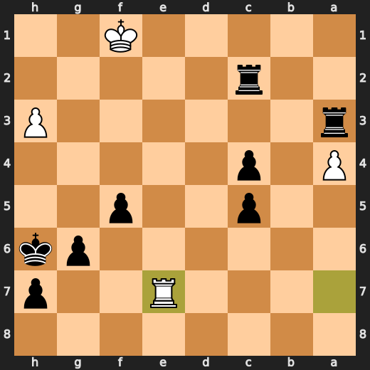
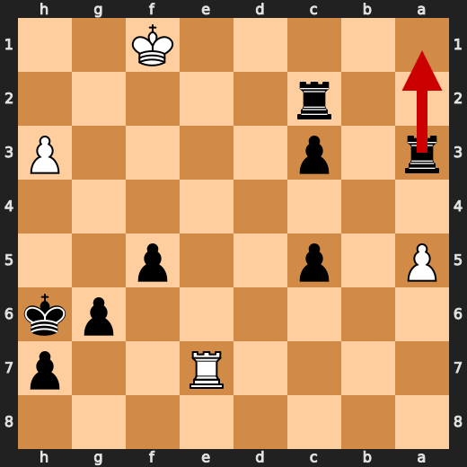
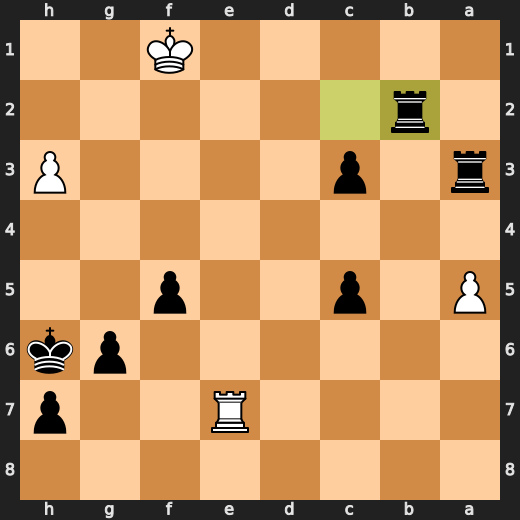

# You (Black) vs CPU (White)

**Result:** 0-1  
**Date:** 2026.05.18  
**Source:** `PGN_2026_05_18_17h46_f0b33d40c306.pgn`  
**Engine:** Stockfish depth 14  
**Your side:** Black  
**Computer side:** White  
**Board perspective:** Your perspective

---

## Who Is Who

- **You:** You (Black)
- **Computer:** CPU (5) (White)

---

## Toaster Summary

**Game Story:** The opening is unclear, and Black won because White’s 19 e4 allowed Qxe4+ and a lasting advantage. Both sides had rough moments: Black’s 35 Kh6 and 38 Rb2 delayed the finish, while White’s 35 Ra7+ and 39 Ra7 allowed mate to return. The key lesson is to convert winning attacks with forcing checks first, because 39...Ra1# ended the game for you.

Biggest toaster scream: **35. Ra7+** by **CPU (White)**.

- **Label:** 💀 **Blunder**
- **Eval:** -56.64 → Black has mate
- **Stockfish preferred:** `Kf1`
- **Loss:** 94336 cp

Final move recorded: **39. Ra1#** by **You (Black)**.

- 💀 Your blunders: **4**
- ❌ Your mistakes: **3**
- ⚠️ Your inaccuracies: **5**
- ✅ Your best moves called out: **15**

---

## Final Position


---

## Key Moments

### ❌ Mistake: 19. e4 by CPU (White)

e4 worsened White’s position instead of choosing the more resilient Qf3. Learn to use the queen to improve defensive coordination when the position is already under heavy pressure.

- **Eval:** -5.50 → -10.39
- **Preferred:** `Qf3`
- **Loss:** 489 cp

**Before 19. e4**


**After 19. e4**


### ❌ Mistake: 19. Qxe4+ by You (Black)

Qxe4+ gave up a large part of Black’s advantage instead of keeping the position at its strongest. Qc3 was preferred and would have improved Black’s practical chances more than the played check. Learn not to choose a forcing check automatically when a stronger queen move is available.

- **Eval:** -10.69 → -5.66
- **Preferred:** `Qc3`
- **Loss:** 503 cp

**Before 19. Qxe4+**


**After 19. Qxe4+**


### 💀 Blunder: 35. Ra7+ by CPU (White)

Ra7+ worsened White’s position by allowing Black a forced mate. Kf1 was the preferred move because it avoided that immediate decisive consequence. Learn to check whether giving a check also leaves your own king unable to survive the reply.

- **Eval:** -56.64 → Black has mate
- **Preferred:** `Kf1`
- **Loss:** 94336 cp

**Before 35. Ra7+**



**After 35. Ra7+**



### 💀 Blunder: 35. Kh6 by You (Black)

Kh6 failed to keep Black’s forced mate, turning a winning position into one that is merely winning. Kf6 was the preferred move because it preserved the decisive continuation. Learn to be extra careful with king moves when the engine says there is a forced mate available.

- **Eval:** Black has mate → -56.64
- **Preferred:** `Kf6`
- **Loss:** 94336 cp

**Before 35. Kh6**


**After 35. Kh6**


### 💀 Blunder: 37. Re7 by CPU (White)

Re7 worsened White’s position significantly, but the provided engine facts also list Re7 as the preferred move, so there is no concrete alternative to compare. Learn to flag this kind of eval swing as a position that needs deeper checking, even when the move choice is unclear.

- **Eval:** -15.61 → -59.11
- **Preferred:** `Re7`
- **Loss:** 4350 cp

**Before 37. Re7**



**After 37. Re7**



### 💀 Blunder: 38. Rb2 by You (Black)

Rb2 worsened Black’s position by missing the stronger Ra1+, which was the preferred move. The practical lesson is to look for forcing checks before making a useful-looking rook move.

- **Eval:** -57.31 → -12.38
- **Preferred:** `Ra1+`
- **Loss:** 4493 cp

**Before 38. Rb2**



**After 38. Rb2**



### 💀 Blunder: 39. Ra7 by CPU (White)

Ra7 failed to stop Black’s forced mate, turning an already losing position into an immediate decisive one. Re1 was the preferred move because it gave White the best practical chance to avoid that direct consequence. Learn to check king safety first in positions where the opponent’s threats are already overwhelming.

- **Eval:** -64.28 → Black has mate
- **Preferred:** `Re1`
- **Loss:** 93572 cp

**Before 39. Ra7**


**After 39. Ra7**


### 🏁 Checkmate: 39. Ra1# by You (Black)

Ra1# was the preferred move and a forcing game-ending move. The useful pattern is to convert a mating position immediately when a direct checkmate is available.

- **Eval:** Black has mate → Black has mate
- **Preferred:** `Ra1#`
- **Loss:** 0 cp

**Before 39. Ra1#**


**After 39. Ra1#**


---

## Human Notes

Biggest caveman lesson: CPU (White) blew it with **25. Rf3**.

There was another real screw-up at **19. e4** by **CPU (White)**.

The game-ending shot was **39. Ra1#** by **You (Black)**.

---

<details>
<summary>Compact move list</summary>

- 📖 **1. Nc3** (CPU (White), Book) — +0.34 → -0.13, preferred `d4`, loss 47 cp
- 📖 **1. d5** (You (Black), Book) — -0.12 → -0.21, preferred `d5`, loss 0 cp
- 📖 **2. d4** (CPU (White), Book) — -0.25 → -0.21, preferred `d4`, loss 0 cp
- 📖 **2. Nc6** (You (Black), Book) — -0.12 → +0.32, preferred `Nf6`, loss 44 cp
- 📖 **3. Nf3** (CPU (White), Book) — +0.29 → +0.09, preferred `e4`, loss 20 cp
- 📖 **3. Nf6** (You (Black), Book) — +0.01 → +0.24, preferred `Bg4`, loss 23 cp
- ✅ **4. Bf4** (CPU (White), Best) — +0.22 → +0.24, preferred `Bf4`, loss 0 cp
- ✅ **4. Bf5** (You (Black), Best) — +0.20 → +0.23, preferred `Nh5`, loss 3 cp
- ✅ **5. e3** (CPU (White), Best) — +0.34 → +0.20, preferred `Nh4`, loss 14 cp
- ✅ **5. e6** (You (Black), Best) — +0.34 → +0.30, preferred `e6`, loss 0 cp
- ✅ **6. Bd3** (CPU (White), Best) — +0.26 → +0.24, preferred `Bb5`, loss 2 cp
- ✅ **6. Bb4** (You (Black), Best) — +0.25 → +0.22, preferred `Bxd3`, loss 0 cp
- 👍 **7. Bxf5** (CPU (White), Good) — +0.25 → -0.56, preferred `O-O`, loss 81 cp
- ✅ **7. exf5** (You (Black), Best) — -0.25 → +0.00, preferred `exf5`, loss 25 cp
- 👍 **8. h3** (CPU (White), Good) — -0.09 → -1.27, preferred `O-O`, loss 118 cp
- 👍 **8. Bxc3+** (You (Black), Good) — -1.42 → -0.88, preferred `Ne4`, loss 54 cp
- ✅ **9. bxc3** (CPU (White), Best) — -0.78 → -0.75, preferred `bxc3`, loss 0 cp
- 👍 **9. O-O** (You (Black), Good) — -0.87 → +0.08, preferred `Ne4`, loss 95 cp
- 👍 **10. Ne5** (CPU (White), Good) — +0.10 → -0.87, preferred `Qd3`, loss 97 cp
- ✅ **10. Nxe5** (You (Black), Best) — -0.86 → -1.22, preferred `Ne7`, loss 0 cp
- ✅ **11. dxe5** (CPU (White), Best) — -0.78 → -0.98, preferred `dxe5`, loss 20 cp
- ✅ **11. Ne4** (You (Black), Best) — -0.91 → -0.88, preferred `Ne4`, loss 3 cp
- ⚠️ **12. c4** (CPU (White), Inaccuracy) — -0.75 → -2.48, preferred `O-O`, loss 173 cp
- ✅ **12. dxc4** (You (Black), Best) — -2.01 → -2.55, preferred `dxc4`, loss 0 cp
- ⚠️ **13. Rg1** (CPU (White), Inaccuracy) — -2.12 → -5.04, preferred `Qxd8`, loss 292 cp
- 👍 **13. Qh4** (You (Black), Good) — -5.61 → -4.95, preferred `Qh4`, loss 66 cp
- ⚠️ **14. Qf3** (CPU (White), Inaccuracy) — -4.74 → -6.46, preferred `g3`, loss 172 cp
- 👍 **14. Rad8** (You (Black), Good) — -5.71 → -5.15, preferred `Qe7`, loss 56 cp
- ⚠️ **15. Bg3** (CPU (White), Inaccuracy) — -4.91 → -7.38, preferred `g4`, loss 247 cp
- ⚠️ **15. Nxg3** (You (Black), Inaccuracy) — -8.04 → -6.00, preferred `Qh6`, loss 204 cp
- ✅ **16. fxg3** (CPU (White), Best) — -6.15 → -6.01, preferred `fxg3`, loss 0 cp
- ✅ **16. Qe7** (You (Black), Best) — -5.92 → -5.87, preferred `Qe7`, loss 5 cp
- ✅ **17. Qxb7** (CPU (White), Best) — -5.81 → -5.93, preferred `Ke2`, loss 12 cp
- ✅ **17. Qxe5** (You (Black), Best) — -5.92 → -6.15, preferred `Qxe5`, loss 0 cp
- 🔥 **18. Ke2** (CPU (White), Great) — -5.96 → -6.13, preferred `Ke2`, loss 17 cp
- 🔥 **18. Rfe8** (You (Black), Great) — -6.02 → -5.65, preferred `Qxg3`, loss 37 cp
- ❌ **19. e4** (CPU (White), Mistake) — -5.50 → -10.39, preferred `Qf3`, loss 489 cp
- ❌ **19. Qxe4+** (You (Black), Mistake) — -10.69 → -5.66, preferred `Qc3`, loss 503 cp
- ✅ **20. Qxe4** (CPU (White), Best) — -5.62 → -5.70, preferred `Qxe4`, loss 8 cp
- ❌ **20. fxe4** (You (Black), Mistake) — -5.68 → -1.96, preferred `Rxe4+`, loss 372 cp
- ⚠️ **21. a3** (CPU (White), Inaccuracy) — -2.16 → -3.74, preferred `Rgd1`, loss 158 cp
- 🔥 **21. f5** (You (Black), Great) — -3.53 → -3.11, preferred `Rd6`, loss 42 cp
- 👍 **22. Rgf1** (CPU (White), Good) — -2.84 → -4.00, preferred `Rad1`, loss 116 cp
- ⚠️ **22. g6** (You (Black), Inaccuracy) — -4.14 → -2.58, preferred `c3`, loss 156 cp
- ⚠️ **23. Rab1** (CPU (White), Inaccuracy) — -2.34 → -4.23, preferred `Ke3`, loss 189 cp
- ⚠️ **23. c5** (You (Black), Inaccuracy) — -4.00 → -1.87, preferred `c3`, loss 213 cp
- ⚠️ **24. Rb7** (CPU (White), Inaccuracy) — -1.78 → -3.66, preferred `Ke3`, loss 188 cp
- 🔥 **24. e3** (You (Black), Great) — -3.84 → -3.37, preferred `c3`, loss 47 cp
- 💀 **25. Rf3** (CPU (White), Blunder) — -2.91 → -10.32, preferred `Rd1`, loss 741 cp
- ✅ **25. Rd2+** (You (Black), Best) — -10.00 → -9.72, preferred `Rd2+`, loss 28 cp
- ✅ **26. Ke1** (CPU (White), Best) — -9.84 → -9.89, preferred `Ke1`, loss 5 cp
- 👍 **26. Rxg2** (You (Black), Good) — -10.30 → -9.78, preferred `c3`, loss 52 cp
- ⚠️ **27. Rxa7** (CPU (White), Inaccuracy) — -9.38 → -11.72, preferred `Kf1`, loss 234 cp
- ✅ **27. e2** (You (Black), Best) — -11.92 → -11.92, preferred `e2`, loss 0 cp
- ✅ **28. Rf1** (CPU (White), Best) — -11.92 → -11.92, preferred `Rf1`, loss 0 cp
- ✅ **28. exf1=Q+** (You (Black), Best) — -12.30 → -13.35, preferred `exf1=B+`, loss 0 cp
- ✅ **29. Kxf1** (CPU (White), Best) — -13.87 → -13.87, preferred `Kxf1`, loss 0 cp
- ❌ **29. Rxg3** (You (Black), Mistake) — -13.95 → -10.46, preferred `Rxc2`, loss 349 cp
- 👍 **30. Rc7** (CPU (White), Good) — -11.07 → -11.95, preferred `Rb7`, loss 88 cp
- ✅ **30. Rf3+** (You (Black), Best) — -11.87 → -13.01, preferred `Rxh3`, loss 0 cp
- 🔥 **31. Kg1** (CPU (White), Great) — -14.56 → -14.77, preferred `Kg2`, loss 21 cp
- ⚠️ **31. Re5** (You (Black), Inaccuracy) — -14.89 → -12.24, preferred `Rxh3`, loss 265 cp
- ❌ **32. Rc8+** (CPU (White), Mistake) — -11.88 → -14.88, preferred `Kg2`, loss 300 cp
- ✅ **32. Kg7** (You (Black), Best) — -14.58 → -15.00, preferred `Kg7`, loss 0 cp
- 👍 **33. a4** (CPU (White), Good) — -14.20 → -15.00, preferred `c3`, loss 80 cp
- ✅ **33. Ra3** (You (Black), Best) — -14.69 → -14.69, preferred `Re2`, loss 0 cp
- 💀 **34. Ra8** (CPU (White), Blunder) — -14.69 → -57.96, preferred `Kf1`, loss 4327 cp
- 💀 **34. Re2** (You (Black), Blunder) — -57.33 → -14.84, preferred `Re2`, loss 4249 cp
- 💀 **35. Ra7+** (CPU (White), Blunder) — -56.64 → Black has mate, preferred `Kf1`, loss 94336 cp
- 💀 **35. Kh6** (You (Black), Blunder) — Black has mate → -56.64, preferred `Kf6`, loss 94336 cp
- ⚠️ **36. Kf1** (CPU (White), Inaccuracy) — -56.64 → -57.90, preferred `Kf1`, loss 126 cp
- 💀 **36. Rxc2** (You (Black), Blunder) — -57.90 → -15.99, preferred `Rxc2`, loss 4191 cp
- 💀 **37. Re7** (CPU (White), Blunder) — -15.61 → -59.11, preferred `Re7`, loss 4350 cp
- ⚠️ **37. c3** (You (Black), Inaccuracy) — -59.08 → -57.31, preferred `Rxh3`, loss 177 cp
- 👍 **38. a5** (CPU (White), Good) — -57.26 → -58.06, preferred `Re1`, loss 80 cp
- 💀 **38. Rb2** (You (Black), Blunder) — -57.31 → -12.38, preferred `Ra1+`, loss 4493 cp
- 💀 **39. Ra7** (CPU (White), Blunder) — -64.28 → Black has mate, preferred `Re1`, loss 93572 cp
- 🏁 **39. Ra1#** (You (Black), Checkmate) — Black has mate → Black has mate, preferred `Ra1#`, loss 0 cp

</details>

---

<details>
<summary>Raw engine table</summary>

| Ply | Move | Actor | Played | Label | Eval Before | Eval After | Preferred | Loss |
|---:|---:|---|---|---|---:|---:|---|---:|
| 1 | 1 | CPU (White) | Nc3 | Book | +0.34 | -0.13 | d4 | 47 |
| 2 | 1 | You (Black) | d5 | Book | -0.12 | -0.21 | d5 | 0 |
| 3 | 2 | CPU (White) | d4 | Book | -0.25 | -0.21 | d4 | 0 |
| 4 | 2 | You (Black) | Nc6 | Book | -0.12 | +0.32 | Nf6 | 44 |
| 5 | 3 | CPU (White) | Nf3 | Book | +0.29 | +0.09 | e4 | 20 |
| 6 | 3 | You (Black) | Nf6 | Book | +0.01 | +0.24 | Bg4 | 23 |
| 7 | 4 | CPU (White) | Bf4 | Best | +0.22 | +0.24 | Bf4 | 0 |
| 8 | 4 | You (Black) | Bf5 | Best | +0.20 | +0.23 | Nh5 | 3 |
| 9 | 5 | CPU (White) | e3 | Best | +0.34 | +0.20 | Nh4 | 14 |
| 10 | 5 | You (Black) | e6 | Best | +0.34 | +0.30 | e6 | 0 |
| 11 | 6 | CPU (White) | Bd3 | Best | +0.26 | +0.24 | Bb5 | 2 |
| 12 | 6 | You (Black) | Bb4 | Best | +0.25 | +0.22 | Bxd3 | 0 |
| 13 | 7 | CPU (White) | Bxf5 | Good | +0.25 | -0.56 | O-O | 81 |
| 14 | 7 | You (Black) | exf5 | Best | -0.25 | +0.00 | exf5 | 25 |
| 15 | 8 | CPU (White) | h3 | Good | -0.09 | -1.27 | O-O | 118 |
| 16 | 8 | You (Black) | Bxc3+ | Good | -1.42 | -0.88 | Ne4 | 54 |
| 17 | 9 | CPU (White) | bxc3 | Best | -0.78 | -0.75 | bxc3 | 0 |
| 18 | 9 | You (Black) | O-O | Good | -0.87 | +0.08 | Ne4 | 95 |
| 19 | 10 | CPU (White) | Ne5 | Good | +0.10 | -0.87 | Qd3 | 97 |
| 20 | 10 | You (Black) | Nxe5 | Best | -0.86 | -1.22 | Ne7 | 0 |
| 21 | 11 | CPU (White) | dxe5 | Best | -0.78 | -0.98 | dxe5 | 20 |
| 22 | 11 | You (Black) | Ne4 | Best | -0.91 | -0.88 | Ne4 | 3 |
| 23 | 12 | CPU (White) | c4 | Inaccuracy | -0.75 | -2.48 | O-O | 173 |
| 24 | 12 | You (Black) | dxc4 | Best | -2.01 | -2.55 | dxc4 | 0 |
| 25 | 13 | CPU (White) | Rg1 | Inaccuracy | -2.12 | -5.04 | Qxd8 | 292 |
| 26 | 13 | You (Black) | Qh4 | Good | -5.61 | -4.95 | Qh4 | 66 |
| 27 | 14 | CPU (White) | Qf3 | Inaccuracy | -4.74 | -6.46 | g3 | 172 |
| 28 | 14 | You (Black) | Rad8 | Good | -5.71 | -5.15 | Qe7 | 56 |
| 29 | 15 | CPU (White) | Bg3 | Inaccuracy | -4.91 | -7.38 | g4 | 247 |
| 30 | 15 | You (Black) | Nxg3 | Inaccuracy | -8.04 | -6.00 | Qh6 | 204 |
| 31 | 16 | CPU (White) | fxg3 | Best | -6.15 | -6.01 | fxg3 | 0 |
| 32 | 16 | You (Black) | Qe7 | Best | -5.92 | -5.87 | Qe7 | 5 |
| 33 | 17 | CPU (White) | Qxb7 | Best | -5.81 | -5.93 | Ke2 | 12 |
| 34 | 17 | You (Black) | Qxe5 | Best | -5.92 | -6.15 | Qxe5 | 0 |
| 35 | 18 | CPU (White) | Ke2 | Great | -5.96 | -6.13 | Ke2 | 17 |
| 36 | 18 | You (Black) | Rfe8 | Great | -6.02 | -5.65 | Qxg3 | 37 |
| 37 | 19 | CPU (White) | e4 | Mistake | -5.50 | -10.39 | Qf3 | 489 |
| 38 | 19 | You (Black) | Qxe4+ | Mistake | -10.69 | -5.66 | Qc3 | 503 |
| 39 | 20 | CPU (White) | Qxe4 | Best | -5.62 | -5.70 | Qxe4 | 8 |
| 40 | 20 | You (Black) | fxe4 | Mistake | -5.68 | -1.96 | Rxe4+ | 372 |
| 41 | 21 | CPU (White) | a3 | Inaccuracy | -2.16 | -3.74 | Rgd1 | 158 |
| 42 | 21 | You (Black) | f5 | Great | -3.53 | -3.11 | Rd6 | 42 |
| 43 | 22 | CPU (White) | Rgf1 | Good | -2.84 | -4.00 | Rad1 | 116 |
| 44 | 22 | You (Black) | g6 | Inaccuracy | -4.14 | -2.58 | c3 | 156 |
| 45 | 23 | CPU (White) | Rab1 | Inaccuracy | -2.34 | -4.23 | Ke3 | 189 |
| 46 | 23 | You (Black) | c5 | Inaccuracy | -4.00 | -1.87 | c3 | 213 |
| 47 | 24 | CPU (White) | Rb7 | Inaccuracy | -1.78 | -3.66 | Ke3 | 188 |
| 48 | 24 | You (Black) | e3 | Great | -3.84 | -3.37 | c3 | 47 |
| 49 | 25 | CPU (White) | Rf3 | Blunder | -2.91 | -10.32 | Rd1 | 741 |
| 50 | 25 | You (Black) | Rd2+ | Best | -10.00 | -9.72 | Rd2+ | 28 |
| 51 | 26 | CPU (White) | Ke1 | Best | -9.84 | -9.89 | Ke1 | 5 |
| 52 | 26 | You (Black) | Rxg2 | Good | -10.30 | -9.78 | c3 | 52 |
| 53 | 27 | CPU (White) | Rxa7 | Inaccuracy | -9.38 | -11.72 | Kf1 | 234 |
| 54 | 27 | You (Black) | e2 | Best | -11.92 | -11.92 | e2 | 0 |
| 55 | 28 | CPU (White) | Rf1 | Best | -11.92 | -11.92 | Rf1 | 0 |
| 56 | 28 | You (Black) | exf1=Q+ | Best | -12.30 | -13.35 | exf1=B+ | 0 |
| 57 | 29 | CPU (White) | Kxf1 | Best | -13.87 | -13.87 | Kxf1 | 0 |
| 58 | 29 | You (Black) | Rxg3 | Mistake | -13.95 | -10.46 | Rxc2 | 349 |
| 59 | 30 | CPU (White) | Rc7 | Good | -11.07 | -11.95 | Rb7 | 88 |
| 60 | 30 | You (Black) | Rf3+ | Best | -11.87 | -13.01 | Rxh3 | 0 |
| 61 | 31 | CPU (White) | Kg1 | Great | -14.56 | -14.77 | Kg2 | 21 |
| 62 | 31 | You (Black) | Re5 | Inaccuracy | -14.89 | -12.24 | Rxh3 | 265 |
| 63 | 32 | CPU (White) | Rc8+ | Mistake | -11.88 | -14.88 | Kg2 | 300 |
| 64 | 32 | You (Black) | Kg7 | Best | -14.58 | -15.00 | Kg7 | 0 |
| 65 | 33 | CPU (White) | a4 | Good | -14.20 | -15.00 | c3 | 80 |
| 66 | 33 | You (Black) | Ra3 | Best | -14.69 | -14.69 | Re2 | 0 |
| 67 | 34 | CPU (White) | Ra8 | Blunder | -14.69 | -57.96 | Kf1 | 4327 |
| 68 | 34 | You (Black) | Re2 | Blunder | -57.33 | -14.84 | Re2 | 4249 |
| 69 | 35 | CPU (White) | Ra7+ | Blunder | -56.64 | Black has mate | Kf1 | 94336 |
| 70 | 35 | You (Black) | Kh6 | Blunder | Black has mate | -56.64 | Kf6 | 94336 |
| 71 | 36 | CPU (White) | Kf1 | Inaccuracy | -56.64 | -57.90 | Kf1 | 126 |
| 72 | 36 | You (Black) | Rxc2 | Blunder | -57.90 | -15.99 | Rxc2 | 4191 |
| 73 | 37 | CPU (White) | Re7 | Blunder | -15.61 | -59.11 | Re7 | 4350 |
| 74 | 37 | You (Black) | c3 | Inaccuracy | -59.08 | -57.31 | Rxh3 | 177 |
| 75 | 38 | CPU (White) | a5 | Good | -57.26 | -58.06 | Re1 | 80 |
| 76 | 38 | You (Black) | Rb2 | Blunder | -57.31 | -12.38 | Ra1+ | 4493 |
| 77 | 39 | CPU (White) | Ra7 | Blunder | -64.28 | Black has mate | Re1 | 93572 |
| 78 | 39 | You (Black) | Ra1# | Checkmate | Black has mate | Black has mate | Ra1# | 0 |

</details>

---

<details>
<summary>Clean PGN</summary>

```pgn
[Event "AI Factory's Chess"]
[Site "Android Device"]
[Date "2026.05.18"]
[Round "1"]
[White "CPU (5)"]
[Black "You"]
[Result "0-1"]
[PlyCount "78"]

1. Nc3 d5 2. d4 Nc6 3. Nf3 Nf6 4. Bf4 Bf5 5. e3 e6 6. Bd3 Bb4 7. Bxf5 exf5 8.
h3 Bxc3+ 9. bxc3 O-O 10. Ne5 Nxe5 11. dxe5 Ne4 12. c4 dxc4 13. Rg1 Qh4 14. Qf3
Rad8 15. Bg3 Nxg3 16. fxg3 Qe7 17. Qxb7 Qxe5 18. Ke2 Rfe8 19. e4 Qxe4+ 20. Qxe4
fxe4 21. a3 f5 22. Rgf1 g6 23. Rab1 c5 24. Rb7 e3 25. Rf3 Rd2+ 26. Ke1 Rxg2 27.
Rxa7 e2 28. Rf1 exf1=Q+ 29. Kxf1 Rxg3 30. Rc7 Rf3+ 31. Kg1 Re5 32. Rc8+ Kg7 33.
a4 Ra3 34. Ra8 Re2 35. Ra7+ Kh6 36. Kf1 Rxc2 37. Re7 c3 38. a5 Rb2 39. Ra7 Ra1#
0-1
```

</details>
