# You (Black) vs CPU (White)

**Result:** 0-1  
**Date:** 2026.05.18  
**Source:** `PGN_2026_05_18_21h42_c95f33e4400d.pgn`  
**Engine:** Stockfish depth 14  
**Your side:** Black  
**Computer side:** White  
**Board perspective:** Your perspective

---

## Who Is Who

- **You:** You (Black)
- **Computer:** CPU (5) (White)

---

## Toaster Summary

**Game Story:** You won as Black after White’s 16 Kf2 and 34 Rg3 let your pieces take over, though your 17 Ne3 and 23 Ne2+ made the conversion less smooth. White’s final 49 h6 was the last major error, and your 49...gxh6 finished the game. Learn to convert winning positions by choosing forcing captures and checks carefully, because this win was earned but not spotless.

Biggest toaster scream: **49. h6** by **CPU (White)**.

- **Label:** 💀 **Blunder**
- **Eval:** -14.46 → -62.46
- **Stockfish preferred:** `Kb1`
- **Loss:** 4800 cp

Final move recorded: **49. gxh6** by **You (Black)**.

- 💀 Your blunders: **1**
- ❌ Your mistakes: **2**
- ⚠️ Your inaccuracies: **1**
- ✅ Your best moves called out: **26**

---

## Final Position

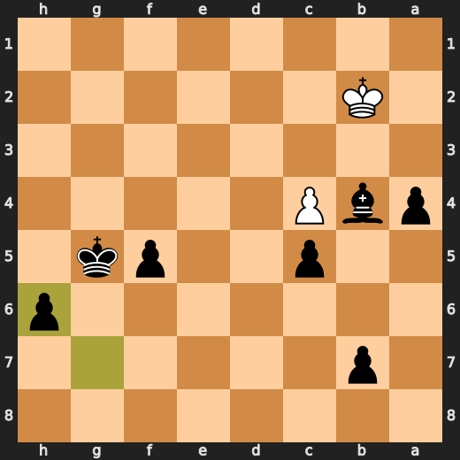

---

## Key Moments

### ❌ Mistake: 6. exf3 by You (Black)

exf3 significantly worsened Black’s position instead of improving development. Nf6 was preferred because it brings a piece into play and avoids the damaging eval swing. Learn to prioritize development when a pawn capture does not clearly improve the position.

- **Eval:** +1.04 → +4.04
- **Preferred:** `Nf6`
- **Loss:** 300 cp

**Before 6. exf3**

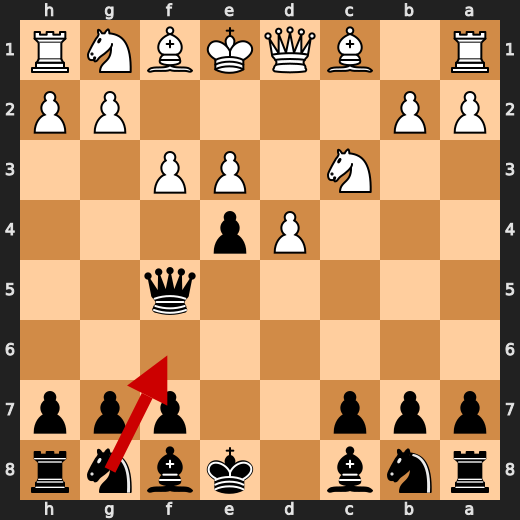

**After 6. exf3**

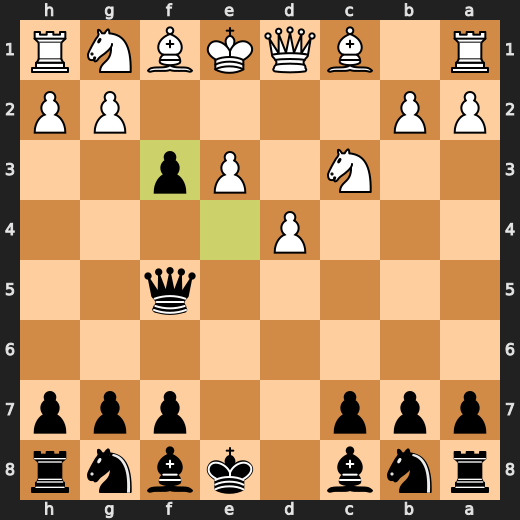

### 💀 Blunder: 16. Kf2 by CPU (White)

Kf2 worsened White’s position significantly without a clear concrete benefit from the provided facts. Kd2 was preferred because it kept the position more resilient than the played king move. Learn to treat early king moves carefully when the evaluation can swing sharply against you.

- **Eval:** -1.66 → -8.43
- **Preferred:** `Kd2`
- **Loss:** 677 cp

**Before 16. Kf2**

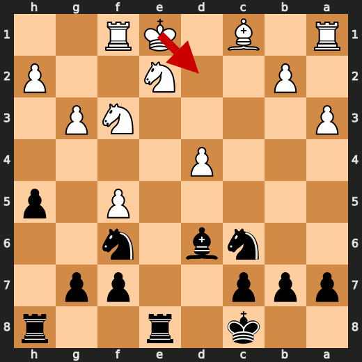

**After 16. Kf2**

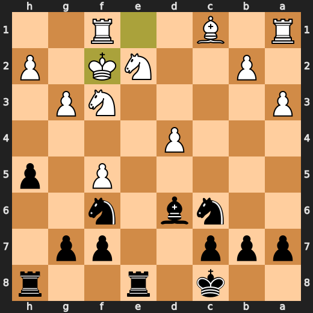

### 💀 Blunder: 17. Ne3 by You (Black)

Ne3 let a large part of Black’s advantage slip instead of choosing the stronger Nxh2. The practical lesson is to prefer the move that keeps the position clearly winning when the alternative only worsens your advantage.

- **Eval:** -8.36 → -1.57
- **Preferred:** `Nxh2`
- **Loss:** 679 cp

**Before 17. Ne3**

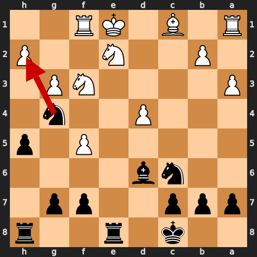

**After 17. Ne3**

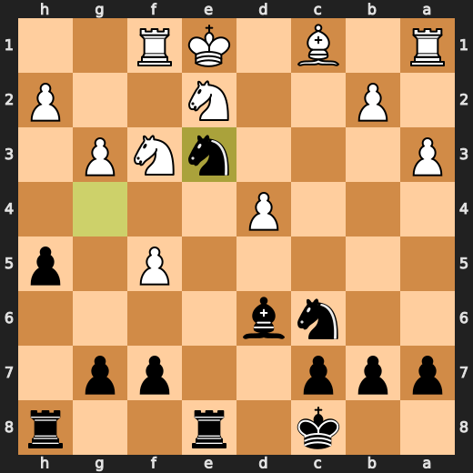

### ✅ Best: 22. Nxd4 by You (Black)

Nxd4 was the engine-approved move, so it usefully followed the forcing option in the position. Learn to look for forcing captures when they are available and check that they keep the position favorable.

- **Eval:** -3.97 → -3.74
- **Preferred:** `Nxd4`
- **Loss:** 23 cp

**Before 22. Nxd4**

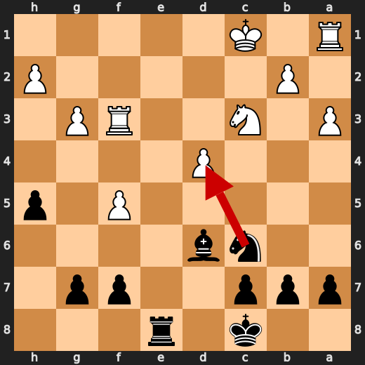

**After 22. Nxd4**

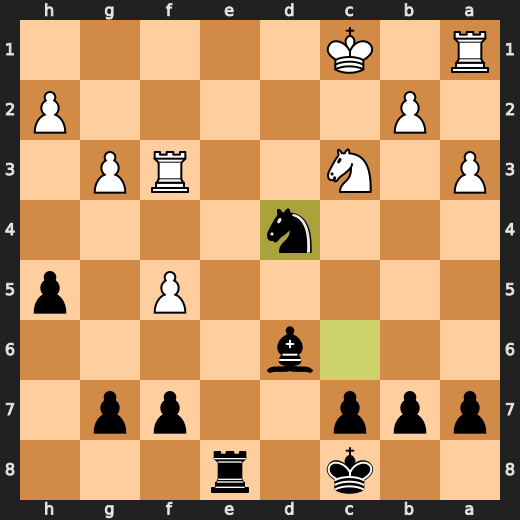

### ❌ Mistake: 23. Ne2+ by You (Black)

Ne2+ failed to keep Black’s advantage and worsened the position substantially. Nb3+ was preferred because it gives check while preserving a much stronger position for Black. Learn to choose forcing moves that improve the position, not just any check.

- **Eval:** -3.86 → +0.59
- **Preferred:** `Nb3+`
- **Loss:** 445 cp

**Before 23. Ne2+**

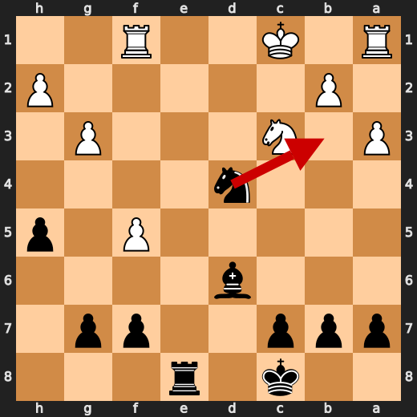

**After 23. Ne2+**

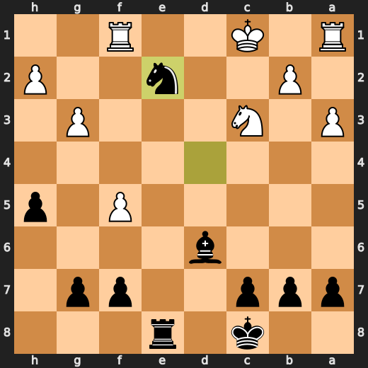

### 💀 Blunder: 34. Rg3 by CPU (White)

Rg3 failed to keep White’s position together and caused a major worsening without a clear concrete tactic from the provided facts. Ke2 was preferred because it improved White’s defensive resilience compared with moving the rook.

- **Eval:** -1.38 → -7.38
- **Preferred:** `Ke2`
- **Loss:** 600 cp

**Before 34. Rg3**

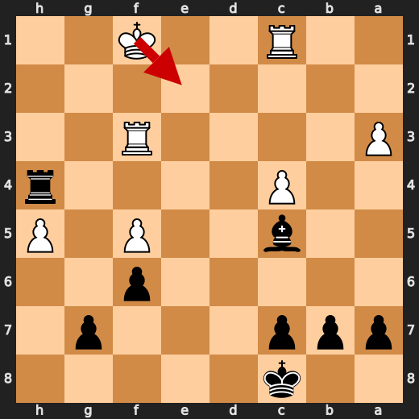

**After 34. Rg3**

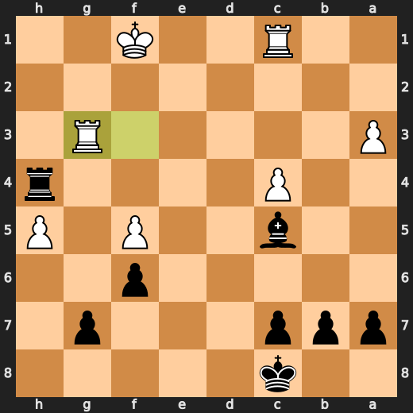

### ❌ Mistake: 43. Kb1 by CPU (White)

Kb1 worsened White’s position significantly and failed to improve the king placement enough. Kc1 was preferred because it kept a better practical setup for White in this king-and-pawn endgame.

- **Eval:** -11.11 → -14.47
- **Preferred:** `Kc1`
- **Loss:** 336 cp

**Before 43. Kb1**

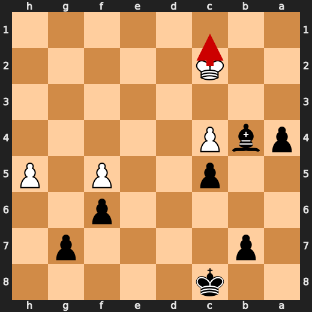

**After 43. Kb1**

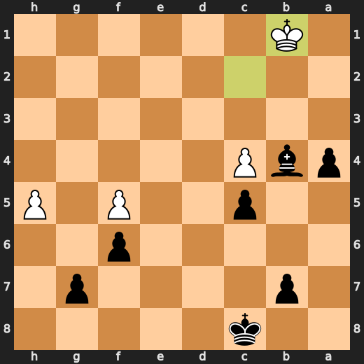

### 💀 Blunder: 49. h6 by CPU (White)

h6 did not improve White’s defense and led to a major worsening of the position. Kb1 was preferred because it kept the king more resilient than pushing the pawn. Learn to prioritize king safety in pawn endings when a quiet move can sharply change the outcome.

- **Eval:** -14.46 → -62.46
- **Preferred:** `Kb1`
- **Loss:** 4800 cp

**Before 49. h6**

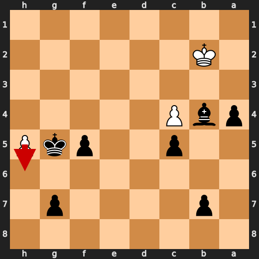

**After 49. h6**

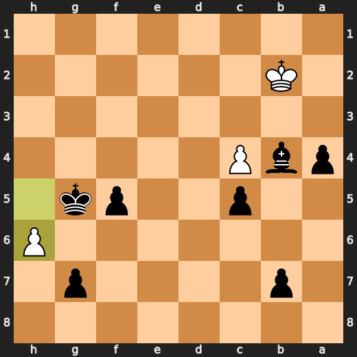

---

## Human Notes

Biggest caveman lesson: CPU (White) blew it with **16. Kf2**.

There was another real screw-up at **6. exf3** by **You (Black)**.

---

<details>
<summary>Compact move list</summary>

- 📖 **1. e3** (CPU (White), Book) — +0.35 → +0.12, preferred `d4`, loss 23 cp
- 📖 **1. e5** (You (Black), Book) — +0.09 → +0.31, preferred `Nf6`, loss 22 cp
- 📖 **2. c4** (CPU (White), Book) — +0.22 → +0.01, preferred `d4`, loss 21 cp
- 📖 **2. d5** (You (Black), Book) — -0.08 → +0.34, preferred `Nf6`, loss 42 cp
- 📖 **3. d4** (CPU (White), Book) — +0.33 → -0.15, preferred `cxd5`, loss 48 cp
- 📖 **3. e4** (You (Black), Book) — -0.04 → +1.12, preferred `exd4`, loss 116 cp
- ✅ **4. cxd5** (CPU (White), Best) — +1.06 → +1.06, preferred `cxd5`, loss 0 cp
- 🔥 **4. Qxd5** (You (Black), Great) — +1.00 → +1.38, preferred `Nd7`, loss 38 cp
- ✅ **5. Nc3** (CPU (White), Best) — +1.49 → +1.35, preferred `Nc3`, loss 14 cp
- ✅ **5. Qf5** (You (Black), Best) — +1.48 → +1.22, preferred `Qf5`, loss 0 cp
- ✅ **6. f3** (CPU (White), Best) — +1.39 → +1.29, preferred `Nge2`, loss 10 cp
- ❌ **6. exf3** (You (Black), Mistake) — +1.04 → +4.04, preferred `Nf6`, loss 300 cp
- ✅ **7. Nxf3** (CPU (White), Best) — +4.00 → +3.98, preferred `Nxf3`, loss 2 cp
- 🔥 **7. Nf6** (You (Black), Great) — +3.54 → +4.01, preferred `Qa5`, loss 47 cp
- ⚠️ **8. Bc4** (CPU (White), Inaccuracy) — +4.37 → +2.75, preferred `e4`, loss 162 cp
- ✅ **8. Be6** (You (Black), Best) — +3.07 → +2.93, preferred `Qh5`, loss 0 cp
- ⚠️ **9. Qe2** (CPU (White), Inaccuracy) — +3.17 → +1.17, preferred `d5`, loss 200 cp
- 👍 **9. Nc6** (You (Black), Good) — +1.64 → +2.53, preferred `Bxc4`, loss 89 cp
- ⚠️ **10. a3** (CPU (White), Inaccuracy) — +2.53 → +1.04, preferred `d5`, loss 149 cp
- 🔥 **10. O-O-O** (You (Black), Great) — +0.58 → +0.87, preferred `O-O-O`, loss 29 cp
- ⚠️ **11. e4** (CPU (White), Inaccuracy) — +1.06 → -1.61, preferred `Bb5`, loss 267 cp
- ✅ **11. Bxc4** (You (Black), Best) — -1.56 → -1.47, preferred `Bxc4`, loss 9 cp
- 👍 **12. exf5** (CPU (White), Good) — -1.42 → -2.55, preferred `Qxc4`, loss 113 cp
- ✅ **12. Bxe2** (You (Black), Best) — -2.62 → -2.63, preferred `Bxe2`, loss 0 cp
- 🔥 **13. Nxe2** (CPU (White), Great) — -2.43 → -2.70, preferred `Kxe2`, loss 27 cp
- 👍 **13. Re8** (You (Black), Good) — -2.72 → -2.07, preferred `Rd5`, loss 65 cp
- ✅ **14. Rf1** (CPU (White), Best) — -2.09 → -2.16, preferred `Kd2`, loss 7 cp
- 👍 **14. h5** (You (Black), Good) — -2.16 → -1.39, preferred `Bd6`, loss 77 cp
- ⚠️ **15. g3** (CPU (White), Inaccuracy) — -1.58 → -2.86, preferred `Kd2`, loss 128 cp
- 👍 **15. Bd6** (You (Black), Good) — -2.72 → -1.86, preferred `Ng4`, loss 86 cp
- 💀 **16. Kf2** (CPU (White), Blunder) — -1.66 → -8.43, preferred `Kd2`, loss 677 cp
- ✅ **16. Ng4+** (You (Black), Best) — -8.30 → -8.36, preferred `Ng4+`, loss 0 cp
- ✅ **17. Ke1** (CPU (White), Best) — -8.35 → -8.28, preferred `Ke1`, loss 0 cp
- 💀 **17. Ne3** (You (Black), Blunder) — -8.36 → -1.57, preferred `Nxh2`, loss 679 cp
- ✅ **18. Bxe3** (CPU (White), Best) — -1.46 → -1.71, preferred `Bxe3`, loss 25 cp
- 🔥 **18. Rxe3** (You (Black), Great) — -1.96 → -1.54, preferred `Rxe3`, loss 42 cp
- ⚠️ **19. Kd1** (CPU (White), Inaccuracy) — -1.44 → -4.24, preferred `Rd1`, loss 280 cp
- 🔥 **19. Rhe8** (You (Black), Great) — -4.24 → -3.88, preferred `Rhe8`, loss 36 cp
- 👍 **20. Nc3** (CPU (White), Good) — -3.57 → -4.08, preferred `Nc1`, loss 51 cp
- ✅ **20. Rd3+** (You (Black), Best) — -4.05 → -4.01, preferred `Rd3+`, loss 4 cp
- ✅ **21. Kc1** (CPU (White), Best) — -3.96 → -3.87, preferred `Kc1`, loss 0 cp
- 👍 **21. Rxf3** (You (Black), Good) — -4.26 → -3.65, preferred `h4`, loss 61 cp
- ✅ **22. Rxf3** (CPU (White), Best) — -3.84 → -3.95, preferred `Rxf3`, loss 11 cp
- ✅ **22. Nxd4** (You (Black), Best) — -3.97 → -3.74, preferred `Nxd4`, loss 23 cp
- ✅ **23. Rf1** (CPU (White), Best) — -3.95 → -3.97, preferred `Rf1`, loss 2 cp
- ❌ **23. Ne2+** (You (Black), Mistake) — -3.86 → +0.59, preferred `Nb3+`, loss 445 cp
- 🔥 **24. Kd2** (CPU (White), Great) — +0.60 → +0.44, preferred `Kd2`, loss 16 cp
- ✅ **24. Nxc3** (You (Black), Best) — +0.53 → +0.66, preferred `Nxc3`, loss 13 cp
- ✅ **25. bxc3** (CPU (White), Best) — +0.55 → +0.52, preferred `bxc3`, loss 3 cp
- 👍 **25. h4** (You (Black), Good) — +0.53 → +1.34, preferred `Rh8`, loss 81 cp
- ✅ **26. gxh4** (CPU (White), Best) — +1.09 → +0.86, preferred `gxh4`, loss 23 cp
- 👍 **26. Bxh2** (You (Black), Good) — +1.02 → +1.78, preferred `Re4`, loss 76 cp
- 👍 **27. h5** (CPU (White), Good) — +1.49 → +0.97, preferred `Rae1`, loss 52 cp
- ⚠️ **27. f6** (You (Black), Inaccuracy) — +1.11 → +2.35, preferred `Rd8+`, loss 124 cp
- 🔥 **28. Rf3** (CPU (White), Great) — +1.52 → +1.19, preferred `Rf2`, loss 33 cp
- 👍 **28. Bd6** (You (Black), Good) — +0.69 → +1.37, preferred `Re4`, loss 68 cp
- ⚠️ **29. c4** (CPU (White), Inaccuracy) — +1.51 → +0.21, preferred `Kd3`, loss 130 cp
- 👍 **29. Rd8** (You (Black), Good) — +0.65 → +1.31, preferred `Re4`, loss 66 cp
- 👍 **30. Ke3** (CPU (White), Good) — +1.32 → +0.66, preferred `Ke2`, loss 66 cp
- ✅ **30. Bc5+** (You (Black), Best) — +0.60 → +0.49, preferred `Bc5+`, loss 0 cp
- 🔥 **31. Ke2** (CPU (White), Great) — +0.66 → +0.48, preferred `Ke2`, loss 18 cp
- ✅ **31. Re8+** (You (Black), Best) — +0.53 → +0.52, preferred `Re8+`, loss 0 cp
- 🔥 **32. Kf1** (CPU (White), Great) — +0.74 → +0.37, preferred `Kf1`, loss 37 cp
- ✅ **32. Re4** (You (Black), Best) — +0.00 → +0.00, preferred `Re4`, loss 0 cp
- ⚠️ **33. Rc1** (CPU (White), Inaccuracy) — +0.18 → -1.45, preferred `Kg2`, loss 163 cp
- ✅ **33. Rh4** (You (Black), Best) — -1.06 → -1.25, preferred `Rh4`, loss 0 cp
- 💀 **34. Rg3** (CPU (White), Blunder) — -1.38 → -7.38, preferred `Ke2`, loss 600 cp
- 🔥 **34. Rh1+** (You (Black), Great) — -7.61 → -7.15, preferred `Rh1+`, loss 46 cp
- ⚠️ **35. Kg2** (CPU (White), Inaccuracy) — -6.69 → -8.07, preferred `Ke2`, loss 138 cp
- ✅ **35. Rxc1** (You (Black), Best) — -7.69 → -7.72, preferred `Rxc1`, loss 0 cp
- ⚠️ **36. Kf3** (CPU (White), Inaccuracy) — -7.88 → -9.25, preferred `Rg6`, loss 137 cp
- ✅ **36. Rc3+** (You (Black), Best) — -9.30 → -9.38, preferred `Rc3+`, loss 0 cp
- ✅ **37. Kg4** (CPU (White), Best) — -9.44 → -9.44, preferred `Kg4`, loss 0 cp
- ✅ **37. Rxg3+** (You (Black), Best) — -9.44 → -9.44, preferred `Rxg3+`, loss 0 cp
- ✅ **38. Kxg3** (CPU (White), Best) — -9.44 → -9.44, preferred `Kxg3`, loss 0 cp
- ✅ **38. Bxa3** (You (Black), Best) — -9.44 → -9.44, preferred `Bxa3`, loss 0 cp
- ✅ **39. Kf3** (CPU (White), Best) — -9.44 → -9.44, preferred `Kf3`, loss 0 cp
- ✅ **39. a5** (You (Black), Best) — -9.44 → -9.64, preferred `Kd7`, loss 0 cp
- ✅ **40. Ke4** (CPU (White), Best) — -9.96 → -9.97, preferred `Ke4`, loss 1 cp
- ✅ **40. a4** (You (Black), Best) — -9.97 → -9.96, preferred `Kd7`, loss 1 cp
- ✅ **41. Kd3** (CPU (White), Best) — -9.96 → -9.96, preferred `Kd3`, loss 0 cp
- ✅ **41. Bb4** (You (Black), Best) — -9.96 → -9.96, preferred `Kd7`, loss 0 cp
- ✅ **42. Kc2** (CPU (White), Best) — -9.89 → -9.96, preferred `c5`, loss 7 cp
- 🔥 **42. c5** (You (Black), Great) — -9.96 → -9.74, preferred `Kd7`, loss 22 cp
- ❌ **43. Kb1** (CPU (White), Mistake) — -11.11 → -14.47, preferred `Kc1`, loss 336 cp
- ✅ **43. Kc7** (You (Black), Best) — -14.47 → -19.52, preferred `Kd7`, loss 0 cp
- ✅ **44. Ka2** (CPU (White), Best) — -19.52 → -19.52, preferred `Kc1`, loss 0 cp
- ✅ **44. Kd6** (You (Black), Best) — -19.52 → -19.52, preferred `Kd6`, loss 0 cp
- ✅ **45. Kb1** (CPU (White), Best) — -19.52 → -19.52, preferred `Kb2`, loss 0 cp
- ✅ **45. Ke5** (You (Black), Best) — -19.52 → -19.52, preferred `Ke5`, loss 0 cp
- ✅ **46. Ka2** (CPU (White), Best) — -19.52 → -19.52, preferred `Ka2`, loss 0 cp
- ✅ **46. Kxf5** (You (Black), Best) — -19.52 → -20.00, preferred `Kd4`, loss 0 cp
- 👍 **47. Ka1** (CPU (White), Good) — -20.72 → -21.90, preferred `Kb2`, loss 118 cp
- ✅ **47. Kg5** (You (Black), Best) — -22.48 → -60.44, preferred `Ke4`, loss 0 cp
- ✅ **48. Kb2** (CPU (White), Best) — -21.86 → -21.86, preferred `Ka2`, loss 0 cp
- ✅ **48. f5** (You (Black), Best) — -65.63 → -65.63, preferred `a3+`, loss 0 cp
- 💀 **49. h6** (CPU (White), Blunder) — -14.46 → -62.46, preferred `Kb1`, loss 4800 cp
- ✅ **49. gxh6** (You (Black), Best) — -67.00 → -67.00, preferred `gxh6`, loss 0 cp

</details>

---

<details>
<summary>Raw engine table</summary>

| Ply | Move | Actor | Played | Label | Eval Before | Eval After | Preferred | Loss |
|---:|---:|---|---|---|---:|---:|---|---:|
| 1 | 1 | CPU (White) | e3 | Book | +0.35 | +0.12 | d4 | 23 |
| 2 | 1 | You (Black) | e5 | Book | +0.09 | +0.31 | Nf6 | 22 |
| 3 | 2 | CPU (White) | c4 | Book | +0.22 | +0.01 | d4 | 21 |
| 4 | 2 | You (Black) | d5 | Book | -0.08 | +0.34 | Nf6 | 42 |
| 5 | 3 | CPU (White) | d4 | Book | +0.33 | -0.15 | cxd5 | 48 |
| 6 | 3 | You (Black) | e4 | Book | -0.04 | +1.12 | exd4 | 116 |
| 7 | 4 | CPU (White) | cxd5 | Best | +1.06 | +1.06 | cxd5 | 0 |
| 8 | 4 | You (Black) | Qxd5 | Great | +1.00 | +1.38 | Nd7 | 38 |
| 9 | 5 | CPU (White) | Nc3 | Best | +1.49 | +1.35 | Nc3 | 14 |
| 10 | 5 | You (Black) | Qf5 | Best | +1.48 | +1.22 | Qf5 | 0 |
| 11 | 6 | CPU (White) | f3 | Best | +1.39 | +1.29 | Nge2 | 10 |
| 12 | 6 | You (Black) | exf3 | Mistake | +1.04 | +4.04 | Nf6 | 300 |
| 13 | 7 | CPU (White) | Nxf3 | Best | +4.00 | +3.98 | Nxf3 | 2 |
| 14 | 7 | You (Black) | Nf6 | Great | +3.54 | +4.01 | Qa5 | 47 |
| 15 | 8 | CPU (White) | Bc4 | Inaccuracy | +4.37 | +2.75 | e4 | 162 |
| 16 | 8 | You (Black) | Be6 | Best | +3.07 | +2.93 | Qh5 | 0 |
| 17 | 9 | CPU (White) | Qe2 | Inaccuracy | +3.17 | +1.17 | d5 | 200 |
| 18 | 9 | You (Black) | Nc6 | Good | +1.64 | +2.53 | Bxc4 | 89 |
| 19 | 10 | CPU (White) | a3 | Inaccuracy | +2.53 | +1.04 | d5 | 149 |
| 20 | 10 | You (Black) | O-O-O | Great | +0.58 | +0.87 | O-O-O | 29 |
| 21 | 11 | CPU (White) | e4 | Inaccuracy | +1.06 | -1.61 | Bb5 | 267 |
| 22 | 11 | You (Black) | Bxc4 | Best | -1.56 | -1.47 | Bxc4 | 9 |
| 23 | 12 | CPU (White) | exf5 | Good | -1.42 | -2.55 | Qxc4 | 113 |
| 24 | 12 | You (Black) | Bxe2 | Best | -2.62 | -2.63 | Bxe2 | 0 |
| 25 | 13 | CPU (White) | Nxe2 | Great | -2.43 | -2.70 | Kxe2 | 27 |
| 26 | 13 | You (Black) | Re8 | Good | -2.72 | -2.07 | Rd5 | 65 |
| 27 | 14 | CPU (White) | Rf1 | Best | -2.09 | -2.16 | Kd2 | 7 |
| 28 | 14 | You (Black) | h5 | Good | -2.16 | -1.39 | Bd6 | 77 |
| 29 | 15 | CPU (White) | g3 | Inaccuracy | -1.58 | -2.86 | Kd2 | 128 |
| 30 | 15 | You (Black) | Bd6 | Good | -2.72 | -1.86 | Ng4 | 86 |
| 31 | 16 | CPU (White) | Kf2 | Blunder | -1.66 | -8.43 | Kd2 | 677 |
| 32 | 16 | You (Black) | Ng4+ | Best | -8.30 | -8.36 | Ng4+ | 0 |
| 33 | 17 | CPU (White) | Ke1 | Best | -8.35 | -8.28 | Ke1 | 0 |
| 34 | 17 | You (Black) | Ne3 | Blunder | -8.36 | -1.57 | Nxh2 | 679 |
| 35 | 18 | CPU (White) | Bxe3 | Best | -1.46 | -1.71 | Bxe3 | 25 |
| 36 | 18 | You (Black) | Rxe3 | Great | -1.96 | -1.54 | Rxe3 | 42 |
| 37 | 19 | CPU (White) | Kd1 | Inaccuracy | -1.44 | -4.24 | Rd1 | 280 |
| 38 | 19 | You (Black) | Rhe8 | Great | -4.24 | -3.88 | Rhe8 | 36 |
| 39 | 20 | CPU (White) | Nc3 | Good | -3.57 | -4.08 | Nc1 | 51 |
| 40 | 20 | You (Black) | Rd3+ | Best | -4.05 | -4.01 | Rd3+ | 4 |
| 41 | 21 | CPU (White) | Kc1 | Best | -3.96 | -3.87 | Kc1 | 0 |
| 42 | 21 | You (Black) | Rxf3 | Good | -4.26 | -3.65 | h4 | 61 |
| 43 | 22 | CPU (White) | Rxf3 | Best | -3.84 | -3.95 | Rxf3 | 11 |
| 44 | 22 | You (Black) | Nxd4 | Best | -3.97 | -3.74 | Nxd4 | 23 |
| 45 | 23 | CPU (White) | Rf1 | Best | -3.95 | -3.97 | Rf1 | 2 |
| 46 | 23 | You (Black) | Ne2+ | Mistake | -3.86 | +0.59 | Nb3+ | 445 |
| 47 | 24 | CPU (White) | Kd2 | Great | +0.60 | +0.44 | Kd2 | 16 |
| 48 | 24 | You (Black) | Nxc3 | Best | +0.53 | +0.66 | Nxc3 | 13 |
| 49 | 25 | CPU (White) | bxc3 | Best | +0.55 | +0.52 | bxc3 | 3 |
| 50 | 25 | You (Black) | h4 | Good | +0.53 | +1.34 | Rh8 | 81 |
| 51 | 26 | CPU (White) | gxh4 | Best | +1.09 | +0.86 | gxh4 | 23 |
| 52 | 26 | You (Black) | Bxh2 | Good | +1.02 | +1.78 | Re4 | 76 |
| 53 | 27 | CPU (White) | h5 | Good | +1.49 | +0.97 | Rae1 | 52 |
| 54 | 27 | You (Black) | f6 | Inaccuracy | +1.11 | +2.35 | Rd8+ | 124 |
| 55 | 28 | CPU (White) | Rf3 | Great | +1.52 | +1.19 | Rf2 | 33 |
| 56 | 28 | You (Black) | Bd6 | Good | +0.69 | +1.37 | Re4 | 68 |
| 57 | 29 | CPU (White) | c4 | Inaccuracy | +1.51 | +0.21 | Kd3 | 130 |
| 58 | 29 | You (Black) | Rd8 | Good | +0.65 | +1.31 | Re4 | 66 |
| 59 | 30 | CPU (White) | Ke3 | Good | +1.32 | +0.66 | Ke2 | 66 |
| 60 | 30 | You (Black) | Bc5+ | Best | +0.60 | +0.49 | Bc5+ | 0 |
| 61 | 31 | CPU (White) | Ke2 | Great | +0.66 | +0.48 | Ke2 | 18 |
| 62 | 31 | You (Black) | Re8+ | Best | +0.53 | +0.52 | Re8+ | 0 |
| 63 | 32 | CPU (White) | Kf1 | Great | +0.74 | +0.37 | Kf1 | 37 |
| 64 | 32 | You (Black) | Re4 | Best | +0.00 | +0.00 | Re4 | 0 |
| 65 | 33 | CPU (White) | Rc1 | Inaccuracy | +0.18 | -1.45 | Kg2 | 163 |
| 66 | 33 | You (Black) | Rh4 | Best | -1.06 | -1.25 | Rh4 | 0 |
| 67 | 34 | CPU (White) | Rg3 | Blunder | -1.38 | -7.38 | Ke2 | 600 |
| 68 | 34 | You (Black) | Rh1+ | Great | -7.61 | -7.15 | Rh1+ | 46 |
| 69 | 35 | CPU (White) | Kg2 | Inaccuracy | -6.69 | -8.07 | Ke2 | 138 |
| 70 | 35 | You (Black) | Rxc1 | Best | -7.69 | -7.72 | Rxc1 | 0 |
| 71 | 36 | CPU (White) | Kf3 | Inaccuracy | -7.88 | -9.25 | Rg6 | 137 |
| 72 | 36 | You (Black) | Rc3+ | Best | -9.30 | -9.38 | Rc3+ | 0 |
| 73 | 37 | CPU (White) | Kg4 | Best | -9.44 | -9.44 | Kg4 | 0 |
| 74 | 37 | You (Black) | Rxg3+ | Best | -9.44 | -9.44 | Rxg3+ | 0 |
| 75 | 38 | CPU (White) | Kxg3 | Best | -9.44 | -9.44 | Kxg3 | 0 |
| 76 | 38 | You (Black) | Bxa3 | Best | -9.44 | -9.44 | Bxa3 | 0 |
| 77 | 39 | CPU (White) | Kf3 | Best | -9.44 | -9.44 | Kf3 | 0 |
| 78 | 39 | You (Black) | a5 | Best | -9.44 | -9.64 | Kd7 | 0 |
| 79 | 40 | CPU (White) | Ke4 | Best | -9.96 | -9.97 | Ke4 | 1 |
| 80 | 40 | You (Black) | a4 | Best | -9.97 | -9.96 | Kd7 | 1 |
| 81 | 41 | CPU (White) | Kd3 | Best | -9.96 | -9.96 | Kd3 | 0 |
| 82 | 41 | You (Black) | Bb4 | Best | -9.96 | -9.96 | Kd7 | 0 |
| 83 | 42 | CPU (White) | Kc2 | Best | -9.89 | -9.96 | c5 | 7 |
| 84 | 42 | You (Black) | c5 | Great | -9.96 | -9.74 | Kd7 | 22 |
| 85 | 43 | CPU (White) | Kb1 | Mistake | -11.11 | -14.47 | Kc1 | 336 |
| 86 | 43 | You (Black) | Kc7 | Best | -14.47 | -19.52 | Kd7 | 0 |
| 87 | 44 | CPU (White) | Ka2 | Best | -19.52 | -19.52 | Kc1 | 0 |
| 88 | 44 | You (Black) | Kd6 | Best | -19.52 | -19.52 | Kd6 | 0 |
| 89 | 45 | CPU (White) | Kb1 | Best | -19.52 | -19.52 | Kb2 | 0 |
| 90 | 45 | You (Black) | Ke5 | Best | -19.52 | -19.52 | Ke5 | 0 |
| 91 | 46 | CPU (White) | Ka2 | Best | -19.52 | -19.52 | Ka2 | 0 |
| 92 | 46 | You (Black) | Kxf5 | Best | -19.52 | -20.00 | Kd4 | 0 |
| 93 | 47 | CPU (White) | Ka1 | Good | -20.72 | -21.90 | Kb2 | 118 |
| 94 | 47 | You (Black) | Kg5 | Best | -22.48 | -60.44 | Ke4 | 0 |
| 95 | 48 | CPU (White) | Kb2 | Best | -21.86 | -21.86 | Ka2 | 0 |
| 96 | 48 | You (Black) | f5 | Best | -65.63 | -65.63 | a3+ | 0 |
| 97 | 49 | CPU (White) | h6 | Blunder | -14.46 | -62.46 | Kb1 | 4800 |
| 98 | 49 | You (Black) | gxh6 | Best | -67.00 | -67.00 | gxh6 | 0 |

</details>

---

<details>
<summary>Clean PGN</summary>

```pgn
[Event "AI Factory's Chess"]
[Site "Android Device"]
[Date "2026.05.18"]
[Round "1"]
[White "CPU (5)"]
[Black "You"]
[Result "0-1"]
[PlyCount "100"]

1. e3 e5 2. c4 d5 3. d4 e4 4. cxd5 Qxd5 5. Nc3 Qf5 6. f3 exf3 7. Nxf3 Nf6 8.
Bc4 Be6 9. Qe2 Nc6 10. a3 O-O-O 11. e4 Bxc4 12. exf5 Bxe2 13. Nxe2 Re8 14. Rf1
h5 15. g3 Bd6 16. Kf2 Ng4+ 17. Ke1 Ne3 18. Bxe3 Rxe3 19. Kd1 Rhe8 20. Nc3 Rd3+
21. Kc1 Rxf3 22. Rxf3 Nxd4 23. Rf1 Ne2+ 24. Kd2 Nxc3 25. bxc3 h4 26. gxh4 Bxh2
27. h5 f6 28. Rf3 Bd6 29. c4 Rd8 30. Ke3 Bc5+ 31. Ke2 Re8+ 32. Kf1 Re4 33. Rc1
Rh4 34. Rg3 Rh1+ 35. Kg2 Rxc1 36. Kf3 Rc3+ 37. Kg4 Rxg3+ 38. Kxg3 Bxa3 39. Kf3
a5 40. Ke4 a4 41. Kd3 Bb4 42. Kc2 c5 43. Kb1 Kc7 44. Ka2 Kd6 45. Kb1 Ke5 46.
Ka2 Kxf5 47. Ka1 Kg5 48. Kb2 f5 49. h6 gxh6 0-1
```

</details>
