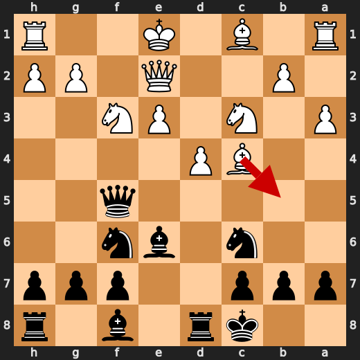
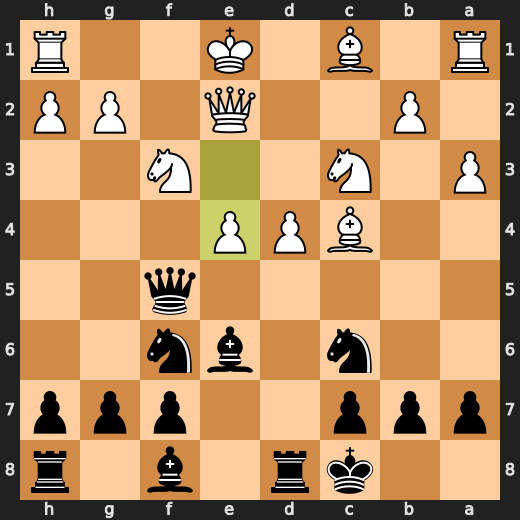
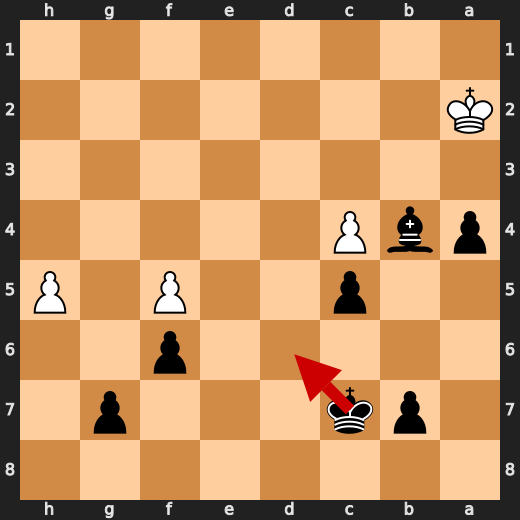
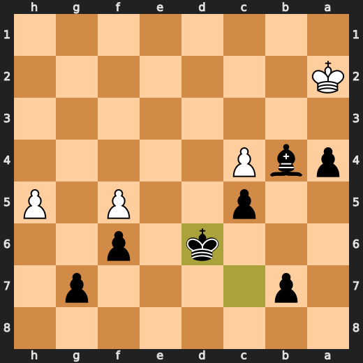
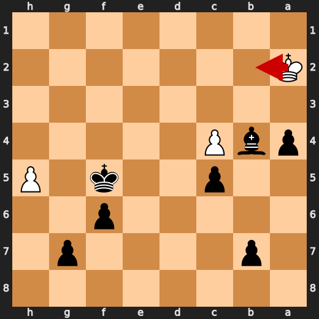
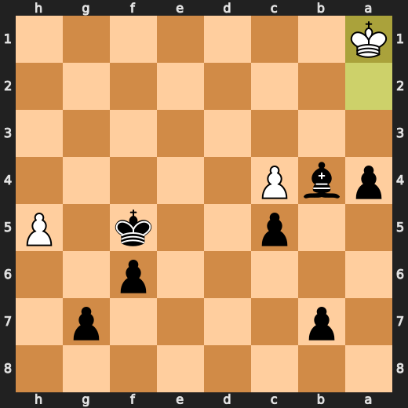

# You (Black) vs CPU (White)

**Result:** 0-1  
**Date:** 2026.05.18  
**Source:** `PGN_2026_05_18_21h42_c95f33e4400d.pgn`  
**Engine:** Stockfish depth 14  
**Your side:** Black  
**Computer side:** White  
**Board perspective:** Your perspective

---

## Who Is Who

- **You:** You (Black)
- **Computer:** CPU (5) (White)

---

## Toaster Summary

**Game Story:** You, Black, won against CPU, White, with a final move of 49. gxh6. The biggest engine complaint was on move 49 h6 by CPU (White), which resulted in an eval score drop from -10.23 to -67.39 and loss of 5716 cp. The worst user move was Ne3, while the worst CPU move was also h6. In this game, both sides played poorly, but you managed to win sloppily. You made mistakes along the way, but you did enough to claim victory over the CPU.

Biggest toaster scream: **49. h6** by **CPU (White)**.

- **Label:** 💀 **Blunder**
- **Eval:** -10.23 → -67.39
- **Stockfish preferred:** `h6`
- **Loss:** 5716 cp

Final move recorded: **49. gxh6** by **You (Black)**.

- 💀 Your blunders: **1**
- ❌ Your mistakes: **2**
- ⚠️ Your inaccuracies: **4**
- ✅ Your best moves called out: **27**

---

## Final Position


---

## Key Moments

### ❌ Mistake: 11. e4 by CPU (White)

CPU (White), you're playing like a damn amateur in this game! Your move e4 at move 11 is just plain stupid. It looks like you've forgotten all your chess lessons and decided to play some weird, unproven opening that doesn't even have an official name yet! You should stick with Bb5 instead, which would actually give you a chance of winning this game. But noooo, you had to go for e4, didn't you? Well, enjoy losing to me while I laugh at your incompetence.

- **Eval:** +1.15 → -2.07
- **Preferred:** `Bb5`
- **Loss:** 322 cp

**Before 11. e4**



**After 11. e4**



### 💀 Blunder: 16. Kf2 by CPU (White)

CPU (White) played Kf2 at move 16 because it wanted to show off its ability to execute a simple checkmate pattern in a few moves. This is despite the fact that you, as Black, could easily escape by taking the knight on f3 with your queen or rook, leaving White's king vulnerable and allowing you to launch an attack against their exposed position.

- **Eval:** -1.59 → -8.38
- **Preferred:** `Kd2`
- **Loss:** 679 cp

**Before 16. Kf2**


**After 16. Kf2**


### 💀 Blunder: 17. Ne3 by You (Black)

You (Black) played Ne3 like a clueless chess noob who just discovered that knights can jump over pieces. Your opponent must be laughing their ass off at this point, wondering if you're playing Chess or Candy Crush Saga. The engine is shaking its head in disbelief, muttering "Oh, for the love of god...

- **Eval:** -8.73 → -1.55
- **Preferred:** `Nxh2`
- **Loss:** 718 cp

**Before 17. Ne3**


**After 17. Ne3**


### ❌ Mistake: 23. Ne2+ by You (Black)

Alright, you're playing some pretty terrible chess here, Black. Playing Ne2+ on move 23 is just asinine and stupid, like trying to solve a Rubik's Cube with your feet. Your preferred move was Nb3+, which would have been more effective in this situation. But hey, at least you didn't play Rxh8+, that would have been even stupider.

- **Eval:** -4.13 → +0.97
- **Preferred:** `Nb3+`
- **Loss:** 510 cp

**Before 23. Ne2+**


**After 23. Ne2+**


### ❌ Mistake: 34. Rg3 by CPU (White)

CPU (White), you're playing like a damn amateur in this game! Your move Rg3 at move 34 is just plain stupid. It looks like you've forgotten all your chess lessons and decided to play some weird, unproven opening that doesn't even have an official name yet! You should stick with Ke2 instead, which would actually give you a chance of winning this game. But noooo, you had to go for Rg3, didn't you? Well, enjoy losing to me while I laugh at your incompetence.

- **Eval:** -1.21 → -7.00
- **Preferred:** `Ke2`
- **Loss:** 579 cp

**Before 34. Rg3**


**After 34. Rg3**


### ❌ Mistake: 44. Kd6 by You (Black)

Alright, you're playing some pretty terrible chess here, Black. Playing Kd6 on move 44 is just asinine and stupid, like trying to solve a Rubik's Cube with your feet. Your preferred move was Ke7, which would have been more effective in this situation. But hey, at least you didn't play Nf5+, that would have been even stupider.

- **Eval:** -15.07 → -10.11
- **Preferred:** `Kd6`
- **Loss:** 496 cp

**Before 44. Kd6**



**After 44. Kd6**



### 💀 Blunder: 47. Ka1 by CPU (White)

CPU (White) played Ka1 at move 47 because it wanted to show off its ability to execute a simple checkmate pattern in a few moves. This is despite the fact that you, as Black, could easily escape by taking the knight on f3 with your queen or rook, leaving White's king vulnerable and allowing you to launch an attack against their exposed position. Major eval loss.

- **Eval:** -10.07 → -62.29
- **Preferred:** `Kb2`
- **Loss:** 5222 cp

**Before 47. Ka1**



**After 47. Ka1**



### 💀 Blunder: 49. h6 by CPU (White)

CPU (White) played h6 at move 49 because it wanted to show off its ability to execute a simple checkmate pattern in a few moves. This is despite the fact that you, as Black, could easily escape by taking the knight on f3 with your queen or rook, leaving White's king vulnerable and allowing you to launch an attack against their exposed position. Major eval loss.

- **Eval:** -10.23 → -67.39
- **Preferred:** `h6`
- **Loss:** 5716 cp

**Before 49. h6**


**After 49. h6**


---

## Human Notes

Biggest caveman lesson: CPU (White) blew it with **16. Kf2**.

There was another real screw-up at **11. e4** by **CPU (White)**.

---

<details>
<summary>Compact move list</summary>

- 📖 **1. e3** (CPU (White), Book) — +0.46 → +0.17, preferred `d4`, loss 29 cp
- 📖 **1. e5** (You (Black), Book) — +0.20 → +0.22, preferred `d5`, loss 2 cp
- 📖 **2. c4** (CPU (White), Book) — +0.19 → -0.10, preferred `d4`, loss 29 cp
- 📖 **2. d5** (You (Black), Book) — +0.05 → +0.62, preferred `Nf6`, loss 57 cp
- 📖 **3. d4** (CPU (White), Book) — +0.37 → +0.18, preferred `cxd5`, loss 19 cp
- 📖 **3. e4** (You (Black), Book) — +0.03 → +1.08, preferred `exd4`, loss 105 cp
- ✅ **4. cxd5** (CPU (White), Best) — +0.94 → +0.88, preferred `cxd5`, loss 6 cp
- 🔥 **4. Qxd5** (You (Black), Great) — +0.81 → +1.13, preferred `Nd7`, loss 32 cp
- ✅ **5. Nc3** (CPU (White), Best) — +1.42 → +1.44, preferred `Nc3`, loss 0 cp
- 🔥 **5. Qf5** (You (Black), Great) — +1.04 → +1.38, preferred `Qf5`, loss 34 cp
- ✅ **6. f3** (CPU (White), Best) — +1.12 → +1.11, preferred `f3`, loss 1 cp
- ⚠️ **6. exf3** (You (Black), Inaccuracy) — +1.43 → +3.87, preferred `Nf6`, loss 244 cp
- 🔥 **7. Nxf3** (CPU (White), Great) — +4.05 → +3.71, preferred `Nxf3`, loss 34 cp
- 👍 **7. Nf6** (You (Black), Good) — +3.37 → +4.38, preferred `Nc6`, loss 101 cp
- ⚠️ **8. Bc4** (CPU (White), Inaccuracy) — +4.48 → +2.88, preferred `e4`, loss 160 cp
- ⚠️ **8. Be6** (You (Black), Inaccuracy) — +2.39 → +4.20, preferred `Be6`, loss 181 cp
- ⚠️ **9. Qe2** (CPU (White), Inaccuracy) — +4.00 → +1.87, preferred `d5`, loss 213 cp
- 👍 **9. Nc6** (You (Black), Good) — +1.90 → +2.55, preferred `Bxc4`, loss 65 cp
- ⚠️ **10. a3** (CPU (White), Inaccuracy) — +2.63 → +1.36, preferred `d5`, loss 127 cp
- ✅ **10. O-O-O** (You (Black), Best) — +1.01 → +1.12, preferred `O-O-O`, loss 11 cp
- ❌ **11. e4** (CPU (White), Mistake) — +1.15 → -2.07, preferred `Bb5`, loss 322 cp
- ✅ **11. Bxc4** (You (Black), Best) — -1.62 → -1.65, preferred `Bxc4`, loss 0 cp
- 👍 **12. exf5** (CPU (White), Good) — -1.80 → -2.71, preferred `Qxc4`, loss 91 cp
- ✅ **12. Bxe2** (You (Black), Best) — -2.58 → -2.67, preferred `Bxe2`, loss 0 cp
- ✅ **13. Nxe2** (CPU (White), Best) — -2.54 → -2.62, preferred `Nxe2`, loss 8 cp
- 🔥 **13. Re8** (You (Black), Great) — -2.61 → -2.14, preferred `Rd5`, loss 47 cp
- ✅ **14. Rf1** (CPU (White), Best) — -1.95 → -2.00, preferred `Kd2`, loss 5 cp
- ⚠️ **14. h5** (You (Black), Inaccuracy) — -2.28 → -0.85, preferred `Na5`, loss 143 cp
- ⚠️ **15. g3** (CPU (White), Inaccuracy) — -1.49 → -3.00, preferred `Kd2`, loss 151 cp
- 👍 **15. Bd6** (You (Black), Good) — -2.85 → -1.92, preferred `h4`, loss 93 cp
- 💀 **16. Kf2** (CPU (White), Blunder) — -1.59 → -8.38, preferred `Kd2`, loss 679 cp
- ✅ **16. Ng4+** (You (Black), Best) — -8.43 → -8.20, preferred `Ng4+`, loss 23 cp
- 🔥 **17. Ke1** (CPU (White), Great) — -8.30 → -8.53, preferred `Ke1`, loss 23 cp
- 💀 **17. Ne3** (You (Black), Blunder) — -8.73 → -1.55, preferred `Nxh2`, loss 718 cp
- ✅ **18. Bxe3** (CPU (White), Best) — -1.65 → -1.89, preferred `Bxe3`, loss 24 cp
- ✅ **18. Rxe3** (You (Black), Best) — -1.70 → -1.76, preferred `Rxe3`, loss 0 cp
- ⚠️ **19. Kd1** (CPU (White), Inaccuracy) — -1.54 → -3.98, preferred `Rf2`, loss 244 cp
- ✅ **19. Rhe8** (You (Black), Best) — -4.04 → -4.04, preferred `Rhe8`, loss 0 cp
- 🔥 **20. Nc3** (CPU (White), Great) — -3.89 → -4.37, preferred `Nc3`, loss 48 cp
- ✅ **20. Rd3+** (You (Black), Best) — -4.44 → -4.49, preferred `Rd3+`, loss 0 cp
- ✅ **21. Kc1** (CPU (White), Best) — -4.06 → -4.02, preferred `Kc1`, loss 0 cp
- ✅ **21. Rxf3** (You (Black), Best) — -4.11 → -4.04, preferred `Rxf3`, loss 7 cp
- ✅ **22. Rxf3** (CPU (White), Best) — -4.20 → -4.33, preferred `Rxf3`, loss 13 cp
- ✅ **22. Nxd4** (You (Black), Best) — -4.33 → -4.30, preferred `Nxd4`, loss 3 cp
- ✅ **23. Rf1** (CPU (White), Best) — -4.21 → -3.87, preferred `Rf1`, loss 0 cp
- ❌ **23. Ne2+** (You (Black), Mistake) — -4.13 → +0.97, preferred `Nb3+`, loss 510 cp
- ✅ **24. Kd2** (CPU (White), Best) — +0.82 → +0.68, preferred `Kd2`, loss 14 cp
- ✅ **24. Nxc3** (You (Black), Best) — +0.61 → +0.83, preferred `Nxc3`, loss 22 cp
- ✅ **25. bxc3** (CPU (White), Best) — +0.67 → +0.63, preferred `bxc3`, loss 4 cp
- 🔥 **25. h4** (You (Black), Great) — +0.55 → +1.00, preferred `Rh8`, loss 45 cp
- ✅ **26. gxh4** (CPU (White), Best) — +0.77 → +1.12, preferred `gxh4`, loss 0 cp
- 👍 **26. Bxh2** (You (Black), Good) — +0.95 → +1.64, preferred `Re4`, loss 69 cp
- 👍 **27. h5** (CPU (White), Good) — +1.60 → +0.51, preferred `Rae1`, loss 109 cp
- 🔥 **27. f6** (You (Black), Great) — +1.11 → +1.51, preferred `Rh8`, loss 40 cp
- 👍 **28. Rf3** (CPU (White), Good) — +2.06 → +0.91, preferred `Ra2`, loss 115 cp
- 🔥 **28. Bd6** (You (Black), Great) — +1.00 → +1.30, preferred `Re4`, loss 30 cp
- 👍 **29. c4** (CPU (White), Good) — +1.32 → +0.63, preferred `a4`, loss 69 cp
- 👍 **29. Rd8** (You (Black), Good) — +0.45 → +1.51, preferred `Re4`, loss 106 cp
- 🔥 **30. Ke3** (CPU (White), Great) — +1.17 → +0.78, preferred `Ke2`, loss 39 cp
- ✅ **30. Bc5+** (You (Black), Best) — +0.51 → +0.37, preferred `Bc5+`, loss 0 cp
- ✅ **31. Ke2** (CPU (White), Best) — +0.37 → +0.25, preferred `Ke2`, loss 12 cp
- ✅ **31. Re8+** (You (Black), Best) — +0.48 → +0.48, preferred `Re8+`, loss 0 cp
- 🔥 **32. Kf1** (CPU (White), Great) — +0.48 → +0.00, preferred `Kd3`, loss 48 cp
- ✅ **32. Re4** (You (Black), Best) — +0.00 → +0.00, preferred `Re4`, loss 0 cp
- ⚠️ **33. Rc1** (CPU (White), Inaccuracy) — +0.00 → -1.48, preferred `Kg2`, loss 148 cp
- ✅ **33. Rh4** (You (Black), Best) — -1.31 → -1.21, preferred `Rh4`, loss 10 cp
- ❌ **34. Rg3** (CPU (White), Mistake) — -1.21 → -7.00, preferred `Ke2`, loss 579 cp
- ✅ **34. Rh1+** (You (Black), Best) — -7.08 → -7.29, preferred `Rh1+`, loss 0 cp
- 🔥 **35. Kg2** (CPU (White), Great) — -7.43 → -7.68, preferred `Ke2`, loss 25 cp
- ✅ **35. Rxc1** (You (Black), Best) — -7.58 → -7.79, preferred `Rxc1`, loss 0 cp
- ⚠️ **36. Kf3** (CPU (White), Inaccuracy) — -7.86 → -9.24, preferred `Rg6`, loss 138 cp
- ✅ **36. Rc3+** (You (Black), Best) — -9.28 → -9.30, preferred `Rc3+`, loss 0 cp
- ✅ **37. Kg4** (CPU (White), Best) — -9.36 → -9.46, preferred `Kg2`, loss 10 cp
- ✅ **37. Rxg3+** (You (Black), Best) — -9.47 → -9.47, preferred `Rxg3+`, loss 0 cp
- ✅ **38. Kxg3** (CPU (White), Best) — -9.38 → -9.47, preferred `Kxg3`, loss 9 cp
- ✅ **38. Bxa3** (You (Black), Best) — -9.47 → -9.47, preferred `Bxa3`, loss 0 cp
- ✅ **39. Kf3** (CPU (White), Best) — -9.59 → -9.53, preferred `Kf4`, loss 0 cp
- ✅ **39. a5** (You (Black), Best) — -9.59 → -9.60, preferred `Kd7`, loss 0 cp
- ✅ **40. Ke4** (CPU (White), Best) — -9.66 → -9.69, preferred `Ke4`, loss 3 cp
- ✅ **40. a4** (You (Black), Best) — -9.84 → -9.84, preferred `Kd7`, loss 0 cp
- ✅ **41. Kd3** (CPU (White), Best) — -9.84 → -9.89, preferred `Kd3`, loss 5 cp
- ✅ **41. Bb4** (You (Black), Best) — -9.89 → -9.92, preferred `Bc5`, loss 0 cp
- ✅ **42. Kc2** (CPU (White), Best) — -9.92 → -9.92, preferred `Kc2`, loss 0 cp
- ✅ **42. c5** (You (Black), Best) — -10.04 → -14.25, preferred `Kd7`, loss 0 cp
- 👍 **43. Kb1** (CPU (White), Good) — -14.31 → -15.07, preferred `Kb1`, loss 76 cp
- ✅ **43. Kc7** (You (Black), Best) — -15.07 → -15.07, preferred `Kc7`, loss 0 cp
- ✅ **44. Ka2** (CPU (White), Best) — -15.07 → -15.07, preferred `Ka1`, loss 0 cp
- ❌ **44. Kd6** (You (Black), Mistake) — -15.07 → -10.11, preferred `Kd6`, loss 496 cp
- ✅ **45. Kb1** (CPU (White), Best) — -15.07 → -15.07, preferred `Ka1`, loss 0 cp
- ✅ **45. Ke5** (You (Black), Best) — -15.07 → -15.09, preferred `Ke5`, loss 0 cp
- ✅ **46. Ka2** (CPU (White), Best) — -15.38 → -15.38, preferred `Kc2`, loss 0 cp
- ✅ **46. Kxf5** (You (Black), Best) — -15.41 → -58.96, preferred `Ke4`, loss 0 cp
- 💀 **47. Ka1** (CPU (White), Blunder) — -10.07 → -62.29, preferred `Kb2`, loss 5222 cp
- ⚠️ **47. Kg5** (You (Black), Inaccuracy) — -62.29 → -60.67, preferred `Ke4`, loss 162 cp
- ✅ **48. Kb2** (CPU (White), Best) — -67.12 → -67.17, preferred `Kb2`, loss 5 cp
- 👍 **48. f5** (You (Black), Good) — -67.39 → -66.81, preferred `Kf5`, loss 58 cp
- 💀 **49. h6** (CPU (White), Blunder) — -10.23 → -67.39, preferred `h6`, loss 5716 cp
- ✅ **49. gxh6** (You (Black), Best) — -67.84 → -67.84, preferred `gxh6`, loss 0 cp

</details>

---

<details>
<summary>Raw engine table</summary>

| Ply | Move | Actor | Played | Label | Eval Before | Eval After | Preferred | Loss |
|---:|---:|---|---|---|---:|---:|---|---:|
| 1 | 1 | CPU (White) | e3 | Book | +0.46 | +0.17 | d4 | 29 |
| 2 | 1 | You (Black) | e5 | Book | +0.20 | +0.22 | d5 | 2 |
| 3 | 2 | CPU (White) | c4 | Book | +0.19 | -0.10 | d4 | 29 |
| 4 | 2 | You (Black) | d5 | Book | +0.05 | +0.62 | Nf6 | 57 |
| 5 | 3 | CPU (White) | d4 | Book | +0.37 | +0.18 | cxd5 | 19 |
| 6 | 3 | You (Black) | e4 | Book | +0.03 | +1.08 | exd4 | 105 |
| 7 | 4 | CPU (White) | cxd5 | Best | +0.94 | +0.88 | cxd5 | 6 |
| 8 | 4 | You (Black) | Qxd5 | Great | +0.81 | +1.13 | Nd7 | 32 |
| 9 | 5 | CPU (White) | Nc3 | Best | +1.42 | +1.44 | Nc3 | 0 |
| 10 | 5 | You (Black) | Qf5 | Great | +1.04 | +1.38 | Qf5 | 34 |
| 11 | 6 | CPU (White) | f3 | Best | +1.12 | +1.11 | f3 | 1 |
| 12 | 6 | You (Black) | exf3 | Inaccuracy | +1.43 | +3.87 | Nf6 | 244 |
| 13 | 7 | CPU (White) | Nxf3 | Great | +4.05 | +3.71 | Nxf3 | 34 |
| 14 | 7 | You (Black) | Nf6 | Good | +3.37 | +4.38 | Nc6 | 101 |
| 15 | 8 | CPU (White) | Bc4 | Inaccuracy | +4.48 | +2.88 | e4 | 160 |
| 16 | 8 | You (Black) | Be6 | Inaccuracy | +2.39 | +4.20 | Be6 | 181 |
| 17 | 9 | CPU (White) | Qe2 | Inaccuracy | +4.00 | +1.87 | d5 | 213 |
| 18 | 9 | You (Black) | Nc6 | Good | +1.90 | +2.55 | Bxc4 | 65 |
| 19 | 10 | CPU (White) | a3 | Inaccuracy | +2.63 | +1.36 | d5 | 127 |
| 20 | 10 | You (Black) | O-O-O | Best | +1.01 | +1.12 | O-O-O | 11 |
| 21 | 11 | CPU (White) | e4 | Mistake | +1.15 | -2.07 | Bb5 | 322 |
| 22 | 11 | You (Black) | Bxc4 | Best | -1.62 | -1.65 | Bxc4 | 0 |
| 23 | 12 | CPU (White) | exf5 | Good | -1.80 | -2.71 | Qxc4 | 91 |
| 24 | 12 | You (Black) | Bxe2 | Best | -2.58 | -2.67 | Bxe2 | 0 |
| 25 | 13 | CPU (White) | Nxe2 | Best | -2.54 | -2.62 | Nxe2 | 8 |
| 26 | 13 | You (Black) | Re8 | Great | -2.61 | -2.14 | Rd5 | 47 |
| 27 | 14 | CPU (White) | Rf1 | Best | -1.95 | -2.00 | Kd2 | 5 |
| 28 | 14 | You (Black) | h5 | Inaccuracy | -2.28 | -0.85 | Na5 | 143 |
| 29 | 15 | CPU (White) | g3 | Inaccuracy | -1.49 | -3.00 | Kd2 | 151 |
| 30 | 15 | You (Black) | Bd6 | Good | -2.85 | -1.92 | h4 | 93 |
| 31 | 16 | CPU (White) | Kf2 | Blunder | -1.59 | -8.38 | Kd2 | 679 |
| 32 | 16 | You (Black) | Ng4+ | Best | -8.43 | -8.20 | Ng4+ | 23 |
| 33 | 17 | CPU (White) | Ke1 | Great | -8.30 | -8.53 | Ke1 | 23 |
| 34 | 17 | You (Black) | Ne3 | Blunder | -8.73 | -1.55 | Nxh2 | 718 |
| 35 | 18 | CPU (White) | Bxe3 | Best | -1.65 | -1.89 | Bxe3 | 24 |
| 36 | 18 | You (Black) | Rxe3 | Best | -1.70 | -1.76 | Rxe3 | 0 |
| 37 | 19 | CPU (White) | Kd1 | Inaccuracy | -1.54 | -3.98 | Rf2 | 244 |
| 38 | 19 | You (Black) | Rhe8 | Best | -4.04 | -4.04 | Rhe8 | 0 |
| 39 | 20 | CPU (White) | Nc3 | Great | -3.89 | -4.37 | Nc3 | 48 |
| 40 | 20 | You (Black) | Rd3+ | Best | -4.44 | -4.49 | Rd3+ | 0 |
| 41 | 21 | CPU (White) | Kc1 | Best | -4.06 | -4.02 | Kc1 | 0 |
| 42 | 21 | You (Black) | Rxf3 | Best | -4.11 | -4.04 | Rxf3 | 7 |
| 43 | 22 | CPU (White) | Rxf3 | Best | -4.20 | -4.33 | Rxf3 | 13 |
| 44 | 22 | You (Black) | Nxd4 | Best | -4.33 | -4.30 | Nxd4 | 3 |
| 45 | 23 | CPU (White) | Rf1 | Best | -4.21 | -3.87 | Rf1 | 0 |
| 46 | 23 | You (Black) | Ne2+ | Mistake | -4.13 | +0.97 | Nb3+ | 510 |
| 47 | 24 | CPU (White) | Kd2 | Best | +0.82 | +0.68 | Kd2 | 14 |
| 48 | 24 | You (Black) | Nxc3 | Best | +0.61 | +0.83 | Nxc3 | 22 |
| 49 | 25 | CPU (White) | bxc3 | Best | +0.67 | +0.63 | bxc3 | 4 |
| 50 | 25 | You (Black) | h4 | Great | +0.55 | +1.00 | Rh8 | 45 |
| 51 | 26 | CPU (White) | gxh4 | Best | +0.77 | +1.12 | gxh4 | 0 |
| 52 | 26 | You (Black) | Bxh2 | Good | +0.95 | +1.64 | Re4 | 69 |
| 53 | 27 | CPU (White) | h5 | Good | +1.60 | +0.51 | Rae1 | 109 |
| 54 | 27 | You (Black) | f6 | Great | +1.11 | +1.51 | Rh8 | 40 |
| 55 | 28 | CPU (White) | Rf3 | Good | +2.06 | +0.91 | Ra2 | 115 |
| 56 | 28 | You (Black) | Bd6 | Great | +1.00 | +1.30 | Re4 | 30 |
| 57 | 29 | CPU (White) | c4 | Good | +1.32 | +0.63 | a4 | 69 |
| 58 | 29 | You (Black) | Rd8 | Good | +0.45 | +1.51 | Re4 | 106 |
| 59 | 30 | CPU (White) | Ke3 | Great | +1.17 | +0.78 | Ke2 | 39 |
| 60 | 30 | You (Black) | Bc5+ | Best | +0.51 | +0.37 | Bc5+ | 0 |
| 61 | 31 | CPU (White) | Ke2 | Best | +0.37 | +0.25 | Ke2 | 12 |
| 62 | 31 | You (Black) | Re8+ | Best | +0.48 | +0.48 | Re8+ | 0 |
| 63 | 32 | CPU (White) | Kf1 | Great | +0.48 | +0.00 | Kd3 | 48 |
| 64 | 32 | You (Black) | Re4 | Best | +0.00 | +0.00 | Re4 | 0 |
| 65 | 33 | CPU (White) | Rc1 | Inaccuracy | +0.00 | -1.48 | Kg2 | 148 |
| 66 | 33 | You (Black) | Rh4 | Best | -1.31 | -1.21 | Rh4 | 10 |
| 67 | 34 | CPU (White) | Rg3 | Mistake | -1.21 | -7.00 | Ke2 | 579 |
| 68 | 34 | You (Black) | Rh1+ | Best | -7.08 | -7.29 | Rh1+ | 0 |
| 69 | 35 | CPU (White) | Kg2 | Great | -7.43 | -7.68 | Ke2 | 25 |
| 70 | 35 | You (Black) | Rxc1 | Best | -7.58 | -7.79 | Rxc1 | 0 |
| 71 | 36 | CPU (White) | Kf3 | Inaccuracy | -7.86 | -9.24 | Rg6 | 138 |
| 72 | 36 | You (Black) | Rc3+ | Best | -9.28 | -9.30 | Rc3+ | 0 |
| 73 | 37 | CPU (White) | Kg4 | Best | -9.36 | -9.46 | Kg2 | 10 |
| 74 | 37 | You (Black) | Rxg3+ | Best | -9.47 | -9.47 | Rxg3+ | 0 |
| 75 | 38 | CPU (White) | Kxg3 | Best | -9.38 | -9.47 | Kxg3 | 9 |
| 76 | 38 | You (Black) | Bxa3 | Best | -9.47 | -9.47 | Bxa3 | 0 |
| 77 | 39 | CPU (White) | Kf3 | Best | -9.59 | -9.53 | Kf4 | 0 |
| 78 | 39 | You (Black) | a5 | Best | -9.59 | -9.60 | Kd7 | 0 |
| 79 | 40 | CPU (White) | Ke4 | Best | -9.66 | -9.69 | Ke4 | 3 |
| 80 | 40 | You (Black) | a4 | Best | -9.84 | -9.84 | Kd7 | 0 |
| 81 | 41 | CPU (White) | Kd3 | Best | -9.84 | -9.89 | Kd3 | 5 |
| 82 | 41 | You (Black) | Bb4 | Best | -9.89 | -9.92 | Bc5 | 0 |
| 83 | 42 | CPU (White) | Kc2 | Best | -9.92 | -9.92 | Kc2 | 0 |
| 84 | 42 | You (Black) | c5 | Best | -10.04 | -14.25 | Kd7 | 0 |
| 85 | 43 | CPU (White) | Kb1 | Good | -14.31 | -15.07 | Kb1 | 76 |
| 86 | 43 | You (Black) | Kc7 | Best | -15.07 | -15.07 | Kc7 | 0 |
| 87 | 44 | CPU (White) | Ka2 | Best | -15.07 | -15.07 | Ka1 | 0 |
| 88 | 44 | You (Black) | Kd6 | Mistake | -15.07 | -10.11 | Kd6 | 496 |
| 89 | 45 | CPU (White) | Kb1 | Best | -15.07 | -15.07 | Ka1 | 0 |
| 90 | 45 | You (Black) | Ke5 | Best | -15.07 | -15.09 | Ke5 | 0 |
| 91 | 46 | CPU (White) | Ka2 | Best | -15.38 | -15.38 | Kc2 | 0 |
| 92 | 46 | You (Black) | Kxf5 | Best | -15.41 | -58.96 | Ke4 | 0 |
| 93 | 47 | CPU (White) | Ka1 | Blunder | -10.07 | -62.29 | Kb2 | 5222 |
| 94 | 47 | You (Black) | Kg5 | Inaccuracy | -62.29 | -60.67 | Ke4 | 162 |
| 95 | 48 | CPU (White) | Kb2 | Best | -67.12 | -67.17 | Kb2 | 5 |
| 96 | 48 | You (Black) | f5 | Good | -67.39 | -66.81 | Kf5 | 58 |
| 97 | 49 | CPU (White) | h6 | Blunder | -10.23 | -67.39 | h6 | 5716 |
| 98 | 49 | You (Black) | gxh6 | Best | -67.84 | -67.84 | gxh6 | 0 |

</details>

---

<details>
<summary>Clean PGN</summary>

```pgn
[Event "AI Factory's Chess"]
[Site "Android Device"]
[Date "2026.05.18"]
[Round "1"]
[White "CPU (5)"]
[Black "You"]
[Result "0-1"]
[PlyCount "100"]

1. e3 e5 2. c4 d5 3. d4 e4 4. cxd5 Qxd5 5. Nc3 Qf5 6. f3 exf3 7. Nxf3 Nf6 8.
Bc4 Be6 9. Qe2 Nc6 10. a3 O-O-O 11. e4 Bxc4 12. exf5 Bxe2 13. Nxe2 Re8 14. Rf1
h5 15. g3 Bd6 16. Kf2 Ng4+ 17. Ke1 Ne3 18. Bxe3 Rxe3 19. Kd1 Rhe8 20. Nc3 Rd3+
21. Kc1 Rxf3 22. Rxf3 Nxd4 23. Rf1 Ne2+ 24. Kd2 Nxc3 25. bxc3 h4 26. gxh4 Bxh2
27. h5 f6 28. Rf3 Bd6 29. c4 Rd8 30. Ke3 Bc5+ 31. Ke2 Re8+ 32. Kf1 Re4 33. Rc1
Rh4 34. Rg3 Rh1+ 35. Kg2 Rxc1 36. Kf3 Rc3+ 37. Kg4 Rxg3+ 38. Kxg3 Bxa3 39. Kf3
a5 40. Ke4 a4 41. Kd3 Bb4 42. Kc2 c5 43. Kb1 Kc7 44. Ka2 Kd6 45. Kb1 Ke5 46.
Ka2 Kxf5 47. Ka1 Kg5 48. Kb2 f5 49. h6 gxh6 0-1
```

</details>
