# You (Black) vs CPU (White)

**Result:** 0-1  
**Date:** 2026.05.18  
**Source:** `PGN_2026_05_18_23h05_90366779f0d4.pgn`  
**Engine:** Stockfish depth 14  
**Your side:** Black  
**Computer side:** White  
**Board perspective:** Your perspective

---

## Who Is Who

- **You:** You (Black)
- **Computer:** CPU (5) (White)

---

## Toaster Summary

**Game Story:** The game began as a Scandinavian Defense, and your win came after White failed to use several earlier chances. Your 29...Kf6 gave White a major opportunity, but 30 Bc4 let it slip and kept the game messy. White later threw the ending with 57 Rxg6+, 63 Rb1, and 68 Rb3, allowing your final 68...Rh1# checkmate. Learn to respect king safety after risky king moves, then convert endgames without giving the opponent repeated chances.

Biggest toaster scream: **30. Bc4** by **CPU (White)**.

- **Label:** 💀 **Blunder**
- **Eval:** White has mate → +7.99
- **Stockfish preferred:** `Rdd7`
- **Loss:** 99201 cp

Final move recorded: **68. Rh1#** by **You (Black)**.

- 💀 Your blunders: **2**
- ❌ Your mistakes: **3**
- ⚠️ Your inaccuracies: **6**
- ✅ Your best moves called out: **24**

---

## Final Position


---

## Key Moments

### ❌ Mistake: 28. Kf7 by You (Black)

Kf7 worsened Black’s position and missed the engine’s preferred Nf7. The practical lesson is to look for the move that limits the damage most when the position is already difficult.

- **Eval:** +8.05 → +12.19
- **Preferred:** `Nf7`
- **Loss:** 414 cp

**Before 28. Kf7**

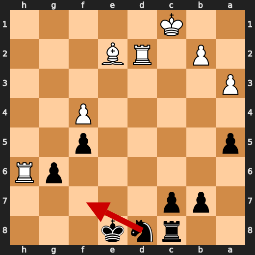

**After 28. Kf7**

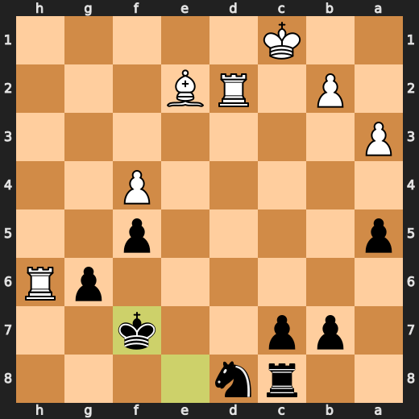

### 💀 Blunder: 29. Kf6 by You (Black)

Kf6 failed to keep Black’s king out of immediate mating danger, and after it White has mate. Ke8 was the preferred move because it gave the king a better defensive square and avoided this immediate collapse. Learn to treat king moves in exposed positions as forcing-move checks: first ask whether the new square allows mate.

- **Eval:** +12.72 → White has mate
- **Preferred:** `Ke8`
- **Loss:** 98728 cp

**Before 29. Kf6**

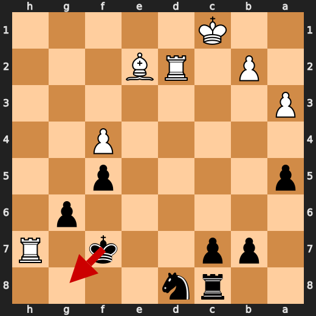

**After 29. Kf6**

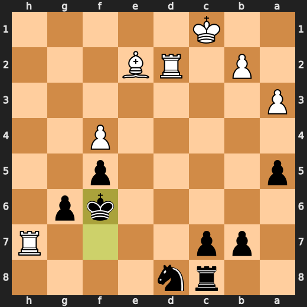

### 💀 Blunder: 30. Bc4 by CPU (White)

Bc4 failed to keep White’s forced mate, so it worsened the position substantially. Rdd7 was preferred because it preserved the decisive attacking opportunity. Learn to check forcing rook moves before choosing a quieter bishop move.

- **Eval:** White has mate → +7.99
- **Preferred:** `Rdd7`
- **Loss:** 99201 cp

**Before 30. Bc4**

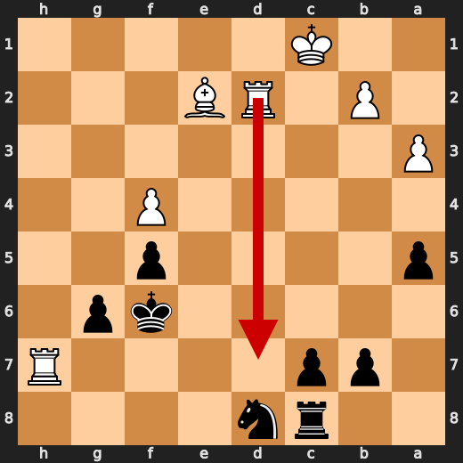

**After 30. Bc4**

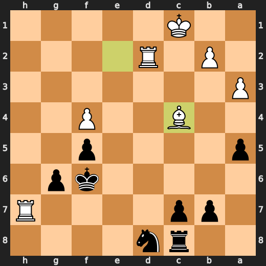

### 💀 Blunder: 57. Rxg6+ by CPU (White)

Rxg6+ failed to preserve White’s advantage and instead worsened the position severely. Rb7 was preferred because it kept White in control without allowing the major swing in Black’s favor. Learn to be cautious with checking captures in rook endgames when the concrete follow-up is not clearly favorable.

- **Eval:** +3.60 → -5.08
- **Preferred:** `Rb7`
- **Loss:** 868 cp

**Before 57. Rxg6+**

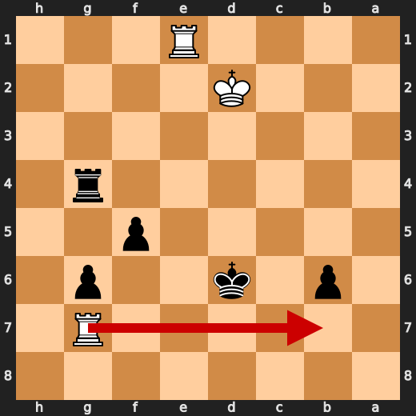

**After 57. Rxg6+**

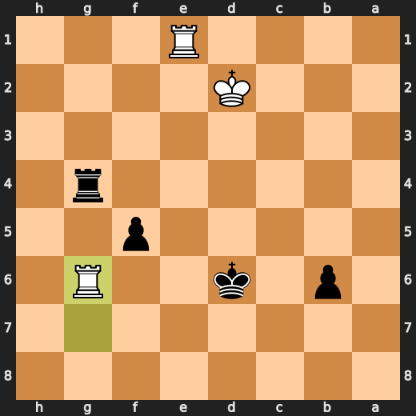

### ❌ Mistake: 63. Rb1 by CPU (White)

Rb1 failed to improve White’s king activity in this rook ending. Kf3 was preferred because it brings the king closer to the important pawns, and missing that allowed Black to get a much stronger position.

- **Eval:** -0.50 → -4.30
- **Preferred:** `Kf3`
- **Loss:** 380 cp

**Before 63. Rb1**

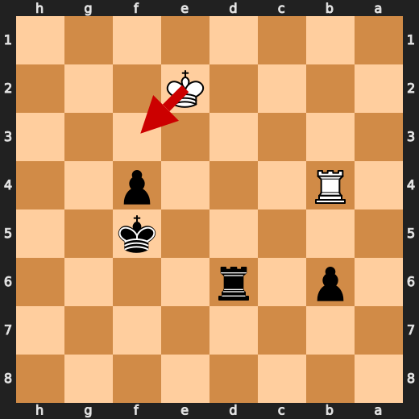

**After 63. Rb1**

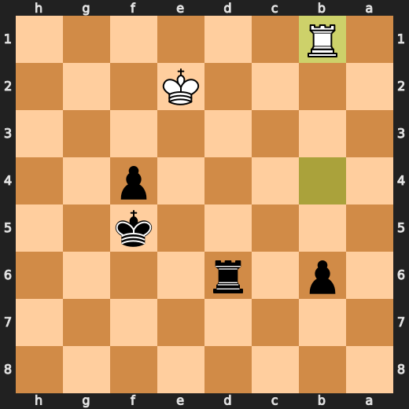

### 💀 Blunder: 67. Kf1 by CPU (White)

Kf1 worsened White’s position and failed to limit Black’s already decisive advantage. Ke1 was preferred because it held up better in the king-and-rook endgame. Learn to choose king moves in lost endgames by checking which square gives the most resistance.

- **Eval:** -53.44 → -65.95
- **Preferred:** `Ke1`
- **Loss:** 1251 cp

**Before 67. Kf1**

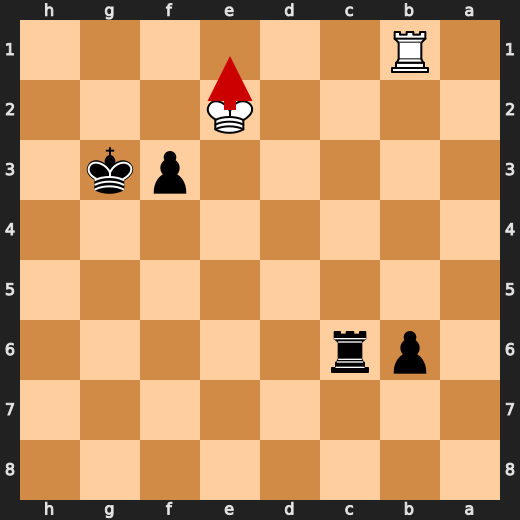

**After 67. Kf1**

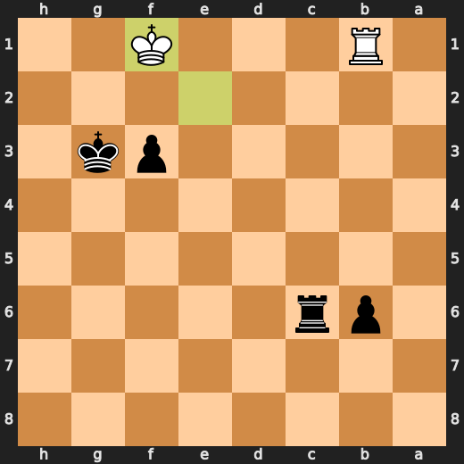

### 💀 Blunder: 68. Rb3 by CPU (White)

Rb3 failed to give White the most resistance and let Black reach a forced mate. Ke1 was preferred because it held the position together longer. Learn to check king safety first in lost rook endgames, especially when the engine swing means mate is now forced.

- **Eval:** -67.79 → Black has mate
- **Preferred:** `Ke1`
- **Loss:** 93221 cp

**Before 68. Rb3**

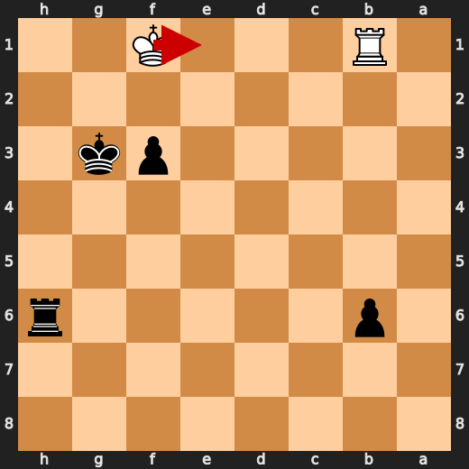

**After 68. Rb3**

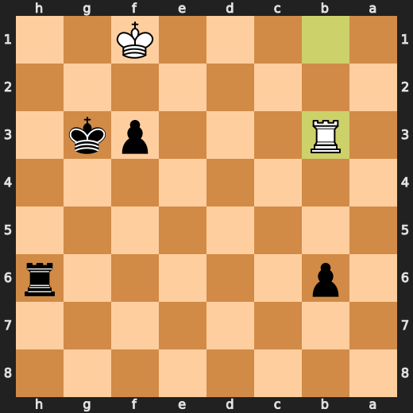

### 🏁 Checkmate: 68. Rh1# by You (Black)

Rh1# was the preferred move and correctly used Black’s already-forcing position to end the game immediately. The useful pattern is to choose the direct game-ending move when mate is available.

- **Eval:** Black has mate → Black has mate
- **Preferred:** `Rh1#`
- **Loss:** 0 cp

**Before 68. Rh1#**

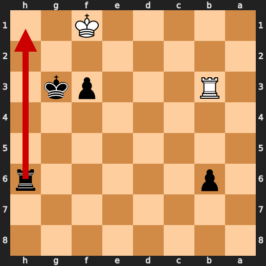

**After 68. Rh1#**

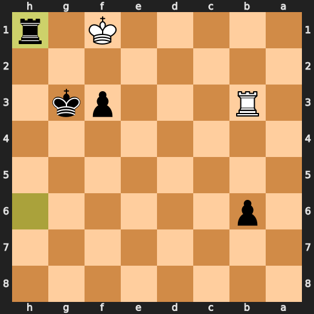

---

## Human Notes

Biggest caveman lesson: You (Black) blew it with **12. Nxc3**.

There was another real screw-up at **10. Nxd5** by **You (Black)**.

The game-ending shot was **68. Rh1#** by **You (Black)**.

---

<details>
<summary>Compact move list</summary>

- 📖 **1. e4** (CPU (White), Book) — +0.35 → +0.32, preferred `e4`, loss 3 cp
- 📖 **1. d5** (You (Black), Book) — +0.39 → +0.90, preferred `e6`, loss 51 cp
- 📖 **2. exd5** (CPU (White), Book) — +0.99 → +0.84, preferred `exd5`, loss 15 cp
- 📖 **2. Qxd5** (You (Black), Book) — +0.97 → +0.90, preferred `Qxd5`, loss 0 cp
- 📖 **3. d3** (CPU (White), Book) — +0.97 → -0.04, preferred `Nc3`, loss 101 cp
- 📖 **3. Nc6** (You (Black), Book) — +0.12 → +0.09, preferred `Nc6`, loss 0 cp
- ✅ **4. Nf3** (CPU (White), Best) — +0.12 → +0.16, preferred `Nf3`, loss 0 cp
- 👍 **4. g6** (You (Black), Good) — +0.15 → +0.70, preferred `e5`, loss 55 cp
- ✅ **5. Nc3** (CPU (White), Best) — +0.72 → +0.67, preferred `d4`, loss 5 cp
- 🔥 **5. Qa5** (You (Black), Great) — +0.70 → +0.95, preferred `Qa5`, loss 25 cp
- ✅ **6. d4** (CPU (White), Best) — +0.95 → +1.06, preferred `d4`, loss 0 cp
- 🔥 **6. a6** (You (Black), Great) — +0.88 → +1.24, preferred `Nf6`, loss 36 cp
- 👍 **7. a3** (CPU (White), Good) — +1.46 → +0.68, preferred `d5`, loss 78 cp
- 👍 **7. Nf6** (You (Black), Good) — +0.25 → +1.36, preferred `Bg4`, loss 111 cp
- ✅ **8. d5** (CPU (White), Best) — +1.60 → +1.51, preferred `d5`, loss 9 cp
- 👍 **8. Nd8** (You (Black), Good) — +1.55 → +2.24, preferred `Na7`, loss 69 cp
- 👍 **9. g3** (CPU (White), Good) — +2.16 → +1.11, preferred `b4`, loss 105 cp
- 👍 **9. Bg4** (You (Black), Good) — +0.90 → +2.04, preferred `e6`, loss 114 cp
- ⚠️ **10. Bd2** (CPU (White), Inaccuracy) — +2.01 → +0.00, preferred `b4`, loss 201 cp
- ❌ **10. Nxd5** (You (Black), Mistake) — +0.11 → +3.81, preferred `c6`, loss 370 cp
- ⚠️ **11. h3** (CPU (White), Inaccuracy) — +3.22 → +0.86, preferred `Bb5+`, loss 236 cp
- 🔥 **11. Bxf3** (You (Black), Great) — +0.31 → +0.59, preferred `Be6`, loss 28 cp
- ✅ **12. Qxf3** (CPU (White), Best) — +0.50 → +0.62, preferred `Qxf3`, loss 0 cp
- 💀 **12. Nxc3** (You (Black), Blunder) — +0.59 → +8.00, preferred `c6`, loss 741 cp
- ✅ **13. Bxc3** (CPU (White), Best) — +8.14 → +8.07, preferred `Bxc3`, loss 7 cp
- ✅ **13. Qc5** (You (Black), Best) — +8.00 → +8.07, preferred `Qc5`, loss 7 cp
- ✅ **14. Bxh8** (CPU (White), Best) — +8.07 → +8.12, preferred `Bxh8`, loss 0 cp
- 👍 **14. Qxc2** (You (Black), Good) — +7.79 → +8.70, preferred `Qc6`, loss 91 cp
- 🔥 **15. Bd3** (CPU (White), Great) — +9.00 → +8.69, preferred `Bd3`, loss 31 cp
- ✅ **15. Qb3** (You (Black), Best) — +8.60 → +8.71, preferred `Qb3`, loss 11 cp
- 👍 **16. Qe2** (CPU (White), Good) — +8.49 → +7.87, preferred `Qe2`, loss 62 cp
- 🔥 **16. Qe6** (You (Black), Great) — +7.89 → +8.07, preferred `Qb6`, loss 18 cp
- 👍 **17. Be5** (CPU (White), Good) — +8.07 → +7.30, preferred `Bc3`, loss 77 cp
- 👍 **17. f6** (You (Black), Good) — +7.46 → +8.25, preferred `Nc6`, loss 79 cp
- ✅ **18. Bc3** (CPU (White), Best) — +7.53 → +7.75, preferred `Bc3`, loss 0 cp
- ✅ **18. Qxe2+** (You (Black), Best) — +7.75 → +7.86, preferred `Qxe2+`, loss 11 cp
- ✅ **19. Bxe2** (CPU (White), Best) — +7.94 → +7.82, preferred `Bxe2`, loss 12 cp
- 🔥 **19. e5** (You (Black), Great) — +7.73 → +8.02, preferred `Ne6`, loss 29 cp
- 👍 **20. f4** (CPU (White), Good) — +8.21 → +7.53, preferred `Bf3`, loss 68 cp
- 👍 **20. exf4** (You (Black), Good) — +7.66 → +8.22, preferred `Ne6`, loss 56 cp
- ✅ **21. gxf4** (CPU (White), Best) — +8.14 → +8.13, preferred `gxf4`, loss 1 cp
- 👍 **21. f5** (You (Black), Good) — +7.93 → +8.71, preferred `Ne6`, loss 78 cp
- 🔥 **22. O-O-O** (CPU (White), Great) — +8.30 → +8.07, preferred `O-O-O`, loss 23 cp
- 🔥 **22. Bc5** (You (Black), Great) — +8.09 → +8.38, preferred `Bd6`, loss 29 cp
- ✅ **23. h4** (CPU (White), Best) — +8.62 → +8.60, preferred `Rhe1`, loss 2 cp
- 👍 **23. Be3+** (You (Black), Good) — +8.05 → +8.67, preferred `Bd6`, loss 62 cp
- 👍 **24. Bd2** (CPU (White), Good) — +8.71 → +7.92, preferred `Kb1`, loss 79 cp
- 🔥 **24. Bxd2+** (You (Black), Great) — +7.84 → +8.07, preferred `Bd4`, loss 23 cp
- ✅ **25. Rxd2** (CPU (White), Best) — +8.00 → +7.79, preferred `Rxd2`, loss 21 cp
- ⚠️ **25. a5** (You (Black), Inaccuracy) — +8.03 → +9.34, preferred `Ne6`, loss 131 cp
- ✅ **26. h5** (CPU (White), Best) — +9.23 → +9.11, preferred `Bb5+`, loss 12 cp
- ⚠️ **26. Rc8** (You (Black), Inaccuracy) — +8.80 → +10.46, preferred `Ne6`, loss 166 cp
- 👍 **27. hxg6** (CPU (White), Good) — +10.35 → +9.74, preferred `Bc4`, loss 61 cp
- ✅ **27. hxg6** (You (Black), Best) — +10.48 → +10.27, preferred `hxg6`, loss 0 cp
- ⚠️ **28. Rh6** (CPU (White), Inaccuracy) — +10.48 → +8.05, preferred `Bb5+`, loss 243 cp
- ❌ **28. Kf7** (You (Black), Mistake) — +8.05 → +12.19, preferred `Nf7`, loss 414 cp
- ✅ **29. Rh7+** (CPU (White), Best) — +14.61 → +61.67, preferred `Rh7+`, loss 0 cp
- 💀 **29. Kf6** (You (Black), Blunder) — +12.72 → White has mate, preferred `Ke8`, loss 98728 cp
- 💀 **30. Bc4** (CPU (White), Blunder) — White has mate → +7.99, preferred `Rdd7`, loss 99201 cp
- 🔥 **30. Ne6** (You (Black), Great) — +7.15 → +7.46, preferred `Ne6`, loss 31 cp
- ✅ **31. Bxe6** (CPU (White), Best) — +7.38 → +7.38, preferred `Bxe6`, loss 0 cp
- ✅ **31. Kxe6** (You (Black), Best) — +7.38 → +7.53, preferred `Kxe6`, loss 15 cp
- 👍 **32. Rdd7** (CPU (White), Good) — +7.38 → +6.81, preferred `Re2+`, loss 57 cp
- 👍 **32. b6** (You (Black), Good) — +6.82 → +8.00, preferred `Rh8`, loss 118 cp
- 👍 **33. Rhe7+** (CPU (White), Good) — +8.11 → +7.19, preferred `Rd1`, loss 92 cp
- 🔥 **33. Kf6** (You (Black), Great) — +7.11 → +7.38, preferred `Kf6`, loss 27 cp
- ✅ **34. Rf7+** (CPU (White), Best) — +7.53 → +7.50, preferred `Re1`, loss 3 cp
- ✅ **34. Ke6** (You (Black), Best) — +7.30 → +7.27, preferred `Ke6`, loss 0 cp
- ✅ **35. Rfe7+** (CPU (White), Best) — +7.36 → +7.39, preferred `Rg7`, loss 0 cp
- ✅ **35. Kf6** (You (Black), Best) — +7.50 → +7.53, preferred `Kf6`, loss 3 cp
- 🔥 **36. Rxc7** (CPU (White), Great) — +7.46 → +7.27, preferred `Rh7`, loss 19 cp
- 👍 **36. Rh8** (You (Black), Good) — +7.31 → +8.04, preferred `Rd8`, loss 73 cp
- ✅ **37. Red7** (CPU (White), Best) — +8.04 → +8.12, preferred `Red7`, loss 0 cp
- 🔥 **37. Rh1+** (You (Black), Great) — +7.75 → +8.12, preferred `Ke6`, loss 37 cp
- 🔥 **38. Kd2** (CPU (White), Great) — +8.07 → +7.71, preferred `Rd1`, loss 36 cp
- 🔥 **38. Rh2+** (You (Black), Great) — +7.76 → +8.13, preferred `Ke6`, loss 37 cp
- ✅ **39. Kc1** (CPU (White), Best) — +8.12 → +8.12, preferred `Kc1`, loss 0 cp
- ✅ **39. Rh1+** (You (Black), Best) — +8.21 → +8.21, preferred `Rh1+`, loss 0 cp
- ✅ **40. Kc2** (CPU (White), Best) — +8.21 → +8.06, preferred `Rd1`, loss 15 cp
- 🔥 **40. Rh2+** (You (Black), Great) — +8.07 → +8.40, preferred `Ke6`, loss 33 cp
- ✅ **41. Kd1** (CPU (White), Best) — +8.22 → +8.12, preferred `Rd2`, loss 10 cp
- ✅ **41. Rh1+** (You (Black), Best) — +8.23 → +8.23, preferred `Rh1+`, loss 0 cp
- ✅ **42. Ke2** (CPU (White), Best) — +8.29 → +8.20, preferred `Kc2`, loss 9 cp
- 🔥 **42. Rh2+** (You (Black), Great) — +8.07 → +8.23, preferred `Ke6`, loss 16 cp
- ✅ **43. Kf1** (CPU (White), Best) — +8.29 → +8.30, preferred `Kd1`, loss 0 cp
- ✅ **43. Ke6** (You (Black), Best) — +8.36 → +8.42, preferred `Ke6`, loss 6 cp
- ⚠️ **44. b4** (CPU (White), Inaccuracy) — +8.37 → +6.38, preferred `Rd4`, loss 199 cp
- ✅ **44. axb4** (You (Black), Best) — +6.34 → +6.37, preferred `axb4`, loss 3 cp
- ⚠️ **45. Kg1** (CPU (White), Inaccuracy) — +7.00 → +5.07, preferred `Rd4`, loss 193 cp
- ⚠️ **45. Rb2** (You (Black), Inaccuracy) — +5.30 → +6.82, preferred `Rh4`, loss 152 cp
- ⚠️ **46. axb4** (CPU (White), Inaccuracy) — +6.63 → +4.06, preferred `Rd3`, loss 257 cp
- ✅ **46. Rxb4** (You (Black), Best) — +4.16 → +3.86, preferred `Rxb4`, loss 0 cp
- ✅ **47. Rg7** (CPU (White), Best) — +3.69 → +3.74, preferred `Re7+`, loss 0 cp
- 🔥 **47. Kf6** (You (Black), Great) — +3.69 → +3.86, preferred `Rxf4`, loss 17 cp
- ✅ **48. Rcf7+** (CPU (White), Best) — +3.72 → +3.75, preferred `Rcf7+`, loss 0 cp
- ✅ **48. Ke6** (You (Black), Best) — +3.69 → +3.70, preferred `Ke6`, loss 1 cp
- ✅ **49. Rb7** (CPU (White), Best) — +3.85 → +3.87, preferred `Re7+`, loss 0 cp
- 🔥 **49. Kf6** (You (Black), Great) — +3.74 → +4.01, preferred `Kf6`, loss 27 cp
- ✅ **50. Rbf7+** (CPU (White), Best) — +3.86 → +4.01, preferred `Rg8`, loss 0 cp
- ✅ **50. Ke6** (You (Black), Best) — +3.94 → +3.79, preferred `Ke6`, loss 0 cp
- ✅ **51. Re7+** (CPU (White), Best) — +3.82 → +3.84, preferred `Re7+`, loss 0 cp
- ✅ **51. Kd6** (You (Black), Best) — +3.84 → +3.84, preferred `Kd6`, loss 0 cp
- ✅ **52. Re5** (CPU (White), Best) — +3.90 → +4.05, preferred `Re3`, loss 0 cp
- ✅ **52. Rxf4** (You (Black), Best) — +3.58 → +3.81, preferred `Rxf4`, loss 23 cp
- 👍 **53. Re1** (CPU (White), Good) — +3.79 → +3.12, preferred `Rge7`, loss 67 cp
- ✅ **53. Rg4+** (You (Black), Best) — +3.25 → +3.15, preferred `Rg4+`, loss 0 cp
- 🔥 **54. Kf2** (CPU (White), Great) — +3.44 → +3.23, preferred `Kh2`, loss 21 cp
- 🔥 **54. Rf4+** (You (Black), Great) — +3.11 → +3.44, preferred `b5`, loss 33 cp
- ✅ **55. Ke2** (CPU (White), Best) — +3.30 → +3.45, preferred `Kg2`, loss 0 cp
- ✅ **55. Re4+** (You (Black), Best) — +3.61 → +3.51, preferred `Re4+`, loss 0 cp
- ✅ **56. Kd2** (CPU (White), Best) — +3.51 → +3.43, preferred `Kd2`, loss 8 cp
- ✅ **56. Rg4** (You (Black), Best) — +3.51 → +3.55, preferred `Rg4`, loss 4 cp
- 💀 **57. Rxg6+** (CPU (White), Blunder) — +3.60 → -5.08, preferred `Rb7`, loss 868 cp
- ✅ **57. Rxg6** (You (Black), Best) — -4.98 → -5.36, preferred `Rxg6`, loss 0 cp
- 👍 **58. Rb1** (CPU (White), Good) — -5.31 → -6.14, preferred `Ra1`, loss 83 cp
- ⚠️ **58. Ke5** (You (Black), Inaccuracy) — -6.14 → -3.73, preferred `Kc5`, loss 241 cp
- ⚠️ **59. Kd3** (CPU (White), Inaccuracy) — -3.93 → -5.59, preferred `Ke3`, loss 166 cp
- ⚠️ **59. Rd6+** (You (Black), Inaccuracy) — -5.63 → -3.02, preferred `Rf6`, loss 261 cp
- 🔥 **60. Ke3** (CPU (White), Great) — -3.56 → -3.95, preferred `Ke3`, loss 39 cp
- 🔥 **60. f4+** (You (Black), Great) — -3.81 → -3.47, preferred `f4+`, loss 34 cp
- ⚠️ **61. Ke2** (CPU (White), Inaccuracy) — -3.57 → -5.33, preferred `Kf3`, loss 176 cp
- ⚠️ **61. Ke4** (You (Black), Inaccuracy) — -5.50 → -4.29, preferred `Rf6`, loss 121 cp
- ⚠️ **62. Rb4+** (CPU (White), Inaccuracy) — -3.55 → -4.78, preferred `Rb4+`, loss 123 cp
- ❌ **62. Kf5** (You (Black), Mistake) — -4.10 → -0.54, preferred `Ke5`, loss 356 cp
- ❌ **63. Rb1** (CPU (White), Mistake) — -0.50 → -4.30, preferred `Kf3`, loss 380 cp
- 👍 **63. Kg4** (You (Black), Good) — -4.39 → -3.36, preferred `Ke4`, loss 103 cp
- 🔥 **64. Kf2** (CPU (White), Great) — -3.36 → -3.73, preferred `Kf2`, loss 37 cp
- ✅ **64. Rc6** (You (Black), Best) — -3.97 → -3.98, preferred `Rc6`, loss 0 cp
- ❌ **65. Kf1** (CPU (White), Mistake) — -3.91 → -7.38, preferred `Rb3`, loss 347 cp
- ✅ **65. Kg3** (You (Black), Best) — -7.37 → -7.37, preferred `Kg3`, loss 0 cp
- ⚠️ **66. Ke2** (CPU (White), Inaccuracy) — -7.37 → -9.32, preferred `Rb5`, loss 195 cp
- ✅ **66. f3+** (You (Black), Best) — -10.39 → -53.67, preferred `f3+`, loss 0 cp
- 💀 **67. Kf1** (CPU (White), Blunder) — -53.44 → -65.95, preferred `Ke1`, loss 1251 cp
- ✅ **67. Rh6** (You (Black), Best) — -66.63 → -67.91, preferred `Rh6`, loss 0 cp
- 💀 **68. Rb3** (CPU (White), Blunder) — -67.79 → Black has mate, preferred `Ke1`, loss 93221 cp
- 🏁 **68. Rh1#** (You (Black), Checkmate) — Black has mate → Black has mate, preferred `Rh1#`, loss 0 cp

</details>

---

<details>
<summary>Raw engine table</summary>

| Ply | Move | Actor | Played | Label | Eval Before | Eval After | Preferred | Loss |
|---:|---:|---|---|---|---:|---:|---|---:|
| 1 | 1 | CPU (White) | e4 | Book | +0.35 | +0.32 | e4 | 3 |
| 2 | 1 | You (Black) | d5 | Book | +0.39 | +0.90 | e6 | 51 |
| 3 | 2 | CPU (White) | exd5 | Book | +0.99 | +0.84 | exd5 | 15 |
| 4 | 2 | You (Black) | Qxd5 | Book | +0.97 | +0.90 | Qxd5 | 0 |
| 5 | 3 | CPU (White) | d3 | Book | +0.97 | -0.04 | Nc3 | 101 |
| 6 | 3 | You (Black) | Nc6 | Book | +0.12 | +0.09 | Nc6 | 0 |
| 7 | 4 | CPU (White) | Nf3 | Best | +0.12 | +0.16 | Nf3 | 0 |
| 8 | 4 | You (Black) | g6 | Good | +0.15 | +0.70 | e5 | 55 |
| 9 | 5 | CPU (White) | Nc3 | Best | +0.72 | +0.67 | d4 | 5 |
| 10 | 5 | You (Black) | Qa5 | Great | +0.70 | +0.95 | Qa5 | 25 |
| 11 | 6 | CPU (White) | d4 | Best | +0.95 | +1.06 | d4 | 0 |
| 12 | 6 | You (Black) | a6 | Great | +0.88 | +1.24 | Nf6 | 36 |
| 13 | 7 | CPU (White) | a3 | Good | +1.46 | +0.68 | d5 | 78 |
| 14 | 7 | You (Black) | Nf6 | Good | +0.25 | +1.36 | Bg4 | 111 |
| 15 | 8 | CPU (White) | d5 | Best | +1.60 | +1.51 | d5 | 9 |
| 16 | 8 | You (Black) | Nd8 | Good | +1.55 | +2.24 | Na7 | 69 |
| 17 | 9 | CPU (White) | g3 | Good | +2.16 | +1.11 | b4 | 105 |
| 18 | 9 | You (Black) | Bg4 | Good | +0.90 | +2.04 | e6 | 114 |
| 19 | 10 | CPU (White) | Bd2 | Inaccuracy | +2.01 | +0.00 | b4 | 201 |
| 20 | 10 | You (Black) | Nxd5 | Mistake | +0.11 | +3.81 | c6 | 370 |
| 21 | 11 | CPU (White) | h3 | Inaccuracy | +3.22 | +0.86 | Bb5+ | 236 |
| 22 | 11 | You (Black) | Bxf3 | Great | +0.31 | +0.59 | Be6 | 28 |
| 23 | 12 | CPU (White) | Qxf3 | Best | +0.50 | +0.62 | Qxf3 | 0 |
| 24 | 12 | You (Black) | Nxc3 | Blunder | +0.59 | +8.00 | c6 | 741 |
| 25 | 13 | CPU (White) | Bxc3 | Best | +8.14 | +8.07 | Bxc3 | 7 |
| 26 | 13 | You (Black) | Qc5 | Best | +8.00 | +8.07 | Qc5 | 7 |
| 27 | 14 | CPU (White) | Bxh8 | Best | +8.07 | +8.12 | Bxh8 | 0 |
| 28 | 14 | You (Black) | Qxc2 | Good | +7.79 | +8.70 | Qc6 | 91 |
| 29 | 15 | CPU (White) | Bd3 | Great | +9.00 | +8.69 | Bd3 | 31 |
| 30 | 15 | You (Black) | Qb3 | Best | +8.60 | +8.71 | Qb3 | 11 |
| 31 | 16 | CPU (White) | Qe2 | Good | +8.49 | +7.87 | Qe2 | 62 |
| 32 | 16 | You (Black) | Qe6 | Great | +7.89 | +8.07 | Qb6 | 18 |
| 33 | 17 | CPU (White) | Be5 | Good | +8.07 | +7.30 | Bc3 | 77 |
| 34 | 17 | You (Black) | f6 | Good | +7.46 | +8.25 | Nc6 | 79 |
| 35 | 18 | CPU (White) | Bc3 | Best | +7.53 | +7.75 | Bc3 | 0 |
| 36 | 18 | You (Black) | Qxe2+ | Best | +7.75 | +7.86 | Qxe2+ | 11 |
| 37 | 19 | CPU (White) | Bxe2 | Best | +7.94 | +7.82 | Bxe2 | 12 |
| 38 | 19 | You (Black) | e5 | Great | +7.73 | +8.02 | Ne6 | 29 |
| 39 | 20 | CPU (White) | f4 | Good | +8.21 | +7.53 | Bf3 | 68 |
| 40 | 20 | You (Black) | exf4 | Good | +7.66 | +8.22 | Ne6 | 56 |
| 41 | 21 | CPU (White) | gxf4 | Best | +8.14 | +8.13 | gxf4 | 1 |
| 42 | 21 | You (Black) | f5 | Good | +7.93 | +8.71 | Ne6 | 78 |
| 43 | 22 | CPU (White) | O-O-O | Great | +8.30 | +8.07 | O-O-O | 23 |
| 44 | 22 | You (Black) | Bc5 | Great | +8.09 | +8.38 | Bd6 | 29 |
| 45 | 23 | CPU (White) | h4 | Best | +8.62 | +8.60 | Rhe1 | 2 |
| 46 | 23 | You (Black) | Be3+ | Good | +8.05 | +8.67 | Bd6 | 62 |
| 47 | 24 | CPU (White) | Bd2 | Good | +8.71 | +7.92 | Kb1 | 79 |
| 48 | 24 | You (Black) | Bxd2+ | Great | +7.84 | +8.07 | Bd4 | 23 |
| 49 | 25 | CPU (White) | Rxd2 | Best | +8.00 | +7.79 | Rxd2 | 21 |
| 50 | 25 | You (Black) | a5 | Inaccuracy | +8.03 | +9.34 | Ne6 | 131 |
| 51 | 26 | CPU (White) | h5 | Best | +9.23 | +9.11 | Bb5+ | 12 |
| 52 | 26 | You (Black) | Rc8 | Inaccuracy | +8.80 | +10.46 | Ne6 | 166 |
| 53 | 27 | CPU (White) | hxg6 | Good | +10.35 | +9.74 | Bc4 | 61 |
| 54 | 27 | You (Black) | hxg6 | Best | +10.48 | +10.27 | hxg6 | 0 |
| 55 | 28 | CPU (White) | Rh6 | Inaccuracy | +10.48 | +8.05 | Bb5+ | 243 |
| 56 | 28 | You (Black) | Kf7 | Mistake | +8.05 | +12.19 | Nf7 | 414 |
| 57 | 29 | CPU (White) | Rh7+ | Best | +14.61 | +61.67 | Rh7+ | 0 |
| 58 | 29 | You (Black) | Kf6 | Blunder | +12.72 | White has mate | Ke8 | 98728 |
| 59 | 30 | CPU (White) | Bc4 | Blunder | White has mate | +7.99 | Rdd7 | 99201 |
| 60 | 30 | You (Black) | Ne6 | Great | +7.15 | +7.46 | Ne6 | 31 |
| 61 | 31 | CPU (White) | Bxe6 | Best | +7.38 | +7.38 | Bxe6 | 0 |
| 62 | 31 | You (Black) | Kxe6 | Best | +7.38 | +7.53 | Kxe6 | 15 |
| 63 | 32 | CPU (White) | Rdd7 | Good | +7.38 | +6.81 | Re2+ | 57 |
| 64 | 32 | You (Black) | b6 | Good | +6.82 | +8.00 | Rh8 | 118 |
| 65 | 33 | CPU (White) | Rhe7+ | Good | +8.11 | +7.19 | Rd1 | 92 |
| 66 | 33 | You (Black) | Kf6 | Great | +7.11 | +7.38 | Kf6 | 27 |
| 67 | 34 | CPU (White) | Rf7+ | Best | +7.53 | +7.50 | Re1 | 3 |
| 68 | 34 | You (Black) | Ke6 | Best | +7.30 | +7.27 | Ke6 | 0 |
| 69 | 35 | CPU (White) | Rfe7+ | Best | +7.36 | +7.39 | Rg7 | 0 |
| 70 | 35 | You (Black) | Kf6 | Best | +7.50 | +7.53 | Kf6 | 3 |
| 71 | 36 | CPU (White) | Rxc7 | Great | +7.46 | +7.27 | Rh7 | 19 |
| 72 | 36 | You (Black) | Rh8 | Good | +7.31 | +8.04 | Rd8 | 73 |
| 73 | 37 | CPU (White) | Red7 | Best | +8.04 | +8.12 | Red7 | 0 |
| 74 | 37 | You (Black) | Rh1+ | Great | +7.75 | +8.12 | Ke6 | 37 |
| 75 | 38 | CPU (White) | Kd2 | Great | +8.07 | +7.71 | Rd1 | 36 |
| 76 | 38 | You (Black) | Rh2+ | Great | +7.76 | +8.13 | Ke6 | 37 |
| 77 | 39 | CPU (White) | Kc1 | Best | +8.12 | +8.12 | Kc1 | 0 |
| 78 | 39 | You (Black) | Rh1+ | Best | +8.21 | +8.21 | Rh1+ | 0 |
| 79 | 40 | CPU (White) | Kc2 | Best | +8.21 | +8.06 | Rd1 | 15 |
| 80 | 40 | You (Black) | Rh2+ | Great | +8.07 | +8.40 | Ke6 | 33 |
| 81 | 41 | CPU (White) | Kd1 | Best | +8.22 | +8.12 | Rd2 | 10 |
| 82 | 41 | You (Black) | Rh1+ | Best | +8.23 | +8.23 | Rh1+ | 0 |
| 83 | 42 | CPU (White) | Ke2 | Best | +8.29 | +8.20 | Kc2 | 9 |
| 84 | 42 | You (Black) | Rh2+ | Great | +8.07 | +8.23 | Ke6 | 16 |
| 85 | 43 | CPU (White) | Kf1 | Best | +8.29 | +8.30 | Kd1 | 0 |
| 86 | 43 | You (Black) | Ke6 | Best | +8.36 | +8.42 | Ke6 | 6 |
| 87 | 44 | CPU (White) | b4 | Inaccuracy | +8.37 | +6.38 | Rd4 | 199 |
| 88 | 44 | You (Black) | axb4 | Best | +6.34 | +6.37 | axb4 | 3 |
| 89 | 45 | CPU (White) | Kg1 | Inaccuracy | +7.00 | +5.07 | Rd4 | 193 |
| 90 | 45 | You (Black) | Rb2 | Inaccuracy | +5.30 | +6.82 | Rh4 | 152 |
| 91 | 46 | CPU (White) | axb4 | Inaccuracy | +6.63 | +4.06 | Rd3 | 257 |
| 92 | 46 | You (Black) | Rxb4 | Best | +4.16 | +3.86 | Rxb4 | 0 |
| 93 | 47 | CPU (White) | Rg7 | Best | +3.69 | +3.74 | Re7+ | 0 |
| 94 | 47 | You (Black) | Kf6 | Great | +3.69 | +3.86 | Rxf4 | 17 |
| 95 | 48 | CPU (White) | Rcf7+ | Best | +3.72 | +3.75 | Rcf7+ | 0 |
| 96 | 48 | You (Black) | Ke6 | Best | +3.69 | +3.70 | Ke6 | 1 |
| 97 | 49 | CPU (White) | Rb7 | Best | +3.85 | +3.87 | Re7+ | 0 |
| 98 | 49 | You (Black) | Kf6 | Great | +3.74 | +4.01 | Kf6 | 27 |
| 99 | 50 | CPU (White) | Rbf7+ | Best | +3.86 | +4.01 | Rg8 | 0 |
| 100 | 50 | You (Black) | Ke6 | Best | +3.94 | +3.79 | Ke6 | 0 |
| 101 | 51 | CPU (White) | Re7+ | Best | +3.82 | +3.84 | Re7+ | 0 |
| 102 | 51 | You (Black) | Kd6 | Best | +3.84 | +3.84 | Kd6 | 0 |
| 103 | 52 | CPU (White) | Re5 | Best | +3.90 | +4.05 | Re3 | 0 |
| 104 | 52 | You (Black) | Rxf4 | Best | +3.58 | +3.81 | Rxf4 | 23 |
| 105 | 53 | CPU (White) | Re1 | Good | +3.79 | +3.12 | Rge7 | 67 |
| 106 | 53 | You (Black) | Rg4+ | Best | +3.25 | +3.15 | Rg4+ | 0 |
| 107 | 54 | CPU (White) | Kf2 | Great | +3.44 | +3.23 | Kh2 | 21 |
| 108 | 54 | You (Black) | Rf4+ | Great | +3.11 | +3.44 | b5 | 33 |
| 109 | 55 | CPU (White) | Ke2 | Best | +3.30 | +3.45 | Kg2 | 0 |
| 110 | 55 | You (Black) | Re4+ | Best | +3.61 | +3.51 | Re4+ | 0 |
| 111 | 56 | CPU (White) | Kd2 | Best | +3.51 | +3.43 | Kd2 | 8 |
| 112 | 56 | You (Black) | Rg4 | Best | +3.51 | +3.55 | Rg4 | 4 |
| 113 | 57 | CPU (White) | Rxg6+ | Blunder | +3.60 | -5.08 | Rb7 | 868 |
| 114 | 57 | You (Black) | Rxg6 | Best | -4.98 | -5.36 | Rxg6 | 0 |
| 115 | 58 | CPU (White) | Rb1 | Good | -5.31 | -6.14 | Ra1 | 83 |
| 116 | 58 | You (Black) | Ke5 | Inaccuracy | -6.14 | -3.73 | Kc5 | 241 |
| 117 | 59 | CPU (White) | Kd3 | Inaccuracy | -3.93 | -5.59 | Ke3 | 166 |
| 118 | 59 | You (Black) | Rd6+ | Inaccuracy | -5.63 | -3.02 | Rf6 | 261 |
| 119 | 60 | CPU (White) | Ke3 | Great | -3.56 | -3.95 | Ke3 | 39 |
| 120 | 60 | You (Black) | f4+ | Great | -3.81 | -3.47 | f4+ | 34 |
| 121 | 61 | CPU (White) | Ke2 | Inaccuracy | -3.57 | -5.33 | Kf3 | 176 |
| 122 | 61 | You (Black) | Ke4 | Inaccuracy | -5.50 | -4.29 | Rf6 | 121 |
| 123 | 62 | CPU (White) | Rb4+ | Inaccuracy | -3.55 | -4.78 | Rb4+ | 123 |
| 124 | 62 | You (Black) | Kf5 | Mistake | -4.10 | -0.54 | Ke5 | 356 |
| 125 | 63 | CPU (White) | Rb1 | Mistake | -0.50 | -4.30 | Kf3 | 380 |
| 126 | 63 | You (Black) | Kg4 | Good | -4.39 | -3.36 | Ke4 | 103 |
| 127 | 64 | CPU (White) | Kf2 | Great | -3.36 | -3.73 | Kf2 | 37 |
| 128 | 64 | You (Black) | Rc6 | Best | -3.97 | -3.98 | Rc6 | 0 |
| 129 | 65 | CPU (White) | Kf1 | Mistake | -3.91 | -7.38 | Rb3 | 347 |
| 130 | 65 | You (Black) | Kg3 | Best | -7.37 | -7.37 | Kg3 | 0 |
| 131 | 66 | CPU (White) | Ke2 | Inaccuracy | -7.37 | -9.32 | Rb5 | 195 |
| 132 | 66 | You (Black) | f3+ | Best | -10.39 | -53.67 | f3+ | 0 |
| 133 | 67 | CPU (White) | Kf1 | Blunder | -53.44 | -65.95 | Ke1 | 1251 |
| 134 | 67 | You (Black) | Rh6 | Best | -66.63 | -67.91 | Rh6 | 0 |
| 135 | 68 | CPU (White) | Rb3 | Blunder | -67.79 | Black has mate | Ke1 | 93221 |
| 136 | 68 | You (Black) | Rh1# | Checkmate | Black has mate | Black has mate | Rh1# | 0 |

</details>

---

<details>
<summary>Clean PGN</summary>

```pgn
[Event "AI Factory's Chess"]
[Site "Android Device"]
[Date "2026.05.18"]
[Round "1"]
[White "CPU (5)"]
[Black "You"]
[Result "0-1"]
[PlyCount "136"]

1. e4 d5 2. exd5 Qxd5 3. d3 Nc6 4. Nf3 g6 5. Nc3 Qa5 6. d4 a6 7. a3 Nf6 8. d5
Nd8 9. g3 Bg4 10. Bd2 Nxd5 11. h3 Bxf3 12. Qxf3 Nxc3 13. Bxc3 Qc5 14. Bxh8 Qxc2
15. Bd3 Qb3 16. Qe2 Qe6 17. Be5 f6 18. Bc3 Qxe2+ 19. Bxe2 e5 20. f4 exf4 21.
gxf4 f5 22. O-O-O Bc5 23. h4 Be3+ 24. Bd2 Bxd2+ 25. Rxd2 a5 26. h5 Rc8 27. hxg6
hxg6 28. Rh6 Kf7 29. Rh7+ Kf6 30. Bc4 Ne6 31. Bxe6 Kxe6 32. Rdd7 b6 33. Rhe7+
Kf6 34. Rf7+ Ke6 35. Rfe7+ Kf6 36. Rxc7 Rh8 37. Red7 Rh1+ 38. Kd2 Rh2+ 39. Kc1
Rh1+ 40. Kc2 Rh2+ 41. Kd1 Rh1+ 42. Ke2 Rh2+ 43. Kf1 Ke6 44. b4 axb4 45. Kg1 Rb2
46. axb4 Rxb4 47. Rg7 Kf6 48. Rcf7+ Ke6 49. Rb7 Kf6 50. Rbf7+ Ke6 51. Re7+ Kd6
52. Re5 Rxf4 53. Re1 Rg4+ 54. Kf2 Rf4+ 55. Ke2 Re4+ 56. Kd2 Rg4 57. Rxg6+ Rxg6
58. Rb1 Ke5 59. Kd3 Rd6+ 60. Ke3 f4+ 61. Ke2 Ke4 62. Rb4+ Kf5 63. Rb1 Kg4 64.
Kf2 Rc6 65. Kf1 Kg3 66. Ke2 f3+ 67. Kf1 Rh6 68. Rb3 Rh1# 0-1
```

</details>
