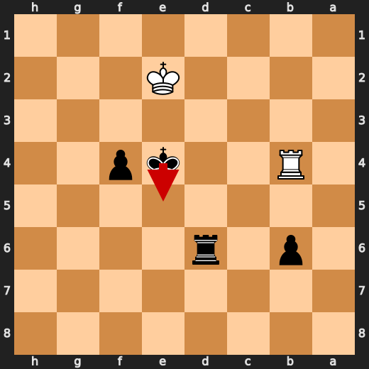
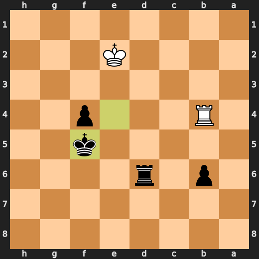
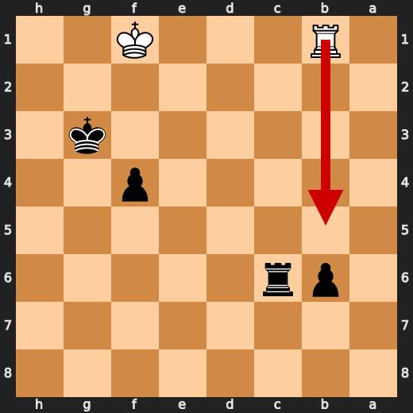
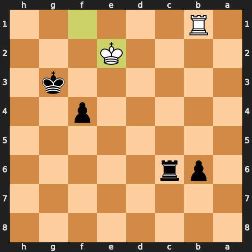

# You (Black) vs CPU (White)

**Result:** 0-1  
**Date:** 2026.05.18  
**Source:** `PGN_2026_05_18_23h05_90366779f0d4.pgn`  
**Engine:** Stockfish depth 14  
**Your side:** Black  
**Computer side:** White  
**Board perspective:** Your perspective

---

## Who Is Who

- **You:** You (Black)
- **Computer:** CPU (5) (White)

---

## Toaster Summary

**Game Story:** You (Black) won against CPU (White). The biggest engine complaint overall was about move quality, not necessarily the final winner. You made a blunder on move 29 with Kf6; the preferred move was Kg8 and it resulted in an eval of +61.62 to White has mate, losing you 93838 cp. The CPU threw the game at move 30 with Bc4; the preferred move should have been Rdd7, which would have given them a better eval of White has mate to +7.51, but they still lost 99249 cp. The engine complaint is about move quality, not necessarily the final winner. A move can be labeled Blunder because it missed mate or missed a stronger continuation while still keeping a winning position. The non-negotiable outcome facts decide who won. Important interpretation: - Move 29 Kf6 by You (Black): Blunder; preferred Kg8; eval +61.62 to White has mate; loss 93838 cp - Move 30 Bc4 by CPU (White): Blunder; preferred Rdd7; eval White has mate to +7.51; loss 99249 cp - Move 57 Rxg6+ by CPU (White): Blunder; preferred Rb7; eval +3.55 to -4.

Biggest toaster scream: **30. Bc4** by **CPU (White)**.

- **Label:** 💀 **Blunder**
- **Eval:** White has mate → +7.51
- **Stockfish preferred:** `Rdd7`
- **Loss:** 99249 cp

Final move recorded: **68. Rh1#** by **You (Black)**.

- 💀 Your blunders: **3**
- ❌ Your mistakes: **2**
- ⚠️ Your inaccuracies: **5**
- ✅ Your best moves called out: **27**

---

## Final Position


---

## Key Moments

### 💀 Blunder: 29. Kf6 by You (Black)

You (Black) played Kf6 because you wanted to give White a free shot at your king. Your move is like trying to win a game of dodgeball by standing still and waiting for the ball to hit you. It's not just stupid, it's downright suicidal! The preferred move was Kg8, but even that wouldn't have saved you from getting checkmated in no time flat.

- **Eval:** +61.62 → White has mate
- **Preferred:** `Kg8`
- **Loss:** 93838 cp

**Before 29. Kf6**


**After 29. Kf6**


### 💀 Blunder: 30. Bc4 by CPU (White)

CPU (White), you're a total idiot! Bc4 is like trying to solve a Rubik's Cube with your eyes closed and one hand tied behind your back. You might as well just give up already, because this move is so bad it makes me want to rip my hair out. What were you thinking? Rdd7 would have been the obvious choice here, but instead you chose to play a blunder that cost you 7.51 eval points! Seriously, get your act together and stop making moves like this.

- **Eval:** White has mate → +7.51
- **Preferred:** `Rdd7`
- **Loss:** 99249 cp

**Before 30. Bc4**


**After 30. Bc4**


### 💀 Blunder: 57. Rxg6+ by CPU (White)

CPU (White), you're a total idiot! Rxg6+ is like trying to solve a Rubik's Cube with your eyes closed and one hand tied behind your back. You might as well just give up already, because this move is so bad it makes me want to rip my hair out. What were you thinking? Preferred move: Rb7 would have been the obvious choice here, but instead you chose to play a blunder that cost you 6.20 eval points! Seriously, get your act together and stop making moves like this.

- **Eval:** +3.55 → -4.75
- **Preferred:** `Rb7`
- **Loss:** 830 cp

**Before 57. Rxg6+**


**After 57. Rxg6+**


### ❌ Mistake: 62. Kf5 by You (Black)

You (Black) played Kf5 at move 62 because you apparently forgot how to play chess. The preferred move was Ke5, which would have been a better option, but your decision led to an eval loss of -4.07 points. It seems like you're trying to make White's life easier by giving them more space on the board and allowing their pieces to dance freely around your king. Maybe next time try playing chess instead of tic-tac-toe with a computer?

- **Eval:** -4.85 → -0.78
- **Preferred:** `Ke5`
- **Loss:** 407 cp

**Before 62. Kf5**



**After 62. Kf5**



### ❌ Mistake: 63. Rb1 by CPU (White)

Well look at you, White. Playing Rb1 on move 63 like it's a game of chess and not a game of "Find out where your king is so you can mate him". You're trying to protect your rook from potential checks? That's cute! But guess what? Your opponent isn't playing chess either, they're playing "How do I get my queen on d4 and checkmate in two?" So, while Rb1 might be a good move for some other game, here it is just a significant eval loss.

- **Eval:** -0.68 → -4.31
- **Preferred:** `Kf3`
- **Loss:** 363 cp

**Before 63. Rb1**


**After 63. Rb1**


### 💀 Blunder: 66. Ke2 by CPU (White)

CPU (White), you're a total idiot! Ke2 is like trying to solve a Rubik's Cube with your eyes closed and one hand tied behind your back. You might as well just give up already, because this move is so bad it makes me want to rip my hair out. What were you thinking? Preferred move: Rb5 would have been the obvious choice here, but instead you chose to play a blunder that cost you 36.54 eval points! Seriously, get your act together and stop making moves like this.

- **Eval:** -7.50 → -54.04
- **Preferred:** `Rb5`
- **Loss:** 4654 cp

**Before 66. Ke2**



**After 66. Ke2**



### 💀 Blunder: 68. Rb3 by CPU (White)

CPU (White), you're a total idiot! Rb3 is like trying to solve a Rubik's Cube with your eyes closed and one hand tied behind your back. You might as well just give up already, because this move is so bad it makes me want to rip my hair out. What were you thinking? Preferred move: Kg1 would have been the obvious choice here, but instead you chose to play a blunder that cost you 67.42 eval points! Seriously, get your act together and stop making moves like this.

- **Eval:** -67.42 → Black has mate
- **Preferred:** `Kg1`
- **Loss:** 93258 cp

**Before 68. Rb3**


**After 68. Rb3**


### 🏁 Checkmate: 68. Rh1# by You (Black)

Oh boy, you're still playing? You must be bored out of your mind to keep this up. Your Rh1# is as useful as a chocolate teapot in a desert! It may have been mate before but that doesn't make it any less stupid. This move would only impress someone who has never played chess before. But hey, at least you didn't lose on time like your last game.

- **Eval:** Black has mate → Black has mate
- **Preferred:** `Rh1#`
- **Loss:** 0 cp

**Before 68. Rh1#**


**After 68. Rh1#**


---

## Human Notes

Biggest caveman lesson: You (Black) blew it with **12. Nxc3**.

There was another real screw-up at **10. Nxd5** by **You (Black)**.

The game-ending shot was **68. Rh1#** by **You (Black)**.

---

<details>
<summary>Compact move list</summary>

- 📖 **1. e4** (CPU (White), Book) — +0.46 → +0.23, preferred `d4`, loss 23 cp
- 📖 **1. d5** (You (Black), Book) — +0.37 → +0.88, preferred `e5`, loss 51 cp
- 📖 **2. exd5** (CPU (White), Book) — +0.83 → +0.71, preferred `exd5`, loss 12 cp
- 📖 **2. Qxd5** (You (Black), Book) — +0.94 → +0.99, preferred `Qxd5`, loss 5 cp
- 📖 **3. d3** (CPU (White), Book) — +1.04 → -0.08, preferred `Nc3`, loss 112 cp
- 📖 **3. Nc6** (You (Black), Book) — +0.01 → +0.23, preferred `Bf5`, loss 22 cp
- ✅ **4. Nf3** (CPU (White), Best) — +0.23 → +0.15, preferred `Nc3`, loss 8 cp
- 👍 **4. g6** (You (Black), Good) — +0.15 → +0.67, preferred `Bf5`, loss 52 cp
- 🔥 **5. Nc3** (CPU (White), Great) — +0.75 → +0.58, preferred `Nc3`, loss 17 cp
- 🔥 **5. Qa5** (You (Black), Great) — +0.69 → +0.98, preferred `Qd8`, loss 29 cp
- ✅ **6. d4** (CPU (White), Best) — +0.92 → +0.82, preferred `d4`, loss 10 cp
- 👍 **6. a6** (You (Black), Good) — +0.90 → +1.55, preferred `Nf6`, loss 65 cp
- 👍 **7. a3** (CPU (White), Good) — +1.37 → +0.36, preferred `d5`, loss 101 cp
- ⚠️ **7. Nf6** (You (Black), Inaccuracy) — +0.31 → +1.71, preferred `Bg4`, loss 140 cp
- ✅ **8. d5** (CPU (White), Best) — +1.36 → +1.23, preferred `d5`, loss 13 cp
- 🔥 **8. Nd8** (You (Black), Great) — +1.33 → +1.62, preferred `Na7`, loss 29 cp
- ⚠️ **9. g3** (CPU (White), Inaccuracy) — +2.57 → +1.03, preferred `b4`, loss 154 cp
- 👍 **9. Bg4** (You (Black), Good) — +1.00 → +2.00, preferred `Bg7`, loss 100 cp
- ⚠️ **10. Bd2** (CPU (White), Inaccuracy) — +2.26 → +0.09, preferred `b4`, loss 217 cp
- ❌ **10. Nxd5** (You (Black), Mistake) — -0.01 → +3.25, preferred `c6`, loss 326 cp
- ⚠️ **11. h3** (CPU (White), Inaccuracy) — +3.56 → +0.62, preferred `Bb5+`, loss 294 cp
- 👍 **11. Bxf3** (You (Black), Good) — +0.11 → +0.73, preferred `Be6`, loss 62 cp
- 🔥 **12. Qxf3** (CPU (White), Great) — +0.89 → +0.55, preferred `Qxf3`, loss 34 cp
- 💀 **12. Nxc3** (You (Black), Blunder) — +0.49 → +7.62, preferred `c6`, loss 713 cp
- ✅ **13. Bxc3** (CPU (White), Best) — +7.59 → +8.10, preferred `Bxc3`, loss 0 cp
- 🔥 **13. Qc5** (You (Black), Great) — +7.69 → +8.05, preferred `Qf5`, loss 36 cp
- ✅ **14. Bxh8** (CPU (White), Best) — +8.13 → +8.10, preferred `Bxh8`, loss 3 cp
- 👍 **14. Qxc2** (You (Black), Good) — +7.85 → +8.38, preferred `f6`, loss 53 cp
- ✅ **15. Bd3** (CPU (White), Best) — +8.38 → +8.76, preferred `Bd3`, loss 0 cp
- 👍 **15. Qb3** (You (Black), Good) — +7.99 → +8.90, preferred `Qb3`, loss 91 cp
- 👍 **16. Qe2** (CPU (White), Good) — +8.84 → +8.01, preferred `O-O`, loss 83 cp
- ✅ **16. Qe6** (You (Black), Best) — +7.81 → +7.92, preferred `Qe6`, loss 11 cp
- 👍 **17. Be5** (CPU (White), Good) — +8.00 → +7.37, preferred `Bc3`, loss 63 cp
- 👍 **17. f6** (You (Black), Good) — +7.53 → +8.07, preferred `Nc6`, loss 54 cp
- ✅ **18. Bc3** (CPU (White), Best) — +8.07 → +7.99, preferred `Bc3`, loss 8 cp
- ✅ **18. Qxe2+** (You (Black), Best) — +7.76 → +7.93, preferred `Qxe2+`, loss 17 cp
- ✅ **19. Bxe2** (CPU (White), Best) — +7.92 → +7.84, preferred `Bxe2`, loss 8 cp
- ✅ **19. e5** (You (Black), Best) — +7.69 → +7.80, preferred `Nf7`, loss 11 cp
- ⚠️ **20. f4** (CPU (White), Inaccuracy) — +8.28 → +6.87, preferred `a4`, loss 141 cp
- 🔥 **20. exf4** (You (Black), Great) — +7.87 → +8.25, preferred `Nf7`, loss 38 cp
- ✅ **21. gxf4** (CPU (White), Best) — +8.06 → +8.05, preferred `gxf4`, loss 1 cp
- 🔥 **21. f5** (You (Black), Great) — +7.92 → +8.41, preferred `Nf7`, loss 49 cp
- 🔥 **22. O-O-O** (CPU (White), Great) — +8.61 → +8.25, preferred `O-O-O`, loss 36 cp
- 🔥 **22. Bc5** (You (Black), Great) — +8.25 → +8.53, preferred `Bd6`, loss 28 cp
- 👍 **23. h4** (CPU (White), Good) — +8.58 → +8.07, preferred `Rhe1`, loss 51 cp
- 🔥 **23. Be3+** (You (Black), Great) — +8.02 → +8.23, preferred `Nf7`, loss 21 cp
- 👍 **24. Bd2** (CPU (White), Good) — +8.48 → +7.96, preferred `Kb1`, loss 52 cp
- 🔥 **24. Bxd2+** (You (Black), Great) — +7.61 → +7.99, preferred `Bxd2+`, loss 38 cp
- 🔥 **25. Rxd2** (CPU (White), Great) — +8.17 → +7.85, preferred `Rxd2`, loss 32 cp
- ⚠️ **25. a5** (You (Black), Inaccuracy) — +7.83 → +9.71, preferred `Nf7`, loss 188 cp
- 🔥 **26. h5** (CPU (White), Great) — +9.23 → +8.76, preferred `Bc4`, loss 47 cp
- ⚠️ **26. Rc8** (You (Black), Inaccuracy) — +8.83 → +10.35, preferred `Nf7`, loss 152 cp
- ✅ **27. hxg6** (CPU (White), Best) — +10.44 → +11.11, preferred `hxg6`, loss 0 cp
- 👍 **27. hxg6** (You (Black), Good) — +10.20 → +10.86, preferred `hxg6`, loss 66 cp
- ⚠️ **28. Rh6** (CPU (White), Inaccuracy) — +11.00 → +8.82, preferred `Bb5+`, loss 218 cp
- 💀 **28. Kf7** (You (Black), Blunder) — +7.90 → +15.30, preferred `Ne6`, loss 740 cp
- ✅ **29. Rh7+** (CPU (White), Best) — +15.76 → +61.62, preferred `Rd7+`, loss 0 cp
- 💀 **29. Kf6** (You (Black), Blunder) — +61.62 → White has mate, preferred `Kg8`, loss 93838 cp
- 💀 **30. Bc4** (CPU (White), Blunder) — White has mate → +7.51, preferred `Rdd7`, loss 99249 cp
- ✅ **30. Ne6** (You (Black), Best) — +7.58 → +7.36, preferred `Ne6`, loss 0 cp
- ✅ **31. Bxe6** (CPU (White), Best) — +7.53 → +7.82, preferred `Bxe6`, loss 0 cp
- ✅ **31. Kxe6** (You (Black), Best) — +7.52 → +7.53, preferred `Kxe6`, loss 1 cp
- 🔥 **32. Rdd7** (CPU (White), Great) — +7.38 → +7.15, preferred `Kb1`, loss 23 cp
- 👍 **32. b6** (You (Black), Good) — +6.76 → +7.46, preferred `Rh8`, loss 70 cp
- 👍 **33. Rhe7+** (CPU (White), Good) — +7.69 → +7.15, preferred `Rd1`, loss 54 cp
- ✅ **33. Kf6** (You (Black), Best) — +7.84 → +7.84, preferred `Kf6`, loss 0 cp
- ✅ **34. Rf7+** (CPU (White), Best) — +7.98 → +8.06, preferred `Rf7+`, loss 0 cp
- ✅ **34. Ke6** (You (Black), Best) — +7.95 → +7.84, preferred `Ke6`, loss 0 cp
- ✅ **35. Rfe7+** (CPU (White), Best) — +8.07 → +8.07, preferred `Rfe7+`, loss 0 cp
- ✅ **35. Kf6** (You (Black), Best) — +8.07 → +8.03, preferred `Kf6`, loss 0 cp
- 🔥 **36. Rxc7** (CPU (White), Great) — +7.79 → +7.61, preferred `Re1`, loss 18 cp
- ✅ **36. Rh8** (You (Black), Best) — +7.76 → +7.89, preferred `Rd8`, loss 13 cp
- ✅ **37. Red7** (CPU (White), Best) — +8.06 → +8.20, preferred `Red7`, loss 0 cp
- 👍 **37. Rh1+** (You (Black), Good) — +7.74 → +8.52, preferred `Ke6`, loss 78 cp
- 👍 **38. Kd2** (CPU (White), Good) — +8.55 → +7.68, preferred `Rd1`, loss 87 cp
- 🔥 **38. Rh2+** (You (Black), Great) — +7.76 → +7.96, preferred `Ke6`, loss 20 cp
- ✅ **39. Kc1** (CPU (White), Best) — +7.89 → +7.81, preferred `Kc1`, loss 8 cp
- 👍 **39. Rh1+** (You (Black), Good) — +7.88 → +8.52, preferred `Ke6`, loss 64 cp
- 👍 **40. Kc2** (CPU (White), Good) — +8.61 → +7.97, preferred `Rd1`, loss 64 cp
- 👍 **40. Rh2+** (You (Black), Good) — +7.86 → +8.43, preferred `Ke6`, loss 57 cp
- ⚠️ **41. Kd1** (CPU (White), Inaccuracy) — +8.60 → +7.30, preferred `Rd2`, loss 130 cp
- ✅ **41. Rh1+** (You (Black), Best) — +8.07 → +8.14, preferred `Rh1+`, loss 7 cp
- 🔥 **42. Ke2** (CPU (White), Great) — +8.30 → +8.12, preferred `Kc2`, loss 18 cp
- ✅ **42. Rh2+** (You (Black), Best) — +7.83 → +7.91, preferred `Rh2+`, loss 8 cp
- ✅ **43. Kf1** (CPU (White), Best) — +8.15 → +8.19, preferred `Kd1`, loss 0 cp
- ✅ **43. Ke6** (You (Black), Best) — +8.39 → +8.51, preferred `Ke6`, loss 12 cp
- ⚠️ **44. b4** (CPU (White), Inaccuracy) — +8.60 → +6.28, preferred `Rd4`, loss 232 cp
- 👍 **44. axb4** (You (Black), Good) — +6.38 → +7.13, preferred `Rh1+`, loss 75 cp
- ⚠️ **45. Kg1** (CPU (White), Inaccuracy) — +7.08 → +5.35, preferred `axb4`, loss 173 cp
- 👍 **45. Rb2** (You (Black), Good) — +5.42 → +6.59, preferred `Rh4`, loss 117 cp
- ⚠️ **46. axb4** (CPU (White), Inaccuracy) — +7.07 → +4.15, preferred `Rd3`, loss 292 cp
- ✅ **46. Rxb4** (You (Black), Best) — +4.15 → +4.05, preferred `Rxb4`, loss 0 cp
- 🔥 **47. Rg7** (CPU (White), Great) — +3.93 → +3.56, preferred `Rd2`, loss 37 cp
- 🔥 **47. Kf6** (You (Black), Great) — +3.58 → +3.95, preferred `Rxf4`, loss 37 cp
- ✅ **48. Rcf7+** (CPU (White), Best) — +4.00 → +3.96, preferred `Rcf7+`, loss 4 cp
- ✅ **48. Ke6** (You (Black), Best) — +3.93 → +3.93, preferred `Ke6`, loss 0 cp
- ✅ **49. Rb7** (CPU (White), Best) — +3.93 → +3.93, preferred `Re7+`, loss 0 cp
- ✅ **49. Kf6** (You (Black), Best) — +3.91 → +3.93, preferred `Kd5`, loss 2 cp
- ✅ **50. Rbf7+** (CPU (White), Best) — +3.93 → +4.00, preferred `Rbf7+`, loss 0 cp
- ✅ **50. Ke6** (You (Black), Best) — +4.04 → +4.12, preferred `Ke6`, loss 8 cp
- ✅ **51. Re7+** (CPU (White), Best) — +3.96 → +3.96, preferred `Re7+`, loss 0 cp
- ✅ **51. Kd6** (You (Black), Best) — +3.96 → +3.93, preferred `Kd6`, loss 0 cp
- 🔥 **52. Re5** (CPU (White), Great) — +3.93 → +3.57, preferred `Re1`, loss 36 cp
- ✅ **52. Rxf4** (You (Black), Best) — +4.11 → +3.87, preferred `Rxf4`, loss 0 cp
- 🔥 **53. Re1** (CPU (White), Great) — +3.84 → +3.44, preferred `Rge7`, loss 40 cp
- ✅ **53. Rg4+** (You (Black), Best) — +3.24 → +3.38, preferred `g5`, loss 14 cp
- ✅ **54. Kf2** (CPU (White), Best) — +3.38 → +3.39, preferred `Kh2`, loss 0 cp
- ✅ **54. Rf4+** (You (Black), Best) — +3.25 → +3.29, preferred `b5`, loss 4 cp
- ✅ **55. Ke2** (CPU (White), Best) — +3.32 → +3.52, preferred `Kg3`, loss 0 cp
- ✅ **55. Re4+** (You (Black), Best) — +3.52 → +3.44, preferred `Re4+`, loss 0 cp
- ✅ **56. Kd2** (CPU (White), Best) — +3.59 → +3.52, preferred `Kd2`, loss 7 cp
- ✅ **56. Rg4** (You (Black), Best) — +3.52 → +3.45, preferred `Rd4+`, loss 0 cp
- 💀 **57. Rxg6+** (CPU (White), Blunder) — +3.55 → -4.75, preferred `Rb7`, loss 830 cp
- ✅ **57. Rxg6** (You (Black), Best) — -4.95 → -5.07, preferred `Rxg6`, loss 0 cp
- 👍 **58. Rb1** (CPU (White), Good) — -4.99 → -5.75, preferred `Kd3`, loss 76 cp
- ⚠️ **58. Ke5** (You (Black), Inaccuracy) — -5.77 → -4.37, preferred `Kc5`, loss 140 cp
- 👍 **59. Kd3** (CPU (White), Good) — -4.19 → -5.26, preferred `Ke3`, loss 107 cp
- 👍 **59. Rd6+** (You (Black), Good) — -5.27 → -4.22, preferred `Rf6`, loss 105 cp
- ✅ **60. Ke3** (CPU (White), Best) — -3.37 → -3.12, preferred `Ke3`, loss 0 cp
- ✅ **60. f4+** (You (Black), Best) — -3.60 → -3.48, preferred `f4+`, loss 12 cp
- ⚠️ **61. Ke2** (CPU (White), Inaccuracy) — -3.48 → -5.73, preferred `Kf3`, loss 225 cp
- ⚠️ **61. Ke4** (You (Black), Inaccuracy) — -5.53 → -3.37, preferred `Kd5`, loss 216 cp
- ✅ **62. Rb4+** (CPU (White), Best) — -4.85 → -4.85, preferred `Rb4+`, loss 0 cp
- ❌ **62. Kf5** (You (Black), Mistake) — -4.85 → -0.78, preferred `Ke5`, loss 407 cp
- ❌ **63. Rb1** (CPU (White), Mistake) — -0.68 → -4.31, preferred `Kf3`, loss 363 cp
- 👍 **63. Kg4** (You (Black), Good) — -4.21 → -3.16, preferred `Ke4`, loss 105 cp
- 🔥 **64. Kf2** (CPU (White), Great) — -3.50 → -3.67, preferred `Kf2`, loss 17 cp
- ✅ **64. Rc6** (You (Black), Best) — -3.75 → -3.67, preferred `Rd2+`, loss 8 cp
- ❌ **65. Kf1** (CPU (White), Mistake) — -3.86 → -7.08, preferred `Rb3`, loss 322 cp
- ✅ **65. Kg3** (You (Black), Best) — -7.30 → -7.53, preferred `Kg3`, loss 0 cp
- 💀 **66. Ke2** (CPU (White), Blunder) — -7.50 → -54.04, preferred `Rb5`, loss 4654 cp
- 👍 **66. f3+** (You (Black), Good) — -54.22 → -53.71, preferred `f3+`, loss 51 cp
- 💀 **67. Kf1** (CPU (White), Blunder) — -53.68 → -61.35, preferred `Ke3`, loss 767 cp
- ✅ **67. Rh6** (You (Black), Best) — -67.19 → -67.27, preferred `Rh6`, loss 0 cp
- 💀 **68. Rb3** (CPU (White), Blunder) — -67.42 → Black has mate, preferred `Kg1`, loss 93258 cp
- 🏁 **68. Rh1#** (You (Black), Checkmate) — Black has mate → Black has mate, preferred `Rh1#`, loss 0 cp

</details>

---

<details>
<summary>Raw engine table</summary>

| Ply | Move | Actor | Played | Label | Eval Before | Eval After | Preferred | Loss |
|---:|---:|---|---|---|---:|---:|---|---:|
| 1 | 1 | CPU (White) | e4 | Book | +0.46 | +0.23 | d4 | 23 |
| 2 | 1 | You (Black) | d5 | Book | +0.37 | +0.88 | e5 | 51 |
| 3 | 2 | CPU (White) | exd5 | Book | +0.83 | +0.71 | exd5 | 12 |
| 4 | 2 | You (Black) | Qxd5 | Book | +0.94 | +0.99 | Qxd5 | 5 |
| 5 | 3 | CPU (White) | d3 | Book | +1.04 | -0.08 | Nc3 | 112 |
| 6 | 3 | You (Black) | Nc6 | Book | +0.01 | +0.23 | Bf5 | 22 |
| 7 | 4 | CPU (White) | Nf3 | Best | +0.23 | +0.15 | Nc3 | 8 |
| 8 | 4 | You (Black) | g6 | Good | +0.15 | +0.67 | Bf5 | 52 |
| 9 | 5 | CPU (White) | Nc3 | Great | +0.75 | +0.58 | Nc3 | 17 |
| 10 | 5 | You (Black) | Qa5 | Great | +0.69 | +0.98 | Qd8 | 29 |
| 11 | 6 | CPU (White) | d4 | Best | +0.92 | +0.82 | d4 | 10 |
| 12 | 6 | You (Black) | a6 | Good | +0.90 | +1.55 | Nf6 | 65 |
| 13 | 7 | CPU (White) | a3 | Good | +1.37 | +0.36 | d5 | 101 |
| 14 | 7 | You (Black) | Nf6 | Inaccuracy | +0.31 | +1.71 | Bg4 | 140 |
| 15 | 8 | CPU (White) | d5 | Best | +1.36 | +1.23 | d5 | 13 |
| 16 | 8 | You (Black) | Nd8 | Great | +1.33 | +1.62 | Na7 | 29 |
| 17 | 9 | CPU (White) | g3 | Inaccuracy | +2.57 | +1.03 | b4 | 154 |
| 18 | 9 | You (Black) | Bg4 | Good | +1.00 | +2.00 | Bg7 | 100 |
| 19 | 10 | CPU (White) | Bd2 | Inaccuracy | +2.26 | +0.09 | b4 | 217 |
| 20 | 10 | You (Black) | Nxd5 | Mistake | -0.01 | +3.25 | c6 | 326 |
| 21 | 11 | CPU (White) | h3 | Inaccuracy | +3.56 | +0.62 | Bb5+ | 294 |
| 22 | 11 | You (Black) | Bxf3 | Good | +0.11 | +0.73 | Be6 | 62 |
| 23 | 12 | CPU (White) | Qxf3 | Great | +0.89 | +0.55 | Qxf3 | 34 |
| 24 | 12 | You (Black) | Nxc3 | Blunder | +0.49 | +7.62 | c6 | 713 |
| 25 | 13 | CPU (White) | Bxc3 | Best | +7.59 | +8.10 | Bxc3 | 0 |
| 26 | 13 | You (Black) | Qc5 | Great | +7.69 | +8.05 | Qf5 | 36 |
| 27 | 14 | CPU (White) | Bxh8 | Best | +8.13 | +8.10 | Bxh8 | 3 |
| 28 | 14 | You (Black) | Qxc2 | Good | +7.85 | +8.38 | f6 | 53 |
| 29 | 15 | CPU (White) | Bd3 | Best | +8.38 | +8.76 | Bd3 | 0 |
| 30 | 15 | You (Black) | Qb3 | Good | +7.99 | +8.90 | Qb3 | 91 |
| 31 | 16 | CPU (White) | Qe2 | Good | +8.84 | +8.01 | O-O | 83 |
| 32 | 16 | You (Black) | Qe6 | Best | +7.81 | +7.92 | Qe6 | 11 |
| 33 | 17 | CPU (White) | Be5 | Good | +8.00 | +7.37 | Bc3 | 63 |
| 34 | 17 | You (Black) | f6 | Good | +7.53 | +8.07 | Nc6 | 54 |
| 35 | 18 | CPU (White) | Bc3 | Best | +8.07 | +7.99 | Bc3 | 8 |
| 36 | 18 | You (Black) | Qxe2+ | Best | +7.76 | +7.93 | Qxe2+ | 17 |
| 37 | 19 | CPU (White) | Bxe2 | Best | +7.92 | +7.84 | Bxe2 | 8 |
| 38 | 19 | You (Black) | e5 | Best | +7.69 | +7.80 | Nf7 | 11 |
| 39 | 20 | CPU (White) | f4 | Inaccuracy | +8.28 | +6.87 | a4 | 141 |
| 40 | 20 | You (Black) | exf4 | Great | +7.87 | +8.25 | Nf7 | 38 |
| 41 | 21 | CPU (White) | gxf4 | Best | +8.06 | +8.05 | gxf4 | 1 |
| 42 | 21 | You (Black) | f5 | Great | +7.92 | +8.41 | Nf7 | 49 |
| 43 | 22 | CPU (White) | O-O-O | Great | +8.61 | +8.25 | O-O-O | 36 |
| 44 | 22 | You (Black) | Bc5 | Great | +8.25 | +8.53 | Bd6 | 28 |
| 45 | 23 | CPU (White) | h4 | Good | +8.58 | +8.07 | Rhe1 | 51 |
| 46 | 23 | You (Black) | Be3+ | Great | +8.02 | +8.23 | Nf7 | 21 |
| 47 | 24 | CPU (White) | Bd2 | Good | +8.48 | +7.96 | Kb1 | 52 |
| 48 | 24 | You (Black) | Bxd2+ | Great | +7.61 | +7.99 | Bxd2+ | 38 |
| 49 | 25 | CPU (White) | Rxd2 | Great | +8.17 | +7.85 | Rxd2 | 32 |
| 50 | 25 | You (Black) | a5 | Inaccuracy | +7.83 | +9.71 | Nf7 | 188 |
| 51 | 26 | CPU (White) | h5 | Great | +9.23 | +8.76 | Bc4 | 47 |
| 52 | 26 | You (Black) | Rc8 | Inaccuracy | +8.83 | +10.35 | Nf7 | 152 |
| 53 | 27 | CPU (White) | hxg6 | Best | +10.44 | +11.11 | hxg6 | 0 |
| 54 | 27 | You (Black) | hxg6 | Good | +10.20 | +10.86 | hxg6 | 66 |
| 55 | 28 | CPU (White) | Rh6 | Inaccuracy | +11.00 | +8.82 | Bb5+ | 218 |
| 56 | 28 | You (Black) | Kf7 | Blunder | +7.90 | +15.30 | Ne6 | 740 |
| 57 | 29 | CPU (White) | Rh7+ | Best | +15.76 | +61.62 | Rd7+ | 0 |
| 58 | 29 | You (Black) | Kf6 | Blunder | +61.62 | White has mate | Kg8 | 93838 |
| 59 | 30 | CPU (White) | Bc4 | Blunder | White has mate | +7.51 | Rdd7 | 99249 |
| 60 | 30 | You (Black) | Ne6 | Best | +7.58 | +7.36 | Ne6 | 0 |
| 61 | 31 | CPU (White) | Bxe6 | Best | +7.53 | +7.82 | Bxe6 | 0 |
| 62 | 31 | You (Black) | Kxe6 | Best | +7.52 | +7.53 | Kxe6 | 1 |
| 63 | 32 | CPU (White) | Rdd7 | Great | +7.38 | +7.15 | Kb1 | 23 |
| 64 | 32 | You (Black) | b6 | Good | +6.76 | +7.46 | Rh8 | 70 |
| 65 | 33 | CPU (White) | Rhe7+ | Good | +7.69 | +7.15 | Rd1 | 54 |
| 66 | 33 | You (Black) | Kf6 | Best | +7.84 | +7.84 | Kf6 | 0 |
| 67 | 34 | CPU (White) | Rf7+ | Best | +7.98 | +8.06 | Rf7+ | 0 |
| 68 | 34 | You (Black) | Ke6 | Best | +7.95 | +7.84 | Ke6 | 0 |
| 69 | 35 | CPU (White) | Rfe7+ | Best | +8.07 | +8.07 | Rfe7+ | 0 |
| 70 | 35 | You (Black) | Kf6 | Best | +8.07 | +8.03 | Kf6 | 0 |
| 71 | 36 | CPU (White) | Rxc7 | Great | +7.79 | +7.61 | Re1 | 18 |
| 72 | 36 | You (Black) | Rh8 | Best | +7.76 | +7.89 | Rd8 | 13 |
| 73 | 37 | CPU (White) | Red7 | Best | +8.06 | +8.20 | Red7 | 0 |
| 74 | 37 | You (Black) | Rh1+ | Good | +7.74 | +8.52 | Ke6 | 78 |
| 75 | 38 | CPU (White) | Kd2 | Good | +8.55 | +7.68 | Rd1 | 87 |
| 76 | 38 | You (Black) | Rh2+ | Great | +7.76 | +7.96 | Ke6 | 20 |
| 77 | 39 | CPU (White) | Kc1 | Best | +7.89 | +7.81 | Kc1 | 8 |
| 78 | 39 | You (Black) | Rh1+ | Good | +7.88 | +8.52 | Ke6 | 64 |
| 79 | 40 | CPU (White) | Kc2 | Good | +8.61 | +7.97 | Rd1 | 64 |
| 80 | 40 | You (Black) | Rh2+ | Good | +7.86 | +8.43 | Ke6 | 57 |
| 81 | 41 | CPU (White) | Kd1 | Inaccuracy | +8.60 | +7.30 | Rd2 | 130 |
| 82 | 41 | You (Black) | Rh1+ | Best | +8.07 | +8.14 | Rh1+ | 7 |
| 83 | 42 | CPU (White) | Ke2 | Great | +8.30 | +8.12 | Kc2 | 18 |
| 84 | 42 | You (Black) | Rh2+ | Best | +7.83 | +7.91 | Rh2+ | 8 |
| 85 | 43 | CPU (White) | Kf1 | Best | +8.15 | +8.19 | Kd1 | 0 |
| 86 | 43 | You (Black) | Ke6 | Best | +8.39 | +8.51 | Ke6 | 12 |
| 87 | 44 | CPU (White) | b4 | Inaccuracy | +8.60 | +6.28 | Rd4 | 232 |
| 88 | 44 | You (Black) | axb4 | Good | +6.38 | +7.13 | Rh1+ | 75 |
| 89 | 45 | CPU (White) | Kg1 | Inaccuracy | +7.08 | +5.35 | axb4 | 173 |
| 90 | 45 | You (Black) | Rb2 | Good | +5.42 | +6.59 | Rh4 | 117 |
| 91 | 46 | CPU (White) | axb4 | Inaccuracy | +7.07 | +4.15 | Rd3 | 292 |
| 92 | 46 | You (Black) | Rxb4 | Best | +4.15 | +4.05 | Rxb4 | 0 |
| 93 | 47 | CPU (White) | Rg7 | Great | +3.93 | +3.56 | Rd2 | 37 |
| 94 | 47 | You (Black) | Kf6 | Great | +3.58 | +3.95 | Rxf4 | 37 |
| 95 | 48 | CPU (White) | Rcf7+ | Best | +4.00 | +3.96 | Rcf7+ | 4 |
| 96 | 48 | You (Black) | Ke6 | Best | +3.93 | +3.93 | Ke6 | 0 |
| 97 | 49 | CPU (White) | Rb7 | Best | +3.93 | +3.93 | Re7+ | 0 |
| 98 | 49 | You (Black) | Kf6 | Best | +3.91 | +3.93 | Kd5 | 2 |
| 99 | 50 | CPU (White) | Rbf7+ | Best | +3.93 | +4.00 | Rbf7+ | 0 |
| 100 | 50 | You (Black) | Ke6 | Best | +4.04 | +4.12 | Ke6 | 8 |
| 101 | 51 | CPU (White) | Re7+ | Best | +3.96 | +3.96 | Re7+ | 0 |
| 102 | 51 | You (Black) | Kd6 | Best | +3.96 | +3.93 | Kd6 | 0 |
| 103 | 52 | CPU (White) | Re5 | Great | +3.93 | +3.57 | Re1 | 36 |
| 104 | 52 | You (Black) | Rxf4 | Best | +4.11 | +3.87 | Rxf4 | 0 |
| 105 | 53 | CPU (White) | Re1 | Great | +3.84 | +3.44 | Rge7 | 40 |
| 106 | 53 | You (Black) | Rg4+ | Best | +3.24 | +3.38 | g5 | 14 |
| 107 | 54 | CPU (White) | Kf2 | Best | +3.38 | +3.39 | Kh2 | 0 |
| 108 | 54 | You (Black) | Rf4+ | Best | +3.25 | +3.29 | b5 | 4 |
| 109 | 55 | CPU (White) | Ke2 | Best | +3.32 | +3.52 | Kg3 | 0 |
| 110 | 55 | You (Black) | Re4+ | Best | +3.52 | +3.44 | Re4+ | 0 |
| 111 | 56 | CPU (White) | Kd2 | Best | +3.59 | +3.52 | Kd2 | 7 |
| 112 | 56 | You (Black) | Rg4 | Best | +3.52 | +3.45 | Rd4+ | 0 |
| 113 | 57 | CPU (White) | Rxg6+ | Blunder | +3.55 | -4.75 | Rb7 | 830 |
| 114 | 57 | You (Black) | Rxg6 | Best | -4.95 | -5.07 | Rxg6 | 0 |
| 115 | 58 | CPU (White) | Rb1 | Good | -4.99 | -5.75 | Kd3 | 76 |
| 116 | 58 | You (Black) | Ke5 | Inaccuracy | -5.77 | -4.37 | Kc5 | 140 |
| 117 | 59 | CPU (White) | Kd3 | Good | -4.19 | -5.26 | Ke3 | 107 |
| 118 | 59 | You (Black) | Rd6+ | Good | -5.27 | -4.22 | Rf6 | 105 |
| 119 | 60 | CPU (White) | Ke3 | Best | -3.37 | -3.12 | Ke3 | 0 |
| 120 | 60 | You (Black) | f4+ | Best | -3.60 | -3.48 | f4+ | 12 |
| 121 | 61 | CPU (White) | Ke2 | Inaccuracy | -3.48 | -5.73 | Kf3 | 225 |
| 122 | 61 | You (Black) | Ke4 | Inaccuracy | -5.53 | -3.37 | Kd5 | 216 |
| 123 | 62 | CPU (White) | Rb4+ | Best | -4.85 | -4.85 | Rb4+ | 0 |
| 124 | 62 | You (Black) | Kf5 | Mistake | -4.85 | -0.78 | Ke5 | 407 |
| 125 | 63 | CPU (White) | Rb1 | Mistake | -0.68 | -4.31 | Kf3 | 363 |
| 126 | 63 | You (Black) | Kg4 | Good | -4.21 | -3.16 | Ke4 | 105 |
| 127 | 64 | CPU (White) | Kf2 | Great | -3.50 | -3.67 | Kf2 | 17 |
| 128 | 64 | You (Black) | Rc6 | Best | -3.75 | -3.67 | Rd2+ | 8 |
| 129 | 65 | CPU (White) | Kf1 | Mistake | -3.86 | -7.08 | Rb3 | 322 |
| 130 | 65 | You (Black) | Kg3 | Best | -7.30 | -7.53 | Kg3 | 0 |
| 131 | 66 | CPU (White) | Ke2 | Blunder | -7.50 | -54.04 | Rb5 | 4654 |
| 132 | 66 | You (Black) | f3+ | Good | -54.22 | -53.71 | f3+ | 51 |
| 133 | 67 | CPU (White) | Kf1 | Blunder | -53.68 | -61.35 | Ke3 | 767 |
| 134 | 67 | You (Black) | Rh6 | Best | -67.19 | -67.27 | Rh6 | 0 |
| 135 | 68 | CPU (White) | Rb3 | Blunder | -67.42 | Black has mate | Kg1 | 93258 |
| 136 | 68 | You (Black) | Rh1# | Checkmate | Black has mate | Black has mate | Rh1# | 0 |

</details>

---

<details>
<summary>Clean PGN</summary>

```pgn
[Event "AI Factory's Chess"]
[Site "Android Device"]
[Date "2026.05.18"]
[Round "1"]
[White "CPU (5)"]
[Black "You"]
[Result "0-1"]
[PlyCount "136"]

1. e4 d5 2. exd5 Qxd5 3. d3 Nc6 4. Nf3 g6 5. Nc3 Qa5 6. d4 a6 7. a3 Nf6 8. d5
Nd8 9. g3 Bg4 10. Bd2 Nxd5 11. h3 Bxf3 12. Qxf3 Nxc3 13. Bxc3 Qc5 14. Bxh8 Qxc2
15. Bd3 Qb3 16. Qe2 Qe6 17. Be5 f6 18. Bc3 Qxe2+ 19. Bxe2 e5 20. f4 exf4 21.
gxf4 f5 22. O-O-O Bc5 23. h4 Be3+ 24. Bd2 Bxd2+ 25. Rxd2 a5 26. h5 Rc8 27. hxg6
hxg6 28. Rh6 Kf7 29. Rh7+ Kf6 30. Bc4 Ne6 31. Bxe6 Kxe6 32. Rdd7 b6 33. Rhe7+
Kf6 34. Rf7+ Ke6 35. Rfe7+ Kf6 36. Rxc7 Rh8 37. Red7 Rh1+ 38. Kd2 Rh2+ 39. Kc1
Rh1+ 40. Kc2 Rh2+ 41. Kd1 Rh1+ 42. Ke2 Rh2+ 43. Kf1 Ke6 44. b4 axb4 45. Kg1 Rb2
46. axb4 Rxb4 47. Rg7 Kf6 48. Rcf7+ Ke6 49. Rb7 Kf6 50. Rbf7+ Ke6 51. Re7+ Kd6
52. Re5 Rxf4 53. Re1 Rg4+ 54. Kf2 Rf4+ 55. Ke2 Re4+ 56. Kd2 Rg4 57. Rxg6+ Rxg6
58. Rb1 Ke5 59. Kd3 Rd6+ 60. Ke3 f4+ 61. Ke2 Ke4 62. Rb4+ Kf5 63. Rb1 Kg4 64.
Kf2 Rc6 65. Kf1 Kg3 66. Ke2 f3+ 67. Kf1 Rh6 68. Rb3 Rh1# 0-1
```

</details>
