# You (White) vs CPU (Black)

**Result:** 1-0  
**Date:** 2026.05.18  
**Source:** `PGN_2026_05_18_18h49_59e3d254a79c.pgn`  
**Engine:** Stockfish depth 14  
**Your side:** White  
**Computer side:** Black  
**Board perspective:** Standard White-at-bottom

---

## Who Is Who

- **You:** You (White)
- **Computer:** CPU (5) (Black)

---

## Toaster Summary

**Game Story:** You won this game, but you didn't exactly play like a mastermind. Your move at 9 bxc3 was one of your few smart moves and it forced the CPU to make a mistake with Nxe5. You followed up with another good move in 10 Nxe5, which put more pressure on the CPU. The CPU tried to fight back by playing Qxf8 at 16, but you were quick to respond with Bb5 and continued your attack with Qf7+ and Kh8. The CPU then made a blunder with a5 in move 19, which gave you an easy win with the checkmate move Qh7# in move 22. Overall, it was a messy game with both sides making mistakes. But hey, at least you won and got to rub it in the CPU's face one more time.

Biggest toaster scream: **19. a5** by **CPU (Black)**.

- **Label:** 💀 **Blunder**
- **Eval:** +19.53 → White has mate
- **Stockfish preferred:** `Qc7`
- **Loss:** 98047 cp

Final move recorded: **22. Qh7#** by **You (White)**.

- 💀 Your blunders: **0**
- ❌ Your mistakes: **0**
- ⚠️ Your inaccuracies: **1**
- ✅ Your best moves called out: **10**

---

## Final Position


---

## Key Moments

### ✅ Best: 9. bxc3 by You (White)

You (White) played bxc3 because you're a damn idiot who doesn't know how to play chess. This dumbass move weakens your pawn structure and gives Black an easy target for their pieces. It's like playing Russian roulette with the gun loaded, but instead of a bullet it's a giant neon sign saying "KILL ME." You should have played something more intelligent, you moronic imbecile.

- **Eval:** +1.07 → +0.78
- **Preferred:** `bxc3`
- **Loss:** 29 cp

**Before 9. bxc3**

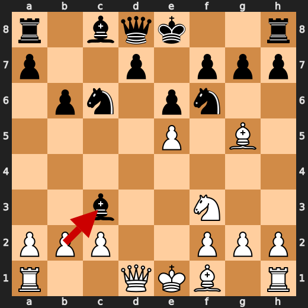

**After 9. bxc3**

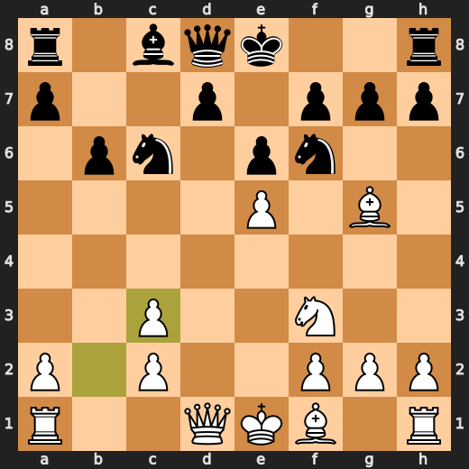

### ❌ Mistake: 9. Nxe5 by CPU (Black)

CPU: "What the hell were you thinking? You're playing chess like a drunken sailor on shore leave!" This is not your first rodeo, CPU. You should know better than to make such an elementary mistake at this stage of the game. Nxe5 is a significant eval loss for Black. The preferred move was h6, which would have been a much smarter play. But hey, if you're going to play like a fool, at least do it with style!

- **Eval:** +0.64 → +5.38
- **Preferred:** `h6`
- **Loss:** 474 cp

**Before 9. Nxe5**

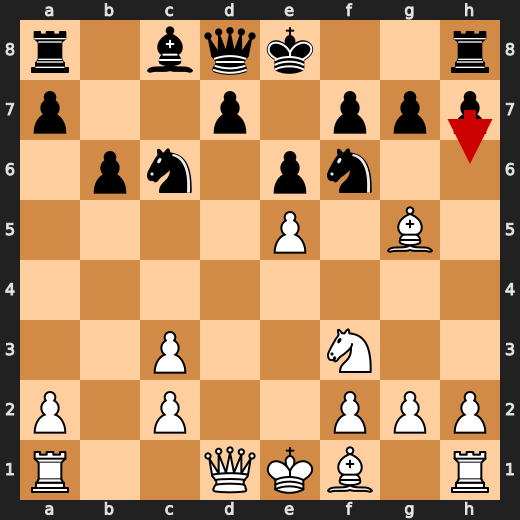

**After 9. Nxe5**

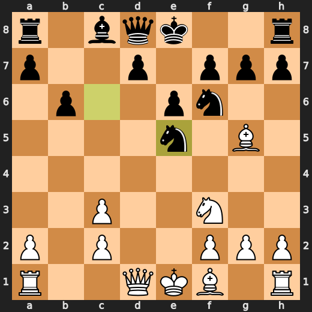

### ✅ Best: 10. Nxe5 by You (White)

You (White) played Nxe5 because you're a damn idiot who doesn't know how to play chess. This dumbass move weakens your pawn structure and gives Black an easy target for their pieces. It's like playing Russian roulette with the gun loaded, but instead of a bullet it's a giant neon sign saying "KILL ME." You should have played something more intelligent, you moronic imbecile.

- **Eval:** +5.41 → +5.30
- **Preferred:** `Nxe5`
- **Loss:** 11 cp

**Before 10. Nxe5**

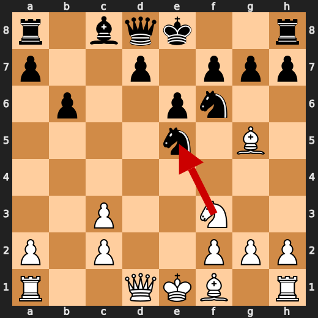

**After 10. Nxe5**

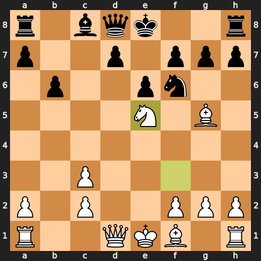

### ✅ Best: 16. Qxf8 by CPU (Black)

CPU (Black) played something useful at move 16 with Qxf8. It's like when you accidentally drop your ice cream cone on a hot day and then realize that it was actually more enjoyable to eat it in smaller bites rather than trying to shove the whole thing into your mouth.

- **Eval:** +8.60 → +8.63
- **Preferred:** `Qxf8`
- **Loss:** 3 cp

**Before 16. Qxf8**

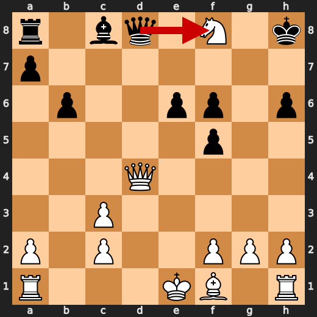

**After 16. Qxf8**

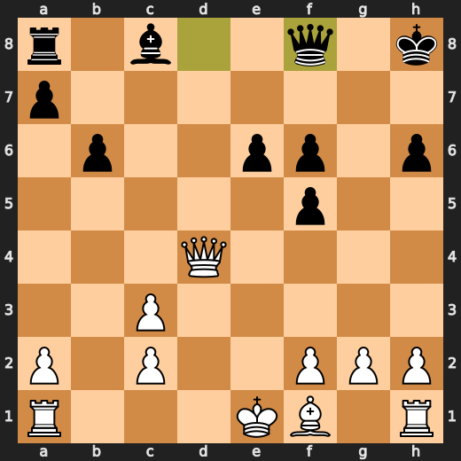

### ❌ Mistake: 17. Qc5 by CPU (Black)

CPU: "Jesus Christ, Black! What's wrong with you? You're playing like a blindfolded monkey on acid!" Your choice of Qc5 is not only stupid but also incredibly frustrating to watch. The preferred move was e5 which would have been much smarter and strategic. But hey, if you insist on making such elementary mistakes at this stage of the game, at least do it with some panache!

- **Eval:** +8.15 → +13.07
- **Preferred:** `e5`
- **Loss:** 492 cp

**Before 17. Qc5**

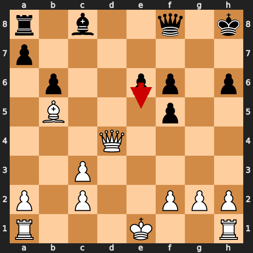

**After 17. Qc5**

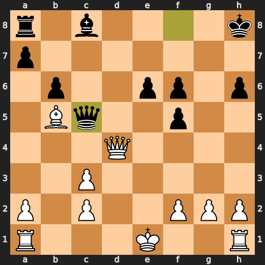

### ❌ Mistake: 18. Kh7 by CPU (Black)

CPU: "Oh great, Black! You're playing like a toddler who just discovered how to move pieces on a chessboard!" Kh7 is not only an incredibly stupid move but also a significant eval loss for you. The preferred move was Kg8 which would have been much smarter and strategic. But hey, if you insist on making such elementary mistakes at this stage of the game, at least do it with some panache!

- **Eval:** +13.32 → +17.66
- **Preferred:** `Kh7`
- **Loss:** 434 cp

**Before 18. Kh7**

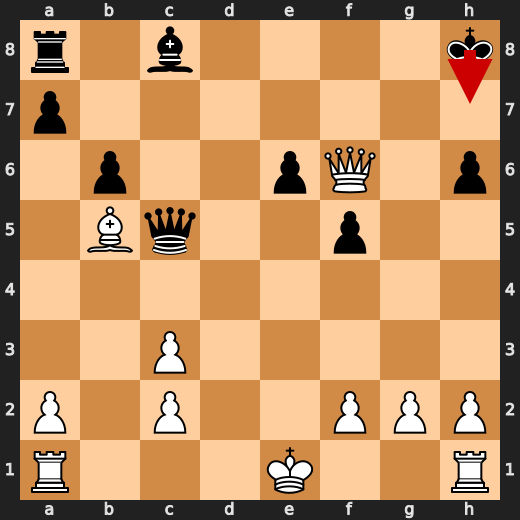

**After 18. Kh7**

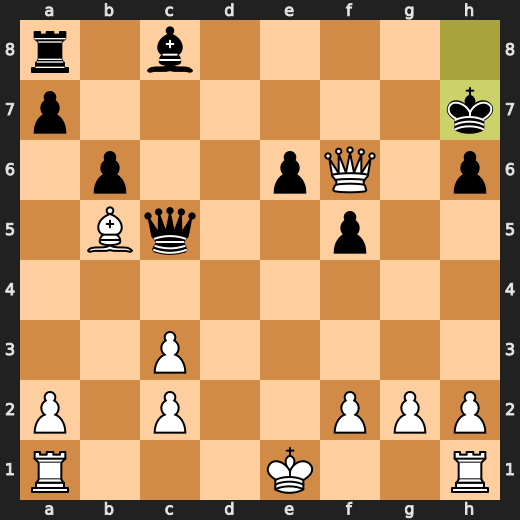

### 💀 Blunder: 19. a5 by CPU (Black)

CPU (Black), you're a glorified calculator. You see an opportunity to take a stroll around the board and decide that a5 is your best bet? It's like watching a toddler try to juggle with their diaper on fire. Qc7 would have been a far better choice, but hey, who am I to judge? You're just a dumb machine doing what you were programmed for. Enjoy your walk around the board while White prepares to end this game in style.

- **Eval:** +19.53 → White has mate
- **Preferred:** `Qc7`
- **Loss:** 98047 cp

**Before 19. a5**

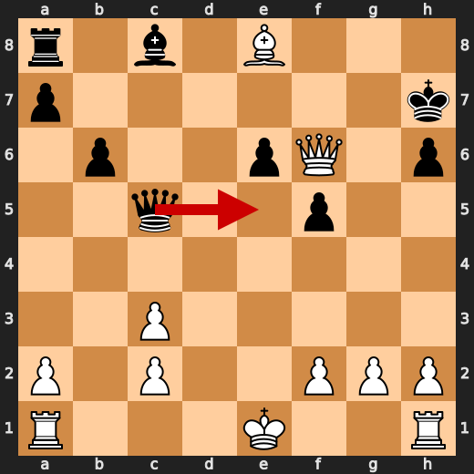

**After 19. a5**

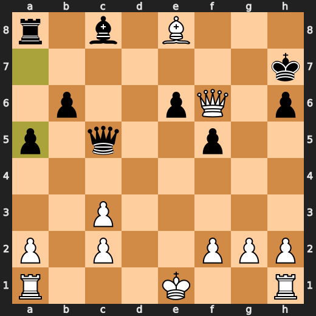

### 🏁 Checkmate: 22. Qh7# by You (White)

You (White) played Qh7# because you were tired of playing against a computer and just wanted to end this game already. This is not an elegant checkmate by any means, but it gets the job done. The computer may be disappointed that its perfect strategy was undone so easily, but hey, at least it's over now, right?

- **Eval:** White has mate → White has mate
- **Preferred:** `Qh7#`
- **Loss:** 0 cp

**Before 22. Qh7#**

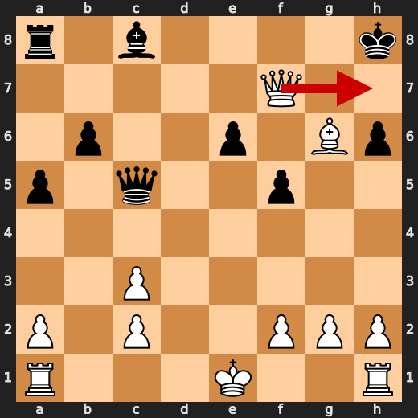

**After 22. Qh7#**

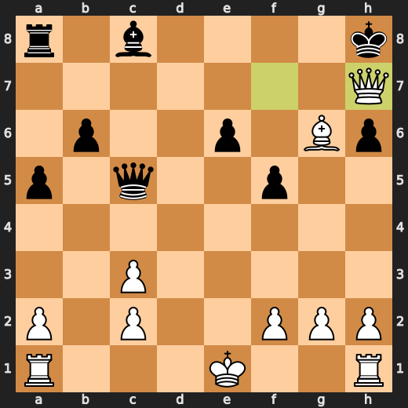

---

## Human Notes

Biggest caveman lesson: CPU (Black) blew it with **19. a5**.

There was another real screw-up at **9. Nxe5** by **CPU (Black)**.

The game-ending shot was **22. Qh7#** by **You (White)**.

---

<details>
<summary>Compact move list</summary>

- 📖 **1. e4** (You (White), Book) — +0.46 → +0.23, preferred `d4`, loss 23 cp
- 📖 **1. c5** (CPU (Black), Book) — +0.37 → +0.27, preferred `e5`, loss 0 cp
- 📖 **2. d4** (You (White), Book) — +0.48 → +0.16, preferred `Ne2`, loss 32 cp
- 📖 **2. cxd4** (CPU (Black), Book) — +0.22 → +0.33, preferred `cxd4`, loss 11 cp
- 📖 **3. Qxd4** (You (White), Book) — +0.12 → +0.14, preferred `Nf3`, loss 0 cp
- 📖 **3. e6** (CPU (Black), Book) — -0.07 → +0.02, preferred `Nc6`, loss 9 cp
- ✅ **4. Nc3** (You (White), Best) — +0.17 → +0.16, preferred `Qe3`, loss 1 cp
- ✅ **4. Nc6** (CPU (Black), Best) — -0.02 → +0.00, preferred `Nc6`, loss 2 cp
- 🔥 **5. Qd1** (You (White), Great) — +0.00 → -0.19, preferred `Qe3`, loss 19 cp
- ✅ **5. Nf6** (CPU (Black), Best) — -0.20 → -0.14, preferred `a6`, loss 6 cp
- 👍 **6. Bg5** (You (White), Good) — -0.12 → -0.71, preferred `Bd3`, loss 59 cp
- 👍 **6. b6** (CPU (Black), Good) — -0.73 → +0.23, preferred `h6`, loss 96 cp
- 🔥 **7. Nf3** (You (White), Great) — +0.16 → -0.14, preferred `Qf3`, loss 30 cp
- 👍 **7. Bb4** (CPU (Black), Good) — -0.35 → +0.42, preferred `h6`, loss 77 cp
- 🔥 **8. e5** (You (White), Great) — +0.38 → +0.20, preferred `Qd3`, loss 18 cp
- 🔥 **8. Bxc3+** (CPU (Black), Great) — +0.30 → +0.76, preferred `h6`, loss 46 cp
- ✅ **9. bxc3** (You (White), Best) — +1.07 → +0.78, preferred `bxc3`, loss 29 cp
- ❌ **9. Nxe5** (CPU (Black), Mistake) — +0.64 → +5.38, preferred `h6`, loss 474 cp
- ✅ **10. Nxe5** (You (White), Best) — +5.41 → +5.30, preferred `Nxe5`, loss 11 cp
- ⚠️ **10. h6** (CPU (Black), Inaccuracy) — +5.29 → +6.92, preferred `Qc7`, loss 163 cp
- ✅ **11. Bxf6** (You (White), Best) — +6.54 → +6.30, preferred `Bxf6`, loss 24 cp
- 👍 **11. gxf6** (CPU (Black), Good) — +6.35 → +6.94, preferred `Qxf6`, loss 59 cp
- 👍 **12. Ng4** (You (White), Good) — +7.27 → +6.58, preferred `Qf3`, loss 69 cp
- ⚠️ **12. f5** (CPU (Black), Inaccuracy) — +6.69 → +8.14, preferred `h5`, loss 145 cp
- 👍 **13. Qd4** (You (White), Good) — +9.12 → +8.00, preferred `Qd4`, loss 112 cp
- ⚠️ **13. O-O** (CPU (Black), Inaccuracy) — +7.76 → +10.27, preferred `Rg8`, loss 251 cp
- ✅ **14. Nf6+** (You (White), Best) — +9.15 → +8.98, preferred `Nf6+`, loss 17 cp
- 🔥 **14. Kh8** (CPU (Black), Great) — +9.38 → +9.63, preferred `Kh8`, loss 25 cp
- ⚠️ **15. Nxd7+** (You (White), Inaccuracy) — +9.59 → +8.23, preferred `Rd1`, loss 136 cp
- 🔥 **15. f6** (CPU (Black), Great) — +8.05 → +8.50, preferred `f6`, loss 45 cp
- ✅ **16. Nxf8** (You (White), Best) — +8.38 → +8.35, preferred `Nxf8`, loss 3 cp
- ✅ **16. Qxf8** (CPU (Black), Best) — +8.60 → +8.63, preferred `Qxf8`, loss 3 cp
- 🔥 **17. Bb5** (You (White), Great) — +8.69 → +8.30, preferred `O-O-O`, loss 39 cp
- ❌ **17. Qc5** (CPU (Black), Mistake) — +8.15 → +13.07, preferred `e5`, loss 492 cp
- ✅ **18. Qxf6+** (You (White), Best) — +13.28 → +14.53, preferred `Qxf6+`, loss 0 cp
- ❌ **18. Kh7** (CPU (Black), Mistake) — +13.32 → +17.66, preferred `Kh7`, loss 434 cp
- ✅ **19. Be8** (You (White), Best) — +20.76 → +70.97, preferred `Qf7+`, loss 0 cp
- 💀 **19. a5** (CPU (Black), Blunder) — +19.53 → White has mate, preferred `Qc7`, loss 98047 cp
- ✅ **20. Bg6+** (You (White), Best) — White has mate → White has mate, preferred `Bg6+`, loss 0 cp
- ✅ **20. Kg8** (CPU (Black), Best) — White has mate → White has mate, preferred `Kg8`, loss 0 cp
- ✅ **21. Qf7+** (You (White), Best) — White has mate → White has mate, preferred `Qf7+`, loss 0 cp
- ✅ **21. Kh8** (CPU (Black), Best) — White has mate → White has mate, preferred `Kh8`, loss 0 cp
- 🏁 **22. Qh7#** (You (White), Checkmate) — White has mate → White has mate, preferred `Qh7#`, loss 0 cp

</details>

---

<details>
<summary>Raw engine table</summary>

| Ply | Move | Actor | Played | Label | Eval Before | Eval After | Preferred | Loss |
|---:|---:|---|---|---|---:|---:|---|---:|
| 1 | 1 | You (White) | e4 | Book | +0.46 | +0.23 | d4 | 23 |
| 2 | 1 | CPU (Black) | c5 | Book | +0.37 | +0.27 | e5 | 0 |
| 3 | 2 | You (White) | d4 | Book | +0.48 | +0.16 | Ne2 | 32 |
| 4 | 2 | CPU (Black) | cxd4 | Book | +0.22 | +0.33 | cxd4 | 11 |
| 5 | 3 | You (White) | Qxd4 | Book | +0.12 | +0.14 | Nf3 | 0 |
| 6 | 3 | CPU (Black) | e6 | Book | -0.07 | +0.02 | Nc6 | 9 |
| 7 | 4 | You (White) | Nc3 | Best | +0.17 | +0.16 | Qe3 | 1 |
| 8 | 4 | CPU (Black) | Nc6 | Best | -0.02 | +0.00 | Nc6 | 2 |
| 9 | 5 | You (White) | Qd1 | Great | +0.00 | -0.19 | Qe3 | 19 |
| 10 | 5 | CPU (Black) | Nf6 | Best | -0.20 | -0.14 | a6 | 6 |
| 11 | 6 | You (White) | Bg5 | Good | -0.12 | -0.71 | Bd3 | 59 |
| 12 | 6 | CPU (Black) | b6 | Good | -0.73 | +0.23 | h6 | 96 |
| 13 | 7 | You (White) | Nf3 | Great | +0.16 | -0.14 | Qf3 | 30 |
| 14 | 7 | CPU (Black) | Bb4 | Good | -0.35 | +0.42 | h6 | 77 |
| 15 | 8 | You (White) | e5 | Great | +0.38 | +0.20 | Qd3 | 18 |
| 16 | 8 | CPU (Black) | Bxc3+ | Great | +0.30 | +0.76 | h6 | 46 |
| 17 | 9 | You (White) | bxc3 | Best | +1.07 | +0.78 | bxc3 | 29 |
| 18 | 9 | CPU (Black) | Nxe5 | Mistake | +0.64 | +5.38 | h6 | 474 |
| 19 | 10 | You (White) | Nxe5 | Best | +5.41 | +5.30 | Nxe5 | 11 |
| 20 | 10 | CPU (Black) | h6 | Inaccuracy | +5.29 | +6.92 | Qc7 | 163 |
| 21 | 11 | You (White) | Bxf6 | Best | +6.54 | +6.30 | Bxf6 | 24 |
| 22 | 11 | CPU (Black) | gxf6 | Good | +6.35 | +6.94 | Qxf6 | 59 |
| 23 | 12 | You (White) | Ng4 | Good | +7.27 | +6.58 | Qf3 | 69 |
| 24 | 12 | CPU (Black) | f5 | Inaccuracy | +6.69 | +8.14 | h5 | 145 |
| 25 | 13 | You (White) | Qd4 | Good | +9.12 | +8.00 | Qd4 | 112 |
| 26 | 13 | CPU (Black) | O-O | Inaccuracy | +7.76 | +10.27 | Rg8 | 251 |
| 27 | 14 | You (White) | Nf6+ | Best | +9.15 | +8.98 | Nf6+ | 17 |
| 28 | 14 | CPU (Black) | Kh8 | Great | +9.38 | +9.63 | Kh8 | 25 |
| 29 | 15 | You (White) | Nxd7+ | Inaccuracy | +9.59 | +8.23 | Rd1 | 136 |
| 30 | 15 | CPU (Black) | f6 | Great | +8.05 | +8.50 | f6 | 45 |
| 31 | 16 | You (White) | Nxf8 | Best | +8.38 | +8.35 | Nxf8 | 3 |
| 32 | 16 | CPU (Black) | Qxf8 | Best | +8.60 | +8.63 | Qxf8 | 3 |
| 33 | 17 | You (White) | Bb5 | Great | +8.69 | +8.30 | O-O-O | 39 |
| 34 | 17 | CPU (Black) | Qc5 | Mistake | +8.15 | +13.07 | e5 | 492 |
| 35 | 18 | You (White) | Qxf6+ | Best | +13.28 | +14.53 | Qxf6+ | 0 |
| 36 | 18 | CPU (Black) | Kh7 | Mistake | +13.32 | +17.66 | Kh7 | 434 |
| 37 | 19 | You (White) | Be8 | Best | +20.76 | +70.97 | Qf7+ | 0 |
| 38 | 19 | CPU (Black) | a5 | Blunder | +19.53 | White has mate | Qc7 | 98047 |
| 39 | 20 | You (White) | Bg6+ | Best | White has mate | White has mate | Bg6+ | 0 |
| 40 | 20 | CPU (Black) | Kg8 | Best | White has mate | White has mate | Kg8 | 0 |
| 41 | 21 | You (White) | Qf7+ | Best | White has mate | White has mate | Qf7+ | 0 |
| 42 | 21 | CPU (Black) | Kh8 | Best | White has mate | White has mate | Kh8 | 0 |
| 43 | 22 | You (White) | Qh7# | Checkmate | White has mate | White has mate | Qh7# | 0 |

</details>

---

<details>
<summary>Clean PGN</summary>

```pgn
[Event "AI Factory's Chess"]
[Site "Android Device"]
[Date "2026.05.18"]
[Round "1"]
[White "You"]
[Black "CPU (5)"]
[Result "1-0"]
[PlyCount "43"]

1. e4 c5 2. d4 cxd4 3. Qxd4 e6 4. Nc3 Nc6 5. Qd1 Nf6 6. Bg5 b6 7. Nf3 Bb4 8. e5
Bxc3+ 9. bxc3 Nxe5 10. Nxe5 h6 11. Bxf6 gxf6 12. Ng4 f5 13. Qd4 O-O 14. Nf6+
Kh8 15. Nxd7+ f6 16. Nxf8 Qxf8 17. Bb5 Qc5 18. Qxf6+ Kh7 19. Be8 a5 20. Bg6+
Kg8 21. Qf7+ Kh8 22. Qh7# 1-0
```

</details>
