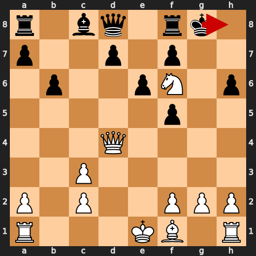
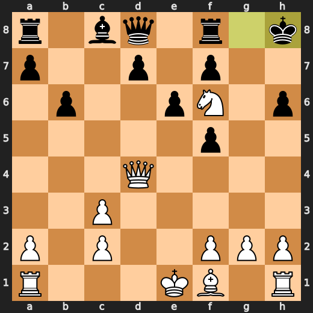
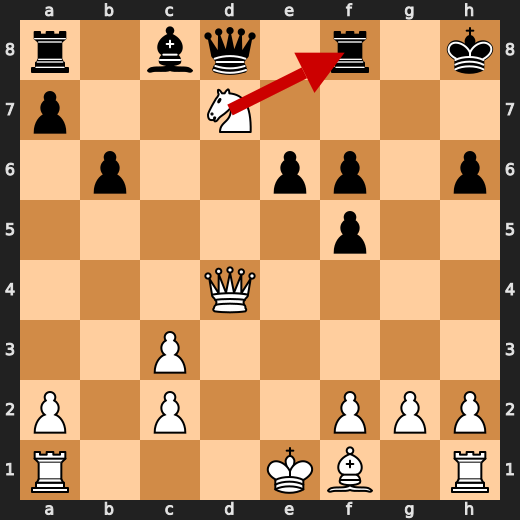
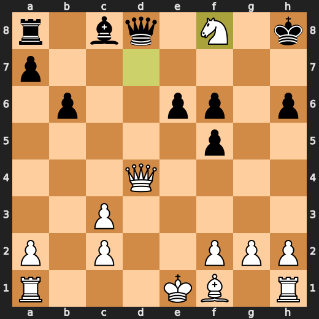
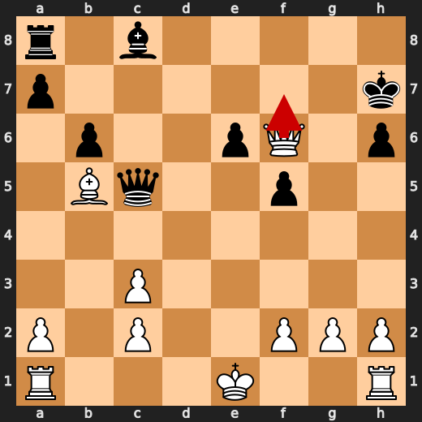
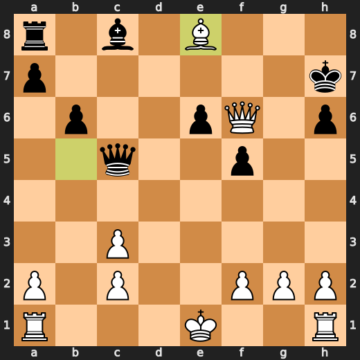

# You (White) vs CPU (Black)

**Result:** 1-0  
**Date:** 2026.05.18  
**Source:** `PGN_2026_05_18_18h49_59e3d254a79c.pgn`  
**Engine:** Stockfish depth 14  
**Your side:** White  
**Computer side:** Black  
**Board perspective:** Standard White-at-bottom

---

## Who Is Who

- **You:** You (White)
- **Computer:** CPU (5) (Black)

---

## Toaster Summary

**Game Story:** In the Sicilian Defense, Black’s 9...Nxe5 and 17...Qc5 let you build a winning attack. Your 19.Be8 let a faster mate slip, so the win was messy rather than clean. Black’s 19...a5 failed to stop the mate, and you finished correctly with 22.Qh7#.

Biggest toaster scream: **19. a5** by **CPU (Black)**.

- **Label:** 💀 **Blunder**
- **Eval:** +66.04 → White has mate
- **Stockfish preferred:** `Qe5+`
- **Loss:** 93396 cp

Final move recorded: **22. Qh7#** by **You (White)**.

- 💀 Your blunders: **1**
- ❌ Your mistakes: **0**
- ⚠️ Your inaccuracies: **1**
- ✅ Your best moves called out: **8**

---

## Final Position


---

## Key Moments

### ❌ Mistake: 9. Nxe5 by CPU (Black)

Nxe5 worsened Black’s position significantly instead of choosing the steadier h6. The practical pattern is to avoid grabbing central material when the engine indicates it gives the opponent a much stronger position.

- **Eval:** +0.72 → +5.65
- **Preferred:** `h6`
- **Loss:** 493 cp

**Before 9. Nxe5**


**After 9. Nxe5**


### ✅ Best: 14. Kh8 by CPU (Black)

Kh8 was the preferred move, so Black did not worsen the position in a meaningful way. The useful pattern is to recognize quiet king moves that keep the position near the engine’s best defense.

- **Eval:** +8.80 → +8.86
- **Preferred:** `Kh8`
- **Loss:** 6 cp

**Before 14. Kh8**



**After 14. Kh8**



### ✅ Best: 16. Nxf8 by You (White)

Nxf8 was the preferred move and kept White’s advantage by making a forcing, engine-approved capture. The useful pattern is to take forcing moves that win material or remove important defenders when the engine confirms they do not spoil the position.

- **Eval:** +8.69 → +8.52
- **Preferred:** `Nxf8`
- **Loss:** 17 cp

**Before 16. Nxf8**



**After 16. Nxf8**



### 💀 Blunder: 17. Qc5 by CPU (Black)

Qc5 worsened Black’s position and failed to address the main problems in the position. e5 was preferred because it would have improved Black’s resistance more than the queen move. Learn to choose stabilizing moves when already under pressure instead of making moves that allow the evaluation to swing further against you.

- **Eval:** +8.46 → +14.69
- **Preferred:** `e5`
- **Loss:** 623 cp

**Before 17. Qc5**


**After 17. Qc5**


### ❌ Mistake: 18. Kh7 by CPU (Black)

Although Kh7 is listed as the preferred move, it still left Black’s position worsening significantly. The practical pattern is to recognize that even the best available move may not solve a position that is already overwhelmingly favorable for White.

- **Eval:** +78.26 → +82.09
- **Preferred:** `Kh7`
- **Loss:** 383 cp

**Before 18. Kh7**


**After 18. Kh7**


### 💀 Blunder: 19. Be8 by You (White)

Be8 worsened a winning position by missing the stronger Qf7+. Learn to choose the forcing check when it is available, because it keeps the advantage much more securely.

- **Eval:** +82.09 → +12.64
- **Preferred:** `Qf7+`
- **Loss:** 6945 cp

**Before 19. Be8**



**After 19. Be8**



### 💀 Blunder: 19. a5 by CPU (Black)

a5 failed to deal with White’s immediate winning attack and let the position become mate for White. Qe5+ was preferred because giving check would have improved Black’s resistance. Learn to prioritize forcing defensive moves when the opponent already has a decisive attack.

- **Eval:** +66.04 → White has mate
- **Preferred:** `Qe5+`
- **Loss:** 93396 cp

**Before 19. a5**


**After 19. a5**


### 🏁 Checkmate: 22. Qh7# by You (White)

Qh7# was the preferred move and converted the already winning position with a game-ending forcing move. Learn to play the direct checkmate when it is available instead of looking for extra moves.

- **Eval:** White has mate → White has mate
- **Preferred:** `Qh7#`
- **Loss:** 0 cp

**Before 22. Qh7#**


**After 22. Qh7#**


---

## Human Notes

Biggest caveman lesson: CPU (Black) blew it with **17. Qc5**.

There was another real screw-up at **9. Nxe5** by **CPU (Black)**.

The game-ending shot was **22. Qh7#** by **You (White)**.

---

<details>
<summary>Compact move list</summary>

- 📖 **1. e4** (You (White), Book) — +0.57 → +0.48, preferred `e4`, loss 9 cp
- 📖 **1. c5** (CPU (Black), Book) — +0.33 → +0.25, preferred `c5`, loss 0 cp
- 📖 **2. d4** (You (White), Book) — +0.39 → +0.27, preferred `Nf3`, loss 12 cp
- 📖 **2. cxd4** (CPU (Black), Book) — +0.13 → +0.34, preferred `cxd4`, loss 21 cp
- 📖 **3. Qxd4** (You (White), Book) — +0.34 → -0.08, preferred `Nf3`, loss 42 cp
- 📖 **3. e6** (CPU (Black), Book) — -0.20 → +0.12, preferred `Nc6`, loss 32 cp
- ✅ **4. Nc3** (You (White), Best) — +0.04 → +0.00, preferred `Qe3`, loss 4 cp
- ✅ **4. Nc6** (CPU (Black), Best) — -0.04 → +0.05, preferred `Nc6`, loss 9 cp
- 🔥 **5. Qd1** (You (White), Great) — +0.12 → -0.10, preferred `Qd1`, loss 22 cp
- ✅ **5. Nf6** (CPU (Black), Best) — -0.05 → -0.02, preferred `Nf6`, loss 3 cp
- 👍 **6. Bg5** (You (White), Good) — -0.04 → -0.89, preferred `Bd3`, loss 85 cp
- 👍 **6. b6** (CPU (Black), Good) — -0.85 → +0.29, preferred `h6`, loss 114 cp
- ✅ **7. Nf3** (You (White), Best) — +0.03 → +0.02, preferred `Nf3`, loss 1 cp
- 👍 **7. Bb4** (CPU (Black), Good) — -0.01 → +0.50, preferred `Bb7`, loss 51 cp
- 👍 **8. e5** (You (White), Good) — +0.69 → -0.03, preferred `Qd3`, loss 72 cp
- 👍 **8. Bxc3+** (CPU (Black), Good) — +0.07 → +0.73, preferred `h6`, loss 66 cp
- 🔥 **9. bxc3** (You (White), Great) — +1.03 → +0.72, preferred `bxc3`, loss 31 cp
- ❌ **9. Nxe5** (CPU (Black), Mistake) — +0.72 → +5.65, preferred `h6`, loss 493 cp
- ✅ **10. Nxe5** (You (White), Best) — +5.83 → +6.28, preferred `Nxe5`, loss 0 cp
- 🔥 **10. h6** (CPU (Black), Great) — +6.10 → +6.57, preferred `Bb7`, loss 47 cp
- 🔥 **11. Bxf6** (You (White), Great) — +6.46 → +6.27, preferred `Bh4`, loss 19 cp
- ⚠️ **11. gxf6** (CPU (Black), Inaccuracy) — +5.39 → +7.53, preferred `Qxf6`, loss 214 cp
- 👍 **12. Ng4** (You (White), Good) — +7.42 → +6.86, preferred `Nc4`, loss 56 cp
- ⚠️ **12. f5** (CPU (Black), Inaccuracy) — +6.03 → +7.66, preferred `h5`, loss 163 cp
- ✅ **13. Qd4** (You (White), Best) — +8.23 → +8.36, preferred `Qd4`, loss 0 cp
- ⚠️ **13. O-O** (CPU (Black), Inaccuracy) — +8.23 → +9.76, preferred `Rg8`, loss 153 cp
- 👍 **14. Nf6+** (You (White), Good) — +9.49 → +8.60, preferred `Nf6+`, loss 89 cp
- ✅ **14. Kh8** (CPU (Black), Best) — +8.80 → +8.86, preferred `Kh8`, loss 6 cp
- ⚠️ **15. Nxd7+** (You (White), Inaccuracy) — +9.26 → +7.84, preferred `Be2`, loss 142 cp
- 🔥 **15. f6** (CPU (Black), Great) — +8.22 → +8.69, preferred `Kh7`, loss 47 cp
- ✅ **16. Nxf8** (You (White), Best) — +8.69 → +8.52, preferred `Nxf8`, loss 17 cp
- ✅ **16. Qxf8** (CPU (Black), Best) — +8.68 → +8.52, preferred `Qxf8`, loss 0 cp
- ✅ **17. Bb5** (You (White), Best) — +8.61 → +8.46, preferred `O-O-O`, loss 15 cp
- 💀 **17. Qc5** (CPU (Black), Blunder) — +8.46 → +14.69, preferred `e5`, loss 623 cp
- 🔥 **18. Qxf6+** (You (White), Great) — +16.75 → +16.33, preferred `Qxf6+`, loss 42 cp
- ❌ **18. Kh7** (CPU (Black), Mistake) — +78.26 → +82.09, preferred `Kh7`, loss 383 cp
- 💀 **19. Be8** (You (White), Blunder) — +82.09 → +12.64, preferred `Qf7+`, loss 6945 cp
- 💀 **19. a5** (CPU (Black), Blunder) — +66.04 → White has mate, preferred `Qe5+`, loss 93396 cp
- ✅ **20. Bg6+** (You (White), Best) — White has mate → White has mate, preferred `Bg6+`, loss 0 cp
- ✅ **20. Kg8** (CPU (Black), Best) — White has mate → White has mate, preferred `Kg8`, loss 0 cp
- ✅ **21. Qf7+** (You (White), Best) — White has mate → White has mate, preferred `Qf7+`, loss 0 cp
- ✅ **21. Kh8** (CPU (Black), Best) — White has mate → White has mate, preferred `Kh8`, loss 0 cp
- 🏁 **22. Qh7#** (You (White), Checkmate) — White has mate → White has mate, preferred `Qh7#`, loss 0 cp

</details>

---

<details>
<summary>Raw engine table</summary>

| Ply | Move | Actor | Played | Label | Eval Before | Eval After | Preferred | Loss |
|---:|---:|---|---|---|---:|---:|---|---:|
| 1 | 1 | You (White) | e4 | Book | +0.57 | +0.48 | e4 | 9 |
| 2 | 1 | CPU (Black) | c5 | Book | +0.33 | +0.25 | c5 | 0 |
| 3 | 2 | You (White) | d4 | Book | +0.39 | +0.27 | Nf3 | 12 |
| 4 | 2 | CPU (Black) | cxd4 | Book | +0.13 | +0.34 | cxd4 | 21 |
| 5 | 3 | You (White) | Qxd4 | Book | +0.34 | -0.08 | Nf3 | 42 |
| 6 | 3 | CPU (Black) | e6 | Book | -0.20 | +0.12 | Nc6 | 32 |
| 7 | 4 | You (White) | Nc3 | Best | +0.04 | +0.00 | Qe3 | 4 |
| 8 | 4 | CPU (Black) | Nc6 | Best | -0.04 | +0.05 | Nc6 | 9 |
| 9 | 5 | You (White) | Qd1 | Great | +0.12 | -0.10 | Qd1 | 22 |
| 10 | 5 | CPU (Black) | Nf6 | Best | -0.05 | -0.02 | Nf6 | 3 |
| 11 | 6 | You (White) | Bg5 | Good | -0.04 | -0.89 | Bd3 | 85 |
| 12 | 6 | CPU (Black) | b6 | Good | -0.85 | +0.29 | h6 | 114 |
| 13 | 7 | You (White) | Nf3 | Best | +0.03 | +0.02 | Nf3 | 1 |
| 14 | 7 | CPU (Black) | Bb4 | Good | -0.01 | +0.50 | Bb7 | 51 |
| 15 | 8 | You (White) | e5 | Good | +0.69 | -0.03 | Qd3 | 72 |
| 16 | 8 | CPU (Black) | Bxc3+ | Good | +0.07 | +0.73 | h6 | 66 |
| 17 | 9 | You (White) | bxc3 | Great | +1.03 | +0.72 | bxc3 | 31 |
| 18 | 9 | CPU (Black) | Nxe5 | Mistake | +0.72 | +5.65 | h6 | 493 |
| 19 | 10 | You (White) | Nxe5 | Best | +5.83 | +6.28 | Nxe5 | 0 |
| 20 | 10 | CPU (Black) | h6 | Great | +6.10 | +6.57 | Bb7 | 47 |
| 21 | 11 | You (White) | Bxf6 | Great | +6.46 | +6.27 | Bh4 | 19 |
| 22 | 11 | CPU (Black) | gxf6 | Inaccuracy | +5.39 | +7.53 | Qxf6 | 214 |
| 23 | 12 | You (White) | Ng4 | Good | +7.42 | +6.86 | Nc4 | 56 |
| 24 | 12 | CPU (Black) | f5 | Inaccuracy | +6.03 | +7.66 | h5 | 163 |
| 25 | 13 | You (White) | Qd4 | Best | +8.23 | +8.36 | Qd4 | 0 |
| 26 | 13 | CPU (Black) | O-O | Inaccuracy | +8.23 | +9.76 | Rg8 | 153 |
| 27 | 14 | You (White) | Nf6+ | Good | +9.49 | +8.60 | Nf6+ | 89 |
| 28 | 14 | CPU (Black) | Kh8 | Best | +8.80 | +8.86 | Kh8 | 6 |
| 29 | 15 | You (White) | Nxd7+ | Inaccuracy | +9.26 | +7.84 | Be2 | 142 |
| 30 | 15 | CPU (Black) | f6 | Great | +8.22 | +8.69 | Kh7 | 47 |
| 31 | 16 | You (White) | Nxf8 | Best | +8.69 | +8.52 | Nxf8 | 17 |
| 32 | 16 | CPU (Black) | Qxf8 | Best | +8.68 | +8.52 | Qxf8 | 0 |
| 33 | 17 | You (White) | Bb5 | Best | +8.61 | +8.46 | O-O-O | 15 |
| 34 | 17 | CPU (Black) | Qc5 | Blunder | +8.46 | +14.69 | e5 | 623 |
| 35 | 18 | You (White) | Qxf6+ | Great | +16.75 | +16.33 | Qxf6+ | 42 |
| 36 | 18 | CPU (Black) | Kh7 | Mistake | +78.26 | +82.09 | Kh7 | 383 |
| 37 | 19 | You (White) | Be8 | Blunder | +82.09 | +12.64 | Qf7+ | 6945 |
| 38 | 19 | CPU (Black) | a5 | Blunder | +66.04 | White has mate | Qe5+ | 93396 |
| 39 | 20 | You (White) | Bg6+ | Best | White has mate | White has mate | Bg6+ | 0 |
| 40 | 20 | CPU (Black) | Kg8 | Best | White has mate | White has mate | Kg8 | 0 |
| 41 | 21 | You (White) | Qf7+ | Best | White has mate | White has mate | Qf7+ | 0 |
| 42 | 21 | CPU (Black) | Kh8 | Best | White has mate | White has mate | Kh8 | 0 |
| 43 | 22 | You (White) | Qh7# | Checkmate | White has mate | White has mate | Qh7# | 0 |

</details>

---

<details>
<summary>Clean PGN</summary>

```pgn
[Event "AI Factory's Chess"]
[Site "Android Device"]
[Date "2026.05.18"]
[Round "1"]
[White "You"]
[Black "CPU (5)"]
[Result "1-0"]
[PlyCount "43"]

1. e4 c5 2. d4 cxd4 3. Qxd4 e6 4. Nc3 Nc6 5. Qd1 Nf6 6. Bg5 b6 7. Nf3 Bb4 8. e5
Bxc3+ 9. bxc3 Nxe5 10. Nxe5 h6 11. Bxf6 gxf6 12. Ng4 f5 13. Qd4 O-O 14. Nf6+
Kh8 15. Nxd7+ f6 16. Nxf8 Qxf8 17. Bb5 Qc5 18. Qxf6+ Kh7 19. Be8 a5 20. Bg6+
Kg8 21. Qf7+ Kh8 22. Qh7# 1-0
```

</details>
